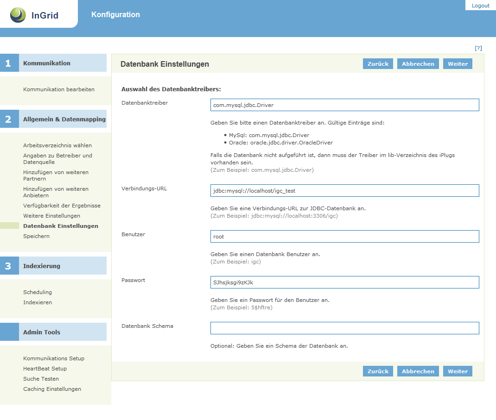

## Allgemeines

Der Datasource Client dient der Indizierung von Inhalten aus Datenbanken. Der DSC Scripted verhält sich hier generisch, das heißt, dass Datenbanken mit beliebiger Datenstruktur angeschlossen werden können. Als Datenbank-Typen werden alle Datenbanken unterstützt, die über JDBC angesprochen werden können. Mit der Installation wird nur der JDBC Treiber für  MYSQL mitgeliefert. Andere Treiber müssen heruntergeladen werden und ins lib-Verzeichnis kopiert werden.

5Vpdc+I2F/41zLQXYWzLn5chJNlt9+2kzc7u9KojLAGatS2PbBLYX79HcBRs5L6QxG5IOzCDORaS/JznfIoRucrXt4qWy/9JxrOR57D1iExHnuf6xIcPLdnsJHEU7gQLJRgO2gvuxXeOQgelK8F41RpYS5nVomwLU1kUPK1bsrnM2kuUdGGm3wvuU5rZ0q+C1UuUumGyv/GBi8US14k9fJiq3pg5GJ/TVVZfbEVwT9/OqZkLn2rt7L56Ec68QUGIcJW0aG3pu5R5S6B4tccKH1fgtnCRmVSMq5aIMzNmWdcawcuRdwNvpsQDHzNFH8dCbkXk1pk4zv2fv86vq/jT19+d9R+zWya+fGHqt+x6N1smim9NLZBrYIKSEpbQV/n6imeaDUbR4Zz6MUlTP/Jd34+Si92ubk4d/qQexQt8jOdO6UUhdcMwZAGlTsouCCrwgWYrRDOnZSmKhdZqqkRZVyMvzGC5yUzB1UJfWUqv+VrLl3WegcCFy6pW8hu/kpnUGihkASMnc5FlByKaiYVWdQqPpJU1eeCqFkDJS7yRC8b0MpPHpaj5fUlTveYjWBvIJIyeZ/IRJEsYx+EHuDk9DTdWeAJuewWCKXOZ81ptNFF3w/0ICYRW7PvI08e9mZghy4aBhCijSJPF08x7JcEF6ulUnRFLZ5ZCFkquyr9FAp0FnZnhuM1XIJQ4bYQCz0YodMdBFIduSAJY0vVCJF8TscAZJ07jhTt+DYCezyifsYilrhOEiWvsqIHf9B5mccRdtgLeH2U7YFswrmfXTO/iZcMQypUq4YeDkBIhRsiJh8RoQO4aA++blTaoSML/x8pqSUt9mW7AdW598zH0NrCqNu9BrJq40VEAA1xmePxsq/5lOtG0tBnJKNgurYBVNldDmmsMi1mlP376WNzqRMNzruA3mdRufTr5+Z25dAlDRK21FCD0/RLBi9vOiyQdluQFNhOMz++XCWjWp1hSBZE645dKbY3kTY3pEEMSWxjG+CBNCMkgIRLTyrMKkZa/7mDZC0JkjDj3CqCHnvEUDjKZrvItKH3Gwm6V2uC2fHUbvA6D9ftPL+ydPiMSvi12Zoq25Zqv54dsR4x8e7MOTIrwZNZos0380B+1zXgAhJ4ROv4Z6u1U9h7M1rXLgjPFzkTcceQ6kDDEEHuThERtGvrjwG+9ztaoz85dHsE9GvtQV8Uk9KMoiSMft4u4J+MmYA4a/vnBbgf4j1CSrf9zrZ1D9+2b702VYYrV1tEQqT+SwSoCjyqlf7CxWhiiVEgOEmGTGDcg9zHUNyH30JheA3nEA5cknjd35w73khk2TJuIi8kKep6v6fkoPXDwqvWwnnAT28e7hqZ99y8sHO3ouW89yDxfFUDGWsjiRa2H/tk9225zeB057RbTkz4aOkpwSN/exVKRHWjvpIKu0OvI3oJwSLcB4baFZdhBd9KB5SB0P6ES2SctKyg3TI+GCQUFiDYE6N7Ild75MxHeUneISOhhmEN8uwAmHe3QPgoZC9+uQuao4zCIi3x70NnE0DiMT3TGsztZCVTBTNa1Plq0PEottRa2M11W5e5oVaOPc0/bB4gpK8hYQHU53za2xynMCceK0HOFDy2HiHKTizWHYpxdGEGgc9+bUsmFonnO1V9kCulwPC7h+G143xTGB2HYsfVtmnpNfRtZr/q2E59LlouXRYt/V4IaOe0Cg3SY5VAJqqUm+7h4OLe3UNzu/kNyJetdIkGmyTB2YYLI07GQ3dAxXevB/eCz+rDvJM6YIGJyIvKGcQYNp4Hvh8+f794kJe3k+yD8PmhYmr8k9V9+wdf9/2G29xp/kyLXPwA=

## Systemvoraussetzungen

* 64 MB RAM
* 50 MB Harddrive

* JAVA 1.6
* Cygwin (unter Windows)

## Installation

Download: [https://dev.informationgrid.eu/ingrid-distributions/ingrid-iplug-dsc-scripted/](https://dev.informationgrid.eu/ingrid-distributions/ingrid-iplug-dsc-scripted/)

Um die Installationsroutine zu starten, doppel-klicken Sie auf das Installationsprogramm oder geben Sie folgenden Befehl auf der Kommandozeile ein:


java -jar ingrid-iplug-dsc-scripted-VERSION-installer.jar


Der Installer ist sowohl per graphischer Oberfläche als auch Kommandozeileneingabe ausführbar. Bitte folgen Sie den Anweisungen des Installationsprogrammes. Das Installationsprogramm installiert die Komponente im gewünschten Verzeichnis und passt die Konfigurationsdateien an.

Sie können nun das iPlug mit


sh start.sh start


starten. 

Das iPlug besitzt eine Administrationsoberfläche über die die angeschlossenen iPlugs eingesehen und verwaltet werden können.


http://localhost:PORT/admin


Anstelle von `localhost` können Sie auch die IP-Adresse des Computers eingeben. Authentifizieren Sie sich als 'admin' mit dem von Ihnen vergebenen Passwort.

Nach der ersten Installation wird die Administrations-GUI unter


http://localhost:8082/admin


aufgerufen und die Konfiguration vervollständigt.

## Aktualisierung

Neues Release von [https://dev.informationgrid.eu/ingrid-distributions/ingrid-iplug-dsc-scripted/](https://dev.informationgrid.eu/ingrid-distributions/ingrid-iplug-dsc-scripted/) herunterladen.

iPlug stoppen.


sh start.sh stop


Aktuelles Installationsverzeichnis sichern:


cp -r /opt/ingrid/ingrid-iplug-dsc-scripted BACKUP_DIRECTORY


Die Aktualisierung erfolgt über den Installer. 


java -jar ingrid-iplug-dsc-scripted-NEW-VERSION-installer.jar


Während der Installation bitte "Upgrade" auswählen und das Installationsverzeichnis Verzeichnis angeben.

iPlug starten.


sh start.sh start


## Betrieb


start.sh [start|stop|restart|status]


Die LOG Ausgaben finden sich in der Datei `log.log` und `console.log`.

## Konfiguration

### Basiskonfiguration

Die Basiskonfiguration für iPlugs kann [hier](iplug_admin_gui.html) eingesehen werden.

### Datenbank Parameter

Die Datenbank wird kann über die Administrationsoberfläche angegeben werden.

### Sonderfall InGrid Catalog (Objekte und Adressen)

Der InGrid Catalog stellt sowohl Objekt-Metadaten als auch Adressen zur Verfügung. Bei der Installation kann ausgewählt werden, welcher Objekttyp installiert werden soll. Beide iPlug Instanzen operieren auf der gleichen Datenbasis.

In diesem Fall muss in der Administrationsoberfläche muss die ID des jeweils korrespondierenden iPlugs eingegeben werden. Diese Angabe wird z.B. dafür benötigt um in der Detaildarstellung eines Objektes alle benötigten Adress-Informationen zu ermitteln, denn dafür muss das korrespondierende Adress-iPlug angefragt werden.

Es gibt einen unten beschriebenen Fall-Back Mechanismus, der dann greift, wenn die korrespondierende iPlug-Id nicht ermittelt werden kann. Um den Fall-Back Mechanismus zu erzwingen muss als korrespondierende iPlug-Id "null" oder ein " " (Leerzeichen) eingegeben werden, da das Feld momentan als Pflichtfeld ausgeführt ist.

**Fallback-Mechanismus**

1. Der Objekt iPlug muss `udk-db` im Namen enthalten

2. Der Adress-iPlug muss den gleichen Namen wie der Objekt-iPlug haben, gefolgt von dem Suffix `_addr`,z.B.: `/kug-group:kug-iplug-udk-db_sh` und `kug-group:kug-iplug-udk-db_sh_addr`.

3. Der Name der Datenquelle muss bei Objekt- und Adress-iPlug gleich sein (z.B. "Hamburger Metadatenkatalog"), damit die Darstellung des Katalogs im PortalU-Hierarchiebaum korrekt ist.

Das Kürzel `udk` steht dabei für Umwelt Daten Katalog, der Vorgänger des InGrid Catalog.

Mit dem iPlug werden Presets für den InGrid Catalog mit ausgeliefert. Diese beinhalten bereits das fertige, umfangreiche Mapping. Die Presets können per Installer ausgewählt werden. Die Presets befinden sich im Verzeichnis `DSC_ROOT/udk_presets`.

### Indexierung von Punkt Koordinaten

Das iPlug ist in der Lage Punkt Koordinaten aus der Datenbank zu indexieren. Ergebnisse mit Punktkoordinaten können in dem Kartenviewer im Portal angezeigt werden (`Zeige Punktkoordinaten` unterhalb des Treffers).

Als Beispiel soll hier die Tabelle `spatial_ref_value` mit den Spalten `x`, `y` verwendet werden.

Um den "Zeige Punktkoordinaten"-Link im Portal für einen Treffer in der Ergebnisliste zu erzeugen, muss ein Feld `kml` mit dem Inhalt `1` im Index Record des Treffers existieren.

Im Index-Mapping des iPlugs muss diese Eigenschaft hinzugefügt werden:


IDX.addNumeric("spatial_ref_value.x", row.get("x"));
IDX.addNumeric("spatial_ref_value.y", row.get("y"));

if(row.get("x") = null & row.get("y") = null) {
	IDX.addNumeric("kml", 1);
}


Diese markierten Zeilen fügen einem Lucene-Dokument das Attribut `kml` mit dem Wert `1` hinzu, falls `x`  und `y` vorhanden ist.

KML-Erstellung

Die Darstellung der Punkt Koordinaten im Kartenkomponente des Portals erfolgt im KML Format. Dieses Format wird bei der IDF Detaildaten Generierung (IDF Mapping) im iPlug.

Um das IDF-Mapping mit KML zu erweitern muss das Mapping-Script `igc-x.x.x_to_idf.js` des DSC-Scripted erweitert werden:


DOM.addNS("xlink", "http://www.w3.org/1999/xlink");
DOM.addNS("kml", "http://www.opengis.net/kml/2.2");

...

// KML
var kml = DOM.addElement(idfBody, "kml:kml");
kml.addAttribute("xmlns:kml", DOM.getNS("kml"));
var rowSpatialReference = SQL.all("SELECT * FROM spatial_reference WHERE obj_id=?", [objId]);

if(hasValue(rowSpatialReference)) {
    var rowT01Object = SQL.first("SELECT * FROM t01_object WHERE id=?", [objId]);

    if(hasValue(rowT01Object)){
		var kmlDocument = DOM.createElement("kml:Document");
		var value = rowT01Object.get("obj_name");
		kmlDocument.addElement("kml:name").addText( value );

		for (i=0; i < rowSpatialReference.size(); i++) {

			var spatialRefId = rowSpatialReference.get(i).get("spatial_ref_id");
			var rowSpatialRefValue = SQL.first("SELECT * FROM spatial_ref_value WHERE id=?", [spatialRefId]);

			var name = rowSpatialRefValue.get("name_value");
			var description= rowSpatialRefValue.get("nativekey");
			var x = rowSpatialRefValue.get("x");
			var y = rowSpatialRefValue.get("y");

			if(x = null && y = null){
				var kmlPlacemark = DOM.createElement("kml:Placemark");
				kmlPlacemark.addElement("kml:name").addText(name);
				kmlPlacemark.addElement("kml:description").addText(description);

				var kmlPoint = DOM.createElement("kml:Point");
				kmlPoint.addElement("kml:coordinates").addText(x + "," + y);

				kmlPlacemark.addElement(kmlPoint);
				kmlDocument.addElement(kmlPlacemark);
				kml.addElement(kmlDocument);
			}
		}
    }
}

...


Dieses Mapping-Beispiel beschreibt die Zusammensetzung des KMLs. Dabei wird ein KML erstellt, welches den Titel des Treffers als `kml:name` verwendet. Enthält der Treffer einen Eintrag in der Datenbank-Tabelle `spatial_ref_value`, so wird aus den Koordinaten-Paar ein Placemark erstellt, welches einen Punkt auf der Karte darstellt. Als Placemark-Name wird hier `name_value` verwendet. Als Beschreibung wird `nativekey` verwendet.

Beispiel-Ergebnis:


<kml:kml xmlns:kml="http://www.opengis.net/kml/2.2">
<kml:Document>
<kml:name>CO2-Emission und C-Umsatz im Boden des ARINUS-Standorts Schluchsee</kml:name>
<kml:Placemark>
<kml:name>Baden-Württemberg</kml:name>
<kml:description>08000000</kml:description>
<kml:Point>
<kml:coordinates>7.51158952713013,47.5323371887207</kml:coordinates>
</kml:Point>
</kml:Placemark>
</kml:Document>
</kml:kml>

    

Diese KML DAten werden im Portal in einer temporären Datei erstellt. Der Pfad für die temporären Daten kann in der Karten-Konfigurations-Datei `wms_interface.properties` im Portal angeben werden. Dafür existiert in der Datei die Eigenschaft "temp_service_path".

Beispiel:


temp_service_path = /opt/portalu/ingrid-auto/ingrid-portal-3.2.0-SNAPSHOT/apache-tomcat-5.5.26/webapps/ROOT/kml


Um die Anzahl der hier erzeugten Dateien zu begrenzen, existiert in der gleichen Konfigurationsdatei die Eigenschaft `temp_service_limit`. Diese kann mit einer Zahl, z.B. 2000, definiert werden und würde bei einer Anzahl von mehr als 2000 Dateien zunächst alle Dateien in dem konfigurierten Verzeichnis löschen, bevor eine neue KML-Datei erzeugt wird.

Am Ende erhält die Kartenkomponente vom Portal den Pfad zur KML-Datei sowie den Treffer-Titel, erstellt aus diesem eine Layer und fügt des der Kartenkomponente unter "Aktiven Dienste" hinzu. 

### InGrid Communication

Die Datei `conf/communication.xml` enthält die Konfigurationen der InGrid Kommunikationsschicht.


<?xml version="1.0" encoding="UTF-8"?>
<communication xmlns:xsi="http://www.w3.org/2001/XMLSchema-instance"
    xsi:noNamespaceSchemaLocation="communication.xsd">
    <client name="/ingrid-group:iplug-management-'Ihr-Name'">
        <connections>
            <server name="/ingrid-group:ibus-'Ihr-Name'">
                <socket port="9900" timeout="10" ip="127.0.0.1" />
                <messages maximumSize="1048576" threadCount="100" />
            </server>
        </connections>
    </client>
    <messages queueSize="2000" handleTimeout="10"/>
</communication>


Die einzelnen Parameter haben folgende Bedeutung:

| Parameter                           | Beschreibung                                             |
|-------------------------------------|----------------------------------------------------------|
| client/@name                        | Eindeutige ID des iPLugs  |
| server/@name                        | Eindeutige ID des InGrid iBus  |
| socket/@port                        | Port unter dem die Administrations GUI zu erreichen ist |
| socket/@timeout               | Timeout der Socketverbindungen in sec |
| message/@maximumSize                | max. zulässige Größe einer Message in Bytes, die über den iBus versendet werden kann |
| message/@threadCount                | Anzahl der Verbindungen (Threads), die der iBus gleichzeitig aufrecht erhalten kann |
| message/@handleTimeout              | Timeout einer Message in sec (Wie lange wartet der iBus auf die Beantwortung einer Message.) |
| message/@queueSize                  | Message Queue (Wie viele Nachrichten können in der Warteschlange des iBus enthalten sein.) |

## FAQ

### Wie kann eine Access Datenbank Verbindung angeschlossen werden

Wollen Sie eine MS-Access Datenbank verwenden, bedarf es zuvor der Einbindung dieser in Ihr Windows System.

Dazu gehen Sie zu der ODBC Konfigurationsverwaltung. Ist Ihre Datenbank bisher noch nicht in der Liste enthalten, können Sie diese hier aufnehmen.

Ist dies getan können Sie bei der IPlug-Konfiguration den Typ "Access" auswählen. Im Feld "DB URL" wird automatisch "jdbc:odbc:" erscheinen. Fügen Sie nun hier den von Ihnen vergebenen Datenbanknamen hinten an.

Eine Authentifizierung ist bei MS-Access Datenbanken nicht möglich, daher bleiben die Felder "Benutzername" und "Passwort" leer. 

### Die iPlug Administration funktioniert nicht, es können keine Partner/Anbieter ausgewählt werden.

Mögliche Ursachen:

* Falsche Datenbank Verbindungsparameter 
* Keine Verbindung zum iBus
* iPlug Management funktioniert nicht

Bitte analysieren Sie das log file des iPlugs.

Sie müssen nach einer Änderung der Konfiguration das iPlug neu starten

