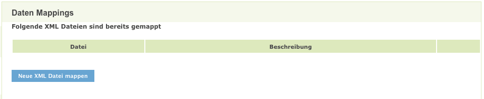
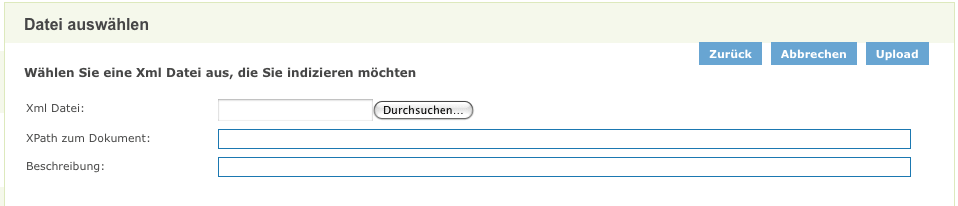
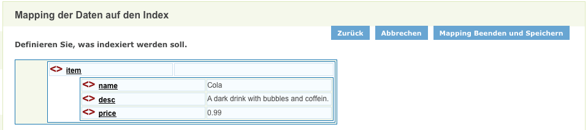
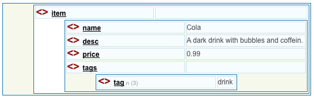
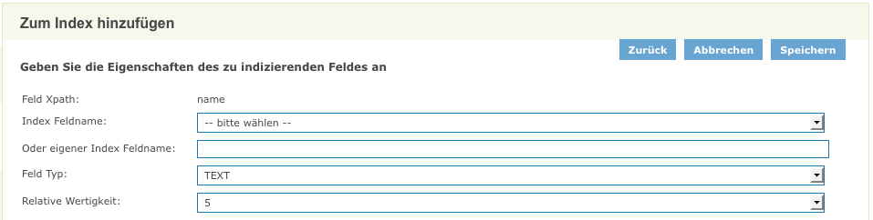
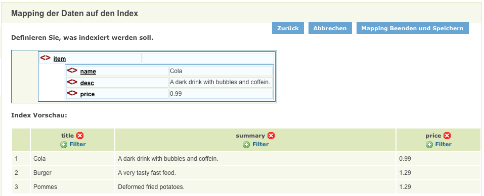
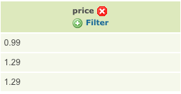
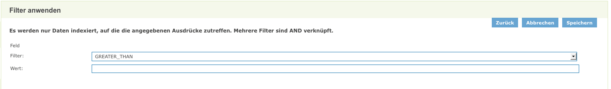
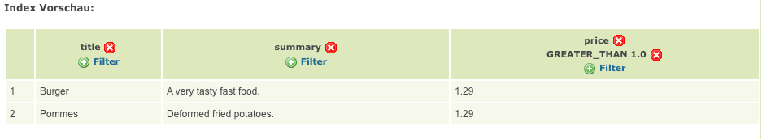

## Allgemeines

Das iPlug dient dem Indexieren von XML Daten. Die XML Daten müssen in Form von Dateien vorliegen. Die Daten können komfortabel über die Administrationsoberfläche in einen Index abgebildet werden.

7Vpbb6s4EP41eQwCzPWx6W0vPatKldrd87JywCHeAkaO06bn158xGScQ6OkttGm1SqTA2Izt7xvPxWREjovVuaTV/JtIWT5y7XQ1Iicj13U84sGPljysJVEYrAWZ5Cl22gqu+A+GQhulS56yRaujEiJXvGoLE1GWLFEt2Uzk7SEqmhn1W8FVQvOu9Ianao5SJ4i3Db8xns1xnMjFxSzUg9GRshld5mpci6BNNxfU6MJVrez1LTEKHlDg+JuhytacfghRtASSLbZg4Xo5zgtHmQqZMtkSsdT0mSulITwauWfwTSW/Y1Yq6b3FRS0i5/bEtq/++XN2uogubq5ddf39prr+/t9ff1Dndq0t5+VtkwZyCqYghYAh9FWxOma5NgfDdDCjXkSSxAs9x/PCeLye1dlzu2/4kazEZbxUpRsG1AmCIPUptZN0HK1V3tF8iWB2GF3MaaUvF7zMcnYkpbgfkcn9nCt2VdFEN92D8YNsrooc7hy4fIBxod/T88U13TGpmNk1GyxhWzFRMCUftNGsWz0bucQd5RFUcb812SBci+YNYyX4GEXGso3mLV5wgZD1wzcLZ8T2/DimjIaJN0brbaD397cL3f8yX2YjN8hh7MlUwlWmrzrQSrEsU6aVa8yegLRaygoeHALSEL2UgdTBhTUgdQjKmpgGe8C0Y5LIXQPU3wGkVQc8WJwGtYHQQklxy45FLvSuL0UJPScznuc7IprzTLuXBDDUDmKioeLgB4+woeBpqofppURA75k2bnIyh34MHkBm98uK7+NeRFZ8r8uKj/u3SYo3BCmG/QYrBa0qcAmalETySi2eYfBfnTMvJE9yFiI/g28kgrH0V849AxdUvQGJTeZBp0ZlvZTn+5q4x307lh9GgRMQH9Q5btDjenzbiu3tJ8KNsFcA3a4rejQ6piJZFjV+r/bjj/L3tPk1XcIOeH6fh2hhZxjYr/EhVIePnWltpxXm9sORJfbUZQGhNKZJHDkuZnhNYPlkCc73LbmF1B0nAtq50gD4OMi+vWMbYzfuguyY8LVv99jB0Uy/mWec66rMtY9FUSxLiC6Ki/JVYW3/4WpaT3N4jux2BHMJmnmDo7gnvd5H1tGhCKfSoOhSSEXhmbcYewvCQUuVnWzAMXbcyqt7wBzE3jHuPs8hLyGcm1Iv5RICvN4JUASKpZ75CyGubXeIFNltJxOkB2BTHraThwHwxX3SwvdJz2EQ50V9NtPE0HiMCzpl+aVYcKRgKpTShyEdl6KEZqHWdLSo1qdBGn3UfdI+8kjSklgcsrcZh60jrQR0wkEIVRR+tBxCylnBVwyCaTo2At/RCFVSZJIWBZP/kpOx40ZWBYXA8M4piHZqf3MW0ODbdGnybWR75btbER2lBX9duPhaVVAQYzZuaOrZlkNVrh2aXpTDv9HtZZLVoO64PynUOpMgJybj2TPgpB1oPFOcNf1gz74YxA8eYtXp+/jcL6pOc/Q8OECmtHif0uhRfj5BVdmFrpu0HyZ02Eqs0LGD2IlcEsUxCXes0PK91udQS04d9D8T7KEFHpBEJPDCMI5Cr32QGltNvGzUfoCod8ufL5CxYzzelJfvl7H709gOfCeeRp6duLNpT0VUv77Zzd/OeA6vYP9P64ghxrgv487eIa3rcNdXbX10lkF2jLsvDRsqy+gANEikfOys5FF6PkGS0Zn7IMFuAOT6cwzz7rs/x7DR5x0e6i8Kdh+P+k6KYf7n05tiOGYt74063G7/jlK3Nf6mRE5/Ag==

## Systemvoraussetzungen

* 64 MB RAM
* 50 MB Harddrive

* JAVA 1.7
* Cygwin (unter Windows)

## Installation

Download: [https://dev.informationgrid.eu/ingrid-distributions/ingrid-iplug-xml/](https://dev.informationgrid.eu/ingrid-distributions/ingrid-iplug-xml/)

Um die Installationsroutine zu starten, doppel-klicken Sie auf das Installationsprogramm oder geben Sie folgenden Befehl auf der Kommandozeile ein:


java -jar ingrid-iplug-xml-VERSION-installer.jar


Der Installer ist sowohl per graphischer Oberfläche als auch Kommandozeileneingabe ausführbar. Bitte folgen Sie den Anweisungen des Installationsprogrammes. Das Installationsprogramm installiert die Komponente im gewünschten Verzeichnis und passt die Konfigurationsdateien an.

Sie können nun das iPlug mit


sh start.sh start


starten. 

Das iPlug besitzt eine Administrationsoberfläche über die die angeschlossenen iPlugs eingesehen und verwaltet werden können.


http://localhost:PORT/admin


Anstelle von `localhost` können Sie auch die IP-Adresse des Computers eingeben. Authentifizieren Sie sich als 'admin' mit dem von Ihnen vergebenen Passwort.

Nach der ersten Installation wird die Administrations-GUI unter


http://localhost:8082/admin


aufgerufen und die Konfiguration vervollständigt.

## Aktualisierung

Neues Release von [https://dev.informationgrid.eu/ingrid-distributions/ingrid-iplug-xml/](https://dev.informationgrid.eu/ingrid-distributions/ingrid-iplug-xml/) herunterladen.

iPlug stoppen.


sh start.sh stop


Aktuelles Installationsverzeichnis sichern:


cp -r /opt/ingrid/ingrid-iplug-xml BACKUP_DIRECTORY


Die Aktualisierung erfolgt über den Installer. 


java -jar ingrid-iplug-xml-NEW-VERSION-installer.jar


Während der Installation bitte "Upgrade" auswählen und das Installationsverzeichnis Verzeichnis angeben.

iPlug starten.


sh start.sh start


## Betrieb


start.sh [start|stop|restart|status]


Die LOG Ausgaben finden sich in der Datei `log.log` und `console.log`.

## Konfiguration

### Basiskonfiguration

Die Basiskonfiguration für iPlugs kann [hier](iplug_admin_gui.html) eingesehen werden.

### Indexierung von Excel Dateien

#### Mapping

Im Bereich `XML Daten Mapping` können die zu indexierenden XML Dateien verwaltet werden.

Um eine neue Datei zu mappen, drücken Sie den Button `Neue Excel Datei mappen`.

Existieren bereits abgebildete Dateien gibt es folgende Möglichkeiten die Einstellungen zu überarbeiten:

- `Löschen`: löscht eine Abbildung
- `Bearbeiten`: öffnet das Mapping des XML Files, damit man diese bearbeiten kann 
- `Datei aktualisieren`: für den Fall, dass sich der Inhalt der originalen Datei geändert hat 

#### Datei auswählen 

Fügen Sie eine XML Datei zum mapping hinzu, müssen Sie als erstes die Datei selbst und das Hauptelement angeben.

- `XPath zum Dokument`: der XPath Ausdruck, welcher die Knotenmenge angibt, über welcher iteriert werden soll.
- `Beschreibung`: eine Beschreibung der Daten (optional).

Hierzu ein Beispiel eines XPath :

Wir nehmen an, bei der XML Datei handelt es sich um Daten eines Geschäfts ( store ) welches Waren vertreibt ( wares ).

Das Hauptelement sollen dabei die einzelnen Artikel ( item ) sein, über die iteriert werden sollen.

Der Inhalt bzw. die Struktur einer solchen XML Datei könnte folgendermaßen aussehen.


<!--?xml version="1.0"?-->
<store>
  <name>Mein Laden</name>
  <wares>
    <item>
      <name>Cola</name>
      <desc>A dark drink with bubbles and coffein.</desc>
      <price>0.99</price>
    </item>
[...]
  </wares>
</store>


Die `item` Elemente können mit XPath demnach entweder 

- (1) explizit mit `store/wares/item` angegeben werden oder aber 
- (2) über einen relativen Pfadausdruck wie `//item`. 

Diese Ausdrücke lassen sich wie ein Verzeichnispfad lesen: 

- (1) ein `item` liegt in dem Element `wares` welches wiederum im Hauptelement `store` liegt oder 
- (2) irgendwo unterhalb des Wurzelknotens `/`.

#### Felder definieren 

Sobald eine XML Datei erfolgreich hochgeladen worden ist, können Sie einzelne Felder definieren, welche später indexiert werden.

Als erstes sehen Sie eine Übersicht aller verfügbaren Felder im Hauptelement.

Es ist auch möglich, dass Ihr Element weitere Elemente enthält.

Die Anzahl wird dabei gegraut neben dem Namen des Elements beschrieben. So hat das erste `item` Element beispielsweise drei `tag` Elemente im `tags` Element.

Um ein Feld zu mappen, klicken Sie einfach auf den Namen des Elements.

Daraufhin erscheint eine Oberfläche in der Sie dem Feld einen **Feldnamen** und **Feldtyp** zuordnen können (Abbildung 4).

Zudem ist es möglich die Wertigkeit dieses Feldes über das Eingabefeld **Relative Wertigkeit** zu ändern (der Wert "5" ist normal, höhere Werte stehen für höhere Wertigkeit).

Ein evtl. vorhandener begrifflicher Raumbezug kann durch das Abbilden auf das Indexfeld `location` für das InGrid-System durchsuchbar gemacht werden.

Sie können den automatisch ermittelten XPATH beliebig anpassen, um nur bestimmte Elemente aus dem XML Dokument zu indexieren. Der eingetragene XPATH bezieht sich immer relativ zum Basis-XPATH des Dokumentes.

Es gibt vier verschiedene Feldtypen :

- `TEXT` : für Text aller Art.
- `KEYWORD` : ebenfalls Text, jedoch ein Schlüsselbegriff (meistens nur ein Wort).
- `NUMBER` : Zahlen aller Art (ganze und Fließkommazahlen).
- `BOOLEAN` : Werte für wahr ( *true* ) und falsch ( *false* ). 

Die Auswahl des **Feldtyps** spielt eine Rolle für Filter und Indexierung.

So sind bestimmte Filter nur verfügbar, wenn das Mapping weiß, dass es sich in diesem Feld um eine Zahl handelt (wie z.B. das Vergleichen von Zahlen).

Desweiteren werden Felder des Typs `TEXT` anders indexiert als Felder des Typs `KEYWORD`.

Während ein `TEXT` in mehrere Token aufgesplittet wird (wie z.B. der Satz "Ich lebe." in die Token "Ich", "lebe" und ".") gelangt ein `KEYWORD` unangetastet in den Index.

Es empfiehlt sich daher - nicht zuletzt zum Zweck der Suchoptimierung - lange Texte oder Sätze mit dem Feldtyp `TEXT` zu versehen, Bezeichner (wie IDs oder Namen) jedoch als `KEYWORD`.

> ACHTUNG : Da alle Werte im Index als String abgelegt werden, werden Felder vom Typ `NUMBER` zu einem String mit führenden Nullen konvertiert, um einen Bereichs Vergleich zu ermöglichen ("&gt;" oder "&lt;"). Bei der direkten Suche auf diesem Feld per InGrid Query müssen diese führenden Nullen also berücksichtigt werden ! Soll ein numerischer Wert unverändert in den Index übernommen werden, so sollte als Feldtyp `TEXT` gewählt werden. Die genaue Abbildung eines NUMBER Feldes in den Index kann auch in der Detaildarstellung im Portal eingesehen werden.

Während Sie die Felder mappen, sollten Sie bermerken, wie Sich die Vorschau unterhalb der Felderübersicht ändert.

Dies entspricht der Ansicht, wie es später im Index erscheint.

####Filter einfügen

Manchmal ist es nicht gewollt, dass alle Einträge im Index erscheinen aus diesem Grund ist das definieren von Filtern möglich.

Nehmen wir für dieses Beispiel an, dass wir nur Artikel mit einem Preis von mehr als 1.00 indexieren lassen wollen.

Bisher sind auch Artikel im Index vorhanden, welche weniger als 1.00 kosten.

Um nun auf dieses Feld einen Filter anzuwenden, müssen wir nur auf den Link `Filter` drücken und es erscheint eine Übersicht, in der wir unseren Filter konfigurieren können.

- `GREATER_THAN` : lässt nur Felder zu, deren Wert größer als der Wert ist.
- `LOWER_THAN` : lässt nur Felder zu, deren Wert kleiner als der Wert ist.
- `CONTAINS` : lässt nur Felder zu, die den Wert enhalten.
- `NOT_CONTAIN` : lässt nur Felder zu, die den Wert nicht enhalten.
- `EQUAL` : lässt nur Felder zu, die dem Wert gleichen.
- `NOT_EQUAL` : lässt nur Felder zu, die dem Wert nicht gleichen. 

Der Wert ist hierbei frei wählbar und kann sowohl eine Zahl als auch eine Zeichenkette sein.

> ACHTUNG: wird ein Feld eines Elements durch einen Filter gefiltert, erscheint nicht nur das Feld sondern der gesamte Eintrag nicht im Index!

Als Ergebnis für oben genanntes Beispiel (durch einen "GREATER_THAN 1"-Filter) könnte die Vorschau beispielsweise wie folgt aussehen:

Ein Klick auf das Kreuz neben dem Filter entfernt diesen. 

**Anmerkungen zur Verwendung des Feldtyps:**

Der Filter ist unabhängig vom Datentyp des Ergebnisses eines XPath-Ausdrucks beziehungsweise eines indexierten XML-Elements. Entscheidend für das funktionieren des Filters ist, ob der Inhalt eines Feldes entsprechend des Filtertyps interpretiert werden kann. D.h., wenn ein `GREATER THAN` Filter verwendet wird, sollte der Inhalt als numerischer Wert interpretierbar sein. 

> ACHTUNG: Die Filter `GREATER THAN` und `LOWER THAN` lassen sich (leider) nicht zur alphanumerischen Sortierung verwenden (B > A). Die Anwendung eines Filters dieser Art auf einen nicht-numerischen Eintrag würde keine Ergebnisse zurücklassen. 

### Weitere Hinweise

#### Verwenden der Indexspalten in der InGrid Suche 

Indexspalten können direkt als Parameter in der InGrid Suche verwendet werden. Dies ist allerdings nicht mit der Filterfunktion zu verwechseln. Während der Filter mit Vergleichsoperationen arbeitet, wird bei der Verwendung der Indexspalte als Query-Parameter lediglich auf die Gleichheit (Existenz) eines Wertes geprüft.

Beispiel: Suche nach `title:Burger` würde den entsprechenden indexierten Eintrag liefern.

Etwas komplizierter ist die Angelegenheit bei numerischen Werten. Wenn für eine Indexspalte als Feldtyp `NUMBER` gewählt wurde, so werden diese Werte zwar vom Filter so behandelt, im Index jedoch werden alle Werte als String abgelegt. Numerische Werte werden dabei auf folgende Weise mit führenden Nullen versehen:


11 -> 0000000011
19.8 -> 0000000019.8


In der InGrid Suche müsste also beispielsweise `price:0000000001.29` angegeben werden.

Wenn hingegen ein numerischer Wert aus der XML Datenquelle als `TEXT` im Mapping definiert ist, so wird der Wert als direkte String-Repräsentation des Wertes abgelegt. In diesem Fall ist allerdings ein numerischer Filter nicht möglich! In der InGrid Suche kann, wenn price als Feldtyp `TEXT` spezifiziert ist, mit `price:1.29` gesucht werden.

Als weiterer Sonderfall ist zu betrachten, wenn das Ergebnis eines XPath-Ausdrucks eigentlich ein ganzzahliger (Integer) Wert ist. Wenn für eine Indexspalte auf einem solchen XML-Element als Feldtyp `TEXT` gewählt wird, so wird der ganzzahlige Wert dennoch als Dezimalwert dargestellt.

Beispiel: Mapping auf dem Dokument `mondial.xml`, der Pfad `//country` gibt die Contextknoten für das Mapping an.

XPath-Ausdruck: `count(.//city)` liefert die Anzahl der Städte in einem Land, die Indexspalte wird `country_number_of_cities` genannt und der Feldtyp `TEXT` zugewiesen.

In der Suche kann der Parameter natürlich verwendet werden, allerdings ist es nicht intuitiv hier Dezimalwerte anzugeben: `country_number_of_cities:84.0`  würde Deutschland zurückgeben.

Abhilfe: Verwenden der XPath-Funktion `string(XPATH-Ausdruck)`. Damit wird explizit ein String zurückgegeben. Bei Numerischen Werten fällt dann die Transformation zu einem Dezimalwert weg.

Beispiel: Im Mapping folgenden XPath-Ausdruck verwenden: `string(count(.//city)`. Jetzt kann in der Suche country_number_of_cities:84 angegeben werden.

Beim Anlegen des Mappings muss sich also der Administrator / Datenpfleger gut überlegen, in welcher Weise der Index in der Suche später verwendet werden soll.

#### Große XML-Dateien

Für sehr große XML-Dateien ist das XML-DSC in der jetzigen Implementierung nicht geeignet. Für das Mapping der XML_Struktur auf einen Index wird das XML-Dokument als DOM im Hauptspeicher repräsentiert. Bei hinreichend großen Dokumenten hierfür der bereitgestellte Arbeitsspeicher des iPlugs nicht aus. Das Problem dürfte bei Dokumenten ab einer Größe von `>50MB` auftreten, womöglich auch schon bei kleineren. Um das Indexieren für große XML-Dateien zu realisieren, müsste das Dokument mit einem SAX-Parser o.ä. geparsed werden. 

### InGrid Communication

Die Datei `conf/communication.xml` enthält die Konfigurationen der InGrid Kommunikationsschicht.


<?xml version="1.0" encoding="UTF-8"?>
<communication xmlns:xsi="http://www.w3.org/2001/XMLSchema-instance"
    xsi:noNamespaceSchemaLocation="communication.xsd">
    <client name="/ingrid-group:iplug-management-'Ihr-Name'">
        <connections>
            <server name="/ingrid-group:ibus-'Ihr-Name'">
                <socket port="9900" timeout="10" ip="127.0.0.1" />
                <messages maximumSize="1048576" threadCount="100" />
            </server>
        </connections>
    </client>
    <messages queueSize="2000" handleTimeout="10"/>
</communication>


Die einzelnen Parameter haben folgende Bedeutung:

| Parameter                           | Beschreibung                                             |
|-------------------------------------|----------------------------------------------------------|
| client/@name                        | Eindeutige ID des iPLugs  |
| server/@name                        | Eindeutige ID des InGrid iBus  |
| socket/@port                        | Port unter dem die Administrations GUI zu erreichen ist |
| socket/@timeout               | Timeout der Socketverbindungen in sec |
| message/@maximumSize                | max. zulässige Größe einer Message in Bytes, die über den iBus versendet werden kann |
| message/@threadCount                | Anzahl der Verbindungen (Threads), die der iBus gleichzeitig aufrecht erhalten kann |
| message/@handleTimeout              | Timeout einer Message in sec (Wie lange wartet der iBus auf die Beantwortung einer Message.) |
| message/@queueSize                  | Message Queue (Wie viele Nachrichten können in der Warteschlange des iBus enthalten sein.) |

## FAQ

### Die iPlug Administration funktioniert nicht, es können keine Partner/Anbieter ausgewählt werden.

Mögliche Ursachen:

* Falsche Datenbank Verbindungsparameter 
* Keine Verbindung zum iBus
* iPlug Management funktioniert nicht

Bitte analysieren Sie das log file des iPlugs.

Sie müssen nach einer Änderung der Konfiguration das iPlug neu starten

