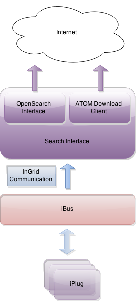

## Allgemeines

Die Such-Schnittstelle beinhaltet alle Schnittstellen, die Anfragen direkt an die InGrid Recherche stellen. Dabei werden die Anfragen in InGrid Queries transformiert, an den iBus versendet und die Antworten in das jeweils geforderte Format umgewandelt.

Unterstützte Schnittstellen:

- OpenSearch Schnittstelle
- ATOM Download Service

<figcaption class="figcaption">InGrid Komponente Such-Schnittstelle</figcaption>

## Systemvoraussetzungen

* 64 MB RAM
* 50 MB Harddrive

* JAVA 1.7
* Cygwin (unter Windows)

## Installation

Download: [https://dev.informationgrid.eu/ingrid-distributions/ingrid-interface-search/](https://dev.informationgrid.eu/ingrid-distributions/ingrid-interface-search/)

Um die Installationsroutine zu starten, doppel-klicken Sie auf das Installationsprogramm oder geben Sie folgenden Befehl auf der Kommandozeile ein:


java -jar ingrid-interface-search-VERSION-installer.jar


Der Installer ist sowohl per graphischer Oberfläche als auch Kommandozeileneingabe ausführbar. Bitte folgen Sie den Anweisungen des Installationsprogrammes. Das Installationsprogramm installiert die Komponente im gewünschten Verzeichnis und passt die Konfigurationsdateien an.

Sie können nun die Komponente mit


sh start.sh start


starten. 

## Aktualisierung

Neues Release von [https://dev.informationgrid.eu/ingrid-distributions/ingrid-interface-search/](https://dev.informationgrid.eu/ingrid-distributions/ingrid-interface-search/) herunterladen.

Komponente stoppen.


sh start.sh stop


Aktuelles Installationsverzeichnis sichern:


cp -r /opt/ingrid/ingrid-interface-search BACKUP_DIRECTORY


Die Aktualisierung erfolgt über den Installer. 


java -jar ingrid-interface-search-NEW-VERSION-installer.jar


Während der Installation bitte "Upgrade" auswählen und das Installationsverzeichnis Verzeichnis angeben.

Komponente starten.


sh start.sh start


## Betrieb


start.sh [start|stop|restart|status]


Die LOG Ausgaben finden sich in der Datei `log.log` und `console.log`.

## OpenSearch Schnittstelle 

Die OpenSearch Schnittstelle basiert auf der OpenSearch Spezifikation [http://www.opensearch.org](http://www.opensearch.org). Sie dient vor allem der Integration der InGrid Suche in andere Systeme.

Die Definition der Schnittstelle wurde erweitert, um die Besonderheiten der Ingrid-Suche abbilden zu können. 

Die Schnittstelle wird per HTTP/GET angefragt. Sie hat 2 Methoden:

- Anfordern des OpenSearch descriptors (`descriptor`)
- Absetzen einer Suche (`query`)

Über die query-Methode ist es auch möglich Detailinformationen über den oder die Datensätze zu bekommen. Diese werden dann für jeden Hit in die Antwort (RSS2.0 kompatibles XML-Format) geschrieben. 

### Request

Folgende Parameter sind zulässig:

| Methode | Parameter | Beschreibung |
| === | === | === |
| descriptor |   | Keine Parameter, liefert den OpenSearch Descriptor, der die Such-Anfrage Syntax beschreibt |
| query | q | Die Query entspricht dem Query-String im Portal (siehe Beschreibung der [Ingrid-Querysyntax](../system/querysyntax.html)). |
| | p | angeforderte Seite der Suchergebnisse; Standard: 1 |
| | h | Treffer pro Seite; Standard: 10 |
| | t | Timeout für die Such-Anfragen an das InGrid System.  Dieses Timeout beeinflusst nur die Such-Anfragen an die iPlugs, welche nur einen Teil der Kommunikation darstellen. Die eigentliche Dauer eines OpenSearch Aufrufen ist etwas länger, dennoch kann die Ausführungszeit, evtl. auf Kosten der Ergebnismenge, beeinflusst werden. Das max. Timeout wird über die Einstellung `ibus.search.max.timeout` in der `ingrid-opensearch.properties` gesetzt. Über den Parameter `t` kann kein Timeout definiert werden, was höher als das maximale Timeout ist. Wird der Parameter nicht angegeben, wird als Timeout immer das maximale Timeout verwendet. |
| | xml | Art des Trefferlinks bei Metadatentreffern (Standard: xml=0)    Bei xml=1 verweisen die Links für Metadatentreffer auf dieselbe Opensearch-Schnittstelle, welche dann die Detailinformation zum jeweiligen Datensatz aufbereitet und ausgibt.    Bei xml=0 verweisen die Links für Metadatentreffer auf die Detaildarstellung der Portalkomponente. |
| | georss | Geo-Referenzierung mit ausgeben (Standard: georss=0) |
| | ingrid | Zusätzliche InGrid Informationen wie *partner*, *provider* etc. per Ergebnis mit ausgeben (Standard: ingrid=0) |
| | detail | Fügt in die Antwort die Detailinformationen zu jedem Treffer im InGridDataFormat (IDF) hinzu, wenn 'ingrid = 1' und 'xml = 0'; Standard: 0 |

Bsp:


http://dev.informationgrid.eu/opensearch/descriptor


... liefert den OpenSearch Descriptor, der die Schnittstelle beschreibt.


http://dev.informationgrid.eu/opensearch/query?q=wasser+boden+datatype:default+ranking:score&p=1&h=20


... fordert 20 Ergebnisse aus den 'default' Datenquellen (z.B. iPlug-SE, iPlug-UDK-DB) der ersten Seite für die query "wasser boden" an, sortiert nach Relevanz . Der Link zum Detail von Metadaten verweist auf die Portal-Darstellung (Parameter xml=0 oder nicht angegeben).


http://dev.informationgrid.eu/opensearch/query?q=boden+datatype:metadata+ranking:score&p=1&h=20&ingrid=1&xml=1


... fordert 20 Ergebnisse aus den 'metadata' Datenquellen (z.B. iPlug-UDK-DB) der ersten Seite für die query "boden" an, sortiert nach Relevanz . Zusätzliche InGrid Informationen werden je Ergebnis mit ausgegeben (Parameter ingrid=1 ). Der Link zum Detail von Metadaten verweist auf die OpenSearch-Darstellung (Parameter xml=1 ).

### Deskriptor-Response

Der Deskriptor der Opensearch-Schnittstelle gibt an, wie die Schnittstelle angefragt werden kann. Als Antwort erhält man eine oder mehrere URLs mit Platzhaltern, mit der man individuelle Anfragen stellen kann. Kommen mehrere URLs in einer Antwort vor, dann werden verschiedene Ausgabetypen unterstützt, wie z.B. rss und atom. Die Platzhalter sind im folgenden aufgeführt:

| Platzhalter | Optional | Beschreibung |
| == | == | ==  |
| {ingridsearch:timeout} | X | Siehe Parameter "t" der Methode "query" |
| {searchTerms} | Siehe Parameter "q" der Methode "query" |
| {geo:box} | X | Angabe von einer BoundingBox mit den Koordinaten "x1 y1 x2 y2" |
| {startPage} | X | Siehe Parameter "p" der Methode "query" |
| {count} | X | Siehe Parameter "h" der Methode "query" |
| {ingridsearch:ingrid} | X | Siehe Parameter "ingrid" der Methode "query" |
| {ingridsearch:detail} | X | Siehe Parameter "detail" der Methode "query" |
| {ingridsearch:xml} | X | Siehe Parameter "xml" der Methode "query" |
| {ingridsearch:georss} | X | Siehe Parameter "georss" der Methode "query" |

Ein Beispiel-Deskriptor sieht folgendermaßen aus:


<?xml version="1.0" encoding="utf-8"?>
<openSearchDescription xmlns="http://a9.com/-/spec/opensearch/1.1/" 
     xmlns:georss="http://www.georss.org/georss" 
     xmlns:ingridsearch="http://www.portalu.de/opensearch/extension/1.0"
     xmlns:geo="http://a9.com/-/opensearch/extensions/geo/1.0/">
  <ShortName>InGrid OpenSearch</ShortName>
  <Description>Here you can search inside the InGrid-Portal.</Description>
  <Tags>ingrid opensearch web</Tags>
  <Contact>contact@wemove.com</Contact>
  <Url type="application/rss+xml" template="http://harrison.its-technidata.de/opensearch/query?q={searchTerms}+datatype:default+ranking:score&amp;bbox={geo:box?}&amp;p={startPage?}&amp;h={count?}&amp;xml={ingridsearch:xml?}&amp;detail={ingridsearch:detail?}&amp;georss={ingridsearch:georss?}&amp;ingrid={ingridsearch:ingrid?}&amp;format=rss" />
 </OpenSearchDescription>

 
Die Anzufragende URL befindet sich im Attribut `template` des Tags `Url`. Der Typ des Ausgabeformats verbirgt sich hinter `type` und ist in diesem Fall `application/rss+xml`. Ein Fragezeichen `?` in einem Platzhalter bedeutet, dass dieser Parameter optional ist. In diesem Beispiel wird nur verlangt, dass `{searchTerms}` mit einem entsprechenden Wert ersetzt wird. Mehr Informationen über den Deskriptor findet man hier [http://www.opensearch.org/Specifications/OpenSearch/1.1](http://www.opensearch.org/Specifications/OpenSearch/1.1). 

### Response

Die Antwort der Schnittstelle erfolgt im RSS2.0 kompatiblen XML-Format. Die Schnittstelle erweitert das RSS2.0 Format um bestimmte Elemente. Das folgende XML Schema beschreibt die Erweiterungen.


<?xml version="1.0" encoding="UTF-8"?>
<xs:schema xmlns:xs="http://www.w3.org/2001/XMLSchema" elementFormDefault="qualified" targetNamespace="http://www.wemove.com/ingrid/opensearchextension/0.1/" xmlns:opensearch="http://a9.com/-/spec/opensearch/1.1/" xmlns:idf="http://www.portalu.de/IDF/1.0" xmlns:ingridsearch="http://www.wemove.com/ingrid/opensearchextension/0.1/">
  <xs:import schemaLocation="ingrid-opensearch.xsd"/>
  <xs:import namespace="http://a9.com/-/spec/opensearch/1.1/" schemaLocation="opensearch.xsd"/>
  <xs:element name="plugid" type="xs:string"/>
  <xs:element name="docid" type="xs:integer"/>
  <xs:element name="altdocid" type="xs:string"/>
  <xs:element name="provider" type="xs:string"/>
  <xs:element name="provider-name" type="xs:string"/>
  <xs:element name="partner" type="xs:string"/>
  <xs:element name="partner-name" type="xs:string"/>
  <xs:element name="source" type="xs:string"/>
  <xs:element name="udk-class" type="xs:integer"/>
  <xs:element name="udk-addr-class" type="xs:integer"/>
  <xs:element name="wms-url" type="xs:anyURI"/>
  <xs:element name="details">
    <xs:complexType>
      <xs:sequence>
        <xs:element ref="idf:html"/>
        <xs:element maxOccurs="unbounded" ref="ingridsearch:detail"/>
        <xs:element ref="ingridsearch:detail-subrecord" minOccurs="0" maxOccurs="unbounded"/>
      </xs:sequence>
    </xs:complexType>
  </xs:element>
  <xs:element name="detail-subrecord">
    <xs:complexType>
      <xs:sequence>
        <xs:element maxOccurs="unbounded" ref="ingridsearch:detail"/>
      </xs:sequence>
    </xs:complexType>
  </xs:element>
  <xs:element name="detail">
    <xs:complexType>
      <xs:sequence>
        <xs:element ref="ingridsearch:detail-key"/>
        <xs:element ref="ingridsearch:detail-key-localized" minOccurs="0"/>
        <xs:element ref="ingridsearch:detail-value"/>
      </xs:sequence>
    </xs:complexType>
  </xs:element>
  <xs:element name="detail-key" type="xs:string">
  </xs:element>
  <xs:element name="detail-key-localized" type="xs:string">
  </xs:element>
  <xs:element name="detail-value" type="xs:string">
  </xs:element>
</xs:schema>


## ATOM Download Service Feed Schnittstelle 

INSPIRE-relevante Daten, welche durch Daten-Metadaten beschrieben sind, müssen über Download-Dienste verfügbar gemacht werden. Wie ein Download Dienst realisiert sein kann, ist in “Technical Guidance for the implementation of INSPIRE Download Services”, derzeit in der Version 3.0 vorliegend, beschrieben.

Die Grundidee dabei ist, dass vom Metadaten-Erfasser im InGridCatalog/IGE Serivce-Metadaten für einen oder mehrere Download-Dienste angelegt werden. Mit diesen Objekten werden Daten-Metadaten als gekoppelte Resourcen verknüpft. Für jeden dieser Download-Service-Metadatensätze wird durch einen Webservice (bzw. eine Service-Fassade) ein solcher Download-Dienst automatisch bereitgestellt. Hierzu wird dynamisch der Service-Feed erzeugt. Dieser entspricht einem Capabilities-Dokument bei OGC-Webservices.

Alle an dieses Dienste-Metadatenobjekt gekoppelten Daten-Metadaten werden im Service-Feed eingetragen. Für jeden Daten-Metadatensatz kann sodann ein Daten-Feed abgerufen werden, dessen URL als entry-Element des Service-Feeds annonciert wird. Im Daten-Feed werden alle Download-Optionen für diesen Datensatz eingetragen.

Folgende Kopplungen können im InGrid Catalog (Editor) angegeben werden:

- Auswahl eines entsprechenden Daten Objektes über "Dargestellte Daten"
- Erstellen eines getRecordByID CSW Requested als "Datendownload" Verweis (Der Verweis wird von der ATOM Schnittstelle automatisch verfolgt.)

Im InGrid Catalog/InGrid Editor kann dies entweder über einen Eintrag in "gekoppelte Daten" im Geodatenservice

Eine weitere Anforderung an die dynamisch generierten Download-Services ist die Bereitstellung eines OpenSearch-Interfaces mit einem fest definierten Satz an Operationen. 

### Methoden

Die unterschiedlichen Methoden der Schnittstelle werde über unterschiedliche Zugriffs-Pfade abgebildet:

| Methode | Zugriffspfad | Anmerkungen |
| === | === | === |
|Download Service Feed | dls/service/{service-uuid}?q=<query> | `service-uuid` repräsentiert die UUID eines Metatdatensatzes vom Typ Geodatendienst (ISO: service).  `query` rerpäsentiert eine Suchanfrage. Es werden nur Datensätze im Service Feed hinterlegt, die über die Suchanfrage gefunden wurden. |
| Dataset Feed | dls/dataset/{service-uuid}/{dataset-uuid} | `service-uuid` repräsentiert die UUID eines Metatdatensatzes vom Typ Geodatendienst.  `dataset-uuid` repräsentiert eine gekoppelten Datensatz vom Typ Geoinformation Karte (ISO: dataset). Die dataset-uuid kann auch aus einer getRecordById Url bestehen, wenn die Download Daten über eine solche URL im Geodatendienst beschrieben sind.|
| OpenSearch: Generic Search Operation | dls/service/{service-uuid}?q=<query> | Gleiche Funktion, wie Download Service Feed |
| OpenSearch: Describe Spatial Data Set Operation | dls/dataset/{servicefeed-uuid}/?spatial_dataset_identifier_code={inspire_dls:spatial_dataset_identifier_code?}&spatial_dataset_identifier_namespace={inspire_dls:spatial_dataset_identifier_namespace?}&language={language?} | `service-uuid` repräsentiert die UUID eines Metatdatensatzes vom Typ Geodatendienst.  `inspire_dls:spatial_dataset_identifier_code` repräsentiert den Resource Identifikator der Datenquelle (ohne Namespace)  `inspire_dls:spatial_dataset_identifier_namespace` repräsentiert den Namespace des Resource Identifikator der Datenquelle  `language`: Die Sprache des Datensatzes. Momentan wird der Parameter ignoriert, da die Datensätze eines Kataloges immer in einer Sprache vorliegen  Die Methode liefert einen Dataset ATOM Feed zurück.
|OpenSearch: Get Spatial Data Set Operation | dls/get-dataset/{servicefeed-uuid}/?spatial_dataset_identifier_code={inspire_dls:spatial_dataset_identifier_code?}&spatial_dataset_identifier_namespace={inspire_dls:spatial_dataset_identifier_namespace?}&crs={inspire_dls:crs?}&language={language?} | `service-uuid` repräsentiert die UUID eines Metatdatensatzes vom Typ Geodatendienst.  `inspire_dls:spatial_dataset_identifier_code` repräsentiert den Resource Identifikator der Datenquelle (ohne Namespace)  `inspire_dls:spatial_dataset_identifier_namespace` repräsentiert den Namespace des Resource Identifikator der Datenquelle  `crs` repräsentiert das Referenzsystem des Datensatzes.  `language`: Die Sprache des Datensatzes. Momentan wird der Parameter ignoriert, da die Datensätze eines Kataloges immer in einer Sprache vorliegen.  Die Methode liefert direkt zum Datendownload. Falls mehrere Downloads in den Metadaten definiert wurden, wird ein ATOM Feed mit allen Download Links zurückgeliefert. |
| OpenSearch: Description | dls/opensearch-description/{servicefeed-uuid} | `service-uuid` repräsentiert die UUID eines Metatdatensatzes vom Typ Geodatendienst.  Liefert die OpenSearch? Description für den ATOM Download Service.
| Download Service Feed HTML Client | dls/ | Stellt alle Download Daten über eine HTML Applikation zur Verfügung. | 

## Konfiguration

### Parameter der Schnittstelle

Wesentliche Parameter sind über das `ingrid-search.properties` im Unterverzeichnis "conf" zu konfigurieren.


# port of the opensearch interface
server.port=8183

# max. number of returned hits per page for the opensearch interface
opensearch.max.requested.hits=10000

# opensearch descriptor file
opensearch.descriptor.file=conf/descriptor.xml

# interface url displayed in opensearch results
# use this in case of application hiding via an proxy
opensearch.proxy.url=http://dev.informationgrid.eu/search/opensearch

# url to display detailed view of metadata results 
# use this in case of providing links to details of metadata results
# only makes sence, if the query has the parameter xml=0
metadata.details.url=http://dev.informationgrid.eu/trefferanzeige

# enable/disable caching during bus queries
enable.caching=false

# max timeout for ibus search queries. 
# After timeout milliseconds the ibus must interrupt iplug search processes.
ibus.search.max.timeout=60000

# metadata access URL pattern
# used by the ATOM download service
metadata.access.url=http://dev.informationgrid.eu/csw?REQUEST=GetRecordById&SERVICE=CSW&VERSION=2.0.2&id={uuid}&elementSetName=full

# atom download service access url
atom.download.service.url=http://dev.informationgrid.eu/search/dls

# atom download service feed access url extension pattern
atom.download.service.feed.extension=/service/{servicefeed-uuid}

# atom download service feed list access url extension pattern
atom.download.service.feedlist.extension=/service-list?q={searchTerms}

# atom download dataset feed access url extension pattern
atom.download.dataset.feed.extension=/dataset/{servicefeed-uuid}/{datasetfeed-uuid}

# atom download opensearch definition url extension pattern
atom.download.opensearch.definition.extension=/opensearch-description/{servicefeed-uuid}

# atom download service: opensearch get result url template
atom.download.opensearch.get.results.template=/service/{servicefeed-uuid}?q={searchTerms}

# atom download service: opensearch describe spatial dataset url template
atom.download.opensearch.describe.spatial.dataset.template=/dataset/{servicefeed-uuid}/?spatial_dataset_identifier_code={inspire_dls:spatial_dataset_identifier_code?}&amp;spatial_dataset_identifier_namespace={inspire_dls:spatial_dataset_identifier_namespace?}&amp;language={language?}

# atom download service: opensearch get spatial dataset url template
atom.download.opensearch.get.spatial.dataset.template=/get-dataset/{servicefeed-uuid}/?spatial_dataset_identifier_code={inspire_dls:spatial_dataset_identifier_code?}&amp;spatial_dataset_identifier_namespace={inspire_dls:spatial_dataset_identifier_namespace?}&amp;crs={inspire_dls:crs?}&amp;language={language?}

# atom download service: comma separated supported languages other languages will be ignored
atom.download.opensearch.supported.languages=de

# atom download service: connect timeout for external http calls
atom.url.connect.timeout=1000

# atom download service: read timeout for external http calls
atom.url.read.timeout=1000

# atom download service client source directory
atom.download.service.client.path=client


### Benutzung mit Apache mod_proxy

Um die Schnittstelle über Port 80 erreichen zu können, bietet sich die Verwendung eines proxys an. Dies kann einfach mit dem Apache-Modul `mod_proxy` realisiert werden. Im Apache müssen folgende Module installiert sein:

- mod_proxy
- mod_proxy_connect
- mod_proxy_http 

In der Apache Konfiguration muss folgendes eingetragen werden:

 
#
# ProxyEngine
#
ProxyRequests Off
ProxyPass /search http://localhost:8183
ProxyPassReverse /search http://localhost:8183

ProxyPass /opensearch http://localhost:8183/opensearch
ProxyPassReverse /opensearch http://localhost:8183/opensearch
 

Der angegebene Port muss mit dem Port der Schnittstelle übereinstimmen.

Nun ist die Schnittstelle auch über http://SERVER_DOMAIN/search/... erreichbar. 

### InGrid Communication

Die Datei `conf/communication.xml` enthält die Konfigurationen der InGrid Kommunikationsschicht.


<?xml version="1.0" encoding="UTF-8"?>
<communication xmlns:xsi="http://www.w3.org/2001/XMLSchema-instance"
    xsi:noNamespaceSchemaLocation="communication.xsd">
    <client name="/ingrid-group:iplug-management-'Ihr-Name'">
        <connections>
            <server name="/ingrid-group:ibus-'Ihr-Name'">
                <socket port="9900" timeout="10" ip="127.0.0.1" />
                <messages maximumSize="1048576" threadCount="100" />
            </server>
        </connections>
    </client>
    <messages queueSize="2000" handleTimeout="10"/>
</communication>


Die einzelnen Parameter haben folgende Bedeutung:

| Parameter                           | Beschreibung                                             |
|-------------------------------------|----------------------------------------------------------|
| client/@name                        | Eindeutige ID des iPLugs  |
| server/@name                        | Eindeutige ID des InGrid iBus  |
| socket/@port                        | Port unter dem die Administrations GUI zu erreichen ist |
| socket/@timeout               | Timeout der Socketverbindungen in sec |
| message/@maximumSize                | max. zulässige Größe einer Message in Bytes, die über den iBus versendet werden kann |
| message/@threadCount                | Anzahl der Verbindungen (Threads), die der iBus gleichzeitig aufrecht erhalten kann |
| message/@handleTimeout              | Timeout einer Message in sec (Wie lange wartet der iBus auf die Beantwortung einer Message.) |
| message/@queueSize                  | Message Queue (Wie viele Nachrichten können in der Warteschlange des iBus enthalten sein.) |

## FAQ

### Unter welchen Bedingungen werden die Dienste im ATOM-Feed Client angezeigt?

Folgende Bedingungen müssen erfüllt sein, so dass ein Dienst mit seinen Download-Referenzen angezeigt wird:

*Kopplung mit Geodatensatz*

1. Der anzuzeigende Service muss von der Art "Download-Dienste" sein.
2. Es muss die Option "Als ATOM-Download Dienst bereitstellen" aktiviert sein.
3. Es muss mindestens eine Referenz auf ein Objekt vom Typ "Geodatensatz" vorhanden sein.
4. Dieser Geodatensatz muss mindestens einen Verweis vom Typ "Download" besitzen.
5. Ein angeschlossenes iPlug-DSC muss die Daten des IGC indexiert haben.
 
*Kopplung mit externem Datensatz* (ab Version 3.5.1)

1. wie oben
2. wie oben
3. Es muss mindestens ein externer Datensatz in den "gekoppelten Daten" hinzugefügt werden
4. Dieser Datensatz muss als URL die Zeichenkette "REQUEST=GetRecordById" enthalten
5. Ein angeschlossenes iPlug-DSC muss die Daten des IGC indexiert haben.

*Direkter Verweis auf externem Datensatz*

1. wie oben
2. wie oben
3. Es muss mindestens ein Verweis vom Typ "Datendownload" hinzugefügt werden
4. Dieser Verweis muss als URL die Zeichenkette "REQUEST=GetRecordById" enthalten
5. Ein angeschlossenes iPlug-DSC muss die Daten des IGC indexiert haben.
