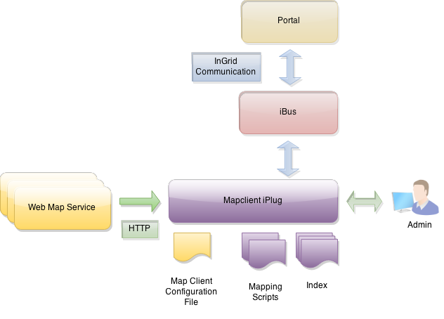

## Allgemeines

Der Datasource Mapclient dient der Indizierung von Metainformationen aus den vorgehaltenen WMS-Diensten. Diese stehen nach der Indexierung für die InGrid Suche zur Verfügung.

Alle vorgehaltenen WMS Dienste werden in Metadatenobjekte vom Typ "Geodatendienst" (ISO: `hierarchyLevel=service`) transformiert und indexiert.

Die indexierten Daten werden auch für die im MapClient integrierte Suche verwendet.

<figcaption class="figcaption">InGrid Komponente iPlug Mapclient</figcaption>

## Systemvoraussetzungen

* 64 MB RAM
* 50 MB Harddrive

* JAVA 1.7
* Cygwin (unter Windows)

## Installation

Download: [https://dev.informationgrid.eu/ingrid-distributions/ingrid-iplug-dsc-mapclient/](https://dev.informationgrid.eu/ingrid-distributions/ingrid-iplug-dsc-mapclient/)

Um die Installationsroutine zu starten, doppel-klicken Sie auf das Installationsprogramm oder geben Sie folgenden Befehl auf der Kommandozeile ein:


java -jar ingrid-iplug-dsc-mapclient-VERSION-installer.jar


Der Installer ist sowohl per graphischer Oberfläche als auch Kommandozeileneingabe ausführbar. Bitte folgen Sie den Anweisungen des Installationsprogrammes. Das Installationsprogramm installiert die Komponente im gewünschten Verzeichnis und passt die Konfigurationsdateien an.

Sie können nun das iPlug mit


sh start.sh start


starten. 

Das iPlug besitzt eine Administrationsoberfläche über die die angeschlossenen iPlugs eingesehen und verwaltet werden können.


http://localhost:PORT/admin


Anstelle von `localhost` können Sie auch die IP-Adresse des Computers eingeben. Authentifizieren Sie sich als 'admin' mit dem von Ihnen vergebenen Passwort.

Nach der ersten Installation wird die Administrations-GUI unter


http://localhost:8082/admin


aufgerufen und die Konfiguration vervollständigt.

## Aktualisierung

Neues Release von [https://dev.informationgrid.eu/ingrid-distributions/ingrid-iplug-dsc-mapclient/](https://dev.informationgrid.eu/ingrid-distributions/ingrid-iplug-dsc-mapclient/) herunterladen.

iPlug stoppen.


sh start.sh stop


Aktuelles Installationsverzeichnis sichern:


cp -r /opt/ingrid/ingrid-iplug-dsc-mapclient BACKUP_DIRECTORY


Die Aktualisierung erfolgt über den Installer. 


java -jar ingrid-iplug-dsc-mapclient-NEW-VERSION-installer.jar


Während der Installation bitte "Upgrade" auswählen und das Installationsverzeichnis Verzeichnis angeben.

iPlug starten.


sh start.sh start


## Betrieb


start.sh [start|stop|restart|status]


Die LOG Ausgaben finden sich in der Datei `log.log` und `console.log`.

## Konfiguration

### Basiskonfiguration

Die Basiskonfiguration für iPlugs kann [hier](iplug_admin_gui.html) eingesehen werden.

### Indexierung von WMS Diensten

Das iPlug benötigt eine Datei in der die Capability URLs der zu indexierenden WMS Dienste hinterlegt sind. Die Daten müssen im XML-Format vorliegen und die Urls müssen mit dem Bezeichner `<capabilitiesUrl></capabilitiesUrl>` eingeschlossen sein. 

In der Regel ist dies das Konfigurationsfile des MapClient 'ingrid_webmap_client_config.xml'.

### InGrid Communication

Die Datei `conf/communication.xml` enthält die Konfigurationen der InGrid Kommunikationsschicht.


<?xml version="1.0" encoding="UTF-8"?>
<communication xmlns:xsi="http://www.w3.org/2001/XMLSchema-instance"
    xsi:noNamespaceSchemaLocation="communication.xsd">
    <client name="/ingrid-group:iplug-management-'Ihr-Name'">
        <connections>
            <server name="/ingrid-group:ibus-'Ihr-Name'">
                <socket port="9900" timeout="10" ip="127.0.0.1" />
                <messages maximumSize="1048576" threadCount="100" />
            </server>
        </connections>
    </client>
    <messages queueSize="2000" handleTimeout="10"/>
</communication>


Die einzelnen Parameter haben folgende Bedeutung:

| Parameter                           | Beschreibung                                             |
|-------------------------------------|----------------------------------------------------------|
| client/@name                        | Eindeutige ID des iPLugs  |
| server/@name                        | Eindeutige ID des InGrid iBus  |
| socket/@port                        | Port unter dem die Administrations GUI zu erreichen ist |
| socket/@timeout               | Timeout der Socketverbindungen in sec |
| message/@maximumSize                | max. zulässige Größe einer Message in Bytes, die über den iBus versendet werden kann |
| message/@threadCount                | Anzahl der Verbindungen (Threads), die der iBus gleichzeitig aufrecht erhalten kann |
| message/@handleTimeout              | Timeout einer Message in sec (Wie lange wartet der iBus auf die Beantwortung einer Message.) |
| message/@queueSize                  | Message Queue (Wie viele Nachrichten können in der Warteschlange des iBus enthalten sein.) |

## FAQ

### Die iPlug Administration funktioniert nicht, es können keine Partner/Anbieter ausgewählt werden.

Mögliche Ursachen:

* Falsche Datenbank Verbindungsparameter 
* Keine Verbindung zum iBus
* iPlug Management funktioniert nicht

Bitte analysieren Sie das log file des iPlugs. 
Löschen Sie gegebenenfalls den Cache Ihres Browsers und starten sowohl das Portal als auch das iPlug neu.

Sie müssen nach einer Änderung der Konfiguration das iPlug immer neu starten

