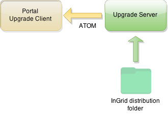

## Allgemeines

Der Upgrade-Server dient der Überwachung von versionierten Komponenten (Programmen).

Seine Aufgabe ist es ein konfiguriertes Verzeichnis zu beobachten und auf Veränderungen zu achten, indem dieses periodisch und rekursiv nach Komponenten durchsucht wird.

Dabei werden die Metainformationen (wie z.B. Versionsnummer oder Komponententyp) erfasst, indexiert und als Service in der Form eines Atom-Feeds zur Verfügung gestellt.

Berücksichtigt werden hierbei nur Archive, welche auf ".jar" oder ".zip" enden und eine sich selbst beschreibende Datei beinhalten (welche sich im Archiv unter "META-INF/MANIFEST.MF" befinden muss). 

Anwendung findet der Upgrade Server z.B. im Portal integrierten [Upgrade Client](portal.html#upgrade-client), der die Versionen einer InGrid Installation automatisch auf Aktualisierungen hin überwacht.

<figcaption class="figcaption">InGrid Komponente Upgrade Server</figcaption>

## Systemvoraussetzungen

* 64 MB RAM
* 20 MB Harddrive

* JAVA 1.6
* Cygwin (unter Windows)

## Installation

Download: [https://distributions.informationgrid.eu/ingrid-server-upgrade/](https://distributions.informationgrid.eu/ingrid-server-upgrade/)

Um die Installationsroutine zu starten, doppel-klicken Sie auf das Installationsprogramm oder geben Sie folgenden Befehl auf der Kommandozeile ein:


java -jar ingrid-server-upgrade-VERSION-installer.jar


Der Installer ist sowohl per graphischer Oberfläche als auch Kommandozeileneingabe ausführbar. Bitte folgen Sie den Anweisungen des Installationsprogrammes. Das Installationsprogramm installiert die Komponente im gewünschten Verzeichnis und passt die Konfigurationsdateien an.

Sie können nun die Komponente mit


sh start.sh start


starten. 

Die Codelist-Repository-Administration wird im Webbrowser unter der folgenden Adresse 


http://localhost:IHR_ADMIN_PORT/admin


gestartet. Anstelle von localhost können Sie auch die IP-Adresse des Computers eingeben! Authentifizieren Sie sich als `admin` mit dem von Ihnen vergebenen Passwort. 

Ist der Upgrade-Server gestartet beginnt dieser das bei der Installation angegebene Verzeichnis periodisch zu untersuchen.

Jegliche Informationen die dabei gefunden werden, können über den Web-Service des Upgrade-Servers eingesehen werden. 

## Aktualisierung

Neues Release von [https://distributions.informationgrid.eu/ingrid-server-upgrade/](https://distributions.informationgrid.eu/ingrid-server-upgrade/) herunterladen.

Komponente stoppen.


sh start.sh stop


Aktuelles Installationsverzeichnis sichern:


cp -r /opt/ingrid/ingrid-server-upgrade <BACKUP-DIRECTORY>


Die Aktualisierung erfolgt über den Installer. 


java -jar ingrid-server-upgrade-NEW-VERSION-installer.jar


Während der Installation bitte "Upgrade" auswählen und das Installationsverzeichnis Verzeichnis angeben.

Komponente starten.


sh start.sh start


## Betrieb


start.sh [start|stop|restart|status]


Die LOG Ausgaben finden sich in der Datei `log.log` und `console.log`.

## ATOM Feed

Der Atom-Feed ist lokal über 


http://localhost:PORT/upgrader


erreichbar sein (`PORT` steht dabei für den während der Installation definierten Port). 

Der Feed stellt alle Informationen bereit, die gefunden werden konnten. Dabei entspricht immer ein Eintrag genau eine Komponente.

Durch ein Klick auf den Namen der Komponente, lässt sich diese über die generierte URL downloaden. Hierfür ist es wichtig, dass die interne Umleitung und die bei der Installation angegebene Externe URL richtig konfiguriert wurden.

Drückt man auf den Link `more details` unterhalb der Komponente, werden alle Informationen die über diese gesammelt werden konnten angezeigt. Die Detail-Ansicht kann sich von Komponente zu Komponente unterscheiden. Sie enthält alle Einträge der Datei "META-INF/MANIFEST.MF", die sich innerhalb des Archivs befindet. 

## FAQ

### Werden auch Unterverzeichnisse des Scanverzeichnises untersucht?

Ja.

### Wie kann man das Scan-/Distributionsverzeichnis ändern?

Bei der Installation kann das Scanverzeichnis direkt angegeben werden, in dem nach Komponenten gesucht werden soll. Soll das Scanverzeichnis geändert werden, so kann man die Installation erneut ausführen und dort das neue Scanverzeichnis angeben. 
Alternativ kann das Startscript angepasst werden. Dazu wird die Variable `INGRID_OPTS` in der Datei `start.sh` angepasst. In der Start-Variable `source` ist das Scanverzeichnis definiert.


-Dsource=/opt/...


Nach einem Neustart des Upgrade Servers wird das geänderte Verzeichnis neu indexiert und als Feed angeboten.

### Wie kann der Zugang geschützt werden?

Der Update Server kann mit einem Login versehen werden. Dazu muss die Datei `web.xml` angepasst werden.

Die Zugangsdaten werden in der Datei `/jetty/etc/realm.properties` hinterlegt.


ingrid: MD5:f472032ec7c61b0d8754edd7b7de3cc4,user
Tiga: MD5:07fce7402aaf95f0d2879a96602dbf35,user


Die Authentifizierung muss in der Datei web.xml konfiguriert werden.


<security-constraint>
  <web-resource-collection>
    <web-resource-name>Access</web-resource-name>
    <!--<url-pattern>/NOSECURITY/*</url-pattern>-->
    <url-pattern>/*</url-pattern> 
  </web-resource-collection>

  <auth-constraint>
    <role-name>user</role-name>
  </auth-constraint>
</security-constraint>


Im Portal läuft ein Überwachungsjob, mit welchem auf die neuesten Softwareversionen der Komponenten geprüft wird (Update Client). Hier werden die Konfigurations-Paramter in den `ingrid-portal-apps.properties` über die Einträge `upgrade.server.username` und `upgrade.server.password` benutzt, welche dann für den Login beim Update-Server genommen werden:


# the url to the Upgrade-Server which holds new distributions
upgrade.server.url=http://dev.informationgrid.eu/update
# login data for the Upgrade-Server; leave empty if none needed
upgrade.server.username=Tiga
upgrade.server.password=#####


Werden diese Felder leer gelassen, so wird kein Login-Mechanismus verwendet! 

### Wie häufig wird der Inhalt des Softwareverzeichnisses neu eingelesen?

Werden neue Versionen der Software in das Distributionsverzeichnis eingespielt, so werden die Änderungen im Webservice nicht sofort sichtbar. Die Aktualisierung erfolgt einmal in der Stunde. Der Wert kann über die Konfiguration nicht geändert werden.

> Achtung: der ATOM-Feed gibt die Änderung sofort bekannt. Im Webservice tauchen die Änderungen aber erst später auf. 