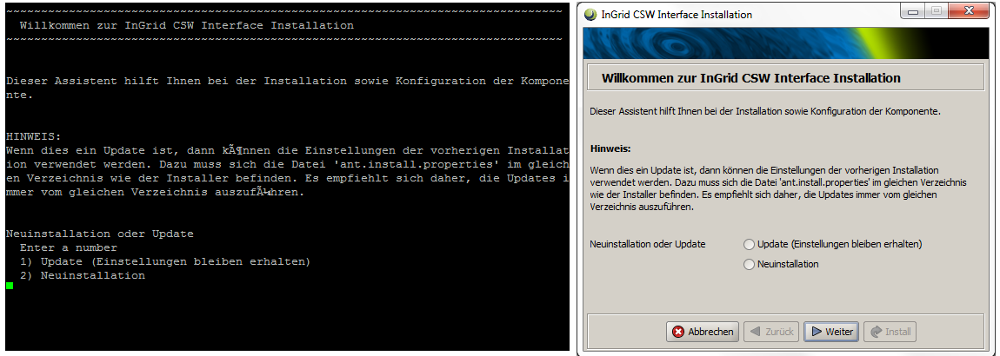

## Allgemeine Hinweise

Für die Installation sollte ein eigener Benutzer (ingrid) angelegt werden.

Die Installation erfolgt über graphische Installer. Auf GUI-losen Systemen (Linux Server) werden die Installer im Text-Modus ausgeführt. Das folgende Bild zeigt eine Gegenüberstellung von Text-Modus und GUI Modus.

Viele Komponenten besitzen eine Administrations GUI, über die die Komponente konfiguriert werden kann. Das InGrid System lässt sich sowohl unter Linux, als auch unter Windows installieren.

Vor einer Installation müssen folgende Fragen beantwortet werden:

### Welche Komponenten sollen installiert werden?

Eine Basis Installation enthält mind. folgende Komponenten:

* iBus
* Portal
* Management iPlug
* SNS iPlug
* eins oder mehrere iPlugs für Datenquellen
* ggf. CSW oder OpenSearch Schnittstelle

Genauere Informationen zur Installation der einzelnen Komponenten können bei der Dokumentation der einzelnen Komponenten eingesehen werden.

### Welche Datenbank wird verwendet?

InGrid unterstützt MySQL und Oracle. Der Einsatz von MySQL ist dabei vorzuziehen, da insbesondere die Installation vom Portal mit einer MySQL Datenbank einfacher funktioniert.

Genauere Informationen können bei der Dokumentation der einzelnen Komponenten eingesehen werden.

### Welche Portal Features sollen installiert werden?

Das Portal wird mit einem optionalen INSPIRE kompatiblen Metadateneditor (IGE - InGrid Editor) ausgeliefert, der die Installation von weiteren Komponenten (IGE iPlug) erforderlich macht. Die Installation des Editiors ist optional.

### Welches Betriebssystem kommt zum Einsatz?

Die empfohlene Plattform ist Linux (Ubuntu/Redhat).

Das System kann auch unter Windows installiert werden. Dies macht jedoch die Installation von CYGWIN erforderlich.

## Systemvoraussetzungen

### Basisinstallation

Diese Konfiguration wird nur für einfache Systeme ohne hohe Last oder zum Testen empfohlen.

- Dual Core CPU
- 4 GB RAM
- 10 GB Plattenplatz

### Typische Installation

- Quad Core CPU
- 8 GB RAM
- 100 GB Plattenplatz

Beim Einsatz von der Suchmaschine (iPlug-SE) können durch den Crawl Prozess große Datenmengen anfallen. Die Festplattengröße ist entsprechend zu wählen.

