## Allgemeines

Die Administration eines iPlugs kann über eine Admin GUI erfoglgen. Die Admin GUI ist über den Browser zu bedienen.

## Admin GUI

### Login

Der Zugang zu Admin GUI ist durch Login/Passwort geschützt. Das Login ist `admin`, das Default Passwort ist `admin` und kann in der Admin GUI geändert werden.

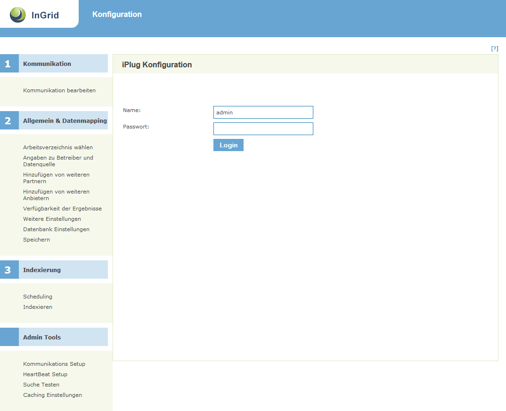

### Kommunikation bearbeiten

Hier werden die InGrid Kommunikationseinstellungen bearbeitet. Es muss mind. ein iBus definiert werden. Das iPlug kann aber auch an mehrere iBus Komponenten angeschlossen werden.

Die Proxy Service URL des iPlugs besteht aus einer Gruppe, zu welcher der iBus gehört, an den man sich anschließt und der ID des iPlugs. Der Name sollte noch nicht vergeben sein. Um dies zu erreichen, sollte man spezifische Begriffe des Anbieters einarbeiten. Die Adresse hat folgendes Format: `/<InGrid Gruppe>:<InGrid iPlug ID>`, z.B. `/ibus-hh:iplug-csw-lgv`. Alles zwischen den spitzen Klammern (und die Klammern) muss mit den nötigen Werten ersetzt werden. Alle Komponenten einer InGRid Installation sollten der gleichen InGrid Gruppe angehören.

> Die Definition eines iBus ist nötig, um im weiteren Verlauf eine einen Anbieter auswählen zu können. Partner und Anbieter werden vom Management iPlug über den ersten angeschlossenen iBus zur Verfügung gestellt.

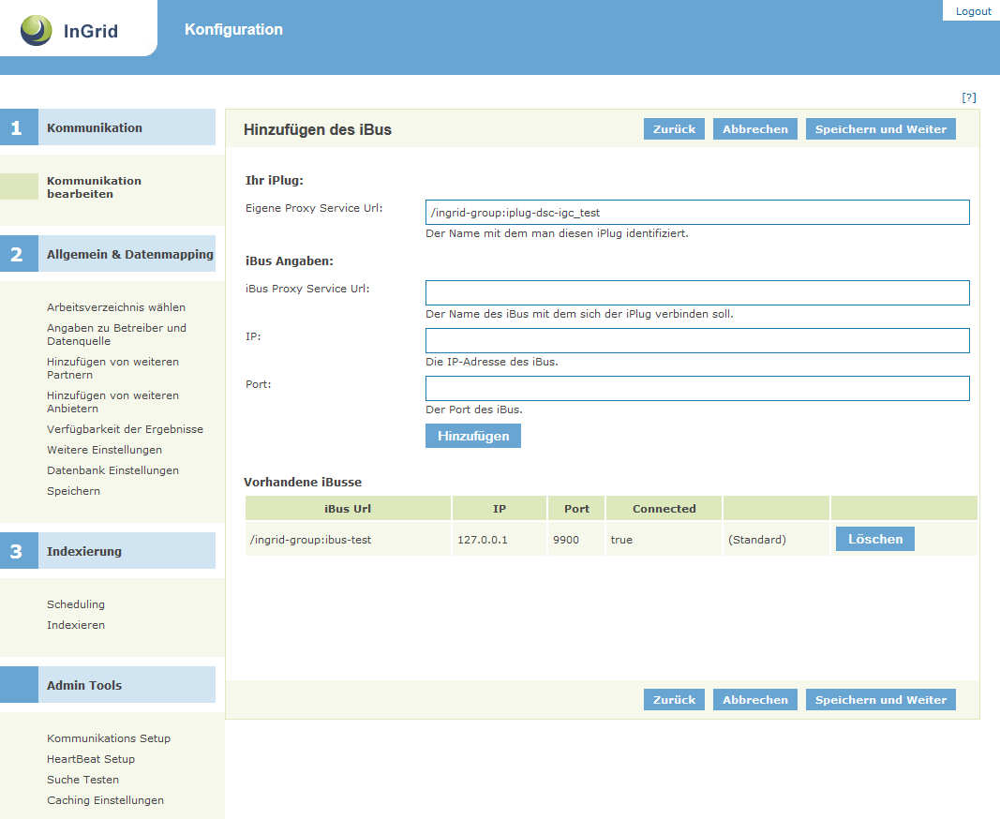

### Arbeitsverzeichnis

Dieses Verzeichnis benutzt das iPlug, um Dateien für seinen Betrieb abzulegen.

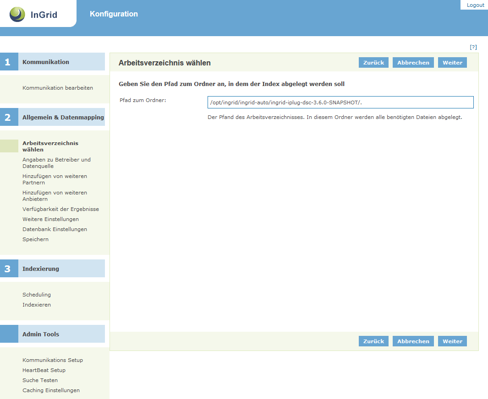

### Angaben zu Betreiber und Datenquelle

Der Anbieter des iPlugs wird durch die Auswahl von Partner und Anbieter definiert. Diese Listen werden vom Management iPlug zentral bereitgestellt. Änderungen können in der Portal Administration vorgenommen werden.

Der Ansprechpartner für das iPlug kann frei definiert werden, ebenso der Name und die Beschreibung der Datenquelle.

Einwichtiger Parameter ist die zur Art der Datenquelle . Hier sind die entsprechenden, zur Datenquelle passenden Typen zu wählen. Die hier getroffene Auswahl entscheidet darüber, ob das iPlug bei einer bestimmten Suchanfrage vom iBus angesprochen wird. Wird z.B. Metadatenbank (datatype : metadata) ausgewählt, wird die Datenquelle bei der Einschränkung der Suche auf Metadaten angesprochen, nicht aber bei einer Suche nach Webseiten.

Die Angabe entscheidet auch über die Darstellung im Portal, Metadaten-Treffer werden z.B. anders dargestellt als Webseiten-Treffer.

| Art der Datenquelle | datatype | Erläuterung |
| === | === | === | 
| Forschungsdatenbank | research | Das iPLug liefert Ergebnisse aus einer Forschungsdatenbank. |
| Andere Datenbank | dsc_other | Das iPlug liefert Ergebnisse aus einer Datenbank, diese ist aber keine IGC Datenbank. Die Darstellung der Detaildaten im Portal erfolgt in generischer Detaildarstellung. |
| Rechtsvorschriften | law | Das iPlug liefert Ergebnisse zu Rechtsvorschriften. Ergebnisse werden bei Suche unter Rubrik "Rechtsvorschriften" berücksichtigt. |
| IGC Adressen Datenbank| dsc_ecs_address | Das iPlug liefert Ergebnisse aus einer IGC-Address Datenbank. Ergebnisse werden bei Suche unter Rubrik "Adressen" berücksichtigt. |
| allgemeine Umweltinformationen | default | Das iPlug liefert Allgemeinen Umweltinformationen. |
| InGrid-Data-Format | IDF_1.0 | Das iPlug unterstützt das IDF Format für die Bereitstellung von Detailinformationen (alle indexierenden iPlugs, außer SE und OpenSearch iPlug). |
| Umweltthemen | topics | Das iPlug liefert Daten zu spezifischen Themen (siehe Portal / Umweltthemen) |
| Fachinformationssystem | fis | Das iPlug liefert Ergebnisse aus Fachinformationssystemen. Ergebnisse werden bei Suche in Fachdatenbanken (siehe Erweiterte Suche) berücksichtigt. **(DEPRECATED ab Verion 3.5.0, da nur in Zusammenhang mit FPN iPLug verwendet.)** |
| Adressen | address | iPlug liefert Adressen. Ergebnisse werden bei Suche unter Rubrik "Adressen" berücksichtigt. |
| Metadatenbank | metadata | iPlug liefert ISO Metadaten. Ergebnisse werden im Portal unter der Kategorie "Metadaten" angezeigt. |
| IGC Datenbank | dsc_ecs | iPlug liefert IGC Metadatenobjekte. Ergebnisse werden im Portal unter der Kategorie "Metadaten" angezeigt. |
| CSW | csw | Das iPlug liefert Ergebnisse aus CSW Datenquellen (Muss aus historischen Gründen zusammen mit `DSC-CSW` aktiviert werden.) |
| DSC-CSW | csw_dsc | Das iPlug liefert Ergebnisse aus CSW Datenquellen  (Muss aus historischen Gründen zusammen mit `CSW` aktiviert werden.) |
| Excel | excel | Das iPlug liefert Ergebnisse aus Excel Datenquellen. |
| XML | xml | Das iPlug liefert Ergebnisse aus XML Datenquellen. |
| Webseiten | www | Das iPlug liefert Suchergebnisse für Webseiten. Ergebnisse werden im Portal unter der Kategorie "Webseiten" angezeigt.|
| Openseach | opensearch | Das iPlug liefert Ergebnisse aus einer OpenSearch Schnittstelle |

> Beim der Anbindung einer IGC-DSC Datenbank gibt es den Sonderfall, dass zusätzlich die Adresse eines korrespondierenden iPlugs (Objekt- und Adress iPlug aus einer IGC Datenbank) anzugeben sind. Siehe dazu auch [hier](iplug_dsc_scripted.html#sonderfall-ingrid-catalog-objekte-und-adressen).

Die *URL* des *Administrationsinterfaces* ist anzugeben, wenn die Administration über einen Proxy erreichbar sein soll. Diese URL wird in der Portaladministration angezeigt. Die Angaben für den Port und ein Kennwort sind zu vervollständigen. Der Benutzer für diese Oberfläche heißt immer `admin`. Wenn sie zu einem späteren Zeitpunkt das *Kennwort* und den *Port* für die Administrationsoberfläche ändern, müssen Sie das iPlug neu starten. Bei allen anderen Optionen werden Änderungen auch ohne einen Neustart übernommen.

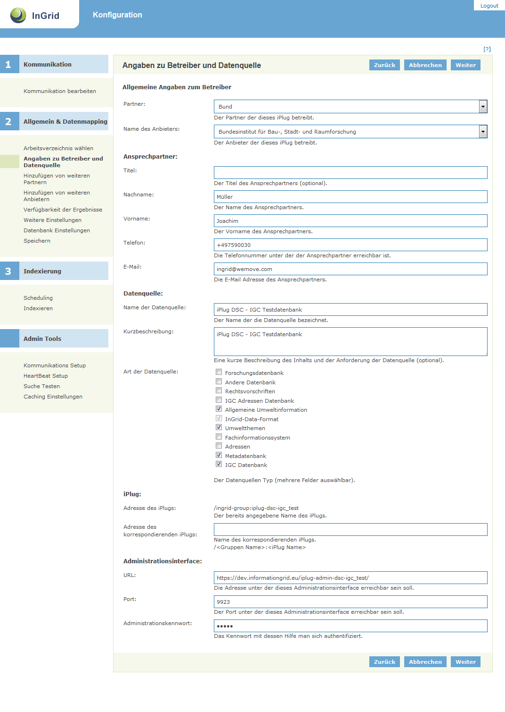

### Hinzufügen von weiteren Partnern

Hier können weitere Partner ausgewählt werden.

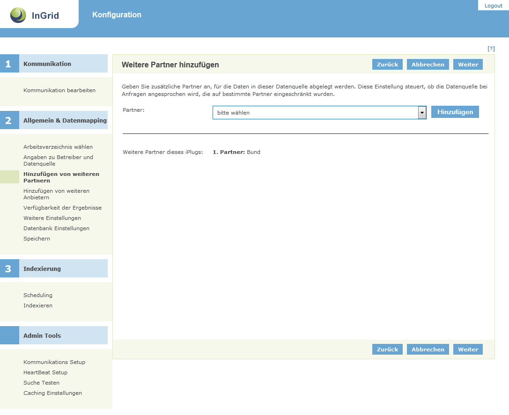

### Hinzufügen von weiteren Anbietern

Hier können weitere Anbieter ausgewählt werden.

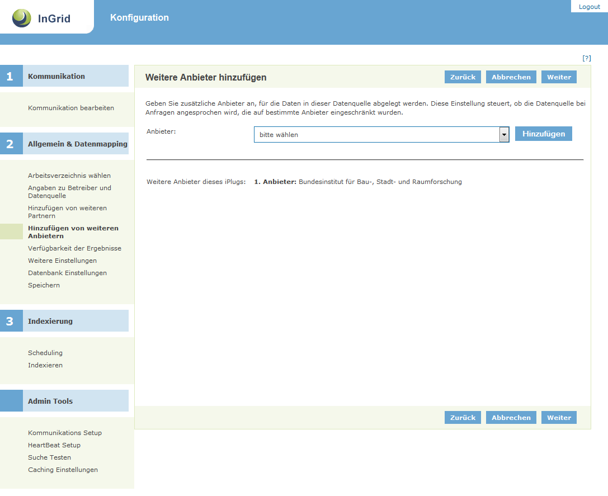

### Verfügbarkeit der Ergebnisse

Für jeden angeschlossenen iBus kann hier eine Modifikation der Query konfiguriert werden. Dadurch ist es möglich, die zurückgegebene Ergebnismenge pro angeschlossenem iBus zu steuern.

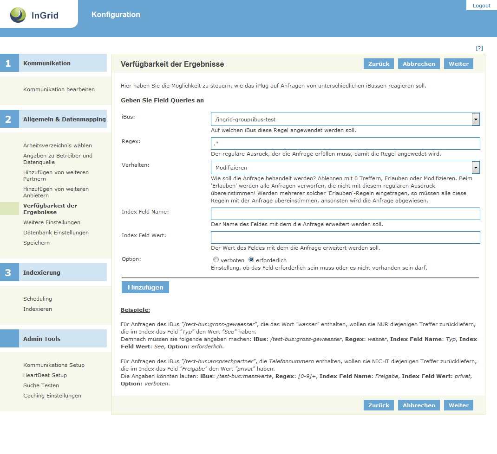

### Weitere Einstellungen

Diese Option betrifft die Darstellung der Suchergebnisse in den verschiedenen Ergbnis-Spalten im Portal.

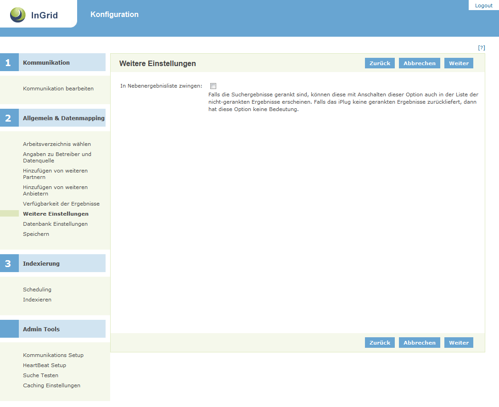

### Andere iPlug spezifische Einstellungen

Jedes iPlug kann weitere Punkte zu der Administrationsoberfläche hinzufügen. Diese werden in den Dokumentationen der jewiligen iPlugs erläutert.

### Scheduling

Für indexierende iPlugs, kann hier eingestellt werden, wann die Indexierung der Datenquelle vorgenommen werden soll.

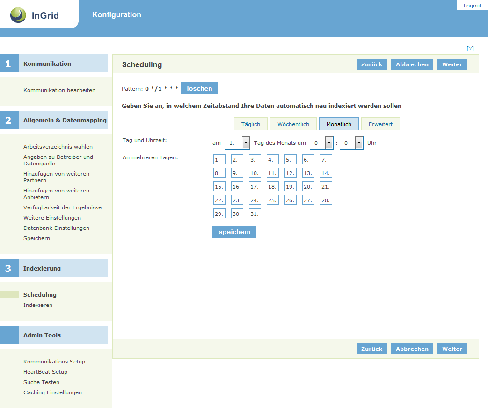

### Indexieren

Für indexierende iPlugs, kann hier der Index Prozess manuell angestoßen werden.

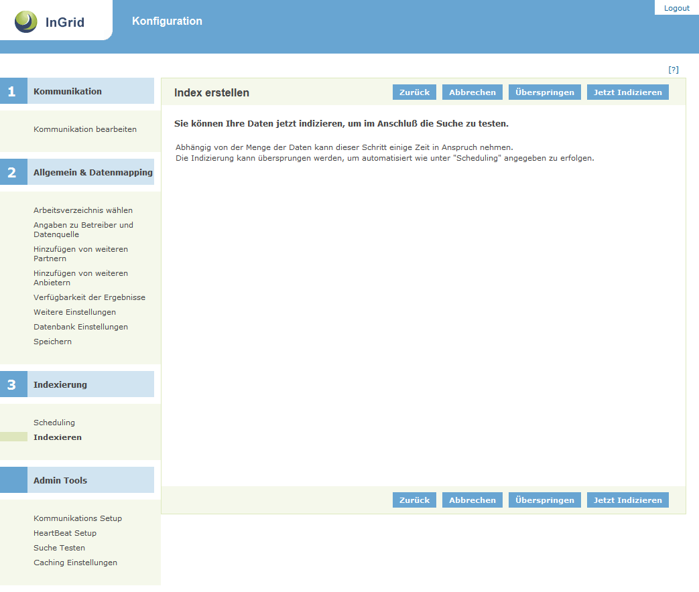

### Kommunikations Setup

Der Status der Verbindung zu dem iBus (oder den iBus Instanzen) wird angezeigt. Die Verbindung kann unterbrochen und neu aufgebaut werden.

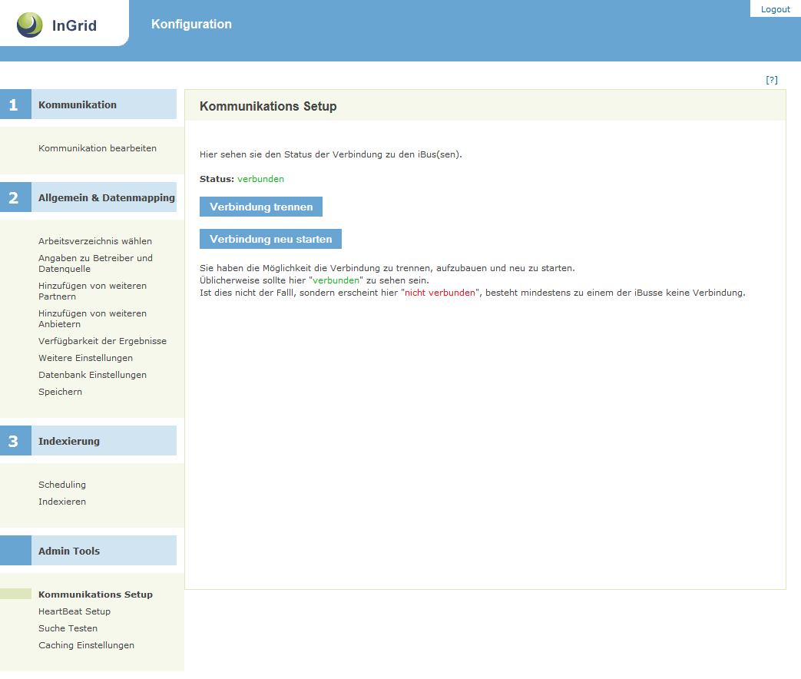

### Heartbeat Setup

Jedes iPlug prüft über einen Heartbeat die Verbindung zum iBus. Wir der Heartbeat unterbrochen, trennt der iBus die Verbindung zum iPlug. Die Verbindung zum iBus kann unterbrochen und neu aufgebaut werden.

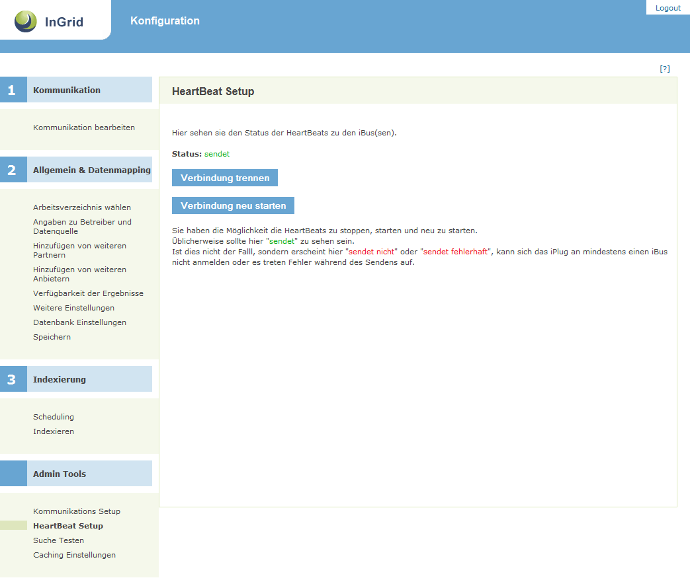

### Suche Testen

Hier kann die Suche auf den indexierten Daten getestet werden. Unter `Raw Result` können die Daten für die Detaildarstellung eingesehen werden.

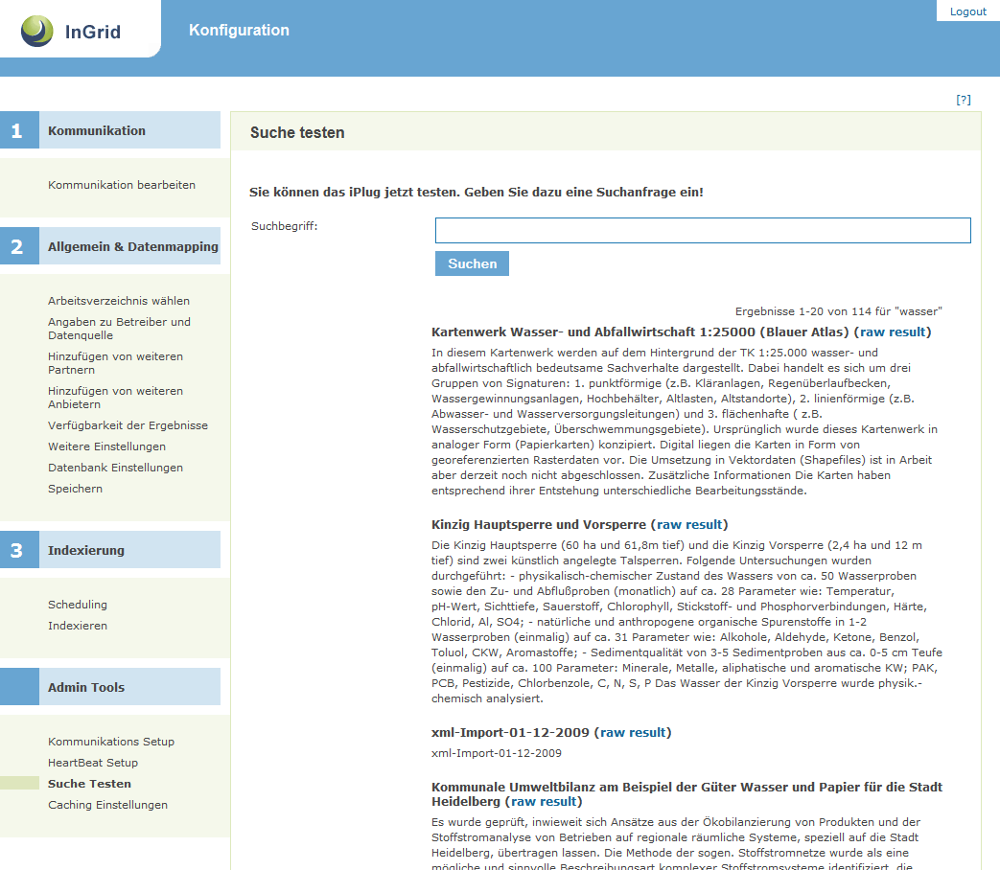

### Caching Einstellungen

Hier kann der Cache des iPlugs eingestellt werden. Sich wiederholende Anfragen innerhalb eines gewissen Zeitraumes werden aus dem Cache ausgeliefert. Die Größe des Caches beeinflusst den Speicherbedarf des iPlugs.

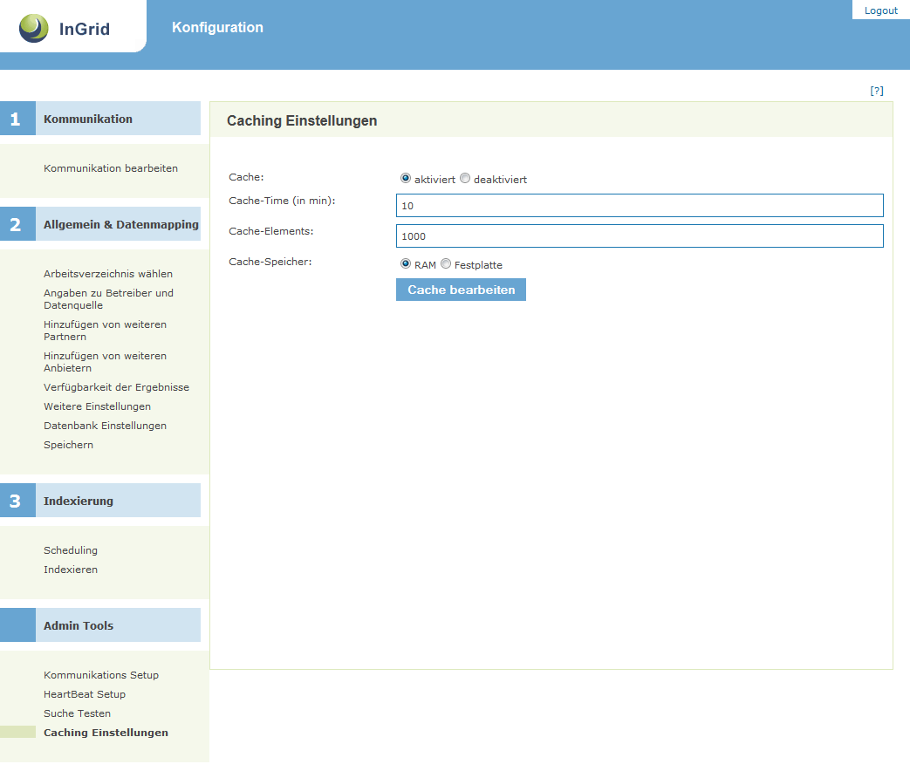

## FAQ

### Die iPlug Administration funktioniert nicht, es können keine Partner/Anbieter ausgewählt werden.

Mögliche Ursachen:

* Falsche Datenbank Verbindungsparameter 
* Keine Verbindung zum iBus
* iPlug Management funktioniert nicht

Bitte analysieren Sie das log file des iPlugs. 
Löschen Sie gegebenenfalls den Cache Ihres Browsers und starten sowohl das Portal als auch das iPlug neu.

Sie müssen nach einer Änderung der Konfiguration das iPlug immer neu starten

