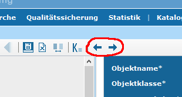

## Version 3.6.2.10

Release: 02.02.2017

### Änderungen

- [Bug] [iPlug IGE] CSW-T: Löschen eines Datensatzes schlägt u.U. fehl  ([REDMINE-526](https://dev.informationgrid.eu/redmine/issues/526))

### Komponenten

- iPlug IGE ([download](https://dev.informationgrid.eu/ingrid-distributions/ingrid-iplug-ige/3.6.2.10/))

## Version 3.6.2.9

Release: 17.01.2017

### Änderungen

- [Feature] [iPlug IGE] IGE: Feld "Veröffentlichung" für Objekte und Adressen einheitlich in den Index abbilden, damit Einschränkung im iPlug möglich ([REDMINE-515](https://dev.informationgrid.eu/redmine/issues/515))
- [Bug] [iPlug IGE] CSW-T Delete Request reagiert auf falsches Property ([REDMINE-524](https://dev.informationgrid.eu/redmine/issues/524))

### Komponenten

- iPlug IGE ([download](https://dev.informationgrid.eu/ingrid-distributions/ingrid-iplug-ige/3.6.2.9/))

## Version 3.6.2.8

Release: 12.01.2017

### Änderungen

- [Bug] [Portal] Portal: Das Anzeigen von Freien Adressen in der Detailansicht schlägt fehl ([REDMINE-518](https://dev.informationgrid.eu/redmine/issues/518))

### Komponenten

- Portal ([download](https://dev.informationgrid.eu/ingrid-distributions/ingrid-portal/3.6.2.8/))

## Version 3.6.2.7

Release: 10.01.2017

### Änderungen

- [Bug] [Interface-CSW] Cygwin: Verwendung von mounts führen zu doppelten Pfaden ([REDMINE-516](https://dev.informationgrid.eu/redmine/issues/516))
- [Bug] [Interface-CSW] Capabilities um CSW-T Transaction erweitert ([REDMINE-113](https://dev.informationgrid.eu/redmine/issues/113))

### Komponenten

- Interface CSW ([download](https://dev.informationgrid.eu/ingrid-distributions/ingrid-interface-csw/3.6.2.7/))

## Version 3.6.2.6

Release: 13.12.2016

### Änderungen

- [Bug] [iPlug IGE] iPlug IGE: Installer kann "update" nicht ausführen ([REDMINE-506](https://dev.informationgrid.eu/redmine/issues/506))

### Komponenten

- iPlug IGE ([download](https://dev.informationgrid.eu/ingrid-distributions/ingrid-iplug-ige/3.6.2.6/))

## Version 3.6.2.5

Release: 09.12.2016

### Änderungen

- [Bug] [iPlug IGE] Adressen aus ISO Import/CSW-T Import sollen immer als "Freie Adressen" angelegt werden. ([REDMINE-494](https://dev.informationgrid.eu/redmine/issues/494))

### Komponenten

- iPlug IGE ([download](https://dev.informationgrid.eu/ingrid-distributions/ingrid-iplug-ige/3.6.2.5/))

## Version 3.6.2.4

Release: 06.12.2016

### Änderungen

- [Bug] [iPlug IGE] IGE: Probleme beim Connection Pooling der Datenbank ([REDMINE-475](https://dev.informationgrid.eu/redmine/issues/475))
- [Bug] [iPlug IGE] IPLUG_IGE: Open Data Kategorien und Umweltthemen werden nicht korrekt importiert. ([REDMINE-502](https://dev.informationgrid.eu/redmine/issues/502))

### Komponenten

- iPlug IGE ([download](https://dev.informationgrid.eu/ingrid-distributions/ingrid-iplug-ige/3.6.2.4/))

## Version 3.6.2.3

Release: 17.10.2016

### Änderungen

- [Bug] [iPlug IGE] IPLUG-SE: Fehler beim Löschen einer Instanz ([REDMINE-495](https://dev.informationgrid.eu/redmine/issues/495))
- [Bug] [System] Cygwin: Verwendung von mounts führen zu doppelten Pfaden ([REDMINE-465](https://dev.informationgrid.eu/redmine/issues/465))
- [Bug] [iPlug IGE] IGE: CSW-T Löschanfrage über OrigId entfernt nicht aus Index ([REDMINE-460](https://dev.informationgrid.eu/redmine/issues/460))
- [Bug] [iPlug DSC] Datum wird über die CSW Schnittstelle falsch abgegeben und im Portal falsch angezeigt ([REDMINE-439](https://dev.informationgrid.eu/redmine/issues/439))
- [Bug] [iPlug SE] iPlug-SE: Art der Datenquelle wird nicht gespeichert ([REDMINE-394](https://dev.informationgrid.eu/redmine/issues/394))

### Komponenten

- iPlug IGE ([download](https://dev.informationgrid.eu/ingrid-distributions/ingrid-iplug-ige/3.6.2.3/))
- iPlug DSC ([download](https://dev.informationgrid.eu/ingrid-distributions/ingrid-iplug-dsc/3.6.2.3/))
- iPlug SE ([download](https://dev.informationgrid.eu/ingrid-distributions/ingrid-iplug-se/3.6.2.3/))

## Version 3.6.2.2

Release: 08.07.2016

### Änderungen

- [Bug] [INTERFACE-CSW] CSW-Schnittstelle fährt nach Update/Installation nicht mehr hoch wenn communication.xml fehlt ([REDMINE-376](https://dev.informationgrid.eu/redmine/issues/376))
- [Bug] [iPlug Opensearch] iPlug-Opensearch: Fehler bei Konfiguration wenn Neuinstallation durchgeführt wurde ([REDMINE-390](https://dev.informationgrid.eu/redmine/issues/390))

### Komponenten

- Interface CSW ([download](https://dev.informationgrid.eu/ingrid-distributions/ingrid-interface-csw/3.6.2.2/))
- iPlug OpenSearch ([download](https://dev.informationgrid.eu/ingrid-distributions/ingrid-iplug-opensearch/3.6.2.2/))

## Version 3.6.2.1

### Komponenten

- Portal ([download](https://dev.informationgrid.eu/ingrid-distributions/ingrid-portal/3.6.2.1/))
- Interface CSW ([download](https://dev.informationgrid.eu/ingrid-distributions/ingrid-interface-csw/3.6.2.1/))
- Interface Search (OpenSearch, ATOM DLS) ([download](https://dev.informationgrid.eu/ingrid-distributions/ingrid-interface-search/3.6.2.1/))
- iPlug IGE ([download](https://dev.informationgrid.eu/ingrid-distributions/ingrid-iplug-ige/3.6.2.1/))
- iPlug SNS ([download](https://dev.informationgrid.eu/ingrid-distributions/ingrid-iplug-sns/3.6.2.1/))

### Änderungen

- [Feature] [INTERFACE-CSW] CSW-T: Passwortgeschützter Zugang ([REDMINE-337](https://dev.informationgrid.eu/redmine/issues/337))
- [Update] [IGE] Vermeidung von neuen leeren Zeilen in Tabellen ([REDMINE-324](https://dev.informationgrid.eu/redmine/issues/324))
- [Bug] [Portal] Feldnamen von Verfügbarkeit (constraints) in Detaildarstellung stimmen nicht mit IGE überein ([REDMINE-346](https://dev.informationgrid.eu/redmine/issues/346))
- [Bug] [Portal] Detaildarstellung von constraints in Profilen an neue IDF Struktur anpassen ([REDMINE-189](https://dev.informationgrid.eu/redmine/issues/189))
- [Bug] [Portal] IGE: Geothesaurus-Raumbezug wird fehlerhaft angezeigt ([REDMINE-341](https://dev.informationgrid.eu/redmine/issues/341))
- [Bug] [Portal] IGE: Geothesaurus-Raumbezug wird fehlerhaft aus den Capabilities übertragen ([REDMINE-343](https://dev.informationgrid.eu/redmine/issues/343))
- [Bug] [Portal] IGE: Änderungsdialog beim Öffnen von Objekten/Adressen ([REDMINE-332](https://dev.informationgrid.eu/redmine/issues/332))
- [Bug] [Portal] IGE: Update überschreibt mdek.override.properties ([REDMINE-323](https://dev.informationgrid.eu/redmine/issues/323))
- [Bug] [INTERFACE-CSW+iPlug IGE] CSW-T: Anfragen dürfen nicht den Cache benutzen ([REDMINE-366](https://dev.informationgrid.eu/redmine/issues/366))
- [Bug] [INTEFACE-SEARCH] Die OpenSearch Schnittstelle liefert keine Titel bei IGE iPlug Ergebnissen ([REDMINE-329](https://dev.informationgrid.eu/redmine/issues/329))
- [Bug] [iPlug IGE] Servicetyp (Art des Dienstes) im Index muss ISO Wert enthalten ([REDMINE-330](https://dev.informationgrid.eu/redmine/issues/330))
- [Bug] [iPlug IGE] Adressen sollen in der Ergebnisliste nach Objekten erscheinen ([REDMINE-342](https://dev.informationgrid.eu/redmine/issues/342))
- [Bug] [iPlug IGE] CSW-T: Objekt kann nur als Top-knoten angelegt werden ([REDMINE-336](https://dev.informationgrid.eu/redmine/issues/336))
- [Bug] [iPlug IGE] CSW-T: Löschen mehrerer Objekte nicht möglich ([REDMINE-360](https://dev.informationgrid.eu/redmine/issues/360))
- [Bug] [iPlug IGE] CSW-T: Zahlen in Zusammenfassung falsch ([REDMINE-361](https://dev.informationgrid.eu/redmine/issues/361))
- [Bug] [iPlug SNS] Keine ähnlichen Begriffe bei Sonderzeichen ([REDMINE-319](https://dev.informationgrid.eu/redmine/issues/319))

## Version 3.6.2

### Änderungen

#### Zusammenlegung von IGE iPlug, DSC Object iPlug, DSC Address iPlug

Die bisher für die Verwaltung von Metadaten benötigten iPlugs IGE iPlug, DSC Object iPlug, DSC Address iPlug wurde zu einem IGE iPlug konsolidiert. Dies erspart bei Installationen mit vielen Katalogen Ressourcen: es werden pro Katalog nur noch ein statt drei iPlugs installiert werden.

Achtung! Eine automatissche Migration ist durch die Zusammenlegung mehrerer iPlugs nicht möglich. Das neue IGE iPlug muss manuell installiert werden.

#### Sofortige Indexierung und Generierung von ISO 19139 XML Metadaten

Nach Veröffentlichung eines Metadatensatzes wird der Index im IGE iPlug sofort aktualisiert. Im Zuge der Indexierung wird die Transformation der Metadaten in der ISO 19139 XML Format vorgenommen. Die Daten stehen dadurch sofort für eine Recherche zur Verfügung.

Das zeitgesteuerte Indexieren des gesamten Datenbestandes wird nach wie vor beibehalten, um evtl. Inkonsistenzen im Datenbestand vorzubeugen (Empfehlung: Indexierung alle 24h).

#### Vorschau auf ISO 19139 XML Format im IGE Editor

Im IGE kann ein Metadatensatz nach Speicherung sofort im ISO 19139 XML Format angezeigt werden. Dazu wurde eine Vorschau implementiert, die auch einen Vergleich von veröffentlichter und Bearbeitungskopie ermöglicht.

#### Konformität zu den GDI-DE Metadatenkonventionen 1.1.0 hergestellt

Die Konformität der Metadaten wurden nach den GDI-DE Metadatenkonventionen 1.1.0 analysiert und angepasst.

#### Back Button

Im Ingrid Editor wurden ein Back-Button eingeführt, der es dem Bearbeiter erlaubt zum jeweils zuletzt aufgerufenen Objekt bzw. Adresse zu springen.

#### Wappen der Bundesländer in Trefferliste

Optional können im Portal zu den Treffern die Wappen der jeweiligen Partner Bundesländer dargestellt werden.

#### CSW-T Schnittstelle

Eine CSW-T Schnittstelle erlaubt das Verwalten von Metadaten über eine standardisierte Schnittstelle.

### Weitere Änderungen

- [Feature] [IGE] Nacharbeiten: Konformität zu den GDI-DE Metadatenkonventionen 1.1.0 herstellen ([REDMINE-223](https://dev.informationgrid.eu/redmine/issues/223))
- [Feature] [IGE] Umbenennung von Feld-Bezeichungen für Einschränkungen ([REDMINE-197](https://dev.informationgrid.eu/redmine/issues/197))
- [Feature] [IGE] Beim Erstellen einer Operation soll das Feld "Unterstützte Plattformen" auf "Webservice" voreingestellt werden ([REDMINE-87](https://dev.informationgrid.eu/redmine/issues/87))
- [Feature] [IGE] Aktualisierung CodeListe der Spezifikation der Konformität ([REDMINE-86](https://dev.informationgrid.eu/redmine/issues/86))
- [Feature] [IGE] Eintragung von Capabilities URLs von ALLEN Diensten unter ISO: distributionInfo/../linkage ([REDMINE-85](https://dev.informationgrid.eu/redmine/issues/85))
- [Feature] [IGE] Automatisches Hinzufügen einer Operation "Get Download Service Metadata" bei über ATOM Download Service bereitgestellten Daten ([REDMINE-84](https://dev.informationgrid.eu/redmine/issues/84))
- [Feature] [IGE] Konfigurierbares Verhalten bei Validierung von Daten Dienste Kopplung ([REDMINE-153](https://dev.informationgrid.eu/redmine/issues/153))
- [Feature] [IGE] Back Button Unterstützung ([REDMINE-36](https://dev.informationgrid.eu/redmine/issues/36))
- [Feature] [IGE] Dashbord / Anzeige aller Objekte in Bearbeitung ([REDMINE-25](https://dev.informationgrid.eu/redmine/issues/25))
- [Feature] [Portal] Frontend / Trefferliste / Länderkennzeichnung ([REDMINE-21](https://dev.informationgrid.eu/redmine/issues/21))
- [Feature] [Portal] PORTAL Installer: Seite für SMTP Server hinzufügen, wenn Portal ohne IGE installiert wird. ([REDMINE-312](https://dev.informationgrid.eu/redmine/issues/312))
- [Feature] [Portal] PORTAL: Kontaktformular wird mit angemeldetem Benutzer vorbelegt ([REDMINE-302](https://dev.informationgrid.eu/redmine/issues/302))
- [Feature] [Portal] Toleranz beim Vergleich IGE Frontend (Portal IGE Editor) und Backend Version (IGE iPlug) ([REDMINE-245](https://dev.informationgrid.eu/redmine/issues/245))
- [Feature] [Portal] Portal Datenbank aufräumen, nicht genutzte Tabellen entfernen ([REDMINE-137](https://dev.informationgrid.eu/redmine/issues/137))
- [Feature] [MapClient] MAPCLIENT (WSV Profil): Anpassung Layout Druckvorlage Kartenclient ([REDMINE-311](https://dev.informationgrid.eu/redmine/issues/311))
- [Feature] [INTERFACE-CSW] Konfigurierbarkeit und Erhöhung von Timeouts bei Dateioperationen ([REDMINE-297](https://dev.informationgrid.eu/redmine/issues/297))
- [Feature] [INTERFACE-CSW] Implementierung einer CSW-T Schnittstelle ([REDMINE-113](https://dev.informationgrid.eu/redmine/issues/113))
- [Feature] [iPlug SE] IPLUG-SE: Spring Überschreib-Mechanismus einführen (override Verzeichnis) ([REDMINE-309](https://dev.informationgrid.eu/redmine/issues/309))
- [Feature] [iPlug WFS] Verbesserung der Log und Status-Ausgabe ([REDMINE-285](https://dev.informationgrid.eu/redmine/issues/285))
- [Feature] [iPlug DSC] Entfernen des zweiten identificationInfo-Elements aus der ISO Abbildung ([REDMINE-83](https://dev.informationgrid.eu/redmine/issues/83))
- [Feature] [System] HTTPS Umstellung der SNS-Schnittstelle ([REDMINE-303](https://dev.informationgrid.eu/redmine/issues/303))
- [Feature] [System] Konzeption: Überarbeitung der Datenspeicherung in InGrid Katalogen ([REDMINE-183](https://dev.informationgrid.eu/redmine/issues/183))
- [Feature] [System] Zusammenführung von IGE und IGC iPlugs (Objekt, Adressen) ([REDMINE-88](https://dev.informationgrid.eu/redmine/issues/88))
- [Feature] [System] Statusbenachrichtigung bei indexierenden iPlugs ([REDMINE-34](https://dev.informationgrid.eu/redmine/issues/34))
- [Bug] [IGE] Inhalt Erfassungsmaske nicht korrekt ([REDMINE-315](https://dev.informationgrid.eu/redmine/issues/315))
- [Bug] [IGE] Baum inkonsisten bei Einfügen von neuen Knoten / Löschen Knoten ([REDMINE-314](https://dev.informationgrid.eu/redmine/issues/314))
- [Bug] [IGE] Besseres Aktualisieren des Baums (Refresh Children) ([REDMINE-313](https://dev.informationgrid.eu/redmine/issues/313))
- [Bug] [IGE] Mapping von leerem Datum nach IDF schlägt fehl. ([REDMINE-307](https://dev.informationgrid.eu/redmine/issues/307))
- [Bug] [IGE]  Sysliste wird nicht sprachspezifisch aus Cache geholt. ([REDMINE-306](https://dev.informationgrid.eu/redmine/issues/306))
- [Bug] [IGE] Speichern Datenbank Konfiguration im Admin-GUI funktioniert nicht. ([REDMINE-305](https://dev.informationgrid.eu/redmine/issues/305))
- [Bug] [IGE] Löschen eines Darstellenden Dienstes funktioniert nicht ([REDMINE-291](https://dev.informationgrid.eu/redmine/issues/291))
- [Bug] [Portal] Neuinstallation Portal zieht neue Portal Datenbank nicht auf akt. Stand ([REDMINE-300](https://dev.informationgrid.eu/redmine/issues/300))
- [Bug] [Portal] Detaildarstellung mit vielen Verlinkungen sehr langsam ([REDMINE-295](https://dev.informationgrid.eu/redmine/issues/295))
- [Bug] [Portal] Installation Portal bringt falsche Ausgabe im Installer ([REDMINE-280](https://dev.informationgrid.eu/redmine/issues/280))
- [Bug] [Portal] Detailansicht zeigt Fehler ([REDMINE-275](https://dev.informationgrid.eu/redmine/issues/275))
- [Bug] [Portal] Fehler in der Detaildarstellung bzgl. "Zeige Karte"-Link ([REDMINE-261](https://dev.informationgrid.eu/redmine/issues/261))
- [Bug] [Portal] Zu wenig Einträge unter "Darstellender Dienst" in der Detaildarstellung ([REDMINE-258](https://dev.informationgrid.eu/redmine/issues/258))
- [Bug] [Map Client] Fehler bei der Legenden-Darstellung (Firefox) ([REDMINE-282](https://dev.informationgrid.eu/redmine/issues/282))
- [Bug] [Map Client]  Fehler bei der Verwendung des Messung-Tools ([REDMINE-278](https://dev.informationgrid.eu/redmine/issues/278))
- [Bug] [iPlug SE] Handhabung fehlender Index / Index Mapping via default Konfiguration / Zentralisierung Funktionalität in base-webapp ([REDMINE-310](https://dev.informationgrid.eu/redmine/issues/310))
- [Bug] [iPlug SE] REST API hat sich geändert / Handhabung fehlender Report ([REDMINE-308](https://dev.informationgrid.eu/redmine/issues/308))
- [Bug] [iPlug IGE] Mapping von UUID in Index teilweise noch fehlerhaft ([REDMINE-299](https://dev.informationgrid.eu/redmine/issues/299))
- [Bug] [iPlug CSW] Wenn GetCapabilities Request fehl schlägt, dann wird trotzdem aus dem Cache indexiert ? ([REDMINE-264](https://dev.informationgrid.eu/redmine/issues/264))
- [Bug] [iPlug DSC] iPlug DSC/IGE: Entfernung ERROR Log Ausgaben, wenn beim IDF Mapping Syslisteneintrag nicht gefunden wird. ([REDMINE-250](https://dev.informationgrid.eu/redmine/issues/250))
- [Bug] [iPlug DSC] CSW Harvesting führt zu Fehlern wenn iPlug indexiert ([REDMINE-219](https://dev.informationgrid.eu/redmine/issues/219))
- [Bug] [iPlug Excel] Anbieter werden nicht korrekt entfernt ([REDMINE-212](https://dev.informationgrid.eu/redmine/issues/212))
- [Bug] [System] Problem mit unterbrochenen Nachrichten in der Kommunikationsschicht ([REDMINE-286](https://dev.informationgrid.eu/redmine/issues/286))
- [Bug] [System] 	Alle iPlugs: Basis URL redirect funktioniert nicht als eingeloggter user ([REDMINE-269](https://dev.informationgrid.eu/redmine/issues/269))
- [Bug] [System] In den iPlugs werden die CACHE Einstellungen in der Admin GUI nicht persistiert. ([REDMINE-254](https://dev.informationgrid.eu/redmine/issues/254))

### Komponenten

- Codelist Repository ([download](https://dev.informationgrid.eu/ingrid-distributions/ingrid-codelist-repository/3.6.2/))
- iBus ([download](https://dev.informationgrid.eu/ingrid-distributions/ingrid-ibus/3.6.2/))
- Interface CSW ([download](https://dev.informationgrid.eu/ingrid-distributions/ingrid-interface-csw/3.6.2/))
- Interface Search (OpenSearch, ATOM DLS) ([download](https://dev.informationgrid.eu/ingrid-distributions/ingrid-interface-search/3.6.2/))
- iPlug CSW ([download](https://dev.informationgrid.eu/ingrid-distributions/ingrid-iplug-csw-dsc/3.6.2/))
- iPlug MapClient ([download](https://dev.informationgrid.eu/ingrid-distributions/ingrid-iplug-dsc-mapclient/3.6.2/))
- iPlug DSC ([download](https://dev.informationgrid.eu/ingrid-distributions/ingrid-iplug-dsc/3.6.2/))
- iPlug Excel ([download](https://dev.informationgrid.eu/ingrid-distributions/ingrid-iplug-excel/3.6.2/))
- iPlug IGE ([download](https://dev.informationgrid.eu/ingrid-distributions/ingrid-iplug-ige/3.6.2/))
  **Achtung Schnittstellenänderung! Portal und iPlug IGE müssen zusammen aktualisiert werden.**
- iPlug Management ([download](https://dev.informationgrid.eu/ingrid-distributions/ingrid-iplug-management/3.6.2/))
- iPlug OpenSearch ([download](https://dev.informationgrid.eu/ingrid-distributions/ingrid-iplug-opensearch/3.6.2/))
- iPlug SE ([download](https://dev.informationgrid.eu/ingrid-distributions/ingrid-iplug-se/3.6.2/))
- iPlug WFS ([download](https://dev.informationgrid.eu/ingrid-distributions/ingrid-iplug-wfs-dsc/3.6.2/))
- iPlug SNS ([download](https://dev.informationgrid.eu/ingrid-distributions/ingrid-iplug-sns/3.6.2/))
- iPlug XML ([download](https://dev.informationgrid.eu/ingrid-distributions/ingrid-iplug-xml/3.6.2/))
- Portal ([download](https://dev.informationgrid.eu/ingrid-distributions/ingrid-portal/3.6.2/))
- Server OpenSearch ([download](https://dev.informationgrid.eu/ingrid-distributions/ingrid-server-opensearch/3.6.2/))

## Version 3.6.1

### Komponenten

- Codelist Repository ([download](https://dev.informationgrid.eu/ingrid-distributions/ingrid-codelist-repository/3.6.1/))
- iBus ([download](https://dev.informationgrid.eu/ingrid-distributions/ingrid-ibus/3.6.1/))
- Interface CSW ([download](https://dev.informationgrid.eu/ingrid-distributions/ingrid-interface-csw/3.6.1/))
- Interface Search (OpenSearch, ATOM DLS) ([download](https://dev.informationgrid.eu/ingrid-distributions/ingrid-interface-search/3.6.1/))
- iPlug CSW ([download](https://dev.informationgrid.eu/ingrid-distributions/ingrid-iplug-csw-dsc/3.6.1/))
- iPlug MapClient ([download](https://dev.informationgrid.eu/ingrid-distributions/ingrid-iplug-dsc-mapclient/3.6.1/))
- iPlug DSC ([download](https://dev.informationgrid.eu/ingrid-distributions/ingrid-iplug-dsc/3.6.1/))
- iPlug Excel ([download](https://dev.informationgrid.eu/ingrid-distributions/ingrid-iplug-excel/3.6.1/))
- iPlug IGE ([download](https://dev.informationgrid.eu/ingrid-distributions/ingrid-iplug-ige/3.6.1/))
  **Achtung Schnittstellenänderung! Portal und iPlug IGE müssen zusammen aktualisiert werden.**
- iPlug Management ([download](https://dev.informationgrid.eu/ingrid-distributions/ingrid-iplug-management/3.6.1/))
- iPlug OpenSearch ([download](https://dev.informationgrid.eu/ingrid-distributions/ingrid-iplug-opensearch/3.6.1/))
- iPlug SE ([download](https://dev.informationgrid.eu/ingrid-distributions/ingrid-iplug-se/3.6.1/))
- iPlug WFS ([download](https://dev.informationgrid.eu/ingrid-distributions/ingrid-iplug-wfs-dsc/3.6.1/))
- iPlug SNS ([download](https://dev.informationgrid.eu/ingrid-distributions/ingrid-iplug-sns/3.6.1/))
- iPlug XML ([download](https://dev.informationgrid.eu/ingrid-distributions/ingrid-iplug-xml/3.6.1/))
- Portal ([download](https://dev.informationgrid.eu/ingrid-distributions/ingrid-portal/3.6.1/))
- Server OpenSearch ([download](https://dev.informationgrid.eu/ingrid-distributions/ingrid-server-opensearch/3.6.1/))
 

### Änderungen

- [Feature] [Portal] Entfernung aller PortalU Referenzen aus dem InGrid Portal Standard Profil ([REDMINE-14](https://dev.informationgrid.eu/redmine/issues/14))
- [Feature] [Portal] Updated to final Jetspeed 2.3.0 release. ([REDMINE-109](https://dev.informationgrid.eu/redmine/issues/109))
- [Feature] [Portal] Erstellung RLP Profil ([REDMINE-122](https://dev.informationgrid.eu/redmine/issues/122))
- [Feature] [Portal] SSO Funktionalität wieder hinzugefügt (Shibboleth) ([REDMINE-169](https://dev.informationgrid.eu/redmine/issues/169))
- [Feature] [Portal/IGE] Ansprechende HTML-Hilfen aus Portal und IGE Hilfe XML generieren ([REDMINE-29](https://dev.informationgrid.eu/redmine/issues/29))
- [Feature] [IGE] Konformität zu den GDI-DE Metadatenkonventionen 1.1.0 herstellen ([REDMINE-13](https://dev.informationgrid.eu/redmine/issues/13))
- [Feature] [IGE] Entfernung aller PortalU-Referenzen aus dem InGridEditor ([REDMINE-16](https://dev.informationgrid.eu/redmine/issues/16))
- [Feature] [IGE] Abschließendes Speichern und Veröffentlichen ([REDMINE-19](https://dev.informationgrid.eu/redmine/issues/19))
- [Feature] [IGE] Strukturbaum / Datenreihenfolge ([REDMINE-20](https://dev.informationgrid.eu/redmine/issues/20))
- [Feature] [IGE] Anzeige Objekt-ID ([REDMINE-23](https://dev.informationgrid.eu/redmine/issues/23))
- [Feature] [IGE] GDI-DE konforme Angabe von Werten im Feld "Version des Dienstes" ([REDMINE-47](https://dev.informationgrid.eu/redmine/issues/47))
- [Feature] [IGE] Entfernen von Referenz auf externe DTD aus Spring Dateien, damit iPlug offline funktioniert ([REDMINE-131](https://dev.informationgrid.eu/redmine/issues/131))
- [Feature] [IGE] Optimierung der Ladezeit des IGE ([REDMINE-190](https://dev.informationgrid.eu/redmine/issues/190))
- [Feature] [IGE] Abgabe der INSPIRE Themen in deutscher Sprache ([REDMINE-207](https://dev.informationgrid.eu/redmine/issues/207))
- [Feature] [iPlug SE] Vermeidung von falschem Elastic Search Cluster ([REDMINE-171](https://dev.informationgrid.eu/redmine/issues/171))
- [Feature] [iPlug MapClient] POST Request jetzt als application/json Type mit direkten JSON Daten (Anpassung an neue WSV BWaStr Schnittstelle) ([REDMINE-177](https://dev.informationgrid.eu/redmine/issues/177))
- [Feature] [System] Entfernung aller PortalU Referenzen aus dem InGrid System (außer Portal und IGE) ([REDMINE-15](https://dev.informationgrid.eu/redmine/issues/15))
- [Feature] [System] Entfernen der Abhängigkeit zum DSC ([REDMINE-67](https://dev.informationgrid.eu/redmine/issues/67))
- [Feature] [System] Kompatibilität mit MariaDB herstellen ([REDMINE-74](https://dev.informationgrid.eu/redmine/issues/74))
- [Feature] [System] Passwörter in den iPlug-Admin-GUIs liegen im Klartext vor ([REDMINE-106](https://dev.informationgrid.eu/redmine/issues/106))

- [Bug] [Portal] Katalogbaum aufklappen ([REDMINE-115](https://dev.informationgrid.eu/redmine/issues/115))
- [Bug] [Portal] IFRAME für JavaScript Erkennung wird u.U. als Virus erkannt ([REDMINE-56](https://dev.informationgrid.eu/redmine/issues/56))
- [Bug] [Portal] SE-iPlug erscheint nicht im Portal unter der Liste der angeschlossenen iPlugs ([REDMINE-104](https://dev.informationgrid.eu/redmine/issues/104))
- [Bug] [Portal] Fehlende Adressen-Titel in der Ergebnisliste ([REDMINE-120](https://dev.informationgrid.eu/redmine/issues/120))
- [Bug] [Portal] Fehlende Adressen-Beschreibung in der Detaildarstellung ([REDMINE-121](https://dev.informationgrid.eu/redmine/issues/121))
- [Bug] [Portal] Fehler beim Löschen eines Kataloges ([REDMINE-144](https://dev.informationgrid.eu/redmine/issues/144))
- [Bug] [Portal] Keine Adressen-Suche im Schlagwortverzeichnis ([REDMINE-182](https://dev.informationgrid.eu/redmine/issues/182))
- [Bug] [Portal] GeoPortal.WSV Fehler bei der Account Erstellung beim Login via SSO (Shibboleth) ([REDMINE-191](https://dev.informationgrid.eu/redmine/issues/191))
- [Bug] [Portal] Startseite ändern führt zu Zugriffs - Problem ([REDMINE-209](https://dev.informationgrid.eu/redmine/issues/209))
- [Bug] [IGE] HTML wird beim Objekt anlegen übernommen ([REDMINE-117](https://dev.informationgrid.eu/redmine/issues/117))
- [Bug] [IGE] Initialisierungsfehler bei inkorrekter Sysliste ([REDMINE-123](https://dev.informationgrid.eu/redmine/issues/123))
- [Bug] [IGE] Fehlende Fehlermeldung beim Anlegen von Adressen ohne Berechtigung ([REDMINE-125](https://dev.informationgrid.eu/redmine/issues/125))
- [Bug] [IGE] URL-Pflege funktioniert nicht bei großen Datenmengen ([REDMINE-141](https://dev.informationgrid.eu/redmine/issues/141))
- [Bug] [IGE] Erweiterte Suche lässt sich u.U. nicht aufklappen ([REDMINE-159](https://dev.informationgrid.eu/redmine/issues/159))
- [Bug] [IGE] Tabelle nicht mehr editierbar ([REDMINE-192](https://dev.informationgrid.eu/redmine/issues/192))
- [Bug] [IGE] Aktualisierung der GetCapabilities fehlerhaft ([REDMINE-193](https://dev.informationgrid.eu/redmine/issues/193))
- [Bug] [iPlug SE] letzter Crawl Log wird im IE 11 nicht angezeigt ([REDMINE-170](https://dev.informationgrid.eu/redmine/issues/170))
- [Bug] [iPlug SE] Falsche Berechnung des letzten Fetch-Datums ([REDMINE-172](https://dev.informationgrid.eu/redmine/issues/172))
- [Bug] [iPlug SE] Keine Indexgenerierung wenn keine URLs geholt wurden ([REDMINE-173](https://dev.informationgrid.eu/redmine/issues/173))
- [Bug] [iPlug SE] IE11 zeigt keine URLs an ([REDMINE-175](https://dev.informationgrid.eu/redmine/issues/175))
- [Bug] [iPlug SE] Wilcard-Query liefert falsche Ergebnisse ([REDMINE-176](https://dev.informationgrid.eu/redmine/issues/176))
- [Bug] [iPlug SE] SE-Treffer erscheinen nicht in der Portal-Suche ([REDMINE-114](https://dev.informationgrid.eu/redmine/issues/114))
- [Bug] [Map Client] Transparenz umbennen in Sichtbarkeit. ([REDMINE-71](https://dev.informationgrid.eu/redmine/issues/71))
- [Bug] [iPlug DSC] : Make new JavaScript engine threadsafe (java 1.8 und nashorn) ([REDMINE-119](https://dev.informationgrid.eu/redmine/issues/119))
- [Bug] [CSW Interface] CSW harvestet nicht alle Dokumente ([REDMINE-179](https://dev.informationgrid.eu/redmine/issues/179))
- [Bug] [iPlug SE] Falsche Gruppierung beim SE-iPlug ([REDMINE-181](https://dev.informationgrid.eu/redmine/issues/181))
- [Bug] [System] Wildcards werden nicht korrekt umgesetzt innerhalb von Feldern ([REDMINE-211](https://dev.informationgrid.eu/redmine/issues/211))

## Version 3.6.0.3

### Komponenten

- Portal ([download](https://dev.informationgrid.eu/ingrid-distributions/ingrid-portal/3.6.0.3/))
- iPlug CSW ([download](https://dev.informationgrid.eu/ingrid-distributions/ingrid-iplug-csw-dsc/3.6.0.3/))
- iPlug DSC ([download](https://dev.informationgrid.eu/ingrid-distributions/ingrid-iplug-dsc/3.6.0.3/))
- iPlug Excel ([download](https://dev.informationgrid.eu/ingrid-distributions/ingrid-iplug-excel/3.6.0.3/))
- iPlug IGE ([download](https://dev.informationgrid.eu/ingrid-distributions/ingrid-iplug-ige/3.6.0.3/))
  **Achtung Schnittstellenänderung! Portal und iPlug IGE müssen zusammen aktualisiert werden.**
- iPlug Management ([download](https://dev.informationgrid.eu/ingrid-distributions/ingrid-iplug-management/3.6.0.3/))
- iPlug MapClient ([download](https://dev.informationgrid.eu/ingrid-distributions/ingrid-iplug-dsc-mapclient/3.6.0.3/))
- iPlug OpenSearch ([download](https://dev.informationgrid.eu/ingrid-distributions/ingrid-iplug-opensearch/3.6.0.3/))
- iPlug SE ([download](https://dev.informationgrid.eu/ingrid-distributions/ingrid-iplug-se/3.6.0.3/))
- iPlug WFS ([download](https://dev.informationgrid.eu/ingrid-distributions/ingrid-iplug-wfs-dsc/3.6.0.3/))
- iPlug XML ([download](https://dev.informationgrid.eu/ingrid-distributions/ingrid-iplug-xml/3.6.0.3/))

### Änderungen

- [Bug] [Portal] Katalogbaum aufklappen ([REDMINE-115](https://dev.informationgrid.eu/redmine/issues/115))
- [Bug] [Portal] Fehler in Darstellung von Datenkatalogen ([REDMINE-128](https://dev.informationgrid.eu/redmine/issues/128))
- [Bug] [Portal] Falscher Datensatz in Detailanzeige ([REDMINE-130](https://dev.informationgrid.eu/redmine/issues/130))
- [Bug] [Portal] Fehlende Daten bei der Adress-Suche im Portal ([REDMINE-145](https://dev.informationgrid.eu/redmine/issues/145))
- [Bug] [Portal] Geodatendienst mit Checkbox "Zugang geschützt" erlaubt trotzdem "In Karte zeigen" in Detaildarstellung ([REDMINE-151](https://dev.informationgrid.eu/redmine/issues/151))
- [Bug] [MapClient] Gruppenselektierung unter Aktive Dienste ist nicht korrekt ([REDMINE-146](https://dev.informationgrid.eu/redmine/issues/146))
- [Bug] [MapClient] Anordnung der Layer durch Drag und Drop unter Aktive Dienste falsch ([REDMINE-147](https://dev.informationgrid.eu/redmine/issues/147))
- [Bug] [MapClient] MapFish Aktualisierung auf 1.2.0 ([REDMINE-148](https://dev.informationgrid.eu/redmine/issues/148))
- [Bug] [MapClient] YX Koordinaten für weitere Projektionen mit der WMS Version 1.3.0 ([REDMINE-149](https://dev.informationgrid.eu/redmine/issues/149))
- [Bug] [MapClient] Auswahl von BWaStr-Locator Einträge in mehreren Linien darstellen ([REDMINE-150](https://dev.informationgrid.eu/redmine/issues/150))
- [Bug] [IGE] URL-Pflege funktioniert nicht bei großen Datenmengen ([REDMINE-141](https://dev.informationgrid.eu/redmine/issues/141))
- [Bug] [System] Fehlerhafte Query bei komplexerer Suche ([REDMINE-142](https://dev.informationgrid.eu/redmine/issues/142))

## Version 3.6.0.2

### Komponenten

- Portal ([download](https://dev.informationgrid.eu/ingrid-distributions/ingrid-portal/3.6.0.2/))
- iPlug DSC ([download](https://dev.informationgrid.eu/ingrid-distributions/ingrid-iplug-dsc/3.6.0.2/))
- iPlug SE ([download](https://dev.informationgrid.eu/ingrid-distributions/ingrid-iplug-se/3.6.0.2/))

### Änderungen

- [Feature] Einfachere Konfiguration von Mapping-Skripten ([REDMINE-99](https://dev.informationgrid.eu/redmine/issues/99))
- [Bug] IGE: Scrollbar in Listenauswahl nicht bedienbar ([REDMINE-82](https://dev.informationgrid.eu/redmine/issues/82))
- [Bug] iPlug-DSC: Fehler beim Anzeigen von Adressen Treffer im Portal ([REDMINE-89](https://dev.informationgrid.eu/redmine/issues/89))
- [Bug] Fix Installer, so dass Update Funktionalität wieder vorhanden ([REDMINE-90](https://dev.informationgrid.eu/redmine/issues/90))
- [Bug] Crawling schlägt fehlt beim ersten Start ([REDMINE-92](https://dev.informationgrid.eu/redmine/issues/92))
- [Bug] SE iPlug: Übertragung der allgemeinen Metadaten auf Index ist fehlerhaft ([REDMINE-94](https://dev.informationgrid.eu/redmine/issues/94))
- [Bug] InGrid Map Referenzsystemwechsel funktioniert nicht nach Verschieben Kartenauschnitt ([REDMINE-95](https://dev.informationgrid.eu/redmine/issues/95))
- [Bug] Fix "save search" when logged in. ([REDMINE-96](https://dev.informationgrid.eu/redmine/issues/96))

## Version 3.6.0.1

### Komponenten

- iPlug SNS ([download](https://dev.informationgrid.eu/ingrid-distributions/ingrid-iplug-sns/3.6.0.1/))

### Änderungen

- [FEATURE] Die Suche im BKG WFS muss case insensitive erfolgen. ([REDMINE-81](https://dev.informationgrid.eu/redmine/issues/81))
- [BUG] Proxy Settings werden bei Verwendung von Java8 und Zugriff auf BKG WFS nicht korrekt angewendet ([REDMINE-80](https://dev.informationgrid.eu/redmine/issues/80))

## Version 3.6.0

### Änderungen

#### Alle iPlugs: Verwendung von Elastic (Search)

Die bisher verwendete, auf Apache Lucene basierende, anwendungsspezifische Lösung zum Indexieren und Suchen wurde durch Elastic (Search) ersetzt. Die neue Lösung ist wesentlich mächtiger in Bezug auf die Indexierung und Recherche und bildet die Basis für weitere funktionale Erweiterungen wie z.B.:

- Indexierung von zusammengesetzten Wörtern
- Integration von Thesaurus Systemen für die automatische Anreicherung mit Schlagworten
- "Meinten Sie ..." Funktionalität

und vieles mehr.

#### InGrid Editor: Katalog-übergreifende Daten-Dienste-Kopplung über CSW / UUID

Im InGrid Editor kann im Dialog "Dargestellte Daten" für einen Geodatendienst ein GetRecordById Request angegben werden. Über die Angabe dieses Requests wird eine katalogübergreifende Daten-Dienste-Kopplung ermöglicht.

Dadurch wird es jetzt möglich Daten und Dienste Objekte, die in unterschiedlichen Katalogen gepflegt werden, INSPIRE und GDI-DE konform zu koppeln.

Die gekoppelten Daten stehen über den ATOM Download Service INSPIRE kompatibel zur Verfügung.

#### CSW Schnittstelle: Verbesserung des Harvesting Prozesses

Der Harvesting Prozess wurde in der CSW Schnittstelle überarbeitet und optimiert. Die Schnittstelle unterstützt nun das Harvesting von sehr umfangreichen Katalogen (mehrere 100.000 Datensätze).

#### Weitere Funktionalitäten und Fehlerbehebungen

Portal

- Captcha Funktionalität ist nun kompatibel mit OpenJDK 7
- Zoomen auf Orte außerhalb der initialen Bounding Box wird im Karten Client unterstützt
- Export von Text und Farben wird im Karten Client unterstützt (Redlining)
- Geschützte WMS Dienste werden in der Detaildarstellung nun nicht mehr verlinkt

Ingrid Editor

- Vollständige Anzeige der Vorschau auf kleineren Displays
- Rechtliche Grundlagen werden nun wieder gespeichert
- Dienste Kompatibilität im GetCapabilities wurde erhöht
