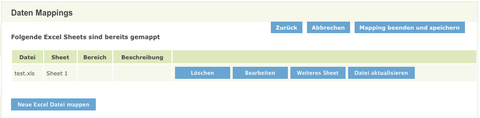
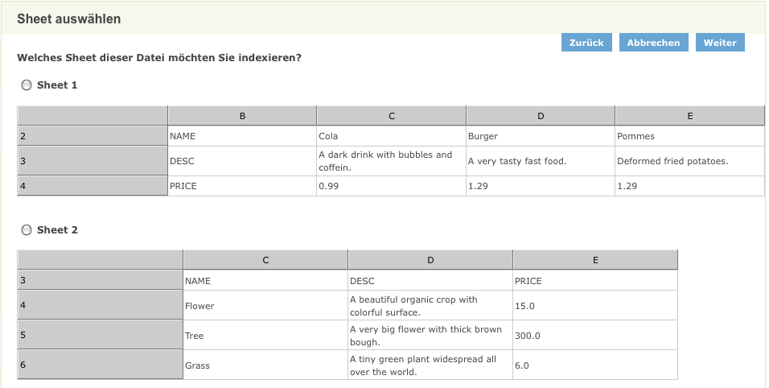
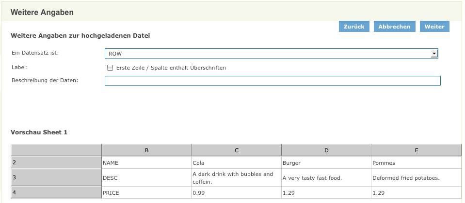
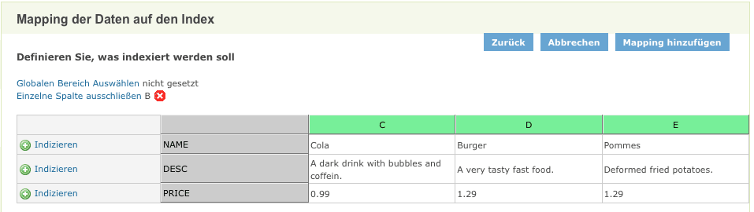
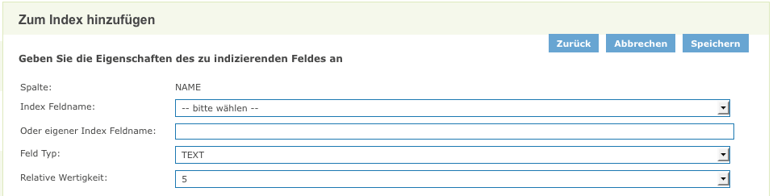
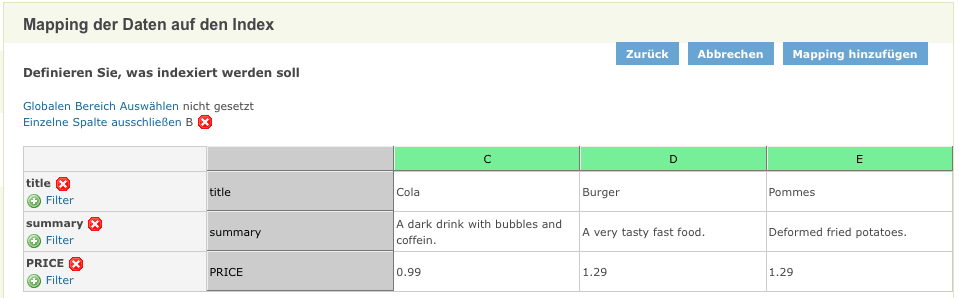

## Allgemeines

Das iPlug dient dem Indexieren von Excel Daten. Excel Dateien können komfortabel in einen Index abgebildet werden.

<figcaption class="figcaption">InGrid Komponente iPlug Excel</figcaption>

## Systemvoraussetzungen

* 64 MB RAM
* 50 MB Harddrive

* JAVA 1.7
* Cygwin (unter Windows)

## Installation

Download: [https://dev.informationgrid.eu/ingrid-distributions/ingrid-iplug-excel/](https://dev.informationgrid.eu/ingrid-distributions/ingrid-iplug-excel/)

Um die Installationsroutine zu starten, doppel-klicken Sie auf das Installationsprogramm oder geben Sie folgenden Befehl auf der Kommandozeile ein:


java -jar ingrid-iplug-excel-VERSION-installer.jar


Der Installer ist sowohl per graphischer Oberfläche als auch Kommandozeileneingabe ausführbar. Bitte folgen Sie den Anweisungen des Installationsprogrammes. Das Installationsprogramm installiert die Komponente im gewünschten Verzeichnis und passt die Konfigurationsdateien an.

Sie können nun das iPlug mit


sh start.sh start


starten.

Das iPlug besitzt eine Administrationsoberfläche über die die angeschlossenen iPlugs eingesehen und verwaltet werden können.


http://localhost:PORT


Anstelle von `localhost` können Sie auch die IP-Adresse des Computers eingeben. Authentifizieren Sie sich als 'admin' mit dem von Ihnen vergebenen Passwort.

Nach der ersten Installation wird die Administrations-GUI unter


http://localhost:8082


aufgerufen und die Konfiguration vervollständigt.

## Aktualisierung

Neues Release von [https://dev.informationgrid.eu/ingrid-distributions/ingrid-iplug-excel/](https://dev.informationgrid.eu/ingrid-distributions/ingrid-iplug-excel/) herunterladen.

iPlug stoppen.


sh start.sh stop


Aktuelles Installationsverzeichnis sichern:


cp -r /opt/ingrid/ingrid-iplug-excel BACKUP_DIRECTORY


Die Aktualisierung erfolgt über den Installer.


java -jar ingrid-iplug-excel-NEW-VERSION-installer.jar


Während der Installation bitte "Upgrade" auswählen und das Installationsverzeichnis Verzeichnis angeben.

iPlug starten.


sh start.sh start


## Betrieb


start.sh [start|stop|restart|status]


Die LOG Ausgaben finden sich in der Datei `log.log` und `console.log`.

## Konfiguration

### Basiskonfiguration

Die Basiskonfiguration für iPlugs kann [hier](iplug_admin_gui.html) eingesehen werden.

### Indexierung von Excel Dateien

#### Mapping

Im Bereich `Excel Daten Mapping` können die zu indexierenden Excel Dateien verwaltet werden.

Um eine neue Datei zu mappen, drücken Sie den Button `Neue Excel Datei mappen`.

Existieren bereits gemappte Dateien bzw. Sheets gibt es folgende Möglichkeiten die Einstellungen zu überarbeiten:

- `Löschen`: löscht ein gemapptes Sheet wieder
- `Bearbeiten`: öffnet das Mapping des Sheets, damit man diese bearbeiten kann
- `Weiteres Sheet`: um ein weiteres Sheet der selben Excel-Datei zu mappen
- `Datei aktualisieren`: für den Fall, dass sich der Inhalt der originalen Datei geändert hat

#### Datei auswählen

Um eine neue Excel Datei zu mappen, wählen Sie diese einfach aus und bestätigen Sie mit `Upload`.

#### Sheet auswählen

Falls ihre Datei mehrere Sheets (Tabellen) besitzt, gelangen sie nach dem hochladen der Excel Datei zu einer Vorschau, in welcher Sie wählen können, welches Sheet sie zum Mapping hinzufügen wollen.

Wählen Sie hierzu einfach das gewünsche Sheet aus und drücken Sie dann auf Weiter .

#### Sheet Einstellungen vornehmen

Es können bestimmte Grundeinstellungen für das Sheets vorgenommen.

Ein Sheet kann in zwei verschiedene Weisen aufgebaut sein:

- eine Zeile (ROW) enthält ein Dokument
- eine Spalte (COLUMN) enthält ein Dokument

Weiterhin besteht die Möglichkeit anzugeben, dass die erste Zeile/Spalte eines Sheets die Überschriften der einzelnen Felder enthält.

Auch eine benutzerdefinierte Beschreibung der Daten kann angegeben werden.

In diesem Beispiel entspricht ein Dokument einer Spalte - also einer COLUMN - und die erste Spalte enthält die Überschriften.

#### Felder indexieren

Ist die Einstellung des Sheet abgeschlossen, findet man sich in der Abbildungsübersicht wieder.

Hier hat man die Möglichkeit neue Felder zur Abbildung hinzuzufügen bzw. wieder zu entfernen, den globalen Bereich einzustellen, einzelne Dokumente auszuschließen und Filter zu Feldern hinzuzufügen bzw. wieder zu entfernen.

Um ein Feld zu mappen, genügt es in der entsprechenden Zeile/Spalte auf den dazugehörigen `Indizieren`-Link zu klicken.

Man findet sich daraufhin in einer Übersicht wieder, in der man die genauen Einstellungen des Feldes vornehmen kann.

Man kann entweder einer der vorgegebenen Feldnamen auswählen, oder aber einen eigenen Angeben.

> Achtung: es muss je Sheet genau einmal `title` und `summary` gemapped werden!

Ein evtl. vorhandener begrifflicher Raumbezug kann durch das Abbilden auf das Indexfeld `location` für das InGrid-System durchsuchbar gemacht werden.

Zudem ist es möglich die Wertigkeit dieses Feldes über das Eingabefeld `Relative Wertigkeit` zu ändern (der Wert "5" ist normal, höhere Werte stehen für höhere Wertigkeit).

Es gibt vier verschiedene Feldtypen :

- `TEXT` : für Text aller Art.
- `KEYWORD` : ebenfalls Text, jedoch ein Schlüsselbegriff (meistens nur ein Wort).
- `NUMBER` : Zahlen aller Art (ganze und Fließkommazahlen).
- `BOOLEAN` : Werte für wahr ( *true* ) und falsch ( *false* ).

Näheres zum Mapping der verschiedenen Feldtypen in den Index siehe XML-iPlug.

Ein Beispiel, wie ein fertig abgebildetes Sheet aussehen könnte:

#### Bereich definieren

Ein Sheet kann viele Daten beinhalten und dadurch auch sehr unübersichtlich werden.

Aus diesem Grund ist es möglich einen globalen Bereich zu definieren, um unwichtigen Inhalt aus dem Mappingvorgang auszuschließen. Der ausgeschlossene Bereich erscheint weder in der Vorschau, noch im Mapping. Jedoch werden Elemente die außerhalb des globalen Bereichs liegen auch nicht indexiert.

Den globalen Bereich kann man jederzeit verändern und auch wieder entfernen.

Will man hingegen nur einzelne Dokumente (d.h. Zeilen/Spalten) ausschließen, kann man dies über den Link `Einzelne Zeile/Spalte ausschließen` tun.

Entschließt man sich dazu, den ausgeschlossenen Datensatz wieder hinzuzufügen, kann man dies durch ein Klick auf das 'X' erreichen.

#### Filter hinzufügen

Manchmal ist es nicht gewollt, dass alle Datensätze im Index erscheinen aus diesem Grund ist das definieren von Filtern möglich.

Sobald man ein Feld zum Mapping hinzugefügt hat, hat man die Möglichkeit einen oder mehrere Filter auf dieses Feld anzuwenden.

Dabei gibt es sechs verschiedene Filter :

- `GREATER_THAN` : lässt nur Felder zu, deren Wert größer als der Wert ist.
- `LOWER_THAN` : lässt nur Felder zu, deren Wert kleiner als der Wert ist.
- `CONTAINS` : lässt nur Felder zu, die den Wert enhalten.
- `NOT_CONTAIN` : lässt nur Felder zu, die den Wert nicht enhalten.
- `EQUAL` : lässt nur Felder zu, die dem Wert gleichen.
- `NOT_EQUAL` : lässt nur Felder zu, die dem Wert nicht gleichen.

Der Wert ist hierbei frei wählbar und kann sowohl eine Zahl als auch eine Zeichenkette sein.

> ACHTUNG : wird ein Feld eines Elements durch einen Filter gefiltert, erscheint nicht nur das Feld sondern der gesamte Eintrag nicht im Index!

Ob ein Datensatz gefiltert wird oder nicht, kann man an der Färbung der jeweiligen Zeile/Spalte erkennen.

Ist diese grün, erfüllt das Dokument alle Filter und wird auch im Index erscheinen. Ist es rötlich gefärbt, erfüllt es mindestens einen Filter nicht.

### InGrid Communication

Die Datei `conf/communication.xml` enthält die Konfigurationen der InGrid Kommunikationsschicht.


<?xml version="1.0" encoding="UTF-8"?>
<communication xmlns:xsi="http://www.w3.org/2001/XMLSchema-instance"
    xsi:noNamespaceSchemaLocation="communication.xsd">
    <client name="/ingrid-group:iplug-management-'Ihr-Name'">
        <connections>
            <server name="/ingrid-group:ibus-'Ihr-Name'">
                <socket port="9900" timeout="10" ip="127.0.0.1" />
                <messages maximumSize="1048576" threadCount="100" />
            </server>
        </connections>
    </client>
    <messages queueSize="2000" handleTimeout="10"/>
</communication>


Die einzelnen Parameter haben folgende Bedeutung:

| Parameter                           | Beschreibung                                             |
|-------------------------------------|----------------------------------------------------------|
| client/@name                        | Eindeutige ID des iPLugs  |
| server/@name                        | Eindeutige ID des InGrid iBus  |
| socket/@port                        | Port unter dem die Administrations GUI zu erreichen ist |
| socket/@timeout               | Timeout der Socketverbindungen in sec |
| message/@maximumSize                | max. zulässige Größe einer Message in Bytes, die über den iBus versendet werden kann |
| message/@threadCount                | Anzahl der Verbindungen (Threads), die der iBus gleichzeitig aufrecht erhalten kann |
| message/@handleTimeout              | Timeout einer Message in sec (Wie lange wartet der iBus auf die Beantwortung einer Message.) |
| message/@queueSize                  | Message Queue (Wie viele Nachrichten können in der Warteschlange des iBus enthalten sein.) |

## FAQ

### Wie kann ich ein Überschreiben der Datei `env.sh` bei einer Aktualisierung verhindern.

In der Datei env.sh können Systemvariablen komponenten-spezifisch angepasst werden (z.B. Proxy oder Heap Einstellungen). Um die Einstellungen nach einer Aktualisierung nicht zu verlieren, muss die Datei `env.sh` nach `user.env.sh` kopiert werden. Die Änderungen in `user.env.sh` werden nicht überschrieben.

### Die iPlug Administration funktioniert nicht, es können keine Partner/Anbieter ausgewählt werden.

Mögliche Ursachen:

* Falsche Datenbank Verbindungsparameter
* Keine Verbindung zum iBus
* iPlug Management funktioniert nicht

Bitte analysieren Sie das log file des iPlugs.
Löschen Sie gegebenenfalls den Cache Ihres Browsers und starten sowohl das Portal als auch das iPlug neu.

Sie müssen nach einer Änderung der Konfiguration das iPlug immer neu starten
