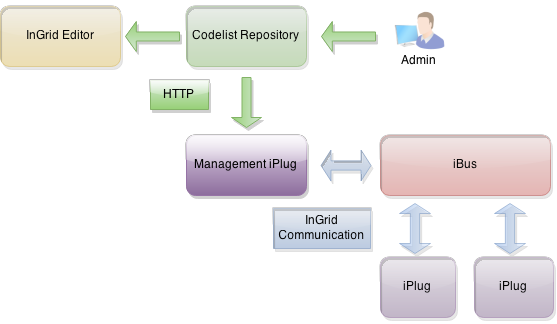
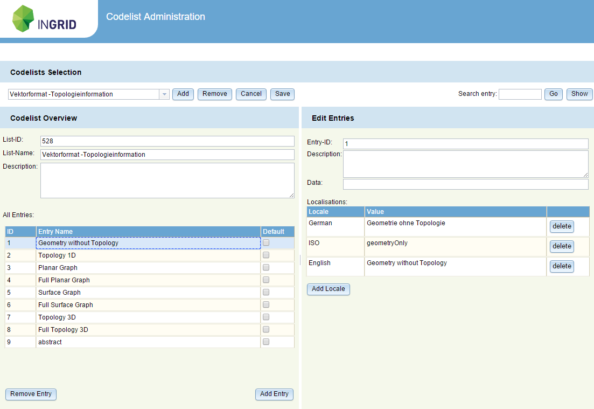

## Allgemeines

Das Codelist-Repository verwaltet diverse Codelisten, die in den InGrid spezifischen Datensätzen verwendet werden. Da diese Daten an verschiedenen Stellen (Portale, Schnittstellen, DSCs, ...) ausgegeben oder verarbeitet werden, empfahl es sich die Codelisten zentral zu verwalten, um einen konsistenten Zustand gewährleisten zu können.

Jede Komponente, die mit den Codelisten arbeitet, synchronisiert sich periodisch mit dem Repository und ist somit immer auf einen aktuellen Stand, sollte sich eine Codeliste verändern. Dabei wird das Repository alle 5 Minuten mit dem Zeitstempel der letzten veränderten Codeliste angefragt und erhält nur die Veränderungen, die seit dem Zeitstempel geschehen sind.

Eine direkte Kommunikation zum Codelist-Repository geschieht von allen Komponenten, die nicht mit dem iBus verbunden sind, wie zum Beispiel der InGrid-Editor. Eine Ausnahme bildet das Management-iPlug, welches als zentrale Komponente für die Codelistensynchronisation verwendet wird. Alle anderen am iBus angeschlossenen Komponenten fragen das Management-iPlug an, um die Codelisten zu synchronisieren.

<figcaption class="figcaption">InGrid Komponente Codelist Repository</figcaption>

Eine Kopie der Codelistdaten wird gewöhnlich in einer XML-Datei "data/codelists.xml" gehalten. Die Ausnahme bildet der InGrid-Editor, wo (aus Kompatibilitätsgründen) die Codelisten direkt in der Datenbank verwaltet werden.

## Systemvoraussetzungen

* 64 MB RAM
* 20 MB Harddrive

* JAVA 1.6
* Cygwin (unter Windows)

## Installation

Download: [https://distributions.informationgrid.eu/ingrid-codelist-repository/](https://distributions.informationgrid.eu/ingrid-codelist-repository/)

Um die Installationsroutine zu starten, doppel-klicken Sie auf das Installationsprogramm oder geben Sie folgenden Befehl auf der Kommandozeile ein:


java -jar ingrid-codelist-repository-VERSION-installer.jar


Der Installer ist sowohl per graphischer Oberfläche als auch Kommandozeileneingabe ausführbar. Bitte folgen Sie den Anweisungen des Installationsprogrammes. Das Installationsprogramm installiert das Codelist Repository im gewünschten Verzeichnis (default: `/opt/ingrid/ingrid-codelist-repository`) und passt die Konfigurationsdateien an.

Sie können nun die Komponente mit


sh start.sh start


starten.

Die Codelist-Repository-Administration wird im Webbrowser unter der folgenden Adresse


http://localhost:IHR_ADMIN_PORT


gestartet. Anstelle von localhost können Sie auch die IP-Adresse des Computers eingeben! Authentifizieren Sie sich als `admin` mit dem von Ihnen vergebenen Passwort.

## Aktualisierung

Neues Release von [https://distributions.informationgrid.eu/ingrid-codelist-repository/](https://distributions.informationgrid.eu/ingrid-codelist-repository/) herunterladen.

Komponente stoppen.


sh start.sh stop


Aktuelles Installationsverzeichnis sichern:


cp -r /opt/ingrid/ingrid-codelist-repository <BACKUP-DIRECTORY>


Die Aktualisierung erfolgt über den Installer.


java -jar ingrid-codelist-repository-NEW-VERSION-installer.jar


Während der Installation bitte "Upgrade" auswählen und das Installationsverzeichnis Verzeichnis angeben.

Komponente starten.


sh start.sh start


## Betrieb


start.sh [start|stop|restart|status]


Die LOG Ausgaben finden sich in der Datei `log.log` und `console.log`.

## Administration

Nachdem man sich als `admin` eingeloggt hat, wird die Administrationseite für die Codelisten angezeigt. Diese ist in drei Bereiche unterteilt. Im oberen Bereich gibt es eine Auswahlbox, in der die zu bearbeitende Codeliste ausgewählt werden kann. Sobald eine Codeliste ausgewählt ist, erscheint auf der linken Seite eine Übersicht über die ausgewählte Codeliste mit einer Auflistung der Einträge. Da ein Eintrag mehrere Lokalisierungen besitzen kann, wird standardmäßig Englisch für die Anzeige eines Eintrages in der Tabelle verwendet.

Nach einem Klick auf einen der Einträge einer Codeliste, wird auch der rechte Bereich mit Feldern gefüllt, die für die Bearbeitung eines Codelisteintrages zuständig sind. Neben der eindeutigen ID eines Eintrages und deren Beschreibung, gibt es eine Tabelle in der die verschiendenen Sprachen des Eintrages bearbeitet werden können. Zu den verschiedenen Lokalisierungen soll die folgende Tabelle auskunft geben:

|Typ|Kommentar|
|==|==|
|German, English, ...|Der Eintrag in der jeweilige Sprache.|
|ISO|Der ISO-Wert eines Eintrages.|
|Request Value| Wird verwendet für die Eindeutigkeit der Werte bei den Umweltthemen. |

Ein weiteres Feld ist das "Data"-Feld, in dem zusätzliche Informationen geschrieben werden können, die beim Empfänger der Codelisten ausgewertet werden können. Die Einträge in der Codeliste "2000" werden bspw. im IGE verwendet, um die Zuordnung zur Objektklasse zu definieren. Dazu werden die Objektklassen durch Kommata separiert in das Data-Feld geschrieben, z.B. "1,3,6". Ein Eintrag aus dieser Liste erscheint dann nur im Verweis-Dialog, wenn die Objektklasse eingetragen wurde.

Mit Hilfe von "Add Locale" wird eine neue Lokalisierung hinzugefügt. Mit "Remove Locale" wird die gerade ausgewählte Lokalisierung entfernt. Die Änderungen werden jedoch erst nach einem Klick auf die "Save"-Schaltfläche endgültig gespeichert und können mit "Cancel" rückgängig gemacht werden.

Generell werden alle Änderungen an einer Codeliste erst gespeichert, wenn die "Save"-Schaltfläche gedrückt wird. Eine Ausnahme ist das Löschen einer Codeliste, was über die "Remove"-Schaltfläche geschieht. Hierbei wird ein Dialogfenster geöffnet, wo das Löschen der Codeliste noch einmal bestätigt werden muss.
Hat man Änderungen an einer Codeliste vorgenommen und will zu einer anderen wechseln, so müssen die Änderungen zuerst gespeichert oder verworfen werden. Dies wird durch eine Dialogbox signalisiert.

In der "Codelist Overview" besteht die Möglichkeit einen Eintrag als Defaulteintrag auszuwählen. Im InGrid-Editor bewirkt dies, dass beim Anlegen eines neuen Objektes, der Defaulteintrag vorausgewählt ist.

Bei einem ausgewählten Eintrag, bewirkt ein Klick auf "Remove Entry", dass dieser aus der Liste entfernt wird. Endgültig jedoch erst nach dem Betätigen der "Save"-Schaltfläche! Mit "Add Entry" wird ein neuer Eintrag angelegt. Dieser muss mindestens eine eindeutige ID und eine gültige Lokalisierung aufweisen, bevor dieser gespeichert werden kann.

Ein Textfeld im oberen Bereich dient der schnellen Suche nach einem Codelisteneintrag. Nachdem man den eingegebenen Text mit Enter oder der "Go"-Schaltfläche betätigt, wird in der Schaltfläche daneben die Anzahl der Treffer angezeigt. Mit dieser Schaltfläche kann direkt zu den gefundenen Einträgen gesprungen werden.

## Konfiguration

### Nutzer für den Zugriff auf das Codelist-Repository

Während der Installation des Codelist-Repositories wird der Administrator mit Nutzernamen und Passwort angegeben. Weitere Nutzer können über die Datei realm.properties (im conf-Verzeichnis) hinzugefügt werden.

Beispiel: ein Benutzer `admin`, der auf alles Rechte hat und ein Benutzer `user` (Passwort: `user`), der nur auf die REST-Schnittstelle Zugriff hat, über welche die Codelisten angefragt werden können


# the administrator with full access (role: admin)
admin: MD5:21232f297a57a5a743894a0e4a801fc3,admin

# the user with access to receive codelists only (role: user)
user: user,user


## FAQ

### Welche Komponenten verwenden das Codelist-Repository?

Der InGrid-Editor und das Management-iPlug verwenden das Codelist-Repository direkt, d.h. dass diese Komponenten eine HTTP-Verbindung zum Repository aufnehmen und die Codelisten anfragen. Die Komponenten Portal, CSW-Schnittstelle und iPlug CSW-DSC fragen das Management-iPlug an, um die Codelisten zu synchronisieren.

Das iPlug DSC-scripted verwendet keine Codelisten vom Repository, da es direkt die Codelisten verwendet, die in der Datenbank definiert sind. Da es lokale Codelisten geben kann, die nicht im zentralen Repository vorhanden sind, müssen die Codelisten aus der Datenbank verwendet werden. Für die Synchronisation der Datenbank ist der InGrid-Editor verantwortlich.

### Welche Codelisten werden weiterhin in den einzelnen InGrid Katalogen gepflegt?

Folgende Codelisten stellen Ausnahmen dar und können in jedem Einzelkatalog weiterhin durch den Katalogadministrator im Bereich Katalogverwaltung geändert bzw. ergänzt werden:

- Freier Raumbezug
- Zusatzinformation - Rechtliche Grundlagen
- XML Export Kriterium
- Geo-Information/Karte - Fachbezug - Schlüsselkatalog
- Geo-Information/Karte - Fachbezug - Symbolkatalog
- Verfügbarkeit - Zugangsbeschränkungen
- Verfügbarkeit - Nutzungsbedingungen

Wenn Sie eine eigene InGrid-Katalog-Installation betreiben oder vornehmen wollen, so können Sie also entweder für diesen Katalog ein eigenes Codelisten- Repository installieren und den Katalog damit verbinden, oder aber Sie verbinden den Katalog mit dem zentralen Codelisten-Repository, welches von der Koordinierungsstelle PortalU betrieben wird. Letzteres wird von uns empfohlen, da damit sichergestellt ist, dass in allen Katalogen einheitliche Bezeichnungen in den Auswahllisten verwendet werden.

### Wie verwendet man ein anderes Codelist-Repository?

Generell wird während der Installation einer Komponente nach der URL und den Zugangsdaten für das Codelist-Repository nachgefragt. Dies gilt allerdings nur für die Komponenten mit direkten Zugriff auf das Repository, also dem InGrid-Editor und Management-iPlug. Die anderen Komponenten müssen nicht konfiguriert werden, da sie das Management-iPlug zur Anfrage verwenden.

Die Konfiguration für das Codelist-Repository befindet sich in der spring.xml innerhalb des "webapps/WEB-INF"-Verzeichnisses (oder configuations.xml). Dort ist ein Bean definiert mit der ID "httpCommunication", welches die Eigenschaften "requestUrl", "username" und "password" definiert. Dort können die Werte angepasst werden, so dass ein anderes Repository angefragt wird. Die Komponente muss neu gestartet werden, so dass die Änderungen übernommen werden!

### Wann werden Änderungen in einer Codeliste in den Komponenten wirksam?

Jede Komponente, die mit den Codelisten arbeitet, synchronisiert sich periodisch mit dem Repository und ist somit immer auf einen aktuellen Stand, sollte sich eine Codeliste verändern. Dabei wird das Repository alle 5 Minuten mit dem Zeitstempel der letzten veränderten Codeliste angefragt und erhält nur die Veränderungen, die seit dem Zeitstempel geschehen sind.

Im InGrid-Editor werden die Änderungen in der Erfassungsmaske allerdings erst nach einem Neustart (Abmelden- und Anmelden) durch den Nutzer sichtbar, da im Frontend die geänderten Codelisten nur beim Start der Anwendung gelesen werden.

### Wie erzwingt man eine komplette Aktualisierung?

Typischerweise wird das Codelist-Repository mit einem Zeitstempel angefragt, um nur die Änderungen zu empfangen. Ist die eigene Codeliste, aus welchen Gründen auch immer, kaputt, kann man eine Komplettsynchronisation erzwingen, indem die Datei "data/codelists.xml" gelöscht wird. Bei einer erneuten Synchronisation werden die gesamten Codelisten übertragen.

Beim InGrid-Editor ist dies jedoch anders zu bewerkstelligen, da die Codelisten in der Datenbank gehalten werden. Jeder InGrid-Catalogue besitzt einen Zeitstempel der letzten modifizierten Codeliste. Wird dieser Zeitstempel aus der Datenbank entfernt, so werden alle Codelisten neu angefragt. Der Zeitstempel befindet sich in der Tabelle "sys_generic_key" unter dem key_name: "lastModifiedSyslist".

Bei jeder Installation wird der Zeitstempel von allen Codelisten auf das Installationsdatum gesetzt. Somit werden alle verbundene Clients mit dem aktuellen Stand der Codelisten versorgt. Wird die Update-Funktion des Installers verwendet, so werden nur die neu hinzu gekommenden bzw. veränderten Codelisten mit einem Updatezeitstempel versehen.

### Datenfelder für spezielle Codelisten

| Codeliste | Definition | Beschreibung|
| == | == | == |
6300 | Version und Spezifikation in Hochkommata getrennt von einem Komma  z.B.: "Version 1.1","Spez. 4" | Die zusätzlichen Angaben für einen Eintrag aus dem INSPIRE-Datenformat werden im DSC-scripted verwendet, um das IDF-Dokument zu generieren. Sind Version und Spezifikation mit angegeben, so werden diese unter MD_Format mit ausgegeben.
1100 | Leerzeichen separierte Liste von Koordinaten  z.B.: "9,605 52,304 9,918 52,454" | Diese Liste wird nicht im Codelist-Repository sondern im IGE selbst gepflegt. Zu jedem freien Raumbezug können die BoundingBox-Koordinaten mit angegeben werden, die bei der Auswahl des Eintrags in der Objektbearbeitung, automatisch in die dazugehörigen Feldern eingetragen werden.
2000 | Kommata separierte Liste von Objektklassen  z.B.: "1,3,6" | Im Verweisdialog eines Objekts kann ein Verweistyp ausgewählt werden. Diese werden über die Codeliste 2000 definiert. Durch die Angabe der Objektklassen im Data-Feld, wird bestimmt, in welcher Klasse des Objekts dieser Typ angezeigt werden soll. Ist das Data-Feld leer, so wird der Verweistyp niemals in diesem Dialog angezeigt. Jedoch kann dieser für die interne Verarbeitung genutzt werden, wie es bspw. mit dem Eintrag "Gekoppelte Daten" (3600) geschieht.
