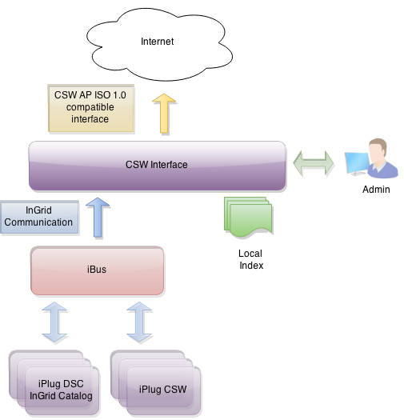

## Allgemeines

Die CSW-Schnittstelle bietet Zugang zur InGrid-Suche über die [OGC CSW 2.0.2 AP ISO 1.0](http://www.opengeospatial.org/standards/cat) Schnittstellenspezifikation. Die Komponente bezieht die grundlegenden Daten aus einer oder mehreren Datenquellen. Die Datenquellen werden regelmäßig indexiert. Es wird ein lokaler Index vorgehalten, so dass eine CSW-Anfrage nicht zur Abfrage von den Datenquellen führt. Dies sichert die hohe Performance der Schnittstelle und vermeidet Inkompatibilitäten zwischen der [OGC CSW 2.0.2 AP ISO 1.0](http://www.opengeospatial.org/standards/cat) eigenen Abfragesprache und der InGrid Query.

Die Schnittstelle bietet die Möglichkeit bestimmte Einschränkungen in der Anfrage vorzunehmen, um z.B. ausschließlich Anbieter-spezifische Daten auszuliefern.

<figcaption class="figcaption">InGrid Komponente CSW Schnittstelle</figcaption>

Die Entwicklung der Schnittstelle wurde mit der OGC CSW 2.0.2 AP ISO 1.0 [Testsuite der GDI-DE](http://testsuite.gdi-de.org/gdi/) getestet.

Die Schnittstelle bildet Daten aus dem InGrid Catalog Datenraum wie folgt ab:

| InGrid Catalog Typ | ISO hierarchyLevel | ISO "hierarchyLevelName"
| == | == | == |
| Geodatendienst | service | service |
| Geo-Information/Karte | dataset |  |
| Dienst/Anwendung/Informationssystem | application | application |
| Dokument/Bericht/Literatur | nonGeographicDataset | document |
| Vorhaben/Projekt/Programm | nonGeographicDataset | project |
| Datensammlung/Datenbank | nonGeographicDataset | database |
| Organisationseinheit/Fachaufgabe | nonGeographicDataset | job |

## Systemvoraussetzungen

* 64 MB RAM
* 50 MB Harddrive

* JAVA 1.7
* Cygwin (unter Windows)

## Installation

Download: [https://dev.informationgrid.eu/ingrid-distributions/ingrid-interface-csw/](https://dev.informationgrid.eu/ingrid-distributions/ingrid-interface-csw/)

Um die Installationsroutine zu starten, doppel-klicken Sie auf das Installationsprogramm oder geben Sie folgenden Befehl auf der Kommandozeile ein:


java -jar ingrid-interface-csw-VERSION-installer.jar


Der Installer ist sowohl per graphischer Oberfläche als auch Kommandozeileneingabe ausführbar. Bitte folgen Sie den Anweisungen des Installationsprogrammes. Das Installationsprogramm installiert die Komponente im gewünschten Verzeichnis und passt die Konfigurationsdateien an.

Sie können nun die Komponente mit


sh start.sh start


starten.

Die Komponente besitzt eine Administrationsoberfläche.


http://localhost:PORT


Anstelle von `localhost` können Sie auch die IP-Adresse des Computers eingeben. Authentifizieren Sie sich als 'admin' mit dem von Ihnen vergebenen Passwort.

Nach der ersten Installation wird die Administrations-GUI unter


http://localhost:8082


aufgerufen und die Konfiguration vervollständigt.

## Aktualisierung

Neues Release von [https://dev.informationgrid.eu/ingrid-distributions/ingrid-interface-csw/](https://dev.informationgrid.eu/ingrid-distributions/ingrid-interface-csw/) herunterladen.

Komponente stoppen.


sh start.sh stop


Aktuelles Installationsverzeichnis sichern:


cp -r /opt/ingrid/ingrid-interface-csw BACKUP_DIRECTORY


Die Aktualisierung erfolgt über den Installer.


java -jar ingrid-interface-csw-NEW-VERSION-installer.jar


Während der Installation bitte "Upgrade" auswählen und das Installationsverzeichnis Verzeichnis angeben.

Komponente starten.


sh start.sh start


## Betrieb


start.sh [start|stop|restart|status]


Die LOG Ausgaben finden sich in der Datei `log.log` und `console.log`.

Der Zugang zur allgemeinen CSW-Schnittstelle ist über der folgenden URL erreichbar:


http://<csw-admin-url>/csw


Für die CSW-T-Schnittstelle, die zusätzlich abgesichert ist (siehe weiter unten), wird hingegen folgende URL benötigt:


http://<csw-admin-url>/csw-t


## Konfiguration

Die CSW Schnittstelle lässt sich über eine Admin-GUI administrieren, die über den im Installer gesetzten Port erreichbar ist. Hier lassen sich Datenquellen hinzufügen und entfernen, das Scheduling für den Harvesting-Prozess definieren und eine Test-Suche ausführen.

### CSW-T Schnittstelle

Die CSW-T Schnittstelle ermöglicht das Ausführen von Operationen auf einem IGE-iPlug, um Datensätze zu erstellen, zu ändern oder auch zu löschen. Dadurch lassen sich die Datensätze auch ohne den InGrid-Editor verwalten. Jede abgesetzte Transaktion wird entweder komplett oder bei einem Fehler, gar nicht ausgeführt.

#### Login für CSW-T Schnittstelle

Die CSW-T Schnittstelle wird mittels einer "Basic Authentication" für den unbefugten Zugriff abgesichert. Bevor diese verwendet werden kann, müssen die Benutzer erstellt werden, die darauf Zugriff haben sollen. Da die CSW-Schnittstelle unabhängig vom IGE-iPlug läuft, wird hier ein separater Zugang benötigt.

In der Datei "conf/csw-t.realm.properties", werden die Benutzer per Hand eingetragen. Hierfür gilt folgende Syntax:


username: password[,rolename ...]


wobei der Rollenname auf "user" stehen muss, um den Zugriff zu erhalten. Das Passwort kann als Klartext oder als MD5-verschlüsseltes Passwort abgelegt werden. Wenn verschlüsselt, dann lautet die Syntax:


username: MD5:password[,rolename ...]


Unter Unix lässt sich das Passwort wie folgt mittels MD5 verschlüsseln:


echo -n "password" | md5sum


Nachdem diese Datei verändert wurde, muss die CSW-Schnittstelle neu gestartet werden.

#### CSW-T Communication

Hier wird die Kommunikation zum iBus definiert, an dem sich die anzusprechenden IGE-iPlugs befinden.

| Feld                           | Beschreibung                                             |
|--------------------------------|----------------------------------------------------------|
| Client Proxy ID                | Eindeutige ID des iPlugs  |
| iBus IP	                     | IP Adresse unter der der iBus erreichbar ist  |
| iBus port                      | Port der vom iBus verwendet wird  |
| iBus proxy id                  | Eindeutige ID des iBus  |

Mit dem Klick auf "Save Communication" werden die Einstellungen gespeichert und die CSW-T-Schnittstelle kann verwendet werden, insofern ein Benutzerlogin hierfür erstellt wurde.

#### Verwendung

Um eine CSW-T Anfrage zu stellen, müssen folgende URL-Parameter verwendet werden:

| Parameter     | WERT           | Kommentar                                             |
|---------------|----------------|----------------------------------------------------------|
| SERVICE       | CSW            | Dieser Wert ist unveränderbar.  |
| REQUEST       | Transaction    | Dieser Wert ist unveränderbar.  |
| catalog       | (ige-iplug-id) | Hier wird die ClientID des IGE-iPlugs angegeben, auf dem die Transaktion angewendet werden soll.  |

Eine Beispielanfrage sieht demnach folgendermaßen aus:
> http://(cswt-interface-address)?SERVICE=CSW&REQUEST=Transaction&catalog=/ingrid-group:ige-test

Für den zu übertragenden Inhalt wird im Body der Datensatz im XML-Format hinterlegt. Innerhalb einer Transaktion werden eine beliebige Anzahl von Aktionen unterstützt, die vom Typ: **INSERT**, **UPDATE** und **DELETE** sein müssen.

| Aktion                | Beschreibung                                             |
|-----------------------|----------------------------------------------------------|
| INSERT                | Fügt einen neuen Datensatz ein. Ist ein Datensatz bereits vorhanden, so wird ein Fehler zurückgegeben.  |
| UPDATE	            | Aktualisiert einen bestehenden Datensatz. Falls ein Datensatz nicht existiert, so wird ein Fehler zurückgegeben.  |
| DELETE                | Löscht einen vorhandenen Datensatz. Ist dieser Datensatz nicht vorhanden, so wird ein Fehler zurückgegeben. |

Es können mehrere Aktionen innerhalb einer Transaktion ausgeführt werden. Bei einer erfolgreichen Transaktion wird eine Zusammenfassung der ausgeführten Operationen ausgegeben.

Ein Auszug aus einer INSERT-Aktion sieht folgendermaßen aus:


<csw:Transaction service="CSW" version="2.0.2" xmlns:csw="http://www.opengis.net/cat/csw/2.0.2" xmlns:xsi="http://www.w3.org/2001/XMLSchema-instance"
    xsi:schemaLocation="http://www.opengis.net/cat/csw/2.0.2 http://schemas.opengis.net/csw/2.0.2/CSW-publication.xsd">
    <csw:Insert>
        <gmd:MD_Metadata xmlns:srv="http://www.isotc211.org/2005/srv" xmlns:gts="http://www.isotc211.org/2005/gts" xmlns:gml="http://www.opengis.net/gml" xmlns:gmd="http://www.isotc211.org/2005/gmd"
            xmlns:gco="http://www.isotc211.org/2005/gco">
            <gmd:fileIdentifier>
                <gco:CharacterString>4915275a-733a-47cd-b1a6-1a3f1e976948</gco:CharacterString>
            </gmd:fileIdentifier>
            <gmd:language>
                <gmd:LanguageCode codeList="http://standards.iso.org/ittf/PubliclyAvailableStandards/ISO_19139_Schemas/resources/Codelist/ML_gmxCodelists.xml#LanguageCode"
                    codeListValue="ger">ger</gmd:LanguageCode>
            </gmd:language>
            <gmd:parentIdentifier>
                <gco:CharacterString>A3E10CDE-45BF-4D95-BA60-0EDE6777XXXX</gco:CharacterString>
            </gmd:parentIdentifier>
            ...
        </gmd:MD_Metadata>
    </csw:Insert>
</csw:Transaction>


### Manage Harvester

Unter diesem Punkt können die Datenquellen der CSW Schnittstelle verwaltet werden. Je nach Harvester-Typ ist die Oberfläche unterschiedlich:

**InGrid iBus harvester**

Mit dem InGrid iBus harvester, können iPlugs aus eine InGrid System in der CSW Schnittstelle indexiert werden. Die iPlugs müssen das IDF Format unterstützen und im IDF Format ISO Daten liefern.

Ablauf:

- Mit der Angabe der Kommunikations-Daten für den iBus werden alle iPlugs, die am iBus abgeschlossen sind gelistet
- ein oder mehrere iPlugs können aktiviert werden
- Bestimmte Eigenschaften, wie die abzusetzende InGrid?-Query und Abfrage-Paraneter können in der Detailansicht des iPlugs editiert werden

**GDI-DE test data harvester**

Dieser Harvester dient ausschließlich zu Testzwecken. Testdaten werden indexiert, die für den Test gegen die GDI-DE Testsuite erforderlich sind. Der Harvester sollte im LIVE Betrieb nicht aktiviert werden.

### Control Scheduler

Unter diesem Punkt kann festgelegt werden, wann und mit welcher Regelmäßigkeit das Harvesting durchgeführt werden soll. Die Bedienung entspricht dem im InGrid-System verwendeten Scheduling-Konzept. Siehe auch unter Scheduling.

### Manually issue harvesting

Hier kann der Harvesting-Prozess manuell angestoßen werden.

### Test-Search

Die Test-Suche erlaubt die Suche im Datenbestand. Als Suchbegriff wird ein Einzelnes Wort (mit `*` als Wildcard), oder ein kompletter GetRecords-Request (XML Format) akzeptiert.

Es werden jeweils nur die ersten 10 Treffer angezeigt. Ein Klick auf ein Suchergebnis öffnet die ISO Daten des Datensatzes.

## FAQ

### Wie kann ich ein Überschreiben der Datei `env.sh` bei einer Aktualisierung verhindern.

In der Datei env.sh können Systemvariablen komponenten-spezifisch angepasst werden (z.B. Proxy oder Heap Einstellungen). Um die Einstellungen nach einer Aktualisierung nicht zu verlieren, muss die Datei `env.sh` nach `user.env.sh` kopiert werden. Die Änderungen in `user.env.sh` werden nicht überschrieben.

### Die Schnittstelle liefert keine Ergebnisse.

Folgende Fehlerquellen können vorliegen:

- Falsche CSW Querysyntax

Bitte überprüfen Sie zunächst das log file.

### Wie kann eine CSW Schnittstelle getestet werden?

Zum Testen eignen sich Tools wie SoapUI oder das Firefox-Plugin Poster:

Weblinks:

- SoapUI: [http://www.soapui.org/](http://www.soapui.org/)
- Poster: [https://addons.mozilla.org/en-US/firefox/addon/2691/](https://addons.mozilla.org/en-US/firefox/addon/2691/)

**GetCapabilities, GET**


https://dev.informationgrid.eu/csw?REQUEST=GetCapabilities&SERVICE=CSW


**GetCapabilities, SOAP**

Der Endpoint für den SOAP Request ergibt sich aus der Capabilities Antwort. Als Content Type des Requests muss application/soap+xml angegeben werden.


<?xml version="1.0" encoding="UTF-8"?>
<GetCapabilities xmlns="http://www.opengis.net/cat/csw/2.0.2" service="CSW" version="2.0.2" outputSchema="http://www.opengis.net/cat/csw/2.0.2" xmlns:xsi="http://www.w3.org/2001/XMLSchema-instance"  xsi:schemaLocation="http://www.opengis.net/cat/csw/2.0.2" />


**GetRecods, GET**

Der Endpoint für den GET Request ergibt sich aus der Capabilities Antwort.


https://dev.informationgrid.eu/csw?REQUEST=GetRecords&SERVICE=CSW&elementSet=full&startPosition=1&maxRecords=10&resultType=results


**GetRecords, SOAP**

Der Endpoint für den SOAP Request ergibt sich aus der Capabilities Antwort. Als Content Type des Requests muss application/soap+xml angegeben werden.


<?xml version="1.0" encoding="UTF-8"?>
<GetRecords  xmlns="http://www.opengis.net/cat/csw/2.0.2" xmlns:ogc="http://www.opengis.net/ogc" xmlns:gmd="http://www.isotc211.org/2005/gmd" xmlns:apiso="http://www.opengis.net/cat/csw/apiso/1.0" xmlns:ows="http://www.opengis.net/ows" xmlns:xsd="http://www.w3.org/2001/XMLSchema" xmlns:dc="http://purl.org/dc/elements/1.1/" xmlns:dct="http://purl.org/dc/terms/"  xmlns:gml="http://www.opengis.net/gml" xmlns:xsi="http://www.w3.org/2001/XMLSchema-instance" xsi:schemaLocation="http://www.opengis.net/cat/csw/2.0.2" service="CSW" version="2.0.2" resultType="results" outputFormat="application/xml" outputSchema="http://www.isotc211.org/2005/gmd" startPosition="1" maxRecords="10">
  <Query typeNames="gmd:MD_Metadata,csw:service">
    <ElementSetName typeNames="">full</ElementSetName>
    <Constraint version="1.1.0">
       <ogc:Filter>
          <ogc:PropertyIsLike escapeChar="\" singleChar="?" wildCard="*">
             <ogc:PropertyName>AnyText</ogc:PropertyName>
             <ogc:Literal>wasser</ogc:Literal>
          </ogc:PropertyIsLike>
       </ogc:Filter>
    </Constraint>
  </Query>
</GetRecords>


**GetRecordById, GET**


https://dev.informationgrid.eu/csw?SERVICE=CSW&REQUEST=GetRecordById&VERSION=2.0.2&ID=98E56BC3-20EC-43A7-8270-1352F0A53AD4


**GetRecordById, SOAP**

Der Endpoint für den SOAP Request ergibt sich aus der Capabilities Antwort. Als Content Type des Requests muss application/soap+xml angegeben werden.


<GetRecordById xmlns="http://www.opengis.net/cat/csw/2.0.2"
service="CSW" version="2.0.2"
outputSchema="http://www.opengis.net/cat/csw/2.0.2"
xmlns:xsi="http://www.w3.org/2001/XMLSchema-instance"
xsi:schemaLocation="http://www.opengis.net/cat/csw/2.0.2" >
   <Id>98E56BC3-20EC-43A7-8270-1352F0A53AD4</Id>
   <ElementSetName>full</ElementSetName>
</GetRecordById>


**DescribeRecord, GET**


https://dev.informationgrid.eu/csw?SERVICE=CSW&REQUEST=DescribeRecord&VERSION=2.0.2


**DescribeRecord, SOAP**

Der Endpoint für den SOAP Request ergibt sich aus der Capabilities Antwort. Als Content Type des Requests muss application/soap+xml angegeben werden.


<?xml version="1.0" encoding="UTF-8"?>
<DescribeRecord xmlns="http://www.opengis.net/cat/csw/2.0.2"
xmlns:gmd="http://www.isotc211.org/2005/gmd"
schemaLanguage="http://www.w3.org/XML/Schema"
service="CSW" version="2.0.2">
</DescribeRecord>


### Die Queryeinschränkungen PropertyEqualsTo und PropertyIsLike angewendet auf den Titel liefern gleiche Ergebnismengen, bzw. Suche nach exakten Titel ist nicht möglich.

Die Anfrage wird umgesetzt in eine "title:" Lucene Query (z.B. "title:wasser"), die tatsächlich alle Titel zurück gibt, die den Literal enthalten.

Eine Query auf exakte Übereinstimmung ist im Feld title nicht zu formulieren, weil das Feld im Index tokenized vorliegt. Das macht auch Sinn, damit Teile des Titels durch Anfragen gefunden werden. Dies ist der Grund, dass `PropertyEquals` und `PropertyIsLike` in diesem Fall gleiche Ergebnismengen zurückliefern.

Der Unterschied zwischen `PropertyEqualsTo` zu `PropertyIsLike` wird bei `title:*` klar. In diesem Fall werden auch zusammengesetzte Worte im Titel, die mit dem Literal beginnen gefunden.

### Partner-spezifische Auslieferung von Capabilities Dokumenten.

Über einen Query-Parameter `partner` kann die partner-spezifische Auslieferung von Capability Dokumenten gesteuert werden. Für jeden Partner muss dazu ein File im `conf` Verzeichnis mit entsprechender Kennung erzeugt werden:


INSTALL_DIRECTORY/conf/csw_capabilities_<partner>.xml


Bsp:


conf/csw_capabilities_test.xml


kann über die URL


http://dev.informationgrid.eu/csw?REQUEST=GetCapabilities&SERVICE=CSW&partner=test


abgerufen werden. Existiert keine Datei mit entsprechender Erweiterung, wird die Standard-Capabilities `conf/csw_capabilities.xml` ausgeliefert

### Einschränkung der Ergebnismenge auf Partner, Anbieter oder iPlug.

Die Einschränkung auf Partner, Anbieter oder iPlug in der CSW Schnittstelle kann über die CSW Service URL vorgenommen werden.

Dazu wird der Service URL per GET Parameter die entsprechende Einschränkung mitgegeben.

z.B. liefert


http://dev.informationgrid.eu/csw202?partner=ni


ausschließlich Ergebnisse des Partners "ni" zurück. Weitere gültige Parameter sind

- `provider` Filterung nach einem bestimmten Anbieter(kürzel)
- `iplug`  Filterung nach einer bestimmten iPlug-ID

Bei entsprechender Konfiguration eines vorgeschalteten Web-Servers (URL-rewrite) kann die Einschränkung auch in den Pfad integriert werden. Die Service-URL könnte dann auch so aussehen:


http://dev.informationgrid.eu/csw/partner/bund


Konfigurationsbeispiel Apache Konfiguration:


RewriteEngine on
# Die folgende Regel schreibt die Anfragen an csw um und leitet sie wie
# einen Proxy-Request an 8083:csw weiter:

RewriteRule ^/csw/partner/(.*)$ http://127.0.0.1:8083/csw?partner\=$1 [P]
RewriteRule ^/csw/provider/(.*)$ http://127.0.0.1:8083/csw?provider\=$1 [P]


Die Einschränkungen können auch direkt in der CSW Anfrage formuliert werden. Intern ist es tatsächlich so, dass die Einschränkungen in der URL in eine Einschränkung innerhalb der Filter-Query der CSW Anfrage umgesetzt werden.
