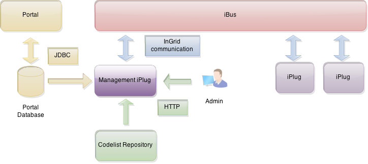

## Allgemeines

Das Management-iPlug dient als Schnittstelle zwischen den Komponenten des Systems (iBus, iPlugs) und der Portal-Datenbank. In der Datenbank liegen Informationen, die von den iPlugs und deren Administrationsschnittstellen genutzt werden, z.B.:

- Informationen über Partner/Anbieter
- CodeListen
- Anmeldeinformationen

<figcaption class="figcaption">InGrid Komponente iPlug Management</figcaption>

## Systemvoraussetzungen

* 64 MB RAM
* 1 GB Harddrive

* JAVA 1.6
* Cygwin (unter Windows)

## Installation

Download: [https://dev.informationgrid.eu/ingrid-distributions/ingrid-iplug-management/](https://dev.informationgrid.eu/ingrid-distributions/ingrid-iplug-management/)

Um die Installationsroutine zu starten, doppel-klicken Sie auf das Installationsprogramm oder geben Sie folgenden Befehl auf der Kommandozeile ein:


java -jar ingrid-iplug-management-VERSION-installer.jar


Der Installer ist sowohl per graphischer Oberfläche als auch Kommandozeileneingabe ausführbar. Bitte folgen Sie den Anweisungen des Installationsprogrammes. Das Installationsprogramm installiert die Komponente im gewünschten Verzeichnis und passt die Konfigurationsdateien an.

Sie können nun das iPlug mit


sh start.sh start


starten.

Das iPlug besitzt eine Administrationsoberfläche über die die angeschlossenen iPlugs eingesehen und verwaltet werden können. Geben Sie als `PORT` den bei der Installation angegebenen Port für die Administration an.


http://localhost:PORT


Anstelle von `localhost` können Sie auch die IP-Adresse des Computers eingeben. Authentifizieren Sie sich als 'admin' mit dem von Ihnen vergebenen Passwort.

## Aktualisierung

Neues Release von [https://dev.informationgrid.eu/ingrid-distributions/ingrid-iplug-management/](https://dev.informationgrid.eu/ingrid-distributions/ingrid-iplug-management/) herunterladen.

iPlug stoppen.


sh start.sh stop


Aktuelles Installationsverzeichnis sichern:


cp -r /opt/ingrid/ingrid-iplug-management <BACKUP-DIRECTORY>


Die Aktualisierung erfolgt über den Installer.


java -jar ingrid-iplug-management-NEW-VERSION-installer.jar


Während der Installation bitte "Update" auswählen und das vorhandene Installationsverzeichnis angeben.

iPlug starten.


sh start.sh start


## Betrieb


start.sh [start|stop|restart|status]


Die LOG Ausgaben finden sich in der Datei `log.log` und `console.log`.

## Konfiguration

Über die Administrationsoberfläche wird die Konfiguration des iPlugs vorgenommen.
Alle benutzerspezifischen Parameter werden in der Datei `conf/config.override.properties` abgelegt, damit diese bei einer Aktualisierung der Installation (Update im Installer) nicht überschrieben werden.
Aus dieser Datei werden beim Start des iPlugs weitere benötigte Dateien generiert (`communication.xml`, `plugdescription.xml`).

### Basiskonfiguration

Die Basiskonfiguration für iPlugs kann [hier](iplug_admin_gui.html) eingesehen werden.

### Datenbank-Konfiguration

Die Parameter der Portal-Datenbank werden bereits im Installer eingegeben und können über die Administrationsoberfläche angepasst werden (Datenbankeinstellungen). Unterstützt werden die Datenbanken MySQL, Oracle und PostgreSQL (ab InGrid 4.0.2).
Die Datenbankparameter werden in der Datei `conf/repository_database.xml` abgelegt.

Im folgenden ist die Konfiguration einer MySQL-Datenbank wiedergegeben:


<jdbc-connection-descriptor
	   jcd-alias="databaseMySQL"
	   default-connection="true"
	   platform="MySQL"
	   jdbc-level="2.0"
	   driver="com.mysql.jdbc.Driver"
	   protocol="jdbc"
	   subprotocol="mysql"
	   dbalias="//localhost/ingrid-portal"
	   username="dbUsername"
	   password="dbPassword"
	   useAutoCommit="1"
>
 

Für Oracle hier eine beispielhafte Konfiguration:


<jdbc-connection-descriptor
	   jcd-alias="databaseOracle"
	   default-connection="true"
	   platform="Oracle"
	   jdbc-level="3.0"
	   driver="oracle.jdbc.OracleDriver"
	   protocol="jdbc"
	   subprotocol="oracle"
	   dbalias="thin:@localhost:1521:XE"
	   username="dbUsername"
	   password="dbPassword"
	   useAutoCommit="1"
>
 

Beispielhafte Konfiguration für PostgreSQL (ab InGrid 4.0.2): 


<jdbc-connection-descriptor
       jcd-alias="databasePostgreSQL"
       default-connection="true"
       platform="PostgreSQL"
       jdbc-level="2.0"
       driver="org.postgresql.Driver"
       protocol="jdbc"
       subprotocol="postgresql"
       dbalias="//localhost:5432/ingrid_portal"
       username="postgres"
       password="dbPassword"
       useAutoCommit="1"
>
 

### InGrid Communication

Die Datei `conf/communication.xml` enthält die Konfiguration der InGrid Kommunikationsschicht. Diese wird aus den benutzerspezifischen Inhalten der Datei `conf/config.override.properties` generiert (s.o.).


<?xml version="1.0" encoding="UTF-8"?>
<communication xmlns:xsi="http://www.w3.org/2001/XMLSchema-instance"
    xsi:noNamespaceSchemaLocation="communication.xsd">
    <client name="/ingrid-group:iplug-management-'Ihr-Name'">
        <connections>
            <server name="/ingrid-group:ibus-'Ihr-Name'">
                <socket port="9900" timeout="10" ip="127.0.0.1" />
                <messages maximumSize="1048576" threadCount="100" />
            </server>
        </connections>
    </client>
    <messages queueSize="2000" handleTimeout="10"/>
</communication>


Die einzelnen Parameter haben folgende Bedeutung:

| Parameter                           | Beschreibung                                             |
|-------------------------------------|----------------------------------------------------------|
| client/@name                        | Eindeutige ID des iPlugs  |
| server/@name                        | Eindeutige ID des InGrid iBus  |
| socket/@port                        | Port unter dem der iBus erreichbar ist (Verbindungsaufnahme) |
| socket/@timeout               | Timeout der Socketverbindungen in sec |
| message/@maximumSize                | max. zulässige Größe einer Message in Bytes, die über den iBus versendet werden kann |
| message/@threadCount                | Anzahl der Verbindungen (Threads), die der iBus gleichzeitig aufrecht erhalten kann |
| message/@handleTimeout              | Timeout einer Message in sec (Wie lange wartet der iBus auf die Beantwortung einer Message.) |
| message/@queueSize                  | Message Queue (Wie viele Nachrichten können in der Warteschlange des iBus enthalten sein.) |

## Schnittstellen

### authenticate

Diese Schnittstellenmethode erlaubt es, den iBus-Benutzer in der Portal-Datenbank zu authentifizieren und dessen Berechtigungen zu "erfahren". Anwendung findet diese Methode z.B. in der Administrationsoberfläche des iPlug-SE, da hier verschiedene Möglichkeiten der Administration in Abhängigkeit von Benutzerrechten und zugeordneten Partnern/Anbietern dargestellt werden müssen.

**Schnittstellenaufruf:**

|Query-Parameter | Wert | Beschreibung|
| == | == | == |
|digest | | kodiertes oder unkodiertes Passwort des Benutzers|
|datatype | "management" | stellt sicher, dass das Management-iPlug angesprochen wird
management_request_type | "0" | Identifiziert die Schnittstellenmethode (authenticate)|
|login | | Name des Benutzers|

**QueryString:**

`datatype:management login:<user_name> digest:<codiertes oder uncodiertes passwort des Benutzers> management_request_type:0`

**Ergebnisse:**

Für jede Berechtigung (Permission) des Benutzers wird ein Ingrid-Hit erzeugt und zurückgegeben. Innerhalb des Hits sind folgende Eigenschaften definiert:

|Eigenschaft | Typ | Beschreibung |
| == | == | == |
|provider | String[] | Liste mit Anbieter-Kürzeln, für die diese Berechtigung zutrifft|
|authenticated | Boolean | true, wenn Benutzer über user_name und digest authentifiziert werden konnte|
|permission | String | Name der Berechtigung, z.B. admin.portal.partner.provider.index|
|partner | String[] | Liste mit Partner-Kürzeln, für die diese Berechtigung zutrifft|

### getPartner

Diese Schnittstellenmethode gibt eine zentral in der Datenbank administrierte Liste aller Partner und deren Anbieter zurück.

**Schnittstellenaufruf:**

|Query-Parameter | Wert | Beschreibung|
| == | == | == |
|datatype | "management" | stellt sicher, dass das Management-iPlug angesprochen wird
management_request_type | "1" | Identifiziert die Schnittstellenmethode (getPartner)|

**QueryString:**

`datatype:management management_request_type:1`

**Ergebnisse:**

Die Liste der Partner und deren Anbieter können über folgende Struktur (unter Eigenschaft `partner` im Suchergebnis) ermittelt werden:


{ partner: [
	{ partnerid="bund",
	name="Bund",
	providers= [
		{ providerid="bu_bfn", name="Name des Providers", url="URL des providers"} ,
		{providerid="bu_bfn", name="Name des Providers", url="URL des providers"}
	]},
	{ partnerid="ni",
	name="Niedersachsen",
	providers= [
		{ providerid="bu_bfn", name="Name des Providers", url="URL des providers"} ,
		{providerid="bu_bfn", name="Name des Providers", url="URL des providers"}
	]}
  ]
}


### getProvidersAsList

Diese Schnittstellenmethode gibt eine zentral in der Datenbank administrierte Liste der Anbieter zurück.

**Schnittstellenaufruf:**

|Query-Parameter | Wert | Beschreibung|
| == | == | == |
|datatype | "management" | stellt sicher, dass das Management-iPlug angesprochen wird
management_request_type | "2" | Identifiziert die Schnittstellenmethode (getProvidersAsList)|

**QueryString:**

`datatype:management management_request_type:2`

**Ergebnisse:**

Die Liste der Anbieterkann über folgende Struktur (unter Eigenschaft `provider` im Suchergebnis) ermittelt werden:

Die Liste der Anbieter wird über die folgende Abfrage erstellt:


{ provider: [
		{ providerid="bu_bfn", name="Name des Providers", url="URL des providers"} ,
		{providerid="bu_bfn", name="Name des Providers", url="URL des providers"}
	]
}


### getCodelists

Anfrage des Codelist-Repositories und Lieferung aller Codelisten ab einem gesetzten Zeitstempel.

**Schnittstellenaufruf:**

|Query-Parameter | Wert | Beschreibung|
| == | == | == |
|datatype | "management" | stellt sicher, dass das Management-iPlug angesprochen wird|
|management_request_type | "3" | Identifiziert die Schnittstellenmethode (getCodelists)|
|lastModified | long | der Zeitstempel, um ältere Codelisten zu ignorieren|

## FAQ

### Wie kann ich ein Überschreiben der Datei `env.sh` bei einer Aktualisierung verhindern.

In der Datei env.sh können Systemvariablen komponenten-spezifisch angepasst werden (z.B. Proxy oder Heap Einstellungen). Um die Einstellungen nach einer Aktualisierung nicht zu verlieren, muss die Datei `env.sh` nach `user.env.sh` kopiert werden. Die Änderungen in `user.env.sh` werden nicht überschrieben.

### Die iPlug Administration funktioniert nicht, es können keine Partner/Anbieter ausgewählt werden.

Mögliche Ursachen:

* Keine Datenbankverbindung
* Falsche Datenbank Verbindungsparameter
* Keine Verbindung zum iBus
* Sie versuchen sich mit einem Benutzer anzumelden, der keine entsprechenden Rechte besitzt. Bitte richten Sie im Portal einen Benutzer mit den Rechten portal-admin ein!

Bitte analysieren Sie das log file des iPlugs.
Löschen Sie gegebenenfalls den Cache Ihres Browsers und starten sowohl das Portal als auch das iPlug neu.

Sie müssen nach einer Änderung der Konfiguration das iPlug nur neu starten, wenn der Zugriff auf die Administrationsoberfläche geändert wurde (Adminport).
