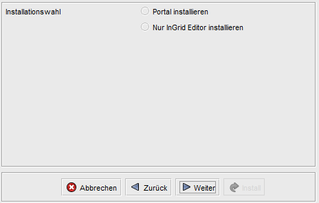
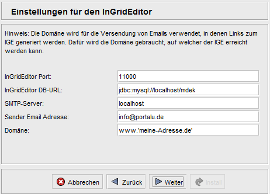
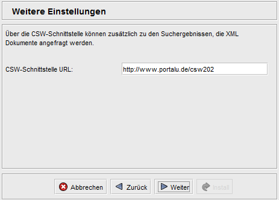
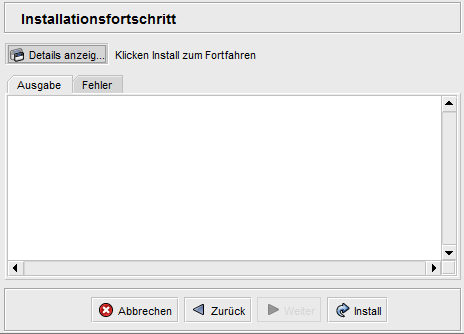
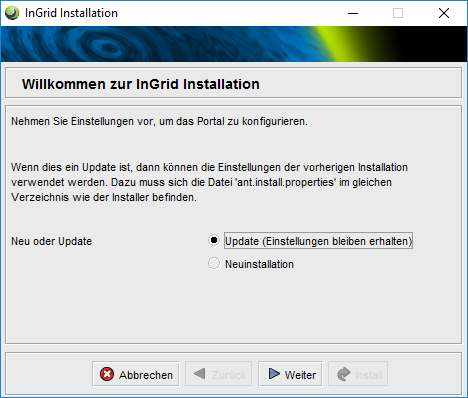

## Allgemeines

### Was ist das Portal?

Das Portal bietet den Benutzern ein komfortables Interface zur InGrid-Suche und zu weiteren Diensten, wie dem Browsen in Datenkatalogen, dem Karten Client oder dem gezielten Zugriff auf Service-Informationen, Messwerte, Umweltthemen oder Umweltereignisse.

Mittels Anmeldung (Authentifizierung) können Benutzer Ihre Suche dauerhaft personalisieren oder die Ansicht der Startseite verändern.

Das Portal enthält den InGrid-Editor (IGE), eine Oberfläche zum Erfassen und Pflegen von INSPIRE kompatiblen Metadaten. Der IGE kann optional ohne Portal installiert werden.

Funktionsumfang

- Freie Suche in allen angeschlossenen Datenquellen
- Suche in vorgeordneten Informationen (Service, Messwerte, Umweltthemen, Umweltchronik)

- Query-Builder zum Erstellen von Such-Queries
- News-Feed-Concentrator (Zusammenfassen verschiedener News-Feeds) für den Umweltbereich

- Personalisierung der Startseite
- Personalisierung von Sucheinstellungen
- personalisierte Administrationsfunktionalitäten

- Erfassung/Pflege von Metadaten in Datenkatalogen (IGC - InGrid Catalog) mittels IGE für ausgewählte Benutzer

Die Inhalte der Startseite können angepasst werden. Es existiert die Möglichkeit, verschiedene Default-Einstellungen für die Suche festzulegen:

- Auswahl von einem oder mehreren Informationsanbietern (Bund/Länder, Anbieter)
- Auswahl einer oder mehrerer Datenquellen (Metadaten, Webseiten, Fachdatenbank)
- Festlegung der Sortierung von Suchergebnissen (Relevanz, Datum)
- Festlegung der Gruppierung von Suchergebnissen (Partner, Anbieter)

Das Portal basiert auf dem Jetspeed Portal Framework [https://portals.apache.org/jetspeed-2/](https://portals.apache.org/jetspeed-2/)

### Was sind Portal Profile?

Portal Profile werden eingesetzt, um die Oberfläche und Funktionalität des Portals an die Anforderungen der unterschiedlichen Anwender anzupassen. Ziel ist es durch die Profile die technische Entwicklung des Portals durch die unterschiedlichen Anforderungen der Anwender nicht auseinanderdriften zu lassen.

Profile bestehen aus einer Sammlung von Dateien (Stylesheets, Templates, Bilder) und Datenbankanweisungen, die die Anpassungen für einen bestimmten Anwender kapseln. Die Profile können in der Administrationsumgebung des Portals umgeschaltet werden.

> Das Umschalten eines Profils macht den Neustart des Portals erforderlich!

## Systemvoraussetzungen

- 768 MB RAM
- 1 GB Harddrive

- JAVA 1.6
- Cygwin (unter Windows)
- MySQL, ORACLE oder PostgreSQL (ab InGrid 4.0.2)

### Anmerkungen zu MySQL-Datenbanken

Bei der Verwendung einer MySQL-Datenbank unter Unix wird normalerweise nach Groß/Klein-Schreibung unterschieden (casesensitiv). Da die Portal-Applikation Groß- und Klein-Schreibung nicht berücksichtigt, muss dies in der MySQL DB ausgeschaltet werden. Im /etc/my.cnf muss dafür folgender Eintrag in der mysqld -Sektion existieren:


[mysqld]
...
*lower_case_table_names=1*


## Installation

Das Portal wird mit einem Installer ausgeliefert, der die Installation schrittweise durchführt und die nötigen Informationen vom Benutzer erfragt. Der Installer installiert einen vorkonfigurierten Tomcat, der die entsprechend konfigurierten Portal-Applikationen beinhaltet.

Die Integration des Portals in einen bereits bestehenden Tomcat ist sehr stark von der Version und Systemumgebung abhängig und wird hier nicht weiter beschrieben.

Bei der Verwendung von ORACLE ist folgendes zu beachten:

* Die Datenbanken ingrid-portal und mdek müssen vorhanden sein
* Die Datenbank ingrid-portal muss vor der Installation mit dem dump aus dem Installer unter `distribution/sql/ingrid-portal-oracle_10_2_user_ingrid.dmp` initialisiert werden (Oracle 10.2. Dump).

ACHTUNG: ingrid-portal-oracle_10_2_user_ingrid.dmp ist mit altem exp tool exportiert, deshalb mit imp importieren, s. [http://www.orafaq.com/wiki/Import_Export_FAQ](http://www.orafaq.com/wiki/Import_Export_FAQ)

### Installer Schritt für Schritt

#### 1.) Stoppen Sie das Portal


INSTALL_DIR/apache-tomcat-xx/bin/shutdown.sh


#### 2.) Erstellen Sie ein Backup

Vor jeder Aktualisierung sollte ein Backup erstellt werden.

* Datenbanken ingrid-portal, mdek
* Installationsverzeichnis (Default: /opt/ingrid/ingrid-portal)

#### 3.) Stellen Sie ggf. das Profil zurück auf das PortalU Profil

Hintergrund : Das Standard Profil in dem das Portal ausgeliefert wird ist "PortalU". Deshalb vor der Installation das bestehende Portal auf "PortalU" umschalten, damit die Datenbank zum "neuen" Portal passt. Nach der Installation kann dann wieder umgeschaltet werden. Falls Sie spezielle Einstellungen in den Konfigurations-Dateien gemacht haben (emails etc.), müssen diese dann manuell wieder nachgezogen werden.

#### 4.) Download

[https://dev.informationgrid.eu/ingrid-distributions/ingrid-portal/](https://dev.informationgrid.eu/ingrid-distributions/ingrid-portal/)

#### 5.) Installation starten

Um die Installationsroutine zu starten, doppel-klicken Sie auf das Installationsprogramm oder geben Sie folgenden Befehl auf der Kommandozeile ein:


java -jar ingrid-portal-VERSION-installer.jar


> Hinweis: Bei Aktualisierungen des Portals, wird empfohlen, den Installer immer im gleichen Verzeichnis auszuführen. Die bei der letzten Installation verwendeten Einstellungen wurden in einer Datei "ant.install.properties" gespeichert und können bei einem Update wiederverwendet werden. Dazu muss sich diese Datei im selben Verzeichnis befinden, wie der Installer!

Der Installer ist sowohl per graphischer Oberfläche als auch Kommandozeileneingabe ausführbar. Im folgenden wird die Eingabe per graphischer Oberfläche beschrieben.

#### 6.) Auswahl Neu-Installation/Update

Art der Installation auswählen.

Bei der Auswahl "Update", ist nur die Angabe des Pfades zum Portal nötig. Die Installation ist dann beendet und wird mit dem Neustart des Portals abgeschlossen.

Bei einer Neuinstallation müssen weitere Angaben gemacht werden.

#### 7.) Auswahl IGE Installation ohne Portal

Soll nur der IGE installiert werden?

Hier wird nur auf die komplette Portal Installation eingegangen.

#### 8.) Auswahl Datenbank, IGE Installation

Welche Datenbank soll verwendet werden (ab InGrid 4.0.2 auch PostgreSQL)? Soll der IGE mit installiert werden?

Bei der Verwendung von Oracle müssen die Datenbanken vorhanden und der initiale Dump für die ingrid-portal Datenbank eingespielt sein.

In den nachfolgenden Seiten werden die Zugangsdaten für die Datenbanken abgefragt. Bitte achten Sie darauf, dass die angegebenen Benutzer mit entsprechenden Rechten (Erstellen von Tabellen, Index) ausgestattet sind.

#### 9.) Einstellungen für den InGrid Editor

Diese Einstellungen sind nur bei Installation des IGE notwendig.

| Parameter | Beschreibung |
|-----------|--------------|
| IngridEditor Port | Der Port, mit dem die IGE iPlugs Kontakt mit dem Editor aufnehmen. Ein Editor kann mehrere Kataloge (IGE iPlugs) verwalten.|
| IngridEditor DB-Url | JDBC Url für den Zugriff auf die mdek Datenbank. Login und Passwort für den Zugriff werden aus der Datenbankkonfiguration entnommen|
| SMTP-Server | Der SMTP Server, der zum Versenden von Emails aus dem IGe verwendet werden soll. |
| Sender Email Adresse | Die Email Adresse, die als Absender der Emails verwendet werden soll. |
| Domäne | Domäne, über den der IGE erreichbar ist. Diese wird benötigt, um in den Emails Links zum IGE zu hinterlegen. |

#### 10.) Einstellungen für den iBus

Diese Einstellungen werden für die Verbindung mit dem iBus der InGrid Installation benötigt.

| Parameter | Beschreibung |
|-----------|--------------|
| Client Name | Eindeutige ID des Portals. Folgt der Konvention: /<InGrid Installations ID>:<Komponenten ID> |
| Server Name | Eindeutige ID des iBus, mit dem sich das Portal verbinden soll |
| Server IP | IP Adresse des iBus |
| Server Port | TCP Port des iBus |

#### 11.) Einstellungen für den Karten Client

Diese Einstellungen werden für den integrierten Karten Client benötigt.

| Parameter | Beschreibung |
|-----------|--------------|
| WebmapClient-Datenverzeichnis | Datenverzeichnis des Karten Clients. Das Verzeichnis sollte nicht im Installationsverzeichnis des Karten Clients liegen, damit die Konfigurationen nicht bei einem Update überschrieben werden. (z.B.: /home/ingrid/webmapdata) |
| SMTP-Server (Host) | Host des SMTP-Servers...Per default 'localhost'. |
| SMTP-Port |  |
| SMTP-Benutzer | Benutzername für den SMTP-Server. |
| SMTP-Passwort | Benutzerpasswort des angegebenen Benutzername für den SMTP-Server. |
| Sender E-Mail-Adresse | Absender der E-Mails. |

#### 12.) Einstellungen für das Codelist Repository

Das InGrid System besitzt ein Codelist Repository in dem Parameterlisten, die von mehreren Komponenten benutzt werden, abgelegt sind. Das Portal nutzt dieses vor allem um die Detailansicht von INSPIRE kompatiblen Metadaten korrekt anzuzeigen.

Falls das Codelist Repository nicht existiert, greift das InGrid System auf Standardwerte zurück. Das Codelist Repository wird also nur benötigt, falls Änderungen oder Ergänzungen an den Standard-Listen vorgenommen werden müssen.

| Parameter | Beschreibung |
|-----------|--------------|
| Codelist Repository URL | Zugriffs-URL auf den REST Service |
| Repository Benutzername | Login für den REST Service, optional |
| Repository Passwort | Passwort für den REST Service, optional |

#### 13.) Weitere Einstellungen

Für Suchergebnisse aus dem InGrid Metadatenbestand (z.B. aus dem IGE oder aus angeschlossenen CSW Datenquellen), wird ein direkter Link auf die XML Metadaten angeboten. Der Zugriff erfolgt über die CSW Schnittstelle desn InGrid Systemes.

| Parameter | Beschreibung |
|-----------|--------------|
| CSW Schnittstelle URL | Zugriffs-URL auf die CSW Schnittstelle des InGrid Systemes |

#### 14.) Installationsverzeichnis

| Parameter | Beschreibung |
|-----------|--------------|
| Installationsverzeichnis | Das Installationsverzeichnmis für das Portal. (z.B. /opt/ingrid/ingrid-portal) |

#### 15.) Installation

Der Installationsfortschritt kann während der Installation angezeigt werden. Die Anzeige enthält nützliche Informationen die auch weitere Anweisungen enthält, die nach der Installation zu beachten sind.

## Aktualisierung

Neues Release von [https://dev.informationgrid.eu/ingrid-distributions/ingrid-portal/](https://dev.informationgrid.eu/ingrid-distributions/ingrid-portal/) herunterladen.

Portal stoppen.


sh INSTALL_DIR/apache-tomcat-xx/bin/shutdown.sh


Aktuelles Installationsverzeichnis sichern:


cp -r /opt/ingrid/ingrid-portal <BACKUP-DIRECTORY>


Die Aktualisierung erfolgt über den Installer.


java -jar ingrid-portal-NEW-VERSION-installer.jar


Während der Installation bitte "Upgrade" auswählen.

Liegt bei Ihrer aktuellen Portal-Installationen ein Version kleiner gleich 4.0.2 vor, so müssen Sie die Einstellungen des Webmap Client's aktualisieren bzw. erweitern. Durch diese Aktualisierung werden auch alte Konfigurationsdaten des alten Webmap Client bereinigt. 

Geben Sie anschließend die neuen Webmap Client Einstellungen ein. Für die Einstellung "WebmapClient-Datenverzeichnis" geben Sie den Eltern-Pfad Ihres "WebmapClientData"-Verzeichnis (per Default: "/opt/ingrid/") an.


Beispiel: 
Ihr "WebmapClientData"-Verzeichnispfad lautet "/opt/ingrid/WebmapClientData", so geben Sie "/opt/ingrid/" an. 


Die weiteren Einstellungsmöglichkeiten dienten dem Webmap Client für das Versenden von E-Mails.

Zu guter Letzt geben Sie das Installationsverzeichnis Ihres aktuellen Portal an.

Wurde die Installation fehlerfrei durchlaufen, so starten Sie ihr aktualisiertes Portal neu.


sh INSTALL_DIR/apache-tomcat-xx/bin/startup.sh


## Betrieb

Start:


sh INSTALL_DIR/apache-tomcat-xx/bin/startup.sh


Stop:


sh INSTALL_DIR/apache-tomcat-xx/bin/shutdown.sh


Die LOG Ausgaben finden sich in dem Verzeichnis`INSTALL_DIR/apache-tomcat-xx/logs/`.

## Konfiguration

### Allgemeines

Der Installer liefert eine bereits vorkonfigurierte Portal-Applikation innerhalb des Tomcats.

Eine manuelle Nachkonfiguration, z.B. aufgrund eines geänderten Datenbanknamens oder IP-Adresse, ist in folgenden Konfigurationsfiles möglich. Alle Angaben gehen vom Installationsverzeichnis des integrierten Tomcat  (INSTALL_DIR/apache-tomcat-xx/) aus.

Nach Änderungen sollte der Tomcat neu gestartet werden.

| Datei | Funktion |
|-------|----------|
| webapps/ingrid-portal-apps/WEB-INF/classes/ingrid-portal-apps.properties | Allgemeine Standard Einstellungen für das Portal. **ACHTUNG**: Diese Datei wird bei einem Update des Portals vom Installer überschrieben.|
| webapps/ingrid-portal-apps/WEB-INF/classes/**ingrid-portal-apps.override.properties** | **Installationsspezifische** Einstellungen für das Portal, die bei einem Update NICHT überschrieben werden. Bitte Einstellungen aus *ingrid-portal-apps.properties* hierher übernehmen und anpassen. Sollten sich Namen oder Werte von Einstellungen mit einem Update ändern, so müssen diese hier manuell angepasst werden. |
| webapps/ingrid-portal-apps/WEB-INF/classes/communication.xml | InGrid Communication Parameter zum iBus. |
| webapps/ingrid-portal-apps/WEB-INF/classes/sns.properties | IGE-Einstellungen für Zugriff auf den SNS (Semantic Network Service, liefert Thesaurus, Gazeteer und Umweltchronik) |
| conf/Catalina/localhost/ingrid-portal.xml | Portal Datenbank Einstellungen |
| conf/Catalina/localhost/ingrid-portal-apps.xml | InGrid Portal Applikation Datenbank Einstellungen |
| conf/Catalina/localhost/ingrid-portal-mdek.xml | IGE Datenbank Einstellungen für Kopplung Portal mit IGE |
| webapps/ingrid-portal-mdek-application/WEB-INF/classes/mdek.properties | IGE Anwendungseinstellungen: Email (SMTP, Absender, ...), Direkter Link zu IGE etc. |
| webapps/ingrid-portal-mdek-application/WEB-INF/classes/default-datasource.properties | IGE-Datenbank Einstellungen (Zugriff von IGE Anwendung) |
| webapps/ingrid-portal-mdek-application/WEB-INF/classes/communication.xml | IGE-iBus Einstellungen für Anmeldung von IGE-iPlugs |

### Spezielle Einstellungen

**ACHTUNG**: Bei Änderungen müssen die Einstellungen in die Datei `ingrid-portal-apps.override.properties` übernommen werden, um bei einem Update nicht überschrieben zu werden, s.o.

| Datei | Schlüssel |  Erläuterung
|-------|----------|-----|
| ingrid-portal-apps.properties | portal.detail.view.limit.references | Reduzierung der Anzahl der Verweise in der Metadaten Detaildarstellung (default auf 100). Den Hinweistext kann man in der Resources-Datei "SearchDetailResources_de.properties" unter der Eigenschaft "info_limit_references" in HTML-Schreibweise (default `
<b>Hinweis:</b> Es werden nur die ersten 100 Verweise angezeigt!
`)  definieren.|
| ingrid-portal-apps.properties | portal.enable.default.grouping.domain | `true`=Die Trefferliste wird nach Datenquellen gruppiert `false`=Die Ergebnisse werden ungruppiert dargestellt  Die Gruppierung kann auch in jeder Suchanfrage manuell gesetzt werden mit `grouped:grouped_off` oder `grouped:grouped_by_datasource`. Weitere Gruppierungswerte zum Testen (nicht mehr supported): *grouped_by_partner*, *grouped_by_organisation*, *grouped_by_plugId*  Nähere Erläuterung zur Gruppierung s. auch [FAQ](#GroupingReihenfolge)|

### Upgrade Client

Der Upgrade Client ist eine Überwachungskomponente, die alle angeschlossenen Komponenten einer InGrid Installation überwacht. Dabei werden am iBus angeschlossene Komponenten erkannt und mit den Informationen von einem InGrid Upgrade Server abgeglichen. Wird auf dem Server eine neuere Version einer Komponente festgestellt, so kann eine Email an eine oder mehrere angegebenen Adressen verschickt werden.

Der Upgrade Client ist in die Überwachungsstruktur des Portals integriert und kann über in der Portal Administration über `Administration / Jobs / Update von den angeschlossenen Komponenten` aufgerufen werden.

Die Adresse des Upgrade Servers kann in der Datei `ingrid-portal-apps.properties` im Portal konfiguriert werden.


upgrade.server.url=http://INGRID_PORTAL_DOMAIN/update


## FAQ

### Wie kann ich ein Überschreiben der Datei `TOMCAT/bin/env.sh` bei einer Aktualisierung verhindern.

In der Datei env.sh können Systemvariablen komponenten-spezifisch angepasst werden (z.B. Proxy oder Heap Einstellungen). Um die Einstellungen nach einer Aktualisierung nicht zu verlieren, muss die Datei `env.sh` nach `user.env.sh` kopiert werden. Die Änderungen in `user.env.sh` werden nicht überschrieben.

### Mein System verwendet einen Proxy für HTTP(S) Zugriffe. Wie kann ich die Proxy-Konfiguration einstellen?

Bitte in der Datei TOMCAT/bin/env.user.sh folgende Eigenschaften eintragen:


-Dhttp.proxyHost=yourProxyURL -Dhttp.proxyPort=proxyPortNumber -Dhttp.proxyUser=someUserName -Dhttp.proxyPassword=somePassword -Dhttps.proxyHost=yourProxyURL -Dhttps.proxyPort=proxyPortNumber -Dhttps.proxyUser=someUserName -Dhttps.proxyPassword=somePassword -http.nonProxyHosts=localhost|127.*|[::1]


User und Passwort müssen nicht unbedingt angegeben werden.

Achtung: Die Trennung mit dem pipe Symbol muss unter Windows/cygwin escaped werden: 

-http.nonProxyHosts=localhost^|127.*^|[::1]

### Sortierung der Suchergebnisse nach Aktualität, woher stammt die Aktualitätsinfo ?

Das Bezugsdatum bei der Sortierung nach Aktualität ist das Änderungsdatum der Seite (last-modified Info aus dem HTTP-Header). Ist dieses nicht vorhanden, wird das Datum des letzten Fetch der Seite angenommen.

### Wie ist die Reihenfolge der gruppierten Ergebnisse definiert ?

Grundlage ist das Ranking. Sind die ersten 60 Ergebnisse der gerankten Suchanfrage von einem Partner/Anbieter werden diese gruppiert. Es kann also sein, dass auf einer gruppierten Seite der gleiche Partner/Anbieter mehrfach vorkommt.

Das Gruppieren dient dazu viele aufeinander folgende Ergebnisse eines Partners/Anbieters zusammenzufassen und damit Ergebnissen anderer Partner/Anbieter eine "Chance" zu geben.

Die Reihenfolge der Ergebnisse innerhalb einer Gruppe entspricht dem Ranking.

### Wie kann dem Tomcat ein Apache-Webserver vorgeschaltet werden?

Dies kann durch das Einrichten der Apache Erweiterung mod-proxy-ajp und mod-rewrite erfolgen. In der Apache Konfiguration muss dann folgendes eingetragen werden (Bsp:):


ProxyPass /ingrid-portal ajp://127.0.0.1:8010
ProxyPass /ingrid-portal/(.*) ajp://127.0.0.1:8010/$1
ProxyPass /ingrid-portal-apps ajp://127.0.0.1:8010/ingrid-portal-apps
ProxyPass /ingrid-portal-apps/(.*) ajp://127.0.0.1:8010/ingrid-portal-apps/$1
ProxyPass /ingrid-portal-mdek-application ajp://127.0.0.1:8010/ingrid-portal-mdek-application
ProxyPass /ingrid-portal-mdek-application/(.&#42;) ajp://127.0.0.1:8010/ingrid-portal-mdek-application/$1

RewriteEngine on

RewriteRule ^/$ /ingrid-portal/startseite [PT,NC]
# backward compatibility (redirect old portal url to new one)
RewriteRule ^/ingrid-portal/(.&#42;) /$1 [R,NC]
# add here all patters of resources that should NOT be redirected
RewriteCond %{REQUEST_URI} !robots.txt
RewriteRule ^/(.\\&#42;) /ingrid-portal/$1 [PT,NC]


### Wie kann ich dem Tomcat mehr Speicher zuweisen?

Bitet ergänzen Sie in der `env.sh` bzw. `user.env.sh`:


-server Xmx20148m


Der Tomcat hat nun bis zu 2048 MB zur Verfügung. Bitte beachten Sie, dass ab Java 5 der max. verfügbare Speicher per Default bereits bei 1 GB liegt ([http://docs.oracle.com/javase/6/docs/technotes/guides/vm/gc-ergonomics.html](http://docs.oracle.com/javase/6/docs/technotes/guides/vm/gc-ergonomics.html)).

### Wie kann man das Session Timeout im Tomcat erhöhen?

Das Session timeout kann in der TOMCAT/conf/web.xml verändert werden. Der jetzige Wert Momentan steht bei 30 min.


<!-- ==================== Default Session Configuration ================= -->
<!-- You can set the default session timeout (in minutes) for all newly
  -->
<!-- created sessions by modifying the value below.
  -->
<session-config>
  <session-timeout>30</session-timeout>
</session-config>


### Wie kann die Anzahl von darzustellenden RSS-Feed-Einträgen beeinflusst werden?

Unter `ingrid-portal-apps.properties` kann die Eigenschaft `portal.rss.news.number` verwendet werden. Diese definiert die Anzahl der RSS Feeds auf der Startseite.

Ist diese Eigenschaft nicht gesetzt, so wird die definierte Anzahl (Preference `noOfEntriesDisplayed`) in der `portlet.xml` verwendet.

### Wie kann das Caching der Suchergebnisse beeinflusst werden?

Unter `ingrid-portal-apps.properties` kann die Eigenschaft `portal.enable.caching` verwendet werden. Diese definiert, ob der Cache verwendet (true) werden soll oder nicht (false). Das Abschalten des Caches kann zu Performanceeinbußen führen und wird nicht empfohlen.

Per default werden die Suchergebnisse für 5 min im Cache vorgehalten. Diese Zeit lässt sich durch die Änderung im File `ingrid-portal-apps\WEB-INF\classes\ehcache.xml` anpassen. So wird z.B. die Zeit für das Caching der Anfragen an den iBus auf 5 sec reduziert.


<cache name="ingrid-cache"
        maxElementsInMemory="5000"
        eternal="false"
        timeToIdleSeconds="3"
        timeToLiveSeconds="5"
        overflowToDisk="true"
        diskPersistent="false"
        diskExpiryThreadIntervalSeconds="300"
/>


### Wie oft werden RSS Feeds aktualisiert?

Die RSS Feeds werden per Default jede Stunde aktualisiert. Das Intervall des RSS Fetchers lässt sich in der Datei


ingrid-portal/apache-tomcat-x.x.xx/webapps/ingrid-portal-apps/WEB-INF/classes/quartz_jobs.xml


einstellen. Alle Zeitangaben erfolgen im Millisekunden.


<trigger>
  <simple>
    <name>RSSFetcherTrigger</name>
    <group>DEFAULT</group>
    <job-name>RSSFetcherJob</job-name>
    <job-group>DEFAULT</job-group>
    <repeat-count>-1</repeat-count>
    <repeat-interval>3600000</repeat-interval>
  </simple>
</trigger>


### Wie kann die Facettierung im Portal konfiguriert werden?

Links neben der Suchergebnisliste wird eine Liste von Kategorien angeboten, nach welcher die Suchergebnisse gefiltert werden können. In diese Kategorien sind auch die bisherigen Bereiche "Rechtsvorschriften ", "Forschungsprojekte" und "Adressen" mit eingeflossen.

Wurde eine oder mehrere Kategorien ausgewählt, so können diese Einschränkungen entweder alle zusammen durch den Link "Alle Einschränkungen löschen" oder einzeln über die Buttons rechts der ausgewählten Kategorie wieder gelöscht werden.

Wird ein Suchbegriff geändert, so wird die Suche mit diesem Begriff und allen vorher getätigten Einschränkungen ausgeführt. Damit kann eine Suche mit bestehenden Einschränkungen mit zusätzlichen Begriffen verfeinert werden.

Auch wenn in einen anderen Bereich des Portals gewechselt wird, so bleibt die letzte Suche erhalten und man kann damit, sobald man zur Suche zurückkehrt, an der gleichen Stelle im Suchergebnis weiter navigieren.

Die Facettierung ist konfigurierbar! Die Konfigurationsdatei für die Facettierung facets-config.xml liegt unter


ingrid-portal/apache-tomcat-x.x.xx/webapps/ingrid-portal-apps/WEB-INF/classes/facets-config.xml


> Achtung! Die Datei wird bei einer Aktualisierung überschrieben.

Beispiel für die Facetten "Opendata" und "INSPIRE" (aus Niedersachsen):


<facet>
  <name>INSPIRE</name>
  <query>t04_search.searchterm:inspireidentifiziert</query>
  <id>inspire</id>
</facet>
<facet>
  <name>Opendata</name>
  <query>t04_search.searchterm:opendataident</query>
  <id>opendata</id>
</facet>


### Werden Anfragen, die keine Ergebnisse liefern protokolliert?

Ja, die Anfragen werden im Webserver Logfile protokolliert. Dazu wird vom Portal eine bestimmte URL gerufen:


/logger.html?code=NO_RESULTS_FOR_QUERY&q=%E2%80%A2wRqGzfLPRQ&qtypes=unranked


Die Basis URL kann in der Date `ingrid-portal-apps.properties` konfiguriert werden.


# logger resource
# some events are logged via the webserver log (i.e. zero result queries)
# due to possible firewall issues, the logger resource can be specified here
portal.logger.resource=http://localhost/logger.html

