## Allgemeines

Der Webmap Client basiert auf den Schweizer-Client "geo.admin.ch" ([https://map.geo.admin.ch/](https://map.geo.admin.ch/)) und dient zur Darstellung von Kartenmaterial (z.B. WMS, KML, etc.) im Portal. Neben der Darstellung auf dem Desktop ist der Webmap Client, wie das Portal, auch für mobile Geräte geeignet.

Der Client wird über das Portal mit installiert und ist im Portal unter dem Menü-Eintrag "Karte" integriert. Der Webmap Client kann aber auch ohne das Portal aufgerufen werden:

- http://HOSTNAME/ingrid-webmap-client/frontend/prd/ (komprimierte Version)
- http://HOSTNAME/ingrid-webmap-client/frontend/src/ (unkomprimierte Version)

Im Webmap Client sind mehrere Frameworks/Technologien in einem vereint. So wird OpenLayers 3 verwendet um Interaktionen mit dem Kartenmaterial, wie z.B. diverse WMS oder KML Layer anzuzeigen, zu ermöglichen. Das User-Interface besteht aus den Java-Script Frameworks AngularJS und jQuery, aus den CSS-Tools Font-Awesome und Bootstrap und vieles mehr.

Zu den möglichen Interaktionen oder auch Funktionen des Webmap Clients können Sie in den nächsten Abschnitten mehr erfahren.  

## Funktionen

Der Webmap Client hat zahlreiche Funktionen mit dem Umgang von Geodaten, von Darstellung von WMS Layern und KML bis zum Drucken und Zeichnen von Kartenmaterial. Die einzelnen Funktionen werden nun hier aufgelistet:

### Teilen

Über das Menü des WebMap Clients besteht die Möglichkeit Ihren Kartenzustand zu verbreiten:

 - E-Mail 
 - QR-Code
 - Soziales Netzwerk
 - Link
 - Integration per iFrame-Template

Ihr Kartenzustand bedeutet hierbei auch die von Ihnen hinzugefügten Layern (z.B. WMS, KML) oder auch Ihre Zeichnungen auf der Karte.

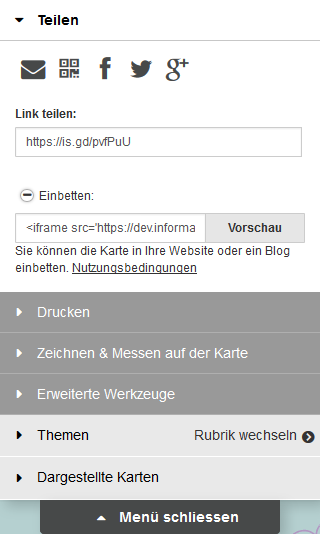

**E-Mail**

Um Ihren Kartenzustand per E-Mail zu teilen, können Sie den E-Mail-Button verwenden. 
Bei Betätigung des Buttons öffnet sich Ihr E-Mail-Programm oder Sie werden nach Ihrem E-Mail-Programm gefragt. Es wird Ihnen eine E-Mail mit dem Link des Kartenzustandes im Nachrichtenbereich breit gestellt. Geben Sie Empfänger und Betreff an und schon kann die E-Mail versendet werden.

**QR-Code**

In der heutigen Zeit ist auch der QR-Code gang und gäbe um Informationen zu verbreiten, vor allem durch die Zunahme von Smartphones und Tablets. Um z.B. Ihren Kartenzustand auf Ihr mobiles Gerät zu übertragen, erstellen Sie über den QR-Code-Button ein QR-Code und lesen Sie den QR-Code mit Ihrem Gerät/App aus.

**Soziale Netzwerke**

Gang und gäbe ist auch die Verbreitung von Informationen über das Soziale Netzwerk. Im Mapclient besteht die Möglichkeiten drei soziale Kanäle zu bedienen:

- Facebook
- Twitter
- Google+

Bei allen drei Netzwerken wird hierbei ein Link der Karte geteilt.

**Link**

Natürlich können Sie auch Ihre Karte per Copy-Paste kopieren. Hierfür existiert ein Bereich **Link Teilen** mit einem Textfeld in dem die URL der aktuellen Karte hinterlegt ist. 

**Einbetten**

Haben Sie eine eigene Webseite und möchten Sie Ihre Karte dort integrieren? So verwenden Sie den aufklappbaren Bereich 'Einbetten'. Auch hier wird Ihnen ein Textfeld angeboten mit einem iFrame-Template, welchen Sie kopieren können und in dem Source-Code Ihrer eigene Webseite hinzufügen können. Der Webmap Client bietet Ihnen auch an das generierte Template per Vorschau anzeigen zu lassen. Klicken Sie hierfür einfach den Button 'Vorschau' im Bereich 'Einbetten' und führen weitere Änderungen (z.B. Größe des iFrames) durch.

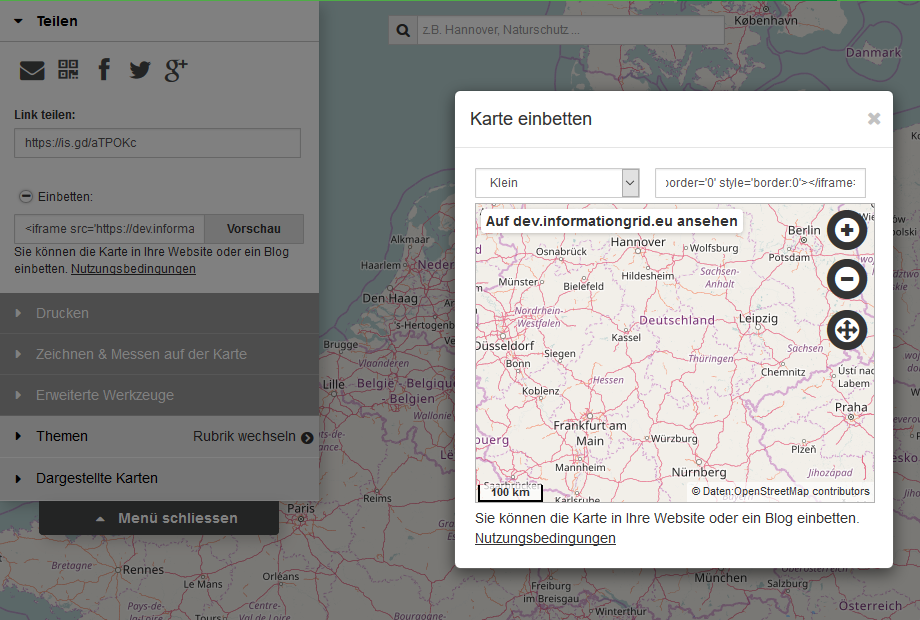

Die URL Ihres Kartenzustandes wird dabei immer durch ein URL-Shortener verkürzt. Mehr Informationen finden Sie [hier](#url-shortener).

### Drucken

Sie wollen Ihre Karte auf Papier bringen? Öffnen Sie hierfür im Menü den Bereich 'Drucken'. Hier können Sie ein PDF generieren lassen, welches dann ausgedruckt werden kann.

Wird das Drucken aktiviert, so wird in der Karte ein Ausschnitt hervorgehoben, der z.Zt. auf ein PDF hinterlegt werden würde. Diesen Ausschnitt können Sie anpassen, indem Sie z.B. die Karte verschieben, hinein- oder hinauszoomen oder auch im Druck-Menü den 'Massstab' anpassen.

Zusätzlich können Sie dem PDF neben dem Kartenausschnitt einen Titel, eine Beschreibung/Kommentar, die Legende der Layer oder auch ein Koordinatennetz hinzufügen und die Orientierung (Hoch-/Querformat) in den DIN A3 bzw. DIN A4 Größe ändern.

In dem generierten PDF wird neben Ihrem Kartenausschnitt anhand eines [URL-Shorteners](#url-shortener) die URL Ihres Kartenzustandes sowie ein [QR-Code](#qr-code) hinterlegt.

### Zeichnen & Messen

Unter dem Menüpunkt **Zeichnen & Messen** können Sie Ihre Kreativität freien laufen lassen, Anmerkungen setzen oder auch Strecken zu Ihrer Karte messen. Ihre Zeichnung können Sie anschließend auch als KML-Datei herunterladen, per Funktion Teilen verbreiten oder auch ausdrucken.

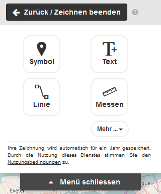

**Symbol**

Sie möchten (vordefinierte) Symbole auf die Karte legen, so wählen Sie die Funktion **Symbol** und markieren auf der Karte die Stelle, wo Ihr Symbol platziert werden soll. 

Anschließend erscheint das folgende Pop-Up:

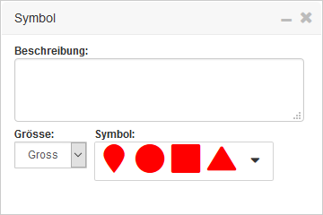

Hier können Sie die Größe des Symbols, sowie das Symbol selbst ändern und auch dem Symbol eine Beschreibung vergeben.

**Text**

Sie möchten Ihre Karte mit Texten belegen, so wählen Sie die Funktion **Text** und markieren auf der Karte die Stelle, wo Ihr Text platziert werden soll. 

Anschließend erscheint das folgende Pop-Up:

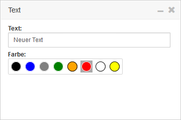

Hier können Sie Ihren Text eingeben, aber auch die Textfarbe anpassen.

**Linie**

Sie möchten eine Linie oder eine Fläche auf Ihre Karte zeichnen, so wählen Sie die Funktion **Linie**. 

- Um eine Linie zu zeichnen, klicken Sie auf der Karte per Einfach-Mausklick an den Stellen, wie Ihre Linie verlaufen soll und beenden Ihre Linie mit Doppel-Mausklick.
- Um eine Fläche zu zeichnen, gehen Sie wie bei der Linie per Einfach-Mausklick vor und beenden Ihre Fläche, indem Sie Ihre Linien mit dem Startpunkt verbinden.

Anschließend erscheint das folgende Pop-Up:

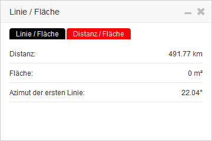

Im Tab **Linie / Fläche** können Sie eine Beschreibung zu Ihrer Linie bzw. Fläche hinterlegen, aber auch die Farbe ändern. Im anderen Tab **Distanz / Fläche** sehen zu Informationen zu Ihrer gezeichneten Linie bzw. Fläche.

**Messen**

Sie möchten eine Strecke oder eine Fläche auf Ihre Karte messen, so wählen Sie die Funktion **Messen**. Sie können hier wie bei der Funktion Linie vorgehen um eine Strecke oder eine Fläche zu messen.

Anschließend erscheint das folgende Pop-Up:

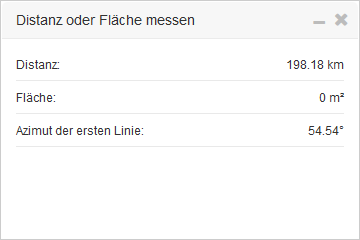

Hier werden Ihnen Informationen zu Ihrer gezeichneten Strecke oder Fläche dargestellt. 

**Mehr**

Unter **Mehr** gibt es nun weitere Funktionen zu Ihrer Zeichung: 

- Download Ihrer Zeichnung als KML-Datei
- Löschen eines ausgewählten Elementen
- Löschen aller Elementen

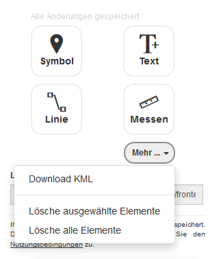

### Erweiterte Werkzeuge

Das Menü 'Erweitere Werkzeuge' beinhaltet Funktionen mit (externen) Layern. 

Hier können WMS- oder KML-Layer hinzugefügt werden oder auch der Karte hinzugefügten Layer verglichen werden. 

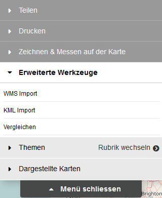

**WMS Import**

Wird die Funktion 'WMS Import' aktiviert, so erscheint ein Dialog in dem Sie (vordefinierte) WMS-Dienste laden können. 

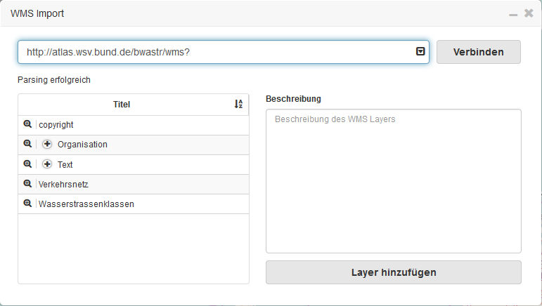

Tragen Sie unter 'URL' eine URL zum WMS-Dienst ein (z.B. [http://atlas.wsv.bund.de/bwastr/wms](http://atlas.wsv.bund.de/bwastr/wms) ) ein oder wählen Sie einen vordefinierten Dienst über die Drop-Down-Liste aus und bestätitgen Ihren Eintrag bzw. Auswahl mit dem Button 'Verbinden'.

> Hinweis:
> Hat die URL keine Parameter 'REQUEST', 'SERVICE' oder 'VERSION, so werden Defaultwerte verwendet:
> - REQUEST = GetCapabilities
> - SERVICE = WMS
> - VERSION = 1.3.0

Wird der Dienst erfolgreich geladen, so erscheinen alle Layer des Dienstes in einer Tabelle. Hier stehen verschiedene Funktionen auf einem Layer zur Verfügung:

- Mit einer Auswahl eines Layers per Mausklick wird die Beschreibung (wenn vorhanden) des ausgewählten Layer im Bereich 'Beschreibung' angezeigt.
- Fährt man mit der Maus (Mouse-Over) über ein Layer aus der Liste, so wird der Layer geladen und auf der Karte dargestellt und verschwindet wieder, wenn der Mauszeiger nicht mehr über dem Layer liegt.
- Verwenden Sie die Lupe vor dem Layer-Titel um zum Layer-Bereich (Extent) zu springen.

Um einen Layer der Karte hinzuzufügen wählen Sie einen Layer per Mausklick aus und verwenden den Button 'Layer hinzufügen'. Anschließend werden Sie informiert, ob der ausgewählte Layer hinzugefügt wurde, der Layer wird auf der Karte dargestellt und in der Liste unter dem Akkordeon 'Dargestellte Karten' wurde der Layer hinzugefügt.

**KML Import**

Wird die Funktion 'KML Import' betätigt, so erscheint auch hier ein Dialog. 

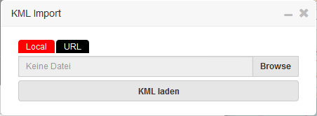

Im Dialog werden zwei Möglichkeiten angeboten ein KML-Layer der Karte hinzuzufügen:

- KML-Layer lokal aus Ihrem Dateisystem
- oder per URL ein KML-Layer zu laden.

Wird ein KML-Layer erfolgreich geladen, so wird dieser Layer unter dem Akkordeon 'Dargestellte Karten' aufgelistet.

**Vergleichen**

Eine weitere Funktion unter dem Menü 'Erweiterte Werkzeuge' ist die Funktion 'Vergleichen'. Durch die Funktion lassen sich Layer, die unter Akkordeon 'Dargestellte Karten' aufgelistet werden, grafisch vergleichen.

Wird unter 'Dargestellte Karten' ein Layer aufgelistet und diese Funktion aktiviert, so erscheint auf der Karte eine rote Linie. 

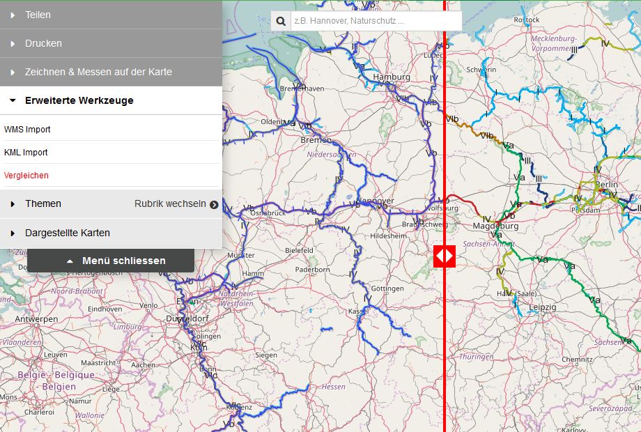

Dabei wird der erste aktive Layer unter 'Dargestellte Karten' im linken Bereich angezeigt und im rechten Bereich ab der roten Linie "abgeschnitten". Dieses Verhalten bleibt auch bei, wenn Sie die Karte verschieben oder die rote Linie per gedrückt gehaltenem Mausklick verschieben.

Um die Funktion wieder zu deaktivieren, drücken Sie wieder auf die Funktion 'Vergleichen' und die rote Linie verschwindet wieder.

### Rubriken

In diesem Bereich werden Ihnen vordefinierte Rubriken in einer Baumstruktur angezeigt. Alle Einträge mit einer Checkbox sind hierbei Layer, die auf der Karte dargestellt werden können. 

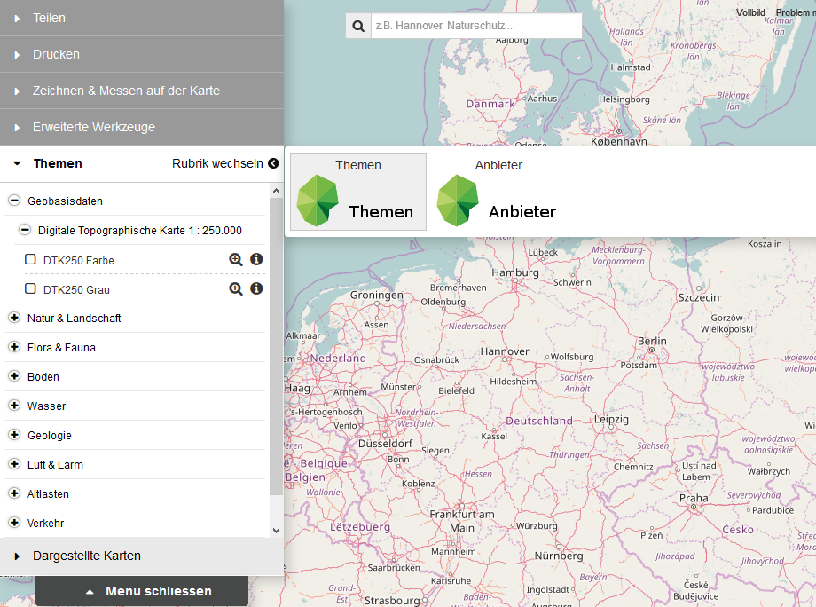

Folgende Funktionen sind auf darstellbare Layer vorzufinden:

- Darstellung und Hinzufügen des Layers zur Karte über die Checkbox.
- Zoom auf Layer-Bereich (Extent) über die Lupe.
- Darstellung von Informationen (z.B. Legende) über den Info-Button.
- Vorschau des Layers auf der Karte über Mouse-Over.

Wird ein Layer der Karte hinzugefügt, so wird der Layer in der Baumstruktur rot markiert und unter 'Dargestellte Karten' aufgelistet.

Eine Anleitung zur Definition von Rubriken finden Sie unter [Daten für den WebMap Client](#daten-für-den-webmap-client).

### Dargestellte Karten

Alle Layer, die Sie der Karte hinzugefügt haben, werden unter 'Dargestellte Karten' aufgelistet.

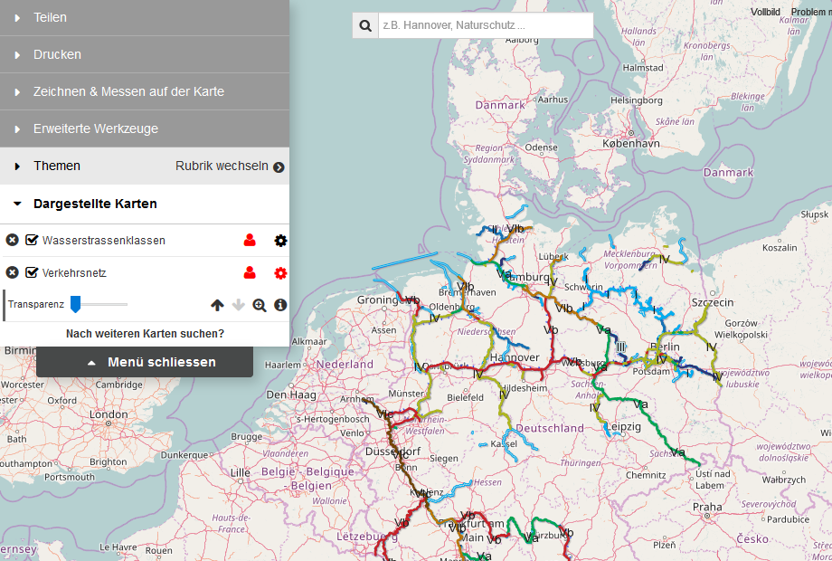

Auch hier hat jeder Layer mehrere Funktionen die ausgeführt werden können:

- Vorschau per Mouse-Over in der Karte
- Löschen des Layers aus der Karte über das 'x'.
- Ausblenden des Layers in der Karte per Checkbox.
- Sowie erweitere Funktionen über das Zahnrad:
    - Einstellbarkeit der Transparenz eines Layers
    - Zoom auf den Layer-Bereich (Extent)
    - Darstellung von Informationen (z.B. Legende) über den Info-Button.
    - Anordungen des Layers in der Kartenhierachie.

Sind mehrere Layer in der Liste der 'Dargestellten Karten' so ist der oberste Layer in der Liste auch der oberste Layer auf der Karte.

### Objekt-Informationen

Sie haben einen Layer aus den 'Dargestellten Karten' aktiviert und dieser wird in der Karte anzeigt. Nun möchten Sie die Objekt-Informationen angezeigt bekommen. So verwenden Sie die linke Maustaste um eine GetFeatureInfo-Abfrage auszulösen und bei erfolgreicher Anfrage wird Ihnen ein Dialog mit der Antwort der Abfrage angezeigt.

### Suchen

Auch eine Suche steht Ihnen im Webmap Client zur Verfügung. Dies Suche dient hilft Ihnen dabei Orte, Layer, Dienste und Bundeswasserstraßen zu finden und auf der Karte darzustellen. 

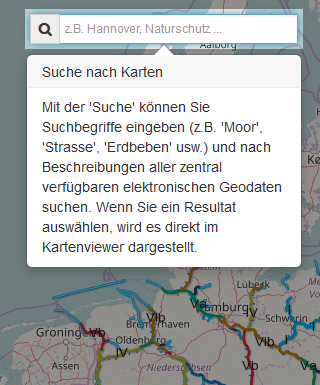

Unter der Suche werden verschiedene Dienste angefragt:

**Gehe nach**

Hier wird eine Ortssuche auf dem Dienst 'Nominatim' durchgeführt und alle Orte in Abhängigkeit mit Ihrem Suchbegriff aufgelistet. 

Per Mouse-Over über die Ergebnisliste werden Ihnen die Orte in der Karte markiert und bei Auswahl gelangen Sie zum Ort hin.

**Karte hinzufügen** 

Im Webmap Client definierte Layer (z.B. für die Rubriken) werden hier gefunden. Auch hier in der Ergebnisliste stehen Ihnen die gleichen Funktionen wie bei allen Layer zur Verfügung:

- Vorschau bei Mouse-Over
- Zoom zum Layer-Bereich (Extent)
- Informationen eines Layers

Wählen Sie einen Layer aus, so wird dieser in der Karte dargestellt und unter 'Dargestellte Karten' aufgelistet.

**Dienste hinzufügen** 

Treffer aus dieser Kategorie kommen aus der Opensearch-Schnittstelle. Hier werden Ihnen WMS Dienste zum Suchbegriff angezeigt. 

Wählen Sie hier einen Treffer aus, so werden alle Layer des Dienstes auf die Karte gelegt und können über 'Dargestellte Karten' angezeigt werden. 

**BWaStr Locator** 

Falls Sie nach Bundeswasserstraßen, wie z.B. Elbe, suchen, werden Sie hier fündig. Hier wird ein Dienst des ITZBund angefragt.

Wählen aus dieser Liste eine Bundeswasserstraße aus, so wird die gesamte Strecke der ausgewählten Wasserstraße in der Karte (rot) dargestellt. Sie können auch nur eine Teilstrecke anzeigen lassen. Tragen Sie hierbei unter 'Von' und 'Bis' gültige Werte eine, bestätigen Sie Ihre Angabe mit dem ">" und die Strecke wird in der Karte (blau) dargestellt.

Klicken Sie mit der Maus auf die markierte Strecke, so werden Ihnen weitere Informationen zu Bundeswasserstraße per Dialog angezeigt. Neben den Informationen besteht für Sie auch die Möglichkeit die angeklickte Strecke als CSV zu exportieren. 

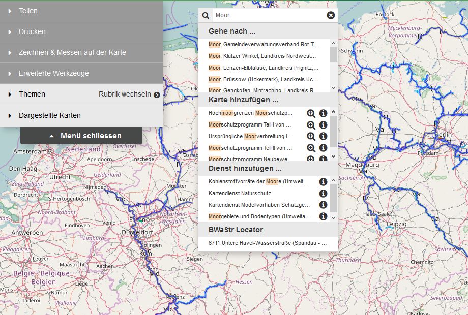

### Karteninteraktionen

Natürlich finden Sie auch Funktionen mit dem man Interaktionen mit der Karte ausführen kann:

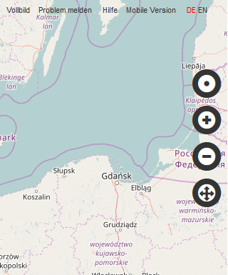

**Standortbestimmung**

Wählen Sie die Button mit dem schwarzen Punkt und eine Abfrage Ihres Standortes wird durchgeführt. Falls Sie die Standortfreigabe bestätigen, wird Ihr Standort in der Karte angezeigt.

**Hineinzoomen**

Nicht nur über das Zahnrad der Maus können Sie hineinzoomen, sondern auch über den Button '+' ist das Hineinzoomen möglich.

**Hinauszoomen**

Das gleich wie beim Hineinzoomen gilt auch für das Hinauszoomen.

**Zoom auf Ausgangsposition**

Falls Sie sich mal in der Karte verirrt haben, können Sie über den untersten Button (mit den gekreuzten Pfeilen) zur Ausgangsposition der Karte zurück wechseln und von vorne starten.

### Hintergrundkarten

Der Webmap Client stellt verschiedene Hintergrundkarten zur Verfügung.

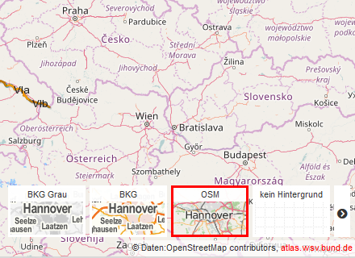

Folgende Hintergrundkarten stehen Ihnen zur Auswahl:

- Kein Hintergrund
- Openstreetmap (OSM)
- BKG
- BKG Grau

Über diese Auswahlbox kann zwischen verschiedenen Hintergrundkarten gewechselt bzw. auch gar keine Hintergrundkarte angezeigt werden.

### Koordinatenanzeige

Darstellung der Koordinaten zur Mausposition.

**Drop-Down-Liste**

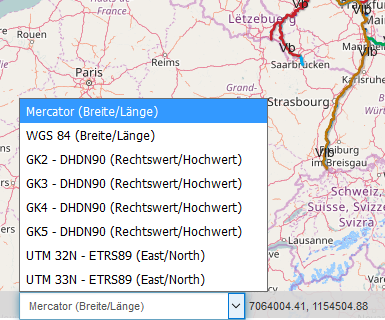

Fähren Sie mit der Maus über die Karte, so werden Ihnen im dargestellten Bereich, neben der Drop-Down-Liste der Projektionen, die zur Mausposition gehörenden Koordinaten in der Projektion Mercator angezeigt. 

Falls Sie die Koordinaten in einer anderen Projektion angezeigt bekommen haben möchten, so wählen Sie aus der Drop-Downliste die gewünschte Projektion aus und Ihre Koordinaten werden nun in dieser Projektion angezeigt.

**Dialog**

Um Ihnen Koordinaten einer bestimmten Mausposition in allen Projektionen der Drop-Down-Liste (siehe oben) darstellen zu lassen, verwenden Sie die rechte Maustaste und Ihnen werden im Tab **Koordinaten** alle Koordinaten in verschiedenen Projektionen dargestellt.

Im anderen Tab **BwaStr Locator** finden Sie ggfs. eine Station einer Bundeswasserstraße.

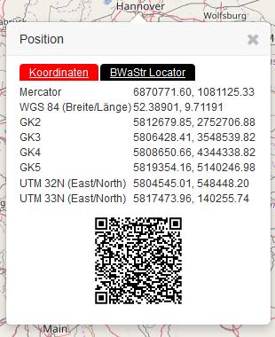

Zusätzlich erhalten Sie einen QR-Code mit dem Sie den Webmap Client mit den ausgewählten Koordinaten auf mobilen Geräte laden können.

### Weitere Funktion

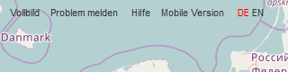

**Vollbild**

Sie möchten den Webmap Client in Vollbild-Modus sehen, dann können Sie dies über die Funktion 'Vollbild' aktivieren. 

Um den Vollbild-Modus zu beenden, betätigen Sie die 'ESC'-Taste auf der Tastatur.

**Problem melden**

Sie haben Probleme mit dem Webmap Client. Informieren Sie uns über die Funktion 'Problem melden'. Wird diese Funktion betätigt, so erscheint ein Dialog, indem Sie folgendes Eintragen können:

- Ihre E-Mailadresse (freiwillig), z.B. für Rückfragen an Sie.
- Ihr Kommentar zum Problem.
- Dateien zum Problem hinzufügen, wie z.B. KML.

Falls Sie ein Problem senden, wird der Webmap Client-Verantwortlich per E-Mail informiert. 

**Hilfe**

Detailierte Hilfe zum Webmap Client.

**Mobile Version (nicht im Portal vorhanden)**

Um den Webmap Client in der mobilen Version anzeigen zu lassen, verwenden Sie die Funktion 'Mobile Version'. Das Layout des Webmap Clients ändert sich anschließend zur mobilen Version und die Darstellung von z.b. Menü und Hintergrundkarte ändert sich zur Desktop Version. 

**Sprachumschalter (nicht im Portal vorhanden)**

Sie wollen den Webmap Client z.B. in Englischer-Version sehen. Verwenden Sie einfach den Sprachumschalter und die Sprache des Webmap Clients wird geändert.

## Konfiguration

### Einstellung für den Webmap Client

Die Konfiguration des Karten Clients erfolgt über JS-Dateien.

Diese Dateien finden Sie in Ihrer Portal-Installation unter


/WEBMAPCLIENT-KONFIGURATIONS-PFAD/WebmapClientData/config/


und enthält die Dateien "setting.js" und "settings.profile.js".

In der Datei "setting.js" sind alle möglichen Einstellungen für den Webmap Client enthalten.

| Einstellung                       | Beschreibung                                                              | Wert-Typ       | Defaul-Wert                          |
|-----------------------------------|---------------------------------------------------------------------------|----------------|--------------------------------------|
| settingDefaultTopicId             | Ausgewählte Rubrik im Karten-Menü                                         | String         | themen|
| settingExtent                     | Initialer Kartenausschnitt (in WGS 84)                                    | String         | [0.42587260523, 46.9672880527, 15.7908768234, 55.1764096793]|
| settingEpsgExtent                 | Kartenausbreitung der Projektion (in WGS 84)                              | String         | [0.42587260523, 46.9672880527, 15.7908768234, 55.1764096793]|
| settingEpsg                       | Kartenprojektion                                                          | String         | EPSG:3857|
| settingShortURLService            | URL-Shortener Dienst                                                      | String         | https://is.gd/create.php?format=json|
| settingSearchServiceUrl           | Dienst zur Suche von WMS Dienste                                          | String         | http://dev.informationgrid.eu/opensearch/query?q={query}+t011_obj_serv_op_connpoint.connect_point:http*+t011_obj_serv.type:view+cache:off+datatype:metadata+ranking:score%26ingrid=1%26h=100| 
| settingSearchNominatimUrl         | Dienst zur Suche von Orten                                                | String         | http://nominatim.openstreetmap.org/search?format=json%26countrycodes=de|
| settingSearchBwaLocatorUrl        | Dienst zur Suche von Bundeswasserstraßen                                  | String         | https://atlas.wsv.bund.de/bwastr-locator/rest/bwastrinfo/query?limit=200%26searchfield=all|
| settingSearchBwaLocatorGeoUrl     | Dienst für Daten zu Bundeswasserstraßen                                   | String         | https://atlas.wsv.bund.de/bwastr-locator/rest/geokodierung/query|
| settingSearchBwaLocatorStationUrl | Dienst für Stationdaten zu Bundeswasserstraßen                            | String         | https://atlas.wsv.bund.de/bwastr-locator/rest/stationierung/query|
| settingCopyrightURL               | Link zum Copyright                                                        | String         | /impressum|
| settingSitemapURL                 | Link zur Sitemap                                                          | String         | /inhaltsverzeichnis |
| settingUseGeodesic                | Geodesic-Aktivierung zum Messen                                           | Boolean        | true|
| settingDefaultMousePositionIndex  | Default Projektion für die Darstellung von Koordinaten per Mauszeiger     | Integer        | 0|
| settingDefaultWMSList             | Vordefinierte Liste von WMS Diensten für den Import von WMS               | Array          | []|
| settingShareFacebook              | Kartenzustand teilen per Facebook                                         | Boolean        | true| 
| settingShareMail                  | Kartenzustand teilen per E-Mail                                           | Boolean        | true|
| settingShareGoogle                | Kartenzustand teilen per Google+                                          | Boolean        | true|
| settingShareTwitter               | Kartenzustand teilen per Twitter                                          | Boolean        | true|
| settingShareIFrame                | Kartenzustand teilen per iFrame                                           | Boolean        | true| 
| settingShareLink                  | Kartenzustand teilen per Link                                             | Boolean        | true| 
| settingPrintLogo                  | URL zum Logo beim Druck                                                   | String         | location.protocol + '//' + location.host + '/ingrid-webmap-client/frontend/prd/img/print_logo.png'|
| settingPrintNorthArrow            | URL zum Nordzeiger beim Druck                                             | String         | location.protocol + '//' + location.host + '/ingrid-webmap-client/frontend/prd/img/north_arrow.png'|
| settingPrintGraticuleLayer        | URL und Layer für das Koordinatennetz beim Druck                          | String         | {"url":"http://atlas.wsv.bund.de/netze/wms?", "layers":["GN","GNB"]}|
| settingKMLName                    | Prefix für die Datei beim KML-Download                                    | String         | INGRID|
| settingHideCatalog                | Verstecken des Menüs Rubrik                                               | Boolean        | false|

> Hinweis: Diese Datei sollte nicht verändert werden. Soll ein Wert einer Einstellung/Variable aus der Datei "setting.js" geändert werden, so soll diese Variable in die Datei "setting.profile.js"-Datei übertragen werden und dort angepasst werden. Die Datei "setting.profile.js" ist per Default leer.

Beispiel an Hand der Einstellung 'settingDefaultTopicId': 


...
settingDefaultTopicId = 'anbieter';
...


### Daten für den Webmap Client

Neben den genannten Einstellungen zu dem Webmap Client, besteht auch die Möglichkeit diesen Client mit Daten bzw. Rubriken zu befüllen, d.h. eine Baumstruktur von (Struktur-) Layern zu erzeugen. 

Bei einem Blick auf das Menü des Clients finden Sie das Akkordeon 'Themen'. Hier enthalten ist eine Baumstruktur aus (WMS-) Layern, die zu einzelnen Kategorien zugeordnet sind.

Um solche Rubriken zu erstellen, bedarf es mehrere Anpassung von JSON-Dateien unter dem Verzeichnis:


/WEBMAPCLIENT-KONFIGURATIONS-PFAD/WebmapClientData/data/


**Definition von Layern (layers.json)**

Alle (WMS-) Layer, die in einer Rubrik auftauchen sollen, müssen in einer Liste in der Datei *layers.json* definiert werden.


{
    ...
    // Eindeutige ID des Layers
    "webatlasde_light": { 
        // URL des Layers
        "wmsUrl": "http://sg.geodatenzentrum.de/wms_webatlasde.light?",
        // 'NAME' des Layers
        "wmsLayers": "webatlasde.light",
        // Rand in Pixel um Tiles
        "gutter": 0,
        // Titel für die URL unter 'attributionUrl' (wird in der Karte (unten rechts) angezeigt, wenn der Layer aktiv ist)
        "attribution": "geodatenzentrum",
        // URL für weitere Infos zum Layer
        "attributionUrl": "http://www.bkg.bund.de/DE/Home/homepage__node.html__nnn=true", 
        // Layer ist ein Hintergrund-Layer 
        "background": true,
        // GetMap Bild-Format
        "format": "png",
        // Layer-Name für WMTS
        "serverLayerName": "webatlasde_light",
        // WIRD NICHT BEI INGRID VERWENDET
        "selectbyrectangle": true,
        // WIRD NICHT BEI INGRID VERWENDET
        "timeBehaviour": "last",
        // Zugehörigen Rubriken
        "topics": "themen,anbieter",
        // Titel des Layers
        "label": "webatlasde.light",
        // Layer wird per SingleTile (Wert: true) geladen oder in Kacheln (Wert: false)
        "singleTile": false,
        // WIRD NICHT BEI INGRID VERWENDET
        "highlightable": true,
        // WIRD NICHT BEI INGRID VERWENDET
        "chargeable": false,
        // WIRD NICHT BEI INGRID VERWENDET
        "hasLegend": true,
        // URL der Legende (falls vorhanden, ansonsten wird GetLegenden-Request ausgeführt)
        "legendURL": "LEGENDEN-URL"
        // Typ des Layers
        "type": "wms",
        // WIRD NICHT BEI INGRID VERWENDET
        "timeEnabled": false,
        // GetFeature-Info-Abfrage ist möglich
        "queryable": false,
        // Version des Layers (Wert: 1.1.1 oder 1.3.0)
        "version": "1.1.1",
        // Tooltip ist vorhanden
        "tooltip": false,
        // Per default Sichtbarkeit/Transparenz des Layers setzen (Wert: 0 - 1)
        "opacity": 1,
        // Layer kann in der Suche recherchiert werden (Wert: false oder true)
        "searchable": true,
        // GetMap-Anfrage auf Layer liefert im Response-Header 'Access-Control-Allow-Origin: * || <HOST>'
        "crossOrigin": false,
        // Extent des Layers in WGS84
        "extent": [10.5, 51.7, 10.7, 51.8]
    },
    ... 
}


Die Liste ist auch in der Suche des Webmap Clients integriert, sodass eine Suche nach einzelnen definierten (WMS-) Layern recherchiert werden kann.  

**Definition von Rubriken (catalogs.json)**

Rubriken, die im Webmap Client existiern sollen, werden in der Datei **catalogs.json** definiert. Die Definition einer Rubrik kann folgendermaßen aussehen:


{
    "topics": [{
        // Definition Hintergrund-Layer per default
            "defaultBackground": "osmLayer",
        // Vorhandene Sprachen der Rubrik 
            "langs": "de,en",
        // Definition von per Default selektierten Layern
            "selectedLayers": [],
        // Definition von per Default sichtbaren Layern
            "activatedLayers": [],
        // Definition von auswählbaren Hintergrund-Layern
            "backgroundLayers": ["osmLayer", "webatlasde_light"],
        // ID der Rubrik 
            "id": "themen"
        },
        ...
    ]
}


**Erstellung der Baumstruktur zu einer Rubrik (catalog-[TOPIC-ID].json)**

Zu jeder definierten Rubrik unter 'catalogs.json' muss eine weitere JSON-Datei erstellt werden. Von der Benennung der Datei muss diese folgende Syntax vorweisen:


catalog-[TOPIC-ID].json


In der erstellten Datei wird die Struktur der Rubrik im JSON-Format hinterlegt. Wie der Inhalt des JSON-Formats aussehen kann, zeigt folgendes Beispiel:


{
    "results": {
        "root": {
        // Root Rubrik ID (immer 'root')
            "category": "root",
        // WIRD NICHT BEI INGRID VERWENDET
            "staging": "prod",
        // Eindeutige ID eines Knotens
            "id": 1,
        // Definition von Unterknoten
            "children": [{
            // WIRD NICHT BEI INGRID VERWENDET
                "category": "cat70",
            // WIRD NICHT BEI INGRID VERWENDET
                "staging": "prod",
            // Knoten-Status per Default
                "selectedOpen": false,
            // Titel des Knotens
                "label": "Geobasisdaten",
            // Eindeutige und einmalige Rubrik-Knoten ID, erweitert URL-Parameter 'catalogNodes' (Wiederherstellung des Knoten-Status)
                "id": 2, 
            // Definition von Unterknoten
                "children": [{
                // WIRD NICHT BEI INGRID VERWENDET
                    "category": "cat71",
                // WIRD NICHT BEI INGRID VERWENDET
                    "staging": "prod",
                // Knoten-Status per Default
                    "selectedOpen": false,
                // Titel des Knotens
                    "label": "Bestandsübersicht Geodatendienste VKV",
                // Eindeutige und einmalige Rubrik-Knoten ID, erweitert URL-Parameter 'catalogNodes' (Wiederherstellung Knoten-Status)
                    "id": 3,
                // Definition von Unterknoten
                    "children": [{
                    // WIRD NICHT BEI INGRID VERWENDET
                        "category": "layer",
                    // WIRD NICHT BEI INGRID VERWENDET
                        "staging": "prod",
                    // Titel des Knotens
                        "label": "LGLN-Bestand",
                    // ID des Layers (definiert in layers.json)
                        "layerBodId": "-652009786_bestand",
                    // Eindeutige und einmalige Rubrik-Knoten ID, erweitert URL-Parameter 'catalogNodes' (Wiederherstellung Knoten-Status)
                        "id": 4,
                    // Definition von Unterknoten
                        "children":[]
                    },
                    ...
                    ]
                },
                ...
                ]
            },
            ...
            ]
        }
    }
}


>Zu beachten ist:
Hat ein Knoten die Eigenschaft "layerBodId", so handelt es sich um einen darstellenden Layer-Knoten, ansonsten wird es als Struktur-Knoten dargestellt (ohne Checkbox).

## Schnittstellen

### URL-Shortener

Da der Zustand der Karte in der URL abgebildet wird, kann die URL sehr lang werden. Der URL-Shortener verkürzt hierfür die URL der Karte und wird bei den Funktionen [Teilen](#teilen) und [Drucken](#drucken) verwendet. 

Per Default wird im Mapclient der öffentlich Dienst [https://is.gd/](https://is.gd/) verwendet. Über diesen Dienst kann eine URL folgendermaßen verkürzt werden:
 

https://is.gd/create.php?format=json&url=<URL>


Als Antwort des Dienstes wird ein JSON-Objekt mit einem Schlüssel 'shorturl' geliefert, z.B.: 


{ "shorturl": "https://is.gd/pvfPuU" }


Den per Default eingestellten URL-Shortener kann man im Webmap Client austauschen. (siehe [Konfiguration](#konfiguration)).
Hierbei ist es notwendig, dass der ausgetauschte URL-Shortener die gleiche JSON-Anwort, auch von der Struktur mit dem gleichen Schlüssel, liefert.

Eine alternative hierbei ist [YOURLS](https://yourls.org/).

Es gibt zwei Möglichkeiten YOURLS zu installieren.

- **YOURLS-Installationspaket**: Hierbei laden Sie das YOURLS-Installationspaket herunter, entzippen es in Ihr gewünschtes Verzeichnis und folgenden den Anweisungen unter [https://yourls.org/#Install](https://yourls.org/#Install).
- **YOURLS-GitHub-Repository**: Klonen Sie sich das YOURLS-Github-Repository unter https://yourls.org/#Install [https://github.com/YOURLS/YOURLS](https://github.com/YOURLS/YOURLS) in Ihr gewünschtes Verzeichnis. Dafür benötigen Sie natürlich die Git-Software auf Ihrer Systemumgebung.

Passen Sie bei beiden Möglichkeiten die Datei **config.php** im Verzeichnis **/YOURLS/user** an. Falls diese Datei **config.php** nicht existiert, so machen Sie eine Kopie der Datei **config-sample.php** und nennen Ihre Kopie in **config.php** um.

Tragen Sie folgende Eigenschaften-Werte ein:


**Datenbank**
- MySQL Datenbank Benutzer: define( 'YOURLS_DB_USER', 'DB_BENUTZERNAME' );
- MySQL Datenbank Passwort: define( 'YOURLS_DB_PASS', 'DB_BENUTZERNAME-PASSWORT' );
- MySQL Datenbank Name: define( 'YOURLS_DB_NAME', 'yourls' );
- MySQL Host: define( 'YOURLS_DB_HOST', 'localhost' );
- MySQL Tabellen Prefix: define( 'YOURLS_DB_PREFIX', 'yourls_' );

**YOURLS URL**
- YOURLS URL: define( 'YOURLS_SITE', 'YOURL-URL' );

**BENUTZER**
- YOURLS Benutzer-Login: $yourls_user_passwords = array('BENUTZERNAME' => 'BENUTZER-PASSWORT');


Weitere Einstellungsmöglichkeiten von YOURLS finden Sie [hier](https://yourls.org/#Config).

Rufen Sie anschließend die YOURLS-Adminoberfläche mit **YOURL-URL/admin/** auf und loggen sich mit **BENUTZERNAME** und **BENUTZER-PASSWORT** ein.

### QR-Code

Für die Funktionen [Teilen](#teilen), [Koordinatenanzeige](#koordinatenanzeige) (Maus-Rechts-Klick auf der Karte) und [Drucken](#drucken) wird ein QR-Code dargestellt. 
Für die Generierung des QR-Codes bietet der Webmap Client eine eigene Rest-Schnittstelle:


http://<HOSTNAME>/ingrid-webmap-client/rest/data/qrcodegenerator?url=<URL>


Über diese Schnittstelle wird für eine beliebige URL eine QR-Code generiert.

Für die QR-Code Generierung wird die JAVA-Bibliothek com.google.zxing.core in der Version 3.2.1 verwendet.

### Mapfish

Für die Funktion [Drucken](#drucken) wird im Webmap Client die JAVA-Bibliothek org.mapfish.print.print-lib in der Version 2.1.2 verwendet.

## FAQ

#### Kann man die Projektion des Webmap Clients anpassen?

Ja, dies wird durch das Überschreiben der Einstellung **settingEpsg** in der Datei **settings.profile.js** ermöglicht.

> Hinweis: Möglicherweise funktioniert das Drucken des Hintergrund-Layers OSM (OpenStreetMap) nicht korrekt bzw. es wird eine Karte an falscher Position ausgedruckt, da der OSM-Layer die Projektion nicht korrekt unterstützt. 

#### URL-Shortener funktioniert nicht korrekt?

Der per Default eingestellte URL-Shortner (https://is.gd/create.php?format=json) verkürzt nur URL's mit einer Domain und keine mit einer IP-Adresse. Hier liefert der URL-Shortener einen Fehler und vom Webmap Client wird die ungekürzte URL zurückgeliefert. 

> Hinweis: Der URL-Shortener **YOURLS** verkürzt auch URL's mit IP-Adressen. Mehr Informationen zu YOURLS finden Sie unter [URL-Shortener](#url-shortener).
