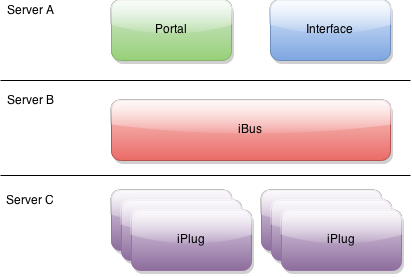
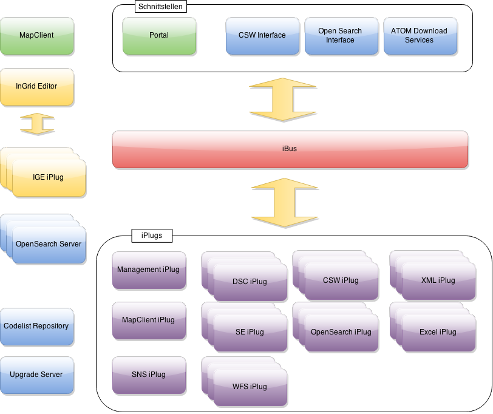
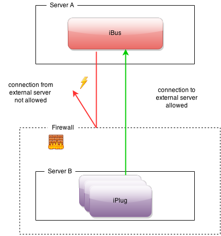

Die grundlegende Software-Architektur besteht aus Komponenten, die über eine Kommunikationsschicht gekoppelt sind. Zwischen den einzelnen Komponenten können Nachrichten ausgetauscht werden. Jede Komponente kann auf einem unterschiedlichen System installiert werden. Dadurch ergeben sich hochflexible Anwendungsszenarien, die auch hohen Sicherheitsanforderungen genügen.

<figcaption class="figcaption">Schematische Darstellung eines InGrid-Systems</figcaption>

## Technischer Aufbau

InGrid basiert auf dem Komponenten-Konzept, das im Bereich der Software-Entwicklung bereits seit längerem erfolgreich eingesetzt wird. Bei diesem Konzept werden Arbeitsaufgaben in Teilaufgaben unterteilt und parallel bearbeitet. Dadurch ergibt sich ein erweiterbares, flexibles und damit auch skalierbares System, mit dem hohe Flexibilität und Performanz gewährleistet werden können. InGrid besteht aus unterschiedlichen Modulen. Die wichtigsten sind der Informationsbroker (iBus), die Schnittstellen zu den Datenquellen (iPlugs), standardisierte Schnittstellen zur Portaloberfläche, offene Schnittstellen zur Weitergabe von Informationen an andere Systeme (CSW und OpenSearch), die Portaloberfläche sowie der InGridCatalog.

<figcaption class="figcaption">Komponenten eines InGrid-Systems</figcaption>

### Der iBus

Der iBus ("Information Bus") bildet in einem InGrid-System das zentrale, verbindende Element. Er arbeitet als Verteilungsstation zwischen Datenquellen und Suchanfragen von Menschen (Portaloberfläche) und Maschinen (CSW/OpenSearch). Als solcher nimmt der iBus eine Suchanfrage entgegen, bereitet diese auf und gibt sie an die angeschlossenen Datenquellen weiter. Die Anfrageergebnisse der einzelnen iPlugs (Datenquellen) werden vom iBus eingesammelt und als Ergebnislisten an das anfragende System zurück gegeben.
 
### Die iPlugs

Ein iPlug ("Information Plug") ist ein Schnittstellenadapter, der das Gesamtsystem mit einzelnen Datenquellen verbindet. Die iPlugs werden am iBus registriert. Das System ist flexibel erweiterbar, d.h. neue iPlugs können nachträglich entwickelt und angeschlossen werden, ohne dass das bestehende System geändert werden muss. Die iPlugs können entweder, soweit dies die Gegebenheiten der Infrastruktur zulassen, dezentral direkt beim Datenanbieter oder zentral am iBus installiert werden. Somit kann alternativ zu einer weitgehend zentralen Installation, ein performanteres voll verteiltes System aufgebaut werden. Jede Datenquelle erhält ein eigenes iPlug, so dass die Datenhalter volle Kontrolle über die bereitgestellten Informationen behalten. Die wichtigsten iPlugs werden im Folgenden vorgestellt

**DSC-iPlug**: Über das "Datasource-Client"-iPlug können Datenbanken mit beliebiger Datenstruktur angeschlossen werden. Als Datenbanktypen werden alle per JDBC ansprechbaren Datenbanken unterstützt (JDBC Treiber muss ggf. installiert werden). Mit dem DSC-iPlug werden ein Index sowie eine Ergebnis-Detaildarstellung von Daten aus der angschlossenen Datenbank erstellt. Sowohl die Abbildung in den Index, als auch die Detaildarstellung können über Abbildungs-Skripte selbst definiert werden.

**SE-iPlug**: Die Suchmaschine ("Search-Engine-iPlug") besteht aus einer Such- und einer Indexierungskomponente. Die Suchkomponente hat die Aufgabe zu einer Suchanfrage die zugehörigen Treffer zu liefern. Dazu wird der von der Indexierungskomponente erstellte Index analysiert. Teil der Indexierungskomponente ist außerdem ein leistungsfähiger Web-Crawler. Die indexierten Dokumente werden über den Semantic Network Service (SNS) des Umweltbundesamts zusätzlich mit Metadaten für Thema, Raum und Zeit angereichert. Die Pflege der zu indexierenden Inhalte kann durch Informationsanbieter rollenbasiert dezentral über das Internet vorgenommen werden. Hierfür ist das SE-iPlug mit einer Benutzeroberfläche ausgestattet, über die der Volltextindex sowie Themen-, Messwert- und Serviceseiten gepflegt werden können.

**SNS-iPlug**: Das SNS-iPlug ist eine spezielle Schnittstelle zum Semantic Network Service (www.semantic-network.de) des Umweltbundesamtes. Über das SNS-iPlug werden die für das Portal notwendigen SNS-Informationen für die Umweltchronik, die räumliche und die semantische Suche abgefragt.

**CSW-iPlug**: Das CSW-iPlug stellt eine Schnittstelle zu OGC-konformen CSW-2.0-Schnittstellen zur Verfügung. Über das iPlug können CSW-Datenquellen an ein InGrid-Portal angeschlossen werden.

**Management-iPlug**: Das Management-iPlug stellt Daten aus der Portal Datenbank den InGrid Komponenten zur Verfügung.

Alle indexierten Ergebnisse werden in der Hauptergebnisliste auf der Portaloberfläche angezeigt. Die Ergebnisse, die aufgrund von Schnittstelleneigenschaften von nicht zu indexierenden Datenquellen stammen, erscheinen in der Nebenergebnisliste.

### Offene Schnittstellen

Für die Kommunikation eines InGrid-Portals mit externen Informationssystemen stehen Schnittstellen zur Verfügung, die auf offenen Standards beruhen und HTTP- sowie XML/SOAP-Technologien für den Datenaustausch nutzen. Die wichtigsten Schnittstellen sind hierbei die OpenSearch-Schnittstelle und die CSW-Schnittstelle.

**OpenSearch-Schnittstelle**: Über diese XML-basierte Schnittstelle kann ein InGrid-Portal über einfache http-GET-Requests abgefragt werden. Die Suchergebnisse werden in einem standardisierten XML-Format ausgegeben und können von Zielsystemen anwendungsbezogen analysiert und aufbereitet werden. Es können sowohl Trefferlisten als auch Detailergebnisse recherchiert werden. Die Schnittstelle kann zudem für parametrisierte Suchanfragen an ein InGrid-Portal genutzt werden. Die Ergebnisse einer solchen Anfrage können z.B. in einem eigenen Portal mit individuellem Layout dargestellt werden.

**CSW-Schnittstelle**: Die OGC-konforme CSW-Schnittstelle basiert auf den ISO-Standards 19115, 19119 und 19139. Sie ist für den Austausch von geografischen Metadaten konzipiert und erfüllt die Anforderungen der GDI-DE und von INSPIRE. Über die CSW-Schnittstelle können externe Systeme auf geografische Metadaten eines InGrid-Portals zugreifen. Die Schnittstelle spielt im Rahmen der Geodateninfrastruktur Deutschland (GDI-DE) sowie von INSPIRE eine zentrale Rolle.

**ATOM Download Service**: Der ATOM Download Service stellt eine INSPIRE kompatible Schnittstelle zwischen Metadaten und den darin referenzierten Daten zur Verfügung. Ausgehen von einem Dienst können dazugehörige Datengrundlagen zum Download angeboten werden.

 
### Portal

Das InGrid-Portal bietet einen komfortablen Zugang zu den in InGrid System verwalteten Daten. Zentrale Funktionalität ist die konfigurierbare, facettierte Suche, mit der der InGrid-Datenbestand durchsucht werden kann. Teil des Portal ist ein Kartenclient, mit dem OGC konforme Kartendienste aus den Suchergebnissen angezeigt werden können.

Weitere Funktionalitäten sind:

* Anzeige von verschiedenen RSS Feeds
* Erweiterte Suche (Suchassistent)
* Anzeige umweltrelevanter Ereignisse (Umweltchronik)
* Anbindung an einen Thesaurus
* Einschränkung der Suche über Raum- bzw. Zeitbezüge
* Personalisierung von Aspekten des Portals für angemeldete Benutzer

## Kommunikation

Die Kommunikation zwischen den InGrid-Komponenten basiert auf TCP-Sockets. Der iBus startet einen Kommunikations-Socket zu dem sich andere Komponenten verbinden können. Über eine etablierte Verbindung erfolgt die weitere Kommunikation.

Dies ermöglicht, dass iPlugs und Schnittstellen hinter Firewalls versteckt werden können. Es muss keine von außen erreichbare Verbindung existieren, so dass keine sicherheitskritischen Verbindungen zu den Komponenten benötigt werden. Die einzige von außen erreichbare Komponente ist der iBus. Firewalls zwischen iPlugs/Schnittstellen und dem iBus müssen nur eine ausgehende TCP-Verbindung zum iBus erlauben. Dies ermöglicht den Einsatz von iPlugs/Schnittstellen in Bereichen mit hohen IT-Sicherheitsanforderungen.

<figcaption class="figcaption">InGrid Communication</figcaption>

In manchen IT-Umgebungen ist es nicht möglich bzw. nicht erlaubt TCP-Verbindungen freizuschalten. Für dieses Szenario wird ein HTTP/HTTPS Kommunikations-Gateway bereitgestellt. Mit Hilfe des Gateways ist es möglich, die TCP-Kommunikation über eine HTTP/HTTPS Kommunikation zu transportieren.

<figcaption class="figcaption">InGrid Communication Gateway</figcaption>

Um die Sicherheit der Kommunikation zwischen den Komponenten zu erhöhen, kann die TCP-Kommunikation zwischen den Komponenten und dem iBus über das Public-Key-Verfahren abgesichert werden. Eine Kommunikation zwischen Komponente und iBus kann dann nur erfolgen, wenn am iBus der Public-Key der jeweiligen Komponente bekannt ist.

## Verwendete Open Source Software für InGrid

Bei der Umsetzung von InGrid wurden als Basis ausschließlich Open-Source-Technologien verwendet. InGrid selbst wird unter der freien  European Union Public Licence (EUPL) [Link einfügen] entwickelt. Eine Nutzung der Software ist damit grundsätzlich ohne weitere Lizenzkosten möglich. InGrid wird von einem Projektkonsortium gepflegt und weiter entwickelt. Mehr Informationen zur Projektorganisation finden sie ... [Verweis auf entsprechenden Menüpunkt]

| Name                | Description            |
|---------------------|------------------------|
| Portaloberfläche  | [Jetspeed (Apache Lizenz, Apache Software Foundation)](http://portals.apache.org/jetspeed-2/)  |
| Suchmaschine  | [Nutch (Apache Lizenz, ASF) &  Lucene (Apache Lizenz, ASF)](https://nutch.apache.org/) |
| Kartenviewer  | [OpenLayers (BSD 2-Clause License)](http://openlayers.org/)  |
| Indexierung von Datenbanken  | [Lucene (Apache Lizenz, ASF)](https://lucene.apache.org/) |
| Unterstützte Datenbanken  | [MySQL](https://www.mysql.com/), [Oracle](http://www.oracle.com/) |

