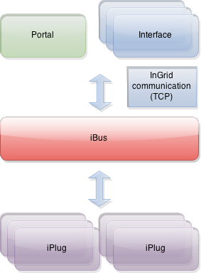

## Allgemeines

Der iBus (information bus) bildet in einem InGrid-System das zentrale Element. Er fungiert als Verteilungsstation zwischen Datenquellen und Suchanfragen. So nimmt der iBus eine Suchanfrage von der Portaloberfläche oder einer anderen übergeordneten Schnittstelle entgegen, bereitet die Anfrage auf und gibt an die angeschlossenen iPlugs weiter. Die Anfrageergebnisse der einzelnen iPlugs (Datenquellen) werden vom iBus eingesammelt und als Ergebnislisten an das anfragende System zurückgegeben.




<figcaption class="figcaption">InGrid Komponente iBus</figcaption>


## Systemvoraussetzungen

* 128 MB RAM
* 20 MB Harddrive

* JAVA 1.6
* Cygwin (unter Windows)


## Installation

Download: [https://dev.informationgrid.eu/ingrid-distributions/ingrid-ibus/](https://dev.informationgrid.eu/ingrid-distributions/ingrid-ibus/)

Um die Installationsroutine zu starten, doppel-klicken Sie auf das Installationsprogramm oder geben Sie folgenden Befehl auf der Kommandozeile ein:

```sh
java -jar ingrid-ibus-VERSION-installer.jar
```

Der Installer ist sowohl per graphischer Oberfläche als auch Kommandozeileneingabe ausführbar. Bitte folgen Sie den Anweisungen des Installationsprogrammes. Das Installationsprogramm installiert den iBus im gewünschten Verzeichnis (default: `/opt/ingrid/ingrid-ibus`) und passt die Konfigurationsdatei `conf/communication.xml` an.

Sie können nun den iBus mit

```sh
sh start.sh start
```

starten.

Der iBus besitzt eine Administrationsoberfläche über die die angeschlossenen iPlugs eingesehen und verwaltet werden können.


http://localhost:PORT


Anstelle von `localhost` können Sie auch die IP-Adresse des Computers eingeben. Authentifizieren Sie sich als 'admin' mit dem von Ihnen vergebenen Passwort.

## Aktualisierung

Neues Release von [https://dev.informationgrid.eu/ingrid-distributions/ingrid-ibus/](https://dev.informationgrid.eu/ingrid-distributions/ingrid-ibus/) herunterladen.

iBus stoppen.

```sh
sh start.sh stop
```

Aktuelles Installationsverzeichnis sichern:

```sh
cp -r /opt/ingrid/ingrid-ibus <BACKUP-DIRECTORY>
```


Die Aktualisierung erfolgt über den Installer.

```sh
java -jar ingrid-ibus-NEW-VERSION-installer.jar
```

Während der Installation bitte "Update" auswählen und das vorhandene Installationsverzeichnis angeben.

iBus starten.

```sh
sh start.sh start
```

## Betrieb

```sh
start.sh [start|stop|restart|status]
```

Die LOG Ausgaben finden sich in der Datei `log.log`.


## Konfiguration

### Konfigurationsparameter

Der iBus bekommt per Kommandozeile folgende Parameter mitgeteilt. Diese Parameter werden während der Installation in der Datei `start.sh` gesetzt und können nur manuell verändert werden.

| Parameter                           | Beschreibung                                             |
|-------------------------------------|----------------------------------------------------------|
| --descriptor conf/communication.xml | Konfigurationsdatei für die Kommunikationseinstellungen  |
| --adminpassword admin               | Passwort für den Zugang zur Administrations GUI |
| --adminport 9900                    | Port unter dem die Administrations GUI zu erreichen ist |
| --busurl /ingrid-group:ibus-test    | Eindeutige ID des InGrid iBus |


Die Datei `conf/communication.xml` enthält die Konfigurationen der InGrid Kommunikationsschicht.

```xml
<communication xmlns:xsi="http://www.w3.org/2001/XMLSchema-instance"
        xsi:noNamespaceSchemaLocation="communication.xsd">
        <server name="/ingrid-group:ibus-test ">
                <socket port="9900" timeout="10" />
                <messages maximumSize="1048576" threadCount="100" />
        </server>
        <messages handleTimeout="60" queueSize="2000" />
</communication>
```

Die einzelnen Parameter haben folgende Bedeutung:

| Parameter                           | Beschreibung                                             |
|-------------------------------------|----------------------------------------------------------|
| server/@name                        | Eindeutige ID des InGrid iBus  |
| socket/@port                        | Port unter dem der iBus zu erreichen ist (Verbindungsaufnahme) |
| socket/@timeout               	  | Timeout der Socketverbindungen in sec |
| message/@maximumSize                | max. zulässige Größe einer Message in Bytes, die über den iBus versendet werden kann |
| message/@threadCount                | Anzahl der Verbindungen (Threads), die der iBus gleichzeitig aufrecht erhalten kann |
| message/@handleTimeout              | Timeout einer Message in sec (Wie lange wartet der iBus auf die Beantwortung einer Message.) |
| message/@queueSize                  | Message Queue (Wie viele Nachrichten können in der Warteschlange des iBus enthalten sein.) |


### Query Modifikation

Der iBus verfügt über eine Möglichkeit bestimmte Teile einer Anfrage zu ersetzen. Die Ersetzung erfolgt anhand eines Property Files unter `conf/querymodifier.properties`.


# add query modifiers here
# <term>|<field>=<ingrid query>
# spaces in key must be escaped by '\'
# this file will be checked for modification every 5 sec
#wasser\ kraft=wasser OR wasserkraft
wasser=wasser OR wasserkraft
title:erde=title:erde OR title:soil
Elbhochwasser=Elbhochwasser OR \"10 Jahre Elbehochwasser\" OR \"10 Jahre Elbe-Hochwasser\" OR \"Elbe-Hochwasser 2002\"


Das Property File wird alle 5 Sekunden auf Änderungen überprüft und ggf. neu geladen.

### Boosting pro iPlug

Am iBus können über Einträge in der Datei `globalRanking.properties` spezielle Boost-Werte für einzelne iPlugs definiert werden. Diese werden auf **alle** Ergebnisse eines iPlugs angewendet. Damit ist es möglich, die Ergebnisse einzelner iPLugs zu betonen (Werte &gt; 1.0) oder zu dämpfen (Werte &lt; 1.0).

Bsp. `globalRanking.properties`:


# iPlug ID = value
# Push results ranking of iPlug up with values > 1.0
# Pull results ranking down with values 0.0 < value < 1.0
/ingrid-group\:iplug-se=0.9


Nach Änderungen muss der iBus neu gestartet werden.


## FAQ

### Wie kann ich ein Überschreiben der Datei `env.sh` bei einer Aktualisierung verhindern.

In der Datei env.sh können Systemvariablen komponenten-spezifisch angepasst werden (z.B. Proxy oder Heap Einstellungen). Um die Einstellungen nach einer Aktualisierung nicht zu verlieren, muss die Datei `env.sh` nach `user.env.sh` kopiert werden. Die Änderungen in `user.env.sh` werden nicht überschrieben.

### Der iBus soll auf einem Port unterhalb von 1024 betrieben werden.

Der iBus muss als user root gestartet werden. Dazu muss die Variable `INGRID_USER=root` als Umgebungsvariable gesetzt, oder der entsprechende Eintrag in der Datei `start.sh` angepasst werden.
