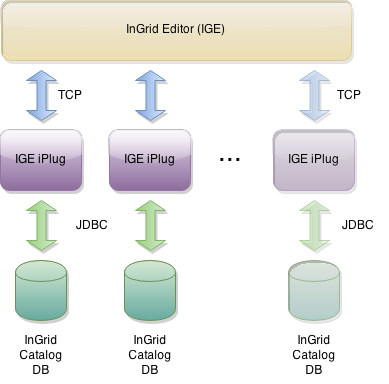

## Allgemeines

Ein IGE iPlug kapselt einen InGridCatalog(IGC) und regelt alle Zugriffe auf diesen Katalog. Es bildet also das Backend der Metadaten Erfassung und stellt sämtliche Schnittstellen zur Erfassung, Bearbeitung und Recherche eines spezifischen Kataloges zur Verfügung.

Seit der Version 3.6.2 wurde die Funktionalität eines DSC-iPlugs integriert und ist somit auch mit dem iBus verbunden. Dadurch erhielt das IGE-iPlug zusätzlich die Aufgabe der Indexierung der Daten und die Suche über den iBus. Die Installation separater DSC-iPlugs ist somit nicht mehr notwendig.
Darüber hinaus werden die Daten sofort beim Veröffentlichen im Index aktualisert und es muss keine vollständige Indexierung mehr ausgeführt werden.

Die Erstellung eines IGC mittels Migration von UDK Daten erfolgt mit dem UDK - IGC Importer .

Bei einem Update des iPlugs wird eine automatische Datenbankmigration ausgeführt.

Der erstellte IGC wird dann mit dem IGE iPlug an die Erfassung (InGridEditor) im Portal angebunden.



<figcaption class="figcaption">InGrid Komponente iPlug IGE</figcaption>


## Systemvoraussetzungen

* 256 MB RAM
* 1 GB Harddrive

* JAVA 1.7
* Cygwin (unter Windows)


## Installation

Download: [https://dev.informationgrid.eu/ingrid-distributions/ingrid-iplug-ige/](https://dev.informationgrid.eu/ingrid-distributions/ingrid-iplug-ige/)

Um die Installationsroutine zu starten, doppel-klicken Sie auf das Installationsprogramm oder geben Sie folgenden Befehl auf der Kommandozeile ein:

```sh
java -jar ingrid-iplug-ige-VERSION-installer.jar
```

Der Installer ist sowohl per graphischer Oberfläche als auch Kommandozeileneingabe ausführbar. Bitte folgen Sie den Anweisungen des Installationsprogrammes. Das Installationsprogramm installiert die Komponente im gewünschten Verzeichnis und passt die Konfigurationsdateien an.

Mit dem Installer kann eine Neuinstallation des iPlugs als auch ein Update einer bestehenden Installation ausgeführt werden.

Bei einer Neuinstallation installiert das Installationsprogramm das iPlug im gewünschten Verzeichnis und passt die Konfigurationsdateien an.
Bei einem Update wird die bestehende Installation auf den neuesten Stand gebracht, die Kommunikations bzw. Datenbankparameter bleiben dabei unverändert.

Sowohl bei Neuinstallation als auch beim Update eines iPlugs wird die zugehörige InGrid Katalog-Datenbank automatisch mit erzeugt (wenn noch nicht vorhanden) bzw. aktualisiert !

> **ORACLE:** Nur für Oracle muss die Katalog-Datenbank existieren, also separat angelegt werden, falls ein neuer Katalog erzeugt werden soll. Es reicht aus, die Datenbank zu erzeugen und das initiale Schema zu importieren (ingrid-igc-schema_102_oracle.sql).

Für MySQL und PostgreSQL (ab InGrid 4.0.2) wird die Katalog-Datenbank automatisch erzeugt, wenn diese noch nicht vorhanden ist oder noch kein Katalog-Schema angelegt wurde (initiale Tabellen).

> ACHTUNG: Beim Start des iPlugs wird der angegebene Katalog automatisch auf die aktuelle Version migriert ! Vor Start des iPlugs sollte ein BACKUP des bestehenden Katalogs erfolgen (am Besten vor Aufruf des Installers) !!!

> Außerdem sollte die Ausgabe des Installers bzgl. der Katalog-Migration beachtet werden! Alle Ausgaben der Katalog-Migration finden sich im Verzeichnis des iPlugs in der Datei importer_TIMESTAMP_log.log

Sie können nun das iPlug mit

```sh
sh start.sh start
```

starten.

## Aktualisierung

Ein neues Release kann von [https://dev.informationgrid.eu/ingrid-distributions/ingrid-iplug-ige/](https://dev.informationgrid.eu/ingrid-distributions/ingrid-iplug-ige/) heruntergeladen werden.

iPlug stoppen:

```sh
sh start.sh stop
```

Aktuelles Installationsverzeichnis sichern:

```sh
cp -r /opt/ingrid/ingrid-iplug-ige <BACKUP-DIRECTORY>
```


Die Aktualisierung erfolgt über den Installer:

```sh
java -jar ingrid-iplug-ige-NEW-VERSION-installer.jar
```

Während der Installation bitte "Update" auswählen und das Installationsverzeichnis der vorherigen Installation angeben.

iPlug starten:

```sh
sh start.sh start
```

### Migration nach PostgreSQL

Die Migration des Katalogs nach PostgreSQL wurde für das IGE iPlug in der Version 4.0.2 final getestet und beschrieben.
Der vorgeschlagene Weg zur Migration ist also:
* das IGE iPlug auf die Version 4.0.2 oder 4.0.2.1 aktualisieren (auf der Quelldatenbank, also MySQL oder Oracle). Der Katalogzustand ist in diesen beiden Versionen identisch.
* danach die Migration der Datenbank nach PostgreSQL vornehmen, dies ist detailliert beschrieben im installierten IGE iPlug unter

conf\sql\migration2postgres

* die Migration wird mit dem Tool EDB Postgres Migration Toolkit per Kommandozeile ausgeführt. Dieses Tool kann von einer normalen Postgres Installation via "StackBuilder" nachinstalliert werden und funktioniert auf Windows und Linux, s. auch [EDB Postgres Migration Toolkit](https://www.enterprisedb.com/products-services-training/products-overview/postgres-plus-solution-pack/migration-toolkit) bzw. [Using Stack Builder to Install Migration Toolkit](https://www.enterprisedb.com/docs/en/9.5/migrate/EDB_Postgres_Migration_Guide.1.12.html).
Eine Überblick inkl. Installer für PostgreSQL 9.5 findet sich im InGrid Wiki unter [Unterstützung der PostgreSQL Datenbank](https://dev.informationgrid.eu/redmine/projects/ingrid/wiki/Unterstuetzung_der_PostgreSQL_Datenbank).

Nach der Migration kann das IGE iPlug, das dann auf dem PostgreSQL Katalog läuft, auf die aktuellste Version aktualisiert werden.

Liegt das IGE iPlug schon in einer höheren Version als 4.0.2.1 vor, so kann die Migration des Katalogs ebenfalls gemäß obiger Beschreibung ausgeführt werden, allerdings müssen dann eventuell noch Nacharbeiten ausgeführt werden, um z.B. Indexe zu migrieren.

**Hintergrund:**
Die Skripte zur Migration beziehen sich auf den Zustand des Katalogs zum Zeitpunkt des IGE iPlugs in der Version 4.0.2 bzw. 4.0.2.1 (gleicher Katalogzustand).
Alle nachfolgenden Versionen des IGE iPlugs aktualisieren dann den PostgreSQL Katalog direkt beim Start des IGE iPlugs.
D.h. bei der initialen Migration eines Katalogs in einer höheren Version als 4.0.2.1 sind eventuell zu tätigende Fixes in den Migrations Skripten nicht enthalten, so werden z.B. die Indexe nicht migriert und müssen per SQL auf dem Postgres Katalog manuell nachgetragen werden.

Die Einstellungen der Datenbankverbindung für PostgreSQL ist auch beschrieben unter [Datenbank](#datenbank)


## Betrieb

```sh
start.sh [start|stop|restart|status]
```

Die LOG Ausgaben finden sich in der Datei `log.log` und `console.log`.


## Konfiguration

Im folgenden werden die Konfigurationsdateien des IGE-iPlug nochmals näher beschrieben. Diese sind bereits entsprechend der Eingabe im Installationsprozess konfiguriert.

Durch die Integration des DSC-iPlugs, ist auch die Administration über den Webbrowser hinzugefügt worden. Über den im Installer angegebenen Port ist die Administrationsseite abrufbar. Siehe dazu auch die [DSC-iPlug-Dokumentation](iplug_dsc_scripted.md).

### IGE-iBus

> Achtung: Der MDEK-iBus oder IGE-iBus ist ein zweiter, separater iBus mit dem sich der IGE-iPlug verbindet. Es handelt sich nicht um den iBus den die DSCs ansprechen. Das IGE-iPlug benötigt einen anderen TCP-PORT als die DSC-iPlugs um sich mit dem IGE-iBus zu verbinden.

Definiert ist der IGE-iBus Port in der Datei


~/ingrid-portal/APACHE_TOMCAT/webapps/ingrid-portal-mdek-application/WEB-INF/classes/communication.xml


Der Pfad kann je nach Installation variieren.

Die Datei hat u.a. folgenden Inhalt:

```xml
<server name="/ingrid-group:ige-ibus">
    <socket port="11000" timeout="10" />
    <messages maximumSize="3145728" threadCount="100" />
</server>
```

Der socket-Port ist der TCP-Port, der vom iPlug IGE aus angesprochen wird.

Der Pfad der communication.xml kann sich je nach Installation ändern, sollte jedoch in jedem Fall im tomcat-Verzeichnis unter webapps/ingrid-portal-mdek-application/WEB-INF/classes liegen.

## InGrid Communication

Die Einstellungen zur InGrid Communication wird in der Datei


conf/config.override.properties


vorgenommen.

Unter dem Schlüssel "communications.ige" werden die Parameter kommasepariert nach dem Format "<client-name>,<ip>,<port>" hinterlegt, zum Beispiel:


communications.ige=/ingrid-group:ige-ibus,127.0.0.1,11000


Hier wird der PeerName des IGE-iPlugs fest gelegt, mit dem dieser in der IGE-iBus Umgebung angesprochen werden kann ("client name", muss eindeutig sein). Unter IGE-iBus wird hier das Frontend der Metadaten-Erfassungskomponente verstanden (InGridEditor), bei dem sich das IGE-iPlug anmeldet und danach über die Oberfläche bearbeitet werden kann. Das Frontend kapselt einen IGE-iBus ("server") an dem sich die IGE-iPlugs bekannt machen. Die Verbindung zum IGE-iBus wird über dessen eindeutige Bezeichnung und der Verbindungsadresse hergestellt. Nach der Anmeldung arbeitet die Erfasserin dann auf dem Ihr zugewiesenen IGE-iPlug.

```xml
 ...
 <client name="/ingrid-group:ige-iplug-bund">
   <connections>
     <server name="/ingrid-group:ige-ibus">
       <socket port="11000" ... ip="192.168.64.104" />
 ...
```


## Datenbank


conf/config.override.properties


Hier sind die Verbindungs-Einstellungen zum InGridCatalog in der Datenbank vorzunehmen.

Beispielhaft könnte dies für MySQL wie folgt aussehen. Wichtig ist, dass der MySQLInnoDBDialect eingestellt und die Datenbank auf InnoDB umgestellt ist, damit Transaktionen unterstützt werden (s. UDK - IGC Importer).


iplug.database.driver=com.mysql.jdbc.Driver
iplug.database.url=jdbc\:mysql\://localhost/igc_database
iplug.database.username=root
iplug.database.password=my_pwd
iplug.database.schema=
iplug.database.dialect=org.hibernate.dialect.MySQLInnoDBDialect


Beispielhafte Konfiguration für Oracle:


iplug.database.driver=oracle.jdbc.OracleDriver
iplug.database.url=jdbc\:oracle\:thin\:@192.168.0.237\:1521\:XE
iplug.database.username=IGC_DATABASE
iplug.database.password=MY_PWD
iplug.database.schema=
iplug.database.dialect=org.hibernate.dialect.OracleDialect


Beispielhafte Konfiguration für PostgreSQL (ab InGrid 4.0.2):


iplug.database.driver=org.postgresql.Driver
iplug.database.url=jdbc\:postgresql\://localhost\:5432/igc_database
iplug.database.username=postgres
iplug.database.password=my_pwd
iplug.database.schema=
iplug.database.dialect=org.hibernate.dialect.PostgreSQLDialect


Die Migration nach PostgreSQL ist beschrieben unter [Migration nach PostgreSQL](#migration-nach-postgresql)


## FAQ

### Wie kann ich ein Überschreiben der Datei `env.sh` bei einer Aktualisierung verhindern.

In der Datei env.sh können Systemvariablen komponenten-spezifisch angepasst werden (z.B. Proxy oder Heap Einstellungen). Um die Einstellungen nach einer Aktualisierung nicht zu verlieren, muss die Datei `env.sh` nach `user.env.sh` kopiert werden. Die Änderungen in `user.env.sh` werden nicht überschrieben.
