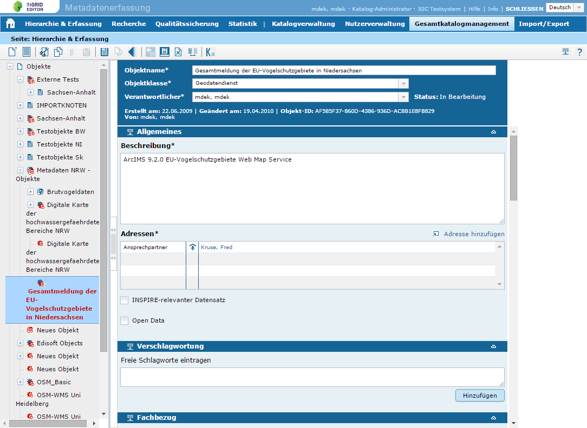
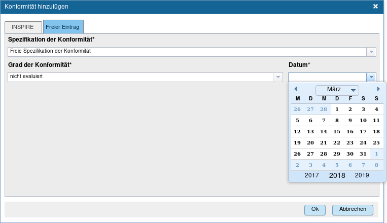

## Allgemeines

Der InGrid Editor erlaubt die Erfassung und Publizierung von ISO 19115/19119/OGC und INSPIRE-konforme Metadaten. Der folgende Screenshot zeigt den Blick auf die Erfassungsmaske.



Die Komponente ist normalerweise Bestandteil des Portals und wird mit diesem installiert. Es ist aber auch möglich den InGrid-Editor separat zu installieren und ohne ein Portal zu betreiben. Daraus ergibt sich eine neue Benutzerverwaltung, die sonst vom Portal bereitgestellt wurde. Wie diese Benutzerverwaltung betrieben wird, wird in diesem Dokument beschrieben.


## Systemvoraussetzungen

* 512 MB RAM
* 20 MB Harddrive

* JAVA 1.6
* Cygwin (unter Windows)


## Installation

Der InGrid-Editor wird über den Installer des Portals installiert. Die Vorgehensweise ist die gleiche wie die der Portal Installation, jedoch wird am Anfang die Option "Nur InGrid Editor installieren" ausgewählt. Danach müssen die Zugangsdaten zu der Datenbank eingegeben werden und es besteht die Möglichkeit, die IGE spezifische Datenbank mit zu installieren, falls diese nicht schon vorhanden ist. In dieser Datenbank sind neben den contextsensitiven Hilfetexten auch die IGE-Benutzer abgelegt, welche bei einer Aktualisierung/Reinstallation nicht überschrieben werden sollte.

Im nächsten Schritt wird das Passwort für den Administrator vergeben, mit dem man sich auf der Administrationsseite einloggen kann. Über diesen Zugang hat man exklusiven Zugang zu der Benutzer- und Katalogverwaltung.

Nachdem die Informationen für das Codelist-Repository eingegeben wurden, kann die Installation beginnen.


## Aktualisierung

Siehe Portal Aktualisierung.


## Administration

### Benutzerverwaltung (Portal)

Die Benutzerverwaltung IM PORTAL besteht aus einer Tabelle mit den gesamten bisher angelegten Benutzern und einer Schaltfläche, die es erlaubt einen neuen Benutzer anzulegen. Zu jedem Benutzer gibt es zudem eine Bearbeiten- und Entfernen-Schaltfläche.

Klickt man auf "Add User" öffnet sich ein Dialog, in dem die Benutzerdaten eingegeben werden können. Alle Felder müssen hierbei ausgefüllt werden, wobei der "Login" eindeutig und das Passwort korrekt in der Wiederholung eingegeben sein muss. Andernfalls wird man auf eine Fehleingabe hingewiesen. Mit einem letzten Klick auf die Dialogschaltfläche "Add User" wird der Benutzer letztendlich in die Datenbank hinzugefügt.

Wird die "edit"-Schaltfläche neben einem Benutzereintrag in der Tabelle ausgewählt, so öffnet sich ein leicht veränderter Dialog, der zum Hinzufügen eines neuen Benutzers verwendet wird, jedoch sind die Felder mit den Benutzerdaten ausgefüllt. Das Passwort wird aus Sicherheitsgründen nicht angezeigt und muss leer gelassen werden, wenn die Benutzerdaten geändert werden. Will man das Passwort ändern, so muss es hier sowie in der Wiederholung angegeben werden. Der Login kann bei der Bearbeitung nicht verändert werden.

Ein Klick auf die Schaltfläche "delete" neben einem Benutzer erzeugt einen Dialog, in der die Löschung eines Benutzers nochmals bestätigt werden muss.

> In den InGrid-Editor können sich nur IGE-Benutzer einloggen. Dabei wird zwischen dem Katalogadministrator und anderen Nutzern unterschieden. Ersterer wird auf der Administrationsseite in der Katalogverwaltung erstellt. Alle anderen Nutzer werden im IGE in der Nutzerverwaltung hinzugefügt.

### Katalogverwaltung (Portal)

In der Katalogverwaltung IM PORTAL gibt es zwei Tabellen, die die verbundenen Kataloge mit dem dazugehörigen Katalogadministrator zeigen und (in der anderen Tabelle) alle verfügbaren, jedoch noch nicht angschlossenen Kataloge.

Existiert ein Katalog, der nicht angeschlossen ist, so wird dieser in der unteren Tabelle (verfügbarer Kataloge) angezeigt. Klickt man auf die "add"-Schaltfläche, erscheint ein Dialog, wo ein Benutzer ausgewählt werden kann, der mit diesem Katalog verbunden werden soll. Dabei werden nur die Benutzer aufgelistet, die noch keine IGE-Benutzer sind. Gibt es keinen freien Benutzer so wird mit einem Dialog darauf hingewiesen. Nach einem Klick auf "Connect Catalogue", ist die Verbindung hergestellt und der Katalog sollte in der oberen Tabelle erscheinen.

Klickt man auf die "delete"-Schaltfläche eines verbundenen Kataloges, erscheint ein Dialog mit einer zusätzlichen Abfrage, ob diese Verbindung wirklich gelöscht werden soll. Da es sich hier nur um eine zu löschende Verbindung handelt, kann diese, wie schon beschrieben, schnell wieder hergestellt werden.

## Konfiguration

### Service Provider

In der Datei `webapps/ingrid-portal-mdek-application/WEB-INF/external-services.xml` können die verschiedenen Service Provider für **Thesaurus** und **Gazetteer** eingestellt werden.

Als **Thesaurus** stehen im Moment *SNS (UMTHES)* oder *GEMET* zur Verfügung.<br>
Als **Gazetteer** *SNS* oder ein *WFS vom geodatenzentrum*.

Die Konfigurationsdateien der einzelnen Service Provider finden sich im Verzeichnis `webapps/ingrid-portal-mdek-application/WEB-INF/classes`:

`sns.properties` für den SNS als Service Provider.

`gemet.properties` für den GEMET als Thesaurus Service Provider.

`wfs.properties` für den WFS als Gazetteer Service Provider. Diese Datei ist normalerweise in einer Library integriert (https://github.com/informationgrid/ingrid-external-service-wfs/blob/master/src/main/resources/wfs.properties). Zum Überschreiben von der Konfiguration muss diese Datei an der oben genannten Stelle erzeugt werden.

Die Aktivierung der unterschiedlichen Services und deren Einstellungen sind beschrieben unter [iPlug-SNS](iplug_sns.html#service-provider)

## FAQ

### Es kommen keine Ergebnisse vom SNS (SSL-Problem)

Siehe hierzu die FAQ vom [iPlug-SNS](iplug_sns.html#faq).

### Wie können in der IGE Nutzerverwaltung Benutzer verschoben werden ?

In der Nutzerverwaltung wird ein 3 stufiger Baum wie folgt aufgebaut, dabei werden MD-Autoren unter MD-Administratoren angelegt:

*Katalog-Administrator
-> Metadaten-Administrator
-> Metadaten-Autor*

MD-Autoren können nicht über die Oberfläche zu einem anderen MD-Administrator verschoben werden.
Dies ist nur über die Datenbank möglich, wo die ID des übergeordnetetn Benutzers geändert werden muss.

Nutzer IDs können wie folgt in der Datenbank abgefragt werden:

```sql
SELECT
user.id,
addr.firstname,
addr.lastname,
addr.institution
FROM 
idc_user user,
t02_address addr
WHERE
user.addr_uuid = addr.adr_uuid
```

Die Änderung des übergeordneten Benutzers erfolgt dann wie folgt:
* für alle MD-Autoren eines MD-Administrators:
```sql
UPDATE idc_user SET parent_id = ??? where parent_id = ???
```
* für einen einzelnen MD-Autor:
```sql
UPDATE idc_user SET parent_id = ??? where id = ???
```

### Was ist das Import Protokoll?

Im Import Protokoll werden die getätigten Schritte bei einem Datenimport sequentiell protokolliert. Das Protokoll wird im InGrid Editor nach einem Import angezeigt.

Dabei entspricht jede Zeile einer "atomaren" Aktion und ist wie folgt aufgebaut:


[! ]ENTITY >> Aktion / Nachricht


Links von ">>" wird das aktuelle Entity identifiziert und zwar via UUID, ORIG_ID (z.B. ArcGis ID), PARENT_UUID.

> ACHTUNG: diese IDs geben immer den aktuellen Zustand in diesem Schritt wieder und können sich in Folgeschritten ändern (Entity verschoben etc.)

Rechts von ">>" stehen ausgeführte Aktionen z.B. auch Änderung von Ids (z.B. Parent UUID wenn verschoben) oder Nachrichten (z.B. bei Unstimmigkeiten).

Unstimmigkeiten werden mit "! " am Anfang der Protokollzeile dargestellt.

**Beispiel Protokoll**

Im folgenden werden Bsp. Ausgaben des Protokolls erläutert:


OBJECT Import Node = B2ADDDD0-1B31-4772-B881-DB7AA33060B1
ADDRESS Import Node = 98AC8183-DFA6-44D0-90FC-A9BE9BFD00CE


Am Anfang von jedem Protokoll stehen die UUIDS der Knoten, unter die importiert wird, wenn nicht unmittelbar veröffentlicht wird (sind in der Import Maske anzugeben).

Damit sind diese als Parent in den Folgezeilen identifizierbar.


Object UUID:922B392C-2355-4C1E-8355-EFB47C49F0D1 ORIG_ID:null PARENT_UUID:null >> EXISTING Object PUBLISHED


Existierendes TOP Objekt (da PARENT_UUID:null) wird mit importierten Daten neu veröffentlicht (unmittelbare Veröffentlichung). Bei einem untegeordneten Objekt wird entsprechend die PARENT_UUID links mit ausgegeben.


Object UUID:F50815F7-4A37-41D9-9829-06DF4CB47230 ORIG_ID:null PARENT_UUID:8B9204BA-2F8B-4CE9-A8D4-D020DB8CFE04 >> Moved to new parent 433D72DB-74B2-4E8C-8CAD-3C1764C82FCB
Object UUID:F50815F7-4A37-41D9-9829-06DF4CB47230 ORIG_ID:null PARENT_UUID:433D72DB-74B2-4E8C-8CAD-3C1764C82FCB >> EXISTING Object PUBLISHED


Ein Objekt wurde aufgrund des Imports verschoben (hat im Import File anderes Eltern-Objekt). Aus der PARENT_UUID links ist das alte und neue Elternobjekt ersichtlich (zusätzlich zur Nachricht auf rechten Seite).


! Object UUID:1BF5543A-3503-11D3-8CA3-0060086D3699 ORIG_ID:null PARENT_UUID:null >> Additional field not found, we remove field VALUE "Nein" (Field-Id:111797, Name:Personenbezogene Daten)
! Object UUID:1BF5543A-3503-11D3-8CA3-0060086D3699 ORIG_ID:null PARENT_UUID:null >> EXISTING Object stored as WORKING version


Beim Import eines Objektes ist ein verknüpftes zusätzliches Feld angegeben, das im aktuellen Katalog nicht existiert. Das Objekt wird entsprechend als Arbeitsversion gespeichert und muß nachbearbeitet werden. Die Daten des zusätzlichen Feldes werden nicht mitgespeichert (sind aber aus dem Protokoll ersichtlich).

> ACHTUNG: Im Import werden keine neuen zusätzlichen Felder angelegt. Die Identifikation eines zusätzlichen Feldes erfolgt via dessen ID.


! Object UUID:226B9CC0-792C-4798-9B1D-2E282C1E88E8 ORIG_ID:null PARENT_UUID:6EACFDC7-7741-48D9-91D9-623FF525E4E9 >> REMOVED address reference of type "Datenverantwortung" to non existing address EB112DA1-7603-48F2-A6EB-CA9BD3F47AE4
! Object UUID:226B9CC0-792C-4798-9B1D-2E282C1E88E8 ORIG_ID:null PARENT_UUID:6EACFDC7-7741-48D9-91D9-623FF525E4E9 >> NEW Object stored as WORKING version


Das Objekt referenziert eine Adresse, die im Katalog nicht vorhanden ist. Das Objekt wird entsprechend als Arbeitsversion gespeichert und muß nachbearbeitet werden. Die Rolle" der Adresse ergibt sich aus dem Protokoll (im Bsp. "Datenverantwortung")


! Object UUID:E86679ED-ACDC-4E8A-A2E0-9FB238B88AE8 >> REMOVED object reference of type "Hamburgische Telekommunikationsnetz" to non existing object 04DE7D5E-8AC9-4928-A2ED-B00DC05B1EE1


Eine Referenz auf ein Objekt wird entfernt, da dieses Objekt im bestehenden Katalog nicht gefunden wurde. Dies wird nach dem Import aller Objekte ausgeführt, um zu vermeiden, daß sich die Import Reihenfolge auf die Querverweise auswirkt (z.B. bei Verweis auf ein neues Objekt, das per Import angelegt wird).

### Wie kann ich Metadatensätze mit fehlender Datumsangabe für die Konformität ermitteln ?



Im 4.3.0 Update wurde das Workflow für die Erfassung der Konformität aktualisiert. Konformitäten werden ab dem 4.3.0 Update über ein Dialogbox verfasst und für freie Konformitäts-Angaben hat der Metadaten-Verfasser die Möglichkeit, entsprechend zu den INSPIRE-Konformitäten ein Datum einzutragen. Für Metadatensätze, die vor dem 4.3.0 Update erzeugt wurden, fehlen die Datumsangaben für die freien Konformitäts-Angaben. Eine Recherche über solche Metadatensätze ist im IGE möglich unter:

*Recherche
-> Datenbank-Suche*

Hier kann eine Liste der Arbeitskopien der Metadatensätze mit fehlenden Datumsangaben für die Konformität mit der folgenden Abfrage generiert werden:

```sql
SELECT DISTINCT obj.objName FROM ObjectNode objNode
JOIN objNode.t01ObjectWork obj
JOIN obj.objectConformitys oc
WHERE oc.publicationDate IS NULL
```

Eine Liste der veröffentlichten Metadatensätze mit fehlenden Datumsangaben für die Konformität können mit der folgenden Abfrage generiert werden:

```sql
SELECT DISTINCT obj.objName FROM ObjectNode objNode
JOIN objNode.t01ObjectPublished obj
JOIN obj.objectConformitys oc
WHERE oc.publicationDate IS NULL
```

