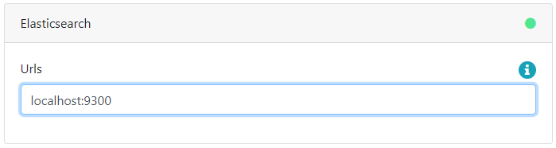
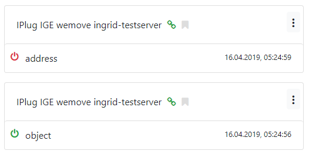
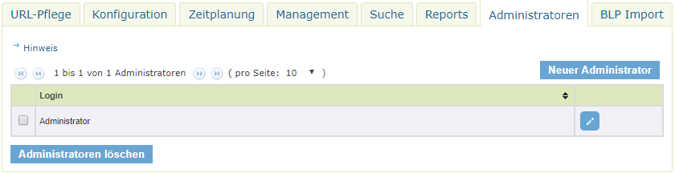
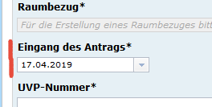

Diese Release Notes betreffen ausschließlich die Versionen 5.0.x. Release Notes ältere Versionen können hier eingesehen werden:  [4.6.x](/4.6.0/about/history.html), [4.5.x](/4.5.0/about/history.html), [4.4.x](/4.4.0/about/history.html)

## Version 5.0.2

### Liste der Änderungen

InGrid
- [Feature] [Portal] Aktualisierung Tomcat auf 7.0.94 ([REDMINE-1372](https://redmine.informationgrid.eu/issues/1372))
- [Feature] [Portal] Aktualisierung SachsenPortalU Profil ([REDMINE-1330](https://redmine.informationgrid.eu/issues/1330))

UVP
- [Feature] [Portal] E-Mail Adresse für Brandenburg UVP "Vorschaltseite" aktualisiert ([REDMINE-1373](https://redmine.informationgrid.eu/issues/1373))
- [Feature] [Portal] Anpassungen für die Verbesserung der BLP-Integration ([REDMINE-1291](https://redmine.informationgrid.eu/issues/1291))
- [Feature] [Portal] Parametrisierung der Kartenansicht ([REDMINE-1113](https://redmine.informationgrid.eu/issues/1113))
- [Bug] [IGE] IE 11 Fix für UVP Erfassungsformular ([REDMINE-1395](https://redmine.informationgrid.eu/issues/1395))
- [Bug] [IGE] Fix für die Anzeige des Feldes "ID des übergeordneten Datensatzes" ([REDMINE-1396](https://redmine.informationgrid.eu/issues/1396))

BAW
- [Bug] [Portal] Fix Kartenmarker ([REDMINE-1380](https://redmine.informationgrid.eu/issues/1380))

### Komponenten

- Portal ([download](https://distributions.informationgrid.eu/ingrid-portal/5.0.2/))

## Version 5.0.1

### Liste der Änderungen

InGrid
- [Feature] [iPLug SE] iPlug SE: Accept invalid SSL certificates (self signed, not in java certstore) ([REDMINE-1368](https://redmine.informationgrid.eu/issues/1368))

UVP
- [Feature] Überarbeitung UVP Nummern Saarland ([REDMINE-1378](https://redmine.informationgrid.eu/issues/1378))

### Komponenten

- Portal ([download](https://distributions.informationgrid.eu/ingrid-portal/5.0.1/))
- iPlug SE ([download](https://distributions.informationgrid.eu/ingrid-iplug-se/5.0.1/))

## Version 5.0.0

Release 16.04.2019

### Wichtige Änderungen

#### Verwendung eines zentralen Index

Mit der Version 5.0.0 wird ein zentraler Index eingeführt, in dem alle iPlugs ihre Daten indizieren. Die iPLugs werden bei einer Suchanfrage dann nicht mehr angesprochen. Dies erhöht die Performance der Suche signifikant und macht den Weg frei für weitere Entwicklungen, wie z.B. "Live Search" oder "Meinten Sie ...?".

Die Admin GUI des iBus wurde um eine Funktion erweitert, die die Verwaltung des zentralen Index erlaubt. Hier können die Indexe der verschiedenen iPlugs administriert werden, so dass es nach wie vor möglich ist, Datenquellen zu- oder abzuschalten.

Bei der Umstellung sind folgende Punkte zu beachten:

**1.) Installation einer Elastic Search Instanz oder eine Clusters**

Für die Verwendung des zentralen Index wird zwingend eine Elasticsearch-Cluster Installation benötigt. Folgende Schritte müssen daher vor der Aktualisierung der InGrid Komponenten ausgeführt werden:

* Installation eines Elasticsearch-Knotens/-Clusters in der Version 6.4.2
  * Hinzufügen des Elasticsearch-Plugins "Decompound-Plugin", welches für die Verarbeitung von zusammengesetzten Worten benötigt wird
    * gehen Sie in das Verzeichnis von Elasticsearch
    * und führen Sie folgenden Befehl aus: 
    `sudo bin/elasticsearch-plugin install https://nexus.informationgrid.eu/repository/maven-releases/org/xbib/elasticsearch/plugin/elasticsearch-analysis-decompound/6.4.2.0/elasticsearch-analysis-decompound-6.4.2.0.zip`
* Alternativ zur manuellen installation kann das folgende Docker-Image verwendet werden: `docker-registry.wemove.com/ingrid-elasticsearch-with-decompound:6.4.2`

**2.) Aktualisierung/Konfiguration des iBus**

Der iBus sollte als erste Komponente aktualisiert werden. Durch die Rückwärtskompatibilität ist eine separate Aktualisierung problemlos möglich.

Nach der Aktualisierung muss in der Admin-GUI des iBus der Elasticsearch Cluster konfiguriert werden. Dazu gehen Sie auf die Einstellungen ("Zahnrad" rechts oben) und geben die IP-Adresse und TCP-Port des Elasticsearche Knotens ein, zum Beispiel: `localhost:9300`. Danach sollte nach ein paar Sekunden das Statussymbol grün sein

Nach der Aktualisierung der iPlugs werden in der "Index-Verwaltung" alle Indizes des ElasticSearch Knotens aufgelistet, die von den iPlugs generiert wurden. Diese können über den Schalter  an- bzw ausgeschaltet werden. Weitere Information sind [hier](../components/ibus) zu finden.

**3.) Aktualisierung aller weiterer Komponenten**

Die weiteren InGrid Komponenten können nun aktualisiert werden.

Die Komponenten nutzen danach automatisch den zentralen Index.

**Hinweis zu der Funktion "Verfügbarkeit der Ergebnisse"**

Durch die Umstellung entfällt die Funktion der "Verfügbarkeit der Ergebnisse" in den iPlugs. Weil die Suche nicht mehr in den iPlugs erfolgt, können diese auch keinen Einfluss mehr auf die Ausgabe der Ergebnisse nehmen.

Wird diese Funktion benötigt, weil bspw. nur einen Teil der Daten weitergegeben werden soll, gibt es folgenden Lösungsansatz:

* Installation eines zusätzlichen iPlugs
* Anschluss an den iBus, an dem die Daten abgegeben werden sollen (in dessen zentral Index)
* Anpassung der Indizierung, um nur die gewünschten Daten auszuliefern
  * zum Beispiel in Datei `spring-mapper-object.xml` im Bean `recordSetProducer` die Eigenschaft `recordSql` anpassen

#### Einführen von Instanz-Administratoren

In der Admin-GUI des iPlug SE können Instanz-Administratoren definiert werden. Der Zugriff innerhalb der Admin GUI wird für diese Administratoren auf eine Instanz beschränkt. Zusätzlich können bestimmte Funktionen nicht verwendet werden.

<figcaption class="figcaption">SE iPlug Instanzen - Administratoren</figcaption>

#### WMTS mit GetCapabilities-Assistent erfassen

Im InGrid Editor lassen sich mir der GetCapabilities Funktion auch WMTS Dienste erfassen.

#### Komprimierung von URL Parametern beim Aufruf von WMS Karten mit vielen Layern

Der Status des Kartenviewers wird komplett über die URL abgebildet. Jede Änderung, z.B. An/Abschalten von Layern, Verschieben/Zoomen der Karte, Redlining innerhalb der Karte führt zu einer Anpassung der URL.  Dadurch kann ein bestimmter Zustand sehr einfach über ein Bookmark gesichert werden.

Bei umfangreichen Kartenkonfigurationen konnte es vorkommen, dass die Länge der URL, die Anzahl der zulässigen Zeichen in bestimmten Browsern überschritt. Ein Bookmarking war dann nicht mehr möglich.

Die Funktionalität wurde nun so angepasst, dass lange URLs automatisch zu einem Kürzel zusammengefasst werden. Unter diesem Kürzel wird die Kartenkonfiguration abgespeichert. So ist es nun möglich beliebig umfangreiche Konfigurationen zu erzeugen und weiterzugeben.

#### UVP: Neues Eingabefeld wegen EU-Berichtspflicht zur Verfahrensdauer

Ein neues Feld `Eingang des Antrags` wurde dem UVP Eingabeformular hinzugefügt. Die Verfahrensdauer spielt eine Rolle bei der Erstellung von EU Berichtspflichten.

<figcaption class="figcaption">UVP Formular - Neus Feld Eingang des Antrages</figcaption>

### Liste der Änderungen

InGrid
- [Feature] [SYSTEM] Umstellung auf die zentrale Indexierung ([REDMINE-835](https://redmine.informationgrid.eu/issues/835))
- [Feature] [SYSTEM] Aktualisierung von Libraries ([REDMINE-1196](https://redmine.informationgrid.eu/issues/1196))
- [Feature] [PORTAL] Aktualisierung auf aktuelle TOMCAT 7 Version ([REDMINE-1271](https://redmine.informationgrid.eu/issues/1271))
- [Feature] [Codelist-Repo] AdV-Produktgruppe erweitern ([REDMINE-1087](https://redmine.informationgrid.eu/issues/1087))
- [Feature] [iPLug SE] Einführen von Instanz-Administratoren ([REDMINE-979](https://redmine.informationgrid.eu/issues/979))
- [Feature] [IGE] Codeliste 6020 aus Katalog löschen ([REDMINE-564](https://redmine.informationgrid.eu/issues/564))
- [Feature] [IGE] WMTS mit GetCapabilities-Assistent erfassen ([REDMINE-513](https://redmine.informationgrid.eu/issues/513))
- [Feature] [MAPCLIENT] Komprimierung von URL Parametern beim Aufruf von WMS Karten mit vielen Layern ([REDMINE-415](https://redmine.informationgrid.eu/issues/415))
- [BUG] [CODELIST/Portal]: Codelist-Service CannotResolveClassException ([REDMINE-1303](https://redmine.informationgrid.eu/issues/1303))
- [BUG] [iPLug SE] Bestimmte Seiten heißen noch "Portal U Administration" ([REDMINE-1289](https://redmine.informationgrid.eu/issues/1289))
- [BUG] [IGE/IBUS] Abfrage des Codelistrepositories in IGE und iBus (früher Management iPlug) berücksichtigt Proxy Einstellungen nicht ([REDMINE-1285](https://redmine.informationgrid.eu/issues/1285))
- [BUG] [IGE] ISO-Element hoursOfService falsch im ISO-XML plaziert ([REDMINE-1284](https://redmine.informationgrid.eu/issues/1284))
- [BUG] [IGE] Beim Einfügen oder Löschen im Strukturbaum muss Baum neu dargestellt werden (Refresh) ([REDMINE-1261](https://redmine.informationgrid.eu/issues/1261))
- [BUG] [IGE] Eingabe-Regeln werden beim initialen Aufruf eines Metadatensatzes nicht korrekt angewandt ([REDMINE-1123](https://redmine.informationgrid.eu/issues/1123))

NUMIS
- [BUG] Header Logo Darstellung im Portal unter IE11 fehlerhaft ([REDMINE-1280](https://redmine.informationgrid.eu/issues/1280))
- [BUG] Requests werden im https://matomo.niedersachsen.de nicht geloggt ([REDMINE-1264](https://redmine.informationgrid.eu/issues/1264))

UVP
- [Feature] Neues Eingabefeld wegen EU-Berichtspflicht zur Verfahrensdauer ([REDMINE-1110](https://redmine.informationgrid.eu/issues/1110))
- [Feature] Integration von BLP-Referenzen der MetaVer-Partner in das UVP-Gemeinschaftsportal uvp-verbund.de auf Basis der nds. Lösung (Excel-Datei) ([REDMINE-914](https://redmine.informationgrid.eu/issues/914))

### Komponenten

- Portal ([download](https://distributions.informationgrid.eu/ingrid-portal/5.0.0/))
- iBus ([download](https://distributions.informationgrid.eu/ingrid-ibus/5.0.0/))
- Codelist-Repository ([download](https://distributions.informationgrid.eu/ingrid-codelist-repository/5.0.0/))
- Interface CSW ([download](https://distributions.informationgrid.eu/ingrid-interface-csw/5.0.0/))
- Interface Search ([download](https://distributions.informationgrid.eu/ingrid-interface-search/5.0.0/))
- iPlug CSW-DSC ([download](https://distributions.informationgrid.eu/ingrid-iplug-csw-dsc/5.0.1/))
- iPlug DSC ([download](https://distributions.informationgrid.eu/ingrid-iplug-dsc/5.0.1/))
- iPlug Excel ([download](https://distributions.informationgrid.eu/ingrid-iplug-excel/5.0.1/))
- iPlug IGE ([download](https://distributions.informationgrid.eu/ingrid-iplug-ige/5.0.0/))
- iPlug Opensearch ([download](https://distributions.informationgrid.eu/ingrid-iplug-opensearch/5.0.1/))
- iPlug SE ([download](https://distributions.informationgrid.eu/ingrid-iplug-se/5.0.0/))
- iPlug SNS ([download](https://distributions.informationgrid.eu/ingrid-iplug-sns/5.0.0/))
- iPlug WFS-DSC ([download](https://distributions.informationgrid.eu/ingrid-iplug-wfs-dsc/5.0.1/))
- iPlug XML ([download](https://distributions.informationgrid.eu/ingrid-iplug-xml/5.0.1/))

