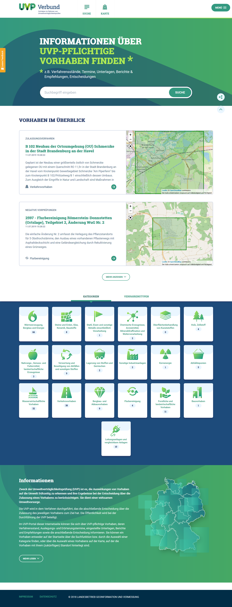
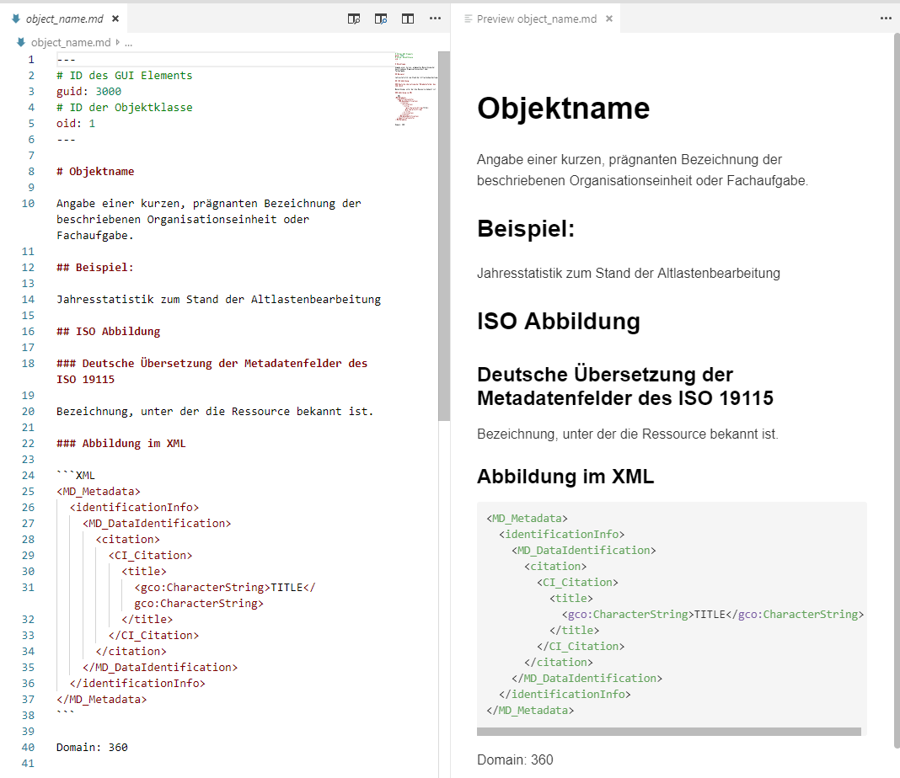
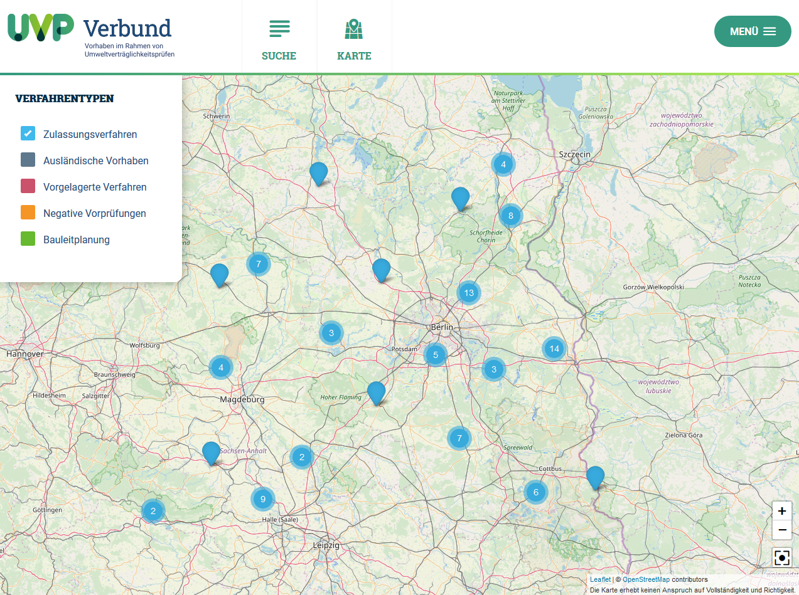

Diese Release Notes betreffen ausschließlich die Versionen 5.1.x. Release Notes ältere Versionen können hier eingesehen werden:  [5.0.x](/5.0.0/about/history.html), [4.6.x](/4.6.0/about/history.html), [4.5.x](/4.5.0/about/history.html)

## Version 5.1.2

Release 06.11.2019

UVP

- [Bug] [IGE] IGE: Verlinkung von hochgeladenen Dokumenten im Editor funktioniert nicht ([REDMINE-1553](https://redmine.informationgrid.eu/issues/1553))

### Komponenten

- Portal ([download](https://distributions.informationgrid.eu/ingrid-portal/5.1.2/))

## Version 5.1.1

Release 01.11.2019

InGrid

- [Bug] [PORTAL] PORTAL: Funktion "Passwort vergessen" funktioniert nicht ([REDMINE-1543](https://redmine.informationgrid.eu/issues/1543))
- [Bug] [IGE] IGE: Automatisches Setzen der Konformität bei getCapabilities Assistenten fehlt ([REDMINE-1446](https://redmine.informationgrid.eu/issues/1446))
- [Bug] [IPLUG-SE] iPlug SE: Zeitgesteuerter Crawl funktioniert nicht ([REDMINE-1466](https://redmine.informationgrid.eu/issues/1466))
- [Bug] [IPLUG-SE] iPlug SE:  Crawl schlägt fehl, wenn Index nicht (mehr) im elastic search existiert. ([REDMINE-1476](https://redmine.informationgrid.eu/issues/1476))

UVP

- [Feature] [IGE] Umbenennung Tabelle "Relevante Dokumente" ([REDMINE-1519](https://redmine.informationgrid.eu/issues/1519))
- [Bug] [Portal] Portal: Manche Download Links werden nicht dargestellt ([REDMINE-1442](https://redmine.informationgrid.eu/issues/1442))
- [Bug] [Portal] Portaltreffer werden bei Aktualität nicht nach Datum absteigend sortiert ([REDMINE-1467](https://redmine.informationgrid.eu/issues/1467))
- [Bug] [Portal] Teaser auf Startseite sollen nur bei Klick auf Titel, Button ins Detail verlinken. ([REDMINE-1468](https://redmine.informationgrid.eu/issues/1468))
- [Bug] [Portal] Popups zB Zeitraum der Erörterung gehen auf dem Smartphone im Portraitmode nicht mittig auf ([REDMINE-1469](https://redmine.informationgrid.eu/issues/1469))
- [Bug] [Portal] Popups in Karte gehen auf Smartphone in Landscape nicht auf, weil Platz nicht ausreicht. ([REDMINE-1470](https://redmine.informationgrid.eu/issues/1470))
- [Bug] [Portal] Eingabe Feld und Captcha Neuladen Butten zu eng zusammen ([REDMINE-1471](https://redmine.informationgrid.eu/issues/1471))
- [Bug] [Portal] UVP: Paging in Suchergebnisseite bricht um ([REDMINE-1472](https://redmine.informationgrid.eu/issues/1472))
- [Bug] [Portal] UVP: UVP Kategorie Text läuft in Detailbutton in Suchergebnis, Fehlendes Icon für UVP Kategorie 18 ([REDMINE-1473](https://redmine.informationgrid.eu/issues/1473))
- [Bug] [Portal] UVP: Auf Smartphone Landscape lässt sich die Legende nicht mehr schließen ([REDMINE-1474](https://redmine.informationgrid.eu/issues/1474))
- [Bug] [Portal] IGE: Ein eingetragenes "gültig bis" Datum wirkt sich auf alle nachfolgenden Dokumente innerhalb der Dokumententabelle aus ([REDMINE-1485](https://redmine.informationgrid.eu/issues/1485))

BKG

- [Feature] [] Gestaltung der Präsentationsoberfläche des BKG-Katalogs ([REDMINE-1200](https://redmine.informationgrid.eu/issues/1200))

### Komponenten

- Portal ([download](https://distributions.informationgrid.eu/ingrid-portal/5.1.1/))
- iBus ([download](https://distributions.informationgrid.eu/ingrid-ibus/5.1.1/))
- Codelist-Repository ([download](https://distributions.informationgrid.eu/ingrid-codelist-repository/5.1.1/))
- iPlug IGE ([download](https://distributions.informationgrid.eu/ingrid-iplug-ige/5.1.0/))
- iPlug SE ([download](https://distributions.informationgrid.eu/ingrid-iplug-se/5.1.0/))

## Version 5.1.0

Release 18.07.2019

### Wichtige Änderungen

#### Neues Layout für uvp-verbund.de

Für das Portal uvp-verbund.de wurde ein neues Layout erstellt.

<figcaption class="figcaption">Neues Layout für uvp-verbund.de</figcaption>

#### Verbesserung der kontext-sensitiven Hilfe im InGrid Editor

Die kontext-sensitive Hilfe im IGE kann nun über Dateien, profilspezifische angepasst werden. Die Hilfetexte werden im Markdown Format erstellt und können selbstständig vom fachlich versierten Personen redaktionell betreut werden.

<figcaption class="figcaption">Bearbeitung kontext-sensitive Hilfe mit Markdown und Vorschau</figcaption>

#### Parametrisierbare Kartenansicht im UVP-Portal

Die Kartendarstellunng im UVP-Portal kann nun parametrisiert werden. Die Parametrisierung umfasst den angezeigten Kartenausschnitt sowie die dargestellten Layer. Eine Dokumentation findet sich unter

[https://www.ingrid-oss.eu/5.1.0/components/portal.html#uvp-wie-kann-man-den-kartenzustand-per-url-festlegen](https://www.ingrid-oss.eu/5.1.0/components/portal.html#uvp-wie-kann-man-den-kartenzustand-per-url-festlegen)

<figcaption class="figcaption">Parametrisierbare Kartendarstellung im UVP-Portal</figcaption>

#### Umstellung auf OpenJDK 8

Alle Komponenten wurden auf OpenJDK 8 umgestellt. Die gesamte InGrid Installation ist damit unabhängig von der Lizenzpolitik Oracles.

### Liste der Änderungen

InGrid

- [Feature] [PORTAL] Portal: Austausch Hintergrundkarte von Leaflet ([REDMINE-1392](https://redmine.informationgrid.eu/issues/1392))
- [Feature] [MAPCLIENT] MAPCLIENT: Admin-GUI: Kategoriebilder hochladen ermöglichen ([REDMINE-1253](https://redmine.informationgrid.eu/issues/1253))
- [Feature] [IGE] Verbesserung der kontext-sensitiven Hilfe ([REDMINE-272](https://redmine.informationgrid.eu/issues/272))
- [Feature] [IGE] IGE: INSPIRE TG MD 2.0: Feld: Zugriffsbeschränkungen ([REDMINE-1219](https://redmine.informationgrid.eu/issues/1219))
- [Feature] [IGE] IGE: INSPIRE TG MD 2.0: Feld: Nutzungsbedingungen ([REDMINE-1218](https://redmine.informationgrid.eu/issues/1218))
- [Feature] [IPLUG_IGE] IGE iPlug: Das Feld mod_time soll im index gespeichert werden ([REDMINE-1425](https://redmine.informationgrid.eu/issues/1425))
- [Feature] [IPLUG-SE] [iPlug SE] Automatische URL Kodierung in der URL-Pflege ([REDMINE-270](https://redmine.informationgrid.eu/issues/270))
- [Feature] [IPLUG-SE] iPlug SE: Accept invalid SSL certificates (self signed, not in java certstore) ([REDMINE-1368](https://redmine.informationgrid.eu/issues/1368))
- [Feature] [INTERFACE-SEARCH] OpenSearch Schnittstelle: In den InGrid Daten der OpenSearch Schnittstelle soll das Modifikationsdatum ausgegeben werden. ([REDMINE-1426](https://redmine.informationgrid.eu/issues/1426))
- [Feature] [INTERFACE-SEARCH] OpenSearch Interface: Kompatibilität mit Zentraler Indexierung herstellen ([REDMINE-1423](https://redmine.informationgrid.eu/issues/1423))
- [Feature] [INTERFACE-SEARCH] Überarbeitung der automatisierten Erstellung von ATOM-Feeds aus dem IGE ([REDMINE-1310](https://redmine.informationgrid.eu/issues/1310))
- [Feature] [IBUS] iBus: Menüpunkt "Indexieren" überarbeiten oder entfernen ([REDMINE-1371](https://redmine.informationgrid.eu/issues/1371))
- [Feature] [SYSTEM] Umstellung auf OpenJDK 8 ([REDMINE-1263](https://redmine.informationgrid.eu/issues/1263))
- [Bug] [PORTAL] Portal: Initiales Suchfeld enthält Wert statt Platzhalter ([REDMINE-1403](https://redmine.informationgrid.eu/issues/1403))
- [Bug] [PORTAL] Portal: Falsche Darstellung von angeschlossenen Datenquellen ([REDMINE-1389](https://redmine.informationgrid.eu/issues/1389))
- [Bug] [IGE] IGE: Auswahl von "Digitale Orthophotos" bei "AdV-Produktgruppe" führt zu Fehlern beim Veröffentlichen ([REDMINE-1128](https://redmine.informationgrid.eu/issues/1128))
- [Bug] [IGE] IGE: Falsche Konformitätseinträge werden beim Laden von Datensätzen hinzugefügt ([REDMINE-1431](https://redmine.informationgrid.eu/issues/1431))
- [Bug] [IGE] IGE: Dienst-URLs per GetCapabilities-Assistenten nicht erreichbar ([REDMINE-1344](https://redmine.informationgrid.eu/issues/1344))
- [Bug] [IGE] IGE: Parent Identifier wieder aktiv ([REDMINE-1427](https://redmine.informationgrid.eu/issues/1427))
- [Bug] [MAPCLIENT] MAPCLIENT: ID-Generierung von neu hinzugefügten Karten führen zu Ausfall der Admin-GUI ([REDMINE-1365](https://redmine.informationgrid.eu/issues/1365))
- [Bug] [MAPCLIENT] MAPCLIENT: Sonderzeichen werden falsch dargestellt ([REDMINE-1354](https://redmine.informationgrid.eu/issues/1354))
- [Bug] [IPLUG-SE] iPlug SE: Suche in Admin GUI funktioniert nicht erwartungsgemäß ([REDMINE-1421](https://redmine.informationgrid.eu/issues/1421))
- [Bug] [IBUS] iBus: Anmeldung auf ibus Admin GUI funktioniert nur auf Port 80 ([REDMINE-1381](https://redmine.informationgrid.eu/issues/1381))
- [Bug] [IBUS] iBus: Behebung von Login-Problemen am iBus ([REDMINE-1428](https://redmine.informationgrid.eu/issues/1428))

MetaVer

- [Bug] [Portal] Keine Verbindung zur Oracle DB nach Update auf 4.6.2 ([REDMINE-1397](https://redmine.informationgrid.eu/issues/1397))

UVP

- [Feature] [Portal] Parametrisierung der Kartenansicht ([REDMINE-1113](https://redmine.informationgrid.eu/issues/1113))
- [Feature] [Portal] Aktualisierung BB Email Adresse auf Vorschaltseite ([REDMINE-1373](https://redmine.informationgrid.eu/issues/1373))
- [Feature] [Portal] UVP: Keine BLP-Treffer bei Filter "Aktualität" ([REDMINE-1178](https://redmine.informationgrid.eu/issues/1178))
- [Feature] [Portal] Umsetzung UVP Layout als Portal Profil ([REDMINE-1265](https://redmine.informationgrid.eu/issues/1265))
- [Feature] [Portal] REDESIGN VON UVP-VERBUND.DE ([REDMINE-1150](https://redmine.informationgrid.eu/issues/1150))
- [Feature] [CODELIST REPO] Überarbeitung UVP Nummern Saarland ([REDMINE-1378](https://redmine.informationgrid.eu/issues/1378))
- [Bug] [IGE] UVP: In Sektion "Allgemein" wird beim Ausklappen das Feld "ID des übergeordneten Datensatzes angezeigt" ([REDMINE-1396](https://redmine.informationgrid.eu/issues/1396))
- [Bug] [IGE] Im IE11 wird das UVP Erfassungsformular nicht angezeigt ([REDMINE-1395](https://redmine.informationgrid.eu/issues/1395))
- [Bug] [IGE] UVP: Vergleichsansicht wirft JavaScript Fehler ([REDMINE-1433](https://redmine.informationgrid.eu/issues/1433))
- [Bug] [Portal] Falsche Anzeige von Enddatum Erörterungstermin ([REDMINE-1387](https://redmine.informationgrid.eu/issues/1387))
- [Bug] [Portal] UVP: Laden von Markern auf der Karte langsam ([REDMINE-1279](https://redmine.informationgrid.eu/issues/1279))

BAW DMQS

- [Feature] [IGE] Bezeichnung und Version des Metadatenstandards für die BAW anpassen ([REDMINE-1386](https://redmine.informationgrid.eu/issues/1386))
- [Bug] [IGE] Fehler beim CSW-Import  ([REDMINE-1336](https://redmine.informationgrid.eu/issues/1336))
- [Bug] [IGE] Geokodierung Queries im BWaStr. Locator funktionieren mit POST nicht ([REDMINE-1380](https://redmine.informationgrid.eu/issues/1380))

### Komponenten

- Portal ([download](https://distributions.informationgrid.eu/ingrid-portal/5.1.0/))
- iBus ([download](https://distributions.informationgrid.eu/ingrid-ibus/5.1.0/))
- Codelist-Repository ([download](https://distributions.informationgrid.eu/ingrid-codelist-repository/5.1.0/))
- Interface CSW ([download](https://distributions.informationgrid.eu/ingrid-interface-csw/5.1.0/))
- Interface Search ([download](https://distributions.informationgrid.eu/ingrid-interface-search/5.1.0/))
- iPlug DSC ([download](https://distributions.informationgrid.eu/ingrid-iplug-dsc/5.1.0/))
- iPlug Excel ([download](https://distributions.informationgrid.eu/ingrid-iplug-excel/5.1.0/))
- iPlug IGE ([download](https://distributions.informationgrid.eu/ingrid-iplug-ige/5.1.0/))
- iPlug SE ([download](https://distributions.informationgrid.eu/ingrid-iplug-se/5.1.0/))
- iPlug XML ([download](https://distributions.informationgrid.eu/ingrid-iplug-xml/5.1.0/))

