## Allgemeines

Das iPlug dient dem Indexieren von Webseiten. Die zu indexierenden Webseiten werden über eine komfortable Administration gepflegt. Die Webseiten werden zeitgesteuert über einen Crawler heruntergeladen, analysiert und indexiert. Dabei kommt für den Web Crawler die OpenSource Software [Apache Nutch](https://nutch.apache.org/) zum Einsatz. Für die Indexierung und Suche wird [Elastic Search](http://www.elasticsearch.org/) verwendet.

")

<figcaption class="figcaption">InGrid Komponente iPlug SE (Search Engine)</figcaption>

Es können mehrere Instanzen mit jeweils unterschiedlicher Konfiguration und unterschiedlichen URL Räumen, die durch Limit und Exclude URL Muster definiert werden, konfiguriert werden. Jede Instanz kann unabhängig gestartet und indexiert werden.

Über eine mächtige Metadaten Funktionalität können bestimmten URL Räumen Metadaten mitgegeben werden. Diese werden mit indexiert und können in der Suche verwendet werden.


Ein Indexierungsdurchlauf besteht aus mehreren Phasen:


| Phase        | Beschreibung |
|-------------|---------------|
| Inject URLs | Start-, Limit- und Exclude URLs werden exportiert und in Nutch-Datenbanken importiert. |
| Filter CrawlDB | Die vorhandene Nutch CrawlDB wird gegen die Limit- und Exclude URLs gefiltert. |
| Generate URLs | Aus der Nutch CrawlDB werden URLs für den Crawl ausgewählt. |
| Fetch | Die URLs werden heruntergeladen. |
| Update CrawlDB | Die Nutch CrawlDB wird mit den neu ermittelten Outlinks der heruntergeladenen Seiten aktualisiert. |
| Update Metadata | Die neuen URLs werden mit den Metadaten aus der URL Raum Definition aktualisiert. |
| Create Host Statistics | Eine Host Statistik wird erzeugt (Anzahl URLs pro Host). |
| Create Url Error Statistics | Eine Statistik über fehlerhafte URLs wird erzeugt. |
| Create Url Report | Ein Statusreport für Start-URLs wird erzeugt. |
| Merge Segments | Vorhandene Segmente werden zu einem Segment konsolidiert. |
| Filter Segments | Vorhandene Segmente werden gegen die CrawlDB gefiltert. Daten von gelöschten URL Räumen werden entfernt. |
| Webgraph | Ein Webgraph wird anhand der Verlinkung der einzelnen URLs erstellt. Der Webgraph gibt Auskunft, wie stark URLs miteinander vernetzt sind. Diese Information geht in die Ermittlung eines Webseiten-Scores bei der Indexierung ein. |
| Update LinkDB | Die Nutch LinkDB wird aktualisiert. |
| Deduplication | Anhand von einem Fingerprint werden Duplikate von Webseiten identifiziert und markiert. |
| Index | Der Index wird aktualisiert. |
| Cleanup Index | Duplikate werden aus dem Index entfernt. |
| Cleanup Crawl | Temp. Dateien werden gelöscht. |


## Systemvoraussetzungen

* 512 MB RAM
* 10 GB Harddrive

* JAVA 8
* Cygwin (unter Windows)


## Installation

Download: [https://distributions.informationgrid.eu/ingrid-iplug-se/](https://distributions.informationgrid.eu/ingrid-iplug-se/)

Um die Installationsroutine zu starten, doppel-klicken Sie auf das Installationsprogramm oder geben Sie folgenden Befehl auf der Kommandozeile ein:

```sh
java -jar ingrid-iplug-se-VERSION-installer.jar
```

Der Installer ist sowohl per graphischer Oberfläche als auch Kommandozeileneingabe ausführbar. Bitte folgen Sie den Anweisungen des Installationsprogrammes. Das Installationsprogramm installiert die Komponente im gewünschten Verzeichnis und passt die Konfigurationsdateien an.

Sie können nun das iPlug mit

```sh
sh start.sh start
```

starten.

Das iPlug besitzt eine Administrationsoberfläche über die die angeschlossenen iPlugs eingesehen und verwaltet werden können.


http://localhost:PORT


Anstelle von `localhost` können Sie auch die IP-Adresse des Computers eingeben. Authentifizieren Sie sich als 'admin' mit dem von Ihnen vergebenen Passwort.


## Aktualisierung

Neues Release von [https://distributions.informationgrid.eu/ingrid-iplug-se/](https://distributions.informationgrid.eu/ingrid-iplug-se/) herunterladen.

iPlug stoppen.

```sh
sh start.sh stop
```

Aktuelles Installationsverzeichnis sichern:

```sh
cp -r /opt/ingrid/ingrid-iplug-se BACKUP_DIRECTORY
```


Die Aktualisierung erfolgt über den Installer.

```sh
java -jar ingrid-iplug-se-NEW-VERSION-installer.jar
```

Während der Installation bitte "Upgrade" auswählen und das Installationsverzeichnis Verzeichnis angeben.

iPlug starten.

```sh
sh start.sh start
```

## Betrieb

```sh
start.sh [start|stop|restart|status]
```

Die LOG Ausgaben finden sich in der Datei `log.log` und `console.log`.


## Konfiguration

### Basiskonfiguration

Die Basiskonfiguration für iPlugs kann [hier](iplug_admin_gui.html) eingesehen werden.


### DB - Einstellungen

Hier sind verschiedene Parameter hinterlegt:

| Parameter | Beschreibung |
| --- | --- |
| Datenbankpfad | Dies ist der Pfad, wo die dateibasierte [H2 Datenbank](http://www.h2database.com) abgelegt werden soll, in der sich die gepflegten URLs befinden. |
| Instanzenpfad | Dieser Pfad gibt an, wo die Einstellungen und Indexe der gesammelten Webseiten abgelegt werden sollen. |
| ElasticSearch Port | Dieser Port wird für die Kommunikation mit dem Index verwendet. **Achtung: Das integrierte Elastic Search benötigt für Clusterfunctionalität auch den Port 9300.** |


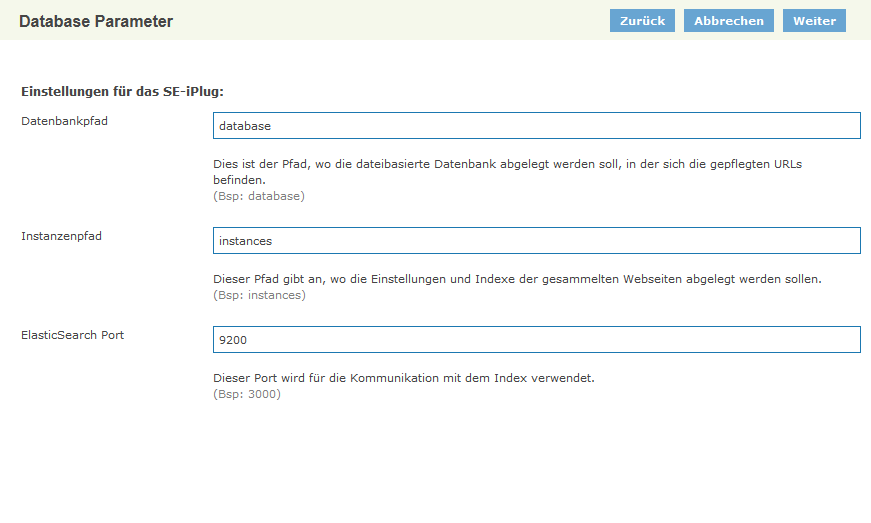

<figcaption class="figcaption">SE iPlug Einstellungen</figcaption>

### SE Instanzen

Es können mehrere Instanzen mit jeweils unterschiedlicher Konfiguration und unterschiedlichen URL Räumen, die durch Limit und Exclude URL Muster definiert werden, konfiguriert werden. Jede Instanz kann unabhängig gestartet und indexiert werden.

In der Übersicht können Instanzen erstellt, kopiert, gelöscht und aktiviert/deaktiviert werden.

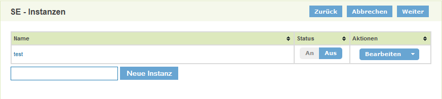

<figcaption class="figcaption">SE iPlug Instanzen - Übersicht</figcaption>

#### Instanzen - URL Pflege

Die URL Pflege erlaubt das Verwalten von URL Räumen, die indexiert werden sollen. URL Räume sind durch 3 Parameter spezifiziert:


| Start-URL | Einstiegs-URL in den URL Raum |
| Limit URL Muster | Ein oder mehrere URL Muster, die nicht verlassen werden dürfen |
| Exclude URL Muster | Ein oder mehrere URL Muster, die innerhalb des URL Raumes ausgeschlossen sind |

Ein URl Muster ist hier immer entweder

- ein rechts-trunkiertes Muster

  ```http://www.domain.com/pfad```

  das alle URLs beginnend mit dem Muster inkludiert

- oder ein regulärer Ausdruck

  ```/http://www.domain.com/[Reguärer Ausdruck]/```

  der alle URL inkludiert, die dem regulären Ausdruck entsprechen. Es ist hier darauf zu achten, dass der reguläre Ausdruck sich immer nur auf den Pfad bezieht. Alle URL Muster müssen zwingend mit einer Domain beginnen.

> Änderungen am URL Raum werden im Index erst nach einem weiteren Indexierungsdurchgang sichtbar.


Auf der Übersichtsseite wird die Liste aller URL Räume angezeigt. Diese kann über einen URL Filter oder die Angabe von bestimmten Metadaten eingeschränkt werden.

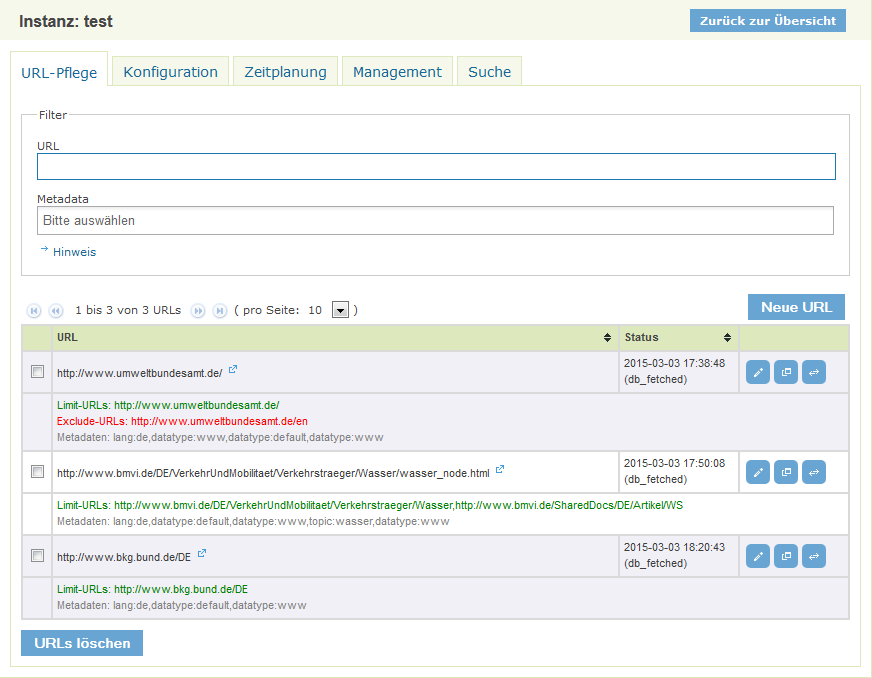

<figcaption class="figcaption">SE iPlug URL Pflege - Übersicht</figcaption>

Für jeden URL Raum wird ein Status angegeben, der sich aufg die Start URL bezieht. Hier kann eingesehen werden, wann die URL zuletzt überprüft wurde und welchen Status diese hat. Folgende Status existieren:

| Status | Erläuterung |
| --- | --- |
| db_fetched | URL wurde erfolgreich geladen. |
| db_redir_temp | Es wurde ein temporärer Redirect erkannt.|
| db_redir_perm | Es wurde ein permanenter Redirect erkannt. |
| db_unfetched | Die URL wurde zur Überprüfung vorgemerkt, aber noch nicht geladen. |
| db_gone | Beim Laden der URL wurde ein Fehler festgestellt. Die URL wurde als nicht mehr existierend klassifiziert. |
| db_notmodified | Die URL wurde geladen, es wurde aber keine Änderungen festgestellt. |

Für jeden URL Raum stehen folgende Aktionen zur Verfügung:

**URL Raum Editieren**

Die Parameter des URL Raumes können editiert werden. Die angezeigten Metadaten zeigen die Default-Einstellungen und können pro Instanz festgelegt werden.

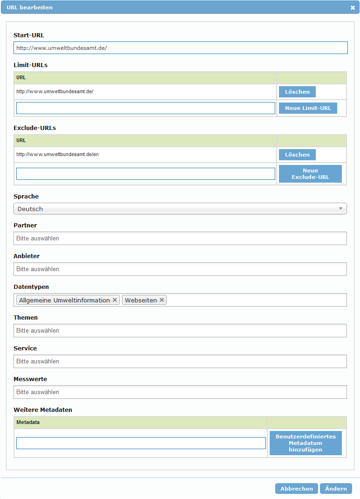

<figcaption class="figcaption">SE iPlug URL Pflege - URL Raum editeren</figcaption>


**Als Template verwenden**

Der URL Raum wird als Template für einen neuen Eintrag erhalten. Alle Metadaten bleiben erhalten.

**Url Testen**

Die Start-URL wird unter realen Bedingungen getestet. Dies bedeutet, dass der Crawl Prozess für die URL durchlaufen wird. Das Ergebnis wird angezeigt und hilft Probleme, wie z.B. Auswirkungen einer vorhandenen `robots.txt` zu analysieren.

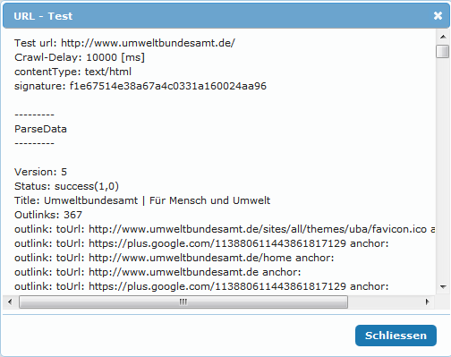

<figcaption class="figcaption">SE iPlug URL Pflege - URL Testen</figcaption>


#### Instanzen - Management

Im Management Bereich kann ein Indexierungsdurchlauf manuell gestartet werden. Die `Tiefe` gibt dabei an wie viele Segmente für den Durchlauf erzeugt werden. Die `Anzahl der URLs` gibt die Anzahl der URLs pro Segment an. In der voreingestellten Konfiguration wird für `Tiefe` immer 1 angegeben.

Im Statusbereich kann der Fortschritt des Crawls verfolgt werden. Hier wird auch der Status des letzten Durchlaufes angezeigt.


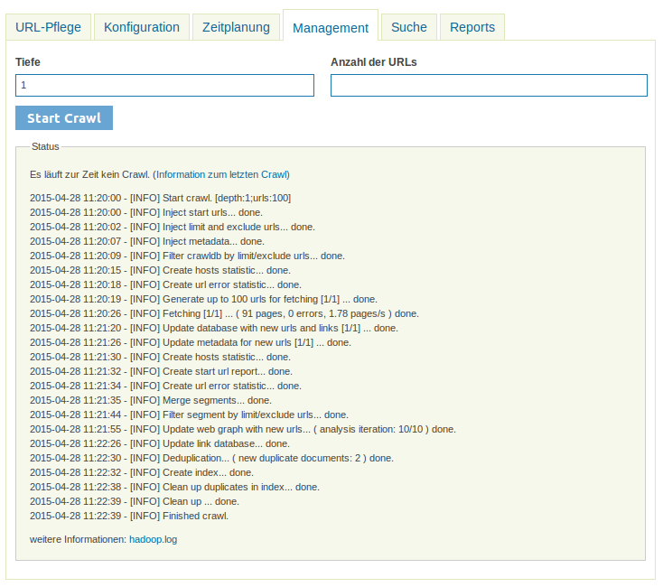

<figcaption class="figcaption">SE iPlug Instanzen - Management</figcaption>


#### Instanzen - Konfiguration Nutch

Nutch Konfigurationswerte können hier komfortable geändert werden. Die Änderungen werden sofort gespeichert und werden sofort beim nä. Schritt des Indexierungsablaufs angewendet!

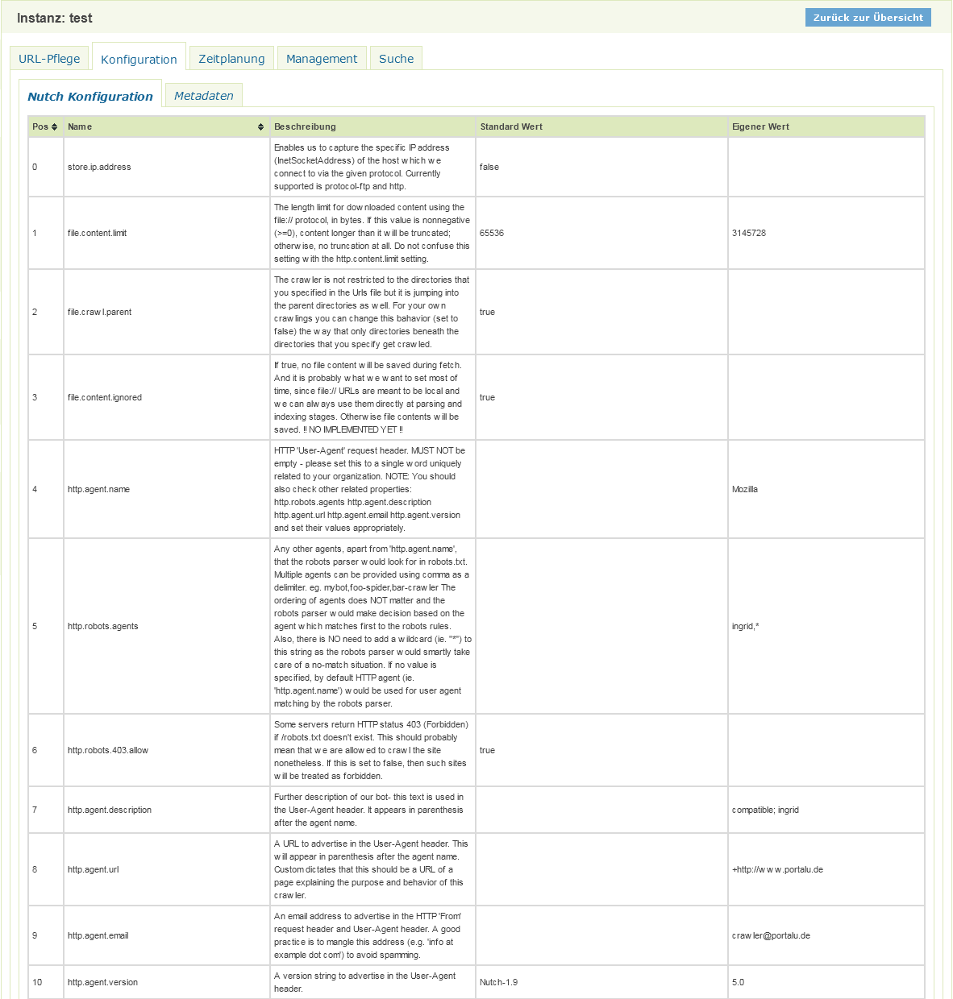

<figcaption class="figcaption">SE iPlug Instanzen - Nutch Konfiguration</figcaption>


Die Anzahl der einstellbaren Parameter ist sehr groß. Daher werden hier nur ausgewählte Parameter sowie sinnvolle Szenarien dokumentiert.

**Allgemeine Parameter**

Diese allgemeinen Parameter gelten für alle Szenarien und sollten bei der Einrichtung von der Webseiten Indexierung beachtet werden.

| Eigenschaft | Wert | Erläuterung |
| ----- | ----- | ----- |
| http.agent.url | +http://www.portalu.de | URL mit der sich der Crawler bei den Webseiten präsentiert. |
| http.agent.email | crawler@portalu.de | Email mit der sich der Crawler bei den Webseiten präsentiert. |
| http.proxy.host | | Der Proxy Server, falls der Zugriff auf die Webseiten über einen Proxy Server erfolgt. Wenn leer, wird kein Proxy verwendet. |
| fetcher.server.delay | 2.0 | Pause zwischen Requests auf den gleichen Server. Dieser Wert kann durch die robots.txt des Servers überschrieben werden. |
| fetcher.max.crawl.delay | -1 | Max. Pause zwischen Requests auf den gleichen Server. Wenn der Wert in der robots.txt ist größer als dieser Wert ist, wird der Server ignoriert. **Achtung:** Ein hoher Wert in der robots.txt kann bedeuten, dass das Laden der URLs von dem Server sehr lange dauert. Bitte über *URL Testen* in der Url Pflege testen. |


**Adaptiver Indexierungsablauf (Default)**

Für jede geänderte Seite wird der Zeitpunkt der erneuten Überprüfung adaptiv berechnet. Seiten, die sich oft ändern werden dadurch automatisch öfter überprüft, Seiten, die sich wenig ändern werden weniger oft überprüft.

| Eigenschaft | Wert | Erläuterung |
| ----- | ----- | ----- |
| db.fetch.schedule.class | org.apache.nutch.crawl.AdaptiveFetchSchedule | Berechnet das Fetch Intervall in Abhängigkeit von der Änderungsrate |
| db.fetch.interval.default | 86400 | Default Fetch Intervall in sec. Dies entspricht 24h und wird für alle neuen URLs verwendet. Dies gilt auch für URLS mit dem Status `db_gone`.|
| db.fetch.interval.max | 7776000 | Max. Fetch Intervall in sec. Dies entspricht 9 Tage, d.h. alle Seiten werden mind. alle 9 Tage zur Überprüfung ausgewählt. |
| db.fetch.schedule.adaptive.min_interval | 60 | Min. Fetch Intervall in sec. Seiten die sich sehr oft ändern werden alle 60 sec zur Überprüfung ausgewählt. Da der Indexierungsvorgang i.d.R länger dauert, werden sich oft ändernde URLs in jedem Durchlauf zur Überprüfung vorgesehen. |
| db.fetch.schedule.adaptive.max_interval | 31536000 | Max. Fetch Intervall für den adaptiven Prozess. Ist auf `db.fetch.interval.max` überschrieben. |


**Nicht-Adaptiver Indexierungsablauf**

Alle URLs bekommen das gleiche Fetch Intervall zugewiesen. Diese Konfiguration kann angewendet werden, wenn immer alle URLs, unabhängig von deren Änderungsrate, überprüft werden sollen.

| Eigenschaft | Wert | Erläuterung |
| --- | --- | --- |
| db.fetch.schedule.class | org.apache.nutch.crawl.DefaultFetchSchedule | Das Fetchintervall für URLs entspricht immer dem Wert `db.fetch.interval.default`. |
| db.fetch.interval.default | 86400 | Default Fetch Intervall in sec. Dies entspricht 24h und wird für alle URLs verwendet. |
| db.fetch.interval.max | 7776000 | Max. Fetch Intervall in sec. Dies entspricht 9 Tage. Dies gilt hier nur für URLS mit dem Status `db_gone`.|


**Indexierung einzelner URLs (z.B. Katalog Crawl)**

Es werden nur die Start-URls indexiert.

| Eigenschaft | Wert | Erläuterung |
| --- | --- | --- |
| db.fetch.schedule.class | org.apache.nutch.crawl.DefaultFetchSchedule | Das Fetchintervall für URLs entspricht immer dem Wert `db.fetch.interval.default`. |
| db.fetch.interval.default | 3600 | Default Fetch Intervall in sec. Dies entspricht 1h und wird für alle URLs verwendet. |
| db.fetch.interval.max | 7776000 | Max. Fetch Intervall in sec. Dies entspricht 9 Tage. Dies gilt hier nur für URLS mit dem Status `db_gone`. Alternativ kann hier auch 3600 eingegeben werden, wenn alle URLs immer überprüft werden sollen.  |
| db.max.outlinks.per.page | 0 | Es werden keine Outlinks aus den Webseiten extrahiert. Die Verlinkungen der Seiten werden dadurch nicht verfolgt. |

#### Instanzen - Konfiguration Metadaten


> **Achtung, bitte vorsichtig sein!**

Dieser Bereich erlaubt die Konfiguration der Metadaten innerhalb einer Instanz. Die Definition der Metadaten erfolgt im JSON Format.

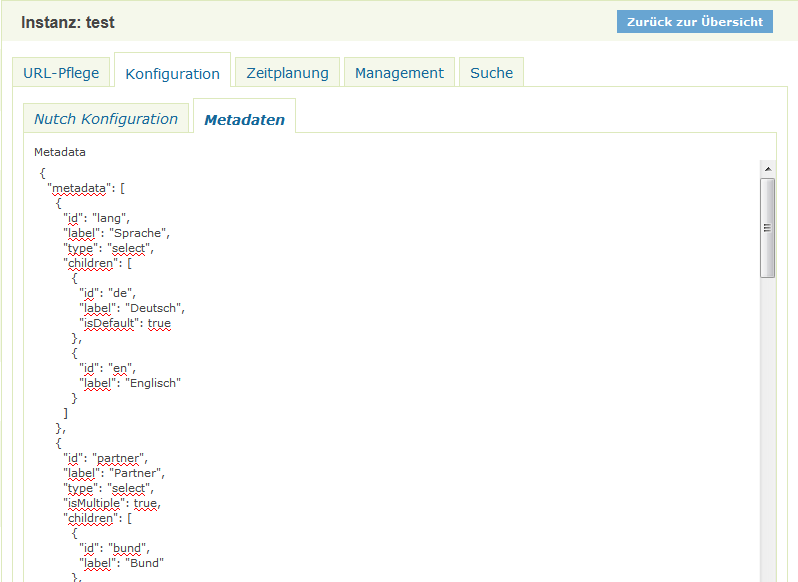

<figcaption class="figcaption">SE iPlug Instanzen - Metadaten Konfiguration</figcaption>


Jedes Metadatum ist durch folgende Eigenschafte definiert.

| Eigenschaft | Erläuterung |
| --- | --- |
| id | Die ID des Metadatums. Dieser Wert wird auch als Name des Indexfeldes bei der Indexierung verwendet. |
| label | Beschriftung des Metadatums in der Oberfläche. |
| type | Element-Typ des Metadatums in der Oberfläche <br><br>`select` - Selectbox (default)<br>`grouped` - Selectbox mit Gruppierung  |
| isMultiple: true | Mehrfachauswahl in Select Boxen ist möglich. |
| children | Enthält den Wertebereich des Metadatums |

Jeder Wert kann über folgende Eigenschaften beschrieben werden:

| Eigenschaft | Erläuterung |
| --- | --- |
| id | Der Wert des Metadatum Wertes. Dieser Wert wird bei der Indexierung verwendet. Wird bei Gruppenüberschriften (`type=grouped`) nicht angegeben. |
| label | Beschriftung des Wertes in der Oberfläche. Bei `type=grouped` wird der Wert als Gruppenüberschrift verwendet. |
| children | Nur bei `type=grouped`. Enthält den Wertebereich einer Gruppe mit den Eigenschaften `id` und `label`. |


#### Instanzen - Zeitplanung

Hier kann die regelmäßige Ausführung des Indexierungslaufes eingestellt werden.

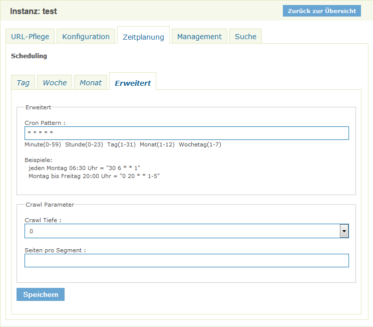

<figcaption class="figcaption">SE iPlug Instanzen - Zeitplanung</figcaption>

Die Zeitsteuerung kann über unterschiedliche Weise eingestellt werden. Die Verwendung von [CRON Mustern](https://de.wikipedia.org/wiki/Cron) ist möglich.

*Crawl Tiefe* steht dabei für die Anzahl der Segmente. Hier sollte in der Regel immer 1 ausgewählt werden.

*Seiten pro Segment* definiert wie viele Seiten maximal pro Segment selektiert werden sollen.


#### Instanzen - Suche

Hier kann der Index der Instanz getestet werden. Diese Suche funktioniert, selbst wenn die Instanz noch nicht zur Suche freigegeben wurde.


<figcaption class="figcaption">SE iPlug Instanzen - Suche</figcaption>


#### Instanzen - Reports

Folgende Reports stehen zur Verfügung:

**Host Report**

Der Host Report liefert Informationen über die Anzahl der

- bekannten (in der CrawlDB vermerkten)
- analysierten (in einem Durchlauf analysierten und ggf. indexierten)

URLs. Das `Ratio` liefert einen schnellen Überblick über das Verhältnis von analysierten zu bekannten URLs ein sehr niedriger Wert deutet auf Problem beim Indexieren einer Domain hin.


<figcaption class="figcaption">SE iPlug Instanzen - Report - Host Report</figcaption>


**Url Fehler Report**

Der URL Fehler Report liefert eine Übersicht über URls, die der Crawl Prozess nicht korrekt analysieren konnte. Darunter fallen sowohl URLs, die nicht geladen werden konnten, als auch z.B. URLs, die auf Grund der Einstellungen für Robots (robots.txt oder META Tags) für die Suchmaschine nicht zur Vefügung stehen.

Die URLs können sowohl über ein URL Teilstring oder über einen Fehlercode gefilter werden.

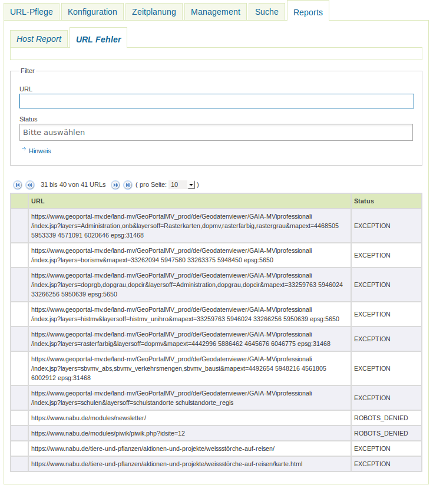

<figcaption class="figcaption">SE iPlug Instanzen - Report - URL Fehler</figcaption>

#### Instanzen - Administratoren

Hier können Instanzadministratoren erstellt und verwaltet werden. Die erstellten Benutzer können sich auf dem iPlug anmelden und erhalten Zugriff auf die zugewiesene Instanz. Auf andere Instanzen und die Konfiguration des iPlugs können diese Benutzer nicht zugreifen.


<figcaption class="figcaption">SE iPlug Instanzen - Administratoren</figcaption>

#### Instanzen - BLP Import

Der BLP Import Tab ist optional. Zur Aktivierung muss in der Datei `config.override.properties` die Option `enable.blpImport=true` hinzugefügt werden.

Nach der Auswahl einer [passenden Excel Datei](../images/blp_daten_template_20190418.xlsx) werden die Zeilen ausgewertet und die URLs in die Instanz aufgenommen. Nach dem Import kann dann wie gewohnt ein Crawl im Management Tab ausgeführt werden. Unter `Hinweise` können genauere Anweisungen eingeblendet werden.

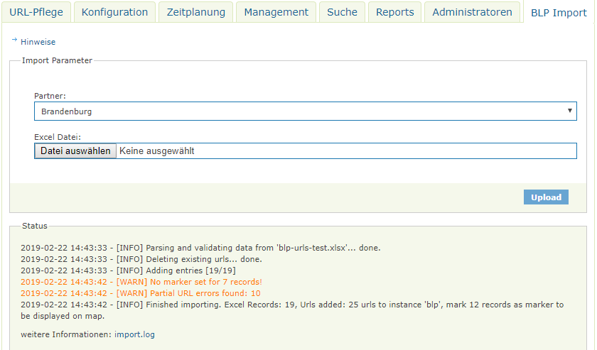
<figcaption class="figcaption">SE iPlug Instanzen - BLP Import</figcaption>


## FAQ

### Wie kann ich ein Überschreiben der Datei `env.sh` bei einer Aktualisierung verhindern.

In der Datei env.sh können Systemvariablen komponenten-spezifisch angepasst werden (z.B. Proxy oder Heap Einstellungen). Um die Einstellungen nach einer Aktualisierung nicht zu verlieren, muss die Datei `env.sh` nach `user.env.sh` kopiert werden. Die Änderungen in `user.env.sh` werden nicht überschrieben.


### Ein URL Raum wird nicht indexiert, die Start URL hat einen Redirect Status.

Es kann sein, dass die URL zu der weitergeleitet wird, nicht mehr Teil des definierten URL Raumes ist. Bitte die URL im Browser aufrufen und den URL Raum auf Basis der Weiterleitungs-URL neu erstellen.

### Umstellung einer URL von http nach https wird nicht übernommen

Eine Umstellung des Protokolls von http auf https wird nicht übernommen, wenn sich die Domain einer URL selbst nicht ändert.

Die Filteralgorithmen im SE iPlug berücksichtigen nicht das Protokoll, sondern nur die Domain einer URL. Zu der problematik existiert ein Ticket: https://dev.informationgrid.eu/redmine/issues/780

Workaround:

* Änderung der URLs (Umstellung des Protokolls)
* Kopie der Instanz
* Anpassung des Schedulings
* Manuelles Indexieren der Kopie der Instanz
* Deaktivieren der alten Instanz, Aktivieren der neuen


### Wie wird der Score der Suchergebnisse ermittelt?

Die Ermittlung des Scores hängt von vielen Faktoren ab. ElasticSearch bietet die Möglichkeit, die [Scorebildung zu erläutern](http://www.elasticsearch.org/guide/en/elasticsearch/reference/current/search-explain.html).

### Duplikate erkennen

Bei manchen Websites kann der Inhalt einer Seite durch mehrere URLs erreicht werden. Die Suchmaschine versucht schon Zeitstempel und andere dynamische Angaben aus den URLs zu entfernen, kann aber nicht alle Eventualitäten berücksichtigen. Es kann somit vorkommen, dass URL-Duplikate zu einem Inhalt existieren.

Anhand der Suchergebnisse können z.T. Duplikate erkannt werden und durch Anpassung der Exclude-URLs gefiltert werden. Die Filterung erfolgt immer während eines Crawls, dabei reicht es nur eine URL zu crawlen.

Die Suchmaschien berechnet zu jeder Seite einen Hash, anhand dem Duplikate erkannt werden können. Über diese Befehle auf der Kommandozeile können die Duplikate ermittelt werden:

```sh
mkdir analyse_<DATE>
cd analyse_<DATE>
# export aller URLs aus der CrawlDB
bash ../apache-nutch-runtime/runtime/local/bin/nutch readdb ../instances/websites/crawldb -dump dump -format csv
# alle gefetchten URLs filtern
grep db_fetched dump/part-00000 > fetched_urls.txt
# alle URLs nach der Signatur sortieren
sort -t\; -k10 fetched_urls.txt > fetched_urls_sorted.txt
# alle Zeilen mit gleicher Signatur ausgeben (inkl.  der ersten)
cat fetched_urls_sorted.txt | awk '{if (x[$10]) { x_count[$10]++; print $0; if (x_count[$10] == 1) { print x[$10] } } x[$10] = $0}' FS=";" > result.txt
```

Durch eine Analyse und Anpassung der Exclude-URLs, können Duplikate reduziert/verhindert werden.

Der URL Export kann auch verwendet werden um andere Analysen durchzuführen.

### Die Reports sollen ohne Authentifizierung erreichbar sein.

Um die Reports in das Admin GUI von der Authentifizierung auszuschließen muss die Datei


webapp/WEB-INF/web.xml


wie folgt angepasst werden:

```xml
<security-constraint>
    <web-resource-collection>
        <web-resource-name>Free</web-resource-name>
        ...
        <url-pattern>/rest/urlerrors/*</url-pattern>
        <url-pattern>/rest/status/*</url-pattern>
        <url-pattern>/iplug-pages/instanceReports.html</url-pattern>
    </web-resource-collection>
</security-constraint>
```


### Die iPlug Administration funktioniert nicht, es können keine Partner/Anbieter ausgewählt werden.


Mögliche Ursachen:

* Falsche Datenbank Verbindungsparameter
* Keine Verbindung zum iBus
* iPlug Management funktioniert nicht

Bitte analysieren Sie das log file des iPlugs.
Löschen Sie gegebenenfalls den Cache Ihres Browsers und starten sowohl das Portal als auch das iPlug neu.

Sie müssen nach einer Änderung der Konfiguration das iPlug immer neu starten


### Wie kann ein Robots Denied Fehler verhindert werden?

In der robots.txt muss der InGrid Crawler freigschaltet werden. Der nachstehende Eintrag bedeutet, dass der InGrid Crawler alle 3 Sekunden eine Seite analysieren darf.

<pre>
User-agent: ingrid
Crawl-delay: 3
</pre>
