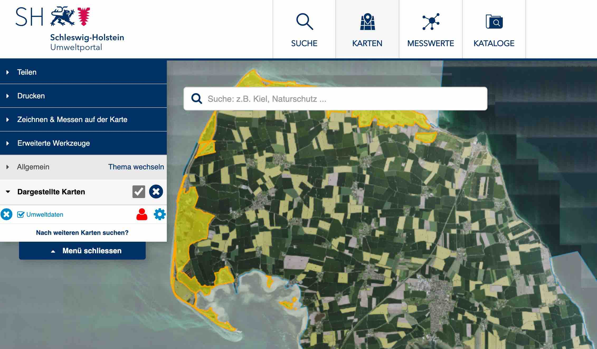
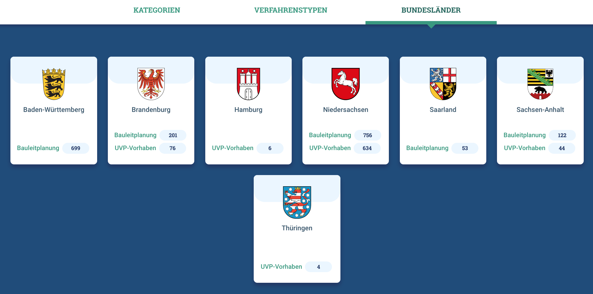
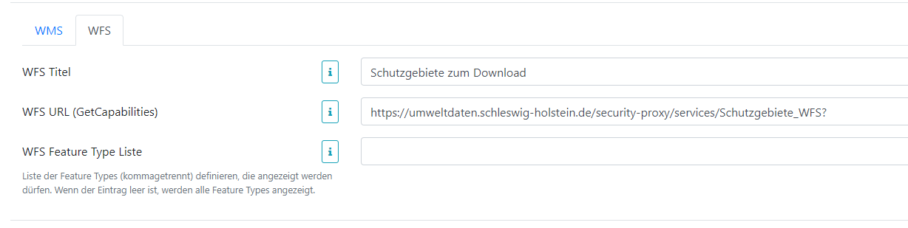
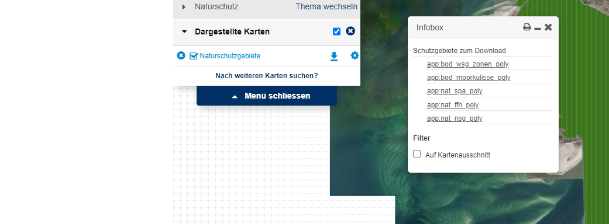
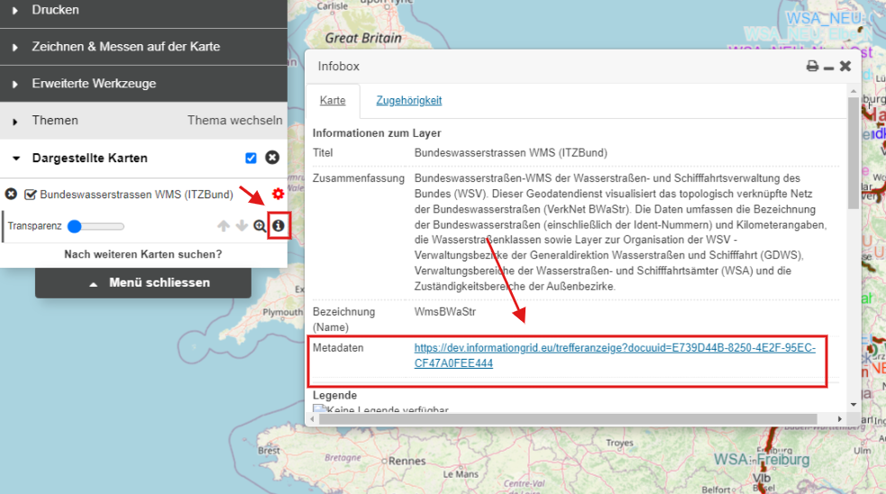
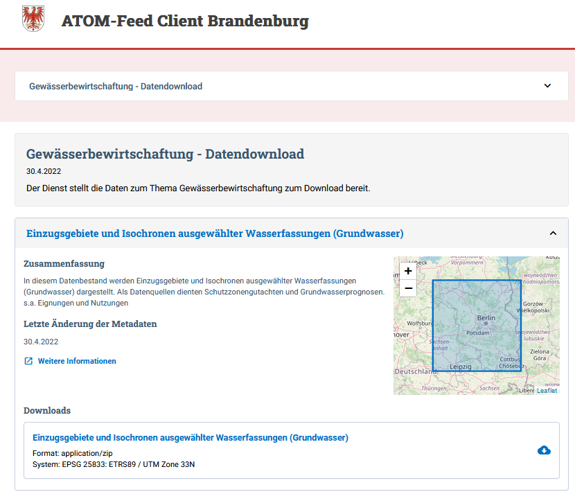
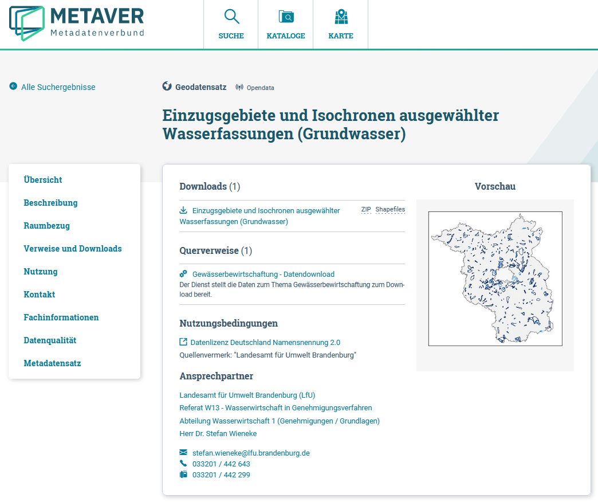
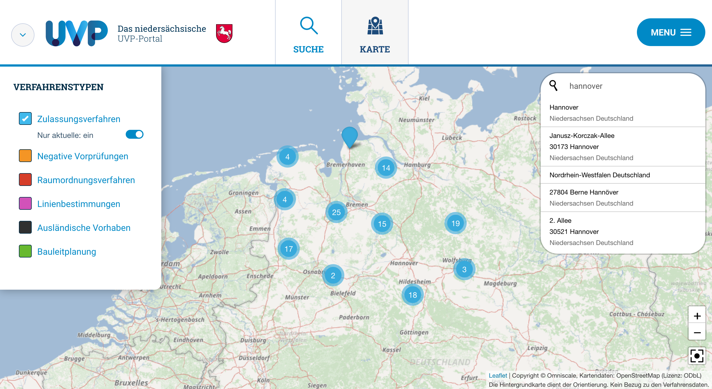

Diese Release Notes betreffen ausschließlich die Versionen 5.13.x. Release Notes älterer Versionen können hier eingesehen werden:
[5.12.x](/5.12.0/about/history.html), [5.11.x](/5.11.0/about/history.html), [5.10.x](/5.10.0/about/history.html), [5.9.x](/5.9.0/about/history.html), [5.8.x](/5.8.0/about/history.html), [5.7.x](/5.7.0/about/history.html), [5.6.x](/5.6.0/about/history.html), [5.5.x](/5.5.0/about/history.html), [5.4.x](/5.4.0/about/history.html), [5.3.x](/5.3.0/about/history.html), [5.2.x](/5.2.0/about/history.html), [5.1.x](/5.1.0/about/history.html), [5.0.x](/5.0.0/about/history.html)


## Version 5.13.1

Release 13.09.2022

### Wichtige Änderungen

#### Kartenclient: WFS Feature über individuelle Attribute hervorheben

Über individuelle Attribute können Features auf der Karte hervorgehoben und gezoomt werden ([REDMINE-4259](https://redmine.informationgrid.eu/issues/4259)).


<figcaption class="figcaption">Kartenclient: WFS Feature über individuelle Attribute hervorheben</figcaption>

#### UVP: Mehrfachauswahl bei der Suche und Anzeige der im letzten Jahr bearbeiteten Verfahren

Bei der Suche können jetzt mehrere Facetten gleichzeitig ausgewählt werden. Mit dem Umschalter "Nur aktuelle" können nur die im letzten Jahr bearbeiteten Verfahren angezeigt werden. ([REDMINE-3598](https://redmine.informationgrid.eu/issues/3598))


<figcaption class="figcaption">UVP: Mehrfachauswahl bei der Suche und Anzeige der im letzten Jahr bearbeiteten Verfahren</figcaption>


<figcaption class="figcaption">UVP: Anzeige der im letzten Jahr bearbeiteten Verfahren</figcaption>

#### UVP: Bundesländer auf der Startseite anzeigen

Auf der Startseite des UVP-Portals werden unter dem neuen Bereich "Bundesländer" die Wappen aller Bundesländer dargestellt. Dort werden pro Bundesland die Anzahl und Verlinkung auf alle im letzten Jahr bearbeiten Verfahren sowie den Verfahrenstyp "Bauleitplanung" angezeigt ([REDMINE-2515](https://redmine.informationgrid.eu/issues/2515)).


<figcaption class="figcaption">Wappen der Bundesländer auf der Startseite</figcaption>


### Liste der Änderungen

- [Feature] [PORTAL] Portal: geforderte Passwortkomplexität soll per Default erhöht werden ([REDMINE-1314](https://redmine.informationgrid.eu/issues/1314))
- [Bug] [MAPCLIENT] Fehler bei kombiniertem WMS-Layer ([REDMINE-4258](https://redmine.informationgrid.eu/issues/4258))
- [Bug] [PORTAL] Falsche Darstellung von geharvesteten Metadaten (Codelistübernahme) ([REDMINE-4176](https://redmine.informationgrid.eu/issues/4176))
- [Bug] [PORTAL] Reduzierung Link Länge bei CSW GEtRecords Requests ([REDMINE-4113](https://redmine.informationgrid.eu/issues/4113))

Profil NUMIS

- [Bug] [IPLUG-BLP] Nds. UVP-Portal: Anzeige BLP-Details "Mitgliedsgemeinden:" ([REDMINE-4070](https://redmine.informationgrid.eu/issues/4070))

Profil Umweltportal Schleswig-Holstein

- [Feature] [MAPCLIENT] WFS Feature über individuelle Attribute highlighten ([REDMINE-4259](https://redmine.informationgrid.eu/issues/4259))
- [Feature] [MAPCLIENT] Direkte Auswahl ("Highlighten") der Geometrie ([REDMINE-4114](https://redmine.informationgrid.eu/issues/4114))

Profil UVP

- [Feature] [PORTAL] UVP: Mehrfachauswahl (#3317) in UVP-Verbundportal umsetzen ([REDMINE-3598](https://redmine.informationgrid.eu/issues/3598))
- [Feature] [PORTAL] Bundesländer auf der Startseite anzeigen ([REDMINE-2515](https://redmine.informationgrid.eu/issues/2515))

### Komponenten

- PORTAL ([download](https://distributions.informationgrid.eu/ingrid-portal/5.13.1/))


## Version 5.13.0

Release 21.07.2022

### Hinweise für die Aktualisierung

#### Instanzen vom iPlug SE müssen migriert werden

Die der Suchmaschine zugrundeliegende Software NUTCH wurde auf eine komplett neue Version 1.18 gehoben.

**WICHTIG:**<br>
Existierende Instanzen im iPlug SE müssen wie folgt migriert werden (s. auch [REDMINE-132](https://redmine.informationgrid.eu/issues/132#note-46)).
- Erstellung einer neuen Instanz. Im `<instance>/conf` Verzeichnis auf dem Server sind dann alle Konfigurationsfiles vorhanden, die benötigt werden.
- Erstellen einer Kopie der alten Instanz in der Admin GUI
- Die kopierte Instanz muss dann auf dem Server mit den Konfigurationsfiles versorgt werden. Dazu werden die Dateien, **außer der Datei** `nutch-site.xml`, aus der neu erstellten Instanz in die kopierte Instanz übertragen.<br>
Beispiel: 
  ```
  # backup directory "instance_copy" 
  cd <PATH_TO_INSTANCE_DIR_OF_IPLUG_SE>/instance_new/conf/
  cp `ls | grep -v "nutch-site.xml"` <PATH_TO_INSTANCE_DIR_OF_IPLUG_SE>/instance_copy/conf/
  ```
- Löschen der neuen Instanz
- SE iPlug neu starten
- Die so migrierten Instanzen müssen neu aufgebaut werden (new crawl)
ACHTUNG:
Beim Crawl gibt es in Version 5.13.x noch ein Problem mit Redirects/Excludes s. [REDMINE-4262](https://redmine.informationgrid.eu/issues/4262#note-5).
Das Problem kann durch das Hinzufügen einer Option in der NUTCH Konfiguration der Instanz behoben werden:
  ```
  http.redirect.max = 1
  ```
Dadurch werden Redirects während des Crawls bis zu einer Tiefe von 1 aufgelöst.
Die Option wird in version 5.14.0 per Default für alle neuen Instanzen gesetzt.


Bei der Gelegenheit sollte überprüft werden, ob das Feld `plugin.includes` in der Konfiguration der Instanz auf dem folgenden Wert steht:

`protocol-httpclient|urlfilter-(regex|validator)|parse-(html|tika)|index-(basic|anchor|metadata|more)|ingrid-indexer-elastic|scoring-ingrid|ingrid-language-identifier|urlnormalizer-(pass|regex|basic)|analysis-de`

Dies behebt evtl. fehlende Beschreibungen unterhalb der Treffer, die aus diesem iPlug stammen.

### Kritische Änderungen

#### iPlug SE - Aktualisierung auf akt. NUTCH Version

Die der Suchmaschine zugrundeliegende Software NUTCH wurde auf eine komplett neue leistungsfähigere Version aktualisiert ([REDMINE-132](https://redmine.informationgrid.eu/issues/132)).<br>
**WICHTIG:**
Existierende Instanzen im iPlug SE müssen manuell migriert werden s.o. [Instanzen vom iPlug SE müssen migriert werden](#instanzen-vom-iplug-se-müssen-migriert-werden)

### Wichtige Änderungen

#### Kartenclient: Direkte Positionierung über BWaStr-Locator

Über Parameter des [Bundeswasserstraßen-Locators](https://www.gdws.wsv.bund.de/DE/service/karten/02_Geodatendienste_Geoanwendungen/02_geoanwendungen/BWaStr-Locator/BWaStr-Locator_node.html) kann nun direkt ein Punkt in der Karte gesetzt und die Karte positioniert werden ([REDMINE-3807](https://redmine.informationgrid.eu/issues/3807)).

Beispiel:<br>
- Positionierung im Demo-Kartenclient:<br> `BWaStr-Id: 0701 Elbe Hauptstrecke, Km-Wert: 200, Abstand: 20, Zoom: 16`<br>
https://dev.informationgrid.eu/kartendienste?bwaStrId=0701&bwaStrKm=200&bwaStrOffset=20&zoom=16

#### Kartenclient: Kopplung WMS Layer und WFS FeatureTypes mit Download-Möglichkeiten

Im Kartenclient kann im Admin-GUI nun eine Kopplung zwischen WMS Layer und WFS FeatureTypes eingerichtet werden, die dann im Kartenclient in der Karte herunter geladen werden können ([REDMINE-3585](https://redmine.informationgrid.eu/issues/3585)).


<figcaption class="figcaption">Mapclient: Kopplung WMS und WFS im Admin GUI</figcaption><br>


<figcaption class="figcaption">Mapclient: Download-Möglichkeiten der Features je FeatureType im Kartenclient</figcaption>

#### Kartenclient: Darstellung von Features eines WFS direkt via URL

Über Parameter in der URL können direkt alle Features eines FeatureTypes, auch mit Zoom auf ein bestimmtes Feature, in der Karte angezeigt werden ([REDMINE-4073](https://redmine.informationgrid.eu/issues/4073#note-4)).

Beispiel aus Demo Portal:
- Alle Features vom Typ `strassen_und_wegebrueckenanlagen` aus dem WFS der WSV in Karte anzeigen als Layer `Strassen_und_Wegebrueckenanlagen`<br>
https://dev.informationgrid.eu/kartendienste?layers=WFS||Strassen%20und%20Wegebr%C3%BCckenanlagen||https://via.bund.de/wsv/gst/wfs||strassen_und_wegebrueckenanlagen

- mit Zoom auf Feature `strassen_und_wegebrueckenanlagen.2560`<br>
https://dev.informationgrid.eu/kartendienste?layers=WFS||Strassen%20und%20Wegebr%C3%BCckenanlagen||https://via.bund.de/wsv/gst/wfs||strassen_und_wegebrueckenanlagen||strassen_und_wegebrueckenanlagen.2560

#### Kartenclient: Sprung zu Portal Metadaten aus Karten Layer

In der Admin-GUI kann nun eine Portal URL zu jedem Karten Layer eingepflegt werden.
Von der Info Box der Karte im Kartenclient kann dann direkt zu den Metadaten des Layers im Portal gesprungen werden ([REDMINE-4016](https://redmine.informationgrid.eu/issues/4016#note-1)).


<figcaption class="figcaption">Sprung zu Metadaten eines Karten Layers</figcaption>

#### ATOM Download Service: Update Layout, auch partnerspezifisch und direkte Verlinkung zu den Metadaten

Im Zuge der Neugestaltung der Portale (z.B. METAVER) wurde das Layout des ATOM Download Service (DLS) überarbeitet:
- Neutrales Layout, das mit verschiedenen Portalen funktioniert
- Berücksichtigung der landesspezifischen Darstellung
- Überarbeitung der Darstellung der Downloads

Anhand des geladenen Services wird ermittelt, welches Bundesland den Dienst bereitstellt. Das Layout wird daraufhin automatisch angepasst.
Der Link `Weitere Informationen` führt vom Feed direkt zu den Metadaten im Portal ([REDMINE-4087](https://redmine.informationgrid.eu/issues/4087), [REDMINE-3987](https://redmine.informationgrid.eu/issues/2498), [REDMINE-3987](https://redmine.informationgrid.eu/issues/3987)).




<figcaption class="figcaption">ATOM Download Service - Partnerspezifisches Layout und direkte Verlinkung zu den Metadaten</figcaption>

#### Export der Daten im DCAT-AP.DE Format über search Schnittstelle

Die Schnittstelle liefert zunächst DCAT-AP.DE 1.1 im RDF XML Format, da dieses Format auch in der Abbildung von ISO -> DCAT-AP.DE klar definiert ist.
Die Schnittstelle kann leicht um die DCAT-AP.DE 2.0 Spezifikation erweitert werden (URL Konzept).<br>
Die Daten sind filterbar, also z.B. nur Daten aus speziellen Katalogen. Der RDF-Export kann über den Parameter format=rdf angesteuert werden.
Details s. [REDMINE-3632](https://redmine.informationgrid.eu/issues/3632#note-10).

Beispiel aus NI: [Export DCAT-AP.de RDF in NI](https://numis.niedersachsen.de/search/opensearch/query?format=rdf)

#### Ortssuche in der Karte des UVP-Portals auf Basis von Nominatim

In der Karte wurde eine Ortssuche basierend auf Nominatim hinzugefügt. ([REDMINE-3621](https://redmine.informationgrid.eu/issues/3621))


<figcaption class="figcaption">Ortssuche in der Karte des niedersächsischen UVP-Portals auf Basis von Nominatim</figcaption>

#### UVP: Entfernen verwaister ZIP Uploads vom Server

Nicht mehr benötigte Zip-Dateien (z.B. nach Löschung der jeweiligen Vorhaben) werden nun vom Server gelöscht.
Zeitliches Verhalten und Quotas (Dateigröße) können eingestellt werden ([REDMINE-3456](https://redmine.informationgrid.eu/issues/3456#note-6)).

### Liste der Änderungen

BAW MIS

- [Feature] [IPLUG_IGE] IGE: IGE-Formular für Software anpassen ([REDMINE-2771](https://redmine.informationgrid.eu/issues/2771))
- [Feature] [IPLUG_IGE] IGE: IGE-Formular für Messdaten anpassen ([REDMINE-2770](https://redmine.informationgrid.eu/issues/2770))
- [Bug] [PORTAL] Portal: Umlaute werden auf der Benutzerverwaltung-Seite nicht richtig angezeigt ([REDMINE-3339](https://redmine.informationgrid.eu/issues/3339))

BKG

- [Feature] [CODELIST_REPO] Codelist-Repo: Codeliste 10003 und 10004 editieren ([REDMINE-3418](https://redmine.informationgrid.eu/issues/3418))
- [Bug] [PORTAL] Portal BKG-MIS: Anzeige der Nutzungsbedingungen - Freitexteintrag ([REDMINE-3917](https://redmine.informationgrid.eu/issues/3917))
- [Bug] [PORTAL] Portal BKG-MIS: Anzeige der Nutzungsbedingungen in der erweiterten Suchergebnis-Anzeige unvollständig ([REDMINE-3680](https://redmine.informationgrid.eu/issues/3680))
- [Bug] [PORTAL] Portal: erweiterte Suchergebnisse - vollständige Linkliste erst nach Aufruf anzeigen ([REDMINE-4044](https://redmine.informationgrid.eu/issues/4044))

Hamburger Metadaten Katalog

- [Feature] [PORTAL] ReDesign Hamburger Metadatenkatalog (HMDK) ([REDMINE-3239](https://redmine.informationgrid.eu/issues/3239))

InGrid

- [Feature] [MAPCLIENT] Mapclient - Positionierung über Request an BWaStr-Locator ([REDMINE-3807](https://redmine.informationgrid.eu/issues/3807))
- [Feature] [INTERFACE-SEARCH] Update Layout für ATOM Download Service: Verlinkung zum Portal ([REDMINE-4087](https://redmine.informationgrid.eu/issues/4087))
- [Feature] [INTERFACE-SEARCH] Update Layout für ATOM Download Service: autom. partner-spez. Layouterstellung ([REDMINE-3987](https://redmine.informationgrid.eu/issues/3987))
- [Feature] [INTERFACE-SEARCH] Erweiterung der search Schnittstelle um einen Endpoint für DCAT-AP.DE Daten ([REDMINE-3632](https://redmine.informationgrid.eu/issues/3632))
- [Feature] [INTERFACE-SEARCH] Update Layout für ATOM Download Service ([REDMINE-2498](https://redmine.informationgrid.eu/issues/2498))
- [Feature] [IPLUG-SE] BLP Bereich aus dem iPlug-SE entfernen ([REDMINE-3445](https://redmine.informationgrid.eu/issues/3445))
- [Feature] [IPLUG-SE] iPlug SE: Aktualisierung auf akt. NUTCH Version ([REDMINE-132](https://redmine.informationgrid.eu/issues/132))
- [Feature] [PORTAL] Änderung von ATOM Download Link zu ATOM Download Client Link in der Detaildarstellung ([REDMINE-3363](https://redmine.informationgrid.eu/issues/3363))
- [Feature] [PORTAL] Verbesserung der Barrierefreiheit des Portals - Restarbeiten ([REDMINE-2591](https://redmine.informationgrid.eu/issues/2591))
- [Feature] [PORTAL] Übernahme des neuen Layouts auf der Projekt-/Demoseite https://dev.informationgrid.eu/ ([REDMINE-2293](https://redmine.informationgrid.eu/issues/2293))
- [Bug] [PORTAL] Portal: Unstimmigkeiten bei der Validierung von Benutzername ([REDMINE-3865](https://redmine.informationgrid.eu/issues/3865))
- [Bug] [PORTAL] Portal: Menü-Button wird durch langen Usernamen blockiert ([REDMINE-3823](https://redmine.informationgrid.eu/issues/3823))
- [Bug] [IBUS] Filtern von iPlugs funktioniert nicht korrekt ([REDMINE-4027](https://redmine.informationgrid.eu/issues/4027))
- [Bug] [IBUS] Keine Ergebnisse trotz korrekter Indizierung ([REDMINE-3797](https://redmine.informationgrid.eu/issues/3797))
- [Bug] [IGE] Einfügen eines Trenners in der Beschreibung des ISOs ([REDMINE-3759](https://redmine.informationgrid.eu/issues/3759))
- [Bug] [IPLUG_IGE] Erstellung ISO Abbildung, Umgang mit parentIdentifier ([REDMINE-3491](https://redmine.informationgrid.eu/issues/3491))
- [Bug] [IPLUG_IGE] IGE: wenn MD-Sprache englisch, dann müssen Thesaurus-Schlagworte und ISO-Themenkategorie in Englisch in ISO-XML und Portal ausgegeben werden ([REDMINE-3463](https://redmine.informationgrid.eu/issues/3463))

InGrid Installation Schleswig-Holstein

- [Feature] [PORTAL] Profil-Switch-Link soll deaktiviert werden ([REDMINE-3829](https://redmine.informationgrid.eu/issues/3829))
- [Feature] [MAPCLIENT] Kopplung WMS Layer und WFS Featuretype, Download-Möglichkeiten ([REDMINE-3585](https://redmine.informationgrid.eu/issues/3585))
- [Feature] [MAPCLIENT] FFH-Gebiete, Sprung zur Geometrie in der Karte ermöglichen ([REDMINE-4073](https://redmine.informationgrid.eu/issues/4073))
- [Feature] [MAPCLIENT] Konfiguration der Infobox der einzelnen Layer ([REDMINE-4016](https://redmine.informationgrid.eu/issues/4016))

MetaVer

- [Support] [PORTAL] HB - Vorschaubild austauschen: inkl. Bremerhaven ([REDMINE-3907](https://redmine.informationgrid.eu/issues/3907))

UVP

- [Feature] [PORTAL] Metadaten im UVP-Portal für Suchmaschinen und für Nutzer optimieren ([REDMINE-3635](https://redmine.informationgrid.eu/issues/3635))
- [Feature] [PORTAL] Ortssuche in der Karte des UVP-Portals auf Basis von NOMINATIM ([REDMINE-3621](https://redmine.informationgrid.eu/issues/3621))
- [Feature] [PORTAL] Optimierung Sammeldownload-Funktionalität ([REDMINE-3456](https://redmine.informationgrid.eu/issues/3456))
- [Feature] [CODELIST_REPO] Erweiterung der UVP-Nummern Bayern um weitere Nummern ([REDMINE-3776](https://redmine.informationgrid.eu/issues/3776))
- [Feature] [CODELIST_REPO] Erweiterung der UVP Nummer Codelisten ([REDMINE-3756](https://redmine.informationgrid.eu/issues/3756))
- [Bug] [PORTAL] UVP: Mehrfachauswahl unter Facetten "Verfahrenstypen" und "Kategorien" Korrektur ([REDMINE-3788](https://redmine.informationgrid.eu/issues/3788))
- [Bug] [PORTAL] UVP: ZIP-Download größer als 2GB werden nicht korrekt heruntergeladen ([REDMINE-3779](https://redmine.informationgrid.eu/issues/3779))
- [Bug] [IPLUG_IGE] Upload wird unter falscher UUID abgelegt ([REDMINE-3965](https://redmine.informationgrid.eu/issues/3965))
- [Bug] [IPLUG_IGE] Ausländisches Verfahren wird unter "Verfahren" angelegt ([REDMINE-2487](https://redmine.informationgrid.eu/issues/2487))

### Komponenten

- IBUS ([download](https://distributions.informationgrid.eu/ingrid-ibus/5.13.0/))
- IPLUG-BLP ([download](https://distributions.informationgrid.eu/ingrid-iplug-blp/5.13.0/))
- CODELIST-REPOSITORY ([download](https://distributions.informationgrid.eu/ingrid-codelist-repository/5.13.0/))
- IPLUG-WFS-DSC ([download](https://distributions.informationgrid.eu/ingrid-iplug-wfs-dsc/5.13.0/))
- IPLUG-SE ([download](https://distributions.informationgrid.eu/ingrid-iplug-se/5.13.0/))
- INTERFACE-SEARCH ([download](https://distributions.informationgrid.eu/ingrid-interface-search/5.13.0/))
- INTERFACE-CSW ([download](https://distributions.informationgrid.eu/ingrid-interface-csw/5.13.0/))
- PORTAL ([download](https://distributions.informationgrid.eu/ingrid-portal/5.13.0/))
- IPLUG-IGE ([download](https://distributions.informationgrid.eu/ingrid-iplug-ige/5.13.0/))
