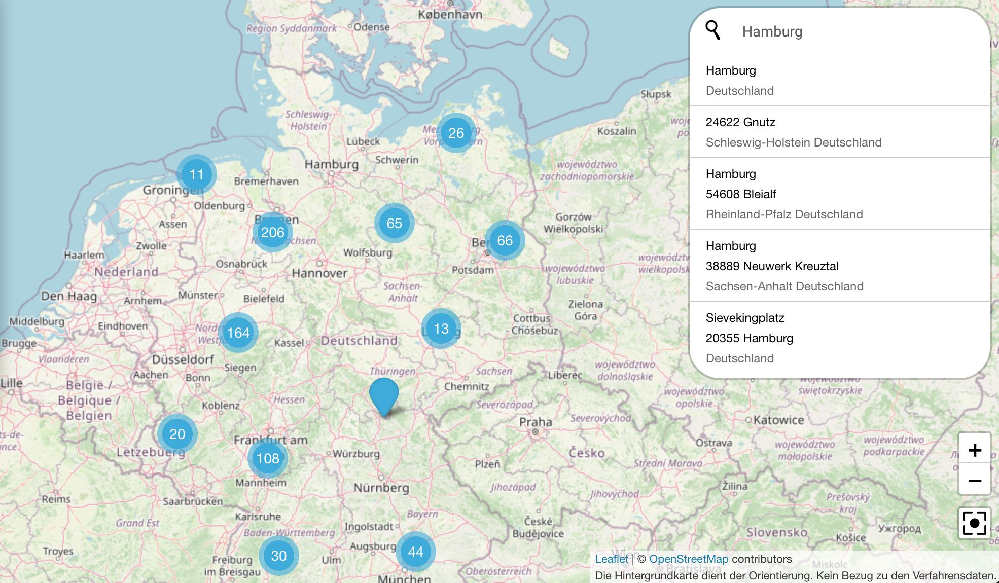
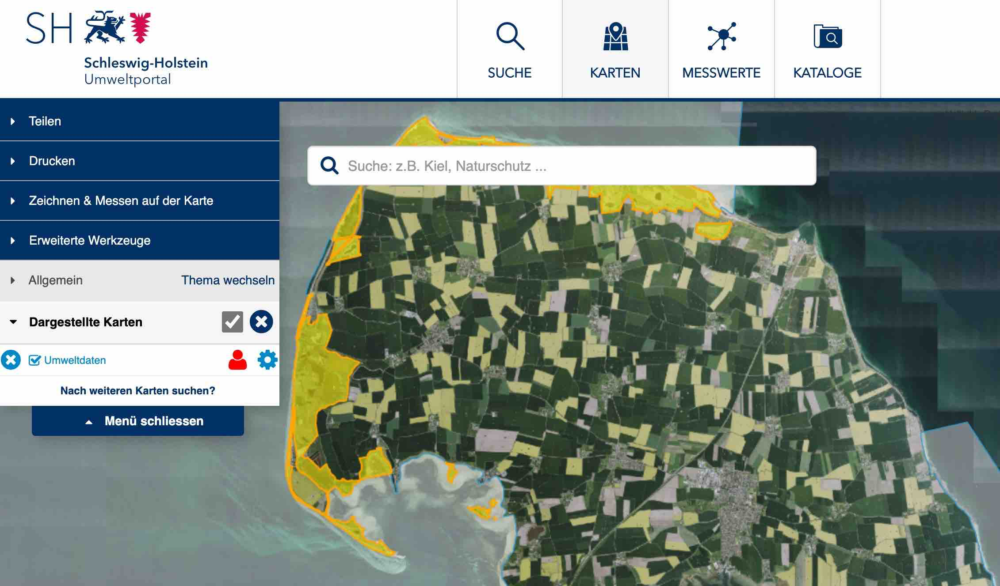
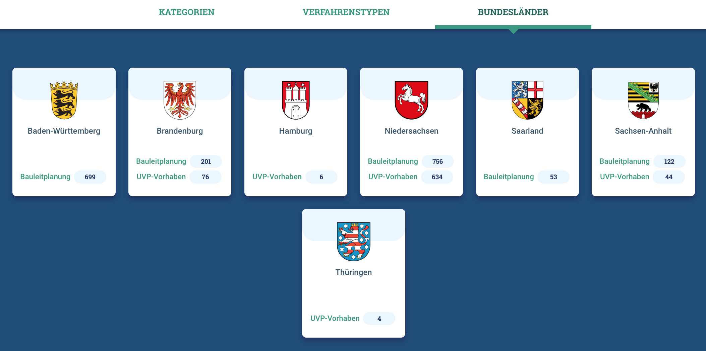

Diese Release Notes betreffen ausschließlich die Versionen 5.14.x. Release Notes älterer Versionen können hier eingesehen werden:
[5.13.x](/5.13.0/about/history.html), [5.12.x](/5.12.0/about/history.html), [5.11.x](/5.11.0/about/history.html), [5.10.x](/5.10.0/about/history.html), [5.9.x](/5.9.0/about/history.html), [5.8.x](/5.8.0/about/history.html), [5.7.x](/5.7.0/about/history.html), [5.6.x](/5.6.0/about/history.html), [5.5.x](/5.5.0/about/history.html), [5.4.x](/5.4.0/about/history.html), [5.3.x](/5.3.0/about/history.html), [5.2.x](/5.2.0/about/history.html), [5.1.x](/5.1.0/about/history.html), [5.0.x](/5.0.0/about/history.html)


## Version 5.14.4

Release 16.01.2023

### Wichtige Änderungen

#### MetaVer und UVP: Nutzung von OSM und der Nominatim-Suche

Für die Profile MetaVer und UVP wird jetzt als Hintergrundkarte und als Karte in den Raumbezügen OpenStreetMap (OSM) verwendet. Für UVP ist die Nominatim-Suche aktiviert.


<figcaption class="figcaption">UVP Karte: Nominatim-Suche</figcaption>

([REDMINE-4366](https://redmine.informationgrid.eu/issues/4634))

### Liste der Änderungen

- [Feature] [IGE] AdV-Checkbox nur in Objektarten Geodatendienst, Geodatensatz und Anwendung sichtbar machen ([REDMINE-3104](https://redmine.informationgrid.eu/issues/3104))
- [Bug] [IGE] MD zu CSW-Geodatendiensten: GetCapabilities-Verweis wird im MD doppelt angelegt ([REDMINE-4260](https://redmine.informationgrid.eu/issues/4260))

Profil LUBW

- [Feature] [IGE] OAC fehlt in (manchen) Metadatensätzen ([REDMINE-4615](https://redmine.informationgrid.eu/issues/4615))
- [Feature] [PORTAL] Hilfetexte im Portal austauschen ([REDMINE-4607](https://redmine.informationgrid.eu/issues/4607))
- [Feature] [MAPCLIENT] Automatische URL im Kartendruck ersetzen ([REDMINE-4603](https://redmine.informationgrid.eu/issues/4603))
- [Feature] [PORTAL] Deutschlandkarte verkleinern, ersetzen oder entfernen ([REDMINE-4598](https://redmine.informationgrid.eu/issues/4598))
- [Bug] [IGE] Falsche Platzierung von environmentDescription im Export ISO ([REDMINE-4622](https://redmine.informationgrid.eu/issues/4622))

Profil UPSH

- [Feature] [PORTAL] Button "Registrieren" ausblenden ([REDMINE-4626](https://redmine.informationgrid.eu/issues/4626))

Profil UVP

- [Feature] [MAPCLIENT] Nutzung OSM inkl. Nominatim im UVP-Portal ([REDMINE-4634](https://redmine.informationgrid.eu/issues/4634))
- [Feature] [PORTAL] Änderung Text auf länderspezifischen Seiten ([REDMINE-4072](https://redmine.informationgrid.eu/issues/4072))

### Komponenten

- IPLUG-IGE ([download](https://distributions.informationgrid.eu/ingrid-iplug-ige/5.14.4/))
- PORTAL ([download](https://distributions.informationgrid.eu/ingrid-portal/5.14.4/))


## Version 5.14.3

Release 07.12.2022

### Hinweise für die Aktualisierung

**Für den Betrieb der Komponente iPLug SE außerhalb von Docker Containern wird mind. JAVA 11 benötigt.**

#### Instanzen vom iPlug SE müssen migriert werden

Die der Suchmaschine zugrundeliegende Software NUTCH wurde auf eine komplett neue Version 1.19 gehoben.

**WICHTIG:**<br>
Existierende Instanzen im iPlug SE müssen wie folgt migriert werden (s. auch [REDMINE-132](https://redmine.informationgrid.eu/issues/132#note-46)).
- Erstellung einer neuen Instanz. Im `<instance>/conf` Verzeichnis auf dem Server sind dann alle Konfigurationsfiles vorhanden, die benötigt werden.
- Erstellen einer Kopie der alten Instanz in der Admin GUI
- Die kopierte Instanz muss dann auf dem Server mit den Konfigurationsfiles versorgt werden. Dazu werden die Dateien, **außer der Datei** `nutch-site.xml`, aus der neu erstellten Instanz in die kopierte Instanz übertragen.<br>
Beispiel: 
  ```
  # backup directory "instance_copy" 
  cd <PATH_TO_INSTANCE_DIR_OF_IPLUG_SE>/instance_new/conf/
  cp `ls | grep -v "nutch-site.xml"` <PATH_TO_INSTANCE_DIR_OF_IPLUG_SE>/instance_copy/conf/
  ```
- Löschen der neuen Instanz
- SE iPlug neu starten
- Die so migrierten Instanzen müssen neu aufgebaut werden (new crawl)
ACHTUNG:
Beim Crawl gibt es in Version 5.13.x noch ein Problem mit Redirects/Excludes s. [REDMINE-4262](https://redmine.informationgrid.eu/issues/4262#note-5).
Das Problem kann durch das Hinzufügen einer Option in der NUTCH Konfiguration der Instanz behoben werden:
  ```
  http.redirect.max = 5
  ```
Dadurch werden Redirects während des Crawls bis zu einer Tiefe von 5 aufgelöst.
Die Option wird in version 5.14.0 per Default für alle neuen Instanzen gesetzt.


Bei der Gelegenheit sollte überprüft werden, ob das Feld `plugin.includes` in der Konfiguration der Instanz auf dem folgenden Wert steht:

`protocol-httpclient|urlfilter-(regex|validator)|parse-(html|tika)|index-(basic|anchor|metadata|more)|ingrid-indexer-elastic|scoring-ingrid|ingrid-language-identifier|urlnormalizer-(pass|regex|basic)|analysis-de`

Dies behebt evtl. fehlende Beschreibungen unterhalb der Treffer, die aus diesem iPlug stammen.

### Liste der Änderungen

- [Feature] [IPLUG-SE] SE iPlug - Upgrade NUTCH auf 1.19 ([REDMINE-4489](https://redmine.informationgrid.eu/issues/4489))

Profil LUBW

- [Feature] [IPLUG-IGE] Metadatentransformation und -migration ([REDMINE-4008](https://redmine.informationgrid.eu/issues/4008))
- [Feature] [PORTAL] Überarbeitung der "Hilfe" ([REDMINE-4583](https://redmine.informationgrid.eu/issues/4583))
- [Feature] [PORTAL] Zugriffsbeschränkungen - Angabe in MD ergänzen, Darstellung im Portal ([REDMINE-4576](https://redmine.informationgrid.eu/issues/4576))
- [Feature] [PORTAL] Inhaltliche Anpassungen ([REDMINE-4371](https://redmine.informationgrid.eu/issues/4371))

Profil MetaVer

- [Feature] [PORTAL] Verbesserung Startseite MetaVer - Feld für Wartungsarbeiten einfügen ([REDMINE-4421](https://redmine.informationgrid.eu/issues/4421))

### Komponenten

- CODELIST-REPOSITORY ([download](https://distributions.informationgrid.eu/ingrid-codelist-repository/5.14.3/))
- IPLUG-IGE ([download](https://distributions.informationgrid.eu/ingrid-iplug-ige/5.14.3/))
- IPLUG-SE ([download](https://distributions.informationgrid.eu/ingrid-iplug-se/5.14.3/))
- PORTAL ([download](https://distributions.informationgrid.eu/ingrid-portal/5.14.3/))


## Version 5.14.2

Release 24.11.2022

### Wichtige Änderung

#### Geometrie-Kontext-Attribute werden im Portal angezeigt

Für das Profil Umweltportal Schleswig-Holstein werden jetzt die Geometrie-Kontext-Attribute in der Detail-Ansicht im Portal angezeigt. ([REDMINE-4366](https://redmine.informationgrid.eu/issues/4366)).


<figcaption class="figcaption">Portal: Geometrie-Kontext-Attribute werden im Portal angezeigt</figcaption>

### Liste der Änderungen

- [Bug] [PORTAL] Neustart des Docker-Container verursacht Löschung von Einstellung ([REDMINE-4502](https://redmine.informationgrid.eu/issues/4502))
- [Bug] [PORTAL] MVIS-Client ausschließen von Messnetze ([REDMINE-4573](https://redmine.informationgrid.eu/issues/4573))
- [Bug] [PORTAL] Anpassung Position Regionalschlüssel ([REDMINE-4542](https://redmine.informationgrid.eu/issues/4542))

Profil BKG

- [Feature] [PORTAL] Bezeichnung "Objekt-ID" ersetzen ([REDMINE-4465](https://redmine.informationgrid.eu/issues/4465))
- [Feature] [PORTAL] Label "Datensatz / Datenserie" ändern ([REDMINE-4236](https://redmine.informationgrid.eu/issues/4236))

Profil LUBW

- [Feature] [IGE] Feld für Erfassung des OAC im IGE einfügen ([REDMINE-4378](https://redmine.informationgrid.eu/issues/4378))
- [Feature] [PORTAL] Profilerstellung - Anpassung Metadatenmodell, Transformationsvorschriften ([REDMINE-4004](https://redmine.informationgrid.eu/issues/4004))

Profil NUMIS

- [Feature] [PORTAL] Ministeriumsname aktualisieren ([REDMINE-4498](https://redmine.informationgrid.eu/issues/4498))
- [Feature] [PORTAL] UVP, Portal: Menüeintrag verkürzen ([REDMINE-4495](https://redmine.informationgrid.eu/issues/4495))
- [Feature] [PORTAL] Log-in niedersächsischer UVP Editor (IGE-NG) ([REDMINE-4337](https://redmine.informationgrid.eu/issues/4337))

Profil RLP

- [Feature] [PORTAL] Deaktivierung von Facetten in der Suche ([REDMINE-4552](https://redmine.informationgrid.eu/issues/4552))

Profil Umweltportal Schleswig-Holstein

- [Feature] [MAPCLIENT] Barrierefreiheit Karten (Einbetten) ([REDMINE-4306](https://redmine.informationgrid.eu/issues/4306))
- [Feature] [PORTAL] Geometriekontext-Attribute im UP sichtbar machen ([REDMINE-4366](https://redmine.informationgrid.eu/issues/4366))


### Komponenten

- IPLUG-IGE ([download](https://distributions.informationgrid.eu/ingrid-iplug-ige/5.14.2/))
- PORTAL ([download](https://distributions.informationgrid.eu/ingrid-portal/5.14.2/))


## Version 5.14.1

Release 09.11.2022

### Wichtige Änderungen

#### Neuer Bereich "API"

Für das Profil NUMIS wurde ein neuer Bereich "API" erstellt. Dort sollen die [Programmierschnittstellen](https://de.wikipedia.org/wiki/Programmierschnittstelle) des niedersächsischen Umweltportals dokumentiert werden.
Vorlage ist [bund.dev](https://bund.dev) ([REDMINE-4374](https://redmine.informationgrid.eu/issues/4374)).


<figcaption class="figcaption">Portal: Neuer Bereich "API" im Profil NUMIS - Ansicht Portal Enduser</figcaption>


<figcaption class="figcaption">Portal: Neuer Bereich "API" im Profil NUMIS - Ansicht Portal Inhalte administrieren</figcaption>

#### Bibliografische Angaben

Im Profil des BAW MIS werden jetzt in der Detail-Ansicht auch bibliografische Angaben angezeigt ([REDMINE-4351](https://redmine.informationgrid.eu/issues/4351)).


<figcaption class="figcaption">Portal: Bibliografische Angaben in der Detail-Ansicht</figcaption>


<figcaption class="figcaption">IGE: Bibliografische Angaben in der Detail-Ansicht</figcaption>

### Liste der Änderungen

- [Feature] [IGE] Regionalschlüssel erfassen - Minimallösung ([REDMINE-3928](https://redmine.informationgrid.eu/issues/3928))
- [Feature] [INTERFACE-SEARCH] Atom-Feed Client - Lösung für ST ([REDMINE-2400](https://redmine.informationgrid.eu/issues/2400))
- [Feature] [MAPCLIENT] Admin-GUI - Einbindung WMTS mit anderer Projektion ([REDMINE-4479](https://redmine.informationgrid.eu/issues/4479))
- [Feature] [PORTAL] Entfernen von IGE-Applikation bei Installation über Docker ([REDMINE-4447](https://redmine.informationgrid.eu/issues/4447))
- [Feature] [PORTAL] Portalanzeige Koordinatensysteme ([REDMINE-4486](https://redmine.informationgrid.eu/issues/4486))
- [Bug] [IGE] Regression von Metadaten-Import ([REDMINE-4340](https://redmine.informationgrid.eu/issues/4340))
- [Bug] [IGE-NG] Probleme beim Verschieben von Dokumenten mit "gültig-bis" Daten ([REDMINE-4363](https://redmine.informationgrid.eu/issues/4363))

Profil BAW MIS

- [Feature] [PORTAL] Bibliografische Angaben auch im baw_mis Profil implementieren ([REDMINE-4351](https://redmine.informationgrid.eu/issues/4351))
- [Feature] [PORTAL] Anpassungen in den Detail- und Suchtreffer-Ansichten ([REDMINE-4167](https://redmine.informationgrid.eu/issues/4167))

Profil BKG

- [Bug] [PORTAL] Fehler in BKG-MIS-Release 5.14.0 ([REDMINE-4460](https://redmine.informationgrid.eu/issues/4460))
- [Bug] [PORTAL] Fehler in BKG-MIS-Release 5.13.1 ([REDMINE-4345](https://redmine.informationgrid.eu/issues/4345))

Profil LUBW

- [Feature] [MAPCLIENT] Direkte Anzeige, wenn nur ein Layer im WMS existiert ([REDMINE-4376](https://redmine.informationgrid.eu/issues/4376))

Profil RLP

- [Feature] [PORTAL] Layouts anpassen für die Suchergebnisseite und die Detaildarstellung im RLP-Profil ([REDMINE-3631](https://redmine.informationgrid.eu/issues/3631))

Profil MetaVer

- [Feature] [MAPCLIENT] Kartenclient METAVER - Webatlas farbe/grau ersetzen durch basemap.de Web Raster farbe/grau ([REDMINE-4230](https://redmine.informationgrid.eu/issues/4230))

Profil NUMIS

- [Feature] [PORTAL] Erstellung neuer Bereich "APIs" ([REDMINE-4374](https://redmine.informationgrid.eu/issues/4374))

Profil UVP

- [Feature] [PORTAL] UVP: Darstellung des Bundeslandes oder des Landkreises in dem das Vorhaben erfolgt ([REDMINE-1806](https://redmine.informationgrid.eu/issues/1806))

### Komponenten

- INTERFACE-CSW ([download](https://distributions.informationgrid.eu/ingrid-interface-csw/5.14.1/))
- PORTAL ([download](https://distributions.informationgrid.eu/ingrid-portal/5.14.1/))
- IPLUG-IGE ([download](https://distributions.informationgrid.eu/ingrid-iplug-ige/5.14.1/))


## Version 5.14.0

Release 04.10.2022

### Wichtige Änderungen

#### Kartenclient: WFS Feature über individuelle Attribute hervorheben

Über individuelle Attribute können Features auf der Karte hervorgehoben und gezoomt werden ([REDMINE-4259](https://redmine.informationgrid.eu/issues/4259)).


<figcaption class="figcaption">Kartenclient: WFS Feature über individuelle Attribute hervorheben</figcaption>

#### UVP: Mehrfachauswahl bei der Suche und Anzeige der im letzten Jahr bearbeiteten Verfahren

Bei der Suche können jetzt mehrere Facetten gleichzeitig ausgewählt werden. Mit dem Umschalter "Nur aktuelle" können nur die im letzten Jahr bearbeiteten Verfahren angezeigt werden. ([REDMINE-3598](https://redmine.informationgrid.eu/issues/3598))


<figcaption class="figcaption">UVP: Mehrfachauswahl bei der Suche und Anzeige der im letzten Jahr bearbeiteten Verfahren</figcaption>


<figcaption class="figcaption">UVP: Anzeige der im letzten Jahr bearbeiteten Verfahren</figcaption>

#### UVP: Bundesländer auf der Startseite anzeigen

Auf der Startseite des UVP-Portals werden unter dem neuen Bereich "Bundesländer" die Wappen aller Bundesländer dargestellt. Dort werden pro Bundesland die Anzahl und Verlinkung auf alle im letzten Jahr bearbeiten Verfahren sowie den Verfahrenstyp "Bauleitplanung" angezeigt ([REDMINE-2515](https://redmine.informationgrid.eu/issues/2515)).


<figcaption class="figcaption">Wappen der Bundesländer auf der Startseite</figcaption>

### Liste der Änderungen

- [Feature] [CODELIST REPOSITORY] Codelist 520 um Eintrag "HDD" erweitern ([REDMINE-4115](https://redmine.informationgrid.eu/issues/4115))
- [Feature] [IGE] KVP- und RESTful-Capabilities-URL unterscheiden ([REDMINE-3369](https://redmine.informationgrid.eu/issues/3369))
- [Feature] [IPLUG_IGE] Checkbox "Open Data" für HMDK überarbeiten ([REDMINE-3413](https://redmine.informationgrid.eu/issues/3413))
- [Feature] [MAPCLIENT] Verbesserung der Absicherung der Formular-Aktionen im MapClient ([REDMINE-4270](https://redmine.informationgrid.eu/issues/4270))
- [Feature] [PORTAL] Geforderte Passwortkomplexität soll per Default erhöht werden ([REDMINE-1314](https://redmine.informationgrid.eu/issues/1314))
- [Bug] [IBUS] iBus-Suche: Details von SE-Treffer nicht aufrufbar ([REDMINE-3129](https://redmine.informationgrid.eu/issues/3129))
- [Bug] [IGE] Feld "Durch die Ressource abgedeckte Zeitspanne" zeigt Fehlermeldung ([REDMINE-3962](https://redmine.informationgrid.eu/issues/3962))
- [Bug] [IPLUG-SE] Crawl Bug bei Redirects / Excludes ([REDMINE-4262](https://redmine.informationgrid.eu/issues/4262))
- [Bug] [IPLUG-SE] IPlugSEPostCrawlProcessor schlägt fehl, wenn iPlug über iBus an Elasticsearch index angeschlossen ist ([REDMINE-1749](https://redmine.informationgrid.eu/issues/1749))
- [Bug] [MAPCLIENT] Fehler bei kombiniertem WMS-Layer ([REDMINE-4258](https://redmine.informationgrid.eu/issues/4258))
- [Bug] [PORTAL] Falsche Darstellung von geharvesteten Metadaten (Codelistübernahme) ([REDMINE-4176](https://redmine.informationgrid.eu/issues/4176))
- [Bug] [PORTAL] Reduzierung Link Länge bei CSW GEtRecords Requests ([REDMINE-4113](https://redmine.informationgrid.eu/issues/4113))

Profil BAW Datenrepository

- [Feature] [IGE] Literatur Objektklasse nochmal aktivieren ([REDMINE-2326](https://redmine.informationgrid.eu/issues/2326))

Profil BAW MIS

- [Feature] [IGE] UUID für neue Kontakte selbst festlegen ([REDMINE-3725](https://redmine.informationgrid.eu/issues/3725))
- [Feature] [IGE] DOI-Felder sollen nicht alle Nutzer bearbeiten können ([REDMINE-3599](https://redmine.informationgrid.eu/issues/3599))
- [Bug] [PORTAL] Wenn ein Objekt eine DOI hat, wird im Teaser in der Detailansicht statt Auftragsnummer die DOI angezeigt ([REDMINE-4266](https://redmine.informationgrid.eu/issues/4266))

Profil BKG

- [Feature] [IGE] WMTS - getCapabilities-Assistent und ISO-Abbildung ([REDMINE-3651](https://redmine.informationgrid.eu/issues/3651))

Profil NUMIS

- [Bug] [IPLUG-BLP] Nds. UVP-Portal: Anzeige BLP-Details "Mitgliedsgemeinden:" ([REDMINE-4070](https://redmine.informationgrid.eu/issues/4070))

Profil Umweltportal Schleswig-Holstein

- [Feature] [MAPCLIENT] WFS Feature über individuelle Attribute highlighten ([REDMINE-4259](https://redmine.informationgrid.eu/issues/4259))
- [Feature] [MAPCLIENT] Direkte Auswahl ("Highlighten") der Geometrie ([REDMINE-4114](https://redmine.informationgrid.eu/issues/4114))

Profil UVP

- [Feature] [PORTAL] Mehrfachauswahl (#3317) in UVP-Verbundportal umsetzen ([REDMINE-3598](https://redmine.informationgrid.eu/issues/3598))
- [Feature] [PORTAL] Bundesländer auf der Startseite anzeigen ([REDMINE-2515](https://redmine.informationgrid.eu/issues/2515))


### Komponenten

- CODELIST-REPOSITORY ([download](https://distributions.informationgrid.eu/ingrid-codelist-repository/5.14.0/))
- IBUS ([download](https://distributions.informationgrid.eu/ingrid-ibus/5.14.0/))
- INTERFACE-CSW ([download](https://distributions.informationgrid.eu/ingrid-interface-csw/5.14.0/))
- INTERFACE-SEARCH ([download](https://distributions.informationgrid.eu/ingrid-interface-search/5.14.0/))
- IPLUG-BLP ([download](https://distributions.informationgrid.eu/ingrid-iplug-blp/5.14.0/))
- IPLUG-CSW-DSC ([download](https://distributions.informationgrid.eu/ingrid-iplug-csw-dsc/5.14.0/))
- IPLUG-DSC ([download](https://distributions.informationgrid.eu/ingrid-iplug-dsc/5.14.0/))
- IPLUG-EXCEL ([download](https://distributions.informationgrid.eu/ingrid-iplug-excel/5.14.0/))
- IPLUG-IGE ([download](https://distributions.informationgrid.eu/ingrid-iplug-ige/5.14.0/))
- IPLUG-OPENSEARCH ([download](https://distributions.informationgrid.eu/ingrid-iplug-opensearch/5.14.0/))
- IPLUG-SE ([download](https://distributions.informationgrid.eu/ingrid-iplug-se/5.14.0/))
- IPLUG-SNS ([download](https://distributions.informationgrid.eu/ingrid-iplug-sns/5.14.0/))
- IPLUG-WFS-DSC ([download](https://distributions.informationgrid.eu/ingrid-iplug-wfs-dsc/5.14.0/))
- IPLUG-XML ([download](https://distributions.informationgrid.eu/ingrid-iplug-xml/5.14.0/))
- PORTAL ([download](https://distributions.informationgrid.eu/ingrid-portal/5.14.0/))
