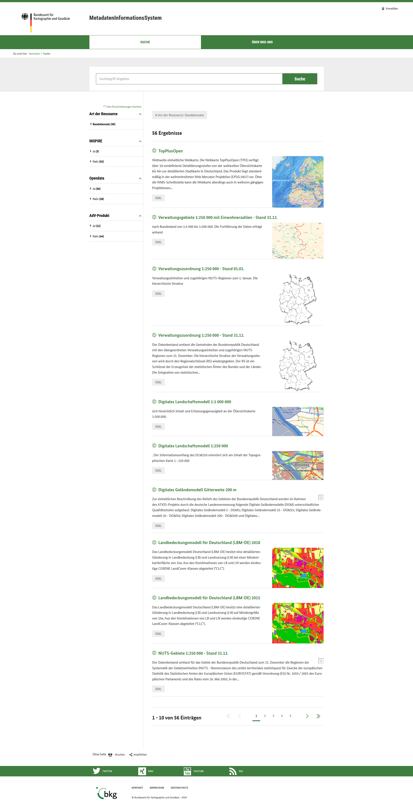
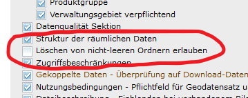
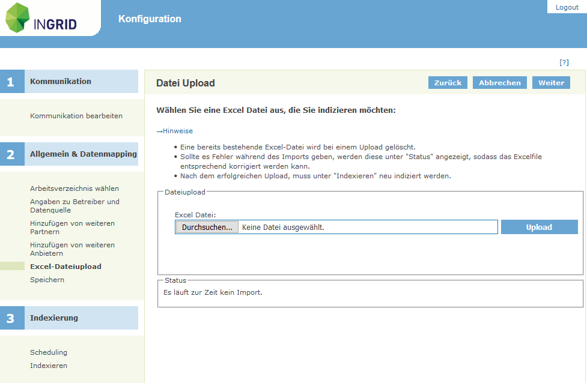

Diese Release Notes betreffen ausschließlich die Versionen 5.2.x. Release Notes ältere Versionen können hier eingesehen werden:  [5.1.x](/5.1.0/about/history.html), [5.0.x](/5.0.0/about/history.html), [4.6.x](/4.6.0/about/history.html), [4.5.x](/4.5.0/about/history.html)

## Version 5.2.0

Release 25.10.2019

### Wichtige Änderungen

#### Neues Portal Profil BKG

Für das MIS des BKG (https://mis.bkg.bund.de) wurde ein neues Portal Profil erstellt.

<figcaption class="figcaption">Neues Portal Profil BKG</figcaption>

#### Wichtige Punkte der INSPIRE TG MD 2.0 wurden umgesetzt

Die kontext-sensitive Hilfe im IGE kann nun über Dateien, profilspezifische angepasst werden. Die Hilfetexte werden im Markdown Format erstellt und können selbstständig vom fachlich versierten Personen redaktionell betreut werden.

<figcaption class="figcaption">Wichtige Punkte der INSPIRE TG MD 2.0 wurden umgesetzt</figcaption>

#### Löschen von nicht-leeren Hierarchien verbieten

Im InGrid Editor ist es als Voreinstellung nicht mehr möglich, nicht-leere Ordner zu löschen. Das Verhalten kann in der Katalogeinstellung eingestellt werden, so dass auch das bisherige Verhalten (Keine Einschränkung beim Löschen) möglich ist.

<figcaption class="figcaption">Ausschnitt aus Katalogeinstellung: Löschen von nicht-leeren Ordnern erlauben</figcaption>

#### UVP: neues iPlug zum Indexieren von BLP Daten

Für die verbesserte Integration von Bauleitplanungsdaten wurde ein neues iPlug entwickelt, dass die Integration von BLP Daten in den InGrid Datenraum übernimmt. Administratoren können Daten die Daten selbstständig hochladen. Die hochgeladenen Daten werden analysiert, Probleme werden in einem Report angezeigt.

<figcaption class="figcaption">Admin GUI iPlug BLP</figcaption>

#### UVP: Integration eines Virus Scanners in den Upload Prozess

In den Upload-Prozess des UVP Editors wurde ein Virus Scanner integriert. Jedes Dokument wird auf Viren geprüft. Der Virus Scanner läuft zudem regelmäßig über hochgeladenen Daten, um die aktualisierten Erkennungsmöglichkeiten des Virus Scanners nutzen zu können.

### Liste der Änderungen

InGrid

- [Feature] [PORTAL] Entfernen von SourceCode des DWD Wetter Warnmoduls ([REDMINE-1435](https://redmine.informationgrid.eu/issues/1435))
- [Feature] [IGE] IGE: INSPIRE TG MD 2.0: Feld: Nutzungsbedingungen ([REDMINE-1218](https://redmine.informationgrid.eu/issues/1218))
- [Feature] [IGE] IGE: INSPIRE TG MD 2.0: Feld: Zugriffsbeschränkungen ([REDMINE-1219](https://redmine.informationgrid.eu/issues/1219))
- [Feature] [IGE] IGE: INSPIRE TG MD 2.0: Raumbezugssystem - Referenzierung einer CRS-Registry ([REDMINE-1221](https://redmine.informationgrid.eu/issues/1221))
- [Feature] [IGE] IGE: Validator für CRS-Auswahl bei INSPIRE-interoperablen Datensätzen ([REDMINE-1222](https://redmine.informationgrid.eu/issues/1222))
- [Feature] [IGE] IGE: Datenformat GML+Version für INSPIRE-relevante Datensätze ([REDMINE-1272](https://redmine.informationgrid.eu/issues/1272))
- [Feature] [IGE] IGE: INSPIRE-TG MD 2.0.1: Werte und Verhalten des Feldes "Konformität" ändern ([REDMINE-1274](https://redmine.informationgrid.eu/issues/1274))
- [Feature] [IGE] IGE: Feld "Nutzungsbedingungen" als Pflichtfeld umsetzen ([REDMINE-1362](https://redmine.informationgrid.eu/issues/1362))
- [Feature] [IGE] IGE: Codeliste "Raumbezugssystem Höhe" erweitern ([REDMINE-1405](https://redmine.informationgrid.eu/issues/1405))
- [Feature] [IGE] IGE: Codeliste "Raumbezugssystem" um Codeeintrag erweitern ([REDMINE-1432](https://redmine.informationgrid.eu/issues/1432))
- [Feature] [IGE] Löschen von Hierarchien im Editor soll per Default nicht möglich sein ([REDMINE-1437](https://redmine.informationgrid.eu/issues/1437))
- [Feature] [MAPCLIENT] Vermeidung von Exceptions beim Anfragen von REST search in webmapclient ([REDMINE-1462](https://redmine.informationgrid.eu/issues/1462))
- [Feature] [MAPCLIENT] MAPCLIENT: Erweiterung an WGS84 Koordinanten-Formate beim Popup "Position" ([REDMINE-1463](https://redmine.informationgrid.eu/issues/1463))
- [Feature] [INTERFACE-SEARCH] Erweiterung der Content-Type Erkennung bei der Erzeugung von ATOM Download Feeds ([REDMINE-1306](https://redmine.informationgrid.eu/issues/1306))
- [Feature] [IPLUG-SE] iPlug SE:  Crawl schlägt fehl, wenn Index nicht (mehr) im elastic search existiert. ([REDMINE-1476](https://redmine.informationgrid.eu/issues/1476))
- [Bug] [PORTAL] Portal: Detailansicht mit unterschiedlicher Einrückung ([REDMINE-1458](https://redmine.informationgrid.eu/issues/1458))
- [Bug] [IGE] IGE Import: CSW Import findet existierenden Eintrag nicht ([REDMINE-531](https://redmine.informationgrid.eu/issues/531))
- [Bug] [IGE] IGE: Einfach Suche und Erweiterte Suche ergeben unterschiedliche Treffermengen ([REDMINE-976](https://redmine.informationgrid.eu/issues/976))
- [Bug] [IGE] IGE: Automatisches Setzen der Konformität bei getCapabilities Assistenten fehlt ([REDMINE-1446](https://redmine.informationgrid.eu/issues/1446))
- [Bug] [IPLUG_IGE] Facette "Themen" funktioniert nicht mehr ([REDMINE-1448](https://redmine.informationgrid.eu/issues/1448))
- [Bug] [IPLUG-SE] iPlug SE: Zeitgesteuerter Crawl funktioniert nicht ([REDMINE-1466](https://redmine.informationgrid.eu/issues/1466))
- [Bug] [INTERFACE-SEARCH] Redirects werden bei MIME-Type Erkennung nicht korrekt verfolgt ([REDMINE-1481](https://redmine.informationgrid.eu/issues/1481))
- [Bug] [IPLUG-SNS] Portal: Chronik liefert falsches Ergebnis ([REDMINE-1478](https://redmine.informationgrid.eu/issues/1478))

Profil UVP

- [Feature] [IPLUG_BLP] Verbesserung der BLP-Integration ([REDMINE-1291](https://redmine.informationgrid.eu/issues/1291))
- [Feature] [SYSTEM] Integration eines Virusscanners in den Upload Prozess ([REDMINE-1293](https://redmine.informationgrid.eu/issues/1293))
- [Feature] [PORTAL] Umbenennung Tabelle "Relevante Dokumente" ([REDMINE-1519](https://redmine.informationgrid.eu/issues/1519))
- [Bug] [IGE] IGE: Ein eingetragenes "gültig bis" Datum wirkt sich auf alle nachfolgenden Dokumente innerhalb der Dokumententabelle aus ([REDMINE-1485](https://redmine.informationgrid.eu/issues/1485))
- [Bug] [PORTAL] Portal: Manche Download Links werden nicht dargestellt ([REDMINE-1442](https://redmine.informationgrid.eu/issues/1442))
- [Bug] [PORTAL] TEST: Portaltreffer werden bei Aktualität nicht nach Datum absteigend sortiert ([REDMINE-1467](https://redmine.informationgrid.eu/issues/1467))
- [Bug] [PORTAL] TEST: Teaser auf Startseite sollen nur bei Klick auf Titel, Button ins Detail verlinken. ([REDMINE-1468](https://redmine.informationgrid.eu/issues/1468))
- [Bug] [PORTAL] Popups zB Zeitraum der Erörterung gehen auf dem Smartphone im Portraitmode nicht mittig auf ([REDMINE-1469](https://redmine.informationgrid.eu/issues/1469))
- [Bug] [PORTAL] Popups in Karte gehen auf Smartphone in Landscape nicht auf, weil Platz nicht ausreicht. ([REDMINE-1470](https://redmine.informationgrid.eu/issues/1470))
- [Bug] [PORTAL] Eingabe Feld und Captcha Neuladen Butten zu eng zusammen ([REDMINE-1471](https://redmine.informationgrid.eu/issues/1471))
- [Bug] [PORTAL] UVP: Paging in Suchergebnisseite bricht um ([REDMINE-1472](https://redmine.informationgrid.eu/issues/1472))
- [Bug] [PORTAL] UVP: UVP Kategorie Text läuft in Detailbutton in Suchergebnis, Fehlendes Icon für UVP Kategorie 18 ([REDMINE-1473](https://redmine.informationgrid.eu/issues/1473))
- [Bug] [PORTAL] UVP: Auf Smartphone Landscape lässt sich die Legende nicht mehr schließen ([REDMINE-1474](https://redmine.informationgrid.eu/issues/1474))

Profil NUMIS

- [Bug] [Portal] Überarbeitung der Überwachungskomponenten im Portal ([REDMINE-1420](https://redmine.informationgrid.eu/issues/1420))
- [Bug] [MapClient] Angaben in Kartenclient URL werden ggf. nicht richtig kodiert ([REDMINE-1457](https://redmine.informationgrid.eu/issues/1457))

Profil BAW DMQS

- [Bug] [IGE] IGE: Fehlerhaftes Verhalten beim setzen von Bezeichnung/Version des Metadatenstandards ([REDMINE-1479](https://redmine.informationgrid.eu/issues/1479))

Profil BKG

- [Feature] [IGE] Gestaltung der Präsentationsoberfläche des BKG-Katalogs ([REDMINE-1200](https://redmine.informationgrid.eu/issues/1200))
- [Feature] [IGE] useConstraints mit gmx:Anchor ergänzen ([REDMINE-1363](https://redmine.informationgrid.eu/issues/1363))
- [Feature] [IGE] IGE: accessConstraints nur für INSPIRE-Inhalte ([REDMINE-1409](https://redmine.informationgrid.eu/issues/1409))
- [Feature] [IGE] BKG: Portal: Anmeldefunktionalität/Button "Neuer Benutzer" entfernen ([REDMINE-1532](https://redmine.informationgrid.eu/issues/1532))

### Komponenten

- Portal ([download](https://distributions.informationgrid.eu/ingrid-portal/5.2.0/))
- iBus ([download](https://distributions.informationgrid.eu/ingrid-ibus/5.2.0/))
- Codelist-Repository ([download](https://distributions.informationgrid.eu/ingrid-codelist-repository/5.2.0/))
- Interface CSW ([download](https://distributions.informationgrid.eu/ingrid-interface-csw/5.2.0/))
- Interface Search ([download](https://distributions.informationgrid.eu/ingrid-interface-search/5.2.0/))
- iPlug DSC ([download](https://distributions.informationgrid.eu/ingrid-iplug-dsc/5.2.0/))
- iPlug CSW ([download](https://distributions.informationgrid.eu/ingrid-iplug-csw-dsc/5.2.0/))
- iPlug IGE ([download](https://distributions.informationgrid.eu/ingrid-iplug-ige/5.2.0/))
- iPlug SE ([download](https://distributions.informationgrid.eu/ingrid-iplug-se/5.2.0/))
- iPlug SNS ([download](https://distributions.informationgrid.eu/ingrid-iplug-sns/5.2.0/))
- iPlug BLP ([download](https://distributions.informationgrid.eu/ingrid-iplug-blp/5.2.0/))

