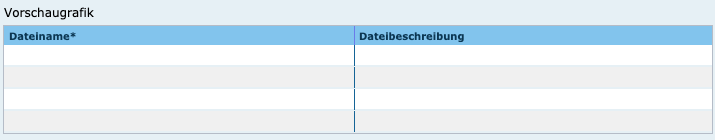

Diese Release Notes betreffen ausschließlich die Versionen 5.5.x. Release Notes ältere Versionen können hier eingesehen werden:  [5.4.x](/5.4.0/about/history.html), [5.3.x](/5.3.0/about/history.html), [5.2.x](/5.2.0/about/history.html), [5.1.x](/5.1.0/about/history.html), [5.0.x](/5.0.0/about/history.html), [4.6.x](/4.6.0/about/history.html), [4.5.x](/4.5.0/about/history.html)

## Version 5.5.8

Release 10.06.2021

### Liste der Änderungen

UVP

- [Bug] [Portal] Fehler bei Archivierung von Dateien ([REDMINE-2526](https://redmine.informationgrid.eu/issues/2526))

### Komponenten

- Portal ([download](https://distributions.informationgrid.eu/ingrid-portal/5.5.8/))

## Version 5.5.7

Release 01.03.2021

### Liste der Änderungen

InGrid

- [Feature] [PORTAL] UVP: Anpassung Kontakt-Formular UVP für Zammad ([REDMINE-2345](https://redmine.informationgrid.eu/issues/2345))

### Komponenten

- Portal ([download](https://distributions.informationgrid.eu/ingrid-portal/5.5.7/))

## Version 5.5.6

Release 09.02.2021

### Liste der Änderungen

UVP

- [Bug] [CODELIST-REPOSITORY] In den UVP Nummern von HH (Codeliste 9001) sind auch UVP Nummern aus Sachsen enthalten ([REDMINE-2365](https://redmine.informationgrid.eu/issues/2365))
- [Feature] [IGE] Optionale Indexierung von neg. Vorprüfungen ohne Raumbezug ([REDMINE-2346](https://redmine.informationgrid.eu/issues/2346))

### Komponenten

- Portal ([download](https://distributions.informationgrid.eu/ingrid-portal/5.5.6/))
- IGE ([download](https://distributions.informationgrid.eu/ingrid-iplug-ige/5.5.6/))
- Codelist-Repository ([download](https://distributions.informationgrid.eu/ingrid-codelist-repository/5.5.6/))

## Version 5.5.5

Release 29.01.2021

### Liste der Änderungen

InGrid

- [Feature] [IPLUG_IGE] IGE: Abgabe von gekoppelten Daten über den Dienste-Datensatz, wenn Kopplung über Kataloggrenzen hinweg erfolgt ([REDMINE-1746](https://redmine.informationgrid.eu/issues/1746))

### Komponenten

- IGE ([download](https://distributions.informationgrid.eu/ingrid-iplug-ige/5.5.5/))

## Version 5.5.4

Release 20.01.2021

### Liste der Änderungen

InGrid

- [Feature] [PORTAL] Knoten "Freie Adressen" auch in Portal Katalogansicht aufnehmen ([REDMINE-2212](https://redmine.informationgrid.eu/issues/2212))

UVP

- [Feature] [IGE] Protokollierung von gelöschten Unterdokumenten ([REDMINE-2319](https://redmine.informationgrid.eu/issues/2319))

### Komponenten

- Portal ([download](https://distributions.informationgrid.eu/ingrid-portal/5.5.4/))
- IGE ([download](https://distributions.informationgrid.eu/ingrid-iplug-ige/5.5.4/))

## Version 5.5.3

Release 12.10.2020

### Liste der Änderungen

- [Update] [Portal] UVP Link von saarländischer Seite anpassen. ([REDMINE-2150](https://redmine.informationgrid.eu/issues/2150))

### Komponenten

- Portal ([download](https://distributions.informationgrid.eu/ingrid-portal/5.5.3/))

## Version 5.5.2

Release 09.10.2020

### Liste der Änderungen

- [Feature] [Mapclient] Warnhinweis beim Importieren von Layern ohne Extent (Admin-GUI). ([REDMINE-2024](https://redmine.informationgrid.eu/issues/2024))
- [Feature] [Mapclient] Aufräumjob für Karten ohne Kategorienzuordnung. ([REDMINE-2025](https://redmine.informationgrid.eu/issues/2025)
- [Bug] [Portal] UVP: Raumsuche funktioniert im UVP-Portal nicht, wenn nach Aktualität sortiert wird. ([REDMINE-2164](https://redmine.informationgrid.eu/issues/2164))
- [Bug] [Portal] UVP/NUMIS: Kleinere Verbesserungen/Anpassungen NUMIS/UVP-Portal. ([REDMINE-1821](https://redmine.informationgrid.eu/issues/1821)
- [Bug] [Portal] NUMIS: Fix Darstellung von Ordneransicht.

### Komponenten

- Portal ([download](https://distributions.informationgrid.eu/ingrid-portal/5.5.2/))

## Version 5.5.1

Release 29.09.2020

- [Feature] [IGE] Höhere Kompatibilität bei der Verarbeitung von Referenzsystemangaben in OGC Capabilities. ([REDMINE-2108](https://redmine.informationgrid.eu/issues/2108))
- [Feature] [Portal] Darstellung von IGE-Ordnern in der Datenkatalogansicht im Portal. ([REDMINE-1102](https://redmine.informationgrid.eu/issues/1102))
- [Update] [Portal] Umbenennung des Änderungsdatums in der Portaldarstellung. ([REDMINE-2083](https://redmine.informationgrid.eu/issues/2083))
- [Update] [Mapclient] Caching-Einstellungen wurden angepasst. ([REDMINE-2012](https://redmine.informationgrid.eu/issues/2012)
- [Bug] [Mapclient] Problem melden - kml Infos in Permalink hinterlegen. ([REDMINE-2106](https://redmine.informationgrid.eu/issues/2106)
- [Bug] [Mapclient] "Hilfe" und "Problem melden" URLs anpassen. ([REDMINE-2043](https://redmine.informationgrid.eu/issues/2043)
- [Bug] [Portal] Layoutprobleme bei mobiler Ergebnisdarstellung. ([REDMINE-2087](https://redmine.informationgrid.eu/issues/2087))
- [Bug] [IGE] Verhalten der Nutzungsbedingungen als Pflichtfeld falsch. ([REDMINE-1975](https://redmine.informationgrid.eu/issues/1975))
- [Bug] [UVP] Anzeige von Vorschaltseiten funktioniert nicht (404).  ([REDMINE-2151](https://redmine.informationgrid.eu/issues/2151)
- [Bug] [Portal] Fix Captcha im Kontaktformular funktioniert nicht. ([REDMINE-2144](https://redmine.informationgrid.eu/issues/2144)
- [Bug] [Bug] Anzeige korrigieren. ([REDMINE-2117](https://redmine.informationgrid.eu/issues/2117)
- [Bug] [UVP] Funktionalität "i" Button bei den Verfahrensschritten herstellen. ([REDMINE-2100](https://redmine.informationgrid.eu/issues/2100)
- [Bug] [Make] Konfiguration der URL des NOMINATIM Dienstes. ([REDMINE-1860](https://redmine.informationgrid.eu/issues/1860)
- [Bug] [Thesaurus] Thesaurus-Navigator Suche zeigt leere Treffer an. ([REDMINE-2040](https://redmine.informationgrid.eu/issues/2040)
- [Bug] [Portal] Portal startet bei manueller Installation nicht unter Windows. ([REDMINE-2035](https://redmine.informationgrid.eu/issues/2035)
- [Bug] [Portal] Umbenennung von Registrierungs-Button "Neuer Benutzer" zu "Registrieren". ([REDMINE-2086](https://redmine.informationgrid.eu/issues/2086)
- [Bug] [Mapclient] Entfernen von DNS-Check bei der Druckfunktion.
- [Bug] [Mapclient] Fix Drucken von importierten WMTSe.
- [Bug] [Mapclient] Fix Handhabung mit Attribute "selectedOpen".
- [Bug] [iBus] Fix fehlende Facetten. ([REDMINE-2159](https://redmine.informationgrid.eu/issues/2159)

- [Feature] [Portal] Messwerteclient: Konfiguration zur Darstellung von gemittelten Messwerten hinzugefügt.
- [Feature] [Portal] Messwerteclient: Eigenschaft hinzugefügt um die Darstellung und Zeitzone des Diagramms zu ändern.
- [Feature] [Portal] Messwerteclient: Verwendung von Elasticsearch "meta data" für die Stationstatistik.
- [Feature] [Portal] Messwerteclient: Hinzufügen von "Jahr" im Auswahlbereich.
- [Feature] [Portal] Messwerteclient: Download von CSV Daten ohne gemittelte Messwerten.
- [Feature] [Portal] Messwerteclient: Darstellung von Ladebalken beim CSV Export.

### Komponenten

- Portal ([download](https://distributions.informationgrid.eu/ingrid-portal/5.5.1/))
- iBus ([download](https://distributions.informationgrid.eu/ingrid-ibus/5.5.1/))
- IGE ([download](https://distributions.informationgrid.eu/ingrid-iplug-ige/5.5.1/))
- Codelist-Repository ([download](https://distributions.informationgrid.eu/ingrid-codelist-repository/5.5.1/))

## Version 5.5.0

Release 27.07.2020

### Wichtige Änderungen

#### Erweiterung des Imports von WMTS mit GetFeatureInfo-Funktion

Ist eine ResourceURL mit dem resourceType="FeatureInfo" definiert, so ist nach dem Hinzufügen des Layers eine GetFeatureInfo nun auch für importierte Karten möglich.

#### Darstellung von mehreren Vorschaugrafiken wird nun im Portal unterstützt

Sowohl in der Suchergebnisliste als auch in der Detaildarstellung gibt es jetzt die Möglichkeit, zwischen mehreren Vorschaugrafiken umzuschalten.

<figcaption class="figcaption">Auswahl mehrerer Vorschaugrafiken</figcaption>

#### Umstellung der Ausführung innerhalb der Docker Container auf unprivilegierten Benutzer

Bisher liefen die Komponenten innerhalb der generierten Docker Container unter dem Benutzer "root". Die Ausführung wurde auf den unprivilegierten Benutzer "ingrid" mit der userid 1000 umgestellt. Dadurch wird die Sicherheit erhöht.

Beim volume mapping muss darauf geachtet werden, dass die Verzeichnisse auf dem Host dem im Container genutzten User gehören. Da der User "ingrid" auf dem Host oft nicht vorhanden ist (und sicherlich nicht unter der UID 1000), muss das Recht der userid 1000 gegeben werden.

`chown -R 1000 <DOCKER-SETUP INGRID>`

Innerhalb eines Containers kann so zum root user gewechselt werden:

`docker-compose exec --user root <CONTAINER> sh`

### Liste der Änderungen

- [Feature] [IPLUG-CSW]: HTTP Read Timeout konfigurierbar machen. ([REDMINE-1988](https://redmine.informationgrid.eu/issues/1988))
- [Feature] [PORTAL]: Darstellung von mehreren Vorschaugrafiken wird im Portal nicht unterstützt. ([REDMINE-1785](https://redmine.informationgrid.eu/issues/1785))
- [Feature] [PORTAL]: Mapclient: Erweiterung Import von WMTS mit GetFeatureInfo-Funktion. ([REDMINE-1953](https://redmine.informationgrid.eu/issues/1953))
- [Feature] [INTERFACE-CSW]: Verbesserung von Stabilität des Harvest-Prozesses der CSW Schnittstelle. ([REDMINE-1901](https://redmine.informationgrid.eu/issues/1901))
- [Feature] [PORTAL]: Umstellung der Ausführung innerhalb der Docker Container auf unprivilegierten Benutzer. ([REDMINE-1898](https://redmine.informationgrid.eu/issues/1898))
- [Feature] [IGE]: Verhalten der Checkbox "OpenData". ([REDMINE-1556](https://redmine.informationgrid.eu/issues/1556))
- [Bug] [IGE]: Fehlende Versionsangaben im Info Dialog des Editors. ([REDMINE-1922](https://redmine.informationgrid.eu/issues/1922))
- [Bug] [CODELIST REPOSITORY]: Umgebungsvariablen INGRID_OPTS und JAVA_OPTS werden in startscript nicht berücksichtigt. ([REDMINE-1920](https://redmine.informationgrid.eu/issues/1920))
- [Bug] [PORTAL]: Passwortmanager funktioniert nicht im Portal. ([REDMINE-1900](https://redmine.informationgrid.eu/issues/1900))
- [Bug] [IGE]: ListId von zusätzlicher Combobox wird nicht gespeichert. ([REDMINE-1893](https://redmine.informationgrid.eu/issues/1893))
- [Bug] [PORTAL]: Ständig auftretende Exception. ([REDMINE-1874](https://redmine.informationgrid.eu/issues/1874))
- [Bug] [CODELIST REPOSITORY]: Codeliste 101 mit dem Eintrag "Mittelwasser" erweitern. ([REDMINE-1407](https://redmine.informationgrid.eu/issues/1407))
- [Bug] [IGE]: XML-Encoding zu spatialRepresentationInfo begutachten. ([REDMINE-1934](https://redmine.informationgrid.eu/issues/1934))
- [Bug] [PORTAL] Katalog: Ausgabe der Qualitätsangaben fehlt. ([REDMINE-1932](https://redmine.informationgrid.eu/issues/1932))
- [Bug] [INTERFACE-SEARCH]: Interface Search wirft Runtimeexception. ([REDMINE-1887](https://redmine.informationgrid.eu/issues/1887))
- [Bug] [PORTAL]: In der Detaildarstellung werden unter "Nutzungsbedingungen" leere Einträge angezeigt. ([REDMINE-1854](https://redmine.informationgrid.eu/issues/1854))
- [Bug] [PORTAL]: Alte Links zu Detaildarstellungen funktionieren nicht mehr. ([REDMINE-1833](https://redmine.informationgrid.eu/issues/1833))

Profil BAW DMQS

- [Feature] [PORTAL]: HTML 403 Error-Seite fehlt im BAW-Profil. ([REDMINE-1858](https://redmine.informationgrid.eu/issues/1858))
- [Bug] [IGE]: XML Namensraum "xs" fehlt in der ISO-Abbildung. ([REDMINE-1857](https://redmine.informationgrid.eu/issues/1857))

Profil BKG

- [Feature] [IGE]: neues Feld "Begrenzungspolygon als wkt" - wie Anzeige steuern? ([REDMINE-1909](https://redmine.informationgrid.eu/issues/1909))
- [Bug] [IGE]: Feld "INSPIRE-Themen" kein Pflichtfeld für INSPIRE-Dienste. ([REDMINE-1908](https://redmine.informationgrid.eu/issues/1908))
- [Bug] [PORTAL]: Ansicht eines MD im Reiter Zeit/Raum fehlerhaft. ([REDMINE-1905](https://redmine.informationgrid.eu/issues/1905))

Profil MetaVer

- [Feature] [PORTAL]: Anpassung des Email-Versandes (Adressat in Reply-To bei Kontaktformular). ([REDMINE-1890](https://redmine.informationgrid.eu/issues/1890))
- [Bug] [IGE]: Verhalten der Nutzungsbedingungen als Pflichtfeld falsch. ([REDMINE-1975](https://redmine.informationgrid.eu/issues/1975))

Profil NUMIS

- [Bug] [UVP]: Datei wurde nicht gelöscht. ([REDMINE-2006](https://redmine.informationgrid.eu/issues/2006))

Profil UVP

- [Bug] [IGE]: Fehler bei der Erstellung von Statistiken (Semikolon im Titel). ([REDMINE-1929](https://redmine.informationgrid.eu/issues/1929))

### Komponenten

- Portal ([download](https://distributions.informationgrid.eu/ingrid-portal/5.5.0/))
- Codelist-Repository ([download](https://distributions.informationgrid.eu/ingrid-codelist-repository/5.5.0/))
- iBus ([download](https://distributions.informationgrid.eu/ingrid-ibus/5.5.0/))
- Interface CSW ([download](https://distributions.informationgrid.eu/ingrid-interface-csw/5.5.0/))
- Interface Search ([download](https://distributions.informationgrid.eu/ingrid-interface-search/5.5.0/))
- iPlug BLP ([download](https://distributions.informationgrid.eu/ingrid-iplug-blp/5.5.0/))
- iPlug CSW-DSC ([download](https://distributions.informationgrid.eu/ingrid-iplug-csw-dsc/5.5.0/))
- iPlug DSC ([download](https://distributions.informationgrid.eu/ingrid-iplug-dsc/5.5.0/))
- iPlug Excel ([download](https://distributions.informationgrid.eu/ingrid-iplug-excel/5.5.0/))
- iPlug IGE ([download](https://distributions.informationgrid.eu/ingrid-iplug-ige/5.5.0/))
- iPlug Opensearch ([download](https://distributions.informationgrid.eu/ingrid-iplug-opensearch/5.5.0/))
- iPlug SE ([download](https://distributions.informationgrid.eu/ingrid-iplug-se/5.5.0/))
- iPlug SNS ([download](https://distributions.informationgrid.eu/ingrid-iplug-sns/5.5.0/))
- iPlug WFS-DSC ([download](https://distributions.informationgrid.eu/ingrid-iplug-wfs-dsc/5.5.0/))
- iPlug XML ([download](https://distributions.informationgrid.eu/ingrid-iplug-xml/5.5.0/))
