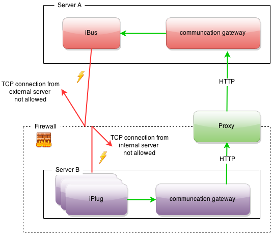

## Allgemeines

Das Communication Gateway kann benutzt werden, wenn z.B. der iBus aufgrund von Firewall Einstellungen nicht direkt erreicht werden kann oder eine SSL Verbindung erwünscht ist. Das Gateway kann in verschiedenen Modi betrieben werden.

**1. Eingangsseitig ohne SSL**

Der Datenstrom des Clients ist unverschlüsselt.

**2. Eingangsseitig mit SSL**

Der Datenstrom des Clients ist verschlüsselt. Die Pakete werden dann am Gateway entschlüsselt.

**3. Ausgangsseitig ohne SSL**

Das Gateway sendet die Pakete des Clients unverschlüsselt an den iBus oder ein gegenüber liegendes Gateway weiter.

**4. Ausgangsseitig mit SSL**

Das Gateway verschlüsselt die Pakete des Clients und sendet diese an das nächste Gateway weiter.

Wird das Gateway Ausgangsseitig im SSL Modus betrieben so müssen die Pakete an ein weiteres Gateway (Eingangsseitig SSL-Modus) gesendet werden, da der iBus kein SSL unterstützt.




<figcaption class="figcaption">InGrid Komponente Communication Gateway</figcaption>


## Systemvoraussetzungen

- 256 MB RAM
- 500 MB Harddrive

- JAVA 8
- Cygwin (unter Windows)


## Installation

Download: [https://distributions.informationgrid.eu/ingrid-communication-gateway/](https://distributions.informationgrid.eu/ingrid-communication-gateway/)

Um die Installationsroutine zu starten, doppel-klicken Sie auf das Installationsprogramm oder geben Sie folgenden Befehl auf der Kommandozeile ein:

```sh
java -jar ingrid-communication-gateway-VERSION-installer.jar
```

Der Installer ist sowohl per graphischer Oberfläche als auch Kommandozeileneingabe ausführbar. Bitte folgen Sie den Anweisungen des Installationsprogrammes. Das Installationsprogramm installiert die Komponnete im gewünschten Verzeichnis und passt die Konfigurationsdateien an.

Sie können nun die Komponente mit

```sh
sh start.sh start
```

starten. 

## Aktualisierung

Neues Release von [https://distributions.informationgrid.eu/ingrid-communication-gateway/](https://distributions.informationgrid.eu/ingrid-communication-gateway/) herunterladen.

Komponente stoppen.

```sh
sh start.sh stop
```

Aktuelles Installationsverzeichnis sichern:

```sh
cp -r /opt/ingrid/ingrid-communication-gateway <BACKUP-DIRECTORY>
```


Die Aktualisierung erfolgt über den Installer. 

```sh
java -jar ingrid-communication-gateway-NEW-VERSION-installer.jar
```

Während der Installation bitte "Upgrade" auswählen und das Installationsverzeichnis Verzeichnis angeben.

Komponente starten.

```sh
sh start.sh start
```

## Betrieb

```sh
start.sh [start|stop|restart|status]
```

Die LOG Ausgaben finden sich in der Datei `log.log` und `console.log`.


## Konfiguration


Konfiguration

### gateway.properties.template

Diese Datei dient als Schablone für die eigentliche Konfigurationsdatei gateway.properties.

### gateway.properties

| Parameter | Erläuterung |
| == | == |
| ServerPort | Der Port auf dem das Gateway Verbindungen entgegennimmt. |
| TargetIp | An diese IP (iBus oder weiteres Gateway) werden die Kommunikationspakete der Eingehenden Verbindungen weitergereicht. |
| TargetPort | An diesen Port (iBus oder weiteres Gateway) werden die Kommunikationspakete der Eingehenden Verbindungen weitergereicht. |
|  SslInput | true\|false - Bei true werden verschlüsselte Daten als Input erwartet. Bei false werden unverschlüsselte Daten als Input erwartet. |
| SslOutput | true\|false - Bei true werden die eingehenden Daten verschlüsselt weiter gesendet. Bei false werden die eingehenden Daten unverschlüsselt weitergesendet. |
| KeyStore | Pfad zum Keystore in dem der/die privaten Schlüssel gespeichert sind. Diese Schlüssel werden zur Entschlüsselung genutzt. |
| KeyStorePassword | Passwort zum lesen des Keystores. Wird die Einstellung KeyStore leer gelassen, dann werden die von Java mit ausgelieferten KeyStores verwendet. Es werden nur JavaKeystores (JKS) unterstützt. |
| TrustStore | Pfad zum Truststore. In diesem Truststore sind die Zertifikate der Kommunikationspartner gespeichert. Diese werden zum Verschlüsseln der Pakete genutzt.Wird die Einstellung TrustStore leer gelassen, dann werden die von Java mit ausgelieferten TrustStores verwendet. Es werden nur JavaKeystores (JKS) unterstützt. |
| TrustStorePassword | Passwort zum lesen des Truststores. |
| MaxConnections | Maximale Anzahl von parallel eingehenden Kommunikationspartner. |
| HttpProxyIp | Stellt ein Http-Proxy die Verbindungen zum Internet her, wird hier die IP eingetragen. |
| HttpProxyPort | Stellt ein Http-Proxy die Verbindungen zum Internet her, wird hier der Port eingetragen.Werden die beide Einstellungen HttpProxyIp und HttpProxyPort leer gelassen dann wird kein Http-Proxy genutzt. |
| HttpProxyUser | Nutzer Name für das Authentifizieren am Http-Proxy. |
| HttpProxyPassword | Password für das Authentifizieren am Http-Proxy. Werden die beide Einstellungen HttpProxyUser und HttpProxyPassword leer gelassen dann wird keine Authentifierung am Http-Proxy durchgeführt. |


## FAQ

### Server Port wurde kleiner als 1024 gewählt - es kommt zu Problemen.

Wenn der Server-Port des Communication-Gateways kleiner als 1024 gewählt wird, dann muss das Gateway unter Linux als root gestartet werden, ansonsten kommt es zu Zugriffsproblemen.

### Muss die Proxy Angabe immer ausgefüllt sein?

Der Http-Proxy darf nur ausgefüllt werden, wenn der anzuschließende iBus nicht direkt erreichbar ist (nicht im gleichen Netzwerk). Befindet sich der iBus z.B. auf dem selben Computer wie das Gateway selbst, dann muss der Http-Proxy leer sein!

