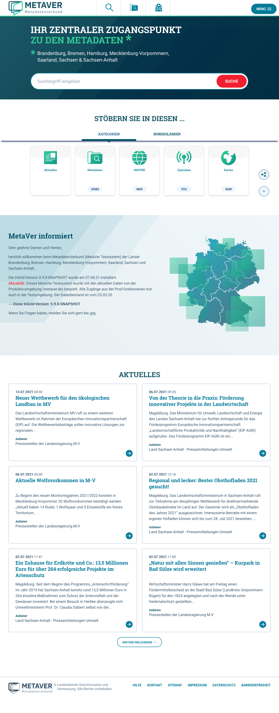

Diese Release Notes betreffen ausschließlich die Versionen 5.9.x. Release Notes älterer Versionen können hier eingesehen werden:
[5.8.x](/5.8.0/about/history.html), [5.7.x](/5.7.0/about/history.html), [5.6.x](/5.6.0/about/history.html), [5.5.x](/5.5.0/about/history.html), [5.4.x](/5.4.0/about/history.html), [5.3.x](/5.3.0/about/history.html), [5.2.x](/5.2.0/about/history.html), [5.1.x](/5.1.0/about/history.html), [5.0.x](/5.0.0/about/history.html), [4.6.x](/4.6.0/about/history.html), [4.5.x](/4.5.0/about/history.html)

## Version 5.9.2.1

Release 11.11.2021

### Liste der Änderungen

- [Bug] [PORTAL] SSRF mit XML External Entity (XXE) Schwachstelle (2) ([REDMINE-3161](https://redmine.informationgrid.eu/issues/3161))
- [Bug] [Portal] Darstellung der Webseiten Treffer fehlerhaft ([REDMINE-3105](https://redmine.informationgrid.eu/issues/3105))

### Komponenten

- PORTAL ([download](https://distributions.informationgrid.eu/ingrid-portal/5.9.2.1/))

## Version 5.9.1.2

Release 11.11.2021

### Liste der Änderungen

- [Bug] [PORTAL] SSRF mit XML External Entity (XXE) Schwachstelle (2) ([REDMINE-3161](https://redmine.informationgrid.eu/issues/3161))
- [Bug] [Portal] Darstellung der Webseiten Treffer fehlerhaft ([REDMINE-3105](https://redmine.informationgrid.eu/issues/3105))

### Komponenten

- PORTAL ([download](https://distributions.informationgrid.eu/ingrid-portal/5.9.1.2/))


## Version 5.9.2

Release 11.10.2021

### Liste der Änderungen

- [Feature] [PORTAL] Weitere Anpassungen am HMDK Profil ([REDMINE-1523](https://redmine.informationgrid.eu/issues/1523))
- [Feature] [PORTAL] Erkennung von Brute-Force-Attacken in Anmeldeprozess von Portal ([REDMINE-1313](https://redmine.informationgrid.eu/issues/1313))
- [Feature] [PORTAL] Aktualisierung TOMCAT Version auf 9.0.53 ([REDMINE-2926](https://redmine.informationgrid.eu/issues/2926))
- [Feature] [PORTAL] Verstecken der Tomcat Version in Tomcat Fehlerseiten ([REDMINE-2925](https://redmine.informationgrid.eu/issues/2925))
- [Feature] [IGE] IGE-Tabelle Vorschaugrafik ([REDMINE-2832](https://redmine.informationgrid.eu/issues/2832))
- [Feature] [IGE] Anpassung der Zeitbezüge in "Durch die Ressource abgedeckte Zeitspanne" ([REDMINE-2184](https://redmine.informationgrid.eu/issues/2184))
- [Bug] [PORTAL] Eingaben werden nicht ausreichend auf XSS Angriffe gefiltert ([REDMINE-2871](https://redmine.informationgrid.eu/issues/2871))
- [Bug] [MAPCLIENT] SSRF mit XML External Entity (XXE) Schwachstelle im MapClient beheben ([REDMINE-2924](https://redmine.informationgrid.eu/issues/2924))
- [Bug] [PORTAL] BKG: IGE: Zeichenkodierung fehlerhaft ([REDMINE-2822](https://redmine.informationgrid.eu/issues/2822))
- [Bug] [IGE] Operationen bearbeiten enthält Index statt Wert ([REDMINE-2749](https://redmine.informationgrid.eu/issues/2749))
- [Bug] [IGE] Lagegenauigkeit wird nicht importiert ([REDMINE-2755](https://redmine.informationgrid.eu/issues/2755))
- [Bug] [IGE] ISO-XML: Angabe des DCP-Elements unzureichend abgebildet ([REDMINE-2245](https://redmine.informationgrid.eu/issues/2245))

Profil Umweltportal Schleswig-Holstein

- [Feature] [PORTAL] SH: Kontaktformular: Die E-Mail des Nutzers soll im REPLY-TO Header verwendet werden ([REDMINE-2804](https://redmine.informationgrid.eu/issues/2804))

Profil UVP

- [Feature] [PORTAL] UVP: Icon im UVP-Portal einfügen ([REDMINE-2819](https://redmine.informationgrid.eu/issues/2819))


### Komponenten

- PORTAL ([download](https://distributions.informationgrid.eu/ingrid-portal/5.9.2/))
- IPLUG-IGE ([download](https://distributions.informationgrid.eu/ingrid-iplug-ige/5.9.2/))


## Version 5.9.1.1

Release 06.10.2021

### Liste der Änderungen

- [Bug] [MAPCLIENT] SSRF mit XML External Entity (XXE) Schwachstelle im MapClient beheben ([REDMINE-2924](https://redmine.informationgrid.eu/issues/2924))

### Komponenten

- PORTAL ([download](https://distributions.informationgrid.eu/ingrid-portal/5.9.1.1/))


## Version 5.9.1

Release 05.08.2021

### Wichtige Änderung

#### Neue Katalogansicht

Die Katalogansicht wurde umfangreich überarbeitet.
Jeder Knoten im Katalogbaum ist nun durch eine eindeutige ID (MD5-Hash und Knoten-Level) gekennzeichnet. Durch diese eindeutige ID, die nun auch über die URL transportiert wird, kann eine Katalogansicht wiederhergestellt und versendet werden.
Die Katalogansicht lädt nun auch viel schneller, da die Knoten nun dynamisch über JavaScript (jQuery) geladen werden. Ein Reload der Seite beim Öffnen eines Knotens ist nicht mehr notwendig.


<figcaption class="figcaption">Neue Katalogansicht NUMIS</figcaption>


### Liste der Änderungen

- [Feature] [PORTAL] Katalogansicht dynamisch aufbauen (ohne Reload der Portalseite) ([REDMINE-2610](https://redmine.informationgrid.eu/issues/2610))

Profil NUMIS

- [Feature] [PORTAL] MESSWERTECLIENT: "Zurück zur Kartenansicht" zeigt nicht den letzten Kartenausschnitt an ([REDMINE-2609](https://redmine.informationgrid.eu/issues/2609))
- [Bug] [PORTAL] Probleme nach Update auf 5.9.0 ([REDMINE-2608](https://redmine.informationgrid.eu/issues/2608))

Profil UVP

- [Bug] Bauleitplanungsseite BB führt zu leeren Ergebnissen ([REDMINE-2667](https://redmine.informationgrid.eu/issues/2667))
- [Bug] [IGE] Verfahrensschritt kann nicht gelöscht werden ([REDMINE-2621](https://redmine.informationgrid.eu/issues/2621))

### Komponenten

- PORTAL ([download](https://distributions.informationgrid.eu/ingrid-portal/5.9.1/))
- IPLUG-IGE ([download](https://distributions.informationgrid.eu/ingrid-iplug-ige/5.9.1/))


## Version 5.9.0

Release 16.07.2021

### Hinweise für die Aktualisierung

Für InGrid-Installationen, muss in den IGE-iPlugs die Konfigurationsdatei angepasst werden,
um die hochgeladenen Vorschaubilder als absolute URLs in dem exportierten ISO-Dokument mit auszugeben.
Hierfür ist Folgendes notwendig:

Anpassung der `config.override.properties` Datei:
```properties
# Beispiel für die Metaver-Installation mit direkter Base-URL
document.store.base.url=https://metaver.de/ingrid-portal-mdek-application/rest/document/

# oder über eine zusätzlich im Apache eingerichtete Weiterleitung
document.store.base.url=https://metaver.de/documents/
```

In der `docker-compose.yml` muss das Upload-Verzeichnis herausgemappt werden, um einen Datenverlust zu vermeiden:
```
...
  volumes:
    - ./portal/upload:/tmp/ingrid/upload
```

Zusätzlich kann die Apache-Konfiguration angepasst werden, um den verbesserten Pfad `documents` zu unterstützen:
```
RewriteCond %{REQUEST_URI} !^/documents
...
RewriteRule ^/(.*) /ingrid-portal/$1?lang=de&%{QUERY_STRING} [PT,NC]

# map files
<Directory "<path-to-docker-setup>/portal/upload/documents">
  AllowOverride All
  Options FollowSymlinks
  Satisfy Any
  Require all granted
</Directory>

Alias /documents "<path-to-docker-setup>/portal/upload/documents"
```

Schließlich sollte sichergestellt werden, dass Lese- und Schreibzugriffe auf dem gemappten Verzeichnis
funktionieren.

### Wichtige Änderungen

#### Neues Layout für MetaVer

Für das Portal metaver.de wurde ein neues Layout erstellt:


<figcaption class="figcaption">Neues Layout für metaver.de Startseite</figcaption>


<figcaption class="figcaption">Neues Layout für metaver.de Suche</figcaption>


<figcaption class="figcaption">Neues Layout für metaver.de Suche Mehr Infos</figcaption>


<figcaption class="figcaption">Neues Layout für metaver.de Suche Detail</figcaption>


<figcaption class="figcaption">Neues Layout für metaver.de Karte</figcaption>

#### Handling der Layer im Kartenclient erweitert

Das Handling von Layern im Kartenclient wurde erweitert, hier am Beispiel von metaver.de:

- Beim Hinzufügen eines Kartendienstes aus der Suche oder Detaildarstellung können die Layer jetzt interaktiv gewählt werden (wie beim Import).
- Per Button-Klick können alle Layer hinzugefügt werden.
- Einzelne Layer können direkt mittels ihres Identifiers hinzugefügt werden, ohne vorherige Auswahl.


<figcaption class="figcaption">Layer Kartenclient metaver.de</figcaption>


#### Umfangreiche Überarbeitung der Suchergebnisliste und Detaildarstellung bei NUMIS

Die Darstellung der Suchergebnisse und der Detailansicht wurde umfassend überarbeitet und erweitert:


<figcaption class="figcaption">Neue Suchergebnisliste NUMIS</figcaption>


<figcaption class="figcaption">Neue Detaildarstellung NUMIS</figcaption>


#### Erfassung von Metadaten in Englisch

Metadaten können nun auch in englischer Sprache erfasst werden.

Siehe dazu auch:

[Wie kann ich die Katalogsprache ändern](https://www.ingrid-oss.eu/latest/components/iplug_ige.html#wie-kann-ich-die-katalogsprache-%C3%A4ndern)

[Unterstützung der Übersetzung in mehreren Sprachen für bestimmte Felder](https://www.ingrid-oss.eu/5.6.0/about/history.html#unterst%C3%BCtzung-der-%C3%BCbersetzung-in-mehreren-sprachen-f%C3%BCr-bestimmte-felder)

Einige Beispiel-Screenshots:


<figcaption class="figcaption">Katalogsprache English</figcaption>


<figcaption class="figcaption">Neues Objekt Assistent</figcaption>


<figcaption class="figcaption">Neues Objekt Adressen</figcaption>


<figcaption class="figcaption">Neues Objekt Art des Dienstes</figcaption>


<figcaption class="figcaption">Neues Objekt Sprache Metadatensatz</figcaption>


<figcaption class="figcaption">Neues Objekt ISO-Themenkategorie</figcaption>


#### Hochladen von Vorschaubildern

Vorschaubilder können jetzt hochgeladen und somit auf dem Server abgelegt werden. Weiterhin ist es auch möglich einen Link
zu einer Bilddatei anzugeben.


<figcaption class="figcaption">Vorschaubild hinzufügen</figcaption>


<figcaption class="figcaption">Link angeben im Dokument-Upload</figcaption>


### Liste der Änderungen

- [Feature] [MAPCLIENT] Komprimierung von weiteren URL Parametern beim Aufruf von WMS Karten mit vielen Layern ([REDMINE-2602](https://redmine.informationgrid.eu/issues/2602))
- [Feature] [IGE] Vorschaugrafiken im IGE ablegen und verwalten ([REDMINE-1667](https://redmine.informationgrid.eu/issues/1667))
- [Feature] [MAPCLIENT] MetaVer-Kartenclient alle geladene Layer deaktiviren / alle geladenen Layer löschen ([REDMINE-2598](https://redmine.informationgrid.eu/issues/2598))
- [Feature] [PORTAL] Ergebnisliste (neues Layout): Anbieter und Quelle nach Detaildarstellung übertragen ([REDMINE-2544](https://redmine.informationgrid.eu/issues/2544))
- [Feature] [PORTAL] "Passwort vergessen?"-Funktion besser darstellen ([REDMINE-2422](https://redmine.informationgrid.eu/issues/2422))
- [Feature] [IGE] transferOptions / Abfolge in xml ([REDMINE-2418](https://redmine.informationgrid.eu/issues/2418))
- [Feature] [PORTAL] QS Umsetzung und Anmerkungen der Verbundpartner ([REDMINE-2407](https://redmine.informationgrid.eu/issues/2407))
- [Feature] [DOCUMENTATION] Dokumentation Docker Installation unter ingrid-oss.eu ([REDMINE-2357](https://redmine.informationgrid.eu/issues/2357))
- [Feature] [MAPCLIENT] MetaVer-Kartenclient - nach dem Laden eines WMS die Struktur der Layer anzeigen ([REDMINE-2274](https://redmine.informationgrid.eu/issues/2274))
- [Feature] [PORTAL] Umsetzung der Konzeption der Darstellung von Detaildaten im Portal ([REDMINE-1358](https://redmine.informationgrid.eu/issues/1358))
- [Feature] [CODELIST REPOSITORY] Neue Opendata-Lizenzen für die Codeliste 6500 ([REDMINE-1290](https://redmine.informationgrid.eu/issues/1290))
- [Feature] [MAPCLIENT] GPX import - Beschreibung fehlt ([REDMINE-2519](https://redmine.informationgrid.eu/issues/2519))
- [Feature] [IGE] WCS-Dienst mit GetCapabilities-Assistent erfassen ([REDMINE-2381](https://redmine.informationgrid.eu/issues/2381))
- [Feature] [CODELIST REPOSITORY] Zusätzlicher Wert in Codeliste "Datenformat - Name" - GeoTIFF ([REDMINE-2376](https://redmine.informationgrid.eu/issues/2376))
- [Feature] [IGE] Validierung GML+Version für INSPIRE-relevante Datensätze entfernen ([REDMINE-2281](https://redmine.informationgrid.eu/issues/2281))
- [Feature] [SYSTEM] Anpassung der Referenzierung des Metadaten-Schemas und -Namespaces ([REDMINE-1876](https://redmine.informationgrid.eu/issues/1876))
- [Feature] [IGE] Erfassung von Metadaten in English ([REDMINE-967](https://redmine.informationgrid.eu/issues/967))
- [Bug] [MAPCLIENT] Aktualisierung auf den aktuellsten mf-geoadmin3 (2021-07-29) ([REDMINE-2594](https://redmine.informationgrid.eu/issues/2594))
- [Bug] [IGE] Diskrepanz der Anzeige der Schlagworte mit verschiedenen Thesaurus  ([REDMINE-2392](https://redmine.informationgrid.eu/issues/2392))
- [Bug] [MAPCLIENT] Karte: GetFeatureInfo enthält unnötige Formatierungen "br" ([REDMINE-2563](https://redmine.informationgrid.eu/issues/2563))
- [Bug] [IGE] Katalogeinstellungen - Checkbox "Schlüsselkatalog" kommt doppelt vor ([REDMINE-2543](https://redmine.informationgrid.eu/issues/2543))
- [Bug] [IGE] Engl. Katalog - Maßstabsausgabe im abstract nicht übersetzt ([REDMINE-2542](https://redmine.informationgrid.eu/issues/2542))
- [Bug] [IGE] Pflichtfelder von Digitale Repräsentation und Datenformat wenn INSPIRE/nicht konform ([REDMINE-2521](https://redmine.informationgrid.eu/issues/2521))
- [Bug] [IGE] Hamburger Logik nach Update auf 5.8.1 für LGV und Dataport ([REDMINE-2514](https://redmine.informationgrid.eu/issues/2514))
- [Bug] [PORTAL] Popup öffnet sich in Chrome 90 nicht mehr ([REDMINE-2493](https://redmine.informationgrid.eu/issues/2493))
- [Bug] [IGE] MD-Import verbessern - Vorschaubild-Beschreibung  ([REDMINE-2488](https://redmine.informationgrid.eu/issues/2488))
- [Bug] [MAPCLIENT] Identifier der Datenquelle in Verbindung mit Anzeig des Kartenlayers ([REDMINE-2460](https://redmine.informationgrid.eu/issues/2460))
- [Bug] [PORTAL] Anzeige des Identifikators der Datenquelle defekt ([REDMINE-2459](https://redmine.informationgrid.eu/issues/2459))
- [Bug] [IGE] Kontakt für die Ressource, wenn auch glechzeitig Kontakt für die Metadaten, wird nicht richtig importiert ([REDMINE-1986](https://redmine.informationgrid.eu/issues/1986))
- [Bug] [PORTAL] RSS-Job bei Links mit vielen Zeilenumbrüchen führen zu Datenbankfehlern ([REDMINE-2603](https://redmine.informationgrid.eu/issues/2603))

Profil BAW DMQS

- [Feature] InGrid-Utils: UUID-Typ-3 Generierung ähnlich zu analogen Funktionen in Python, Ruby, etc. gestalten ([REDMINE-2512](https://redmine.informationgrid.eu/issues/2512))

Profil BKG

- [Feature] [IGE] IGE engl.: Funktionalität "Freie Schlagworte" autom. einem Thesaurus zuordnen - Anpassung an engl.Sprache ([REDMINE-2463](https://redmine.informationgrid.eu/issues/2463))
- [Bug] [IGE] IGE-engl.: Werteingabe unvollständig nach ISO-XML ([REDMINE-2567](https://redmine.informationgrid.eu/issues/2567))
- [Bug] [IGE] Funktion "Suchbegriffe" funktioniert nicht ([REDMINE-2564](https://redmine.informationgrid.eu/issues/2564))

Profil MetaVer

- [Feature] [PORTAL] ReDesign MetaVer ([REDMINE-1564](https://redmine.informationgrid.eu/issues/1564))
- [Feature] [PORTAL] Austausch von Länderwappen PNG Icons durch SVG-basierte Icons ([REDMINE-2506](https://redmine.informationgrid.eu/issues/2506))
- [Feature] [PORTAL] Verbesserung der Barrierefreiheit von metaver.de ([REDMINE-2456](https://redmine.informationgrid.eu/issues/2456))
- [Feature] [MAPCLIENT] Verbesserte Hintergrundkarten für MetaVer ([REDMINE-2200](https://redmine.informationgrid.eu/issues/2200))
- [Feature] [CSW] In der CSW Schnittstelle für das Hamburger Transparenzportal soll der alte GML Namespace verwendet werden ([REDMINE-2505](https://redmine.informationgrid.eu/issues/2505))
- [Feature] [PORTAL] Anpassung Kontakt-Formular MetaVer Test für Zammad ([REDMINE-2461](https://redmine.informationgrid.eu/issues/2461))
- [Bug] Neues Layout METAVER.DE: In die Gliederungsebene von z. B. ?Weitere Verweise? einordnen ([REDMINE-2547](https://redmine.informationgrid.eu/issues/2547))

Profil Installation Saarland

- [Support] Freischaltung des Saarländischen Umweltdatenkatalogs ([REDMINE-2431](https://redmine.informationgrid.eu/issues/2431))

Profil Installation Schleswig-Holstein

- [Bug] [PORTAL] Aktive Seite ist schlecht erkennbar beim Paging in Ergebnisliste ([REDMINE-2457](https://redmine.informationgrid.eu/issues/2457))

Profil UVP

- [Bug] [IGE] Fehler bei Archivierung von Dateien ([REDMINE-2526](https://redmine.informationgrid.eu/issues/2526))
- [Bug] [PORTAL] Anmeldeseite wird von Suchmaschinen indexiert ([REDMINE-2462](https://redmine.informationgrid.eu/issues/2462))

### Komponenten

- IPLUG-CSW-DSC ([download](https://distributions.informationgrid.eu/ingrid-iplug-csw-dsc/5.9.0/))
- CODELIST-REPOSITORY ([download](https://distributions.informationgrid.eu/ingrid-codelist-repository/5.9.0/))
- IBUS ([download](https://distributions.informationgrid.eu/ingrid-ibus/5.9.0/))
- INTERFACE-CSW ([download](https://distributions.informationgrid.eu/ingrid-interface-csw/5.9.0/))
- PORTAL ([download](https://distributions.informationgrid.eu/ingrid-portal/5.9.0/))
- IPLUG-IGE ([download](https://distributions.informationgrid.eu/ingrid-iplug-ige/5.9.0/))
