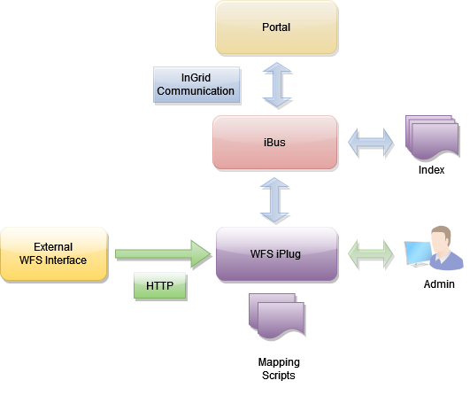

## Allgemeines

Der WFS-iPlug bietet eine Schnittstelle zu WFS (Web Feature Service)-Datenquellen. Die Daten der Datenquelle werden komplett heruntergeladen und indexiert. Die Originaldaten der Datenquelle werden gespeichert und dienen als Datenbasis für die Lieferung von Detaildaten.

Eine Anfrage an das iPlug generiert also KEINE Anfrage an die zugrunde liegende WFS Schnittstelle. Diese Vorgehensweise wurde insbesondere im Hinblick auf eine performante Abfrage des iPlugs gewählt.

Das iPlug fragt die WFS Schnittstelle regelmäßig (z.B. einmal täglich) ab. Die Abfrage-Frequenz kann über die Admin-Oberfläche gesteuert werden.



<figcaption class="figcaption">InGrid Komponente iPlug WFS</figcaption>

## Systemvoraussetzungen

* 256 MB RAM
* 500 MB Harddrive

* JAVA 17
* Cygwin (unter Windows)


## Installation

Download: [https://distributions.informationgrid.eu/ingrid-iplug-wfs-dsc/](https://distributions.informationgrid.eu/ingrid-iplug-wfs-dsc/)

Um die Installationsroutine zu starten, doppel-klicken Sie auf das Installationsprogramm oder geben Sie folgenden Befehl auf der Kommandozeile ein:

```sh
java -jar ingrid-iplug-dsc-wfs-VERSION-installer.jar
```

Der Installer ist sowohl per graphischer Oberfläche als auch Kommandozeileneingabe ausführbar. Bitte folgen Sie den Anweisungen des Installationsprogrammes. Das Installationsprogramm installiert die Komponente im gewünschten Verzeichnis und passt die Konfigurationsdateien an.

Sie können nun das iPlug mit

```sh
sh start.sh start
```

starten.

Das iPlug besitzt eine Administrationsoberfläche über die die angeschlossenen iPlugs eingesehen und verwaltet werden können.


http://localhost:PORT


Anstelle von `localhost` können Sie auch die IP-Adresse des Computers eingeben. Authentifizieren Sie sich als 'admin' mit dem von Ihnen vergebenen Passwort.


Nach der ersten Installation wird die Administrations-GUI unter


http://localhost:8082


aufgerufen und die Konfiguration vervollständigt.


## Aktualisierung

Neues Release von [https://distributions.informationgrid.eu/ingrid-iplug-dsc-wfs/](https://distributions.informationgrid.eu/ingrid-iplug-dsc-wfs/) herunterladen.

iPlug stoppen.

```sh
sh start.sh stop
```

Aktuelles Installationsverzeichnis sichern:

```sh
cp -r /opt/ingrid/ingrid-iplug-dsc-wfs BACKUP_DIRECTORY
```


Die Aktualisierung erfolgt über den Installer.

```sh
java -jar ingrid-iplug-dsc-wfs-NEW-VERSION-installer.jar
```

Während der Installation bitte "Upgrade" auswählen und das Installationsverzeichnis Verzeichnis angeben.

iPlug starten.

```sh
sh start.sh start
```

## Betrieb

```sh
start.sh [start|stop|restart|status]
```

Die LOG Ausgaben finden sich in der Datei `log.log` und `console.log`.


## Konfiguration

### Basiskonfiguration

Die Basiskonfiguration für iPlugs kann [hier](iplug_admin_gui.html) eingesehen werden.

### Indexierung von WFS Diensten

In der **Administrationsoberfläche** können im Abschnitt **WFS Parameter** folgende Eigenschaften eingestellt werden:

- `Service Url` definiert die Service URL eines abzufragenden WFS Dienstes
- `Anzahl Features in Detaildarstellung` (**Ab Version 5.6**) definiert die maximale Anzahl der Features, die in der Detaildarstellung eines Feature Typs angezeigt werden. Übersteigt die Anzahl der Features eines Feature Typs diesen Wert, werden keine Features angezeigt.
  *Anmerkung*: Diese Einstellung wird nur verwendet, wenn als **Ergebnistyp** *Feature Typ* konfiguriert ist (siehe unten).


In der Datei **webapp/WEB-INF/spring.xml** können folgende weitere Einstellungen vorgenommen werden:

**Requesttyp der Anfrage**

Es kann eingestellt werden, ob die Anfrage per GET, POST oder SOAP Request erfolgt. Dies kann individuell per Operation eingestellt werden.

- `KVPGetRequest` für HTTP **GET** Requests mit Kodierung der Anfrageparameter als Key-Value Paare im Querystring.
- `PostRequest` für HTTP **POST** Requests mit Übermittlung der Anfrageparameter als XML Dokument im Anfrage Body.
- `SoapRequest` für die Kommunikation per **SOAP**.

Beispiel für POST Request für alle Operationen:

```xml
<map>
    <entry key="GetCapabilities" value="de.ingrid.iplug.wfs.dsc.wfsclient.impl.PostRequest"/>
    <entry key="DescribeFeatureType" value="de.ingrid.iplug.wfs.dsc.wfsclient.impl.PostRequest"/>
    <entry key="GetFeature" value="de.ingrid.iplug.wfs.dsc.wfsclient.impl.PostRequest"/>
</map>
```

**Ergebnistyp**

Der Ergebnistyp einer Suchanfrage im Portal kann entweder ein Feature oder ein Feature Typ sein. Welcher Ergebnistyp bei der Indexierung erzeugt wird, kann über die Implementierung des `recordSetProducer` festgelegt werden:

- `CachedFeatureRecordSetProducer` erzeugt den Ergebnistyp **Feature** im Index. Die Ergebnisse des Harvestings werden in einem internen Cache gehalten.

```xml
<bean id="recordSetProducer" class="de.ingrid.iplug.wfs.dsc.index.producer.impl.CachedFeatureRecordSetProducer">
    <property name="cache" ref="wfsCache" />
    <property name="factory" ref="wfsFactory" />
    <property name="job" ref="wfsUpdateJob" />
</bean>
```
-  `FeatureTypeRecordSetProducer` (**Ab Version 5.6**) erzeugt den Ergebnistyp **Feature Typ** im Index. Zu einem Feature Typ wird eine begrenzte Anzahl von Features dargestellt, wenn diese einen Maximalwert nicht überschreitet (siehe *Anzahl Features in Detaildarstellung* Konfigurationsparameter oben).

```xml
<bean id="recordSetProducer" class="de.ingrid.iplug.wfs.dsc.index.producer.impl.FeatureTypeRecordSetProducer">
    <property name="factory" ref="wfsFactory" />
</bean>
```
*Anmerkung*: Es ist zu beachten, dass die verwendeten Mapping Skripte die Abbildung von Feature Typen unterstützen müssen (siehe unten).

**Fetching Strategie**

In folgendem Abschnitt wird eingestellt, mit welcher Strategie das Harvesting der Features mittels *GetFeature* Operation abläuft.
*Anmerkung*: Diese Einstellung wird nur verwendet, wenn als **Ergebnistyp** *Feature* konfiguriert ist.

- `PagingUpdateStrategy`: Die Features eines Feature Typs werden nach und nach geholt, wobei zunächst die Gesamtanzahl der Features abgefragt und dann eine Maximalanzahl per Request geholt wird (Paging Mechanismus).
  Der Parameter `maxFeatures` bestimmt dabei die maximale Anzahl per Request.
  Diese Strategie ist weniger speicheraufwendig und sollte angewandt werden, wenn der Service eine Anfrage mit *maxFeatures* und *startIndex* unterstützt.
- `DefaultUpdateStrategy`: Die Features eines Feature Typs werden mittels eines Requests geholt, d.h. die gesamte Anzahl der Features wird übertragen.
  Bei einer hohen Anzahl von Features kann dies sehr speicheraufwendig werden und zu OutOfMemory Exceptions führen.

Bei beiden Strategien kann mit dem Parameter `requestPause` eingestellt werden, wie lange zwischen den Requests gewartet werden soll (in Millisekunden).

```xml
<bean id="wfsDefaultUpdateStrategy" class="de.ingrid.iplug.wfs.dsc.cache.impl.PagingUpdateStrategy">
    <property name="requestPause" value="100" />
    <property name="maxFeatures" value="1000" />
</bean>
```

oder

```xml
<bean id="wfsDefaultUpdateStrategy" class="de.ingrid.iplug.wfs.dsc.cache.impl.DefaultUpdateStrategy">
    <property name="requestPause" value="1000" />
</bean>
```

**Mapping Skripte**

Die Skripte zum Mapping in den Index bzw. in die Detaildarstellung werden ebenfalls hier angegeben:

Index (Mapping nach Lucene):

```xml
<bean id="recordMapper" class="de.ingrid.iplug.wfs.dsc.index.mapper.WfsDocumentMapper">
    <property name="mappingScripts">
        <list>
...
            <!-- Beispiel fuer Ergebnistyp Feature -->
            <value>classpath:mapping/pegelonline-wfs-1.1.0_to_lucene-igc-1.0.3.js</value>
            <!-- Beispiel fuer Ergebnistyp FeatureType -->
            <!-- value>classpath:mapping/zdm-wfs-1.1.0_to_lucene-igc.js</value -->
        </list>
    </property>
    <property name="compile" value="true"/>
</bean>
```

Detaildarstellung (Mapping nach IDF = InGrid? Data Format):

```xml
<bean id="idfMapper" class="de.ingrid.iplug.wfs.dsc.record.mapper.WfsIdfMapper">
    <property name="mappingScripts">
        <list>
...
            <!-- Beispiel fuer Ergebnistyp Feature -->
            <value>classpath:mapping/pegelonline-wfs-1.1.0_to_idf-1.0.0.js</value>
            <!-- Beispiel fuer Ergebnistyp FeatureType -->
            <!-- value>classpath:mapping/zdm-wfs-1.1.0_to_idf.js</value -->
        </list>
    </property>
    <property name="compile" value="true"/>
</bean>
```


### InGrid Communication


Die Datei `conf/communication.xml` enthält die Konfigurationen der InGrid Kommunikationsschicht.

```xml
<?xml version="1.0" encoding="UTF-8"?>
<communication xmlns:xsi="http://www.w3.org/2001/XMLSchema-instance"
    xsi:noNamespaceSchemaLocation="communication.xsd">
    <client name="/ingrid-group:iplug-management-'Ihr-Name'">
        <connections>
            <server name="/ingrid-group:ibus-'Ihr-Name'">
                <socket port="9900" timeout="10" ip="127.0.0.1" />
                <messages maximumSize="1048576" threadCount="100" />
            </server>
        </connections>
    </client>
    <messages queueSize="2000" handleTimeout="10"/>
</communication>
```

Die einzelnen Parameter haben folgende Bedeutung:

| Parameter                           | Beschreibung                                             |
|-------------------------------------|----------------------------------------------------------|
| client/@name                        | Eindeutige ID des iPLugs  |
| server/@name                        | Eindeutige ID des InGrid iBus  |
| socket/@port                        | Port unter dem die Administrations GUI zu erreichen ist |
| socket/@timeout               | Timeout der Socketverbindungen in sec |
| message/@maximumSize                | max. zulässige Größe einer Message in Bytes, die über den iBus versendet werden kann |
| message/@threadCount                | Anzahl der Verbindungen (Threads), die der iBus gleichzeitig aufrecht erhalten kann |
| message/@handleTimeout              | Timeout einer Message in sec (Wie lange wartet der iBus auf die Beantwortung einer Message.) |
| message/@queueSize                  | Message Queue (Wie viele Nachrichten können in der Warteschlange des iBus enthalten sein.) |


## FAQ

### Wie kann ich ein Überschreiben der Datei `env.sh` bei einer Aktualisierung verhindern.

In der Datei env.sh können Systemvariablen komponenten-spezifisch angepasst werden (z.B. Proxy oder Heap Einstellungen). Um die Einstellungen nach einer Aktualisierung nicht zu verlieren, muss die Datei `env.sh` nach `user.env.sh` kopiert werden. Die Änderungen in `user.env.sh` werden nicht überschrieben.

### Mein System verwendet einen Proxy für HTTP(S) Zugriffe. Wie kann ich die Proxy-Konfiguration einstellen?

Bitte in der Datei env.user.sh folgendes zusätzlich eintragen:


-Dhttp.proxyHost=yourProxyURL -Dhttp.proxyPort=proxyPortNumber -Dhttp.proxyUser=someUserName -Dhttp.proxyPassword=somePassword -Dhttps.proxyHost=yourProxyURL -Dhttps.proxyPort=proxyPortNumber -Dhttps.proxyUser=someUserName -Dhttps.proxyPassword=somePassword -http.nonProxyHosts=localhost|127.*|[::1]


User und Passwort müssen nicht unbedingt angegeben werden.

Achtung: Die Trennung mit dem pipe Symbol muss unter Windows/cygwin escaped werden: 

-http.nonProxyHosts=localhost^|127.*^|[::1]


### Die iPlug Administration funktioniert nicht, es können keine Partner/Anbieter ausgewählt werden.


Mögliche Ursachen:

* Falsche Datenbank Verbindungsparameter
* Keine Verbindung zum iBus
* iPlug Management funktioniert nicht

Bitte analysieren Sie das log file des iPlugs.
Löschen Sie gegebenenfalls den Cache Ihres Browsers und starten sowohl das Portal als auch das iPlug neu.

Sie müssen nach einer Änderung der Konfiguration das iPlug immer neu starten
