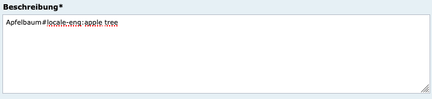
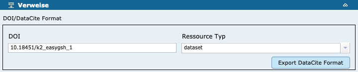
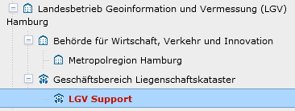
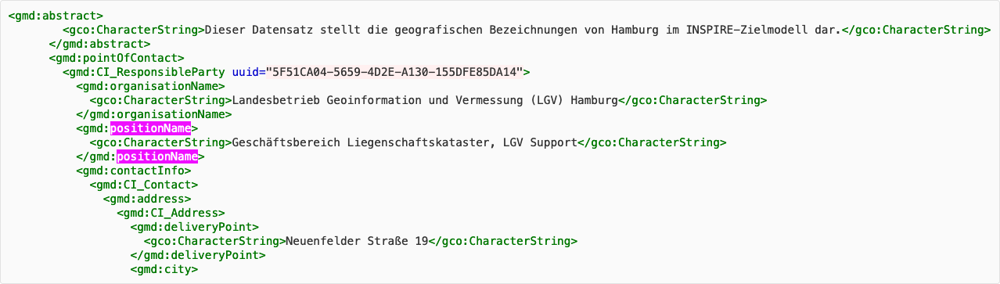

Diese Release Notes betreffen ausschließlich die Versionen 5.6.x. Release Notes älterer Versionen können hier eingesehen werden:
[5.5.x](/5.5.0/about/history.html), [5.4.x](/5.4.0/about/history.html), [5.3.x](/5.3.0/about/history.html), [5.2.x](/5.2.0/about/history.html), [5.1.x](/5.1.0/about/history.html), [5.0.x](/5.0.0/about/history.html), [4.6.x](/4.6.0/about/history.html), [4.5.x](/4.5.0/about/history.html)

## Version 5.6.1

Release 30.10.2020

### Wichtige Änderung

Verbesserung der Sicherheit: Die Passwörter für die Admin-GUI des Mapclients müssen nun per md5 unter "apache-tomcat/conf/tomcat-users.xml" hinterlegt werden und nicht mehr im Klartext.

Ein Passwort in md5 erhält man durch folgende Syntax:  
/PORTAL-INSTALLATIONS-PFAD/apache-tomcat/bin/digest.sh -a md5 PASSWORT

Bei einer Installation per Docker ist es möglich, in der docker-compose.yml das Mapping für die tomcat-users.xml zu entfernen und stattdessen im Bereich "portal:" bei "environment:" folgende Variable zu setzen:  
MAPCLIENT_ADMIN_PW=<PASSWORT_IN_MD5>

- [Feature] [MAPCLIENT] Mapclient Admin-GUI: Account Passwörter verschlüsseln ([REDMINE-2207](https://redmine.informationgrid.eu/issues/2207))

### Bugfixes

- [Bug] [IGE] Editor: Allererstes Anzeigen von Objekt liefert nicht alle Inhalte. "Zugriffsbeschränkungen" fehlen ([REDMINE-2206](https://redmine.informationgrid.eu/issues/2206))
- [Bug] [IGE] Eingabe eines Umringpolygons (WKT) wird in IGE nicht in Druckansicht und Vergleichsansicht berücksichtigt. ([REDMINE-2195](https://redmine.informationgrid.eu/issues/2195))
- [Bug] [CODELIST REPOSITORY] Codelist Rep.: Korrektur der ISO Bezeichnung von "Dienst für den Zugriff auf Objektarten" ([REDMINE-2093](https://redmine.informationgrid.eu/issues/2093))
- [Bug] [IPLUG_IGE] Import von ISO-Metadaten inklusive Hierarchien ([REDMINE-2194](https://redmine.informationgrid.eu/issues/2194))
- [Bug] [IGE] IGE: Ungültige Baumanzeige beim Erstellen eines neuen Ordners ([REDMINE-2114](https://redmine.informationgrid.eu/issues/2114))

### Komponenten

- Portal ([download](https://distributions.informationgrid.eu/ingrid-portal/5.6.1/))
- IGE ([download](https://distributions.informationgrid.eu/ingrid-iplug-ige/5.6.1/))
- Codelist-Repository ([download](https://distributions.informationgrid.eu/ingrid-codelist-repository/5.6.1/))

## Version 5.6.0

Release 19.10.2020

### Wichtige Änderungen

#### Unterstützung der Übersetzung in mehreren Sprachen für bestimmte Felder 

Für die Erfassung von Übersetzungen einer Freitexteingabe gilt folgendes Signalwort, das eine Übersetzung in eine Sprache kennzeichnet: #locale-<ISO-639-2 CODE>
Bei gewünschter Mehrsprachigkeit kann das Feld nach dem Schema "Deutscher Text#locale-eng:English text" gefüllt werden.

Beispiel für einen Titel:
Das ist ein Title von einem Datensatz.#locale-eng:This is a title of a dataset.

Beispiel für einen Abstract:
Das ist ein Abstract von einem Datensatz.
#locale-eng:This is an abstract of a dataset.

Whitespace Zeichen vor oder nach der Kennzeichnung oder Feldanfang oder -ende werden ignoriert.

Die Sprachangaben werden im ISO-19139 Import/Export interpretiert und entsprechend umgesetzt.

<figcaption class="figcaption">Übersetzung in mehrere Sprachen</figcaption>

#### Unterstützung von DOI Eingabe und Export im DataCite Format

Basis ist die Umsetzungsvorschrift unter:
https://redmine.informationgrid.eu/projects/nokis2ingrid/wiki/Mapping_DOI_und_InGrid

<figcaption class="figcaption">DOI Eingabe und Export DataCite</figcaption>

#### Anpassung bezüglich INSPIRE kompatible Unterstützung des Feldes positionName

Die Verwendung von positionName als Feld für die Bezeichnung nachgeordneter Abteilungen einer Behörde ist jetzt möglich.

<figcaption class="figcaption">INSPIRE positionName</figcaption>

<figcaption class="figcaption">INSPIRE positionName</figcaption>

#### Unterstützung WFS 2.0.2

Der Capabilities Assistent kann jetzt Capabilities nach WFS Spezifikation 2.0.2 verarbeiten.

### Liste der Änderungen

- [Bug] [SNS] SNS Iplug Suche schlägt fehl ([REDMINE-2187](https://redmine.informationgrid.eu/issues/2187))
- [Bug] [IGE] IGE: Feld "Datenformat" wird angezeigt, obwohl es nur optional angezeigt werden sollte ([REDMINE-2141](https://redmine.informationgrid.eu/issues/2141))
- [Bug] [IGE] Thesaurus-Navigator Suche Zeigt leere Treffer an ([REDMINE-2126](https://redmine.informationgrid.eu/issues/2126))
- [Bug] [IGE] IGE: Thesaurus-Navigator Probleme mit keyword "Gewerbeflächenentwicklung" ([REDMINE-2110](https://redmine.informationgrid.eu/issues/2110))
- [Bug] [IBUS] iBus Index Management defekt ([REDMINE-2104](https://redmine.informationgrid.eu/issues/2104))
- [Bug] [Codelist Repository] Codelist Patches werden nicht richtig validiert ([REDMINE-2099](https://redmine.informationgrid.eu/issues/2099))
- [Bug] [IGE] IGE: Keine Vorschau für die Vorschaugrafik ([REDMINE-2065](https://redmine.informationgrid.eu/issues/2065))
- [Bug] [IGE] IGE: Räumlicher Anwendungsbereich wird nicht importiert ([REDMINE-1843](https://redmine.informationgrid.eu/issues/1843))
- [Bug] [IGE] IGE: Absturz oder Logout ([REDMINE-1580](https://redmine.informationgrid.eu/issues/1580))
- [Bug] [PORTAL] Portal: Datum in Chroniksuche bleibt nicht erhalten ([REDMINE-736](https://redmine.informationgrid.eu/issues/736))
- [Bug] [IBUS] IBUS: Facetten fehlen ([REDMINE-2159](https://redmine.informationgrid.eu/issues/2159))
- [Bug] [PORTAL] PORTAL: Captcha im Kontaktformular funktioniert nicht ([REDMINE-2144](https://redmine.informationgrid.eu/issues/2144))
- [Bug] [PORTAL] Portal: Anzeige korrigieren ([REDMINE-2117](https://redmine.informationgrid.eu/issues/2117))
- [Bug] [PORTAL] Portal: Layoutprobleme bei mobiler Ergebnisdarstellung ([REDMINE-2087](https://redmine.informationgrid.eu/issues/2087))
- [Bug] [PORTAL] PORTAL: Umbenennung von Registrierungs-Button "Neuer Benutzer" zu "Registrieren" ([REDMINE-2086](https://redmine.informationgrid.eu/issues/2086))
- [Bug] [IGE] Thesaurus-Navigator Suche zeigt leere Treffer an ([REDMINE-2040](https://redmine.informationgrid.eu/issues/2040))
- [Bug] [PORTAL] Portal: Portal startet bei manueller Installation nicht unter Windows ([REDMINE-2035](https://redmine.informationgrid.eu/issues/2035))
- [Bug] [MAPCLIENT] MapClient (Admin): Neue oder kopierte Kategorie mit falschem Label und Einträgen ([REDMINE-2012](https://redmine.informationgrid.eu/issues/2012))
- [Feature] [PORTAL] Portal: Umbenennung des Änderungsdatums in der Portaldarstellung ([REDMINE-2083](https://redmine.informationgrid.eu/issues/2083))
- [Feature] [IGE] IGE: XML-Codierung für useConstraints ändern ([REDMINE-1875](https://redmine.informationgrid.eu/issues/1875))
- [Feature] [IGE] IGE: Verbesserung des Imports von srv:operatesOn Elementen in Geodatendiensten ([REDMINE-1855](https://redmine.informationgrid.eu/issues/1855))
- [Feature] [CODELIST REPOSITORY] Erweiterung der Codelist 6500 (Lizenzen) um den Eintrag "Nutzung der Daten nur nach Rücksprache mit dem Dateneigentümer" ([REDMINE-1840](https://redmine.informationgrid.eu/issues/1840))
- [Feature] [IGE] IGE: Anpassung InGrid Editor bzgl. INSPIRE kompatible Unterstützung des Feldes positionName ([REDMINE-1834](https://redmine.informationgrid.eu/issues/1834))
- [Feature] [IGE] IGE: zusätzliches Feld - Konformität getestet mit ... am... ([REDMINE-1817](https://redmine.informationgrid.eu/issues/1817))
- [Feature] [IGE] IGE: XML-Codierung für accessConstraints ändern ([REDMINE-1815](https://redmine.informationgrid.eu/issues/1815))
- [Feature] [IGE] IGE: neue MD-Felder - Qualitätsangaben erweitern ([REDMINE-1783](https://redmine.informationgrid.eu/issues/1783))
- [Feature] [IGE] IGE: Maßstabsangabe für Objektart Dienst im Katalog ausgeben ([REDMINE-1665](https://redmine.informationgrid.eu/issues/1665))
- [Feature] [IGE] IGE: Capabilities Assistent soll WFS Capabilities nach Spezifikation 2.0.2 verarbeiten können ([REDMINE-1563](https://redmine.informationgrid.eu/issues/1563))
- [Feature] [IGE] IGE: Verhalten der Checkbox "OpenData" ([REDMINE-1556](https://redmine.informationgrid.eu/issues/1556))
- [Feature] [IGE] IGE: Feld "Datengrundlage" in mehrzeiliges Feld ändern ([REDMINE-1429](https://redmine.informationgrid.eu/issues/1429))
- [Feature] [IGE] IGE: Feld "Durch die Ressource abgedeckte Zeitspanne" anpassen ([REDMINE-1215](https://redmine.informationgrid.eu/issues/1215))
- [Feature] [PORTAL] Erstellung einer Seite "Barrierefreiheit" ([REDMINE-2137](https://redmine.informationgrid.eu/issues/2137))
- [Feature] [IGE] IGE: Höhere Kompatibilität bei der Verarbeitung von Referenzsystemangaben in OGC Capabilities ([REDMINE-2108](https://redmine.informationgrid.eu/issues/2108))
- [Feature] [MAPCLIENT] MAPCLIENT: Problem melden - kml Infos in Permalink hinterlegen ([REDMINE-2106](https://redmine.informationgrid.eu/issues/2106))
- [Feature] [MAPCLIENT] MAPCLIENT: "Hilfe" und "Problem melden" URLs anpassen ([REDMINE-2043](https://redmine.informationgrid.eu/issues/2043))
- [Feature] [INTERFACE-SEARCH] Berücksichtigung des neuen Feldes "Metadata-Datum" im interface-search bei der Bestimmung des modified Feldes in der OpenSearch Antwort ([REDMINE-2032](https://redmine.informationgrid.eu/issues/2032))
- [Feature] [MAPCLIENT] MAPCLIENT: Aufräumjob für Karten ohne Kategorienzuordnung ([REDMINE-2025](https://redmine.informationgrid.eu/issues/2025))
- [Feature] [MAPCLIENT] MAPCLIENT: Warnhinweis beim Importieren von Layern ohne Extent (Admin-GUI)  ([REDMINE-2024](https://redmine.informationgrid.eu/issues/2024))
- [Feature] [IGE] Konfiguration der URL des NOMINATIM Dienstes ([REDMINE-1860](https://redmine.informationgrid.eu/issues/1860))
- [Feature] [IGE] Beschreibung von OGC Dienst SensorThings API (STA) ermöglichen ([REDMINE-1234](https://redmine.informationgrid.eu/issues/1234))
- [Feature] [IPLUG_IGE] Darstellung von IGE-Ordnern in der Datenkatalogansicht im Portal ([REDMINE-1102](https://redmine.informationgrid.eu/issues/1102))

Profil BKG

- [Bug] [BKG] BKG: BUG: leeres Feld Nutzungsbedingungen sollte nicht in der Iso-Xml Anzeige als otherRestrictions ausgegeben werden. ([REDMINE-2070](https://redmine.informationgrid.eu/issues/2070))

Profil NOKIS

- [Feature] [IGE] Unterstützung der Übersetzung in mehreren Sprachen für bestimmte Felder ([REDMINE-1882](https://redmine.informationgrid.eu/issues/1882))
- [Feature] [IGE] Anpassung der unterstützten Metadatenklassen ([REDMINE-1849](https://redmine.informationgrid.eu/issues/1849))
- [Feature] [IGE] Unterstützung für die Eingabe von Geometry Context ([REDMINE-1846](https://redmine.informationgrid.eu/issues/1846))
- [Feature] [IGE] Unterstützung von DOI Eingabe und Export im DataCite Format ([REDMINE-1838](https://redmine.informationgrid.eu/issues/1838))
- [Feature] [IGE] IGE Backend: ISO Abbildung von verticalCRS (358) überarbeiten. ([REDMINE-1406](https://redmine.informationgrid.eu/issues/1406))
- [Feature] [IGE] Eingabefelder für Vektorformat (MD_VectorSpatialRepresentation) überarbeiten ([REDMINE-1398](https://redmine.informationgrid.eu/issues/1398))
- [Feature] [IGE] Eingabefelder für Raster/Gridformat (MD_GridSpatialRepresentation) überarbeiten ([REDMINE-1267](https://redmine.informationgrid.eu/issues/1267))

Profil NUMIS

- [Feature] [IGE] IGE: UploadCleanupJob soll bei Fehler eine Email mit einer aussagekräftigen Fehlermeldung verschicken. ([REDMINE-2007](https://redmine.informationgrid.eu/issues/2007))
- [Feature] [PORTAL] Kleinere Verbesserungen/Anpassungen NUMIS/UVP-Portal ([REDMINE-1821](https://redmine.informationgrid.eu/issues/1821))

Profil UVP

- [Bug] [PORTAL] Anzeige von Vorschaltseiten funtioniert nicht (404). ([REDMINE-2151](https://redmine.informationgrid.eu/issues/2151))
- [Bug] [PORTAL] UVP: Bei der Auswahl von mehreren UVP Nummern, die der gleichen UVP-G Kategorie zugeordnet sind, werden die UVP-G Kategorien mehrfach im Teaser dargestellt. ([REDMINE-2092](https://redmine.informationgrid.eu/issues/2092))
- [Bug] [PORTAL] Raumsuche funktioniert im UVP-Portal nicht, wenn nach Aktualität sortiert wird ([REDMINE-2164](https://redmine.informationgrid.eu/issues/2164))
- [Bug] [PORTAL] UVP-Portal: Funktionalität "i" Button bei den Verfahrensschritten herstellen ([REDMINE-2100](https://redmine.informationgrid.eu/issues/2100))
- [Feature] [PORTAL] UVP Link von saarländischer Seite anpassen ([REDMINE-2150](https://redmine.informationgrid.eu/issues/2150))

### Komponenten

- Portal ([download](https://distributions.informationgrid.eu/ingrid-portal/5.6.0/))
- Codelist-Repository ([download](https://distributions.informationgrid.eu/ingrid-codelist-repository/5.6.0/))
- iBus ([download](https://distributions.informationgrid.eu/ingrid-ibus/5.6.0/))
- Interface CSW ([download](https://distributions.informationgrid.eu/ingrid-interface-csw/5.6.0/))
- Interface Search ([download](https://distributions.informationgrid.eu/ingrid-interface-search/5.6.0/))
- iPlug DSC ([download](https://distributions.informationgrid.eu/ingrid-iplug-dsc/5.6.0/))
- iPlug IGE ([download](https://distributions.informationgrid.eu/ingrid-iplug-ige/5.6.0/))
- iPlug SNS ([download](https://distributions.informationgrid.eu/ingrid-iplug-sns/5.6.0/))
- iPlug WFS-DSC ([download](https://distributions.informationgrid.eu/ingrid-iplug-wfs-dsc/5.6.0/))
