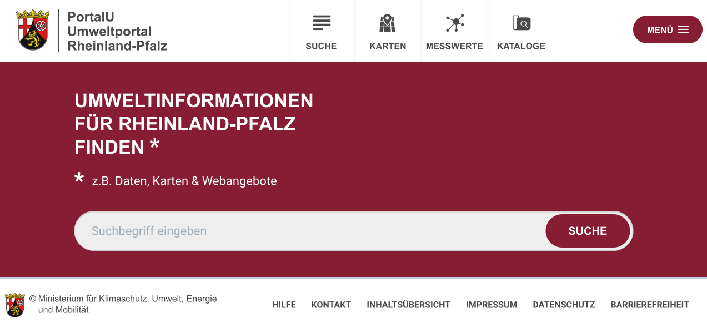
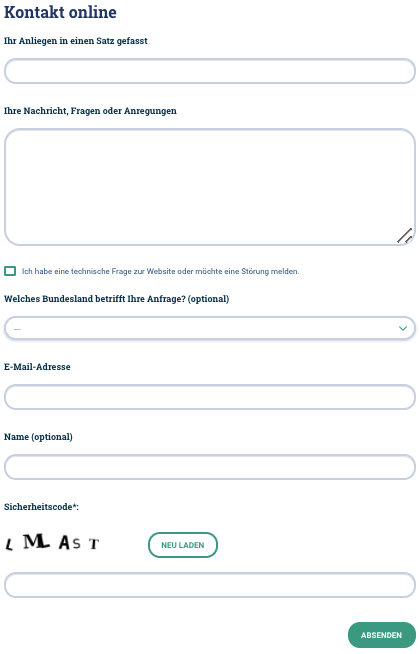

Diese Release Notes betreffen ausschließlich die Versionen 5.8.x. Release Notes älterer Versionen können hier eingesehen werden:
[5.7.x](/5.7.0/about/history.html), [5.6.x](/5.6.0/about/history.html), [5.5.x](/5.5.0/about/history.html), [5.4.x](/5.4.0/about/history.html), [5.3.x](/5.3.0/about/history.html), [5.2.x](/5.2.0/about/history.html), [5.1.x](/5.1.0/about/history.html), [5.0.x](/5.0.0/about/history.html), [4.6.x](/4.6.0/about/history.html), [4.5.x](/4.5.0/about/history.html)

## Version 5.8.3

Release 14.06.2021

### Liste der Änderungen

InGrid
- [Bug] [IGE] Stabilisierung der automatischen DB Erstellung
- [Bug] [IGE] Stabilisierung der Verschlagwortung während des Imports

### Komponenten

- IPLUG-IGE ([download](https://distributions.informationgrid.eu/ingrid-iplug-ige/5.8.3/))
- UDK-IMPORTER ([download](https://distributions.informationgrid.eu/ingrid-udk-importer/5.8.3/))

## Version 5.8.2

Release 10.06.2021

### Liste der Änderungen

InGrid

- [Feature] [MAPCLIENT] GPX import - Beschreibung fehlt ([REDMINE-2519](https://redmine.informationgrid.eu/issues/2519))
- [Bug] [MAPCLIENT] Identifier der Datenquelle in Verbindung mit Anzeig des Kartenlayers ([REDMINE-2460](https://redmine.informationgrid.eu/issues/2460))
- [Bug] [IGE] Hamburger Logik nach Update auf 5.8.1 für LGV und Dataport ([REDMINE-2514](https://redmine.informationgrid.eu/issues/2514))

UVP

- [Bug] [PORTAL] Fehler bei Archivierung von Dateien ([REDMINE-2526](https://redmine.informationgrid.eu/issues/2526))

### Komponenten

- Portal ([download](https://distributions.informationgrid.eu/ingrid-portal/5.8.2/))

## Version 5.8.1

Release 26.05.2021

### Liste der Änderungen

InGrid

- [Bug] [PORTAL] Popup öffnet sich in Chrome 90 nicht mehr ([REDMINE-2493](https://redmine.informationgrid.eu/issues/2493))
- [Bug] [IGE] MD-Import verbessern - Vorschaubild-Beschreibung  ([REDMINE-2488](https://redmine.informationgrid.eu/issues/2488))
- [Bug] [PORTAL] Anzeige des Identifikators der Datenquelle defekt ([REDMINE-2459](https://redmine.informationgrid.eu/issues/2459))
- [Bug] [IGE] Übernahme neuer Metadatenkatalog Saarland ins Produktivsystem ([REDMINE-2405](https://redmine.informationgrid.eu/issues/2405))
- [Bug] [IGE] Kontakt für die Ressource, wenn auch glechzeitig Kontakt für die Metadaten, wird nicht richtig importiert ([REDMINE-1986](https://redmine.informationgrid.eu/issues/1986))
- [Bug] [PORTAL] HMDK: Inhalt von Fachbezug/Systemumgebung erscheint bei Beschreibung ([REDMINE-2409](https://redmine.informationgrid.eu/issues/2409))
- [Feature] [IGE] Anpassung der Referenzierung des Metadaten-Schemas und -Namespaces ([REDMINE-1876](https://redmine.informationgrid.eu/issues/1876))
- [Feature] [IGE] transferOptions / Abfolge in xml ([REDMINE-2418](https://redmine.informationgrid.eu/issues/2418))
- [Feature] [IGE] WCS-Dienst mit GetCapabilities-Assistent erfassen ([REDMINE-2381](https://redmine.informationgrid.eu/issues/2381))
- [Feature] [CODELIST REPOSITORY] Zusätzlicher Wert in Codeliste "Datenformat - Name" - GeoTIFF ([REDMINE-2376](https://redmine.informationgrid.eu/issues/2376))
- [Feature] [IGE] Validierung GML+Version für INSPIRE-relevante Datensätze entfernen ([REDMINE-2281](https://redmine.informationgrid.eu/issues/2281))
- [Feature] [IGE] Erfassung von Metadaten in English ([REDMINE-967](https://redmine.informationgrid.eu/issues/967))
- [Feature] [IPLUG_IGE] Dokumentation von Voraussetzungen in den WMS Capabilities für die automatische Erzeugung von Geodatensätzen aus Layerinformationen durch den GetCapabilities Assistent ([REDMINE-2372](https://redmine.informationgrid.eu/issues/2372))

BKG

- [Feature] [IGE] Engl.: Funktionalität "Freie Schlagworte" autom. einem Thesaurus zuordnen - Anpassung an engl.Sprache ([REDMINE-2463](https://redmine.informationgrid.eu/issues/2463))
- [Feature] [PORTAL] Portalanzeige: Filteranzeige ergänzen - Anwendungen ([REDMINE-2300](https://redmine.informationgrid.eu/issues/2300))

InGrid Installation Schleswig-Holstein

- [Bug] [PORTAL] Aktive Seite ist schlecht erkennbar beim Paging in Ergebnisliste ([REDMINE-2457](https://redmine.informationgrid.eu/issues/2457))

MetaVer

- [Feature] [CSW] In der CSW Schnittstelle für das Hamburger Transparenzportal soll der alte GML Namespace verwendet werden ([REDMINE-2505](https://redmine.informationgrid.eu/issues/2505))
- [Feature] [PORTAL] Anpassung Kontakt-Formular MetaVer Test für Zammad ([REDMINE-2461](https://redmine.informationgrid.eu/issues/2461))

UVP

- [Bug] [PORTAL] Anmeldeseite wird von Suchmaschinen indexiert ([REDMINE-2462](https://redmine.informationgrid.eu/issues/2462))

### Komponenten

- CODELIST-REPOSITORY ([download](https://distributions.informationgrid.eu/ingrid-codelist-repository/5.8.1/))
- IPLUG-CSW-DSC ([download](https://distributions.informationgrid.eu/ingrid-iplug-csw-dsc/5.8.1/))
- INTERFACE-CSW ([download](https://distributions.informationgrid.eu/ingrid-interface-csw/5.8.1/))
- PORTAL ([download](https://distributions.informationgrid.eu/ingrid-portal/5.8.1/))
- IPLUG-IGE ([download](https://distributions.informationgrid.eu/ingrid-iplug-ige/5.8.1/))


## Version 5.8.0

Release 16.04.2021

### Wichtige Änderungen

#### Umstellung Umweltportal PortalU von Rheinland-Pfalz auf neues Design

Am 04.05.2021 wurde das neue Layout für www.portalu.rlp.de live geschaltet:


<figcaption class="figcaption">Neues Layout für PortalU</figcaption>

#### Änderung am Interface-Search

Wegen eines Problems bei der Anzeige von extern gekoppelten Datensätzen im Atom-Feed Client, muss die Konfiguration angepasst
werden. Da diese meist von den Docker-Containern ausgelagert wird, muss diese Anpassung manuell erfolgen. Siehe dazu auch
[Ticket #2366](https://redmine.informationgrid.eu/issues/2366)

Folgende Eigenschaft muss in der Datei `interface-search.properties` angepasst werden:

```properties
# atom.download.dataset.feed.extension=/dataset/{servicefeed-uuid}/{datasetfeed-uuid}
atom.download.dataset.feed.extension=/dataset/{servicefeed-uuid}?datasetUuid={datasetfeed-uuid}
```

#### Erweiterung des Kontaktformulars von UVP für Zammad

Am 01.03.2021 wurde das Open-Source-Ticketsystem namens [Zammad](https://de.wikipedia.org/wiki/Zammad) in Betrieb genommen. Ziele sind eine Verbesserung des Supports durch die Nachverfolgung der Anfragen sowie die Sicherstellung der Zuständigkeiten.
Dafür wurde auch das [Kontaktformular auf www.uvp-verbund.de](https://www.uvp-verbund.de/kontakt) angepasst:


<figcaption class="figcaption">Erweiterung des Kontaktformulars von UVP für Zammad</figcaption>


### Liste der Änderungen

InGrid

- [Bug] [IBUS] Index nach Indizierung nicht durchsuchbar ([REDMINE-2385](https://redmine.informationgrid.eu/issues/2385))
- [Bug] [IGE] Paging/ Anzeige von Suchergebnismengen nicht korrekt ([REDMINE-2378](https://redmine.informationgrid.eu/issues/2378))
- [Bug] [IPLUG-SNS] Chronik liefert manchmal keine Ergebnisse ([REDMINE-2355](https://redmine.informationgrid.eu/issues/2355))
- [Bug] [IGE] Hilfeseite im IGE wird nicht angezeigt ([REDMINE-2354](https://redmine.informationgrid.eu/issues/2354))
- [Bug] [IGE] IGE: Umlaute werden falsch angezeigt ([REDMINE-2331](https://redmine.informationgrid.eu/issues/2331))
- [Bug] [IGE] Weitere Verbesserung der operatesOn Elemente beim Import ([REDMINE-2330](https://redmine.informationgrid.eu/issues/2330)
  )
- [Bug] [IGE] Editor - Verschlagwortungsassistent kann Text mit % nicht interpretieren ([REDMINE-2321](https://redmine.informationgrid.eu/issues/2321))
- [Bug] [IPLUG-CSW] Verbesserung der Suche nach Karten und der Suche im Karten Client bei Daten aus einem CSW iPlug ([REDMINE-2287](https://redmine.informationgrid.eu/issues/2287))
- [Bug] [IPLUG_IGE] iPlug IGE: AnsprechpartnerMD wird beim ISO-Export auch als Ansprechpartner für den Datensatz gesetzt ([REDMINE-2277](https://redmine.informationgrid.eu/issues/2277))
- [Bug] [PORTAL] Portal: Facetten fehlen ([REDMINE-1575](https://redmine.informationgrid.eu/issues/1575))
- [Bug] [PORTAL] Portal: Facetten überlagen Footer ([REDMINE-2373](https://redmine.informationgrid.eu/issues/2373))
- [Bug] [IGE] IGE: Feld "Konformität" / "geprüft mit" - Anzeige des Default-Wert nach Import ([REDMINE-2348](https://redmine.informationgrid.eu/issues/2348))
- [Bug] [IGE] IGE: Label und Tooltip aktualisieren ([REDMINE-2338](https://redmine.informationgrid.eu/issues/2338))
- [Bug] [IGE] Feld "Vektorformat" - Beschriftung der Tabellenspalte Geometrietyp fehlerhaft ([REDMINE-2336](https://redmine.informationgrid.eu/issues/2336))
- [Bug] [PORTAL] Portal: In Katalogdarstellung sollen nur Katalog mit Suchergebnissen dargestellt werden ([REDMINE-2303](https://redmine.informationgrid.eu/issues/2303))
- [Bug] [PORTAL] Anzeige von Kurzbezeichnung ist in der Portal Detaildarstellung falsch, wenn eine AdV Produktgruppe angegeben wurden.
  ([REDMINE-2290](https://redmine.informationgrid.eu/issues/2290))
- [Bug] [IGE] Bei einem Geodatensatzes sollen nur die Verweise vom Typ "Verweis zum Dienst" aus dem gekoppelten Geodatendienst für die Darstellung im Portal übernommen werden. ([REDMINE-2228](https://redmine.informationgrid.eu/issues/2228))
- [Bug] [IGE] IGE: Verweistypen werden nicht importiert ([REDMINE-1844](https://redmine.informationgrid.eu/issues/1844))
- [Feature] [IBUS] iBus: Verwaltung des Konfigurationsindex ([REDMINE-2342](https://redmine.informationgrid.eu/issues/2342))
- [Feature] [PORTAL] Aktualisierung TOMCAT auf aktuellere Version ([REDMINE-2294](https://redmine.informationgrid.eu/issues/2294))

InGrid Installation Rheinland-Pfalz

- [Feature] [PORTAL] PortalU RLP - Umstellung auf neues Design ([REDMINE-2185](https://redmine.informationgrid.eu/issues/2185))

InGrid Installation Schleswig-Holstein

- [Feature] [PORTAL] Erstellung Portal-Profil ([REDMINE-2256](https://redmine.informationgrid.eu/issues/2256))

MetaVer

- [Feature] [PORTAL] Anpassung Kontakt-Formular UVP Test für Zammad ([REDMINE-2345](https://redmine.informationgrid.eu/issues/2345))

NUMIS

- [Bug] [INTERFACE-SEARCH] Bei Download-Diensten werden die Downloaddateien und Nutzungsbedingungen nicht im ATOM-Client/Feed angezeigt, wenn die dargestellten Daten per GetRecordById-Request verkoppelt sind ([REDMINE-2366](https://redmine.informationgrid.eu/issues/2366))
- [Bug] [PORTAL] Keine Legende beim Ausdruck eines Kartenausschnitts ([REDMINE-2399](https://redmine.informationgrid.eu/issues/2399))
- [Bug] [INTERFACE-SEARCH] Keine Dowloads im ATOM Service Download Feed ([REDMINE-2340](https://redmine.informationgrid.eu/issues/2340))
- [Bug] [PORTAL] Portal: Anpassung Darstellung Teaser Boxen ([REDMINE-2315](https://redmine.informationgrid.eu/issues/2315))

UVP

- [Bug] [PORTAL] Suchergebnisseite enthält "Mitgliedsgemeinden:", auch wenn keine vorhanden sind ([REDMINE-2435](https://redmine.informationgrid.eu/issues/2435))
- [Bug] [CODELIST-REPOSITORY] In den UVP Nummern von HH (Codeliste 9001) sind auch UVP Nummern aus Sachsen enthalten ([REDMINE-2365](https://redmine.informationgrid.eu/issues/2365))
- [Feature] [PORTAL] Entfernen des Hinweises auf die Bauleitplanung in der Vorschaltseite von NRW ([REDMINE-2401](https://redmine.informationgrid.eu/issues/2401))
- [Feature] [IGE] Protokollierung von gelöschten Unterdokumenten ([REDMINE-2319](https://redmine.informationgrid.eu/issues/2319))
- [Feature] [PORTAL] RSS-Feed für den UVP-Katalog ([REDMINE-582](https://redmine.informationgrid.eu/issues/582))
- [Feature] [IGE] Optionale Indexierung von neg. Vorprüfungen ohne Raumbezug ([REDMINE-2346](https://redmine.informationgrid.eu/issues/2346))

### Komponenten

- CODELIST-REPOSITORY ([download](https://distributions.informationgrid.eu/ingrid-codelist-repository/5.8.0/))
- INTERFACE-SEARCH ([download](https://distributions.informationgrid.eu/ingrid-interface-search/5.8.0/))
- IPLUG-CSW-DSC ([download](https://distributions.informationgrid.eu/ingrid-iplug-csw-dsc/5.8.0/))
- IPLUG-WFS-DSC ([download](https://distributions.informationgrid.eu/ingrid-iplug-wfs-dsc/5.8.0/))
- IPLUG-BLP ([download](https://distributions.informationgrid.eu/ingrid-iplug-blp/5.8.0/))
- IPLUG-SNS ([download](https://distributions.informationgrid.eu/ingrid-iplug-sns/5.8.0/))
- IBUS ([download](https://distributions.informationgrid.eu/ingrid-ibus/5.8.0/))
- PORTAL ([download](https://distributions.informationgrid.eu/ingrid-portal/5.8.0/))
- IPLUG-IGE ([download](https://distributions.informationgrid.eu/ingrid-iplug-ige/5.8.0/))

