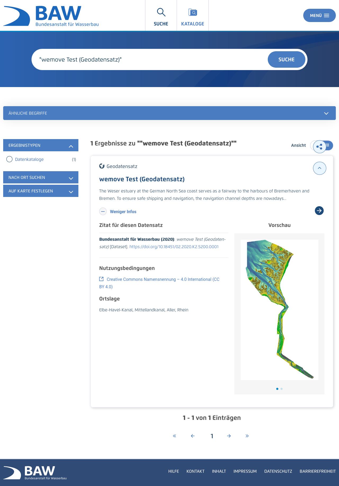
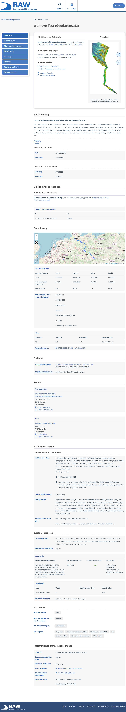

Diese Release Notes betreffen ausschließlich die Versionen 5.10.x. Release Notes älterer Versionen können hier eingesehen werden:
[5.9.x](/5.9.0/about/history.html), [5.8.x](/5.8.0/about/history.html), [5.7.x](/5.7.0/about/history.html), [5.6.x](/5.6.0/about/history.html), [5.5.x](/5.5.0/about/history.html), [5.4.x](/5.4.0/about/history.html), [5.3.x](/5.3.0/about/history.html), [5.2.x](/5.2.0/about/history.html), [5.1.x](/5.1.0/about/history.html), [5.0.x](/5.0.0/about/history.html), [4.6.x](/4.6.0/about/history.html), [4.5.x](/4.5.0/about/history.html)

## Version 5.10.1.1

Release 12.12.2021

### Liste der Änderungen

- [Bug] [SYSTEM] Kritische Sicherheitslücke Log4Shell in der weitverbreiteten Java-Logging-Bibliothek log4j ([REDMINE-3292](https://redmine.informationgrid.eu/issues/3292))

### Komponenten

- CODELIST-REPOSITORY ([download](https://distributions.informationgrid.eu/ingrid-codelist-repository/5.10.1.1/))
- IBUS ([download](https://distributions.informationgrid.eu/ingrid-ibus/5.10.1.1/))
- INTERFACE-SEARCH ([download](https://distributions.informationgrid.eu/ingrid-interface-search/5.10.1.1/))
- IPLUG-BLP ([download](https://distributions.informationgrid.eu/ingrid-iplug-blp/5.10.1.1/))
- IPLUG-CSW-DSC ([download](https://distributions.informationgrid.eu/ingrid-iplug-csw-dsc/5.10.1.1/))
- IPLUG-IGE ([download](https://distributions.informationgrid.eu/ingrid-iplug-ige/5.10.1.1/))
- IPLUG-SE ([download](https://distributions.informationgrid.eu/ingrid-iplug-se/5.10.1.1/))
- IPLUG-SNS ([download](https://distributions.informationgrid.eu/ingrid-iplug-sns/5.10.1.1/))
- IPLUG-WFS-DSC ([download](https://distributions.informationgrid.eu/ingrid-iplug-wfs-dsc/5.10.1.1/))
- PORTAL ([download](https://distributions.informationgrid.eu/ingrid-portal/5.10.1.1/))

## Version 5.10.1

Release 23.11.2021

### Liste der Änderungen

- [Feature] [IGE] Anpassung der Zeitbezüge in "Durch die Ressource abgedeckte Zeitspanne" redux ([REDMINE-2903](https://redmine.informationgrid.eu/issues/2903))
- [Feature] [IGE] Namensnennung 3.0 Deutschland (CC BY 3.0 DE) in Codeliste 6500 aufnehmen ([REDMINE-2837](https://redmine.informationgrid.eu/issues/2837))
- [Bug] [MAPCLIENT] SSRF mit XML External Entity (XXE) Schwachstelle (2) ([REDMINE-3161](https://redmine.informationgrid.eu/issues/3161))
- [Bug] [IGE] Fehler bei Upload von Vorschaugrafiken ([REDMINE-2920](https://redmine.informationgrid.eu/issues/2920))
- [Bug] [IGE] Feld Historie bei Geodatendiensten wird nicht importiert. ([REDMINE-1845](https://redmine.informationgrid.eu/issues/1845))

Profil Schleswig-Holstein

- [Feature] [PORTAL] Anpassen der Hilfetexte ([REDMINE-2644](https://redmine.informationgrid.eu/issues/2644))
- [Bug] [PORTAL] Link aus Email an neu-registrierte Benutzer ([REDMINE-3144](https://redmine.informationgrid.eu/issues/3144))

Profil MetaVer

- [Bug] [PORTAL] Darstellung der Webseiten Treffer fehlerhaft ([REDMINE-3105](https://redmine.informationgrid.eu/issues/3105))

Profil UVP

- [Feature] [PORTAL] UVP: Beschränkung der Vorhaben im Überblick auf der Startseite auf UVP- und Ausländische Verfahren ([REDMINE-1583](https://redmine.informationgrid.eu/issues/1583))
- [Feature] [CODELIST-REPOSITORY] Aktualisierung der UVP Nummern Sachsen ([REDMINE-3100](https://redmine.informationgrid.eu/issues/3100))

### Komponenten

- CODELIST-REPOSITORY ([download](https://distributions.informationgrid.eu/ingrid-codelist-repository/5.10.1/))
- IPLUG-CSW-DSC ([download](https://distributions.informationgrid.eu/ingrid-iplug-csw-dsc/5.10.1/))
- IPLUG-IGE ([download](https://distributions.informationgrid.eu/ingrid-iplug-ige/5.10.1/))
- PORTAL ([download](https://distributions.informationgrid.eu/ingrid-portal/5.10.1/))

## Version 5.10.0.1

Release 11.11.2021

### Liste der Änderungen

- [Bug] [PORTAL] SSRF mit XML External Entity (XXE) Schwachstelle (2) ([REDMINE-3161](https://redmine.informationgrid.eu/issues/3161))
- [Bug] [Portal] Darstellung der Webseiten Treffer fehlerhaft ([REDMINE-3105](https://redmine.informationgrid.eu/issues/3105))

### Komponenten

- PORTAL ([download](https://distributions.informationgrid.eu/ingrid-portal/5.10.0.1/))

## Version 5.10.0

Release 21.10.2021

### Wichtige Änderungen

#### Erweitertes Layout für BAW Datenrepository

Das Portal-Layout vom BAW Datenrepository-Profil wurde aktualisiert. Für die Suchergebnisansicht und die "Karteikarte" in der Detailansicht wird zusätzlich "Zitat für diesen Datensatz" angezeigt.

<figcaption class="figcaption">Erweitertes Layout für BAW Datenrepository Suche</figcaption>

<figcaption class="figcaption">Erweitertes Layout für BAW Datenrepository Suche Detail</figcaption>

#### Verbesserung der Suche in den InGrid-Komponenten

Folgende Verbesserungen an der InGrid-Suche wurden umgesetzt:

##### Ersetzen des Decompound-Analyzer durch nGram-Analyzer
Hierdurch werden auch Wortteile gefunden, die durch die bisherige Worttrennung nicht erfasst wurden.
Durch die Kombination aus nGram- und Edge-nGram-Analyzer ist es möglich, Wortteile am Anfang des Wortes stärker zu gewichten als Wortteile die im Wort enthalten sind.
    
##### Booster für Suchfelder
Durch den Boost auf Suchfelder können Ergebnisse abhängig davon, wo der Suchbegriff vorkommt, gewichtet werden. 
Die Standard-Einstellung ist:
`title^10.0,title.edge_ngram^4.0,title.ngram^2.0,summary,summary.edge_ngram^0.4,summary.ngram^0.2,content^0.2,content.ngram^0.1`
Damit wird der Titel stärker als die Beschreibung und die Beschreibung stärker als der sonstige Inhalt gewichtet. Der Suchbegriff als ganzes Wort wird stärker gewichtet als Wortanfang und Wortteile. 
**Achtung: Die Einstellung von durchsuchten Feldern und Boost kann in der Datei `application-default.properties` im Eintrag `elastic.indexSearchDefaultFields` überschrieben werden. Hier gemachte Angaben müssen gegebenenfalls angepasst werden.**
    
##### Zusätzliche Suche als Such-Phrase
Durch die Suche als Such-Phrase ist es möglich, beispielsweise nach Titeln zu suchen, die Zeichen mit einer Sonderfunktion innerhalb der Suche haben (z.B. '-' für Negation oder ':' für die Feldsuche).
Durch die Umstellung der Abfrage-Struktur wurde ebenfalls das Problem behoben, dass bei einer Suche mit Oder-Verknüpfung die Facettierung nicht korrekt funktioniert hat.
    
##### Zusätzliches Sortierkriterium
Durch die Einführung eines zusätzlichen Hash-Feldes, das als sekundäres Sortierkriterium verwendet wird, entsteht bei Ergebnissen mit gleicher Relevanz im primären Sortierkriterium eine bessere Durchmischung der Ergebnisse aus verschiedenen Quellen.

### Liste der Änderungen

- [Feature] [IGE] Namensnennung 3.0 Deutschland (CC BY 3.0 DE) in Codeliste 6500 aufnehmen ([REDMINE-2837](https://redmine.informationgrid.eu/issues/2837))
- [Feature] [IGE] transferOptions / Abfolge in xml - Ergänzende Anpassungen ([REDMINE-2600](https://redmine.informationgrid.eu/issues/2600))
- [Feature] [IPLUG_IGE] Extern-gekoppelte Datensätze werden regelmäßig analysiert ([REDMINE-2389](https://redmine.informationgrid.eu/issues/2389))
- [Feature] [PORTAL] Integration Portalprofil MDI-DE (NOKIS) ([REDMINE-2246](https://redmine.informationgrid.eu/issues/2246))
- [Feature] [SYSTEM] Umsetzung Verbesserung der Suche in den InGrid Komponenten ([REDMINE-2085](https://redmine.informationgrid.eu/issues/2085))
- [Feature] [PORTAL] Aktualisierung TOMCAT Version ([REDMINE-2926](https://redmine.informationgrid.eu/issues/2926))
- [Feature] [PORTAL] Verstecken der Tomcat Version in Tomcat Fehlerseiten. ([REDMINE-2925](https://redmine.informationgrid.eu/issues/2925))
- [Feature] [PORTAL] Katalogansicht dynamisch aufbauen (ohne Reload der Portalseite) ([REDMINE-2610](https://redmine.informationgrid.eu/issues/2610))
- [Feature] [IGE] Anpassung der Zeitbezüge in "Durch die Ressource abgedeckte Zeitspanne" ([REDMINE-2184](https://redmine.informationgrid.eu/issues/2184))
- [Feature] [PORTAL] Erkennung von Brute-Force-Attacken in Anmeldeprozess von Portal ([REDMINE-1313](https://redmine.informationgrid.eu/issues/1313))
- [Bug] [IGE] Fehler bei Upload von Vorschaugrafiken ([REDMINE-2920](https://redmine.informationgrid.eu/issues/2920))
- [Bug] [IGE] Operationen bearbeiten enthält Index statt Wert ([REDMINE-2749](https://redmine.informationgrid.eu/issues/2749))
- [Bug] [IGE] Fehler beim Exportieren einer Codeliste ([REDMINE-2489](https://redmine.informationgrid.eu/issues/2489))
- [Bug] [IGE] Veröffentlichung von Datensätzen mit Veröffentlichung "Internet" unter Ordner mit Veröffentlichung "amtsintern" möglich. ([REDMINE-2096](https://redmine.informationgrid.eu/issues/2096))
- [Bug] [IGE] Feld Historie bei Geodatendiensten wird nicht importiert. ([REDMINE-1845](https://redmine.informationgrid.eu/issues/1845))
- [Bug] [IPLUG-SE] Einschränkung der Suche nach domain (Parameter "site") funktioniert nicht ([REDMINE-1477](https://redmine.informationgrid.eu/issues/1477))
- [Bug] [IPLUG-SE] Aufruf beim Kopieren von Instanzen liefert falsches Resultat ([REDMINE-1464](https://redmine.informationgrid.eu/issues/1464))
- [Bug] [IPLUG-SE] Bestimmte URLs führen zu Problemen beim Ausführen eines Crawls ([REDMINE-1286](https://redmine.informationgrid.eu/issues/1286))
- [Bug] [MAPCLIENT] SSRF mit XML External Entity (XXE) Schwachstelle im MapClient beheben ([REDMINE-2924](https://redmine.informationgrid.eu/issues/2924))
- [Bug] [IGE] Lagegenauigkeit wird nicht importiert ([REDMINE-2755](https://redmine.informationgrid.eu/issues/2755))
- [Bug] [IPLUG_IGE] ISO-XML: Angabe des DCP-Elements unzureichend abgebildet ([REDMINE-2245](https://redmine.informationgrid.eu/issues/2245))

Profil BAW Datenrepository

- [Feature] [PORTAL] Language-Switcher Portlet aktivieren ([REDMINE-2790](https://redmine.informationgrid.eu/issues/2790))
- [Feature] [PORTAL] Portal-Layout für das baw_doi Profil aktualisieren ([REDMINE-2747](https://redmine.informationgrid.eu/issues/2747))
- [Feature] [PORTAL] BAW Datenrepository ([REDMINE-2664](https://redmine.informationgrid.eu/issues/2664))
- [Bug] [PORTAL] Style von Textboxen verbessern ([REDMINE-2323](https://redmine.informationgrid.eu/issues/2323))

Profil BKG

- [Bug] [IGE] Zeichenkodierung fehlerhaft ([REDMINE-2822](https://redmine.informationgrid.eu/issues/2822))

Profil MetaVer

- [Feature] [IGE] IGE-Tabelle Vorschaugrafik ([REDMINE-2832](https://redmine.informationgrid.eu/issues/2832))
- [Feature] [PORTAL] ReDesign MetaVer ([REDMINE-1564](https://redmine.informationgrid.eu/issues/1564))
- [Feature] [PORTAL] Profilerstellung für HMDK Installation ([REDMINE-1523](https://redmine.informationgrid.eu/issues/1523))
- [Bug] [PORTAL] Eingaben werden nicht ausreichend auf XSS Angriffe gefiltert ([REDMINE-2871](https://redmine.informationgrid.eu/issues/2871))

Profil NUMIS

- [Feature] [MESSWERTECLIENT] "Zurück zur Kartenansicht" zeigt nicht den letzten Kartenausschnitt an ([REDMINE-2609](https://redmine.informationgrid.eu/issues/2609))
- [Feature] [PORTAL] NUMIS-/UVP-Portal: Erkennung von Brute-Force-Attacken im Anmeldeprozess ([REDMINE-1343](https://redmine.informationgrid.eu/issues/1343))

Profil Umweltportal Schleswig-Holstein

- [Bug] [PORTAL] Kontaktformular: Die E-Mail des Nutzers soll im REPLY-TO Header verwendet werden ([REDMINE-2804](https://redmine.informationgrid.eu/issues/2804))

Profil UVP

- [Feature] [PORTAL] Verbesserung des Fehler Benachrichtigung des Virusscans ([REDMINE-1797](https://redmine.informationgrid.eu/issues/1797))
- [Feature] [PORTAL] Icon im UVP-Portal einfügen ([REDMINE-2819](https://redmine.informationgrid.eu/issues/2819))
- [Bug] [IGE] Verfahrensschritt kann nicht gelöscht werden ([REDMINE-2621](https://redmine.informationgrid.eu/issues/2621))
- [Bug] [IGE] Urls von Downloads werden nicht richtig kodiert ([REDMINE-1460](https://redmine.informationgrid.eu/issues/1460))
- [Bug] [PORTAL] Bauleitplanungsseite BB führt zu leeren Ergebnissen ([REDMINE-2667](https://redmine.informationgrid.eu/issues/2667))
- [Bug] [IGE] Probleme mit dem Eintrag von "Gültig bis" ([REDMINE-2446](https://redmine.informationgrid.eu/issues/2446))
- [Feature] [PORTAL] Kartenlegende, Hinweis, dass die Karte nur der Orientierung dient und keinen Bezug zu den Verfahren hat. ([REDMINE-1949](https://redmine.informationgrid.eu/issues/1949))

### Komponenten

- CODELIST-REPOSITORY ([download](https://distributions.informationgrid.eu/ingrid-codelist-repository/5.10.0/))
- IBUS ([download](https://distributions.informationgrid.eu/ingrid-ibus/5.10.0/))
- INTERFACE-SEARCH ([download](https://distributions.informationgrid.eu/ingrid-interface-search/5.10.0/))
- IPLUG-BLP ([download](https://distributions.informationgrid.eu/ingrid-iplug-blp/5.10.0/))
- IPLUG-CSW-DSC ([download](https://distributions.informationgrid.eu/ingrid-iplug-csw-dsc/5.10.0/))
- IPLUG-DSC ([download](https://distributions.informationgrid.eu/ingrid-iplug-dsc/5.10.0/))
- IPLUG-EXCEL ([download](https://distributions.informationgrid.eu/ingrid-iplug-excel/5.10.0/))
- IPLUG-IGE ([download](https://distributions.informationgrid.eu/ingrid-iplug-ige/5.10.0/))
- IPLUG-OPENSEARCH ([download](https://distributions.informationgrid.eu/ingrid-iplug-opensearch/5.10.0/))
- IPLUG-SE ([download](https://distributions.informationgrid.eu/ingrid-iplug-se/5.10.0/))
- IPLUG-SNS ([download](https://distributions.informationgrid.eu/ingrid-iplug-sns/5.10.0/))
- IPLUG-WFS-DSC ([download](https://distributions.informationgrid.eu/ingrid-iplug-wfs-dsc/5.10.0/))
- IPLUG-XML ([download](https://distributions.informationgrid.eu/ingrid-iplug-xml/5.10.0/))
- PORTAL ([download](https://distributions.informationgrid.eu/ingrid-portal/5.10.0/))
