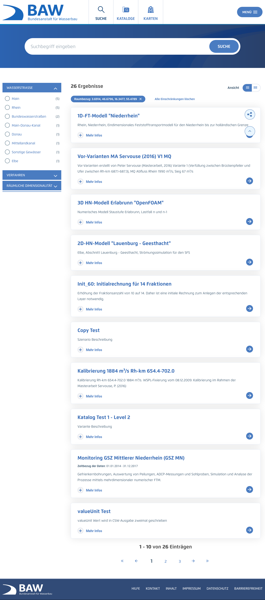
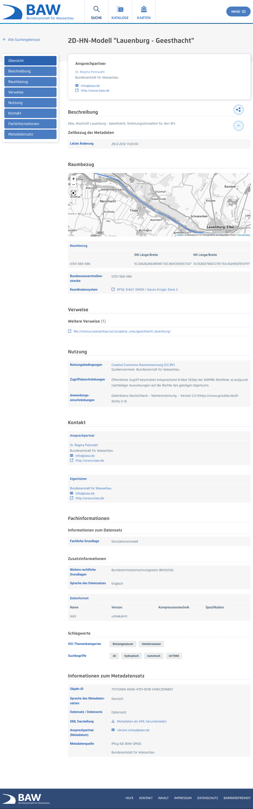
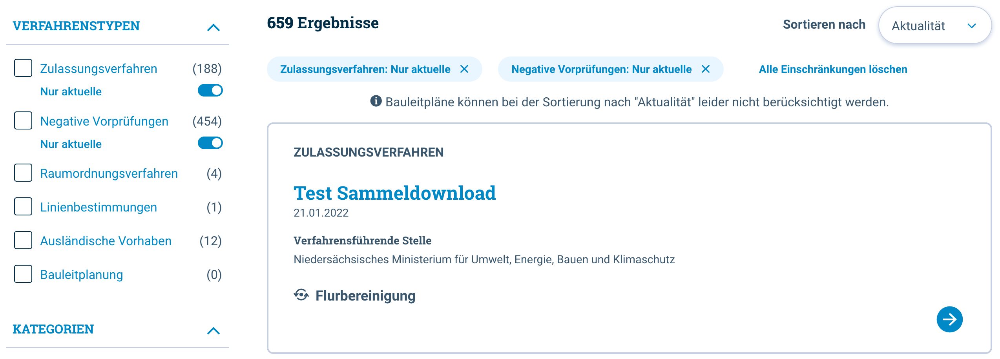
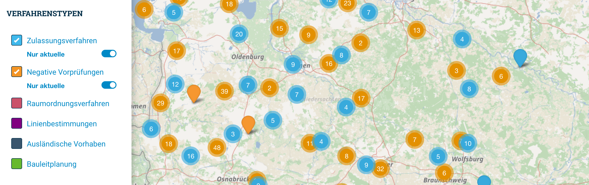
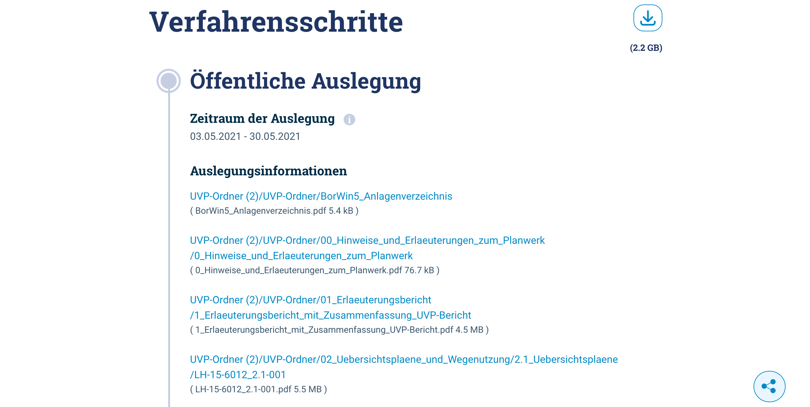

Diese Release Notes betreffen ausschließlich die Versionen 5.11.x. Release Notes älterer Versionen können hier eingesehen werden:
[5.10.x](/5.10.0/about/history.html), [5.9.x](/5.9.0/about/history.html), [5.8.x](/5.8.0/about/history.html), [5.7.x](/5.7.0/about/history.html), [5.6.x](/5.6.0/about/history.html), [5.5.x](/5.5.0/about/history.html), [5.4.x](/5.4.0/about/history.html), [5.3.x](/5.3.0/about/history.html), [5.2.x](/5.2.0/about/history.html), [5.1.x](/5.1.0/about/history.html), [5.0.x](/5.0.0/about/history.html)

## Version 5.11.0

Release 27.01.2022

### Hinweise für die Aktualisierung

#### Anpassung der DB-URLs

Mit der Aktualisierung der MySQL Datenbank werden viele Warnungen im Log angezeigt:

> WARN: Establishing SSL connection without server's identity verification is not recommended. According to MySQL 5.5.45+, 5.6.26+ and 5.7.6+ requirements SSL connection must be established by default if explicit option isn't set. For compliance with existing applications not using SSL the verifyServerCertificate property is set to 'false'. You need either to explicitly disable SSL by setting useSSL=false, or set useSSL=true and provide truststore for server certificate verification.

Um diese zu vermeiden, müssen alle DB-URLs mit dem Parameter "useSSL=false" ergänzt werden. Daraus ergibt sich bspw. folgender Eintrag in einer config.override.properties-Datei eines IGE-iPlugs:

`iplug.database.url=jdbc\:mysql\://mysql\:3306/igc_test?useSSL=false`

Folgende Orte müssen überprüft werden, insofern diese überschrieben werden:
* config.override.properties (iPlug-IGE)
* default-datasource.properties (Portal -> MDEK-Application)
* Umgebungsvariablen in docker-compose.yml
    * DB_URL_PORTAL
    * DB_URL_MDEK

#### Anpassung des SQL-Modus

Seit MySQL Version 5.7.5 wird der SQL-Modus "ONLY_FULL_GROUP_BY" standardmäßig aktiviert. Dies kann zu Problemen führen, insbesondere wenn HQL-Queries ausgeführt werden. Um diesen Modus wieder zu entfernen, muss im docker-compose.yml der command-Befehl mit dem Parameter `sql-mode` ergänzt werden.

Beispiel:
```
mysql:
    image: mysql:5.7
    command: docker-entrypoint.sh mysqld --character-set-server=utf8 --lower-case-table-names=1 --collation-server=utf8_unicode_ci --sql_mode="STRICT_TRANS_TABLES,NO_ENGINE_SUBSTITUTION"
```

### Kritische Änderungen

#### Kritische Sicherheitslücke Log4Shell in Java-Logging-Bibliothek Log4j gefixt

Die kritische Sicherheitslücke Log4Shell ([CVE-2021-44228](https://www.cve.org/CVERecord?id=CVE-2021-44228)) in der weitverbreiteten Java-Logging-Bibliothek Log4j wurde gefixt. ([REDMINE-3292](https://redmine.informationgrid.eu/issues/3292))

#### OpenData-Kategorien an GovData-Standard angepasst

Die OpenData-Kategorien wurden an den GovData-Standard angepasst. Da hierfür eine Migration nötig ist, müssen das Portal, IGE-iPlug und Codelist-Repository gemeinsam aktualisiert werden. ([REDMINE-1989](https://redmine.informationgrid.eu/issues/1989))

### Wichtige Änderungen

#### Erweitertes Layout für BAW DMQS

Das Portal-Layout vom BAW DMQS wurde aktualisiert. ([REDMINE-2746](https://redmine.informationgrid.eu/issues/2746))


<figcaption class="figcaption">Erweitertes Layout für BAW DMQS Suche</figcaption>


<figcaption class="figcaption">Erweitertes Layout für BAW DMQS Detail</figcaption>

#### UVP: Optimierte Darstellung der Verfahren in der Karte

Die serverseitige Implementierung wurde optimiert, so dass die Daten für die Kartendarstellung schneller generiert werden.
Es werden nur die für die Darstellung des Markers benötigten Informationen übertragen. Die Detailinformationen einer Markierung werden erst geladen, wenn der Benutzer auf eine Markierung klickt.
In der Karte wurde eine Möglichkeit geschaffen, nur Verfahren anzuzeigen, deren Datum der Entscheidung nicht älter als ein Jahr zurückliegt. Dies ist die Defaulteinstellung. Bei Bedarf kann sich der Benutzer alle Verfahren anzeigen lassen. Diese Funktion betrifft NICHT die Bauleitplanungsinformationen. ([REDMINE-1582](https://redmine.informationgrid.eu/issues/1582))


<figcaption class="figcaption">Optimierte Darstellung der Verfahren in der Suche</figcaption>


<figcaption class="figcaption">Optimierte Darstellung der Verfahren in der Karte</figcaption>

#### UVP: Button zum Sammeldownload aller Dokumente auf Detailergebnisseiten verfügbar

Die Zahl der Einzeldokumente kann bei größeren Vorhaben recht hoch werden, so dass ein Download "Datei für Datei" für Interessenten, die alle Dokumente downloaden wollen, sehr langwierig ist.
Daher wurde auf den Detailergebnisseiten aller Vorhabenskategorien an geeigneter Stelle neben "Verfahrensschritte" ein Button "Alle Dokumente als ZIP-Datei herunterladen" eingefügt. Bei Klick werden alle vorhandenen Dokumente des Vorhabens in eine ZIP-Datei gepackt und zum Download/Speichern angeboten. ([REDMINE-1897](https://redmine.informationgrid.eu/issues/1897))


<figcaption class="figcaption">Button zum Sammeldownload aller Dokumente auf Detailergebnisseiten</figcaption>

#### Im Kartenclient können jetzt geschützte Dienste hinzugefügt werden

Geschützte Dienste können über die bestehende Import-Funktion des Mapclients hinzugefügt werden. Das gilt für WMS, WMTS, KML und GPX. ([REDMINE-3109](https://redmine.informationgrid.eu/issues/3109))

#### Der Umgang mit WKT-Geometrien im iPlug-IGE wurde verbessert

Im iPlug-IGE wurde der Umgang mit WKT-Geometrien deutlich verbessert. ([REDMINE-3034](https://redmine.informationgrid.eu/issues/3034))

#### Verbesserung der Fehlerbenachrichtigung des Virusscans

Wenn Fehler während des Virusscans auftreten, wie zum Beispiel fehlerhafter Zugriff auf Dateien, wird eine Exception aufgelöst. Der Administrator wird mit der gesamten Log-Ausgabe des Scans benachrichtigt.
**Achtung: das neue errorPattern muss in den Konfigurationsdateien hinzugefügt werden** ([REDMINE-1797](https://redmine.informationgrid.eu/issues/1797))

### Liste der Änderungen

- [Feature] [PORTAL] Verbesserung des Fehlerbenachrichtigung des Virusscans ([REDMINE-1797](https://redmine.informationgrid.eu/issues/1797))
- [Feature] [IGE] Feld Kurzbezeichnung im IGE verschieben ([REDMINE-3093](https://redmine.informationgrid.eu/issues/3093))
- [Feature] [IPLUG_IGE] Umgang mit WKT-Geometrien verbessern ([REDMINE-3034](https://redmine.informationgrid.eu/issues/3034))
- [Feature] [IGE] Timeout für Virenscanner konfigurierbar machen ([REDMINE-3030](https://redmine.informationgrid.eu/issues/3030))
- [Feature] [SYSTEM] Aktualisierung auf JAVA 11 oder 17 (LTS): Konzeption ([REDMINE-2592](https://redmine.informationgrid.eu/issues/2592))
- [Feature] [IGE] Feld "Fachliche Grundlage" - Label, Hilfetext und Verpflichtung überarbeiten ([REDMINE-2073](https://redmine.informationgrid.eu/issues/2073))
- [Feature] [PORTAL] Absicherung des Anmeldeformulars ([REDMINE-3314](https://redmine.informationgrid.eu/issues/3314))
- [Feature] [MAPCLIENT] Erweiterung der Druckfunktion mit der Auswahl DPI ([REDMINE-3256](https://redmine.informationgrid.eu/issues/3256))
- [Feature] [MAPCLIENT] Import von geschützten Diensten ([REDMINE-3109](https://redmine.informationgrid.eu/issues/3109))
- [Feature] [PORTAL] HMDK: Bei Daten Dienste Kopplung wird der abstract bei Verweise angezeigt ([REDMINE-3089](https://redmine.informationgrid.eu/issues/3089))
- [Feature] [IGE] Anpassung der Zeitbezüge in "Durch die Ressource abgedeckte Zeitspanne" - front end ([REDMINE-2944](https://redmine.informationgrid.eu/issues/2944))
- [Feature] [IGE] Anpassung der Zeitbezüge in "Durch die Ressource abgedeckte Zeitspanne" redux ([REDMINE-2903](https://redmine.informationgrid.eu/issues/2903))
- [Feature] [IGE] Angabe in XML-Element "geographicIdentifier" - differenzierter befüllen ([REDMINE-2606](https://redmine.informationgrid.eu/issues/2606))
- [Feature] [IGE] Erweiterung der Liste der Referenzsysteme ([REDMINE-2532](https://redmine.informationgrid.eu/issues/2532))
- [Feature] [IGE] Anpassung der OpenData Kategorien an den GovData Standard ([REDMINE-1989](https://redmine.informationgrid.eu/issues/1989))
- [Feature] [Codelisten] CodeListService um Getter für CodeListEntry ergänzen ([REDMINE-2490](https://redmine.informationgrid.eu/issues/2490))
- [Support] [PORTAL] Neues Passwort bei Aktualisierung eines Accounts ([REDMINE-3411](https://redmine.informationgrid.eu/issues/3411))
- [Bug] [INTERFACE-SEARCH] Selbstreferenzierender Link in Datensatz ist falsch ([REDMINE-3364](https://redmine.informationgrid.eu/issues/3364))
- [Bug] [IGE] Ersetzte Thesaurus-Begriffe werden in der Suche nicht angezeigt ([REDMINE-3350](https://redmine.informationgrid.eu/issues/3350))
- [Bug] [PORTAL] SSL Warnungen zur Datenbank ([REDMINE-3341](https://redmine.informationgrid.eu/issues/3341))
- [Bug] [IGE] ISO-Import vom Schlüsselkatalog fehlt ([REDMINE-3316](https://redmine.informationgrid.eu/issues/3316))
- [Bug] [IGE] Sichtbarkeit des Feldes "Vektorformat" korrigieren ([REDMINE-3298](https://redmine.informationgrid.eu/issues/3298))
- [Bug] [IGE] transferOptions / Abfolge in xml ([REDMINE-3287](https://redmine.informationgrid.eu/issues/3287))
- [Bug] [IGE] Reindizierung darf nur bei neuen Codelisten geschehen ([REDMINE-3152](https://redmine.informationgrid.eu/issues/3152))
- [Bug] [IGE] Importfehler beim Vektorformat ([REDMINE-3150](https://redmine.informationgrid.eu/issues/3150))
- [Bug] [IGE] Importfehler, wenn URL ohne Namen länger als 255 Zeichen ([REDMINE-3145](https://redmine.informationgrid.eu/issues/3145))
- [Bug] [SYSTEM] Fehlerhafte Metadaten, u.a. Problem mit Daten-Dienst-Kopplung ([REDMINE-2334](https://redmine.informationgrid.eu/issues/2334))
- [Bug] [INTERFACE-CSW] CSW Schnittstelle hat Fehler beim Sortieren der Ergebnisse ([REDMINE-1444](https://redmine.informationgrid.eu/issues/1444))
- [Bug] [IGE] ISO-XML-Ausgabe der Werte in "Raster-/Gridformat" nicht iso-valide ([REDMINE-3299](https://redmine.informationgrid.eu/issues/3299))
- [Bug] [SYSTEM] Kritische Sicherheitslücke Log4Shell in der weitverbreiteten Java-Logging-Bibliothek log4j ([REDMINE-3292](https://redmine.informationgrid.eu/issues/3292))
- [Bug] [IGE] "Veröffentlichung verzögern" bei bereits veröffentlichten Datensätzen ([REDMINE-3266](https://redmine.informationgrid.eu/issues/3266))
- [Bug] [IGE] WCS-Dienst mit GetCapabilities-Assistent erfassen - Fehler in der Ablage der REQUEST-URL ([REDMINE-3262](https://redmine.informationgrid.eu/issues/3262))
- [Bug] [MAPCLIENT] SSRF mit XML External Entity (XXE) Schwachstelle (2) ([REDMINE-3161](https://redmine.informationgrid.eu/issues/3161))
- [Bug] [INTERFACE-CSW] CSW Schnittstelle hat Fehler beim Sortieren der Ergebnisse ([REDMINE-1444](https://redmine.informationgrid.eu/issues/1444))
- [Bug] [PORTAL] Problem bei Darstellung der Landing Page für neu angemeldete Benutzer ([REDMINE-3412](https://redmine.informationgrid.eu/issues/3412))

Profil BAW Datenrepository

- [Feature] [IGE] Literatur Objektklasse nochmal aktivieren ([REDMINE-2326](https://redmine.informationgrid.eu/issues/2326))

Profil BAW DMQS

- [Feature] [PORTAL] Hintergrundkarte in der Kartenansicht austauschen ([REDMINE-3318](https://redmine.informationgrid.eu/issues/3318))
- [Feature] [PORTAL] Portal-Layout für das baw_mis Profil aktualisieren ([REDMINE-2746](https://redmine.informationgrid.eu/issues/2746))
- [Feature] [IGE] REST-API zum Verschieben der Dateien im IGE integrieren ([REDMINE-2678](https://redmine.informationgrid.eu/issues/2678))
- [Feature] [PORTAL] Kartenansicht für den Raumbezug anpassen ([REDMINE-2744](https://redmine.informationgrid.eu/issues/2744))
- [Bug] [IPLUG_IGE] Elasticsearch: Die Suche nach Aller liefert keine Ergebnisse ([REDMINE-3344](https://redmine.informationgrid.eu/issues/3344))
- [Bug] [PORTAL] BWaStr.IDs für Haupt- und Nebenstrecken in Kombination mit fehlendem WKT führen zu fehlender Darstellung von Features in der Kartenansicht ([REDMINE-3389](https://redmine.informationgrid.eu/issues/3389))

Profil BKG

- [Feature] [PORTAL] Katalogausgabe entsprechend #1358 für BKG-MIS umsetzen ([REDMINE-2618](https://redmine.informationgrid.eu/issues/2618))

Profil MetaVer

- [Feature] [PORTAL] Entfernung der Facetten "Messwerte" und "Forschungsprojekte" ([REDMINE-2546](https://redmine.informationgrid.eu/issues/2546))
- [Feature] [PORTAL] Button Karte - Karte in neuen Tab öffnen ([REDMINE-2383](https://redmine.informationgrid.eu/issues/2383))
- [Feature] [PORTAL] Portal / Verweise - Verweise auf externe Webseiten in neuen Tab öffnen ([REDMINE-2367](https://redmine.informationgrid.eu/issues/2367))
- [Bug] [IGE] Metadatenkatalog Sachsen-Anhalt - Datensatz INSPIRE ST Orthofotografie ATKIS DOP20 - lässt sich nicht veröffentlichen ([REDMINE-3221](https://redmine.informationgrid.eu/issues/3221))
- [Bug] [PORTAL] Fehler in der Portal Detaildarstellung ([REDMINE-3279](https://redmine.informationgrid.eu/issues/3279))
- [Bug] [PORTAL] Darstellung der Webseiten Treffer fehlerhaft ([REDMINE-3105](https://redmine.informationgrid.eu/issues/3105))

Profil NUMIS

- [Bug] [PORTAL] Probleme mit den BLPs im nds. UVP-Portal (Kartenansicht) ([REDMINE-3338](https://redmine.informationgrid.eu/issues/3338))

Profil Umweltportal Schleswig-Holstein

- [Feature] [IGE] Attribut-Tabelle kann nicht importiert werden (ZEBIS Metadaten) ([REDMINE-3240](https://redmine.informationgrid.eu/issues/3240))
- [Feature] [IGE] Geometry Context im SH Profil ergänzen ([REDMINE-2823](https://redmine.informationgrid.eu/issues/2823))
- [Feature] [PORTAL] Anpassen der Hilfetexte ([REDMINE-2644](https://redmine.informationgrid.eu/issues/2644))
- [Bug] [PORTAL] Link aus Email an neu-registrierte Benutzer ([REDMINE-3144](https://redmine.informationgrid.eu/issues/3144))

Profil UVP

- [Feature] [IGE] Link zu UVP-G in Hilfe zu Feld "UVP-Nummer" integrieren ([REDMINE-3272](https://redmine.informationgrid.eu/issues/3272))
- [Feature] [CODELIST REPOSITORY] Aktualisierung der UVP Nummern Sachsen ([REDMINE-3100](https://redmine.informationgrid.eu/issues/3100))
- [Feature] [PORTAL] Optimierte Darstellung der Verfahren in der Karte ([REDMINE-1582](https://redmine.informationgrid.eu/issues/1582))
- [Feature] [PORTAL] Button zum Sammeldownload aller Dokumente auf Detailergebnisseiten ([REDMINE-1897](https://redmine.informationgrid.eu/issues/1897))
- [Feature] [PORTAL] Beschränkung der Vorhaben im Überblick auf der Startseite auf UVP- und Ausländische Verfahren ([REDMINE-1583](https://redmine.informationgrid.eu/issues/1583))
- [Bug] [IGE] Statistik zeigt nur Fehlermeldung ([REDMINE-3340](https://redmine.informationgrid.eu/issues/3340))


### Komponenten

- CODELIST-REPOSITORY ([download](https://distributions.informationgrid.eu/ingrid-codelist-repository/5.11.0/))
- IBUS ([download](https://distributions.informationgrid.eu/ingrid-ibus/5.11.0/))
- INTERFACE-CSW ([download](https://distributions.informationgrid.eu/ingrid-interface-csw/5.11.0/))
- INTERFACE-SEARCH ([download](https://distributions.informationgrid.eu/ingrid-interface-search/5.11.0/))
- IPLUG-BLP ([download](https://distributions.informationgrid.eu/ingrid-iplug-blp/5.11.0/))
- IPLUG-CSW-DSC ([download](https://distributions.informationgrid.eu/ingrid-iplug-csw-dsc/5.11.0/))
- IPLUG-DSC ([download](https://distributions.informationgrid.eu/ingrid-iplug-dsc/5.11.0/))
- IPLUG-EXCEL ([download](https://distributions.informationgrid.eu/ingrid-iplug-excel/5.11.0/))
- IPLUG-IGE ([download](https://distributions.informationgrid.eu/ingrid-iplug-ige/5.11.0/))
- IPLUG-OPENSEARCH ([download](https://distributions.informationgrid.eu/ingrid-iplug-opensearch/5.11.0/))
- IPLUG-SE ([download](https://distributions.informationgrid.eu/ingrid-iplug-se/5.11.0/))
- IPLUG-SNS ([download](https://distributions.informationgrid.eu/ingrid-iplug-sns/5.11.0/))
- IPLUG-WFS-DSC ([download](https://distributions.informationgrid.eu/ingrid-iplug-wfs-dsc/5.11.0/))
- IPLUG-XML ([download](https://distributions.informationgrid.eu/ingrid-iplug-xml/5.11.0/))
- PORTAL ([download](https://distributions.informationgrid.eu/ingrid-portal/5.11.0/))
