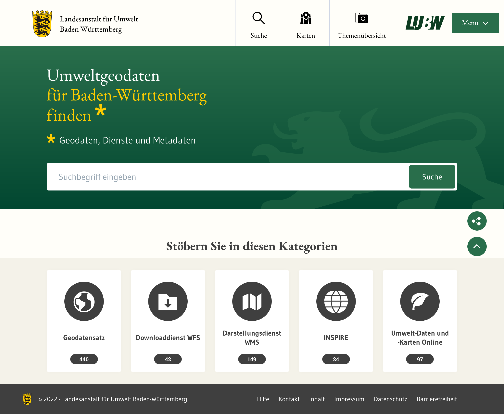
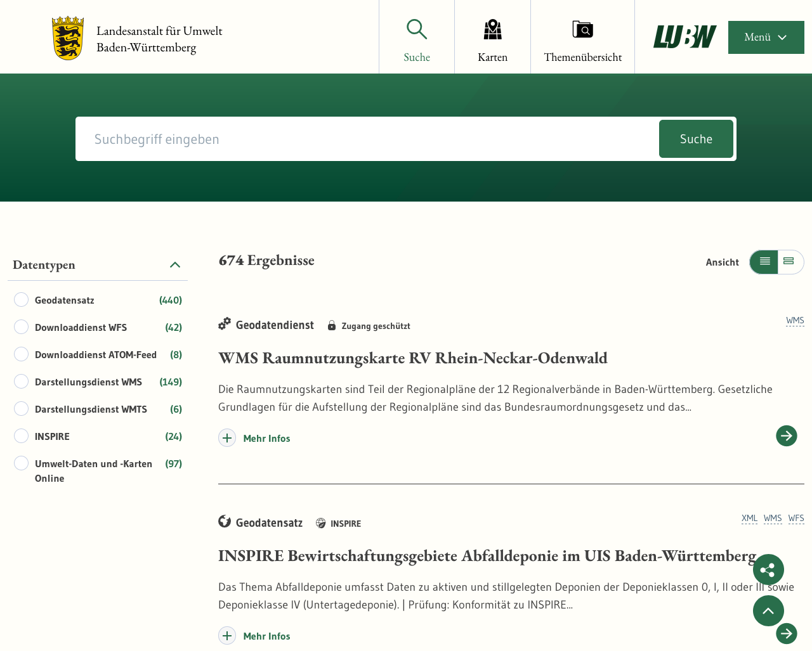
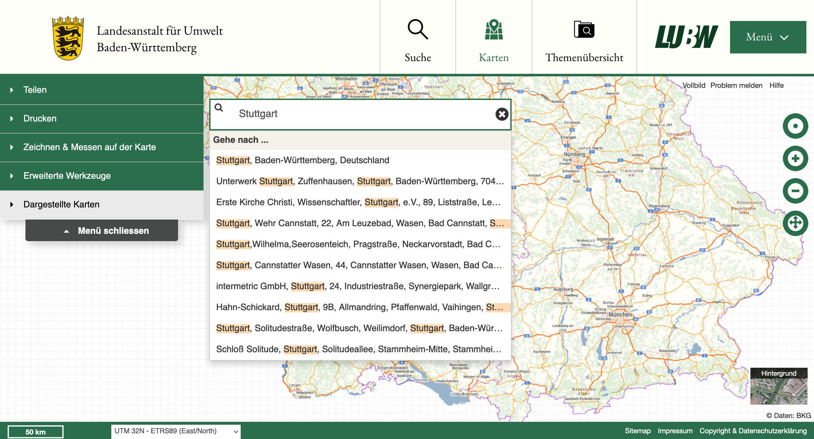
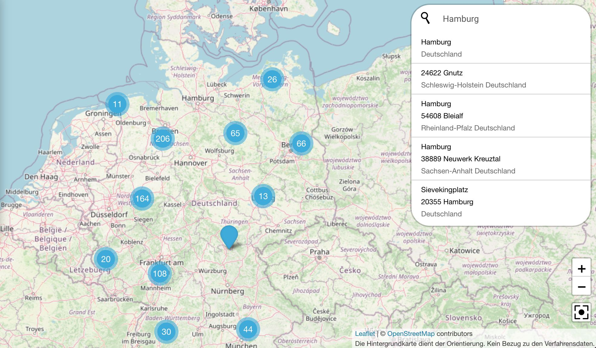

Diese Release Notes betreffen ausschließlich die Versionen 6.0.0. Release Notes älterer Versionen können hier eingesehen werden:
[5.14.x](/5.14.0/about/history.html), [5.13.x](/5.13.0/about/history.html), [5.12.x](/5.12.0/about/history.html), [5.11.x](/5.11.0/about/history.html), [5.10.x](/5.10.0/about/history.html), [5.9.x](/5.9.0/about/history.html), [5.8.x](/5.8.0/about/history.html), [5.7.x](/5.7.0/about/history.html), [5.6.x](/5.6.0/about/history.html), [5.5.x](/5.5.0/about/history.html), [5.4.x](/5.4.0/about/history.html), [5.3.x](/5.3.0/about/history.html), [5.2.x](/5.2.0/about/history.html), [5.1.x](/5.1.0/about/history.html), [5.0.x](/5.0.0/about/history.html)


## Version 6.0.1

Release 16.02.2023

### Liste der Änderungen

- [Feature] [CODELIST-REPOSITORY] Zentrale Codelist anpassen ([REDMINE-4699](https://redmine.informationgrid.eu/issues/4699))
- [Feature] [IGE] Korrektur Regionalschlüssel erfassen - Minimallösung ([REDMINE-4597](https://redmine.informationgrid.eu/issues/4597))
- [Feature] [PORTAL] AdV-MIS: Kontakt des Vertriebs aus distributionInfo als "Vertrieb" ausgeben ([REDMINE-4449](https://redmine.informationgrid.eu/issues/4449))
- [Feature] [PORTAL] Erstellung neuer Bereich "APIs" ([REDMINE-4374](https://redmine.informationgrid.eu/issues/4374))
- [Bug] [PORTAL] XSS Schwachstelle im InGrid Portal ([REDMINE-4723](https://redmine.informationgrid.eu/issues/4723))
- [Bug] [PORTAL] Email versenden führt zu einem Fehler ([REDMINE-4704](https://redmine.informationgrid.eu/issues/4704))
- [Bug] [IPLUG-CSW] Verwendung von Filtern führen zu Fehler bei Indizierung ([REDMINE-4705](https://redmine.informationgrid.eu/issues/4705))
- [Bug] [IPLUG-DSC] IGE: anderssprachige Eingaben - fehlerhafte Ausgabe im ISO-XML ([REDMINE-4670](https://redmine.informationgrid.eu/issues/4670))

Profil BKG

- [Feature] [CODELIST-REPOSITORY] Codeliste 10003 und 10004 editieren ([REDMINE-4201](https://redmine.informationgrid.eu/issues/4201))

Profil HMDK

- [Feature] [PORTAL] Aktivierung des API Menübereiches im allgemeinen Profil ([REDMINE-4677](https://redmine.informationgrid.eu/issues/4677))

Profil LUBW

- [Bug] [PORTAL] Text-, Design- und Layout-Korrekturen am Portal ([REDMINE-4604](https://redmine.informationgrid.eu/issues/4604))

Profil MetaVer

- [Bug] [PORTAL] Fehler "Freie Adressen" unter METAVER / Kataloge ([REDMINE-4674](https://redmine.informationgrid.eu/issues/4674))

Profil UPSH

- [Feature] [IPLUG-IGE] Workaround für parentIdentifier mit problematischem Format ([REDMINE-3786](https://redmine.informationgrid.eu/issues/3786))


## Version 6.0.0

Release 13.01.2023

### Hinweise für die Aktualisierung

**Für den Betrieb der Komponente iPlug SE außerhalb von Docker Containern wird mindestens JAVA 11 benötigt.**

#### Instanzen im iPlug SE müssen migriert werden

Die der Suchmaschine zugrundeliegende Software NUTCH wurde auf eine komplett neue Version 1.19 gehoben.

**WICHTIG:**<br>
Existierende Instanzen im iPlug SE müssen wie folgt migriert werden (s. auch [REDMINE-132](https://redmine.informationgrid.eu/issues/132#note-46)).
- Erstellung einer neuen Instanz. Im `<instance>/conf` Verzeichnis auf dem Server sind dann alle Konfigurationsfiles vorhanden, die benötigt werden.
- Erstellen einer Kopie der alten Instanz in der Admin GUI
- Die kopierte Instanz muss dann auf dem Server mit den Konfigurationsfiles versorgt werden. Dazu werden die Dateien, **außer der Datei** `nutch-site.xml`, aus der neu erstellten Instanz in die kopierte Instanz übertragen.<br>
Beispiel: 
  ```
  # backup directory "instance_copy" 
  cd <PATH_TO_INSTANCE_DIR_OF_IPLUG_SE>/instance_new/conf/
  cp `ls | grep -v "nutch-site.xml"` <PATH_TO_INSTANCE_DIR_OF_IPLUG_SE>/instance_copy/conf/
  ```
- Löschen der neuen Instanz
- SE iPlug neu starten
- Die so migrierten Instanzen müssen neu aufgebaut werden (new crawl)<br>
ACHTUNG:
Beim Crawl gibt es in Version 5.13.x noch ein Problem mit Redirects/Excludes s. [REDMINE-4262](https://redmine.informationgrid.eu/issues/4262#note-5).
Das Problem kann durch das Hinzufügen einer Option in der NUTCH Konfiguration der Instanz behoben werden:
  ```
  http.redirect.max = 5
  ```Dadurch werden Redirects während des Crawls bis zu einer Tiefe von 5 aufgelöst.
Die Option wird in version 5.14.0 per Default für alle neuen Instanzen gesetzt.

Bei der Gelegenheit sollte überprüft werden, ob das Feld `plugin.includes` in der Konfiguration der Instanz auf dem folgenden Wert steht:

`protocol-httpclient|urlfilter-(regex|validator)|parse-(html|tika)|index-(basic|anchor|metadata|more)|ingrid-indexer-elastic|scoring-ingrid|ingrid-language-identifier|urlnormalizer-(pass|regex|basic)|analysis-de`

Dies behebt evtl. fehlende Beschreibungen unterhalb der Treffer, die aus diesem iPlug stammen.

#### Aktualisierung von Elasticsearch

Die neue Version des iBus kann mit der Elasticsearch-Version 7.17.8 umgehen. Alle anderen Komponenten benötigen hierfür keine Aktualisierung, da die Kommunikation über den iBus geht. Als zusätzliche Anpassung muss darauf geachtet werden, dass das Elasticsearch-Image korrekt konfiguriert ist.

* Image: docker.elastic.co/elasticsearch/elasticsearch:7.17.8
* zusätzliche Umgebungsvariablen:
  * discovery.type=single-node
  * ingest.geoip.downloader.enabled=false

#### Aktualisierung von Interface-CSW

Die Anmeldung über CSW-T wurde bisher über die Datei `csw-t.realm.properties` bestimmt. Die Nutzer für den Zugriff der CSW-T Schnittstelle werden jetzt in der `config.override.properties` über die Eigenschaft `cswt.users` konfiguriert. Hier werden die Benutzer und Passwortinformationen kommasepariert angegeben. Dies geschieht nach dem folgenden Format:

```
cswt.users=<user1>::<bcrypt-passwordUser1>,<user2>::<bcrypt-passwordUser2>,...
```

Hierbei muss das Passwort im bcrypt-Format vorliegen. Dieses kann über das Start-Skript generiert werden, so dass es dann in die Konfiguration eingetragen werden kann. Das Kommando dafür lautet:

```
sh start.sh calcPassword <clear-text-password>
```

#### Aktualisierung von iPlugs

iPlugs, bei denen die Konfiguration der Beans überschrieben wurden, müssen in diesem Release angepasst werden. Erkennbar sind diese durch eine gemappte XML-Datei in das Verzeichnis `WEB-INF/override`.<br>
Die Datei muss stattdessen in das folgende Verzeichnis gemappt werden: `<iPlug-path>/conf/override`.

### Sicherheitsrelevante Änderungen

#### Upgrade von JAVA 8 auf JAVA 17

**Das InGrid-Framework setzt ab Version 6.0.0 eine JAVA 17 Laufzeitumgebung voraus. Innerhalb der Docker-Container wird diese bereits automatisch bereitgestellt.**

**Neben der Aktualisierung der JAVA-Laufzeitumgebung wurden viele Abhängigkeiten zu externen Libraries aktualisiert, so dass mit Version 6.0.0 eine wesentliche Verbesserung der IT-Sicherheit umgesetzt wurde.**

### Wichtige Änderungen

#### Neues Profil LUBW

Für die Landesanstalt für Umwelt Baden-Württemberg (LUBW) in Karlsruhe wurde ein eigenes Profil mit eigenem Design und Layout erstellt.

##### Startseite


<figcaption class="figcaption">LUBW: Startseite</figcaption>

##### Suche


<figcaption class="figcaption">LUBW: Suche</figcaption>

##### Karten


<figcaption class="figcaption">LUBW: Karten</figcaption>

#### UVP: Erweiterung iPlug BLP um Indexierung von verlinkten Website-Inhalten

Die Indexierung des iPlug BLP wurde so erweitert, dass die Inhalte der im Excelfile hinterlegten URLs mit indexiert werden. Dazu sind folgende Punkte zu beachten:

* Indexiert werden nur die Nutzdaten, alle HTML-Strukturelemente werden abgestreift
* Alle Daten werden als Sprache "Deutsch" indexiert
* Redirects von der im Excel angegebenen URL zu anderen URLs werden verfolgt
* Die Inhalte aller im Excel angegebenen URLs werden dem einen BLP-Eintrag zugeordnet
* Es findet keine Aufbereitung bzgl. Textanalyse statt

([REDMINE-1416](https://redmine.informationgrid.eu/issues/1416))

#### MetaVer und UVP: Verbesserung der Karten bei OSM und Nominatim-Suche

Für die Profile MetaVer und UVP wird jetzt als Hintergrundkarte und als Karte in den Raumbezügen für OpenStreetMap (OSM) inklusive Nominatim ein kommerzieller Anbieter aus Deutschland verwendet. Die offiziellen OSM-Dienste sollten nicht für den produktiven Einsatz verwendet werden, weil deren Infrastruktur dafür nicht ausgelegt ist.<br>
Zudem wurde damit die Datenschutzkonformität weiter verbessert. Die Standard-OSM-Server können teilweise außerhalb der EU stehen.<br>
Für UVP wurde die Nominatim-Suche aktiviert ([REDMINE-4634](https://redmine.informationgrid.eu/issues/4634)).

##### UVP-Karte: Nominatim-Suche


<figcaption class="figcaption">UVP-Karte: Nominatim-Suche</figcaption>

### Liste der Änderungen

- [Feature] [IGE] AdV-Checkbox nur in Objektarten Geodatendienst, Geodatensatz und Anwendung sichtbar machen ([REDMINE-3104](https://redmine.informationgrid.eu/issues/3104))
- [Feature] [IGE] Hilfetext zum Feld "Durch die Ressource abgedeckte Zeitspanne" anpassen ([REDMINE-3976](https://redmine.informationgrid.eu/issues/3976))
- [Feature] [IGE] Regionalschlüssel erfassen - Minimallösung ([REDMINE-3928](https://redmine.informationgrid.eu/issues/3928))
- [Feature] [IPLUG-SE] SE iPlug - Upgrade NUTCH auf 1.19 ([REDMINE-4489](https://redmine.informationgrid.eu/issues/4489))
- [Feature] [MAPCLIENT] Admin-GUI - Einbindung WMTS mit anderer Projektion ([REDMINE-4479](https://redmine.informationgrid.eu/issues/4479))
- [Feature] [PORTAL] Portalanzeige Koordinatensysteme ([REDMINE-4486](https://redmine.informationgrid.eu/issues/4486))
- [Feature] [PORTAL] Entfernen von IGE-Applikation bei Installation über Docker ([REDMINE-4447](https://redmine.informationgrid.eu/issues/4447))
- [Feature] [SYSTEM] Aktualisierung der verwendeten Elasticsearch Version ([REDMINE-3578](https://redmine.informationgrid.eu/issues/3578))
- [Feature] [SYSTEM] Aktualisierung auf JAVA 17 - Portal ([REDMINE-3329](https://redmine.informationgrid.eu/issues/3329))
- [Feature] [SYSTEM] Aktualisierung auf JAVA 17 - Interfaces ([REDMINE-3328](https://redmine.informationgrid.eu/issues/3328))
- [Feature] [SYSTEM] Aktualisierung auf JAVA 17 - iPlugs ([REDMINE-3327](https://redmine.informationgrid.eu/issues/3327))
- [Feature] [SYSTEM] Aktualisierung auf JAVA 17 - base-webapp ([REDMINE-3326](https://redmine.informationgrid.eu/issues/3326))
- [Feature] [SYSTEM] Aktualisierung auf JAVA 17 - Bibliotheken ([REDMINE-3325](https://redmine.informationgrid.eu/issues/3325))
- [Feature] [SYSTEM] Aktualisierung auf JAVA 17 (LTS): Umsetzung ([REDMINE-3324](https://redmine.informationgrid.eu/issues/3324))
- [Feature] [SYSTEM] Hinzufügen eines Parameters für Systemmail prefixes ([REDMINE-4663](https://redmine.informationgrid.eu/issues/4663))
- [Bug] [IGE] Regression von Metadaten-Import ([REDMINE-4340](https://redmine.informationgrid.eu/issues/4340))
- [Bug] [IGE] MD zu CSW-Geodatendiensten: GetCapabilities-Verweis wird im MD doppelt angelegt ([REDMINE-4260](https://redmine.informationgrid.eu/issues/4260))
- [Bug] [INTERFACE-CSW] CSW-T Schnittstelle mit besserer Passwortverschlüsselung ([REDMINE-3749](https://redmine.informationgrid.eu/issues/3749))
- [Bug] [INTERFACE-CSW] Nicht thread sichere Bearbeitung von Filter Requests in CSW Schnittstelle ([REDMINE-4354](https://redmine.informationgrid.eu/issues/4354))
- [Bug] [INTERFACE-CSW] Verbesserung der Fehlermeldung im Interface CSW ([REDMINE-4352](https://redmine.informationgrid.eu/issues/4352))
- [Bug] [INTERFACE-SEARCH] Atom-Feed Client - fehlerhafte Downloads weiter anzeigen ([REDMINE-4409](https://redmine.informationgrid.eu/issues/4409))
- [Bug] [IPLUG_IGE] GetCapabilities-Assistent für WCS-Dienste - in serviceTypeVersion fehlt Präfix "OGC:WCS" ([REDMINE-4364](https://redmine.informationgrid.eu/issues/4364))
- [Bug] [PORTAL] MVIS-Client ausschließen von Messnetze ([REDMINE-4573](https://redmine.informationgrid.eu/issues/4573))
- [Bug] [PORTAL] Anpassung Position Regionalschlüssel ([REDMINE-4542](https://redmine.informationgrid.eu/issues/4542))
- [Bug] [PORTAL] Neustart des Docker-Container verursacht Löschung von Einstellung ([REDMINE-4502](https://redmine.informationgrid.eu/issues/4502))

Profil BAW MIS

- [Feature] [IGE] Custom IGE-Felder nach IDF mappen ([REDMINE-4026](https://redmine.informationgrid.eu/issues/4026))
- [Feature] [IGE] IGE-Formular für Software anpassen ([REDMINE-2771](https://redmine.informationgrid.eu/issues/2771))
- [Feature] [PORTAL] Detailansicht für Objektklasse "Informationssystem" anpassen ([REDMINE-4536](https://redmine.informationgrid.eu/issues/4536))
- [Feature] [PORTAL] Bibliografische Angaben auch im baw_mis Profil implementieren ([REDMINE-4351](https://redmine.informationgrid.eu/issues/4351))
- [Feature] [PORTAL] Anpassungen in den Detail- und Suchtreffer-Ansichten ([REDMINE-4167](https://redmine.informationgrid.eu/issues/4167))

Profil BKG

- [Feature] [PORTAL] Button "nach oben" ([REDMINE-4504](https://redmine.informationgrid.eu/issues/4504))
- [Feature] [PORTAL] Anzeige der räumlichen Ausdehnung ändern ([REDMINE-4484](https://redmine.informationgrid.eu/issues/4484))
- [Feature] [PORTAL] Bezeichnung "Objekt-ID" ersetzen ([REDMINE-4465](https://redmine.informationgrid.eu/issues/4465))
- [Feature] [PORTAL] Label "Ansprechpartner (Metadatum)" ändern ([REDMINE-4450](https://redmine.informationgrid.eu/issues/4450))
- [Feature] [PORTAL] Label "Erläuterung zum Zeitbezug" beim Pflegeintervall umbenennen ([REDMINE-4238](https://redmine.informationgrid.eu/issues/4238))
- [Feature] [PORTAL] Label "Datensatz / Datenserie" ändern ([REDMINE-4236](https://redmine.informationgrid.eu/issues/4236))
- [Feature] [PORTAL] Veröffentlichungsbreite nicht anzeigen ([REDMINE-4218](https://redmine.informationgrid.eu/issues/4218))
- [Feature] [PORTAL] Grafik "Open Data" ändern ([REDMINE-4217](https://redmine.informationgrid.eu/issues/4217))
- [Feature] [PORTAL] Detailanzeige - Bodenauflösung - alle (metrischen) Einheiten ermöglichen ([REDMINE-4216](https://redmine.informationgrid.eu/issues/4216))
- [Feature] [PORTAL] Schreibung "Opendata" in "Open Data" ändern ([REDMINE-4214](https://redmine.informationgrid.eu/issues/4214))
- [Bug] [IGE] Fehler in BKG-MIS-Release 5.13.1 ([REDMINE-4345](https://redmine.informationgrid.eu/issues/4345))
- [Bug] [PORTAL] Fehler in BKG-MIS-Release 5.14.0 ([REDMINE-4460](https://redmine.informationgrid.eu/issues/4460))

Profil HMDK

- [Feature] [IGE] Profilanpassung für HMDK Installation ([REDMINE-4585](https://redmine.informationgrid.eu/issues/4585))

Profil MetaVer

- [Feature] [MAPCLIENT] Kartenclient METAVER - Webatlas farbe/grau ersetzen durch basemap.de Web Raster farbe/grau ([REDMINE-4230](https://redmine.informationgrid.eu/issues/4230))
- [Feature] [PORTAL] Verbesserung Startseite MetaVer - Feld für Wartungsarbeiten einfügen ([REDMINE-4421](https://redmine.informationgrid.eu/issues/4421))

Profil NUMIS

- [Feature] [PORTAL] Ministeriumsname aktualisieren ([REDMINE-4498](https://redmine.informationgrid.eu/issues/4498))
- [Feature] [PORTAL] UVP, Portal: Menüeintrag verkürzen ([REDMINE-4495](https://redmine.informationgrid.eu/issues/4495))
- [Feature] [PORTAL] Log-in niedersächsischer UVP Editor (IGE-NG) ([REDMINE-4337](https://redmine.informationgrid.eu/issues/4337))

Profil LUBW

- [Feature] [IGE] OAC fehlt in (manchen) Metadatensätzen ([REDMINE-4615](https://redmine.informationgrid.eu/issues/4615))
- [Feature] [IGE] Feld für Erfassung des OAC im IGE einfügen ([REDMINE-4378](https://redmine.informationgrid.eu/issues/4378))
- [Feature] [IGE] Metadatentransformation und -migration ([REDMINE-4008](https://redmine.informationgrid.eu/issues/4008))
- [Feature] [MAPCLIENT] Automatische URL im Kartendruck ersetzen ([REDMINE-4603](https://redmine.informationgrid.eu/issues/4603))
- [Feature] [MAPCLIENT] Direkte Anzeige, wenn nur ein Layer im WMS existiert ([REDMINE-4376](https://redmine.informationgrid.eu/issues/4376))
- [Feature] [PORTAL] Hilfetexte im Portal austauschen ([REDMINE-4607](https://redmine.informationgrid.eu/issues/4607))
- [Feature] [PORTAL] Deutschlandkarte verkleinern, ersetzen oder entfernen ([REDMINE-4598](https://redmine.informationgrid.eu/issues/4598))
- [Feature] [PORTAL] Überarbeitung der "Hilfe" ([REDMINE-4583](https://redmine.informationgrid.eu/issues/4583))
- [Feature] [PORTAL] Zugriffsbeschränkungen - Angabe in MD ergänzen, Darstellung im Portal ([REDMINE-4576](https://redmine.informationgrid.eu/issues/4576))
- [Feature] [PORTAL] Portal - inhaltliche Anpassungen ([REDMINE-4371](https://redmine.informationgrid.eu/issues/4371))
- [Bug] [IGE] Falsche Platzierung von environmentDescription im Export ISO ([REDMINE-4622](https://redmine.informationgrid.eu/issues/4622))

Profil RLP

- [Feature] [PORTAL] Deaktivierung von Facetten in der Suche ([REDMINE-4552](https://redmine.informationgrid.eu/issues/4552))
- [Feature] [PORTAL] Layouts anpassen für die Suchergebnisseite und die Detaildarstellung im RLP-Profil ([REDMINE-3631](https://redmine.informationgrid.eu/issues/3631))

Profil UPSH

- [Feature] [MAPCLIENT] Barrierefreiheit Karten (Einbetten) ([REDMINE-4306](https://redmine.informationgrid.eu/issues/4306))
- [Feature] [PORTAL] Button "Registrieren" ausblenden ([REDMINE-4626](https://redmine.informationgrid.eu/issues/4626))
- [Feature] [PORTAL] Geometriekontext-Attribute im UP sichtbar machen ([REDMINE-4366](https://redmine.informationgrid.eu/issues/4366))

Profil UVP

- [Feature] [IPLUG-BLP] Erweiterung iPlug BLP um Indexierung von verlinkten Website Inhalten ([REDMINE-1416](https://redmine.informationgrid.eu/issues/1416))
- [Feature] [MAPCLIENT] Nutzung OSM inkl. Nominatim im UVP-Portal ([REDMINE-4634](https://redmine.informationgrid.eu/issues/4634))
- [Feature] [MAPCLIENT] UVP-Portal - Wechsel der Hintergrundkarte und der Karte in den Raumbezügen ([REDMINE-2810](https://redmine.informationgrid.eu/issues/2810))
- [Feature] [PORTAL] UVP: Darstellung des Bundeslandes oder des Landkreises in dem das Vorhaben erfolgt ([REDMINE-1806](https://redmine.informationgrid.eu/issues/1806))
- [Feature] [PORTAL] Änderung Text auf länderspezifischen Seiten ([REDMINE-4072](https://redmine.informationgrid.eu/issues/4072))
- [Bug] [IGE-NG] Dateien innerhalb der Download-Zip-Dateien enthalten in den einzelnen Dateinamen ein doppeltes .pdf am Ende ([REDMINE-4588](https://redmine.informationgrid.eu/issues/4588))

### Komponenten

- CODELIST-REPOSITORY ([download](https://distributions.informationgrid.eu/ingrid-codelist-repository/6.0.0/))
- IBUS ([download](https://distributions.informationgrid.eu/ingrid-ibus/6.0.0/))
- INTERFACE-CSW ([download](https://distributions.informationgrid.eu/ingrid-interface-csw/6.0.0/))
- INTERFACE-SEARCH ([download](https://distributions.informationgrid.eu/ingrid-interface-search/6.0.0/))
- IPLUG-BLP ([download](https://distributions.informationgrid.eu/ingrid-iplug-blp/6.0.0/))
- IPLUG-CSW-DSC ([download](https://distributions.informationgrid.eu/ingrid-iplug-csw-dsc/6.0.0/))
- IPLUG-DSC ([download](https://distributions.informationgrid.eu/ingrid-iplug-dsc/6.0.0/))
- IPLUG-EXCEL ([download](https://distributions.informationgrid.eu/ingrid-iplug-excel/6.0.0/))
- IPLUG-IGE ([download](https://distributions.informationgrid.eu/ingrid-iplug-ige/6.0.0/))
- IPLUG-OPENSEARCH ([download](https://distributions.informationgrid.eu/ingrid-iplug-opensearch/6.0.0/))
- IPLUG-SE ([download](https://distributions.informationgrid.eu/ingrid-iplug-se/6.0.0/))
- IPLUG-SNS ([download](https://distributions.informationgrid.eu/ingrid-iplug-sns/6.0.0/))
- IPLUG-WFS-DSC ([download](https://distributions.informationgrid.eu/ingrid-iplug-wfs-dsc/6.0.0/))
- IPLUG-XML ([download](https://distributions.informationgrid.eu/ingrid-iplug-xml/6.0.0/))
- PORTAL ([download](https://distributions.informationgrid.eu/ingrid-portal/6.0.0/))
