## Version 4.6.0

Release 21.01.2019

### Änderungen

Quartalsrelease, u.a.:
- Betrieb mit Oracle 12
- aktualisierter Kartenviewer u.a. mit Darstellung von Karten mit Zeit-Dimension
- separates Login auf Kartenviewer Administrations-Oberfläche
- verbesserte Eingabe in Kartenviewer Administrations-Oberfläche
- Anzeige von automatisch hinzugefügten Schlüsselwörtern im Portal
- Entfernung von ISO Themenkategorien für Geodatendienste
- Fix UVP Statistik

### Liste der Änderungen

InGrid
- [Feature] [IGE] IGE/Portal für Dienste werden ISO Themenkategorien angezeigt ([REDMINE-1099](https://redmine.informationgrid.eu/issues/1099))
- [Feature] [IGE] IGE: Zusätzliche Indexierung von Schlagwörten die beim ISO 19139 Mapping automatisch hinzugefügt werden ([REDMINE-1105](https://redmine.informationgrid.eu/issues/1105))
- [Feature] [IGE/PORTAL] Aktualisierung JDBC Treiber für Oracle 12 ([REDMINE-1212](https://redmine.informationgrid.eu/issues/1212))
- [Feature] [PORTAL] PORTAL: Entfernen von SSO im Portal-Tomcat ([REDMINE-1159](https://redmine.informationgrid.eu/issues/1159))
- [Feature] [PORTAL] PORTAL: Hinzufügen von local host zum Betreff der Job Alert Emails ([REDMINE-1260](https://redmine.informationgrid.eu/issues/1260))
- [Feature] [MAPCLIENT] MAPCLIENT: Einführung eines Logout-Buttons für die Admin-GUI ([REDMINE-1229](https://redmine.informationgrid.eu/issues/1229))
- [Feature] [MAPCLIENT] MAPCLIENT/PORTAL: URL zum Admin GUI des Mapclients im Portal Admin Menü hinzufügen ([REDMINE-1231](https://redmine.informationgrid.eu/issues/1231))
- [Feature] [MAPCLIENT] MAPCLIENT: Admin-GUI: Hilfe-Link einbauen ([REDMINE-1254](https://redmine.informationgrid.eu/issues/1254))
- [Feature] [MAPCLIENT] MAPCLIENT: Darstellung Karten mit Dimension 'TIME' ([REDMINE-1141](https://redmine.informationgrid.eu/issues/1141))
- [Feature] [MAPCLIENT] MAPCLIENT: Darstellung von Kategorie-Hierachie bei fehlerhaften Karten ([REDMINE-1162](https://redmine.informationgrid.eu/issues/1162))
- [Feature] [MAPCLIENT] MAPCLIENT: Auswahl von existierenden Layernamen bei fehlerhaften Karten ([REDMINE-1163](https://redmine.informationgrid.eu/issues/1163))
- [Feature] [MAPCLIENT] MAPCLIENT: Kopieren von Kategorien in der Admin-GUI ([REDMINE-1165](https://redmine.informationgrid.eu/issues/1165))
- [Feature] [MAPCLIENT] MAPCLIENT: Anpassung der Lokalisierung über die Admin-GUI ([REDMINE-1209](https://redmine.informationgrid.eu/issues/1209))
- [Feature] [MAPCLIENT] MAPCLIENT: Menü soll auch im Vollbildmodus angezeigt werden ([REDMINE-1225](https://redmine.informationgrid.eu/issues/1225))
- [Bug] [CODELIST-REPO] CODELIST-REPO: Sortierung der Entries nach ID funktioniert nicht ([REDMINE-1206](https://redmine.informationgrid.eu/issues/1206))
- [Bug] [CODELIST-REPO] CODELIST-REPO: Patches werden nicht eingespielt, wenn per Docker installiert ([REDMINE-1208](https://redmine.informationgrid.eu/issues/1208))
- [Bug] [IGE] IGE: Indizierung erfolgt zusätzlich in anderen Indizes ([REDMINE-1270](https://redmine.informationgrid.eu/issues/1270))
- [Bug] [MAPCLIENT] MAPCLIENT: Funktion Akkordeonmenü fehlerhaft mit Safari 12.0.1 unter macOS Mojave und unter Android-8.0.0 mit Firefox V61.0 ([REDMINE-1224](https://redmine.informationgrid.eu/issues/1224))

UVP
- [Feature] [IGE] Entfernen des Hilfetextes von Auswahl "Vorprüfung durchgeführt" ([REDMINE-1213](https://redmine.informationgrid.eu/issues/1213))
- [Feature] [IGE]  Editor: Erweiterung Löschhinweis bzgl. Berichtspflichten ([REDMINE-1217](https://redmine.informationgrid.eu/issues/1217))
- [Bug] [IGE] UVP: Anpassung der Hilfe beim Upload ([REDMINE-880](https://redmine.informationgrid.eu/issues/880))
- [Bug] [IGE] Fehler bei Umsetzung EU Berichtspflicht ([REDMINE-1248](https://redmine.informationgrid.eu/issues/1248))

BAW
- [Feature] [PORTAL/CSW] Erweiterungen BAW DMQS 2017 ([REDMINE-752](https://redmine.informationgrid.eu/issues/752))

### Komponenten

- Portal ([download](https://distributions.informationgrid.eu/ingrid-portal/4.6.0/)) 
- iPlug IGE ([download](https://distributions.informationgrid.eu/ingrid-iplug-ige/4.6.0/)) 
  **Achtung Schnittstellenänderung! Portal und iPlug IGE müssen zusammen aktualisiert werden.**
- iBus ([download](https://distributions.informationgrid.eu/ingrid-ibus/4.6.0/)) 
- Interface CSW ([download](https://distributions.informationgrid.eu/ingrid-interface-csw/4.6.0/))
- Codelist Repository ([download](https://distributions.informationgrid.eu/ingrid-codelist-repository/4.6.0/))
- iPlug SE ([download](https://distributions.informationgrid.eu/ingrid-iplug-se/4.6.0/))
- iPlug CSW ([download](https://distributions.informationgrid.eu/ingrid-iplug-csw-dsc/4.6.0/))
- iPlug SNS ([download](https://distributions.informationgrid.eu/ingrid-iplug-sns/4.6.0/))

## Version 4.5.2

Release 30.10.2018

### Liste der Änderungen

InGrid
- [Feature] [CODELIST-REPO] Codeliste 111 erweitern um "BKG" ([REDMINE-1207](https://redmine.informationgrid.eu/issues/1207))
- [Bug] [CODELIST-REPO] Codeliste 1320: alte statt neuer Codeliste eingebunden ([REDMINE-1193](https://redmine.informationgrid.eu/issues/1193))

### Komponenten

- Codelist Repository ([download](https://distributions.informationgrid.eu/ingrid-codelist-repository/4.5.2/))

## Version 4.5.1

Release 18.10.2018

### Liste der Änderungen

UVP
- [Feature] [PORTAL] UVP: Integration von BLP Daten in uvp-verbund.de für NRW ([REDMINE-1189](https://redmine.informationgrid.eu/issues/1189))
- [Feature] [IPLUG-SE] UVP: Integration von BLP Daten in uvp-verbund.de für NRW ([REDMINE-1189](https://redmine.informationgrid.eu/issues/1189))

BKG
- [Bug] [IGE] IGE: Fix Import von useConstraints ([REDMINE-1199](https://redmine.informationgrid.eu/issues/1199))

### Komponenten

- iPlug IGE ([download](https://distributions.informationgrid.eu/ingrid-iplug-ige/4.5.1/))
- iPlug SE ([download](https://distributions.informationgrid.eu/ingrid-iplug-se/4.5.1/))
- Portal ([download](https://distributions.informationgrid.eu/ingrid-portal/4.5.1/))

## Version 4.4.6

Release 16.10.2018

### Liste der Änderungen

- [Bug] [PORTAL] Portal: Passwortstärke wird im IE11 nicht farblich angezeigt ([REDMINE-1176](https://redmine.informationgrid.eu/issues/1176))

UVP
- [Feature] [PORTAL] UVP: Integration von BLP Daten in uvp-verbund.de für NRW ([REDMINE-1189](https://redmine.informationgrid.eu/issues/1189))

### Komponenten

- Portal ([download](https://distributions.informationgrid.eu/ingrid-portal/4.4.5/))

## Version 4.2.6

Release 16.10.2018

### Liste der Änderungen

UVP
- [Feature] [IPLUG-SE] UVP: Integration von BLP Daten in uvp-verbund.de für NRW ([REDMINE-1189](https://redmine.informationgrid.eu/issues/1189))

### Komponenten

- iPlug SE ([download](https://distributions.informationgrid.eu/ingrid-iplug-se/4.2.6/))

## Version 4.5.0

Release 15.10.2018

### Änderungen

Quartalsrelease, u.a.:
* aktualisierte, robustere Admin-GUI in Komponenten (iPlugs)
* aktualisierter Mapclient mit Admin-GUI zur Pflege der Karten und Einstellungen
* frei wählbarer Parent Identifier im IGE

### Liste der Änderungen

InGrid
- [Feature] [IGE] IGE: Parent Identifier soll für Metadaten-Objekte frei wählbar sein ([REDMINE-364](https://redmine.informationgrid.eu/issues/364))
- [Feature] [IGE] IGE: Lizenzeingabe mit Quellenvermerk für u.a. "Datenlizenz Deutschland – Namensnennung - Version 2.0" ([REDMINE-1066](https://redmine.informationgrid.eu/issues/1066))
- [Feature] [MAPCLIENT] Darstellung des Name-Attributes eines Layers ([REDMINE-1112](https://redmine.informationgrid.eu/issues/1112))
- [Feature] [MAPCLIENT] MAPCLIENT: Aktualisierung auf den aktuellsten mf-geoadmin3 ([REDMINE-1130](https://redmine.informationgrid.eu/issues/1130))
- [Feature] [MAPCLIENT] MAPCLIENT: Entwicklung einer Admin-GUI für den geoadmin3-Mapclient ([REDMINE-815](https://redmine.informationgrid.eu/issues/815))
- [Feature] [MAPCLIENT] MAPCLIENT: Aktualisierung Admin-GUI Bibliotheken ([REDMINE-1144](https://redmine.informationgrid.eu/issues/1144))
- [Feature] [IPLUG-CSW] IPLUG-CSW: Filterung von download links ([REDMINE-1149](https://redmine.informationgrid.eu/issues/1149))
- [Feature] [CODELIST-REPO] CODELIST-REPO: Beim Update von bestehendem Repo aktuelle Codelisten sichern ([REDMINE-1187](https://redmine.informationgrid.eu/issues/1187))
- [Feature] [PORTAL] IGE: Vergrößerung der Anzahl der zulässigen Zeichen bei der URL der Vorschaugrafik ([REDMINE-1104](https://redmine.informationgrid.eu/issues/1104))
- [Bug] [IGE] IGE: "Datenformat" Pflichtfelder und Hilfetext korrigieren ([REDMINE-1124](https://redmine.informationgrid.eu/issues/1124))
- [Bug] [IGE] IPLUG_IGE: ISO Abbildung von "Raster/Gridformat" Sektion fehlerhaft ([REDMINE-1129](https://redmine.informationgrid.eu/issues/1129))
- [Bug] [IGE] IGE: ISO-XML Ansicht zeigt fälschlicherweise keine veröffentlichte Version an ([REDMINE-1177](https://redmine.informationgrid.eu/issues/1177))
- [Bug] [IGE] IGE: Tooltips der Checkboxen unter Katalogverwaltung werden abgeschnitten. ([REDMINE-1180](https://redmine.informationgrid.eu/issues/1180))
- [Bug] [IGE] IGE: Fehler bei Darstellung im Formular bzgl. "Anpassung bzgl. Struktur der räuml. Daten" ([REDMINE-1190](https://redmine.informationgrid.eu/issues/1190))
- [Bug] [IGE] IPLUG-IGE: Verbesserung Check ob Postgres Datenbank existiert ([REDMINE-1192](https://redmine.informationgrid.eu/issues/1192))
- [Bug] [PORTAL] Portal: Passwortstärke wird im IE11 nicht farblich angezeigt ([REDMINE-1176](https://redmine.informationgrid.eu/issues/1176))
- [Bug] [PORTAL] PORTAL: Ohne Codelist-Repo werden die Codelisten nicht aktualisiert aus dem aktuellen "ingrid-codelist-service" ([REDMINE-1132](https://redmine.informationgrid.eu/issues/1132))
- [Bug] [PORTAL] PORTAL: Initiale Installation auf PostgreSQL fehlerhaft, Migration von MySQL fehlerhaft ([REDMINE-1133](https://redmine.informationgrid.eu/issues/1133))
- [Bug] [PORTAL] Portal: Fehler bei Darstellung von Filtereinstellungen dei Auswahl von einer Datenquelle in der Suchübersicht ([REDMINE-1164](https://redmine.informationgrid.eu/issues/1164))
- [Bug] [MAPCLIENT] MAPCLIENT: Parameter-Aktualisierung im IE funktioniert nicht ([REDMINE-1148](https://redmine.informationgrid.eu/issues/1148))
- [Bug] [IBUS] IBus admin GUI funktioniert nicht mit Internet Explorer 11 ([REDMINE-1153](https://redmine.informationgrid.eu/issues/1153))

ZDM
- [Feature] [PORTAL] PORTAL: Erstellung eines ZDM Profils ([REDMINE-1131](https://redmine.informationgrid.eu/issues/1131))

BAW
- [Bug] [PORTAL] XML-Ansicht eines Metadatensatzes ([REDMINE-1184](https://redmine.informationgrid.eu/issues/1184))
- [Bug] [PORTAL] Portal: BWaStr.-Icons auf der Home-Seite werden in IE11 nicht richtig angezeigt ([REDMINE-1188](https://redmine.informationgrid.eu/issues/1188))

BKG
- [Feature] [IGE] IGE: Feld "Anwendungseinschränkungen" ([REDMINE-826](https://redmine.informationgrid.eu/issues/826))
- [Feature] [IGE] IGE: Import - Einträge aus "useConstraints" in BKG-Feld "Nutzungsbedingungen" übertragen ([REDMINE-1085](https://redmine.informationgrid.eu/issues/1085))
- [Bug] [IGE] IGE: Anzeige in "Druckansicht und Vorschau" der Felder "Zugriffsbeschränkungen" und "Nutzungsbedingungen" verbessern ([REDMINE-1071](https://redmine.informationgrid.eu/issues/1071))

NUMIS
- [Feature] [MAPCLIENT] MAPCLIENT: Einbinden von passwort-geschützten Diensten ([REDMINE-1138](https://redmine.informationgrid.eu/issues/1138))
- [Feature] [MAPCLIENT] MAPCLIENT: Darstellung von fehlerhaften Karten in der Admin-GUI ([REDMINE-1139](https://redmine.informationgrid.eu/issues/1139))

UVP
- [Feature] [IGE] Vorprüfungen mit negativem Bescheid ([REDMINE-902](https://redmine.informationgrid.eu/issues/902))

### Komponenten

- Portal ([download](https://distributions.informationgrid.eu/ingrid-portal/4.5.0/)) 
- iPlug IGE ([download](https://distributions.informationgrid.eu/ingrid-iplug-ige/4.5.0/)) 
  **Achtung Schnittstellenänderung! Portal und iPlug IGE müssen zusammen aktualisiert werden.**
- iBus ([download](https://distributions.informationgrid.eu/ingrid-ibus/4.5.0/)) 
- Codelist Repository ([download](https://distributions.informationgrid.eu/ingrid-codelist-repository/4.5.0/))
- iPlug SE ([download](https://distributions.informationgrid.eu/ingrid-iplug-se/4.5.0/))
- iPlug CSW ([download](https://distributions.informationgrid.eu/ingrid-iplug-csw-dsc/4.5.0/))
- iPlug WFS ([download](https://distributions.informationgrid.eu/ingrid-iplug-wfs-dsc/4.5.0/))
- iPlug Excel ([download](https://distributions.informationgrid.eu/ingrid-iplug-excel/4.5.0/))
- iPlug XML ([download](https://distributions.informationgrid.eu/ingrid-iplug-xml/4.5.0/))
- iPlug Opensearch ([download](https://distributions.informationgrid.eu/ingrid-iplug-opensearch/4.5.0/))
- iPlug DSC ([download](https://distributions.informationgrid.eu/ingrid-iplug-dsc/4.5.0/))

## Version 4.4.5

Release 07.09.2018

### Liste der Änderungen

UVP
- [Feature] [PORTAL] UVP: Icons in Karten-Legende werden unter Ubuntu-LTS nicht korrekt angezeigt ([REDMINE-1157](https://redmine.informationgrid.eu/issues/1157))
- [Feature] [PORTAL/IGE] Detailtemplate neg. Vorprüfungen, nds. UVP-Portal ([REDMINE-1158](https://redmine.informationgrid.eu/issues/1158))

### Komponenten

- Portal ([download](https://distributions.informationgrid.eu/ingrid-portal/4.4.5/))

## Version 4.4.4

Release 04.09.2018

### Liste der Änderungen

UVP
- [Feature] [PORTAL] UVP-NI: Trennung von MATOMO Konfiguration für NUMIS und UVP-NI ([REDMINE-1152](https://redmine.informationgrid.eu/issues/1152))
- [Feature] [PORTAL] UVP: Darstellung der Verfahrenstypen in der Kartenlegende abhängig von der Anzahl an Treffern ([REDMINE-1155](https://redmine.informationgrid.eu/issues/1155))
- [Bug] [PORTAL] UVP: Darstellung von Detailinformationen von "negativen Vorprüfungen" ([REDMINE-1156](https://redmine.informationgrid.eu/issues/1156))
- [Bug] [IGE] UVP: Mapping von Daten aus "negative Vorprüfungen" in das IDF ([REDMINE-1156](https://redmine.informationgrid.eu/issues/1156))

InGrid
- [Feature] [MAPCLIENT] MAPCLIENT: Entwicklung einer Admin-GUI für den geoadmin3-Mapclient ([REDMINE-815](https://redmine.informationgrid.eu/issues/815))
- [Feature] [MAPCLIENT] MAPCLIENT: Darstellung des Name-Attributes eines Layers ([REDMINE-1112](https://redmine.informationgrid.eu/issues/1112))
- [Feature] [MAPCLIENT] MAPCLIENT: Aktualsierung auf den aktuellsten mf-geoadmin3 ([REDMINE-1130](https://redmine.informationgrid.eu/issues/1130))
- [Feature] [MAPCLIENT] MAPCLIENT: Einbinden von passwort-geschützten Diensten ([REDMINE-1138](https://redmine.informationgrid.eu/issues/1138))
- [Feature] [MAPCLIENT] MAPCLIENT: Darstellung von fehlerhaften Karten in der Admin-GUI ([REDMINE-1139](https://redmine.informationgrid.eu/issues/1139))
- [Feature] [MAPCLIENT] MAPCLIENT: Darstellung Karten mit Dimension 'TIME' ([REDMINE-1141](https://redmine.informationgrid.eu/issues/1141))
- [Feature] [MAPCLIENT] MAPCLIENT: Aktualisierung Admin-GUI Bibliotheken ([REDMINE-1144](https://redmine.informationgrid.eu/issues/1144))
- [Bug] [MAPCLIENT] MAPCLIENT: Parameter-Aktualisierung im IE funktioniert nicht ([REDMINE-1148](https://redmine.informationgrid.eu/issues/1148))

### Komponenten

- Portal ([download](https://distributions.informationgrid.eu/ingrid-portal/4.4.4/))
- IGE ([download](https://distributions.informationgrid.eu/ingrid-iplug-ige/4.4.4/))

## Version 4.4.3

Release 28.08.2018

### Liste der Änderungen

UVP
- [Feature] [PORTAL] Kartenausdehnung per Portal-Eigenschaft ([REDMINE-1151](https://redmine.informationgrid.eu/issues/1151))
- [Feature] [PORTAL] Übertragen von Passwort-Policy Funktionalität in Portal Profile ([REDMINE-1143](https://redmine.informationgrid.eu/issues/1143))
- [Feature] [PORTAL] Hinzufügen von "negative Vorprüfungen" in den Kategorien/Verfahrenstypen (Startseite) ([REDMINE-1146](https://redmine.informationgrid.eu/issues/1146))
- [Feature] [PORTAL] Per Default dargestellte Verfahrenstypen auf der Karte soll verringert werden ([REDMINE-1147](https://redmine.informationgrid.eu/issues/1147))
- [Bug] [IGE] UVP: Vorschau zeigt keine Daten ([REDMINE-1145](https://redmine.informationgrid.eu/issues/1145))

### Komponenten

- Portal ([download](https://distributions.informationgrid.eu/ingrid-portal/4.4.3/))

## Version 4.4.2

Release 14.08.2018

### Liste der Änderungen

InGrid

- [Bug] [PORTAL] Fehler beim Download von Statistikdaten im Internet Explorer 11 ([REDMINE-1142](https://redmine.informationgrid.eu/issues/1142))

### Komponenten

- Portal ([download](https://distributions.informationgrid.eu/ingrid-portal/4.4.2/))

## Version 4.4.1

Release 26.06.2018

### Wichtige Änderungen

#### Migration von Partnern und Anbietern ins Codelist Repository

Mit der Version 4.4.0 wurden die Partner/Anbieter ins Codelist Repository verlegt, wobei jedoch keine Migration aus dem Portal statt fand.
Stattdessen wurden default Partner/Anbieter Listen aus dem Codelist Repository ins Portal eingespielt, was individuell geänderte Partner/Anbieter überschreiben konnte.

Mit 4.4.1 findet im Portal jetzt ein Backup der Partner/Anbieter statt, mit der Möglichkeit diese ins Codelist Repository zu übernehmen und die Default Listen zu überschreiben.

> **Vorgehen**: 
> Nach dem ersten Start des Portals in der Version 4.4.1 werden folgende Patches im Ordner *ingrid-portal/apache-tomcat* erstellt:
> * 441_partner_backup_codelist_patch.xml
> * 441_provider_backup_codelist_patch.xml
>
> Diese müssen in das *data/patches* Verzeichnis im Codelist Repository kopiert werden.
> Nach einem Neustart des Repos werden die Partner und Anbieter eingelesen und überschrieben.
>
> Um die Default Partner/Anbieter-Listen des Repositories zu retten, können diese vorher aus dem Verzeichnis *ingrid-codelist-repository/data/codelists* kopiert werden:
> * codelist_110.xml (Partner)
> * codelist_111.xml (Anbieter)

### Liste der Änderungen

InGrid

- [Feature ] [PORTAL] PORTAL: Partner/Provider aus Portal Datenbank sichern/migrieren bei Update auf 4.4.x ([REDMINE-1120](https://redmine.informationgrid.eu/issues/1120))
- [Bug] [IGE] IGE IPLUG: Aktuellste Codelisten einbinden ([REDMINE-1121](https://redmine.informationgrid.eu/issues/1121))

### Komponenten

- Portal ([download](https://distributions.informationgrid.eu/ingrid-portal/4.4.1/))
- iPlug IGE ([download](https://distributions.informationgrid.eu/ingrid-iplug-ige/4.4.1/))

## Version 4.4.0

Release 21.06.2018

### Wichtige Änderungen

#### Zeitgesteuerte Veröffentlichung von Datensätzen

Datensätze können zu einem zukünftigen Zeitpunkt veröffentlicht werden. Bei der Veröffentlichung wird nach der Validierung ein Dialog geöffnet, in dem ein zuküntiges Veröffentlichungsdatum ausgewählt werden kann.

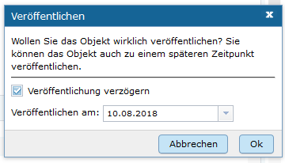

Das Veröffentlichungsdatum wird danach im Kopfbereich des Datensatzes angezeigt.

#### Integration von Vorprüfungen mit negativem Bescheid

Als neuer Datensatztyp können nun "Vorprüfungen mit negativem Bescheid", kurz negative Vorprüfungen im Editor erfasst werden. Die Erfassung erfolgt ähnlich wie alle anderen Datensatztypen.

In den Katalogeinstellungen kann festgelegt werden, ob die erfassten negativen Vorprüfungen im Portal verfügbar sind oder nicht. 

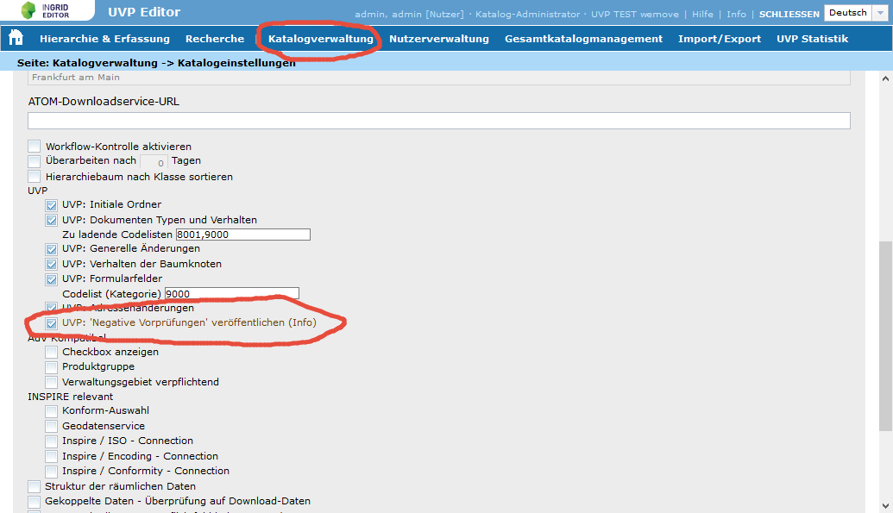

**Diese Entscheidung sollte vorab getroffen werden, weil das Erfassungsformular sich je nach Einstellung anpasst.**

Das Erfassungsformular ohne Veröffentlichung im Portal:

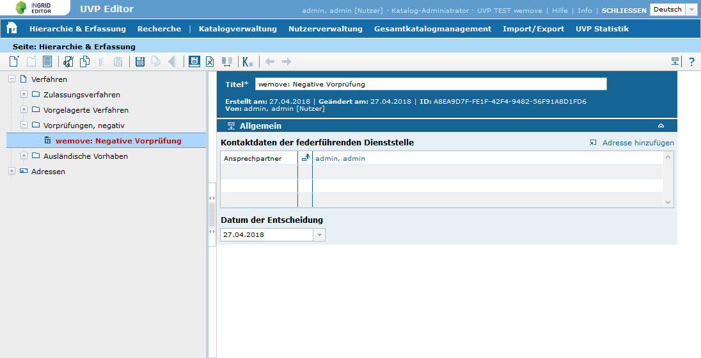

Das Erfassungsformular mit Veröffentlichung im Portal:

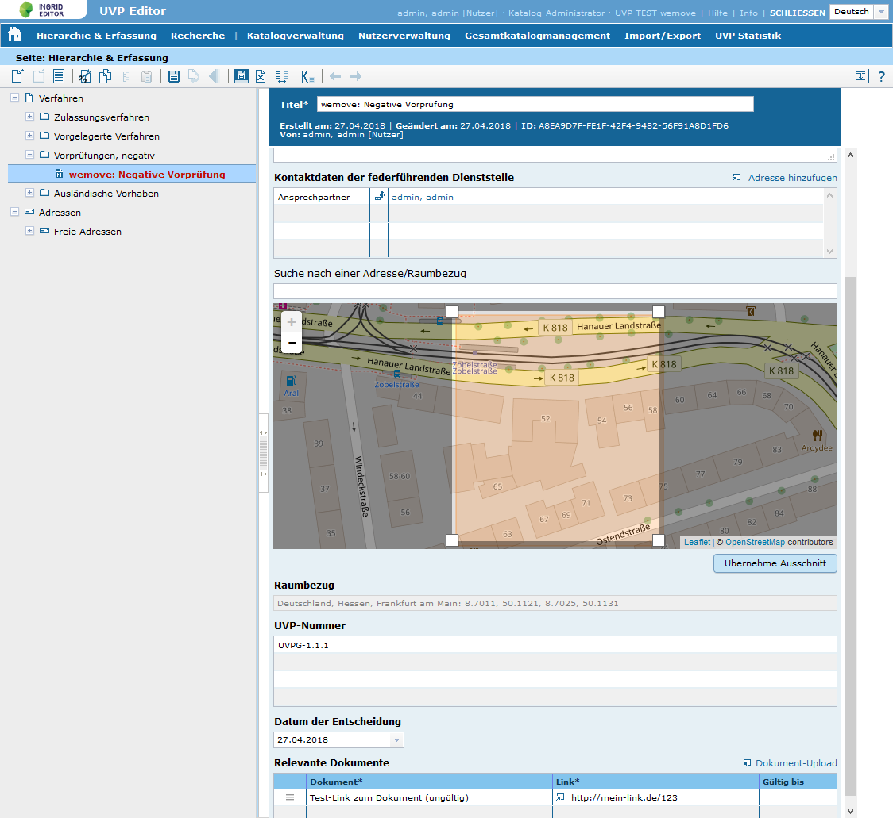

#### Integration UVP Statistik für EU Berichtspflicht

Im UVP Editor kann der Katalogadministrator eine Statistik über verschiedene Aspekte der erfassten Verfahren generieren. Diese Auswertung bildet die Basis für die EU-Berichtpflicht. 

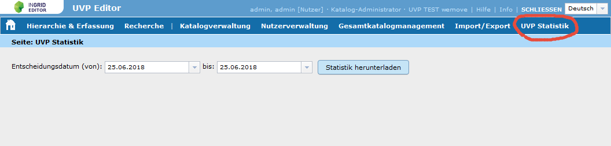

#### UVP: Darstellug von Bauleitplanungsdaten im UVP Portal

Im UVP Portal wurden Bauleitplanungsdaten integriert. Die Daten werden über ein Excel-File erfasst und in das Suchmaschinen iPlug übernommen. Im UVP Portal werden die BLP Daten sowohl in der Kartendarstellung, als auch in der Volltextsuche integriert.

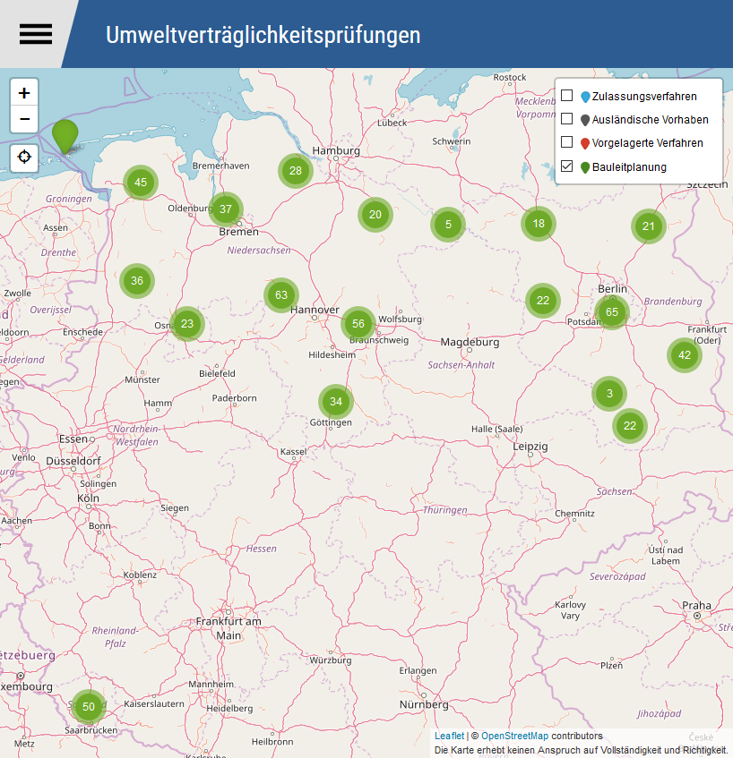

#### UVP: Optimierung der Kartendarstellung im Portal

Die Darstellung der Marker in der Karte der Facettierung erfolgt nun asynchron, so dass Suchergebnisse sehr viel schneller angezeigt werden.

#### Konsolidierung von Komponenten

Ab Version 4.4.0 ist die Verwaltung von Partnern und Anbietern nicht mehr im Portal angesiedelt. Die Verwaltung erfolgt über das CodeList Repository. Dazu wurden neue Codelisten "Partner" und "Anbieter" angelegt. Damit kann die InGrid Infrastruktur nun komplett ohne das Portal betrieben werden.

> **ACHTUNG: In Version 4.0.0 erfolgt kein Backup der im Portal eingepflegten Partner/Anbieter, bitte verwenden Sie für's Portal Version 4.4.1, s.o.
In Version 4.4.0 sollte vor dem Update die Portal-Datenbank, speziell die Tabellen ingrid_partner und ingrid_provider, gesichert werden !**

Das Management iPlug wurde entfernt. Nach einem Upgrade kann das aktuell installierte Management iPlug entfernt werden. Eine Komponente weniger!

Das Codelist Repository wird nun direkt an den iBus angeschlossen.

> **ACHTUNG: Der iBus wurde umfassend überarbeitet und muss in Version 4.4.x NEU installiert werden ! Ein Update auf einen bestehenden iBus ist nicht möglich !**

#### Neue iBus Oberfläche

Im Zuge der Konsolidierung der Komponenten und als Vorgriff auf die Zentralisierung der Indexierung wurde die iBus Admin GUI komplett überarbeitet.

Die Oberfläche ist selbsterklärend und mit einer kontext-sensitiven Hilfe versehen. Neu sind Funktionalitäten für die Verwaltung des zentralen Index.

Weitere Informationen zum iBus erhalten Sie hier: [iBus](../components/ibus.html)

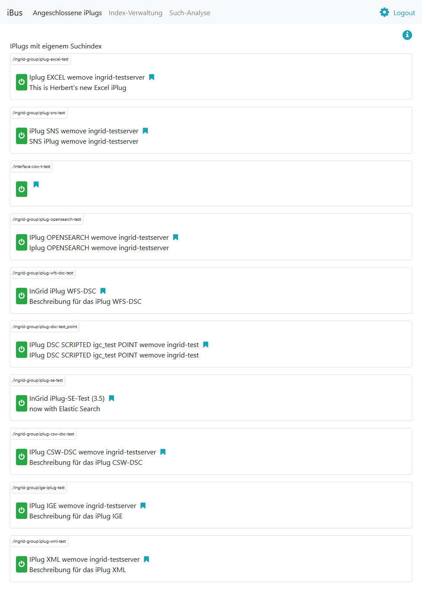

### Liste der Änderungen

InGrid

- [Feature] SYSTEM Konsolidierung von InGrid Komponenten ([REDMINE-4](https://redmine.informationgrid.eu/issues/4))
- [Feature] [IPLUG-WFS] IPLUG-WFS: Mapping Wadaba WFS angepasst (GeoPortal.WSV) ([REDMINE-1114](https://redmine.informationgrid.eu/issues/1114))
- [Bug] [MAPCLIENT] MAPCLIENT: Fehler beim Löschen von alten KML Dateien ([REDMINE-1107](https://redmine.informationgrid.eu/issues/1107))
- [Bug] [MAPCLIENT] MapClient: Link in Embed Version öffnet nicht Karte im Portal ([REDMINE-1090](https://redmine.informationgrid.eu/issues/1090))
- [Bug] [MAPCLIENT] MAPCLIENT: Einbetten in externem iFrame funktioniert nicht ([REDMINE-1089](https://redmine.informationgrid.eu/issues/1089))
- [Bug] [PORTAL] PORTAL: Kontaktformular sendet Attachement ([REDMINE-1074](https://redmine.informationgrid.eu/issues/1074))
- [Info] [INTERFACE-CSW] INTERFACE-CSW: Filterung nach partner, provider, iplug funktioniert nicht per GET Anfrage ([REDMINE-960](https://redmine.informationgrid.eu/issues/960))

UVP

- [Feature] Optimierung der Kartendarstellung im Portal ([REDMINE-1108](https://redmine.informationgrid.eu/issues/1108))
- [Feature] Integration UVP Nummern Bayern ([REDMINE-1097](https://redmine.informationgrid.eu/issues/1097))
- [Feature] Integration von BLP Daten in das uvp-verbund.de - Brandenburg ([REDMINE-1062](https://redmine.informationgrid.eu/issues/1062))
- [Feature] Integration von BLP Daten in das uvp-verbund.de - Saarland ([REDMINE-1008](https://redmine.informationgrid.eu/issues/1008))
- [Feature] UVP: Interimslösung für die Integration von BLP Daten in das uvp-verbund.de, initiiert durch die Partner SL und BB ([REDMINE-980](https://redmine.informationgrid.eu/issues/980))
- [Feature] Statistikfunktionalität für die Erfüllung der EU Berichtspflichten ([REDMINE-905](https://redmine.informationgrid.eu/issues/905))
- [Feature] Darstellung von Vorprüfungen mit negativem Bescheid im Portal ([REDMINE-903](https://redmine.informationgrid.eu/issues/903))
- [Feature] Editor: Umgang mit Vorprüfungspflichtigen Verfahren, Neue Checkbox "Vorprüfung durchgeführt" ([REDMINE-881](https://redmine.informationgrid.eu/issues/881))
- [Feature] Editor: Zeitgesteuerte Veröffentlichungsoption ([REDMINE-601](https://redmine.informationgrid.eu/issues/601))
- [Feature] Erfassung Vorprüfungen mit negativem Bescheid ([REDMINE-478](https://redmine.informationgrid.eu/issues/478))
- [Bug] UVP-NI: Fehler beim Kopieren/Einfügen von Datensätzen ([REDMINE-1067](https://redmine.informationgrid.eu/issues/1067))

NUMIS

- [Bug] Detailanzeige MD-Katalog - Datenformat ([REDMINE-855](https://redmine.informationgrid.eu/issues/855))

BKG

- [Bug] Encoding der Character falsch ([REDMINE-1088](https://redmine.informationgrid.eu/issues/1088))

### Komponenten

- Portal 4.4.1 ([download](https://distributions.informationgrid.eu/ingrid-portal/4.4.1/)) 
- iPlug IGE 4.4.1 ([download](https://distributions.informationgrid.eu/ingrid-iplug-ige/4.4.1/)) 
  **Achtung Schnittstellenänderung! Portal und iPlug IGE müssen zusammen aktualisiert werden.**
- Codelist Repository ([download](https://distributions.informationgrid.eu/ingrid-codelist-repository/4.4.0/))
- iBus ([download](https://distributions.informationgrid.eu/ingrid-ibus/4.4.0/)) 
  **Achtung: Der iBus muss NEU installiert werden und darf nicht per Update auf bestehenden iBus gespielt werden !**
- iPlug WFS ([download](https://distributions.informationgrid.eu/ingrid-iplug-wfs-dsc/4.4.0/))
- iPlug DSC ([download](https://distributions.informationgrid.eu/ingrid-iplug-dsc/4.4.0/))

## Version 4.3.3

Release 14.06.2018

### Liste der Änderungen

UVP
- [Bug] [PORTAL] UVP: Rechtschreibfehler auf der Startseite des Landes BB ([REDMINE-1109](https://redmine.informationgrid.eu/issues/1109))

### Komponenten

- Portal ([download](https://distributions.informationgrid.eu/ingrid-portal/4.3.3/))

## Version 4.3.2

Release 07.06.2018

### Liste der Änderungen

UVP
- [Feature] [PORTAL] UVP: Anpassung der Startseite des Landes BB ([REDMINE-1103](https://redmine.informationgrid.eu/issues/1103))

UVP-NI

- [Feature] [Portal] NUMIS: Aktualisierung PIWIK, Hinzufügen von PIWIK zu UVP-NI Profil ([REDMINE-1106](https://redmine.informationgrid.eu/issues/1106))

### Komponenten

- Portal ([download](https://distributions.informationgrid.eu/ingrid-portal/4.3.2/))

## Version 4.2.5

Release 07.06.2018

### Liste der Änderungen

UVP
- [Feature] [iPlug-SE] iPlugSE: Neue Eigenschaft, um die Instanzdaten vor einem Crawl zu löschen ([REDMINE-1093](https://redmine.informationgrid.eu/issues/1093))

### Komponenten

- iPlug SE ([download](https://distributions.informationgrid.eu/ingrid-iplug-se/4.2.5/))

## Version 4.3.1

Release 29.05.2018

### Liste der Änderungen

InGrid
- [Bug] [IGE] Seite Sessionablauf Layout nicht korrekt für Profile ([REDMINE-1069](https://redmine.informationgrid.eu/issues/1069))
- [Bug] [IGE] Adressen laden nicht ([REDMINE-1092](https://redmine.informationgrid.eu/issues/1092))
- [Bug] [PORTAL] Fehlerhafte Bibliotheken im Portal ([REDMINE-1080](https://redmine.informationgrid.eu/issues/1080))
- [Bug] [PORTAL] Aus initialem Portal MySQL Dump alle nicht nötigen Daten löschen ([REDMINE-1096](https://redmine.informationgrid.eu/issues/1096))

UVP
- [Bug] [PORTAL] UVP: Anzahl der Treffer über die Facettierung stimmt nicht mit Ergebnis überein ([REDMINE-1075](https://redmine.informationgrid.eu/issues/1075))

### Komponenten

- Portal ([download](https://distributions.informationgrid.eu/ingrid-portal/4.3.1/))

## Version 4.3.0

Release 03.04.2018

### Änderungen

#### IGE: Freie Eingabe für "Spezifikation der Konformität"

Der InGrid Editor wurde bezüglich der Erfassung von INSPIRE kompatiblen Metadaten erweitert.
Im Feld "Spezifikation der Konformität" ist neben der Angabe einer INSPIRE kompatiblen Spezifikationsangabe auch eine freie Angabe möglich. Für die Angabe eines freien Eintrages, kann eine lokalen Codeliste als Basis angelegt werden.

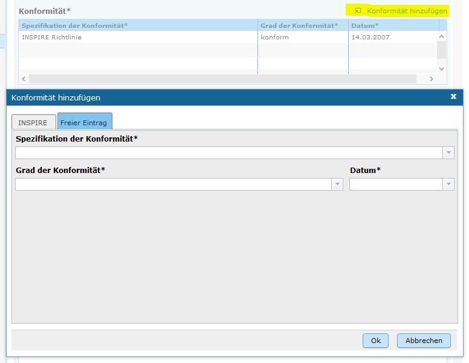

### Liste der Änderungen

InGrid

- [Feature] [PORTAL] Portal: Überarbeitung der Anzeige von Lizenzen in der Detailansicht ([REDMINE-541](https://redmine.informationgrid.eu/issues/541))
- [Feature] [PORTAL] Benutzerprüfung bei der Registrierung im Portal ([REDMINE-60](https://redmine.informationgrid.eu/issues/60))
- [Feature] [PORTAL] Einführen einer Passwort Policy für das Anlegen von Passwörtern im Portal ([REDMINE-829](https://redmine.informationgrid.eu/issues/829))
- [Feature] [IGE] IGE: von INSPIRE entkoppeln: neues zusätzliches Feld "Spezifikation der Konformität" - freie Eingabe ermöglichen ([REDMINE-859](https://redmine.informationgrid.eu/issues/859))
- [Feature] [IGE] IGE: neues zusätzliches Feld "Spezifikation der Konformität" ([REDMINE-827](https://redmine.informationgrid.eu/issues/827))
- [Feature] [IGE] Feld "Konformität der Spezifikation" um freie Eingabe erweitern ([REDMINE-822](https://redmine.informationgrid.eu/issues/822))
- [Feature] [IGE] IGE: von INSPIRE entkoppeln: Feld "INSPIRE-Themen" ändern in konditionales Pflichtfeld ([REDMINE-816](https://redmine.informationgrid.eu/issues/816))
- [Feature] [MAPCLIENT] MapClient: Update auf aktuelle Version vom mf-geoadmin3 ([REDMINE-961](https://redmine.informationgrid.eu/issues/961))
- [Feature] [CODELIST REPOSITORY] IGE: Auswahlliste Datenformat erweitern - Codeliste 1320 ([REDMINE-858](https://redmine.informationgrid.eu/issues/858))
- [Bug] [PORTAL] Leerzeichen vor und hinter dem Benutzernamen abschneiden ([REDMINE-733](https://redmine.informationgrid.eu/issues/733))
- [Bug] [PORTAL] Portal: In der Detaildarstellung werden die Lizenzen nicht korrekt lokalisiert ([REDMINE-862](https://redmine.informationgrid.eu/issues/862))
- [Bug] [MAPCLIENT] MAPCLIENT: Offline-Modus Meldung ([REDMINE-987](https://redmine.informationgrid.eu/issues/987))
- [Bug] [IGE] IGE: Feld "Optionale Schlagworte" immer sichtbar ([REDMINE-953](https://redmine.informationgrid.eu/issues/953))
- [Bug] [IGE] IGE: Fehlende Felder in der PlugDescription ([REDMINE-945](https://redmine.informationgrid.eu/issues/945))
- [Bug] [IGE] IGE: URL Validierung erkennt OGC Dienste inkorrekt als fehlerhaft ([REDMINE-974](https://redmine.informationgrid.eu/issues/974))
- [Bug] [IGE] IGE: Datensätze werden nicht nach Kopiervorgang indexiert ([REDMINE-888](https://redmine.informationgrid.eu/issues/888))
- [Bug] [IGE] Probleme bei GetCapabilities Assistent ([REDMINE-781](https://redmine.informationgrid.eu/issues/781))
- [Bug] [IPLUG_IGE] IGE: Großbuchstaben in den Index-Feldern werden beim Indexieren nicht in Kleinbuchstaben umgewandelt ([REDMINE-944](https://redmine.informationgrid.eu/issues/944))
- [Bug] [CODELIST REPOSITORY] UVP: Manche UVP Nummern mit Sonderzeichen im Namen werden im Editor nicht korrekt dargestellt.  ([REDMINE-963](https://redmine.informationgrid.eu/issues/963))
- [Bug] [CODELIST REPOSITORY] UVP: Datasätze können nicht veröffentlicht werden ([REDMINE-962](https://redmine.informationgrid.eu/issues/962))
- [Bug] [IPLUG-SNS] WFS-GN (Geothesaurus) wird nicht richtig ausgewertet ([REDMINE-993](https://redmine.informationgrid.eu/issues/993))

NUMIS

- [Bug] [PORTAL] Regression: NI BLP Daten werden in UVP-NI Profil in Version 4.2.1 nicht dargestellt. ([REDMINE-969](https://redmine.informationgrid.eu/issues/969))

UVP

- [Feature] [PORTAL] Detailtemplate nds. UVP-Portal ([REDMINE-954](https://redmine.informationgrid.eu/issues/954))
- [Feature] [PORTAL] UVP: Austausch Logo auf HE Vorschaltseite ([REDMINE-984](https://redmine.informationgrid.eu/issues/984))
- [Feature] [IGE] Die gültig-bis Daten einer Dokumententabelle sollen zusammen gesetzt werden können ([REDMINE-895](https://redmine.informationgrid.eu/issues/895))
- [Feature] [IGE] UVP: Ordnerhierarchie und Zip-Upload für Planunterlagen ([REDMINE-890](https://redmine.informationgrid.eu/issues/890))
- [Feature] [SYSTEM] Automatische Aktualisierung BLP-URLs im SE-iPlug des Nds. UVP-Portals ([REDMINE-856](https://redmine.informationgrid.eu/issues/856))
- [Feature] [SYSTEM] Integration der niedersächsischen UVP/BLP-Informationen in das UVP-Gemeinschaftsportal uvp-verbund.de ([REDMINE-915](https://redmine.informationgrid.eu/issues/915))
- [Bug] [PORTAL] Expandicon in UVP Detailansicht ist falsch. ([REDMINE-981](https://redmine.informationgrid.eu/issues/981))
- [Bug] [PORTAL] UVP: Kategorien in mobiler Ansicht ([REDMINE-992](https://redmine.informationgrid.eu/issues/992))
- [Bug] [IGE] Dokumentname bei externem Dateiupload ist falsch. ([REDMINE-978](https://redmine.informationgrid.eu/issues/978))
- [Bug] [IGE] UVP: Anpassung von Menü-Tooltips ([REDMINE-995](https://redmine.informationgrid.eu/issues/995))
- [Bug] [IGE] UVP: Upload funktioniert nicht mit IE 11 ([REDMINE-1001](https://redmine.informationgrid.eu/issues/1001))

### Komponenten

- Portal ([download](https://distributions.informationgrid.eu/ingrid-portal/4.3.0/))
- iPlug IGE ([download](https://distributions.informationgrid.eu/ingrid-iplug-ige/4.3.0/))
  **Achtung Schnittstellenänderung! Portal und iPlug IGE müssen zusammen aktualisiert werden.**
- Codelist Repository ([download](https://distributions.informationgrid.eu/ingrid-codelist-repository/4.3.0/))
- iPlug CSW ([download](https://distributions.informationgrid.eu/ingrid-iplug-csw-dsc/4.3.0/))
- iPlug DSC ([download](https://distributions.informationgrid.eu/ingrid-iplug-dsc/4.3.0/))
- iPlug Excel ([download](https://distributions.informationgrid.eu/ingrid-iplug-excel/4.3.0/))
- iPlug OpenSearch ([download](https://distributions.informationgrid.eu/ingrid-iplug-opensearch/4.3.0/))
- iPlug WFS ([download](https://distributions.informationgrid.eu/ingrid-iplug-wfs-dsc/4.3.0/))
- iPlug XML ([download](https://distributions.informationgrid.eu/ingrid-iplug-xml/4.3.0/))
- iPlug SNS ([download](https://distributions.informationgrid.eu/ingrid-iplug-sns/4.3.0/))
- iPlug Management ([download](https://distributions.informationgrid.eu/ingrid-iplug-management/4.3.0/))

## Version 4.2.4

Release 20.03.2018

### Liste der Änderungen

UVP
- [Bug] [PORTAL] UVP: Upload funktioniert nicht mit IE 11. ([REDMINE-1001](https://redmine.informationgrid.eu/issues/1001))

### Komponenten

- Portal ([download](https://distributions.informationgrid.eu/ingrid-portal/4.2.4/))

## Version 4.2.3

Release 16.03.2018

### Liste der Änderungen

InGrid
- [Feature] [IPLUG-SE] Automatische Aktualisierung BLP-URLs im SE-iPlug ([REDMINE-856](https://redmine.informationgrid.eu/issues/856))
- [Bug] [IPLUG-SE] Verbesserung des UVP BLP Datenimports. ([REDMINE-994](https://redmine.informationgrid.eu/issues/994))

UVP
- [Feature] [PORTAL] Integration der niedersächsischen UVP/BLP-Informationen in das UVP-Gemeinschaftsportal uvp-verbund.de ([REDMINE-915](https://redmine.informationgrid.eu/issues/915))
- [Bug] [PORTAL] Das Icon zum ausklappen der UVP Phasen ist bei der jeweils letzen (defaultmäßig bereits ausgklappten) Phase falsch. ([REDMINE-981](https://redmine.informationgrid.eu/issues/981))
- [Bug] [PORTAL] In der mobilen Ansicht ist die Darstellung der Kategorien nicht korrekt. ([REDMINE-992](https://redmine.informationgrid.eu/issues/992))
- [Bug] [PORTAL] UVP: Korrektur von Menü-Tooltips ([REDMINE-995](https://redmine.informationgrid.eu/issues/995))

### Komponenten

- Portal ([download](https://distributions.informationgrid.eu/ingrid-portal/4.2.3/))
- iPlug SE ([download](https://distributions.informationgrid.eu/ingrid-iplug-se/4.2.3/))

## Version 4.2.2

Release 09.03.2018

### Liste der Änderungen

InGrid
- [Bug] [IPLUG-SE] IPLUG SE: Metadaten werden nicht gespeichert ([REDMINE-972](https://redmine.informationgrid.eu/issues/972))

NUMIS
- [Bug] [PORTAL] Regression: NI BLP Daten werden in UVP-NI Profil in Version 4.2.1 nicht dargestellt. ([REDMINE-969](https://redmine.informationgrid.eu/issues/969))

UVP
- [Feature] [PORTAL] UVP: Austausch Logo auf HE Vorschaltseite ([REDMINE-984](https://redmine.informationgrid.eu/issues/984))
- [Bug] [IGE] Dokumentname bei externem Dateiupload ist falsch. ([REDMINE-978](https://redmine.informationgrid.eu/issues/978))

### Komponenten

- Portal ([download](https://distributions.informationgrid.eu/ingrid-portal/4.2.2/))
- iPlug IGE ([download](https://distributions.informationgrid.eu/ingrid-iplug-ige/4.2.2/))
  **Achtung Schnittstellenänderung! Portal und iPlug IGE müssen zusammen aktualisiert werden.**
- iPlug SE ([download](https://distributions.informationgrid.eu/ingrid-iplug-se/4.2.2/))

## Version 4.2.1

Release 08.02.2018

### Änderungen

#### Einführung einer Passwort Policy bei der Registrierung im Portal

Bei der Registrierung im Portal wird eine Passwort Policy eingesetzt, um zu einfache Passwörter zu vermeiden. Die eingesetzte Policy ist unter https://github.com/dropbox/zxcvbn dokumentiert.

Um einen neuen Benutzer anlegen zu können muss das Passwort mind. die Stärke 3 (Gut) haben. Die erlaubte Passwortstärke kann in der Portal-Konfiguration geändert werden

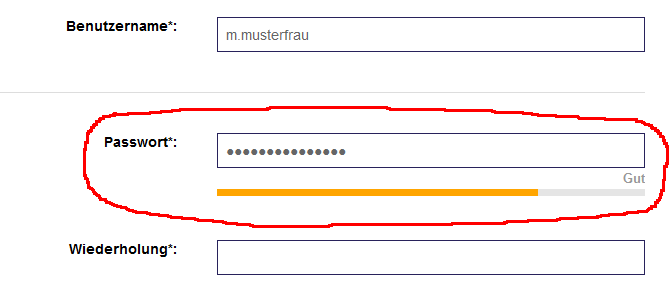

Außerdem wurden die möglichen Zeichen für den Benutzernamen auf folgende Zeichen beschränkt: Buchstaben (keine Umlaute), Zahlen, ., -, @, # und _

#### UVP: Automatisches Entpacken von ZIP Archiven

Hochgeladene ZIP Archive können automatisch entpackt werden.

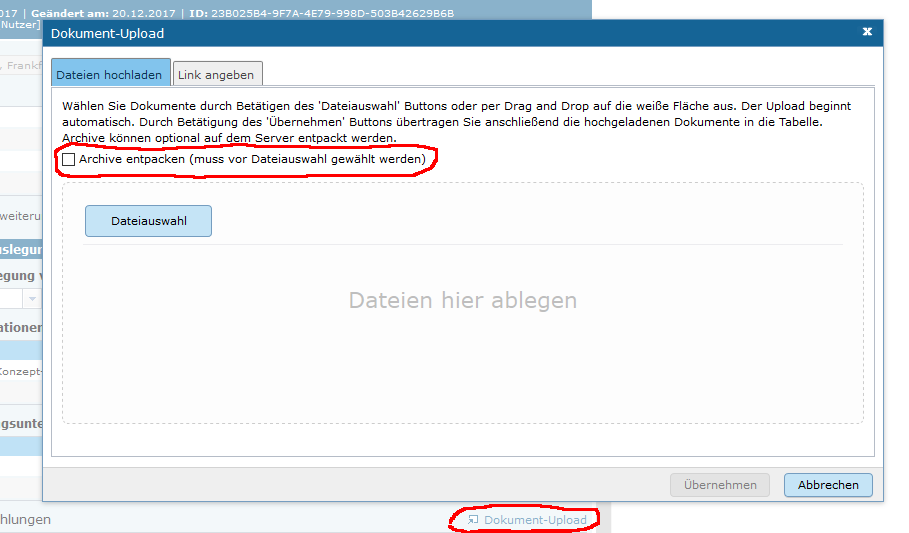

Die Ordnerstrukturen bleiben erhalten und werden nach Ordnern und Dateien alphabetisch sortiert übernommen. Der Name der ZIP Datei bleibt erhalten.

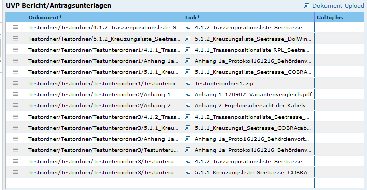

Im Portal erfolgt die Darstellung hierarchisch. Die Struktur innerhalb des ZIP Archives bleibt erhalten.

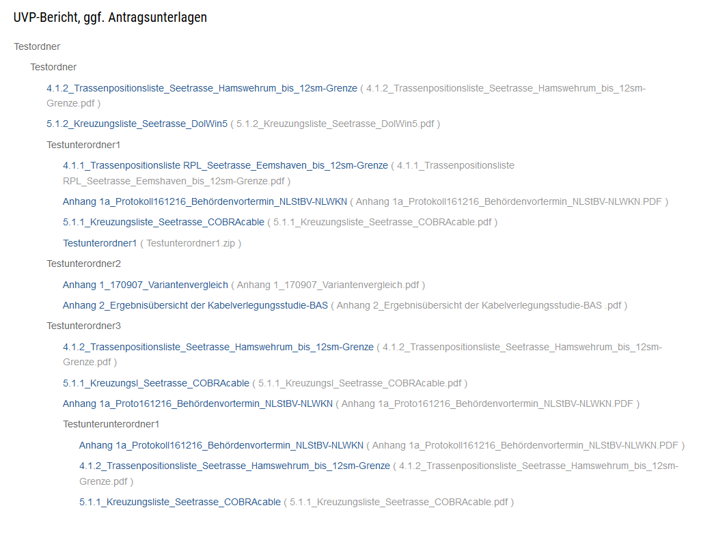

### Liste der Änderungen

- [Feature] [PORTAL] Benutzerprüfung bei der Registrierung im Portal ([REDMINE-60](https://redmine.informationgrid.eu/issues/60))
- [Feature] [PORTAL] Einführen einer Passwort Policy für das Anlegen von Passwörtern im Portal ([REDMINE-829](https://redmine.informationgrid.eu/issues/829))
- [Feature] [IGE] IGE/PORTAL: GeoThesaurus funktioniert nicht mit Java 8 162 ([REDMINE-965](https://redmine.informationgrid.eu/issues/965))
- [Feature] [MAPCLIENT] MapClient: Update auf aktuelle Version vom mf-geoadmin3 ([REDMINE-961](https://redmine.informationgrid.eu/issues/961))
- [Bug] [PORTAL] PORTAL, IGE, SNS-IPLUG: Anpassung an den neuen WFS Service ([REDMINE-946](https://redmine.informationgrid.eu/issues/946))
- [Bug] [PORTAL] Portal: In der Detaildarstellung werden die Lizenzen nicht korrekt lokalisiert ([REDMINE-862](https://redmine.informationgrid.eu/issues/862))
- [Bug] [PORTAL] Leerzeichen vor und hinter dem Benutzernamen abschneiden ([REDMINE-733](https://redmine.informationgrid.eu/issues/733))
- [Bug] [IGE] Probleme bei GetCapabilities Assistent ([REDMINE-781](https://redmine.informationgrid.eu/issues/781))
- [Bug] [IPLUG-SE] IPLUG-SE: Nutch loggt unbegrenzte Anzahl von Dateien, was zu Platzproblemen führt ([REDMINE-942](https://redmine.informationgrid.eu/issues/942))
- [Bug] [CODELIST REPOSITORY] Aktualisierung des Codelisterepositories schägt fehl, auf Grund von nicht existierenden UVP Nummern Codelisten ([REDMINE-955](https://redmine.informationgrid.eu/issues/955))

UVP

- [Feature] [IGE] UVP: Ordnerhierarchie und Zip-Upload für Planunterlagen ([REDMINE-890](https://redmine.informationgrid.eu/issues/890))
- [Feature] [Portal] Detailtemplate nds. UVP-Portal ([REDMINE-954](https://redmine.informationgrid.eu/issues/954))
- [Bug] [IGE] IGE: Formular unvollständig im IE ([REDMINE-949](https://redmine.informationgrid.eu/issues/949))

### Komponenten

- Portal ([download](https://distributions.informationgrid.eu/ingrid-portal/4.2.1/))
- Codelist Repository ([download](https://distributions.informationgrid.eu/ingrid-codelist-repository/4.2.1/))
- iPlug SE ([download](https://distributions.informationgrid.eu/ingrid-iplug-se/4.2.1/))
- iPlug SNS ([download](https://distributions.informationgrid.eu/ingrid-iplug-sns/4.2.1/))

## Version 4.1.7

Release 04.02.2018

### Liste der Änderungen

- [Bug] [Portal] IGE: Formular unvollständig im IE  ([REDMINE-949](https://redmine.informationgrid.eu/issues/949))
- [Bug] [Portal] IGE: Probleme bei GetCapabilities Assistent  ([REDMINE-781](https://redmine.informationgrid.eu/issues/781))
- [Bug] [Portal] IGE: Anpassung an den neuen WFS Service  ([REDMINE-946](https://redmine.informationgrid.eu/issues/946))

Profil UVP

- [Bug] [Portal] UVP: Datasätze können nicht veröffentlicht werden ([REDMINE-962](https://redmine.informationgrid.eu/issues/962))
- [Bug] [Portal] UVP: Manche UVP Nummern mit Sonderzeichen im Namen werden im Editor nicht korrekt dargestellt.  ([REDMINE-963](https://redmine.informationgrid.eu/issues/963))

Profil RLP

- [Bug] [Portal] Anpassung Hilfe bzgl. AGS/RS Suche ([REDMINE-934](https://redmine.informationgrid.eu/issues/934))

### Komponenten

- Portal ([download](https://distributions.informationgrid.eu/ingrid-portal/4.1.7/))
- Codelist Repository ([download](https://distributions.informationgrid.eu/ingrid-codelist-repository/4.1.7/))

## Version 4.2.0

Release: 05.01.2018

### Änderungen

#### Neue Eingabeelemente für die Struktur der räumlichen Daten

Bei Auswahl von "Raster, Gitter" in dem Element "Digitale Repräsentation" könnn nun Angaben zu der Struktur der räumlichen Daten gemacht werden.

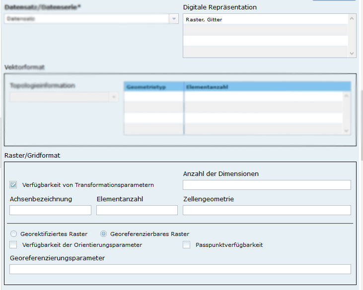

#### UVP: Die "gültig-bis" Daten von mehrern Zeilen einer Dokumententabelle können zusammen gesetzt werden.

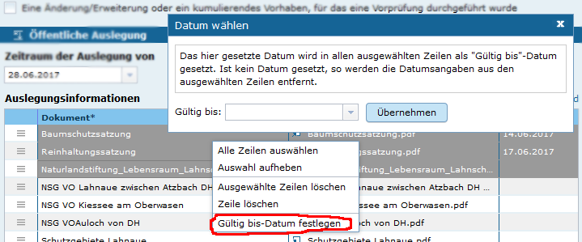

#### UVP: Sortierfunktion für Zeilen in Dokumententabellen

Über Drag&Drop kann die Reihenfolge von Zeilen in den Dokumententabellen verändert werden.

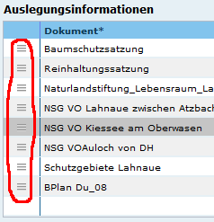

Die Reihenfolge wirkt sich auch auf die Darstellung im Portal aus.

### Liste der Änderungen

- [Feature] [IGE] Anpassung bzgl. Struktur der räuml. Daten (spatialRepresentationInfo) ([REDMINE-381](https://redmine.informationgrid.eu/issues/381))
- [Feature] [IGE] Begrenzung der Eingabe im Titel (Objektname) auf 255 Zeichen ([REDMINE-941](https://redmine.informationgrid.eu/issues/941))
- [Feature] [Portal] Update auf neueste Jetspeed Version 2.3.1 ([REDMINE-301](https://redmine.informationgrid.eu/issues/301))
- [Feature] [Portal] Unterstützung von PostGres bei Portal Profilumschaltung ([REDMINE-891](https://redmine.informationgrid.eu/issues/891))
- [Feature] [Codelist-Repo] Aktualisierung des Codelist-Repository für Docker ([REDMINE-707](https://redmine.informationgrid.eu/issues/707))
- [Bug] [IGE] Metadatenautoren können bei Unterdatensatz-Berechtigung keine Ordner über die Toolbox anlegen ([REDMINE-809](https://redmine.informationgrid.eu/issues/809))
- [Bug] [IGE] Metadatenautoren können den Datensatztyp (Geodatendienst) nach Erstellung ändern ([REDMINE-810](https://redmine.informationgrid.eu/issues/810))
- [Bug] [IGE] Ein Adress-Ordner darf sich nicht als Adressreferenz in einem Datensatz hinzufügen lassen ([REDMINE-812](https://redmine.informationgrid.eu/issues/812))
- [Bug] [IGE] Beim Import von ISO Daten muss ein Ordner als Import-Knoten auswählbar sein ([REDMINE-814](https://redmine.informationgrid.eu/issues/814))
- [Bug] [IGE] GetCapabilities Assistent liest Layerdaten nicht korrekt ein ([REDMINE-872](https://redmine.informationgrid.eu/issues/872))
- [Bug] [IGE] Kein Hinweis wenn Dokument bearbeitet ([REDMINE-884](https://redmine.informationgrid.eu/issues/884))
- [Bug] [IGE] Berechtigungsbaum wird nicht mehr dargestellt, wenn beim Anlegen einer Gruppe nach Hierarchie/Erfassung gesprungen wird ([REDMINE-885](https://redmine.informationgrid.eu/issues/885))
- [Bug] [IGE] Die Templates "session_expired.jsp" und "not_supported_browser.jsp" sind nicht an das neue Layout angepasst ([REDMINE-887](https://redmine.informationgrid.eu/issues/887))
- [Bug] [Portal] MapClient stellt Karte nach Verweis von Suchergebnis nicht korrekt dar ([REDMINE-886](https://redmine.informationgrid.eu/issues/886))
- [Bug] [Portal] Nicht hinzugefügte Kataloge führen zu falschen Katalog-Benutzern beim SuperAdmin-Login ([REDMINE-937](https://redmine.informationgrid.eu/issues/937))

Profil UVP

- [Feature] [IGE] Editor: Die Eingabe eines zurückliegenden Datums bei "gültig bis" in den Dokumententabellen soll verhindert werden ([REDMINE-620](https://redmine.informationgrid.eu/issues/620))
- [Feature] [IGE] Editor: Enfernen von Checkbox "Detailansicht" aus Vorschau und Druckansicht für Verfahren ([REDMINE-681](https://redmine.informationgrid.eu/issues/681))
- [Feature] [IGE] Die gültig-bis Daten einer Dokumententabelle sollen zusammen gesetzt werden können ([REDMINE-895](https://redmine.informationgrid.eu/issues/895))
- [Feature] [IGE, Portal] Sortierfunktion der einzustellenden Dokumente ([REDMINE-900](https://redmine.informationgrid.eu/issues/900))
- [Feature] [Codelist-Repo] Integration UVP Nummern Baden-Württemberg ([REDMINE-870](https://redmine.informationgrid.eu/issues/870))
- [Bug] [IGE] Editor: Adresse anlegen: Auswahlmöglichkeit (Institution, Einheit, Person) fehlt ab und zu ([REDMINE-839](https://redmine.informationgrid.eu/issues/839))
- [Bug] [IGE] Editor: Bestätigungsfelder für das Löschen und Ändern (Popups). In manchen Situationen fehlen die Schaltflächen ([REDMINE-840](https://redmine.informationgrid.eu/issues/840))
- [Bug] [IGE] Editor: UVP Nummern Kürzel sind oft nicht sortierbar ([REDMINE-930](https://redmine.informationgrid.eu/issues/930))
- [Bug] [IGE, Portal] Datumsformat in der Portal-Detailansicht und in der Druckvorschau im Katalog ([REDMINE-936](https://redmine.informationgrid.eu/issues/936))

### Komponenten

- Portal ([download](https://distributions.informationgrid.eu/ingrid-portal/4.2.0/))
- iPlug IGE ([download](https://distributions.informationgrid.eu/ingrid-iplug-ige/4.2.0/))
  **Achtung Schnittstellenänderung! Portal und iPlug IGE müssen zusammen aktualisiert werden.**
- Codelist Repository ([download](https://distributions.informationgrid.eu/ingrid-codelist-repository/4.2.0/))
- iBus ([download](https://distributions.informationgrid.eu/ingrid-ibus/4.2.0/))
- Interface CSW ([download](https://distributions.informationgrid.eu/ingrid-interface-csw/4.2.0/))
- Interface Search (OpenSearch, ATOM DLS) ([download](https://distributions.informationgrid.eu/ingrid-interface-search/4.2.0/))
- iPlug CSW ([download](https://distributions.informationgrid.eu/ingrid-iplug-csw-dsc/4.2.0/))
- iPlug DSC ([download](https://distributions.informationgrid.eu/ingrid-iplug-dsc/4.2.0/))
- iPlug SE ([download](https://distributions.informationgrid.eu/ingrid-iplug-se/4.2.0/))
- iPlug WFS ([download](https://distributions.informationgrid.eu/ingrid-iplug-wfs-dsc/4.2.0/))
- iPlug SNS ([download](https://distributions.informationgrid.eu/ingrid-iplug-sns/4.2.0/))
- iPlug Excel ([download](https://distributions.informationgrid.eu/ingrid-iplug-excel/4.2.0/))
- iPlug XML ([download](https://distributions.informationgrid.eu/ingrid-iplug-xml/4.2.0/))
- iPlug OpenSearch ([download](https://distributions.informationgrid.eu/ingrid-iplug-opensearch/4.2.0/))
- Server OpenSearch ([download](https://distributions.informationgrid.eu/ingrid-server-opensearch/4.2.0/))

## Version 4.1.6

Release 20.12.2017

### Änderungen

- [Bug] [Portal] Anzeige von Datensätzen Probleme im Portal  ([REDMINE-931](https://redmine.informationgrid.eu/issues/931))
- [Bug] [Portal] PORTAL: Unter "Metadate"n fehlen die checkboxen der hinzugefügten Kataloge ([REDMINE-938](https://redmine.informationgrid.eu/issues/938))

Profil UVP

- [Feature] [Codelist-Repo] Integration UVP Nummern Nordrhein-Westfalen ([REDMINE-925](https://redmine.informationgrid.eu/issues/925))
- [Feature] [Portal] UVP: Anpassung Vorschaltseite Berlin ([REDMINE-939](https://redmine.informationgrid.eu/issues/939))

### Komponenten

- Portal ([download](https://distributions.informationgrid.eu/ingrid-portal/4.1.6/))
- Codelist Repository ([download](https://distributions.informationgrid.eu/ingrid-codelist-repository/4.1.6/))

## Version 4.1.5

Release: 14.12.2017

### Änderungen

- [Bug] [Portal] Räumliche Suche nach AGS/RS funktioniert nicht  ([REDMINE-934](https://dev.informationgrid.eu/redmine/issues/934))
- [Bug] [IGE] Kindadressen werden nicht auf Veröffentlichungsbreite geprüft und auch geliefert, wenn "amtsinten" (Detaildarstellung) ([REDMINE-933](https://dev.informationgrid.eu/redmine/issues/933))
- [Bug] [Portal] Anzeige von Datensätzen Probleme im Portal  ([REDMINE-931](https://dev.informationgrid.eu/redmine/issues/931))
- [Bug] [Codelist-Repo] Codelist-Repo: Fährt nach Update nicht mehr hoch ([REDMINE-928](https://dev.informationgrid.eu/redmine/issues/928)) 

Profil UVP

- [Feature] [Portal] UVP: Anpassung Vorschaltseite Schleswig-Holstein ([REDMINE-932](https://dev.informationgrid.eu/redmine/issues/932))
- [Feature] [Codelist-Repo] UVP: Integration UVP Nummern für NRW ([REDMINE-925](https://dev.informationgrid.eu/redmine/issues/925))

Profil RLP

- [Feature] [Portal] Upgrade PortalU.rlp auf aktuellste InGrid Version ([REDMINE-568](https://dev.informationgrid.eu/redmine/issues/568))

### Komponenten

- Portal ([download](https://distributions.informationgrid.eu/ingrid-portal/4.1.5/))
- iPlug IGE ([download](https://distributions.informationgrid.eu/ingrid-iplug-ige/4.1.5/))
- Codelist Repository ([download](https://distributions.informationgrid.eu/ingrid-codelist-repository/4.1.5/))

## Version 4.1.4

Release: 28.11.2017

### Änderungen

- [Bug] [IGE] Portal: Anpassung von Facettierung und Entfernen von Altlasten  ([REDMINE-926](https://dev.informationgrid.eu/redmine/issues/926))
- [Bug] [Codelist-Repo] Codelist-Repo: Fährt nach Update nicht mehr hoch ([REDMINE-928](https://dev.informationgrid.eu/redmine/issues/928)) 
- [Bug] [Portal] Funktion 'Passwort vergessen' von mehreren Benutzern mit gleicher E-Mail Adresse angepasst. ([REDMINE-927](https://dev.informationgrid.eu/redmine/issues/927)) 
- [Bug] [Portal] Webmap-Client fährt nicht hoch nach Portal-Installation unter Windows. ([REDMINE-929](https://dev.informationgrid.eu/redmine/issues/929)) 

Profil UVP, UVP-NI

- [Bug] [IGE] UVP: Einträge in Dokumententabellen, deren "gültig-bis" Datum schon abgelaufen war, werden immer noch angezeigt. Für das docker setup wurde eine automatische Indexierung vorgesehen.  ([REDMINE-920](https://dev.informationgrid.eu/redmine/issues/920))

Profil RLP

- [Feature] [Portal] Upgrade PortalU.rlp auf aktuellste InGrid Version ([REDMINE-568](https://dev.informationgrid.eu/redmine/issues/568))

Profil UVP-NI, NUMIS

- [Feature] [Portal] Namensänderung MU in den Footern von UVP- und NUMIS-Portal ([REDMINE-926](https://dev.informationgrid.eu/redmine/issues/926))

### Komponenten

- Portal ([download](https://distributions.informationgrid.eu/ingrid-portal/4.1.4/))
- iPlug IGE ([download](https://distributions.informationgrid.eu/ingrid-iplug-ige/4.1.4/))
- Codelist Repository ([download](https://distributions.informationgrid.eu/ingrid-codelist-repository/4.1.4/))

## Version 4.1.3

Release: 21.11.2017

### Änderungen

Profil UVP-NI

- [Feature] [Portal] Überarbeitung UVP-NI Header ([REDMINE-898](https://dev.informationgrid.eu/redmine/issues/898))
- [Feature] [Portal] Überarbeitung UVP-NI Suchkarte ([REDMINE-897](https://dev.informationgrid.eu/redmine/issues/897))

### Komponenten

- Portal ([download](https://distributions.informationgrid.eu/ingrid-portal/4.1.3/))

## Version 4.1.2

Release: 16.11.2017

### Änderungen

Profil UVP, UVP-NI

- [Feature] [IGE] Überarbeitung von UVP Hilfetexten nach UVPG Gesetzänderung ([REDMINE-918](https://dev.informationgrid.eu/redmine/issues/918))

Profil BKG

- [Feature] [Portal] Aktivierung Portalprofil BKG in Portal Administration ([REDMINE-892](https://dev.informationgrid.eu/redmine/issues/892))

### Komponenten

- Portal ([download](https://distributions.informationgrid.eu/ingrid-portal/4.1.2/))

## Version 4.1.1

Release: 23.10.2017

### Änderungen

- [Bug] [IGE] IGE: Berechtigungsbaum wird nicht mehr dargestellt,  wenn beim Anlegen einer Gruppe nach Hierarchie/Erfassung gesprungen wird ([REDMINE-885](https://dev.informationgrid.eu/redmine/issues/885))
- [Bug] [IGE] IGE: Kein Hinweis wenn Dokument bearbeitet ([REDMINE-884](https://dev.informationgrid.eu/redmine/issues/884))
- [Bug] [IGE] IGE: Ein Adress-Ordner darf sich nicht als Adressreferenz in einem Datensatz hinzufügen lassen ([REDMINE-812](https://dev.informationgrid.eu/redmine/issues/812))
- [Bug] [IGE] IGE: Metadatenautoren können den Datensatztyp (Geodatendienst) nach Erstellung ändern ([REDMINE-810](https://dev.informationgrid.eu/redmine/issues/810))
- [Bug] [IGE] IGE: Metadatenautoren können bei Unterdatensatz-Berechtigung keine Ordner über die Toolbox anlegen ([REDMINE-809](https://dev.informationgrid.eu/redmine/issues/809))

Profil UVP

- [Feature] [IGE] Integration UVP Nummern Baden-Württemberg ([REDMINE-870](https://dev.informationgrid.eu/redmine/issues/870))
- [Bug] [IGE] Editor: Fehlerhafter Tooltip über Auf/Zuklapp ICON von Verfahrensschritten ([REDMINE-882](https://dev.informationgrid.eu/redmine/issues/882))

### Komponenten

- Portal ([download](https://distributions.informationgrid.eu/ingrid-portal/4.1.1/))
- Codelist Repository ([download](https://distributions.informationgrid.eu/ingrid-codelist-repository/4.1.1/))

## Version 4.1.0

Release: 05.10.2017

### Änderungen

#### IGE: Mehrfachangabe von Sprache der Ressource

Die Angabe von mehreren Resource-Sprachen ist nun möglich.

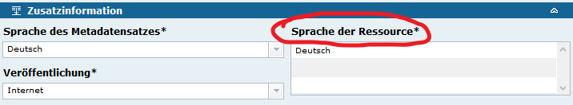

#### IGE: Weitere Erhöhung der Kompatibilität mit INSPIRE TG

Die Unterstützung der INSPIRE TG im InGrid Editor wurde weiter verbessert.

* Zusätzliche Checkbox "konform/nicht konform" bei Aktivierung von Checkbox "INSPIRE-relevanter Datensatz"

  INSPIRE-relevante Datensätze können nun nach konform/nicht-konform klassifiziert werden. Die Klassifikation wirkt sich auf die Validierung der Eingaben und das generierte ISO 19139 Format aus. Genauere Informationen finden sich hier: https://dev.informationgrid.eu/redmine/issues/367

  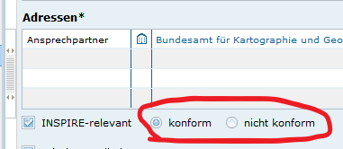

* Die Kompatibilität der Abbildung nach ISO 19139 und die Validierung nach INSPIRE Regularien wurden überprüft und weiter verbessert.

* Codelisten wurden aktualisiert.

#### Aktualisierung des MapClients auf die neuste Version des Projektes ***geoportal.xyz***

Der MapClient wurden auf die neuste Version des zugrunde liegenden openSource Projektes aktualisiert (tag:r_170725). Damit unterstützt der MapClient die Einbindung von WMTS Diensten. Wie im MapClient die Konfigurationen eingebunden werden können ist hier dokumentiert

[Dokumentation der MapClient Konfiguration](webmap_client_admin.html#daten-f%C3%BCr-den-webmap-client)

#### Konfiguration von Login und Registrierung

Die Möglichkeit, dass sich Benutzern selbst am Portal registrieren, kann per Konfiguration abgeschaltet werden. Die Erstellung von Portalbenutzern ist dann ausschließlich durch den Portal-Administrator möglich.

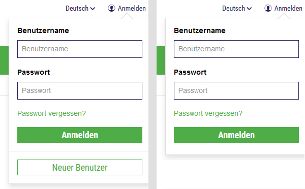

Zudem wurde die Möglichkeit eingeführt, die Anmeldung per Konfiguration komplett auszublenden. Ein Login am Portal ist dann dennoch über einen versteckten Link */log-in* möglich.

### Weitere Änderungen

- [Feature] [Mapclient] MapClient: Update auf aktuelle Version vom mf-geoadmin3 ([REDMINE-565](https://dev.informationgrid.eu/redmine/issues/565))
- [Feature] [Mapclient] MAPCLIENT: Override-Mechanismus für Properties ([REDMINE-798](https://dev.informationgrid.eu/redmine/issues/798))
- [Feature] [IGE] IGE: Zusätzliche Checkbox "konform/nicht konform" bei Aktivierung von Checkbox "INSPIRE-relevanter Datensatz" ([REDMINE-367](https://dev.informationgrid.eu/redmine/issues/367))
- [Feature] [IGE] IGE: Überprüfung Funktionalität Checkbox "INSPIRE-relevanter Datensatz" ([REDMINE-368](https://dev.informationgrid.eu/redmine/issues/368))
- [Feature] [IGE] IGE: Codeliste 6010 für Feld "Zugriffsbeschränkungen" in Codelist Repo integrieren und nicht als lokale Liste im Katalog pflegen ([REDMINE-563](https://dev.informationgrid.eu/redmine/issues/563))
- [Feature] [IGE] IGE: Mehrfachangabe von "Sprache der Ressource" ([REDMINE-199](https://dev.informationgrid.eu/redmine/issues/199))
- [Feature] [IGE] Aktualisierung der Codeliste 6005 "Konformität - Spezifikation der Konformität" ([REDMINE-790](https://dev.informationgrid.eu/redmine/issues/790))
- [Feature] [iPlug-SE] IPLUG-SE: Hinzufügen von Koordinaten für SE-Treffer ([REDMINE-789](https://dev.informationgrid.eu/redmine/issues/789))
- [Feature] [Portal] PORTAL: Deaktivierung der Funktion "Neue Benutzer" ([REDMINE-852](https://dev.informationgrid.eu/redmine/issues/852))
- [Bug] [Codelist-Repository] Codelist-Repository: Update-Dateien werden mehrfach augeführt ([REDMINE-766](https://dev.informationgrid.eu/redmine/issues/766))
- [Bug] [Codelist-Repository] Codelist-Repository: Fehler beim Speichern wird nicht angezeigt ([REDMINE-797](https://dev.informationgrid.eu/redmine/issues/797))
- [Bug] [IGE] IGE: Vererbung von Adressen schlägt fehl ([REDMINE-491](https://dev.informationgrid.eu/redmine/issues/491))
- [Bug] [IGE] IGE Import: Importierte Daten werden nicht sofort indexiert (CSW-T, InGrid Import) ([REDMINE-527](https://dev.informationgrid.eu/redmine/issues/527))
- [Bug] [IGE] IGE iPlug: Aktualisierung des Indexes bei Importprozessen stört transaktionales Verhalten ([REDMINE-611](https://dev.informationgrid.eu/redmine/issues/611))
- [Bug] [IGE] Import-Funktionalität für IGE-Feld "AdV-Produktgruppe" fehlerhaft ([REDMINE-725](https://dev.informationgrid.eu/redmine/issues/725))
- [Bug] [IGE] ISO-Element "administrativeArea" steht im ISO-XML an falscher Stelle ([REDMINE-751](https://dev.informationgrid.eu/redmine/issues/751))
- [Bug] [IGE] IGE: Codelist 6100 - Eintrag korrigieren ([REDMINE-769](https://dev.informationgrid.eu/redmine/issues/769))
- [Bug] [IGE] IGE: aus zip.File wird nur 1.MD importiert ([REDMINE-846](https://dev.informationgrid.eu/redmine/issues/846))
- [Bug] [IGE] IPLUG_IGE: Datenbankschema in der Datenbank Verbindung wird nicht konsistent unterstützt ([REDMINE-864](https://dev.informationgrid.eu/redmine/issues/864))
- [Bug] [IGE] IGE: Capabilities Assistent funktioniert nicht mit Diensten, die im Layer kein "EX_GeographicBoundingBox" Element definiert haben ([REDMINE-867](https://dev.informationgrid.eu/redmine/issues/867))
- [Bug] [IGE] IGE (HH): Feld Nutzungsbedingungen wird optional ([REDMINE-869](https://dev.informationgrid.eu/redmine/issues/869))
- [Bug] [Interface Search] INTERFACE-SEARCH: Doppelte Verbindung zum iBus ([REDMINE-811](https://dev.informationgrid.eu/redmine/issues/811))
- [Bug] [iPlug WFS] IPLUG-WFS: Beim Schreiben vieler Status Zeilen während des Indexierens wird letzte Zeile nicht mehr angezeigt. ([REDMINE-842](https://dev.informationgrid.eu/redmine/issues/842))
- [Bug] [iPlug WFS IPLUG-WFS: Endlosschleife beim Indexieren, da Job immer wieder ausgeführt wird. ([REDMINE-843](https://dev.informationgrid.eu/redmine/issues/843))
- [Bug] [Mapclient] MAPCLIENT: Fehler beim Karten-Druck mit vielen Layern ([REDMINE-741](https://dev.informationgrid.eu/redmine/issues/741))
- [Bug] [Portal] Portal-Installation funktioniert nicht bei Änderungen der MapClient-Einstellungen ([REDMINE-788](https://dev.informationgrid.eu/redmine/issues/788))
- [Bug] [Portal] Portal: Zusätzliche Felder werden nicht automatisch in der Detaildarstellung angezeigt ([REDMINE-813](https://dev.informationgrid.eu/redmine/issues/813))
- [Bug] [Portal] PORTAL: Aktualisierung Portal Datenbank auf Oracle funktioniert nicht via Flyway ([REDMINE-850](https://dev.informationgrid.eu/redmine/issues/850))

Profil BKG

- [Profil BKG] [Bug] [IGE] -  IGE: Validierung möglicherweise fehlerhaft ([REDMINE-768](https://dev.informationgrid.eu/redmine/issues/768))
- [Profil BKG] [Feature] [IGE] - Feature IGE: BKG spezifisches Verhalten der Checkbox "OpenData" ([REDMINE-339](https://dev.informationgrid.eu/redmine/issues/339))
- [Profil BKG] [Support] [IGE] - Support BKG-CodeList 10005 editiert ([REDMINE-750](https://dev.informationgrid.eu/redmine/issues/750))

Profil NUMIS

- [Profil NUMIS] [Bug] [Portal] - Bug Falsche verfahrensführende Stelle bei BLP Treffern, fehlende "Pille" bei Treffern aus dem UVP Katalog ([REDMINE-825](https://dev.informationgrid.eu/redmine/issues/825))
- [Profil NUMIS] [Feature] [Portal] - Feature Entfernung Breadcrumb in UVP-NI Portal ([REDMINE-786](https://dev.informationgrid.eu/redmine/issues/786))
- [Profil NUMIS] [Feature] [Portal] - Feature Einblenden einer Pille "Bauleitplanung" bei Treffern vom Typ Bauleitplanung, ähnlich wie bei UVP Treffern ([REDMINE-787](https://dev.informationgrid.eu/redmine/issues/787))
- [Profil NUMIS] [Feature] [Portal] - Feature Messwerteclient: Vorhaltezeit auf 3 Monate ändern ([REDMINE-795](https://dev.informationgrid.eu/redmine/issues/795))

Profil RLP

- [Profil RLP] [Bug] [IGE] - Bug IGE: Ordner anlegen ([REDMINE-803](https://dev.informationgrid.eu/redmine/issues/803))
- [Profil RLP] [Bug] [IGE] - Bug IGE: Neu anlegen "Assistenten wählen" ([REDMINE-804](https://dev.informationgrid.eu/redmine/issues/804))
- [Profil RLP] [Feature] [Portal] - Feature Upgrade PortalU.rlp auf aktuellste InGrid Version ([REDMINE-568](https://dev.informationgrid.eu/redmine/issues/568))

Profil UVP

- [Profil UVP] [Bug] [Portal] - Bug Portal: Fehlende Eingabe von Raumbezug im Editor verhindert Darstellung der Karte ([REDMINE-853](https://dev.informationgrid.eu/redmine/issues/853))
- [Profil UVP] [Feature] [IGE] - Feature Editor: Spezielle Sortierung der UVP Nummern ([REDMINE-600](https://dev.informationgrid.eu/redmine/issues/600))
- [Profil UVP] [Feature] [Portal] - Feature Portal: Umgang mit Login Bereich ([REDMINE-703](https://dev.informationgrid.eu/redmine/issues/703))
- [Profil UVP] [Feature] [IGE] - Feature IGE: Verbesserung der Darstellung von Links innerhalb von Dokumententabellen ([REDMINE-792](https://dev.informationgrid.eu/redmine/issues/792))

### Komponenten

- Portal ([download](https://distributions.informationgrid.eu/ingrid-portal/4.1.0/))
- iPlug IGE ([download](https://distributions.informationgrid.eu/ingrid-iplug-ige/4.1.0/))
  **Achtung Schnittstellenänderung! Portal und iPlug IGE müssen zusammen aktualisiert werden.**
- Codelist Repository ([download](https://distributions.informationgrid.eu/ingrid-codelist-repository/4.1.0/))
- Interface Search (OpenSearch, ATOM DLS) ([download](https://distributions.informationgrid.eu/ingrid-interface-search/4.1.0/))
- iPlug CSW ([download](https://distributions.informationgrid.eu/ingrid-iplug-csw-dsc/4.1.0/))
- iPlug DSC ([download](https://distributions.informationgrid.eu/ingrid-iplug-dsc/4.1.0/))
- iPlug Management ([download](https://distributions.informationgrid.eu/ingrid-iplug-management/4.1.0/))
- iPlug SE ([download](https://distributions.informationgrid.eu/ingrid-iplug-se/4.1.0/))
- iPlug WFS ([download](https://distributions.informationgrid.eu/ingrid-iplug-wfs-dsc/4.1.0/))

## Version 4.0.3

Release: 14.06.2017

### Änderungen

#### Neues Profil "UVP"

Für Portal und IGE liegt nun ein neues Profil "UVP" (Umweltverträglichkeitsprüfungen) vor. Damit ist es möglich, die europäische UVP-Änderungsrichtlinie 2014/52/EU umzusetzen. Umweltverträglichkeitsprüfungen, vorgelagerte Verfahren und ausländische Verfahren können über die InGrid Editor Oberfläche komfortabel erfasst und verwaltet werden. Im Portal werden die Daten responsibel aufbereitet und dargestellt.

Das InGrid Portal erhält ein neues, responsives Layout und ist damit fit für die Verwendung auf Tablets und Smartphones.

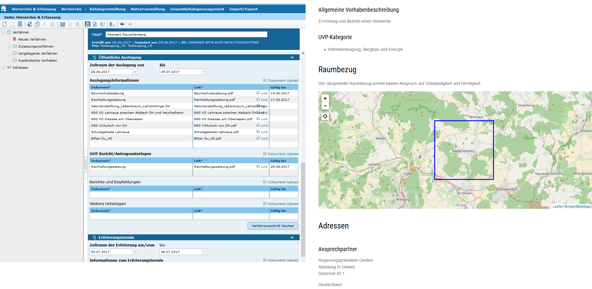

#### DOCKER ready

Verschiedene Komponenten wurden für den Einsatz mit docker container vorbereitet. Die UVP Installationen werden über docker-compose orchestriert. Dies erleichtert die Testbarkeit und die Aktualisierung der Systeme.

#### Verbesserung der Konfigurierbarkeit des InGrid Editors

Die Konfigurationsmöglichkeiten des InGrid Editors wurden im Zuge der UVP-Profil Erstellung wesentlich verbessert. Neben der Anpassung von vorhandenen Feldelementen und Validierungsregeln ist es auch möglich komplett neue Feldelemente über ein profil zu integrieren. Einzelne Verhaltensweisen können über die Katalogadministration parametrisiert werden.

#### Einsatz des GEMET als Thesaurus

Neben dem UMTHES Thesaurus des UBA ist nun auch der GEMET Thesarus im INSPIRE-kompatiblen Metadateneditor möglich.

#### Unterstützung des AdV-Metadaten-Profiles, Verbesserung der INSPIRE-Kompatibilität

Der InGrid Metadateneditor unterstützt nun auch das AdV Metadatenprofil. Die Kompatiblität mit der INSPIRE TG wurde weiter erhöht.

### Weitere Änderungen

- [Feature] [System] Ersatz des UMTHES-Wortguts durch GEMET ([REDMINE-18](https://dev.informationgrid.eu/redmine/issues/18))
- [Feature] [IGE] Verbesserung der Konfigurierbarkeit des IGE ([REDMINE-155](https://dev.informationgrid.eu/redmine/issues/155))
- [Feature] [IGE] IGE: Schema location und verwendete CodeListen in Codespace Elementen sollen mit INSPIRE TG abgeglichen und ggf. angepasst werden. ([REDMINE-201](https://dev.informationgrid.eu/redmine/issues/201))
- [Feature] [IGE] IGE: Eintrag in "lineage/source/.../description" wird nicht nach Datengrundlage übernommen ([REDMINE-204](https://dev.informationgrid.eu/redmine/issues/204))
- [Feature] [IGE] IGE: Überprüfung Funktionalität Checkbox "INSPIRE-relevanter Datensatz" ([REDMINE-368](https://dev.informationgrid.eu/redmine/issues/368))
- [Feature] [IGE] Neue Checkbox "AdV kompatibel" ([REDMINE-369](https://dev.informationgrid.eu/redmine/issues/369))
- [Feature] [IGE] IGE: Neues Feld "administrativeArea" ([REDMINE-375](https://dev.informationgrid.eu/redmine/issues/375))
- [Feature] [IGE] IGE: Objektartenkatalog (language) ([REDMINE-379](https://dev.informationgrid.eu/redmine/issues/379))
- [Feature] [IGE] bei Import der Felder useConstraints und useLimitation: Ausblenden der Textteile "Nutzungsbedingungen: " und "Nutzungseinschränkungen: " ([REDMINE-384](https://dev.informationgrid.eu/redmine/issues/384))
- [Feature] [IGE] IGE: Neues Feld "AdV-Produktgruppe" ([REDMINE-388](https://dev.informationgrid.eu/redmine/issues/388))
- [Feature] [Portal] PORTAL: Anbindung MapClient bereinigen und Altlasten entfernen ([REDMINE-392](https://dev.informationgrid.eu/redmine/issues/392))
- [Feature] [IGE] IPLUG IGE: IGE iPlug nur zur Suche installieren, Deaktivierung von Erfassungsfunktionalität ([REDMINE-410](https://dev.informationgrid.eu/redmine/issues/410))
- [Feature] [IGE] Codeliste für ServiceTypeVersion erweitern ([REDMINE-533](https://dev.informationgrid.eu/redmine/issues/533))
- [Feature] [Portal] Portal: Ausblenden des Schlagwortes "opendata" ([REDMINE-542](https://dev.informationgrid.eu/redmine/issues/542))
- [Feature] [Portal] PORTAL: Erweiterung des Suchbegriffs per Default ([REDMINE-677](https://dev.informationgrid.eu/redmine/issues/677))
- [Feature] [System] System: Neue Eigenschaft "indexOnStartup" in iPlugs ([REDMINE-728](https://dev.informationgrid.eu/redmine/issues/728))

- [Bug] [Doku] Dokumentation für neuen MapClient wurde auf ingrid-oss.eu noch nicht angepasst. ([REDMINE-453](https://dev.informationgrid.eu/redmine/issues/453))
- [Bug] [IGE] IGE: ISO Import veröffentlicht unvollständige Adressen ([REDMINE-647](https://dev.informationgrid.eu/redmine/issues/647))
- [Bug] [Portal] Portal: Link zur Freischaltung eines Portal-Benutzer falsch ([REDMINE-648](https://dev.informationgrid.eu/redmine/issues/648))
- [Bug] [IGE] IGE: Zusätzliche Felder können nicht mehr geleert werden ([REDMINE-659](https://dev.informationgrid.eu/redmine/issues/659))
- [Bug] [IGE] IGE: Editor lädt nicht, wenn Profil gewechselt wurde ([REDMINE-698](https://dev.informationgrid.eu/redmine/issues/698))
- [Bug] [IGE] IGE: ISO-Import von useConstraints und useLimitations an Struktur GDI-DE anpassen ([REDMINE-704](https://dev.informationgrid.eu/redmine/issues/704))
- [Bug] [iPlug Management] iPlug-Management: Abfragen der Codelisten dauert lang ([REDMINE-705](https://dev.informationgrid.eu/redmine/issues/705))
- [Bug] [IGE] IGE: In der Nutzerverwaltung -> Gruppenadministration -> Gruppenliste wird der letzte Eintrag verdeckt ([REDMINE-721](https://dev.informationgrid.eu/redmine/issues/721))
- [Bug] [Mapclient] Mapclient: "Link kopieren" - Funktionalität geht nicht ([REDMINE-723](https://dev.informationgrid.eu/redmine/issues/723))
- [Bug] [Portal] PORTAL: Facettierung der Suche auf Adressen zeigt XML Button wenn alle Ergebnisse angezeigt werden ([REDMINE-727](https://dev.informationgrid.eu/redmine/issues/727))

### Komponenten

- Portal ([download](https://distributions.informationgrid.eu/ingrid-portal/4.0.3/))
- iPlug IGE ([download](https://distributions.informationgrid.eu/ingrid-iplug-ige/4.0.3/))
  **Achtung Schnittstellenänderung! Portal und iPlug IGE müssen zusammen aktualisiert werden.**
- Codelist Repository ([download](https://distributions.informationgrid.eu/ingrid-codelist-repository/4.0.3/))
- iBus ([download](https://distributions.informationgrid.eu/ingrid-ibus/4.0.3/))
- iPlug Management ([download](https://distributions.informationgrid.eu/ingrid-iplug-management/4.0.3/))
- iPlug SNS ([download](https://distributions.informationgrid.eu/ingrid-iplug-sns/4.0.3/))

## Version 4.0.2.1

Release: 01.06.2017

### Änderungen

- [Bug] [Portal] PORTAL: PostgreSQL Nacharbeiten: Quartz Jobs laufen nicht, Portalinhalte in initialer Portal Datenbank bereinigen ([REDMINE-662](https://dev.informationgrid.eu/redmine/issues/662))
- [Bug] [Portal] Portal: Auf Startseite/Chronik werden keine Inhalte mehr angezeigt. ([REDMINE-655](https://dev.informationgrid.eu/redmine/issues/655))
- [Bug] [IGE] Editor: Unterhalb von Datensätzen sollen keine Ordner angelegt werden dürfen ([REDMINE-634](https://dev.informationgrid.eu/redmine/issues/634))
- [Bug] [IGE] IGE: Allgemeine Einstellungen "Session refresh aktivieren" funktioniert nicht ([REDMINE-547](https://dev.informationgrid.eu/redmine/issues/547))
- [Bug] [MAPCLIENT] MAPCLIENT: Fehler bei Hinzufügen von Layern aus einem Dienst ([REDMINE-687](https://dev.informationgrid.eu/redmine/issues/687))
- [Bug] [iPlug IGE] Editor: Veröffentlichte Datensätze (Verfahren/Adressen) können nicht unterhalb von Strukturordnern eingefügt werden ([REDMINE-635](https://dev.informationgrid.eu/redmine/issues/635))

### Komponenten

- Portal ([download](https://distributions.informationgrid.eu/ingrid-portal/4.0.2.1/))
- iPlug IGE ([download](https://distributions.informationgrid.eu/ingrid-iplug-ige/4.0.2.1/))

## Version 4.0.2

Release: 11.04.2017

### Änderungen
- [Feature] [Portal,IGE, ...] Unterstützung der PostgreSQL Datenbank ([REDMINE-438](https://dev.informationgrid.eu/redmine/issues/438))
- [Feature] [IGE] IGE: Dynamischer Erstellungsdialog für Objekte ([REDMINE-543](https://dev.informationgrid.eu/redmine/issues/543))
- [Feature] [Interface Search] Alternatives Aufrufen des ATOM Feed Clients über HTTP und HTTPS ([REDMINE-550](https://dev.informationgrid.eu/redmine/issues/550))
- [Feature] [Mapclient] Mapclient: Druckfunktion mit Koordinatennetz ([REDMINE-587](https://dev.informationgrid.eu/redmine/issues/587))
- [Feature] [Mapclient] Mapclient: Ausblenden des Rubriken-Bereiches im Menü ([REDMINE-599](https://dev.informationgrid.eu/redmine/issues/599))

- [Bug] [IGE] IGE: Dubletten-Seite zeigt Adressen an ([REDMINE-548](https://dev.informationgrid.eu/redmine/issues/548))
- [Bug] [IGE] IGE: Änderung des Namens eines freien Raumbezugs führt zu Fehler beim Speichern, da Koordinaten entfernt werden. ([REDMINE-555](https://dev.informationgrid.eu/redmine/issues/555))
- [Bug] [IGE] IGE: Markierung beim Ausschneiden wird nicht zurückgesetzt ([REDMINE-570](https://dev.informationgrid.eu/redmine/issues/570))
- [Bug] [IGE] IGE: Initiales Laden von Objekten schlägt manchmal fehl ([REDMINE-614](https://dev.informationgrid.eu/redmine/issues/614))
- [Bug] [Portal] Anzeige von Datumsangaben, Zeit ausblenden ([REDMINE-567](https://dev.informationgrid.eu/redmine/issues/567))
- [Bug] [Portal] XML Button wird nicht angezeigt ([REDMINE-572](https://dev.informationgrid.eu/redmine/issues/572))
- [Bug] [Portal] Portal: In der Detaildarstellung soll Portal-Header angezeigt werden ([REDMINE-588](https://dev.informationgrid.eu/redmine/issues/588)) 
- [Bug] [Portal] Portal: Löschen von Verzeichnisse/Dateien bei Portal-Aktualisierung ([REDMINE-589](https://dev.informationgrid.eu/redmine/issues/589))
- [Bug] [Portal] Portal: Trennung von Impressum und Datenschutz ([REDMINE-628](https://dev.informationgrid.eu/redmine/issues/628))
- [Bug] [Portal] Portal: Detailsuche liefert keine Liste eines Feldes ([REDMINE-616](https://dev.informationgrid.eu/redmine/issues/616))
- [Bug] [Mapclient] Mapclient: Embed-Version funktioniert nicht ([REDMINE-585](https://dev.informationgrid.eu/redmine/issues/585))
- [Bug] [Mapclient] Mapclient: Funktion "Einbetten" wird nicht immer angezeigt. ([REDMINE-586](https://dev.informationgrid.eu/redmine/issues/586))
- [Bug] [Mapclient] MapClient: Fehler in der Suche mit Umlaute ([REDMINE-612](https://dev.informationgrid.eu/redmine/issues/612))
- [Bug] [Mapclient] MapClient: Default EPSG kann nicht geändert werden ([REDMINE-613](https://dev.informationgrid.eu/redmine/issues/613))
- [Bug] [Mapclient] MapClient: GetFeature-Abfrage entfernt die Karten ([REDMINE-619](https://dev.informationgrid.eu/redmine/issues/619))
- [Bug] [iPlug SNS]SNS: Fehler wenn Event keiner Kategorie zugeordnet ist ([REDMINE-617](https://dev.informationgrid.eu/redmine/issues/617))
- [Bug] [iPlug IGE] iPlug IGE: DateTime Angaben im ISO werden falsch angegeben ([REDMINE-574](https://dev.informationgrid.eu/redmine/issues/574))
- [Bug] [iPlug SE] iPlug SE: Crawl Status kann nicht gelöscht werden, Crawl kann nicht manuell gestartet werden. ([REDMINE-569](https://dev.informationgrid.eu/redmine/issues/569))
- [Bug] [Interface CSW] CSW-T: Import von Daten verhält sich nicht erwartungsgemäß, wenn UUIDs aus dem Import im Katalog als UUID aber nicht als ORIG_UUID vorhanden sind ([REDMINE-536](https://dev.informationgrid.eu/redmine/issues/536))
- [Bug] [Interface CSW] CSW-T: Objekt mit Referenz auf einen IGE Benutzer kann nicht gespeichert werden ([REDMINE-535](https://dev.informationgrid.eu/redmine/issues/535))
- [Bug] [Interface CSW] CSW-T Delete/Update Request reagiert auf falsches Property ([REDMINE-524](https://dev.informationgrid.eu/redmine/issues/524))

### Komponenten

- Portal ([download](https://distributions.informationgrid.eu/ingrid-portal/4.0.2/))
- Interface Search (OpenSearch, ATOM DLS) ([download](https://distributions.informationgrid.eu/ingrid-interface-search/4.0.2/))
- iPlug IGE ([download](https://distributions.informationgrid.eu/ingrid-iplug-ige/4.0.2/))
  **Achtung Schnittstellenänderung! Portal und iPlug IGE müssen zusammen aktualisiert werden.**
- iPlug CSW ([download](https://distributions.informationgrid.eu/ingrid-iplug-csw-dsc/4.0.2/))
- iPlug DSC ([download](https://distributions.informationgrid.eu/ingrid-iplug-dsc/4.0.2/))
- iPlug Excel ([download](https://distributions.informationgrid.eu/ingrid-iplug-excel/4.0.2/))
- iPlug Management ([download](https://distributions.informationgrid.eu/ingrid-iplug-management/4.0.2/))
- iPlug SE ([download](https://distributions.informationgrid.eu/ingrid-iplug-se/4.0.2/))
- iPlug WFS ([download](https://distributions.informationgrid.eu/ingrid-iplug-wfs-dsc/4.0.2/))
- iPlug SNS ([download](https://distributions.informationgrid.eu/ingrid-iplug-sns/4.0.2/))
- iPlug XML ([download](https://distributions.informationgrid.eu/ingrid-iplug-xml/4.0.2/))

## Version 4.0.1.1

Release: 02.02.2017

### Änderungen

- [Bug] [iPlug IGE] IGE: Datum wird falsch nach ISO abgebildet ([REDMINE-534](https://dev.informationgrid.eu/redmine/issues/534))

### Komponenten

- iPlug IGE ([download](https://distributions.informationgrid.eu/ingrid-iplug-ige/4.0.1.1/))
- iPlug DSC ([download](https://distributions.informationgrid.eu/ingrid-iplug-dsc/4.0.1.1/))

## Version 4.0.1

Release: 01.02.2017

### Änderungen

- [Feature] [IGE] IGE: Feld "Veröffentlichung" für Objekte und Adressen einheitlich in den Index abbilden, damit Einschränkung im iPlug möglich	([REDMINE-515](https://dev.informationgrid.eu/redmine/issues/515))
- [Feature] [IGE] IGE: Make EMail Settings configurable via override.properties	([REDMINE-509](https://dev.informationgrid.eu/redmine/issues/509))
- [Feature] [IGE] IGE: Neues Qualitätselement (DQ_GriddedDataPositionalAccuracy) Rasterpositionsgenauigkeit	([REDMINE-378](https://dev.informationgrid.eu/redmine/issues/378))
- [Feature] [IGE] IGE: Graphische Darstellung/Dateibeschreibung 	([REDMINE-377](https://dev.informationgrid.eu/redmine/issues/377))
- [Feature] [IGE] GetCapabilities-Assistent: von WFS keine räumliche Ausdehnung (BBox) übernommen	([REDMINE-371](https://dev.informationgrid.eu/redmine/issues/371))
- [Feature] [IGE] IGE: serviceTypeVersion nach GDI-DE-Konvention befüllen	([REDMINE-335](https://dev.informationgrid.eu/redmine/issues/335))
- [Feature] [IGE] GetCapabilities-Assistent soll weitere Raumbezugssysteme / Koordinatenreferenzsysteme (CRS) erkennen	([REDMINE-331](https://dev.informationgrid.eu/redmine/issues/331))
- [Feature] [IGE] IGE: Dojo Aktualisierung auf 1.10.5 bzw. 1.12.1	([REDMINE-217](https://dev.informationgrid.eu/redmine/issues/217))
- [Feature] [IGE] IGE: Abbildung von Konformität/Spezifikationen auf ISO XML	([REDMINE-200](https://dev.informationgrid.eu/redmine/issues/200))
- [Feature] [IGE] IGE: Feld "Kodierungsschema" muss "optional" werden	([REDMINE-196](https://dev.informationgrid.eu/redmine/issues/196))
- [Feature] [IGE] IGE Die ORIG_UUID soll in der Erfassungsmaske angezeigt werden	([REDMINE-157](https://dev.informationgrid.eu/redmine/issues/157))
- [Feature] [IGE] IGE: Optionale Funktion für die Benachrichtigung bzgl. Überarbeitung von Objekten und Adressen	([REDMINE-107](https://dev.informationgrid.eu/redmine/issues/107))
- [Feature] [IGE] IGE: Unterstützung von Codelisten in zusätzlichen Feldern	([REDMINE-476](https://dev.informationgrid.eu/redmine/issues/476))
- [Feature] [PORTAL] Portal: Katalogbrowser zeigt nichts an, wenn keine Objekte veröffentlicht sind (ignoriert Adressen)	([REDMINE-519](https://dev.informationgrid.eu/redmine/issues/519))
- [Feature] [PORTAL] Erstellung Portal Profil 'PortalU Saarland'	([REDMINE-452](https://dev.informationgrid.eu/redmine/issues/452))
- [Feature] [IPlug IGE] IPLUG_IGE: Katalogspezifische Korrektur des Ressourcenidentifier um vorangestelltes Anbieterkürzel	([REDMINE-508](https://dev.informationgrid.eu/redmine/issues/508))
- [Feature] [INTERFACE-CSW] Erweiterung des ISO Import Prozesses im IGE iPlug bzgl. Abbildung von ISO Strukturen auf zusätzliche Felder	([REDMINE-456](https://dev.informationgrid.eu/redmine/issues/456))
- [Bug] [IGE] IGE: Keine Fehlerausgabe, bei ungültiger Thesaurus URL	([REDMINE-532](https://dev.informationgrid.eu/redmine/issues/532))
- [Bug] [IGE] IGE: Unterbaum kann nicht direkt unter Objektknoten verschoben werden	([REDMINE-530](https://dev.informationgrid.eu/redmine/issues/530))
- [Bug] [IGE] iPlug IGE: CSW-T Import Änderungen verhindern Erzeugung von Top Objekten/Adressen via normalem InGrid/CSW Import im IGE	([REDMINE-529](https://dev.informationgrid.eu/redmine/issues/529))
- [Bug] [IGE] Zusätzliche Felder bekommen kein "Bearbeitet"-Flag ([REDMINE-521](https://dev.informationgrid.eu/redmine/issues/521))
- [Bug] [IGE] IGE: Kopieren/Einfügen von Objekten erfolgt unter falschem Knoten	([REDMINE-507](https://dev.informationgrid.eu/redmine/issues/507))
- [Bug] [IGE] IGE: Das Einfügen von Adressen im Root Adressknoten funktioniert nicht mehr	([REDMINE-466](https://dev.informationgrid.eu/redmine/issues/466))
- [Bug] [IGE] Fehlendes Feld "Vorschaugrafik" in Katalogmanagement -> Zusätzliche Felder	([REDMINE-459](https://dev.informationgrid.eu/redmine/issues/459))
- [Bug] [IGE] IGE: Geothesaurus liefert keine Ergebnisse	([REDMINE-457](https://dev.informationgrid.eu/redmine/issues/457))
- [Bug] [IGE] IGE: Javascript Fehler beim Validieren von Raumbezug-Höhe	([REDMINE-422](https://dev.informationgrid.eu/redmine/issues/422))
- [Bug] [IGE] IGE: Paralleler Login in IGE via Portal-Admin führt zu Problemen.	([REDMINE-417](https://dev.informationgrid.eu/redmine/issues/417))
- [Bug] [IGE] IGE: Baum/Teilbaum neu laden funktioniert nur für direkte Unterknoten	([REDMINE-416](https://dev.informationgrid.eu/redmine/issues/416))
- [Bug] [IGE] GetCapabilities-Assistent: von WFS kein Raumbezugssystem übernommen	([REDMINE-370](https://dev.informationgrid.eu/redmine/issues/370))
- [Bug] [IGE] IGE: Neues Objekt anlegen mit getCapabilities Assistent versorgt nicht das Feld für die useConstraints	([REDMINE-273](https://dev.informationgrid.eu/redmine/issues/273))
- [Bug] [IPlug IGE] CSW-T: Löschen eines Datensatzes schlägt fehl	([REDMINE-526](https://dev.informationgrid.eu/redmine/issues/526))
- [Bug] [IPlug IGE] CSW-T Delete Request reagiert auf falsches Property	([REDMINE-524](https://dev.informationgrid.eu/redmine/issues/524))
- [Bug] [IPlug IGE] Fehlende Option zum Zurücksetzen des Administrations-Passworts in iPlug IGE	([REDMINE-445](https://dev.informationgrid.eu/redmine/issues/445))
- [Bug] [IPlug IGE] IGE iPlug zeigt falsche Version in iBus Admin GUI	([REDMINE-434](https://dev.informationgrid.eu/redmine/issues/434))
- [Bug] [PORTAL] Portal: Das Anzeigen von Freien Adressen in der Detailansicht schlägt fehl	([REDMINE-518](https://dev.informationgrid.eu/redmine/issues/518))
- [Bug] [PORTAL] Portal: Im Footer steht noch Niedersächsisches Ministerium ...	([REDMINE-517](https://dev.informationgrid.eu/redmine/issues/517))
- [Bug] [PORTAL] Portal: Hauptmenü lässt sich nicht mehr schließen	([REDMINE-505](https://dev.informationgrid.eu/redmine/issues/505))
- [Bug] [PORTAL] Portal: Parameter ?elementSetName=full? wird zweimal übergeben.	([REDMINE-504](https://dev.informationgrid.eu/redmine/issues/504))
- [Bug] [PORTAL] Benutzer löschen im IE funktioniert nicht	([REDMINE-496](https://dev.informationgrid.eu/redmine/issues/496))
- [Bug] [PORTAL] Adressen-Fehler in der Portal-Detaildarstellung	([REDMINE-479](https://dev.informationgrid.eu/redmine/issues/479))
- [Bug] [PORTAL] Fehler bei der Darstellung von Zusatzfeldern in der Portal-Detaildarstellung	([REDMINE-447](https://dev.informationgrid.eu/redmine/issues/447))
- [Bug] [PORTAL] Lange Ladezeiten einer Portal-Detaildarstellung	([REDMINE-446](https://dev.informationgrid.eu/redmine/issues/446))
- [Bug] [PORTAL] "Ähnliche Begriffe" funktionieren nicht zuverlässig	([REDMINE-427](https://dev.informationgrid.eu/redmine/issues/427))
- [Bug] [PORTAL] Chronik-Seite anpassen	([REDMINE-425](https://dev.informationgrid.eu/redmine/issues/425))
- [Bug] [PORTAL] Portal: Fehler in Anmeldung, wenn in Feld nichts eingegeben wurde	([REDMINE-418](https://dev.informationgrid.eu/redmine/issues/418))
- [Bug] [MAPCLIENT] CSV-Export für den BWaStrLocator funktioniert nicht unter IE	([REDMINE-477](https://dev.informationgrid.eu/redmine/issues/477))
- [Bug] [MAPCLIENT] Dienst hinzufügen aus der Suche funktioniert nicht	([REDMINE-472](https://dev.informationgrid.eu/redmine/issues/472))
- [Bug] [MAPCLIENT] Zoom auf Layer in der Suche funktioniert nicht	([REDMINE-471](https://dev.informationgrid.eu/redmine/issues/471))
- [Bug] [MAPCLIENT] Prüfung auf Host 'wms-geo' entfernen	([REDMINE-450](https://dev.informationgrid.eu/redmine/issues/450))
- [Bug] [MAPCLIENT] Tooltip werden unabhängig von der Konfiguration des Layers angezeigt	([REDMINE-449](https://dev.informationgrid.eu/redmine/issues/449))
- [Bug] [MAPCLIENT] Druck-Funktion erzeugt GetMap-URL mit Parameter 'Exceptions'	([REDMINE-448](https://dev.informationgrid.eu/redmine/issues/448))
- [Bug] [MAPCLIENT] Kartenviewer: "Schliessen" überdeckt den Menüpunkt "Mehr" im Zeichnen & Messen-Dialog	([REDMINE-428](https://dev.informationgrid.eu/redmine/issues/428))
- [Bug] [INTERFACE-SEARCH] Opensearch: Falsche Generierung des Detaillinks	([REDMINE-468](https://dev.informationgrid.eu/redmine/issues/468))
- [Bug] [IPlug CSW] CSW Service URL wird in Admin GUI nicht übernommen	([REDMINE-464](https://dev.informationgrid.eu/redmine/issues/464))
- [Bug] [CODELIST] REPOSITORY	CODELIST-REPO: INSPIRE Thema falsch	([REDMINE-442](https://dev.informationgrid.eu/redmine/issues/442))
- [Bug] [SYSTEM] Cygwin: Verwendung von mounts führen zu doppelten Pfaden	([REDMINE-465](https://dev.informationgrid.eu/redmine/issues/465))

### Komponenten

- Portal ([download](https://distributions.informationgrid.eu/ingrid-portal/4.0.1/))
- Interface Search (OpenSearch, ATOM DLS) ([download](https://distributions.informationgrid.eu/ingrid-interface-search/4.0.1/))
- iBus ([download](https://distributions.informationgrid.eu/ingrid-ibus/4.0.1/))
- iPlug IGE ([download](https://distributions.informationgrid.eu/ingrid-iplug-ige/4.0.1/))
  **Achtung Schnittstellenänderung! Portal und iPlug IGE müssen zusammen aktualisiert werden.**
- Codelist Repository ([download](https://distributions.informationgrid.eu/ingrid-codelist-repository/4.0.1/))
- iPlug CSW ([download](https://distributions.informationgrid.eu/ingrid-iplug-csw-dsc/4.0.1/))
- iPlug MapClient ([download](https://distributions.informationgrid.eu/ingrid-iplug-dsc-mapclient/4.0.1/))
- iPlug DSC ([download](https://distributions.informationgrid.eu/ingrid-iplug-dsc/4.0.1/))
- iPlug Excel ([download](https://distributions.informationgrid.eu/ingrid-iplug-excel/4.0.1/))
- iPlug Management ([download](https://distributions.informationgrid.eu/ingrid-iplug-management/4.0.1/))
- iPlug OpenSearch ([download](https://distributions.informationgrid.eu/ingrid-iplug-opensearch/4.0.1/))
- iPlug SE ([download](https://distributions.informationgrid.eu/ingrid-iplug-se/4.0.1/))
- iPlug WFS ([download](https://distributions.informationgrid.eu/ingrid-iplug-wfs-dsc/4.0.1/))
- iPlug SNS ([download](https://distributions.informationgrid.eu/ingrid-iplug-sns/4.0.1/))
- iPlug XML ([download](https://distributions.informationgrid.eu/ingrid-iplug-xml/4.0.1/))
- Server OpenSearch ([download](https://distributions.informationgrid.eu/ingrid-server-opensearch/4.0.1/))

## Version 4.0.0.2

Release: 28.12.2016

### Änderungen

- [Bug] [iPlug IGE] iPlug IGE: Installer kann "update" nicht ausführen ([REDMINE-511](https://dev.informationgrid.eu/redmine/issues/511))

### Komponenten

- iPlug IGE ([download](https://distributions.informationgrid.eu/ingrid-iplug-ige/4.0.0.2/))

## Version 4.0.0.1

Release: 19.09.2016

### Änderungen

- [Bug] [iPlug CSW] CSW iPlug kann keine ISO Datensätze mit gmd:series Element verarbeiten ([REDMINE-440](https://dev.informationgrid.eu/redmine/issues/440))

### Komponenten

- iPlug IGE ([download](https://distributions.informationgrid.eu/ingrid-iplug-ige/3.6.2.5/))

## Version 4.0.0

Release: 29.08.2016

### Änderungen

#### Neues responsives Layout für das InGrid Portal

Das InGrid Portal erhält ein neues, responsives Layout und ist damit fit für die Verwendung auf Tablets und Smartphones.

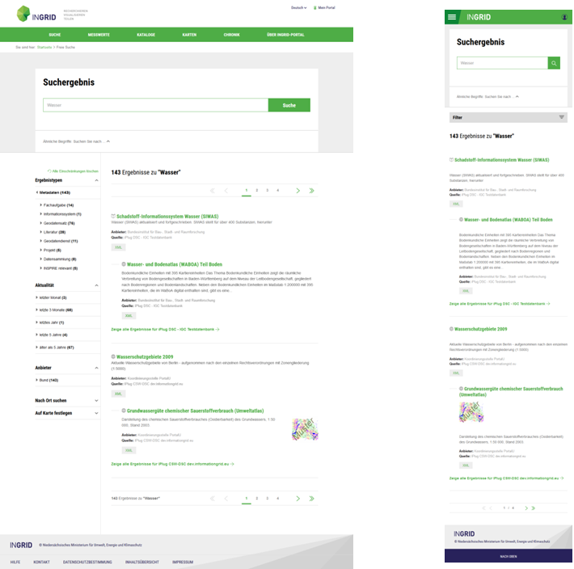

#### Neuer MapClient in responsivem Layout

Der MapClient wurde durch eine auf geo.admin.ch basierende Komponente ersetzt. Die Umsetzung ist vollständig responsiv und damit fit für die Verwendung auf Tablets und Smartphones.

ACHTUNG: Die MapClient Daten aus früheren Versionen müssen manuell migriert werden.

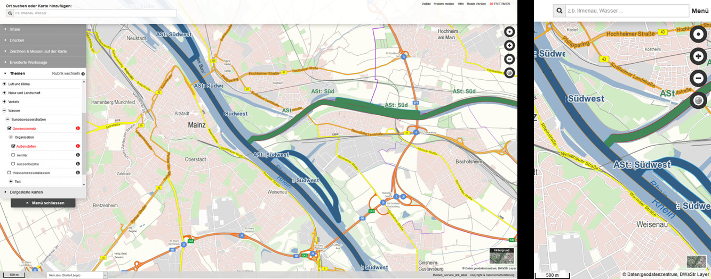

#### MessdatenClient

Das Portal enthält nun zum ersten mal eine Möglichkeit zur Anzeige von Messdaten. Verschiedene Messnetze werden beobachtet und indexiert und können über den MessdatenClient dargestellt werden. Die Anzeige der Messstellen kann nach Parameter, Zeitraum und Wertebereich gefiltert werden. Jede Änderung eines Filters liefert sofort ein Ergebnis, ähnlich einer LIVE Search.

Für jede Messstation kann der Messdatenverlauf der letzten Tage und Wochen eingesehen werden. Verschiedene Messwerte oder Stationen können miteinander verglichen werden, um Zusammenhänge zu visualisieren. Die zugrundeliegenden Daten können heruntergeladen werden.

Die Komponente ist voll responsiv und kann einfach in bestehende Applikationen integriert werden.

Die Komponente ist aktuell noch nicht unter OpenSource Lizenz verfügbar, da noch entsprechende Anpassungen am SourceCode ausgeführt werden müssen. Wenn Sie an einem Einsatz interessiert sind, nehmen Sie bitte Kontakt mit uns auf: [mailto:ingrid@wemove.com](mailto:ingrid@wemove.com).

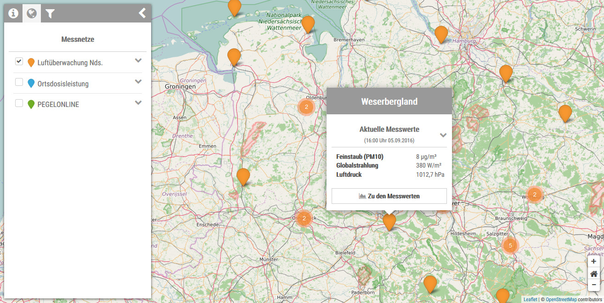

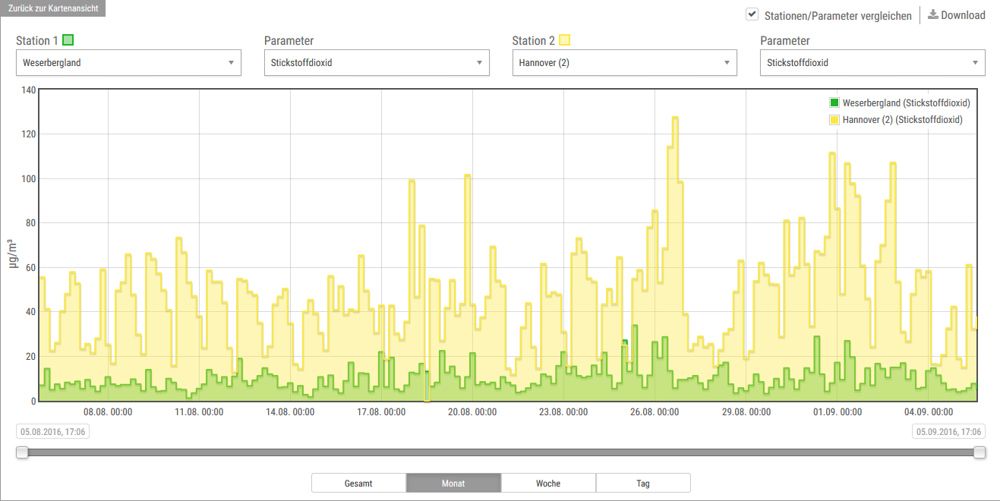

#### Neues Feld "Servicezeiten" im InGrid Editor

Im InGrid Editor wurde ein neues Feld "Servicezeiten" bei der Adress Eingabe eingefügt.

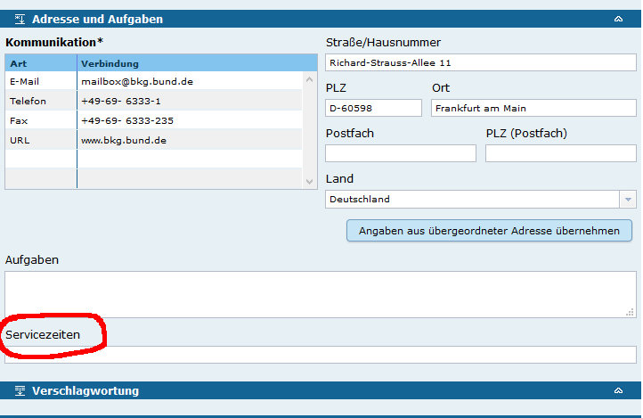

### Weitere Änderungen

- [Feature] [IGE] Verbesserung der Geschwindigkeit bei Berechtigungsanfragen ([REDMINE-124](https://dev.informationgrid.eu/redmine/issues/124))
- [Feature] [iPlug SNS] IPLUG-SNS: Neue Admin GUI wie in allen anderen iPlugs ([REDMINE-412](https://dev.informationgrid.eu/redmine/issues/412))
- [Bug] [IGE] Gruppe löschen funktioniert nicht ([REDMINE-398](https://dev.informationgrid.eu/redmine/issues/398))
- [Bug] [IGE] Benutzeradministration zeigt Fehler beim Speichern ([REDMINE-407](https://dev.informationgrid.eu/redmine/issues/407))
- [Bug] [iPlug IGE] IDF-Mapping: Kategorien auch ohne aktivierte Open Data Checkbox speichern (für LGV HH)  ([REDMINE-395](https://dev.informationgrid.eu/redmine/issues/395))
- [Bug] [iPlug SE] iPlug-SE: Art der Datenquelle wird nicht gespeichert  ([REDMINE-394](https://dev.informationgrid.eu/redmine/issues/394))
- [Bug] [System] IPLUG Admin-GUI: Fehler bei falsch gespeicherten Passwörtern abfangen ([REDMINE-411](https://dev.informationgrid.eu/redmine/issues/411))
- [Bug] [System] Codelist: Umbenennung "letzte Änderung" ([REDMINE-408](https://dev.informationgrid.eu/redmine/issues/408))

### Komponenten

- Codelist Repository ([download](https://distributions.informationgrid.eu/ingrid-codelist-repository/4.0.0/))
- iPlug Excel ([download](https://distributions.informationgrid.eu/ingrid-iplug-excel/4.0.0/))
- iPlug XML ([download](https://distributions.informationgrid.eu/ingrid-iplug-xml/4.0.0/))
- iPlug SNS ([download](https://distributions.informationgrid.eu/ingrid-iplug-sns/4.0.0/))
- iPlug SE ([download](https://distributions.informationgrid.eu/ingrid-iplug-se/4.0.0/))
- iPlug IGE ([download](https://distributions.informationgrid.eu/ingrid-iplug-ige/4.0.0/))
  **Achtung Schnittstellenänderung! Portal und iPlug IGE müssen zusammen aktualisiert werden.**
- iPlug CSW ([download](https://distributions.informationgrid.eu/ingrid-iplug-csw-dsc/4.0.0/))
- iPlug Management ([download](https://distributions.informationgrid.eu/ingrid-iplug-management/4.0.0/))
- Portal ([download](https://distributions.informationgrid.eu/ingrid-portal/4.0.0/))

## Version 3.6.2.2

Release: 08.07.2016

### Änderungen

- [Bug] [INTERFACE-CSW] CSW-Schnittstelle fährt nach Update/Installation nicht mehr hoch wenn communication.xml fehlt ([REDMINE-376](https://dev.informationgrid.eu/redmine/issues/376))
- [Bug] [iPlug Opensearch] iPlug-Opensearch: Fehler bei Konfiguration wenn Neuinstallation durchgeführt wurde ([REDMINE-390](https://dev.informationgrid.eu/redmine/issues/390))

### Komponenten

- Interface CSW ([download](https://distributions.informationgrid.eu/ingrid-interface-csw/3.6.2.2/))
- iPlug OpenSearch ([download](https://distributions.informationgrid.eu/ingrid-iplug-opensearch/3.6.2.2/))

## Version 3.6.2.1

### Änderungen

- [Bug] [IGE] IGE: Vermeidung von neuen leeren Zeilen in Tabellen ([REDMINE-324](https://dev.informationgrid.eu/redmine/issues/324))
- [Bug] [IGE] IGE: Update überschreibt mdek.override.properties ([REDMINE-323](https://dev.informationgrid.eu/redmine/issues/323))
- [Bug] [IGE] IGE: Änderungsdialog beim Öffnen von Objekten/Adressen ([REDMINE-332](https://dev.informationgrid.eu/redmine/issues/332))
- [Bug] [IGE] IGE: Geothesaurus-Raumbezug wird fehlerhaft aus den Capabilities übertragen ([REDMINE-343](https://dev.informationgrid.eu/redmine/issues/343))
- [Bug] [PORTAL] PORTAL: Feldnamen von Verfügbarkeit (constraints) in Detaildarstellung stimmen nicht mit IGE überein ([REDMINE-346](https://dev.informationgrid.eu/redmine/issues/346))
- [Bug] [PORTAL] PORTAL: Detaildarstellung von constraints in Profilen an neue IDF Struktur anpassen ([REDMINE-189](https://dev.informationgrid.eu/redmine/issues/189))
- [Bug] [INTERFACE-SEARCH] [INTERFACE-SEARCH] Die OpenSearch Schnittstelle liefert keine Titel bei IGE iPlug Ergebnissen ([REDMINE-329](https://dev.informationgrid.eu/redmine/issues/329))
- [Bug] [INTERFACE-CSW] CSW-T: Passwortgeschützter Zugang ([REDMINE-337](https://dev.informationgrid.eu/redmine/issues/337))
- [Bug] [INTERFACE-CSW, iPlug IGE] CSW-T: Anfragen dürfen nicht den Cache benutzen ([REDMINE-366](https://dev.informationgrid.eu/redmine/issues/336))
- [Bug] [iPlug IGE] Servicetyp (Art des Dienstes) im Index muss ISO Wert enthalten ([REDMINE-330](https://dev.informationgrid.eu/redmine/issues/330))
- [Bug] [iPlug IGE] CSW-T: Objekt kann nur als Top-knoten angelegt werden ([REDMINE-336](https://dev.informationgrid.eu/redmine/issues/336))
- [Bug] [iPlug IGE] Adressen sollen eine kleinere Relevanz haben als Objekte ([REDMINE-342](https://dev.informationgrid.eu/redmine/issues/342))
- [Bug] [iPlug IGE] CSW-T: Löschen mehrerer Objekte nicht möglich ([REDMINE-360](https://dev.informationgrid.eu/redmine/issues/360))
- [Bug] [iPlug IGE] CSW-T: Zahlen in Zusammenfassung falsch ([REDMINE-361](https://dev.informationgrid.eu/redmine/issues/361))
- [Bug] [iPlug SNS] Keine ähnlichen Begriffe bei Sonderzeichen ([REDMINE-319](https://dev.informationgrid.eu/redmine/issues/319))

### Komponenten

- Interface CSW ([download](https://distributions.informationgrid.eu/ingrid-interface-csw/3.6.2.1/))
- Interface Search (OpenSearch, ATOM DLS) ([download](https://distributions.informationgrid.eu/ingrid-interface-search/3.6.2.1/))
- iPlug IGE ([download](https://distributions.informationgrid.eu/ingrid-iplug-ige/3.6.2.1/))
- iPlug SNS ([download](https://distributions.informationgrid.eu/ingrid-iplug-sns/3.6.2.1/))
- Portal ([download](https://distributions.informationgrid.eu/ingrid-portal/3.6.2.1/))

## Version 3.6.2

### Änderungen

#### Zusammenlegung von IGE iPlug, DSC Object iPlug, DSC Address iPlug

Die bisher für die Verwaltung von Metadaten benötigten iPlugs IGE iPlug, DSC Object iPlug, DSC Address iPlug wurde zu einem IGE iPlug konsolidiert. Dies erspart bei Installationen mit vielen Katalogen Ressourcen: es werden pro Katalog nur noch ein statt drei iPlugs installiert werden.

Achtung! Eine automatissche Migration ist durch die Zusammenlegung mehrerer iPlugs nicht möglich. Das neue IGE iPlug muss manuell installiert werden.

#### Sofortige Indexierung und Generierung von ISO 19139 XML Metadaten

Nach Veröffentlichung eines Metadatensatzes wird der Index im IGE iPlug sofort aktualisiert. Im Zuge der Indexierung wird die Transformation der Metadaten in der ISO 19139 XML Format vorgenommen. Die Daten stehen dadurch sofort für eine Recherche zur Verfügung.

Das zeitgesteuerte Indexieren des gesamten Datenbestandes wird nach wie vor beibehalten, um evtl. Inkonsistenzen im Datenbestand vorzubeugen (Empfehlung: Indexierung alle 24h).

#### Vorschau auf ISO 19139 XML Format im IGE Editor

Im IGE kann ein Metadatensatz nach Speicherung sofort im ISO 19139 XML Format angezeigt werden. Dazu wurde eine Vorschau implementiert, die auch einen Vergleich von veröffentlichter und Bearbeitungskopie ermöglicht.

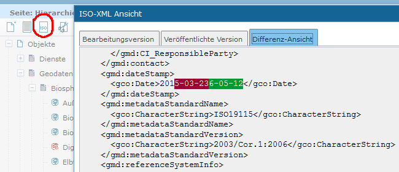

#### Konformität zu den GDI-DE Metadatenkonventionen 1.1.0 hergestellt

Die Konformität der Metadaten wurden nach den GDI-DE Metadatenkonventionen 1.1.0 analysiert und angepasst.

#### Back Button

Im Ingrid Editor wurden ein Back-Button eingeführt, der es dem Bearbeiter erlaubt zum jeweils zuletzt aufgerufenen Objekt bzw. Adresse zu springen.

#### Wappen der Bundesländer in Trefferliste

Optional können im Portal zu den Treffern die Wappen der jeweiligen Partner Bundesländer dargestellt werden.

#### CSW-T Schnittstelle

Eine CSW-T Schnittstelle erlaubt das Verwalten von Metadaten über eine standardisierte Schnittstelle.

### Weitere Änderungen

- [Feature] [IGE] Nacharbeiten: Konformität zu den GDI-DE Metadatenkonventionen 1.1.0 herstellen ([REDMINE-223](https://dev.informationgrid.eu/redmine/issues/223))
- [Feature] [IGE] Umbenennung von Feld-Bezeichungen für Einschränkungen ([REDMINE-197](https://dev.informationgrid.eu/redmine/issues/197))
- [Feature] [IGE] Beim Erstellen einer Operation soll das Feld "Unterstützte Plattformen" auf "Webservice" voreingestellt werden ([REDMINE-87](https://dev.informationgrid.eu/redmine/issues/87))
- [Feature] [IGE] Aktualisierung CodeListe der Spezifikation der Konformität ([REDMINE-86](https://dev.informationgrid.eu/redmine/issues/86))
- [Feature] [IGE] Eintragung von Capabilities URLs von ALLEN Diensten unter ISO: distributionInfo/../linkage ([REDMINE-85](https://dev.informationgrid.eu/redmine/issues/85))
- [Feature] [IGE] Automatisches Hinzufügen einer Operation "Get Download Service Metadata" bei über ATOM Download Service bereitgestellten Daten ([REDMINE-84](https://dev.informationgrid.eu/redmine/issues/84))
- [Feature] [IGE] Konfigurierbares Verhalten bei Validierung von Daten Dienste Kopplung ([REDMINE-153](https://dev.informationgrid.eu/redmine/issues/153))
- [Feature] [IGE] Back Button Unterstützung ([REDMINE-36](https://dev.informationgrid.eu/redmine/issues/36))
- [Feature] [IGE] Dashbord / Anzeige aller Objekte in Bearbeitung ([REDMINE-25](https://dev.informationgrid.eu/redmine/issues/25))
- [Feature] [Portal] Frontend / Trefferliste / Länderkennzeichnung ([REDMINE-21](https://dev.informationgrid.eu/redmine/issues/21))
- [Feature] [Portal] PORTAL Installer: Seite für SMTP Server hinzufügen, wenn Portal ohne IGE installiert wird. ([REDMINE-312](https://dev.informationgrid.eu/redmine/issues/312))
- [Feature] [Portal] PORTAL: Kontaktformular wird mit angemeldetem Benutzer vorbelegt ([REDMINE-302](https://dev.informationgrid.eu/redmine/issues/302))
- [Feature] [Portal] Toleranz beim Vergleich IGE Frontend (Portal IGE Editor) und Backend Version (IGE iPlug) ([REDMINE-245](https://dev.informationgrid.eu/redmine/issues/245))
- [Feature] [Portal] Portal Datenbank aufräumen, nicht genutzte Tabellen entfernen ([REDMINE-137](https://dev.informationgrid.eu/redmine/issues/137))
- [Feature] [MapClient] MAPCLIENT (WSV Profil): Anpassung Layout Druckvorlage Kartenclient ([REDMINE-311](https://dev.informationgrid.eu/redmine/issues/311))
- [Feature] [INTERFACE-CSW] Konfigurierbarkeit und Erhöhung von Timeouts bei Dateioperationen ([REDMINE-297](https://dev.informationgrid.eu/redmine/issues/297))
- [Feature] [INTERFACE-CSW] Implementierung einer CSW-T Schnittstelle ([REDMINE-113](https://dev.informationgrid.eu/redmine/issues/113))
- [Feature] [iPlug SE] IPLUG-SE: Spring Überschreib-Mechanismus einführen (override Verzeichnis) ([REDMINE-309](https://dev.informationgrid.eu/redmine/issues/309))
- [Feature] [iPlug WFS] Verbesserung der Log und Status-Ausgabe ([REDMINE-285](https://dev.informationgrid.eu/redmine/issues/285))
- [Feature] [iPlug DSC] Entfernen des zweiten identificationInfo-Elements aus der ISO Abbildung ([REDMINE-83](https://dev.informationgrid.eu/redmine/issues/83))
- [Feature] [System] HTTPS Umstellung der SNS-Schnittstelle ([REDMINE-303](https://dev.informationgrid.eu/redmine/issues/303))
- [Feature] [System] Konzeption: Überarbeitung der Datenspeicherung in InGrid Katalogen ([REDMINE-183](https://dev.informationgrid.eu/redmine/issues/183))
- [Feature] [System] Zusammenführung von IGE und IGC iPlugs (Objekt, Adressen) ([REDMINE-88](https://dev.informationgrid.eu/redmine/issues/88))
- [Feature] [System] Statusbenachrichtigung bei indexierenden iPlugs ([REDMINE-34](https://dev.informationgrid.eu/redmine/issues/34))
- [Bug] [IGE] Inhalt Erfassungsmaske nicht korrekt ([REDMINE-315](https://dev.informationgrid.eu/redmine/issues/315))
- [Bug] [IGE] Baum inkonsisten bei Einfügen von neuen Knoten / Löschen Knoten ([REDMINE-314](https://dev.informationgrid.eu/redmine/issues/314))
- [Bug] [IGE] Besseres Aktualisieren des Baums (Refresh Children) ([REDMINE-313](https://dev.informationgrid.eu/redmine/issues/313))
- [Bug] [IGE] Mapping von leerem Datum nach IDF schlägt fehl. ([REDMINE-307](https://dev.informationgrid.eu/redmine/issues/307))
- [Bug] [IGE]  Sysliste wird nicht sprachspezifisch aus Cache geholt. ([REDMINE-306](https://dev.informationgrid.eu/redmine/issues/306))
- [Bug] [IGE] Speichern Datenbank Konfiguration im Admin-GUI funktioniert nicht. ([REDMINE-305](https://dev.informationgrid.eu/redmine/issues/305))
- [Bug] [IGE] Löschen eines Darstellenden Dienstes funktioniert nicht ([REDMINE-291](https://dev.informationgrid.eu/redmine/issues/291))
- [Bug] [Portal] Neuinstallation Portal zieht neue Portal Datenbank nicht auf akt. Stand ([REDMINE-300](https://dev.informationgrid.eu/redmine/issues/300))
- [Bug] [Portal] Detaildarstellung mit vielen Verlinkungen sehr langsam ([REDMINE-295](https://dev.informationgrid.eu/redmine/issues/295))
- [Bug] [Portal] Installation Portal bringt falsche Ausgabe im Installer ([REDMINE-280](https://dev.informationgrid.eu/redmine/issues/280))
- [Bug] [Portal] Detailansicht zeigt Fehler ([REDMINE-275](https://dev.informationgrid.eu/redmine/issues/275))
- [Bug] [Portal] Fehler in der Detaildarstellung bzgl. "Zeige Karte"-Link ([REDMINE-261](https://dev.informationgrid.eu/redmine/issues/261))
- [Bug] [Portal] Zu wenig Einträge unter "Darstellender Dienst" in der Detaildarstellung ([REDMINE-258](https://dev.informationgrid.eu/redmine/issues/258))
- [Bug] [Map Client] Fehler bei der Legenden-Darstellung (Firefox) ([REDMINE-282](https://dev.informationgrid.eu/redmine/issues/282))
- [Bug] [Map Client]  Fehler bei der Verwendung des Messung-Tools ([REDMINE-278](https://dev.informationgrid.eu/redmine/issues/278))
- [Bug] [iPlug SE] Handhabung fehlender Index / Index Mapping via default Konfiguration / Zentralisierung Funktionalität in base-webapp ([REDMINE-310](https://dev.informationgrid.eu/redmine/issues/310))
- [Bug] [iPlug SE] REST API hat sich geändert / Handhabung fehlender Report ([REDMINE-308](https://dev.informationgrid.eu/redmine/issues/308))
- [Bug] [iPlug IGE] Mapping von UUID in Index teilweise noch fehlerhaft ([REDMINE-299](https://dev.informationgrid.eu/redmine/issues/299))
- [Bug] [iPlug CSW] Wenn GetCapabilities Request fehl schlägt, dann wird trotzdem aus dem Cache indexiert ? ([REDMINE-264](https://dev.informationgrid.eu/redmine/issues/264))
- [Bug] [iPlug DSC] iPlug DSC/IGE: Entfernung ERROR Log Ausgaben, wenn beim IDF Mapping Syslisteneintrag nicht gefunden wird. ([REDMINE-250](https://dev.informationgrid.eu/redmine/issues/250))
- [Bug] [iPlug DSC] CSW Harvesting führt zu Fehlern wenn iPlug indexiert ([REDMINE-219](https://dev.informationgrid.eu/redmine/issues/219))
- [Bug] [iPlug Excel] Anbieter werden nicht korrekt entfernt ([REDMINE-212](https://dev.informationgrid.eu/redmine/issues/212))
- [Bug] [System] Problem mit unterbrochenen Nachrichten in der Kommunikationsschicht ([REDMINE-286](https://dev.informationgrid.eu/redmine/issues/286))
- [Bug] [System] 	Alle iPlugs: Basis URL redirect funktioniert nicht als eingeloggter user ([REDMINE-269](https://dev.informationgrid.eu/redmine/issues/269))
- [Bug] [System] In den iPlugs werden die CACHE Einstellungen in der Admin GUI nicht persistiert. ([REDMINE-254](https://dev.informationgrid.eu/redmine/issues/254))

### Komponenten

- Codelist Repository ([download](https://distributions.informationgrid.eu/ingrid-codelist-repository/3.6.2/))
- iBus ([download](https://distributions.informationgrid.eu/ingrid-ibus/3.6.2/))
- Interface CSW ([download](https://distributions.informationgrid.eu/ingrid-interface-csw/3.6.2/))
- Interface Search (OpenSearch, ATOM DLS) ([download](https://distributions.informationgrid.eu/ingrid-interface-search/3.6.2/))
- iPlug CSW ([download](https://distributions.informationgrid.eu/ingrid-iplug-csw-dsc/3.6.2/))
- iPlug MapClient ([download](https://distributions.informationgrid.eu/ingrid-iplug-dsc-mapclient/3.6.2/))
- iPlug DSC ([download](https://distributions.informationgrid.eu/ingrid-iplug-dsc/3.6.2/))
- iPlug Excel ([download](https://distributions.informationgrid.eu/ingrid-iplug-excel/3.6.2/))
- iPlug IGE ([download](https://distributions.informationgrid.eu/ingrid-iplug-ige/3.6.2/))
  **Achtung Schnittstellenänderung! Portal und iPlug IGE müssen zusammen aktualisiert werden.**
- iPlug Management ([download](https://distributions.informationgrid.eu/ingrid-iplug-management/3.6.2/))
- iPlug OpenSearch ([download](https://distributions.informationgrid.eu/ingrid-iplug-opensearch/3.6.2/))
- iPlug SE ([download](https://distributions.informationgrid.eu/ingrid-iplug-se/3.6.2/))
- iPlug WFS ([download](https://distributions.informationgrid.eu/ingrid-iplug-wfs-dsc/3.6.2/))
- iPlug SNS ([download](https://distributions.informationgrid.eu/ingrid-iplug-sns/3.6.2/))
- iPlug XML ([download](https://distributions.informationgrid.eu/ingrid-iplug-xml/3.6.2/))
- Portal ([download](https://distributions.informationgrid.eu/ingrid-portal/3.6.2/))
- Server OpenSearch ([download](https://distributions.informationgrid.eu/ingrid-server-opensearch/3.6.2/))

## Version 3.6.1

### Komponenten

- Codelist Repository ([download](https://distributions.informationgrid.eu/ingrid-codelist-repository/3.6.1/))
- iBus ([download](https://distributions.informationgrid.eu/ingrid-ibus/3.6.1/))
- Interface CSW ([download](https://distributions.informationgrid.eu/ingrid-interface-csw/3.6.1/))
- Interface Search (OpenSearch, ATOM DLS) ([download](https://distributions.informationgrid.eu/ingrid-interface-search/3.6.1/))
- iPlug CSW ([download](https://distributions.informationgrid.eu/ingrid-iplug-csw-dsc/3.6.1/))
- iPlug MapClient ([download](https://distributions.informationgrid.eu/ingrid-iplug-dsc-mapclient/3.6.1/))
- iPlug DSC ([download](https://distributions.informationgrid.eu/ingrid-iplug-dsc/3.6.1/))
- iPlug Excel ([download](https://distributions.informationgrid.eu/ingrid-iplug-excel/3.6.1/))
- iPlug IGE ([download](https://distributions.informationgrid.eu/ingrid-iplug-ige/3.6.1/))
  **Achtung Schnittstellenänderung! Portal und iPlug IGE müssen zusammen aktualisiert werden.**
- iPlug Management ([download](https://distributions.informationgrid.eu/ingrid-iplug-management/3.6.1/))
- iPlug OpenSearch ([download](https://distributions.informationgrid.eu/ingrid-iplug-opensearch/3.6.1/))
- iPlug SE ([download](https://distributions.informationgrid.eu/ingrid-iplug-se/3.6.1/))
- iPlug WFS ([download](https://distributions.informationgrid.eu/ingrid-iplug-wfs-dsc/3.6.1/))
- iPlug SNS ([download](https://distributions.informationgrid.eu/ingrid-iplug-sns/3.6.1/))
- iPlug XML ([download](https://distributions.informationgrid.eu/ingrid-iplug-xml/3.6.1/))
- Portal ([download](https://distributions.informationgrid.eu/ingrid-portal/3.6.1/))
- Server OpenSearch ([download](https://distributions.informationgrid.eu/ingrid-server-opensearch/3.6.1/))
 

### Änderungen

- [Feature] [Portal] Entfernung aller PortalU Referenzen aus dem InGrid Portal Standard Profil ([REDMINE-14](https://dev.informationgrid.eu/redmine/issues/14))
- [Feature] [Portal] Updated to final Jetspeed 2.3.0 release. ([REDMINE-109](https://dev.informationgrid.eu/redmine/issues/109))
- [Feature] [Portal] Erstellung RLP Profil ([REDMINE-122](https://dev.informationgrid.eu/redmine/issues/122))
- [Feature] [Portal] SSO Funktionalität wieder hinzugefügt (Shibboleth) ([REDMINE-169](https://dev.informationgrid.eu/redmine/issues/169))
- [Feature] [Portal/IGE] Ansprechende HTML-Hilfen aus Portal und IGE Hilfe XML generieren ([REDMINE-29](https://dev.informationgrid.eu/redmine/issues/29))
- [Feature] [IGE] Konformität zu den GDI-DE Metadatenkonventionen 1.1.0 herstellen ([REDMINE-13](https://dev.informationgrid.eu/redmine/issues/13))
- [Feature] [IGE] Entfernung aller PortalU-Referenzen aus dem InGridEditor ([REDMINE-16](https://dev.informationgrid.eu/redmine/issues/16))
- [Feature] [IGE] Abschließendes Speichern und Veröffentlichen ([REDMINE-19](https://dev.informationgrid.eu/redmine/issues/19))
- [Feature] [IGE] Strukturbaum / Datenreihenfolge ([REDMINE-20](https://dev.informationgrid.eu/redmine/issues/20))
- [Feature] [IGE] Anzeige Objekt-ID ([REDMINE-23](https://dev.informationgrid.eu/redmine/issues/23))
- [Feature] [IGE] GDI-DE konforme Angabe von Werten im Feld "Version des Dienstes" ([REDMINE-47](https://dev.informationgrid.eu/redmine/issues/47))
- [Feature] [IGE] Entfernen von Referenz auf externe DTD aus Spring Dateien, damit iPlug offline funktioniert ([REDMINE-131](https://dev.informationgrid.eu/redmine/issues/131))
- [Feature] [IGE] Optimierung der Ladezeit des IGE ([REDMINE-190](https://dev.informationgrid.eu/redmine/issues/190))
- [Feature] [IGE] Abgabe der INSPIRE Themen in deutscher Sprache ([REDMINE-207](https://dev.informationgrid.eu/redmine/issues/207))
- [Feature] [iPlug SE] Vermeidung von falschem Elastic Search Cluster ([REDMINE-171](https://dev.informationgrid.eu/redmine/issues/171))
- [Feature] [iPlug MapClient] POST Request jetzt als application/json Type mit direkten JSON Daten (Anpassung an neue WSV BWaStr Schnittstelle) ([REDMINE-177](https://dev.informationgrid.eu/redmine/issues/177))
- [Feature] [System] Entfernung aller PortalU Referenzen aus dem InGrid System (außer Portal und IGE) ([REDMINE-15](https://dev.informationgrid.eu/redmine/issues/15))
- [Feature] [System] Entfernen der Abhängigkeit zum DSC ([REDMINE-67](https://dev.informationgrid.eu/redmine/issues/67))
- [Feature] [System] Kompatibilität mit MariaDB herstellen ([REDMINE-74](https://dev.informationgrid.eu/redmine/issues/74))
- [Feature] [System] Passwörter in den iPlug-Admin-GUIs liegen im Klartext vor ([REDMINE-106](https://dev.informationgrid.eu/redmine/issues/106))

- [Bug] [Portal] Katalogbaum aufklappen ([REDMINE-115](https://dev.informationgrid.eu/redmine/issues/115))
- [Bug] [Portal] IFRAME für JavaScript Erkennung wird u.U. als Virus erkannt ([REDMINE-56](https://dev.informationgrid.eu/redmine/issues/56))
- [Bug] [Portal] SE-iPlug erscheint nicht im Portal unter der Liste der angeschlossenen iPlugs ([REDMINE-104](https://dev.informationgrid.eu/redmine/issues/104))
- [Bug] [Portal] Fehlende Adressen-Titel in der Ergebnisliste ([REDMINE-120](https://dev.informationgrid.eu/redmine/issues/120))
- [Bug] [Portal] Fehlende Adressen-Beschreibung in der Detaildarstellung ([REDMINE-121](https://dev.informationgrid.eu/redmine/issues/121))
- [Bug] [Portal] Fehler beim Löschen eines Kataloges ([REDMINE-144](https://dev.informationgrid.eu/redmine/issues/144))
- [Bug] [Portal] Keine Adressen-Suche im Schlagwortverzeichnis ([REDMINE-182](https://dev.informationgrid.eu/redmine/issues/182))
- [Bug] [Portal] GeoPortal.WSV Fehler bei der Account Erstellung beim Login via SSO (Shibboleth) ([REDMINE-191](https://dev.informationgrid.eu/redmine/issues/191))
- [Bug] [Portal] Startseite ändern führt zu Zugriffs - Problem ([REDMINE-209](https://dev.informationgrid.eu/redmine/issues/209))
- [Bug] [IGE] HTML wird beim Objekt anlegen übernommen ([REDMINE-117](https://dev.informationgrid.eu/redmine/issues/117))
- [Bug] [IGE] Initialisierungsfehler bei inkorrekter Sysliste ([REDMINE-123](https://dev.informationgrid.eu/redmine/issues/123))
- [Bug] [IGE] Fehlende Fehlermeldung beim Anlegen von Adressen ohne Berechtigung ([REDMINE-125](https://dev.informationgrid.eu/redmine/issues/125))
- [Bug] [IGE] URL-Pflege funktioniert nicht bei großen Datenmengen ([REDMINE-141](https://dev.informationgrid.eu/redmine/issues/141))
- [Bug] [IGE] Erweiterte Suche lässt sich u.U. nicht aufklappen ([REDMINE-159](https://dev.informationgrid.eu/redmine/issues/159))
- [Bug] [IGE] Tabelle nicht mehr editierbar ([REDMINE-192](https://dev.informationgrid.eu/redmine/issues/192))
- [Bug] [IGE] Aktualisierung der GetCapabilities fehlerhaft ([REDMINE-193](https://dev.informationgrid.eu/redmine/issues/193))
- [Bug] [iPlug SE] letzter Crawl Log wird im IE 11 nicht angezeigt ([REDMINE-170](https://dev.informationgrid.eu/redmine/issues/170))
- [Bug] [iPlug SE] Falsche Berechnung des letzten Fetch-Datums ([REDMINE-172](https://dev.informationgrid.eu/redmine/issues/172))
- [Bug] [iPlug SE] Keine Indexgenerierung wenn keine URLs geholt wurden ([REDMINE-173](https://dev.informationgrid.eu/redmine/issues/173))
- [Bug] [iPlug SE] IE11 zeigt keine URLs an ([REDMINE-175](https://dev.informationgrid.eu/redmine/issues/175))
- [Bug] [iPlug SE] Wilcard-Query liefert falsche Ergebnisse ([REDMINE-176](https://dev.informationgrid.eu/redmine/issues/176))
- [Bug] [iPlug SE] SE-Treffer erscheinen nicht in der Portal-Suche ([REDMINE-114](https://dev.informationgrid.eu/redmine/issues/114))
- [Bug] [Map Client] Transparenz umbennen in Sichtbarkeit. ([REDMINE-71](https://dev.informationgrid.eu/redmine/issues/71))
- [Bug] [iPlug DSC] : Make new JavaScript engine threadsafe (java 1.8 und nashorn) ([REDMINE-119](https://dev.informationgrid.eu/redmine/issues/119))
- [Bug] [CSW Interface] CSW harvestet nicht alle Dokumente ([REDMINE-179](https://dev.informationgrid.eu/redmine/issues/179))
- [Bug] [iPlug SE] Falsche Gruppierung beim SE-iPlug ([REDMINE-181](https://dev.informationgrid.eu/redmine/issues/181))
- [Bug] [System] Wildcards werden nicht korrekt umgesetzt innerhalb von Feldern ([REDMINE-211](https://dev.informationgrid.eu/redmine/issues/211))

## Version 3.6.0.3

### Komponenten

- Portal ([download](https://distributions.informationgrid.eu/ingrid-portal/3.6.0.3/))
- iPlug CSW ([download](https://distributions.informationgrid.eu/ingrid-iplug-csw-dsc/3.6.0.3/))
- iPlug DSC ([download](https://distributions.informationgrid.eu/ingrid-iplug-dsc/3.6.0.3/))
- iPlug Excel ([download](https://distributions.informationgrid.eu/ingrid-iplug-excel/3.6.0.3/))
- iPlug IGE ([download](https://distributions.informationgrid.eu/ingrid-iplug-ige/3.6.0.3/))
  **Achtung Schnittstellenänderung! Portal und iPlug IGE müssen zusammen aktualisiert werden.**
- iPlug Management ([download](https://distributions.informationgrid.eu/ingrid-iplug-management/3.6.0.3/))
- iPlug MapClient ([download](https://distributions.informationgrid.eu/ingrid-iplug-dsc-mapclient/3.6.0.3/))
- iPlug OpenSearch ([download](https://distributions.informationgrid.eu/ingrid-iplug-opensearch/3.6.0.3/))
- iPlug SE ([download](https://distributions.informationgrid.eu/ingrid-iplug-se/3.6.0.3/))
- iPlug WFS ([download](https://distributions.informationgrid.eu/ingrid-iplug-wfs-dsc/3.6.0.3/))
- iPlug XML ([download](https://distributions.informationgrid.eu/ingrid-iplug-xml/3.6.0.3/))

### Änderungen

- [Bug] [Portal] Katalogbaum aufklappen ([REDMINE-115](https://dev.informationgrid.eu/redmine/issues/115))
- [Bug] [Portal] Fehler in Darstellung von Datenkatalogen ([REDMINE-128](https://dev.informationgrid.eu/redmine/issues/128))
- [Bug] [Portal] Falscher Datensatz in Detailanzeige ([REDMINE-130](https://dev.informationgrid.eu/redmine/issues/130))
- [Bug] [Portal] Fehlende Daten bei der Adress-Suche im Portal ([REDMINE-145](https://dev.informationgrid.eu/redmine/issues/145))
- [Bug] [Portal] Geodatendienst mit Checkbox "Zugang geschützt" erlaubt trotzdem "In Karte zeigen" in Detaildarstellung ([REDMINE-151](https://dev.informationgrid.eu/redmine/issues/151))
- [Bug] [MapClient] Gruppenselektierung unter Aktive Dienste ist nicht korrekt ([REDMINE-146](https://dev.informationgrid.eu/redmine/issues/146))
- [Bug] [MapClient] Anordnung der Layer durch Drag und Drop unter Aktive Dienste falsch ([REDMINE-147](https://dev.informationgrid.eu/redmine/issues/147))
- [Bug] [MapClient] MapFish Aktualisierung auf 1.2.0 ([REDMINE-148](https://dev.informationgrid.eu/redmine/issues/148))
- [Bug] [MapClient] YX Koordinaten für weitere Projektionen mit der WMS Version 1.3.0 ([REDMINE-149](https://dev.informationgrid.eu/redmine/issues/149))
- [Bug] [MapClient] Auswahl von BWaStr-Locator Einträge in mehreren Linien darstellen ([REDMINE-150](https://dev.informationgrid.eu/redmine/issues/150))
- [Bug] [IGE] URL-Pflege funktioniert nicht bei großen Datenmengen ([REDMINE-141](https://dev.informationgrid.eu/redmine/issues/141))
- [Bug] [System] Fehlerhafte Query bei komplexerer Suche ([REDMINE-142](https://dev.informationgrid.eu/redmine/issues/142))

## Version 3.6.0.2

### Komponenten

- Portal ([download](https://distributions.informationgrid.eu/ingrid-portal/3.6.0.2/))
- iPlug DSC ([download](https://distributions.informationgrid.eu/ingrid-iplug-dsc/3.6.0.2/))
- iPlug SE ([download](https://distributions.informationgrid.eu/ingrid-iplug-se/3.6.0.2/))

### Änderungen

- [Feature] Einfachere Konfiguration von Mapping-Skripten ([REDMINE-99](https://dev.informationgrid.eu/redmine/issues/99))
- [Bug] IGE: Scrollbar in Listenauswahl nicht bedienbar ([REDMINE-82](https://dev.informationgrid.eu/redmine/issues/82))
- [Bug] iPlug-DSC: Fehler beim Anzeigen von Adressen Treffer im Portal ([REDMINE-89](https://dev.informationgrid.eu/redmine/issues/89))
- [Bug] Fix Installer, so dass Update Funktionalität wieder vorhanden ([REDMINE-90](https://dev.informationgrid.eu/redmine/issues/90))
- [Bug] Crawling schlägt fehlt beim ersten Start ([REDMINE-92](https://dev.informationgrid.eu/redmine/issues/92))
- [Bug] SE iPlug: Übertragung der allgemeinen Metadaten auf Index ist fehlerhaft ([REDMINE-94](https://dev.informationgrid.eu/redmine/issues/94))
- [Bug] InGrid Map Referenzsystemwechsel funktioniert nicht nach Verschieben Kartenauschnitt ([REDMINE-95](https://dev.informationgrid.eu/redmine/issues/95))
- [Bug] Fix "save search" when logged in. ([REDMINE-96](https://dev.informationgrid.eu/redmine/issues/96))

## Version 3.6.0.1

### Komponenten

- iPlug SNS ([download](https://distributions.informationgrid.eu/ingrid-iplug-sns/3.6.0.1/))

### Änderungen

- [FEATURE] Die Suche im BKG WFS muss case insensitive erfolgen. ([REDMINE-81](https://dev.informationgrid.eu/redmine/issues/81))
- [BUG] Proxy Settings werden bei Verwendung von Java8 und Zugriff auf BKG WFS nicht korrekt angewendet ([REDMINE-80](https://dev.informationgrid.eu/redmine/issues/80))

## Version 3.6.0

### Änderungen

#### Alle iPlugs: Verwendung von Elastic (Search)

Die bisher verwendete, auf Apache Lucene basierende, anwendungsspezifische Lösung zum Indexieren und Suchen wurde durch Elastic (Search) ersetzt. Die neue Lösung ist wesentlich mächtiger in Bezug auf die Indexierung und Recherche und bildet die Basis für weitere funktionale Erweiterungen wie z.B.:

- Indexierung von zusammengesetzten Wörtern
- Integration von Thesaurus Systemen für die automatische Anreicherung mit Schlagworten
- "Meinten Sie ..." Funktionalität

und vieles mehr.

#### InGrid Editor: Katalog-übergreifende Daten-Dienste-Kopplung über CSW / UUID

Im InGrid Editor kann im Dialog "Dargestellte Daten" für einen Geodatendienst ein GetRecordById Request angegben werden. Über die Angabe dieses Requests wird eine katalogübergreifende Daten-Dienste-Kopplung ermöglicht.

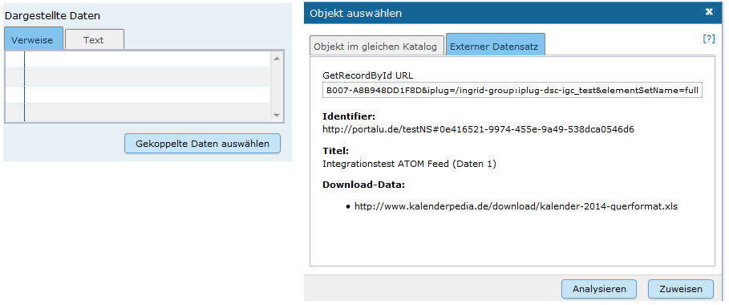

Dadurch wird es jetzt möglich Daten und Dienste Objekte, die in unterschiedlichen Katalogen gepflegt werden, INSPIRE und GDI-DE konform zu koppeln.

Die gekoppelten Daten stehen über den ATOM Download Service INSPIRE kompatibel zur Verfügung.

#### CSW Schnittstelle: Verbesserung des Harvesting Prozesses

Der Harvesting Prozess wurde in der CSW Schnittstelle überarbeitet und optimiert. Die Schnittstelle unterstützt nun das Harvesting von sehr umfangreichen Katalogen (mehrere 100.000 Datensätze).

#### Weitere Funktionalitäten und Fehlerbehebungen

Portal

- Captcha Funktionalität ist nun kompatibel mit OpenJDK 7
- Zoomen auf Orte außerhalb der initialen Bounding Box wird im Karten Client unterstützt
- Export von Text und Farben wird im Karten Client unterstützt (Redlining)
- Geschützte WMS Dienste werden in der Detaildarstellung nun nicht mehr verlinkt

Ingrid Editor

- Vollständige Anzeige der Vorschau auf kleineren Displays
- Rechtliche Grundlagen werden nun wieder gespeichert
- Dienste Kompatibilität im GetCapabilities wurde erhöht
