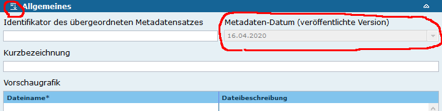
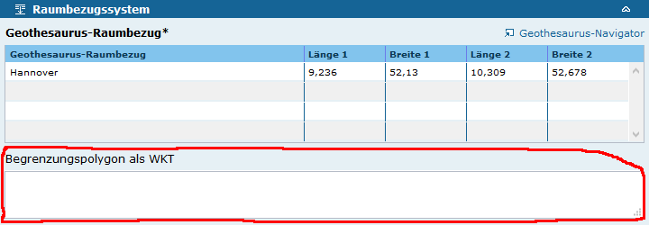
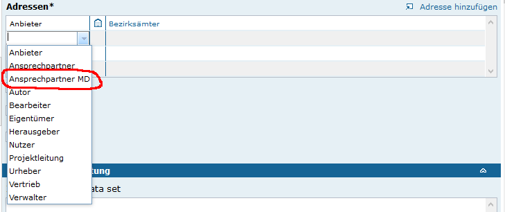

Diese Release Notes betreffen ausschließlich die Versionen 5.4.x. Release Notes ältere Versionen können hier eingesehen werden:  [5.3.x](/5.3.0/about/history.html), [5.2.x](/5.2.0/about/history.html), [5.1.x](/5.1.0/about/history.html), [5.0.x](/5.0.0/about/history.html), [4.6.x](/4.6.0/about/history.html), [4.5.x](/4.5.0/about/history.html)


## Version 5.4.1

Release 23.04.2020

### Liste der Änderungen

Profil BAW DMQS

- [Bug] [IGE] Fehler beim Setzen des Metadaten Datums im Zusammenhang mit dem BAW Profil ([REDMINE-1761](https://redmine.informationgrid.eu/issues/1839))

Profil mCLOUD

- [Bug] [IGE] IGE: Aktualisierung des Metadaten-Datum ([REDMINE-1761](https://redmine.informationgrid.eu/issues/1084))

### Komponenten

- iPlug IGE ([download](https://distributions.informationgrid.eu/ingrid-iplug-ige/5.4.1/))

## Version 5.4.0

Release 20.04.2020

### Wichtige Änderungen

#### Aktualisierung des Metadaten-Datum auf Basis von Änderungen am ISO 19139 XML Format

Das Metadaten Datum (gmd:dateStamp) wird nur dann aktualisiert, wenn ein Metadatensatz veröffentlicht wird und dieser sich geändert hat. Die Anzeige des Metadaten Datums erfolgt in der Rubrik Allgemeines, die dazu ausgeklappt werden muss.
Mit Klick auf den Feld-Titel ist damit auch eine Hilfe abrufbar.


<figcaption class="figcaption">Anzeige des Metadaten Datums</figcaption>

Die Änderung eines Metadatensatzes wird anhand der Änderung von Inhalt und Struktur erkannt. Dazu wird ein Fingerabdruck der ISO 19139 XML Daten erstellt und gespeichert. Das Metadaten-Datum wird nur aktualisiert, wenn sich bei einer Veröffentlichung auch der Fingerabdruck ändert.

Dadurch wird sichergestellt, dass das Metadaten-Datum auch nicht-inhaltliche Änderungen reflektiert, die sich z.B. durch eine Anpassung der Struktur des Metadatensatzes ergibt. Dies ist wichtig, weil nachfolgende Systeme sich auf dieses Datum beziehen, um z.B. geänderte Metadatensätze zu ermitteln.


#### Unterstützung von Polygoneingabe im WKT (Well Known Text) Format

Die Unterstützung von Raumbezugsangaben im WKT ([Well Known Text Format](https://de.wikipedia.org/wiki/Simple_Feature_Access)) wurde ermöglicht. Dadurch können nun auch Polygonangaben im InGrid Editor hinzugefügt werden.


<figcaption class="figcaption">Begrenzungspolygon als WKT</figcaption>

Aktuell werden die Angaben noch nicht in der räumlichen Suche im Portal oder in der CSW Schnittstelle verwendet.


#### Neuer Adresstyp Metadaten Auskunftsadresse

Im IGE wird der Ansprechpartner vom Metadatenverantwortlichen abgeleitet. Der Metadatenverantwortliche ist ein Login User (Redakteur) des Editors. Um an der Stelle auch eine Adresse angeben zu können, die nicht als Redakteur im Editor registriert sein muss, wurde ein neuer Adresstyp "Ansprechpartner MD" eingeführt.


<figcaption class="figcaption">Ansprechpartner Metadaten</figcaption>

Dadurch wird beim ISO 19139 Import auch der dort vermerkte Ansprechpartner (Rolle 'pointOfContact') korrekt importiert.

Für den ISO 19139 Export wird nach wie vor der Metadatenverantwortliche verwendet, wenn kein "Ansprechpartner MD" definiert wurde.


#### Tomcat Aktualisierung auf Version 7.0.100

**ACHTUNG**: Tomcat Aktualisierung! Docker basierte Installationen mit einem Application Proxy (apache in der docker Konfiguration) müssen das Mapping der `server.xml` im Portal Container entfernen und die folgenden Umgebungsvariablen setzen: `PORTAL_SERVER_CONNECTOR_ATTR=proxyPort="443" scheme="https" secure="true" emptySessionPath="true"`


Bsp:

```YAML
...
portal:
    image: docker-registry.wemove.com/ingrid-portal:5.4.0
    restart: unless-stopped
    environment:
        - PORTAL_SERVER_CONNECTOR_ATTR=proxyPort="443" scheme="https" secure="true" emptySessionPath="true"
...
```


### Liste der Änderungen

- [Bug] [PORTAL] Portal: Raumbezugssysteme ohne EPSG-Code ohne Hyperlink ([REDMINE-1761](https://redmine.informationgrid.eu/issues/1761))
- [Bug] [PORTAL] PORTAL: Facettierung dynamisch erzeugen über Index-Feld oder Codelist-ID ([REDMINE-1699](https://redmine.informationgrid.eu/issues/1699))
- [Bug] [PORTAL] PORTAL: Fehlermeldung beim Login anpassen ([REDMINE-1826](https://redmine.informationgrid.eu/issues/1826))
- [Bug] [PORTAL] Detailansicht von Datensatz über Katalogbrowser liefert kein XML ([REDMINE-1309](https://redmine.informationgrid.eu/issues/1309))
- [Bug] [PORTAL] Portal: Problem Dopplungen unter Nutzungsbedingungen/Anwendungseinschränkungen in der Detaildarstellung im Portal ([REDMINE-1595](https://redmine.informationgrid.eu/issues/1595))
- [Bug] [PORTAL] PORTAL: Keine Meldung beim Erstellen von Benutzer als Portaladmin ([REDMINE-1671](https://redmine.informationgrid.eu/issues/1671))
- [Bug] [PORTAL] PORTAL: Update auf Version >= 5.2.1 schlägt fehl mit Oracle Datenbank ([REDMINE-1753](https://redmine.informationgrid.eu/issues/1753))
- [Bug] [PORTAL] Portal: Indikator für Passwortstärke wird im IE11 nicht angezeigt ([REDMINE-1727](https://redmine.informationgrid.eu/issues/1727))
- [Bug] [IGE] Bug: Import einer Achsenbezeichnung bei der Eingabe von Raster/Gridformat. ([REDMINE-1819](https://redmine.informationgrid.eu/issues/1819))
- [Bug] [IGE] IGE: unvollständige Tooltips-Texte in Katalogeinstellungen ([REDMINE-1813](https://redmine.informationgrid.eu/issues/1813))
- [Bug] [IGE] Vorschau und Druckansicht wird nicht angezeigt. ([REDMINE-1782](https://redmine.informationgrid.eu/issues/1782))
- [Bug] [IGE] IGE: INSPIRE-relevant Bestätigungsdialog ist fehlerhaft ([REDMINE-1769](https://redmine.informationgrid.eu/issues/1769))
- [Bug] [IGE] Nicht vorhandene Inhalte bei <gmd:distributionFormat> werden als Leerzeilen im IGE importiert ([REDMINE-1765](https://redmine.informationgrid.eu/issues/1765))
- [Bug] [IGE] IGE: Fehler beim Indexieren bei fehlendem JSON in CL 6360 ([REDMINE-1801](https://redmine.informationgrid.eu/issues/1801))
- [Bug] [IGE] IGE: Prüfung der Migration #1274 ([REDMINE-1762](https://redmine.informationgrid.eu/issues/1762))
- [Bug] [IGE] IGE: Das Upload tmp Verzeichnis sollte automatisch angelegt werden ([REDMINE-1750](https://redmine.informationgrid.eu/issues/1750))
- [Bug] [IPLUG_IGE] iPlug-IGE: Manchmal verliert das iPlug die DB Verbindung bei der Indexierung ([REDMINE-1547](https://redmine.informationgrid.eu/issues/1547))
- [Bug] [IPLUG_IGE] IGE: Nicht darzustellende Adressen werden trotzdem indexiert ([REDMINE-1668](https://redmine.informationgrid.eu/issues/1668))
- [Bug] [MAPCLIENT] MAPCLIENT: Aktualsierung auf den aktuellsten mf-geoadmin3 ([REDMINE-1754](https://redmine.informationgrid.eu/issues/1754))
- [Bug] [IPLUG-SE] iPlug SE: Index Settings werden ignoriert ([REDMINE-1747](https://redmine.informationgrid.eu/issues/1747))
- [Bug] [IPLUG-SE] iPlug SE: Ergebnisse in Suchergebnisliste enthalten keine Anbieter und kein Summary ([REDMINE-1669](https://redmine.informationgrid.eu/issues/1669))
- [Bug] [CODELIST REPOSITORY] IGE: Spezifikationsdatum bei Spezifikation der Konformität soll "2010-12-08" bei "VERORDNUNG (EG) Nr. 1089/2010..." ([REDMINE-1702](https://redmine.informationgrid.eu/issues/1702))
- [Bug] [MAPCLIENT] MAPCLIENT: Portal-Update löscht Einstellungen vom Mapclient ([REDMINE-1758](https://redmine.informationgrid.eu/issues/1758))
- [Bug] [MAPCLIENT] MapClient: Anzahl Threads steigt mit jedem "Drucken" im Mapclient ([REDMINE-1743](https://redmine.informationgrid.eu/issues/1743))
- [Bug] [MAPCLIENT] MAPCLIENT: Fehler beim Aufruf von GetFeatureInfo ([REDMINE-1737](https://redmine.informationgrid.eu/issues/1737))
- [Bug] [IBUS] iBus: Anzeige des Abstracts sollte das Vorkommen des Suchbegriffes berücksichtigen ([REDMINE-1670](https://redmine.informationgrid.eu/issues/1670))

- [Feature] [PORTAL] Portal: Ein eingegebenes Umringpolygons wird nicht unter dem zugehörigen Objekt  im Portal angezeigt. ([REDMINE-1781](https://redmine.informationgrid.eu/issues/1781))
- [Feature] [PORTAL] Aktualisierung auf Tomcat 7.0.100 ([REDMINE-1768](https://redmine.informationgrid.eu/issues/1768))
- [Feature] [IGE] IGE: Import von Metadaten Auskunftsadressen ([REDMINE-1767](https://redmine.informationgrid.eu/issues/1767))
- [Feature] [IGE] Überarbeitung der Verwendung des CI_OnLineFunctionCode bei der Erfassung von Verweisen ([REDMINE-1367](https://redmine.informationgrid.eu/issues/1367))
- [Feature] [IGE] Eingabe eines Umringpolygons in IGE ermöglichen ([REDMINE-1283](https://redmine.informationgrid.eu/issues/1283))
- [Feature] [IGE] IGE: Aktualisierung des Metadaten-Datum ([REDMINE-1084](https://redmine.informationgrid.eu/issues/1084))
- [Feature] [IGE] IGE: Erinnerungsmeldung - Text ändern ([REDMINE-1818](https://redmine.informationgrid.eu/issues/1818))
- [Feature] [IGE] IGE: Adressen werden beim CSW-T Import nicht überschrieben ([REDMINE-1764](https://redmine.informationgrid.eu/issues/1764))
- [Feature] [IGE] IGE: Optimierung bei Publizierung von Datensätzen ([REDMINE-1763](https://redmine.informationgrid.eu/issues/1763))
- [Feature] [IGE] IGE: Verhalten der Felder zur "Datenqualität" ändern ([REDMINE-1276](https://redmine.informationgrid.eu/issues/1276))
- [Feature] [IGE] Erweiterung METAVER_MD Profil für "Zentraler Geodatenknoten Sachsen-Anhalt (ZGDK), Kommunaler Metadatenkatalog Sachsen-Anhalt" ([REDMINE-1674](https://redmine.informationgrid.eu/issues/1674))
- [Feature] [IGE] IGE: Einführung der Codeliste 5.24 MD_DimensionNameTypeCode für das Feld Achsenbezeichnung bei der Eingabe von Raster/Gridformat ([REDMINE-1772](https://redmine.informationgrid.eu/issues/1772))
- [Feature] [IGE] IGE: Unterstützung von mehreren Vorschaugrafiken (GraphicOverview) ([REDMINE-1771](https://redmine.informationgrid.eu/issues/1771))
- [Feature] [IGE] IGE: INSPIRE-TG MD 2.0.1: Werte und Verhalten des Feldes "Konformität" ändern ([REDMINE-1274](https://redmine.informationgrid.eu/issues/1274))
- [Feature] [IGE] Umgang mit ungültigen Einträgen in "INSPIRE - Priority Dataset" ([REDMINE-1602](https://redmine.informationgrid.eu/issues/1602))
- [Support] [IGE] IGE: Rechtschreibung "Platform" ([REDMINE-1778](https://redmine.informationgrid.eu/issues/1778))
- [Feature] [IPLUG_IGE] IGE: Import/Export von Lizenz Quellenvermerk ([REDMINE-1443](https://redmine.informationgrid.eu/issues/1443))
- [Feature] [MAPCLIENT] MAPCLIENT: Admin-GUI Erweiterung um die Funktion "Karten-Zuordnung entfernen" bei Kategorien ([REDMINE-1441](https://redmine.informationgrid.eu/issues/1441))
- [Feature] [MAPCLIENT] MAPCLIENT: Admin-GUI Erweiterung um Checkbox "Gruppenlayer als Ordner laden" ([REDMINE-1439](https://redmine.informationgrid.eu/issues/1439))
- [Feature] [MAPCLIENT] Aussagekräftigere Meldung beim Laden eines PW geschützten Dienstes im Kartenclient ([REDMINE-1592](https://redmine.informationgrid.eu/issues/1592))
- [Feature] [MAPCLIENT] MAPCLIENT: Koordinatensuche triggert FindeNächsteAdresse = Fehlverhalten ([REDMINE-1664](https://redmine.informationgrid.eu/issues/1664))
- [Feature] [MAPCLIENT] MAPCLIENT: Attribution, -URL mit in die URL, Somit bei importierten Diensten korrekt anzeigen ([REDMINE-1656](https://redmine.informationgrid.eu/issues/1656))
- [Feature] [MAPCLIENT] MAPCLIENT: Admin-GUI Erweiterung um die Funktion "Mehrfachauswahl von Kategorie-Ordnern" zum Löschen ([REDMINE-1440](https://redmine.informationgrid.eu/issues/1440))
- [Feature] [CODELIST REPOSITORY] IGE: Codeliste 6010 ändern, Bindestrich einfügen ([REDMINE-1698](https://redmine.informationgrid.eu/issues/1698))
- [Feature] [IBUS] IBUS: Boosting für Objekte und Adressen ändern ([REDMINE-1459](https://redmine.informationgrid.eu/issues/1459))


Profil BAW DMQS

- [Bug] [PORTAL] Portal: Object-ID in Links zur XML-Export in Detailansicht wird nicht richtig gesetzt ([REDMINE-1475](https://redmine.informationgrid.eu/issues/1475))
- [Feature] [PORTAL] Portal: Katalog-Ansicht im BAW Profil aktivieren ([REDMINE-1482](https://redmine.informationgrid.eu/issues/1482))
- [Feature] [IGE] IGE: BAW-Auftragstitel und -Augtragsnummer nach MDP 1.3 abbilden ([REDMINE-1567](https://redmine.informationgrid.eu/issues/1567))
- [Feature] [IGE] IGE: Bezeichnung der Hierarchieebene im BAW-Profil anpassen ([REDMINE-1455](https://redmine.informationgrid.eu/issues/1455))
- [Feature] [IGE] IGE: Liste der Raumbezugssysteme erweitern ([REDMINE-1451](https://redmine.informationgrid.eu/issues/1451))
- [Feature] [IGE] IGE: Eingabefelder für BWaStr.-Streckenabschnitte hinzufügen. ([REDMINE-1417](https://redmine.informationgrid.eu/issues/1417))
- [Feature] [IGE] Bezeichnung und Version des Metadatenstandards für die BAW anpassen ([REDMINE-1386](https://redmine.informationgrid.eu/issues/1386))
- [Feature] [IGE] IGE: BAW Schlagwortkatalog (2012) einbinden ([REDMINE-1558](https://redmine.informationgrid.eu/issues/1558))


Profil InGrid Installation Rheinland-Pfalz

- [Feature] [CODELIST REPOSITORY] Anpassen der Ministeriumsbezeichnung (MULEWF) ([REDMINE-1745](https://redmine.informationgrid.eu/issues/1745))

Profil MetaVer

- [Feature] [IGE] IGE: Umstellung der Eingabe einer Capabilities URL in Geodatendienst (Darstellungsdienst) von verpflichtend auf optional ([REDMINE-1518](https://redmine.informationgrid.eu/issues/1518))

Profil NUMIS

- [Bug] [PORTAL] Administration der Startseite im nds. UVP-Portal funktioniert nicht ([REDMINE-1828](https://redmine.informationgrid.eu/issues/1828))-
- [Bug] [PORTAL] PORTAL: Anpassungen am Layout von NUMIS und UVP-NI ([REDMINE-1672](https://redmine.informationgrid.eu/issues/1672))

Profil UVP

- [Bug] [IPLUG_BLP] In Suchergebnissen von BLP Daten werden zu viele Links dargestellt ([REDMINE-1831](https://redmine.informationgrid.eu/issues/1831))
- [Bug] [CODELIST REPOSITORY] Aktualisierung der UVP Nummern Schleswig-Holstein ([REDMINE-1780](https://redmine.informationgrid.eu/issues/1780))
- [Feature] [IGE] Indizes für Datenbank erstellen ([REDMINE-1600](https://redmine.informationgrid.eu/issues/1600))
- [Feature] [IGE] IGE: Statistik mit Timeout bei vielen Datensätzen ([REDMINE-1562](https://redmine.informationgrid.eu/issues/1562))
- [Feature] [IPLUG_BLP] BLP iPlug: Zulassen von Ortsnamen ab 3 Buchstaben ([REDMINE-1740](https://redmine.informationgrid.eu/issues/1740))
- [Feature] [CODELIST REPOSITORY] Erweiterung der UVP-Nummern Bayern laut Anforderungen Ressort Wirtschaft ([REDMINE-1701](https://redmine.informationgrid.eu/issues/1701))


### Komponenten

- Portal ([download](https://distributions.informationgrid.eu/ingrid-portal/5.4.0/))
- iBus ([download](https://distributions.informationgrid.eu/ingrid-ibus/5.4.0/))
- Codelist-Repository ([download](https://distributions.informationgrid.eu/ingrid-codelist-repository/5.4.0/))
- Interface CSW ([download](https://distributions.informationgrid.eu/ingrid-interface-csw/5.4.0/))
- Interface Search ([download](https://distributions.informationgrid.eu/ingrid-interface-search/5.4.0/))
- iPlug DSC ([download](https://distributions.informationgrid.eu/ingrid-iplug-dsc/5.4.0/))
- iPlug CSW ([download](https://distributions.informationgrid.eu/ingrid-iplug-csw-dsc/5.4.0/))
- iPlug WFS ([download](https://distributions.informationgrid.eu/ingrid-iplug-wfs-dsc/5.4.0/))
- iPlug IGE ([download](https://distributions.informationgrid.eu/ingrid-iplug-ige/5.4.0/))
- iPlug Excel ([download](https://distributions.informationgrid.eu/ingrid-iplug-excel/5.4.0/))
- iPlug BLP ([download](https://distributions.informationgrid.eu/ingrid-iplug-blp/5.4.0/))
- iPlug SE ([download](https://distributions.informationgrid.eu/ingrid-iplug-se/5.4.0/))
- iPlug SNS ([download](https://distributions.informationgrid.eu/ingrid-iplug-sns/5.4.0/))

