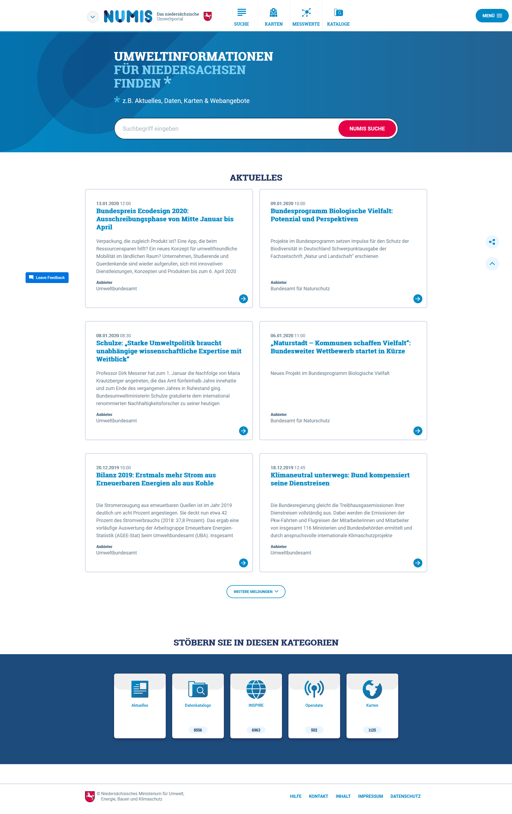
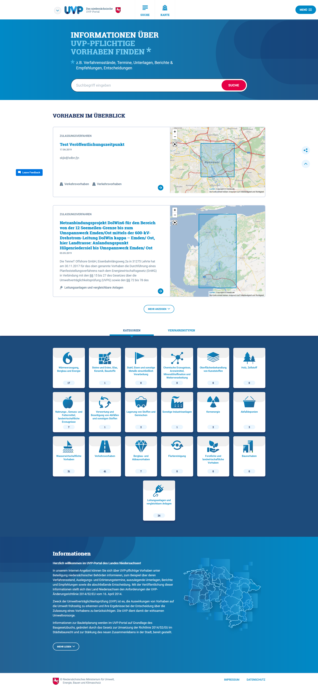
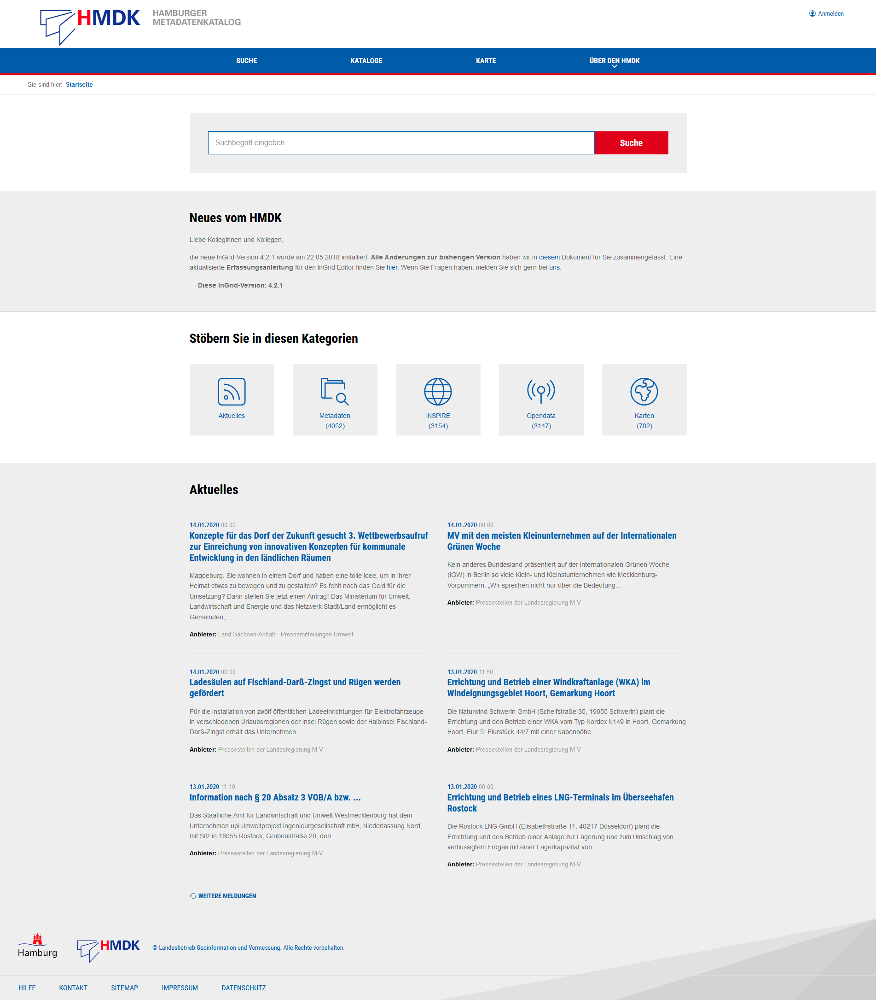
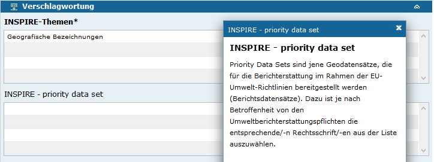
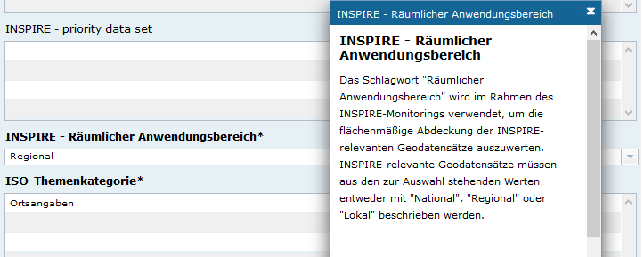
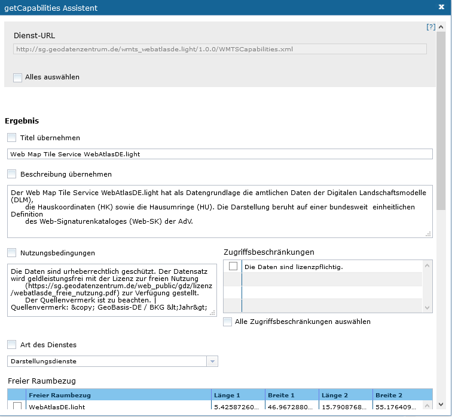
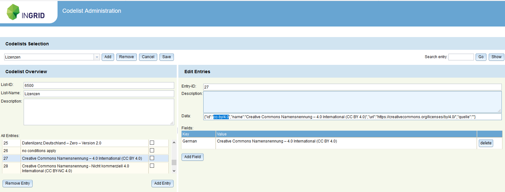

Diese Release Notes betreffen ausschließlich die Versionen 5.3.x. Release Notes ältere Versionen können hier eingesehen werden:  [5.2.x](/5.2.0/about/history.html), [5.1.x](/5.1.0/about/history.html), [5.0.x](/5.0.0/about/history.html), [4.6.x](/4.6.0/about/history.html), [4.5.x](/4.5.0/about/history.html)

## Version 5.3.1

Release 22.01.2020

- [Fix] [Codelist-Repository] Fix codelist 6005 und Wiederherstellung von verlorene Einträge.  ([REDMINE-1274](https://redmine.informationgrid.eu/issues/1274))
- [Fix] [Portal] Portal: Fix Darstellungen von Einschränkungen/Constraints in der Portal-Detaildarstellung.  ([REDMINE-1595](https://redmine.informationgrid.eu/issues/1595))
- [Fix] [IGE] IGE: Fix Pflichtfeldverhalten bei Verschlagwortung/INSPIRE.  ([REDMINE-1604](https://redmine.informationgrid.eu/issues/1604))

### Komponenten

- Portal ([download](https://distributions.informationgrid.eu/ingrid-portal/5.3.1/))
- Codelist-Repository ([download](https://distributions.informationgrid.eu/ingrid-codelist-repository/5.3.1/))

## Version 5.3.0

Release 15.01.2020

### Wichtige Änderungen

#### Neues Portal Profil NUMIS / UVP Niedersachsen

Für NUMIS / UVP NI wurde ein neues Portal Profil erstellt.

<figcaption class="figcaption">Neues Portal Profil NUMIS</figcaption>

<figcaption class="figcaption">Neues Portal Profil UVP NI</figcaption>

#### Neues Portal Profil HMDK

Der HMDK wurde im Portal jetzt als eigenes Profil umgesetzt.

<figcaption class="figcaption">Neues Portal Profil HMDK</figcaption>

#### Neue Felder im InGrid Editor

Neues Feld "INSPIRE - priority data set"

<figcaption class="figcaption">Feld "INSPIRE - priority data set"</figcaption>

Neues Feld "INSPIRE - Räumlicher Anwendungsbereich"

<figcaption class="figcaption">Feld "INSPIRE - Räumlicher Anwendungsbereich"</figcaption>

#### Erfassung von WMTS via Assistenten

Im InGrid Editor können nun auch WMTS Dienste komfortabel via Assistent erfasst werden.

<figcaption class="figcaption">WMTS GetCapabilities Assistent</figcaption>

#### Umstellung Lizenzen auf Open Data

Die Lizenzen werden in Zukunft gemäß Open Data DCAT-AP.de Format gehandhabt und sind damit GovData konform.
Dies bedeutet u.a. eine Umstellung der Lizenz-IDs und -Bezeichnungen gemäß der Liste der Lizenzen unter [DCAT-AP.de Lizenzen](https://www.dcat-ap.de/def/licenses/).
Nähere Informationen s. auch [Anbindung der GDI-DE an GovData](https://wiki.gdi-de.org/display/gdk/Anbindung+der+GDI-DE+an+GovData).

<figcaption class="figcaption">Open Data Lizenzen im Codelist Repo</figcaption>

### Liste der Änderungen

InGrid

- [Feature] [IGE] Änderung der URL im xml-Attribut codelist ([REDMINE-1554](https://redmine.informationgrid.eu/issues/1554))
- [Feature] [IGE] Neues Feld "INSPIRE - Priority Dataset" ([REDMINE-1516](https://redmine.informationgrid.eu/issues/1516))
- [Feature] [IGE] Neues Feld "INSPIRE - Räumlicher Anwendungsbereich" ([REDMINE-1517](https://redmine.informationgrid.eu/issues/1517))
- [Feature] [IGE] INSPIRE-TG MD 2.0.1: Auflösung des Feldes "Kodierungsschema" in "Anwendungsschema" und "Datenformat" ([REDMINE-1273](https://redmine.informationgrid.eu/issues/1273))
- [Feature] [IGE] WMTS mit GetCapabilities-Assistent erfassen ([REDMINE-513](https://redmine.informationgrid.eu/issues/513))
- [Feature] [IGE] Datenformat GML+Version für INSPIRE-relevante Datensätze ([REDMINE-1272](https://redmine.informationgrid.eu/issues/1272))
- [Feature] [IGE] INSPIRE TG MD 2.0: ISO-Mapping der Felder Nutzungsbedingungen und Anwendungseinschränkungen normalisieren ([REDMINE-1220](https://redmine.informationgrid.eu/issues/1220))
- [Feature] [PORTAL] Vermeidung von Klartext Passwörtern in E-Mails ([REDMINE-1118](https://redmine.informationgrid.eu/issues/1118))
- [Feature] [CODELIST REPO] Änderung Lizenz-ID der Open Data Lizenzen ([REDMINE-1534](https://redmine.informationgrid.eu/issues/1534))
- [Feature] [INTERFACE CSW] Erstellung einer Transparenzportal-spezifischen CSW Schnittstellen Konfiguration ([REDMINE-1531](https://redmine.informationgrid.eu/issues/1531))
- [Bug] [IPLUG-CSW] "Zeige in Karte" fehlt im Portal ([REDMINE-1598](https://redmine.informationgrid.eu/issues/1598))
- [Bug] [IGE] Objektreferenzen die in Bearbeitung sind, dürfen nicht im Portal erscheinen ([REDMINE-1597](https://redmine.informationgrid.eu/issues/1597))
- [Bug] [IGE] Seltener Fehler in Import von ISO 8601 Datumsangaben ([REDMINE-1586](https://redmine.informationgrid.eu/issues/1586))
- [Bug] [IGE] Eingabe von spitzen Klammern in Quellenvermerk nicht möglich ([REDMINE-1530](https://redmine.informationgrid.eu/issues/1530))
- [Bug] [IGE] Über gmx:Anchor abgebildete Raumbezugssysteme werden nicht importiert ([REDMINE-1569](https://redmine.informationgrid.eu/issues/1569))
- [Bug] [CODELIST REPO] INSPIRE-Themen, LIST-ID:6100/106 Falsches INSPIRE-Thema ([REDMINE-1561](https://redmine.informationgrid.eu/issues/1561))
- [Bug] [PORTAL] Funktion "Passwort vergessen" funktioniert nicht ([REDMINE-1543](https://redmine.informationgrid.eu/issues/1543))
- [Bug] [PORTAL] Schreibfehler Kontaktformular ([REDMINE-1545](https://redmine.informationgrid.eu/issues/1545))

Profil UVP

- [Feature] [PORTAL] Anpassung der länderspezifischen Vorschaltseiten an das neue UVP Layout ([REDMINE-1570](https://redmine.informationgrid.eu/issues/1570))
- [Feature] [PORTAL] Sortierung der Trefferliste ([REDMINE-602](https://redmine.informationgrid.eu/issues/602))
- [Feature] [PORTAL] Austausch Logo, Slogan zu "Umweltverträglichkeitsprüfungen der Länder" ([REDMINE-1577](https://redmine.informationgrid.eu/issues/1577))
- [Feature] [PORTAL] Verfahrenstyp soll in Detaildarstellung angezeigt werden ([REDMINE-1590](https://redmine.informationgrid.eu/issues/1590))
- [Feature] [IGE] Integration eines Virusscanners in den Upload Prozess ([REDMINE-1293](https://redmine.informationgrid.eu/issues/1293))
- [Bug] [IGE] Upload von gleicher Datei in anderem Datensatz wird unter falscher UUID abgelegt ([REDMINE-1599](https://redmine.informationgrid.eu/issues/1599))
- [Bug] [IGE] Versteckte Adresse wird in Trefferliste angezeigt ([REDMINE-1522](https://redmine.informationgrid.eu/issues/1522))
- [Bug] [IGE] Verbesserung der Handhabung von Leerzeichen und Sonderzeichen in Dokumentennamen ([REDMINE-1555](https://redmine.informationgrid.eu/issues/1555))
- [Bug] [IGE] Verlinkung von Dokumenten im Editor funktioniert nicht ([REDMINE-1553](https://redmine.informationgrid.eu/issues/1553))
- [Bug] [PORTAL] Auswahl eines Partners lässt Facette komplet verschwinden ([REDMINE-1538](https://redmine.informationgrid.eu/issues/1538))
- [Bug] [PORTAL] Fehler bei der Darstellung im IE11 ([REDMINE-1576](https://redmine.informationgrid.eu/issues/1576))

Profil HMDK

- [Feature] [PORTAL] Profilerstellung für HMDK Installation ([REDMINE-1523](https://redmine.informationgrid.eu/issues/1523))

Profil NUMIS

- [Feature] [PORTAL] Umsetzung der Layoutkonzeption NUMIS/UVP Niedersachsen ([REDMINE-1465](https://redmine.informationgrid.eu/issues/1465))

Profil BKG

- [Feature] [PORTAL] Funktion "Ähnliche Begriffe" sollen aus Portal entfernt werden ([REDMINE-1528](https://redmine.informationgrid.eu/issues/1528))
- [Feature] [IGE] Erfassung des Quellenvermerks ermöglichen ([REDMINE-971](https://redmine.informationgrid.eu/issues/971))
- [Feature] [CODELIST REPO] Geänderte Codelisten übernehmen ([REDMINE-1410](https://redmine.informationgrid.eu/issues/1410))

Profil EBA

- [Feature] [PORTAL] Erstellung Portal Profil EBA ([REDMINE-1593](https://redmine.informationgrid.eu/issues/1593))

### Komponenten

- Portal ([download](https://distributions.informationgrid.eu/ingrid-portal/5.3.0/))
- iBus ([download](https://distributions.informationgrid.eu/ingrid-ibus/5.3.0/))
- Codelist-Repository ([download](https://distributions.informationgrid.eu/ingrid-codelist-repository/5.3.0/))
- Interface CSW ([download](https://distributions.informationgrid.eu/ingrid-interface-csw/5.3.0/))
- Interface Search ([download](https://distributions.informationgrid.eu/ingrid-interface-search/5.3.0/))
- iPlug DSC ([download](https://distributions.informationgrid.eu/ingrid-iplug-dsc/5.3.0/))
- iPlug CSW ([download](https://distributions.informationgrid.eu/ingrid-iplug-csw-dsc/5.3.0/))
- iPlug WFS ([download](https://distributions.informationgrid.eu/ingrid-iplug-wfs-dsc/5.3.0/))
- iPlug IGE ([download](https://distributions.informationgrid.eu/ingrid-iplug-ige/5.3.0/))
- iPlug Excel ([download](https://distributions.informationgrid.eu/ingrid-iplug-excel/5.3.0/))

