Diese Release Notes betreffen ausschließlich die Versionen 5.12.x. Release Notes älterer Versionen können hier eingesehen werden:
[5.11.x](/5.11.0/about/history.html), [5.10.x](/5.10.0/about/history.html), [5.9.x](/5.9.0/about/history.html), [5.8.x](/5.8.0/about/history.html), [5.7.x](/5.7.0/about/history.html), [5.6.x](/5.6.0/about/history.html), [5.5.x](/5.5.0/about/history.html), [5.4.x](/5.4.0/about/history.html), [5.3.x](/5.3.0/about/history.html), [5.2.x](/5.2.0/about/history.html), [5.1.x](/5.1.0/about/history.html), [5.0.x](/5.0.0/about/history.html)


## Version 5.12.2

Release 10.06.2022

### Wichtige Änderungen

#### Ortssuche in der Karte des UVP-Portals auf Basis von Nominatim

In der Karte wurde eine Ortssuche basierend auf Nominatim hinzugefügt. ([REDMINE-3621](https://redmine.informationgrid.eu/issues/3621))

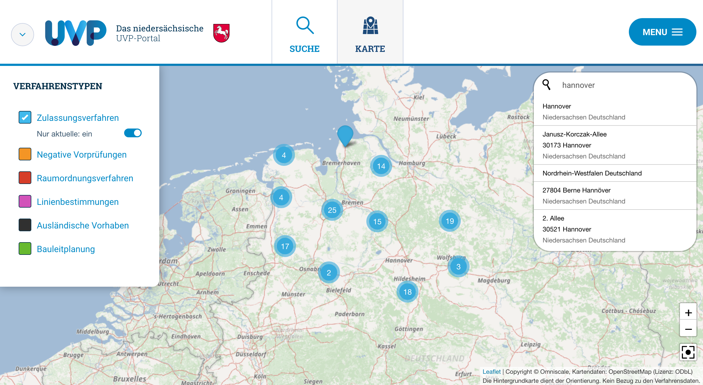
<figcaption class="figcaption">Ortssuche in der Karte des niedersächsischen UVP-Portals auf Basis von Nominatim</figcaption>

### Liste der Änderungen

- [Feature] [MAPCLIENT] Positionierung über Request an BWaStr-Locator ([REDMINE-3807](https://redmine.informationgrid.eu/issues/3807))

Profil MetaVer

- [Feature] [PORTAL] HB - Vorschaubild austauschen: inkl. Bremerhaven ([REDMINE-3907](https://redmine.informationgrid.eu/issues/3907))

Profil UVP

- [Feature] [PORTAL] Metadaten im UVP-Portal für Suchmaschinen und für Nutzer optimieren ([REDMINE-3635](https://redmine.informationgrid.eu/issues/3635))
- [Feature] [PORTAL] Ortssuche in der Karte des UVP-Portals auf Basis von NOMINATIM ([REDMINE-3621](https://redmine.informationgrid.eu/issues/3621))
- [Feature] [PORTAL] Optimierung Sammeldownload-Funktionalität ([REDMINE-3456](https://redmine.informationgrid.eu/issues/3456))

### Komponenten

- PORTAL ([download](https://distributions.informationgrid.eu/ingrid-portal/5.12.2/))


## Version 5.12.1

Release 18.05.2022

### Wichtige Änderungen

#### Kartenclient: Kopplung WMS Layer und WFS Featuretype und Download-Möglichkeiten

Im Kartenclient wurde eine Koppelung zwischen WMS Layer und WFS Featuretype eingerichtet und es wurden Optionen für den Download hinzugefügt. ([REDMINE-3585](https://redmine.informationgrid.eu/issues/3585))

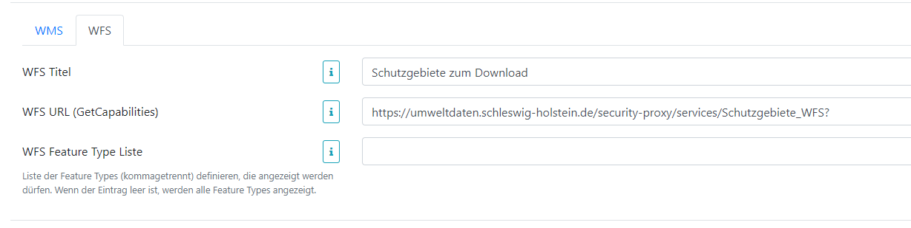
<figcaption class="figcaption">Mapclient: Kopplung WMS Layer und WFS Featuretype und Download-Möglichkeiten - Webmap Client Admin GUI</figcaption>

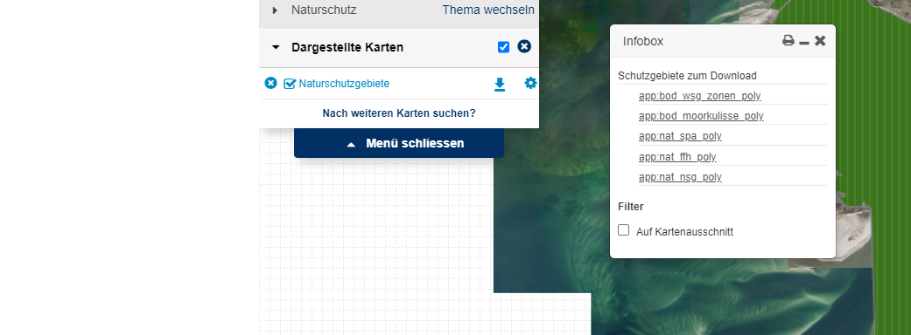
<figcaption class="figcaption">Mapclient: Kopplung WMS Layer und WFS Featuretype und Download-Möglichkeiten - Webmap Client Frontend</figcaption>

### Liste der Änderungen

- [Feature] [MAPCLIENT] Mapclient - Positionierung über Request an BWaStr-Locator ([REDMINE-3807](https://redmine.informationgrid.eu/issues/3807))
- [Bug] [IGE] Einfügen eines Trenners in der Beschreibung des ISOs ([REDMINE-3759](https://redmine.informationgrid.eu/issues/3759))
- [Bug] [PORTAL] Portal: Unstimmigkeiten bei der Validierung von Benutzername ([REDMINE-3865](https://redmine.informationgrid.eu/issues/3865))
- [Bug] [PORTAL] Portal: Menü-Button wird durch langen Usernamen blockiert ([REDMINE-3823](https://redmine.informationgrid.eu/issues/3823))

Profil HMDK

- [Feature] [PORTAL] ReDesign Hamburger Metadatenkatalog (HMDK) ([REDMINE-3239](https://redmine.informationgrid.eu/issues/3239))

Profil Umweltportal Schleswig-Holstein

- [Feature] [MAPCLIENT] Kopplung WMS Layer und WFS Featuretype, Download-Möglichkeiten ([REDMINE-3585](https://redmine.informationgrid.eu/issues/3585))
- [Feature] [PORTAL] Profil-Switch-Link soll deaktiviert werden ([REDMINE-3829](https://redmine.informationgrid.eu/issues/3829))

Profil UVP

- [Bug] [PORTAL] UVP: Mehrfachauswahl unter Facetten "Verfahrenstypen" und "Kategorien" Korrektur ([REDMINE-3788](https://redmine.informationgrid.eu/issues/3788))
- [Bug] [PORTAL] UVP: ZIP-Download größer als 2GB werden nicht korrekt heruntergeladen ([REDMINE-3779](https://redmine.informationgrid.eu/issues/3779))

### Komponenten

- IPLUG-IGE ([download](https://distributions.informationgrid.eu/ingrid-iplug-ige/5.12.1/))
- IPLUG-WFS-DSC ([download](https://distributions.informationgrid.eu/ingrid-iplug-wfs-dsc/5.12.1/))
- PORTAL ([download](https://distributions.informationgrid.eu/ingrid-portal/5.12.1/))


## Version 5.12.0.2

Release 22.06.2022

### Liste der Änderungen

Profil UVP

- [Bug] [PORTAL] Upload wird unter falscher UUID abgelegt ([REDMINE-3965](https://redmine.informationgrid.eu/issues/3965))
- [Bug] [PORTAL] Ausländisches Verfahren wird unter "Verfahren" angelegt ([REDMINE-2487](https://redmine.informationgrid.eu/issues/2487))

### Komponenten

- PORTAL ([download](https://distributions.informationgrid.eu/ingrid-portal/5.12.0.2/))


## Version 5.12.0.1

Release 28.04.2022

### Liste der Änderungen

Profil UVP

- [Bug] [PORTAL] UVP: Mehrfachauswahl unter Facetten "Verfahrenstypen" und "Kategorien" Korrektur ([REDMINE-3788](https://redmine.informationgrid.eu/issues/3788))
- [Bug] [PORTAL] UVP: ZIP-Download größer als 2GB werden nicht korrekt heruntergeladen ([REDMINE-3779](https://redmine.informationgrid.eu/issues/3779))

### Komponenten

- PORTAL ([download](https://distributions.informationgrid.eu/ingrid-portal/5.12.0.1/))


## Version 5.12.0

Release 12.04.2022

### Hinweise für die Aktualisierung

#### Optimierung der Indexierung: Beschränkung der Datenmenge, die vom N-GRAM Algorithmus verarbeitet wird

Der erhöhte Speicherverbrauch wurde zu großen Teilen durch den N-Gram Analyzer für die Phrasen-Suche erzeugt, da hier die N-Grams ohne vorherige Zerlegung in Teilworte erfolgte.

Auf dieses Index-Feld kann allerdings verzichtet werden, wenn man in Kauf nimmt, dass die Phrasen-Suche nur an Wortgrenzen funktioniert und keine Teilworte abdeckt.<br>
Beispiel:<br>
"Digitales Oberflächenmodell aus der Befliegung 2003 - Kachel: Wilhelmshaven_9 Digital surface model from the aerial flight 2003 - tile: Wilhelmshaven_9" wird bei der Suche nach "Kachel: Wilhelmshaven_9" gefunden, jedoch nicht bei der Suche nach "Kachel: Wilhelmshaven".

**WICHTIG:** Für die Entfernung des Indexfelds wurden Änderungen an den Dateien `default-mappings.json` und `default-settings.json` vorgenommen. Wenn diese bei der Installation überschrieben werden, müssen diese ersetzt werden. ([REDMINE-3492](https://redmine.informationgrid.eu/issues/3492#note-3))

#### Instanzen von iPlug SE müssen neu erstellt werden

Aufgrund der Anpassungen an Elasticsearch müssen die Instanzen im iPlug SE nach der Aktualisierung neu erstellt und indexiert werden:

- Aufruf iPlug-Administration -> SE-Settings -> SE-Instanzen
- Bestehende, aktive SE-Instanzen kopieren und zwecks Unterscheidung jeweils einen anderen Namen vergeben (z.B. _JJJJMMDD an den Namen anhängen)
- Neue, kopierte Instanzen entweder manuell crawlen und indexieren ("Management" -> "Start Crawl") oder vorhandes Scheduling (Zeitplanung) von den alten Instanzen übernehmen für automatisches Crawlen und Indexieren der neuen Instanzen
- Nachdem neue Instanzen gecrawlt und indexiert sind, können die alten Instanzen gelöscht werden

#### Änderung der Hashfunktion für den Webmap Client-Login

Im Zuge der Verbesserung der Passwortsicherheit wurde die Hashfunktion des Webmap Clients von MD5 geändert auf SHA-256. Damit erfüllt die Passwortverschlüsselung die Anforderungen des BSI (Bundesamt für Sicherheit in der Informationstechnik).
Ein bestehendes Passwort muss daher neu verschlüsselt werden:<br>
[Wo kann ich die Login-Daten für die Admin-GUI festlegen?](https://www.ingrid-oss.eu/latest/components/webmap_client_admin.html#wo-kann-ich-die-login-daten-f%C3%BCr-die-admin-gui-festlegen)
([REDMINE-3669](https://redmine.informationgrid.eu/issues/3669))

#### Hinzufügen des neuen errorPatterns in den Konfigurationsdateien (Antivirus Scan)

Es gibt ein neues errorPattern für die Erkennung von Fehlern, die während des Virusscans auftreten, aber keine Exception auswerfen (z.B. fehlerhafter Zugriff auf Dateien).
Das neue errorPattern muss in der Properties des VirusScanValidators aufgenommen werden. Die Properties befinden sich normalerweise in der `mdek.override.properties`-Datei.

Beispiel:
  ```
  "virusscan":{
      "impl":"de.ingrid.mdek.upload.storage.validate.impl.VirusScanValidator",
      "properties":{
          "command":"\\\\path\\\\to\\\\sophos\\\\savscan -f -all -archive -mime %FILE%",
          "virusPattern":"(?m)^>>> Virus '([^']+)' found in file (.+)$",
          "cleanPattern":"(?m)^No viruses were discovered.$",
          "errorPattern":"(?m)^\\d* error(s\\b|\\b) ((\\was\\b)|(\\were\\b)) encountered.$"\,
          "timeout": "60"
      }
  }
  ```

### Wichtige Änderungen

#### Aktualisiertes Portal-Layout für das GeoPortal.WSV

Das Portal-Layout für GeoPortal.WSV wurde aktualisiert. ([REDMINE-3636](https://redmine.informationgrid.eu/issues/3636))

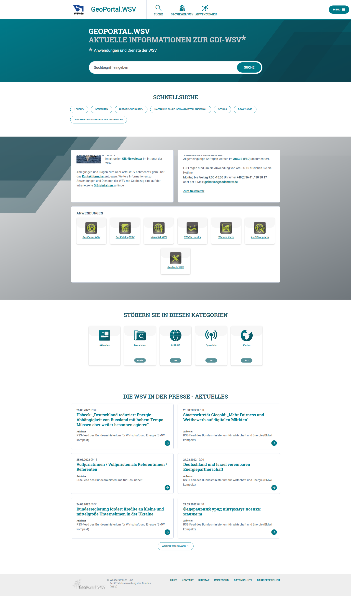
<figcaption class="figcaption">Aktualisiertes Portal-Layout für das GeoPortal.WSV Startseite</figcaption>

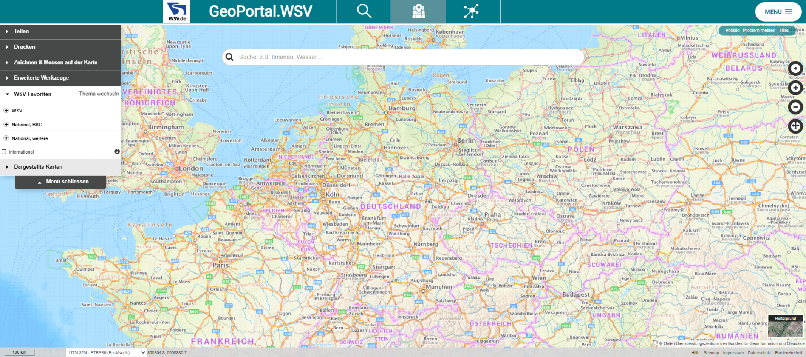
<figcaption class="figcaption">Aktualisiertes Portal-Layout für das GeoPortal.WSV Karte</figcaption>

#### Aktualisiertes Portal-Layout für das GeoPortal.EBA

Das Portal-Layout für GeoPortal.EBA wurde aktualisiert. ([REDMINE-3637](https://redmine.informationgrid.eu/issues/3637))

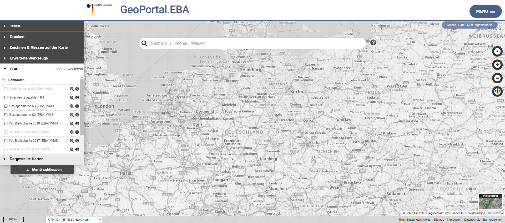
<figcaption class="figcaption">Aktualisiertes Portal-Layout für das GeoPortal.EBA Karte</figcaption>

#### Aktualisierte Layouts Suchergebnisseite und Detaildarstellung für das PortalU RLP

Die Layouts für die Suchergebnisseite und die Detaildarstellung des PortalU RLP wurden angepasst. ([REDMINE-3631](https://redmine.informationgrid.eu/issues/3631))

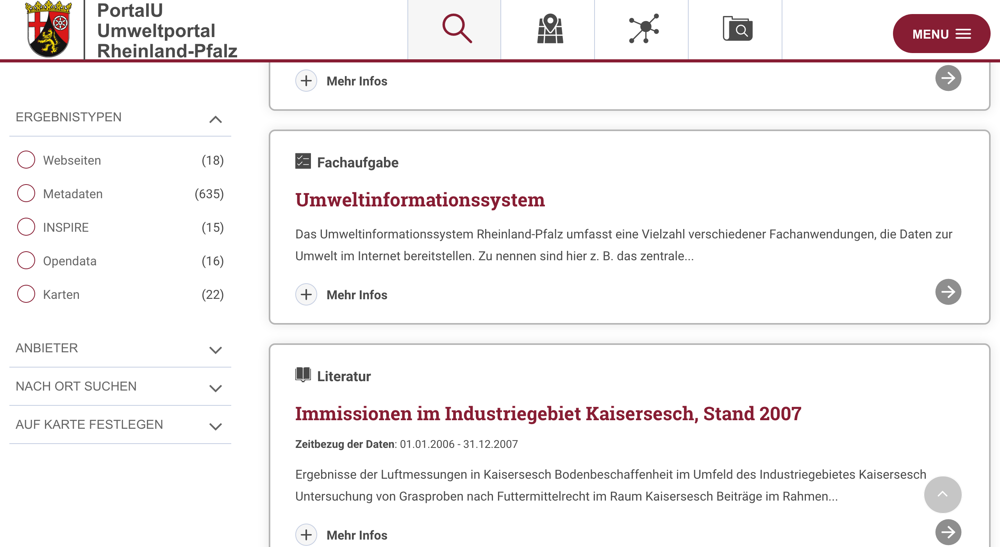
<figcaption class="figcaption">Aktualisierte Layouts Suchergebnisseite und Detaildarstellung für das PortalU RLP Suche</figcaption>

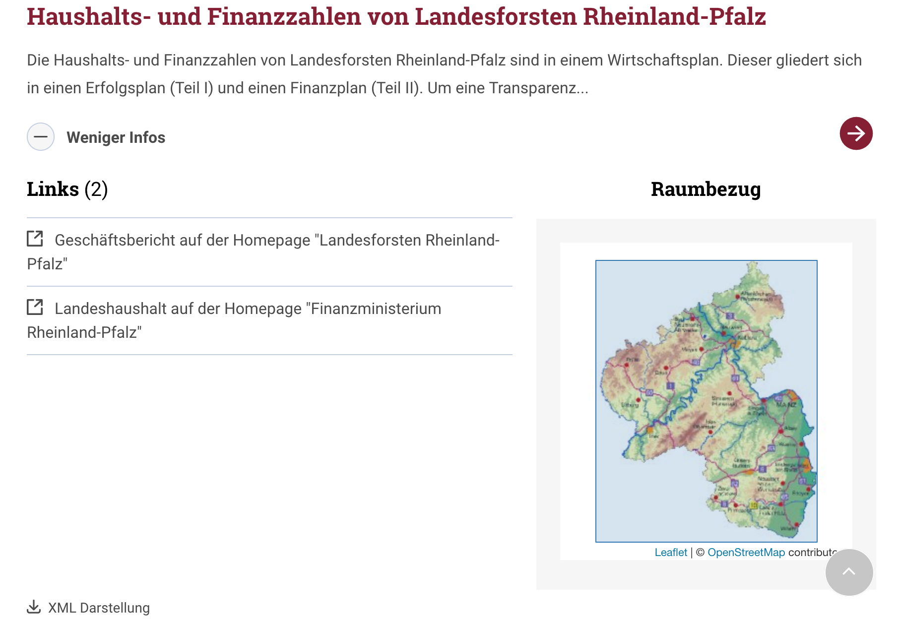
<figcaption class="figcaption">Aktualisierte Layouts Suchergebnisseite und Detaildarstellung für das PortalU RLP Suche Mehr Infos</figcaption>

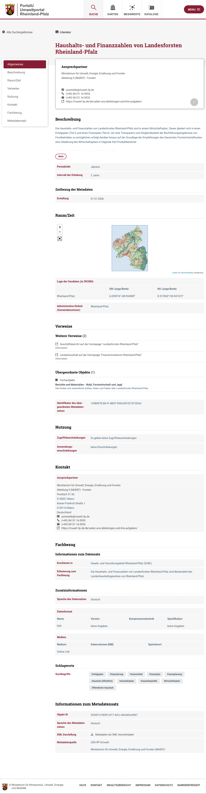
<figcaption class="figcaption">Aktualisierte Layouts Suchergebnisseite und Detaildarstellung für das PortalU RLP Suche Detail</figcaption>

#### UVP: Mehrfachauswahl bei Facetten "Verfahrenstypen" und "Kategorien" in der Suche

Im UVP-Profil ist es jetzt möglich, in der Suche bei "Verfahrenstypen" und "Kategorien" jeweils mehrere Facetten per Checkbox auszuwählen und zu kombinieren. ([REDMINE-3317](https://redmine.informationgrid.eu/issues/3317))

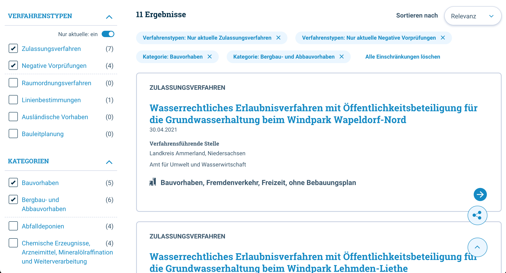
<figcaption class="figcaption">Mehrfachauswahl bei Facetten Verfahrenstypen und Kategorien in der Suche des niedersächsischen UVP-Portals</figcaption>

Auf der Karte wurden die Schieberegler für die Anzeige von "nur aktuellen" Verfahren bei weiteren Verfahrenstypen hinzugefügt.

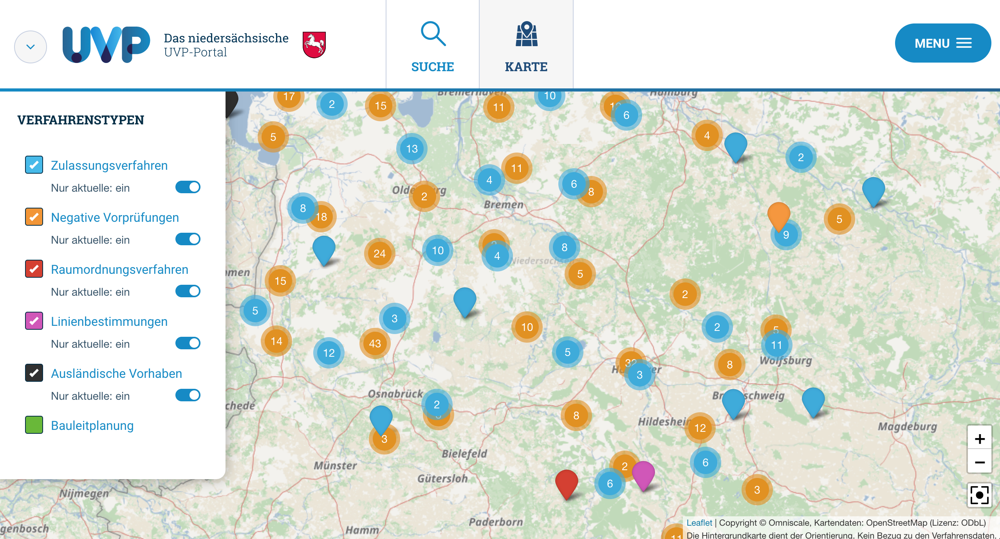
<figcaption class="figcaption">Schieberegler für die Anzeige von nur aktuellen Verfahren bei weiteren Verfahrenstypen auf der Karte des niedersächsischen UVP-Portals</figcaption>

#### Neue Elasticsearch-Version für den Messwerte-Client

Mit der Version 5.12.0 wurde die Elasticsearch-Version des Messwerte-Clients im Portal aktualisiert auf 7.16.2. Damit steht eine aktuelle, stabile Basis für die Indexierung und Suche von Zeitreihen zur Verfügung, die Indexierungsschicht und APIs wurden entsprechend angepasst.

#### TopPlusOpen-Light als Hintergrundkarte in MetaVer

Die Karte TopPlusOpen-Light wird neu als Hintergrundkarte für Kartenanwendungen in MetaVer verwendet.

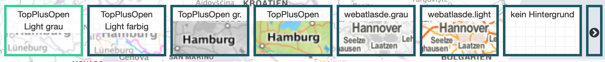
<figcaption class="figcaption">TopPlusOpen-Light als Hintergrundkarte in MetaVer</figcaption>

#### Verbesserung der URL zur Detaildatensuche im Portal

Aktuell werden aus Kompatibilitätsgründen die Parameter plugid und docid für den Zugriff auf eine Detail-URL generiert:<br>
https://example.org/trefferanzeige?docuuid=F1FF6ED0-2C54-4CF8-8575-A46AF9388CB6&plugid=/ingrid-group:ige-iplug-test&docid=F1FF6ED0-2C54-4CF8-8575-A46AF9388CB6

Der Link kann aber meist vereinfacht werden zu:<br>
https://example.org/trefferanzeige?docuuid=F1FF6ED0-2C54-4CF8-8575-A46AF9388CB6

Ausnahme: Existieren in zwei Katalogen Datensätze mit gleicher UUID, muss das iPlug (Katalog) mit angegeben werden.

Per default wird in der URL der Detaildarstellung kein Parameter plugid mehr geliefert.
Das Hinzufügen des Parameters plugid kann mit der Portal-Einstellung `portal.detail.use.parameter.plugid` wieder aktiviert werden.
Der Parameter docid wurde aus der Detail-URL entfernt.


### Liste der Änderungen

- [Feature] [IGE] SchemaLocation - Eintrag im XML ändern ([REDMINE-3392](https://redmine.informationgrid.eu/issues/3392))
- [Feature] [IGE] Zusätzliche Validierungsregel für die Eingabe von "Durch die Ressource abgedeckte Zeitspanne" implementieren ([REDMINE-2377](https://redmine.informationgrid.eu/issues/2377))
- [Feature] [IGE] Editor - Im GUI "Dokument-Upload" ersetzen mit "hinzufügen" ([REDMINE-1903](https://redmine.informationgrid.eu/issues/1903))
- [Feature] [INTERFACE-CSW] CSW-T (Geodatensatz Teil1): alle HH-spezifischen Anpassungen sollen für die CSW-T Funktionalität berücksichtigt werden ([REDMINE-2097](https://redmine.informationgrid.eu/issues/2097))
- [Feature] [MAPCLIENT] Hilfe-Link im Footer vom Kartenviewer einbinden  ([REDMINE-3667](https://redmine.informationgrid.eu/issues/3667))
- [Feature] [MAPCLIENT] Barrierefreiheit-Link im Footer vom Kartenviewer einbinden ([REDMINE-3666](https://redmine.informationgrid.eu/issues/3666))
- [Feature] [MAPCLIENT] Import von Layern per Single-Tile ([REDMINE-3665](https://redmine.informationgrid.eu/issues/3665))
- [Feature] [MAPCLIENT] Import von Layern mit Gutter ([REDMINE-3685](https://redmine.informationgrid.eu/issues/3685))
- [Feature] [PORTAL] Aktualisierung Portal-Layout für das GeoPortal.EBA ([REDMINE-3637](https://redmine.informationgrid.eu/issues/3637))
- [Feature] [PORTAL] Aktualisierung Portal-Layout für das GeoPortal.WSV ([REDMINE-3636](https://redmine.informationgrid.eu/issues/3636))
- [Feature] [PORTAL] Verbesserung der URL zur Detaildatensuche ([REDMINE-3495](https://redmine.informationgrid.eu/issues/3495))
- [Feature] [SYSTEM] Optimierung Indexierung: Beschränkung der Datenmenge die vom N-GRAM Algorithmus verarbeitet wird. ([REDMINE-3492](https://redmine.informationgrid.eu/issues/3492))
- [Feature] [SYSTEM] Aktualisierung Spring Framework ([REDMINE-3687](https://redmine.informationgrid.eu/issues/3687))
- [Feature] [SYSTEM] Vermeidung von Nutzung des MD5 HASH Algorithmus für Kodierung von Passwörtern ([REDMINE-3669](https://redmine.informationgrid.eu/issues/3669))
- [Bug] [CODELIST REPOSITORY] Migration der alten Versionsinformation ([REDMINE-3391](https://redmine.informationgrid.eu/issues/3391))
- [Bug] [CODELIST REPOSITORY] Falsche Codelist-URL in ISO-XML für GovData-Schlüsselwörter ([REDMINE-3428](https://redmine.informationgrid.eu/issues/3428))
- [Bug] [IGE] Hinzugefügter Eintrag am Ende der Beschreibung ([REDMINE-3462](https://redmine.informationgrid.eu/issues/3462))
- [Bug] [MAPCLIENT] Dienst-Import über das Portal funktioniert nicht ([REDMINE-3584](https://redmine.informationgrid.eu/issues/3584))
- [Bug] [MAPCLIENT] Teilen von Zeichnung enthält falsche URL ([REDMINE-3545](https://redmine.informationgrid.eu/issues/3545))
- [Bug] [MAPCLIENT] Fehlerhebung beim Import von geschützten Diensten ([REDMINE-3476](https://redmine.informationgrid.eu/issues/3476))
- [Bug] [PORTAL] Detail-Ausgabe für Vektordaten werden nicht vollständig angezeigt ([REDMINE-3377](https://redmine.informationgrid.eu/issues/3377))
- [Bug] [PORTAL] Automatische Auflösung von Redirects bei der Darstellung von Vorschaubildern (http -> https) ([REDMINE-3668](https://redmine.informationgrid.eu/issues/3668))
- [Bug] [SYSTEM] IT-Sicherheitsmängel in Docker Basis Images beseitigen ([REDMINE-3596](https://redmine.informationgrid.eu/issues/3596))
- [Bug] [SYSTEM] Überprüfung von Unstimmigkeiten bei der Optimierung der Suche ([REDMINE-3222](https://redmine.informationgrid.eu/issues/3222))
- [Bug] [SYSTEM] Ein '#' oder ein Suchbegriff mit abschließendem ':' in der Suche führt zu 0 Treffern und einer fehlerhaften Darstellung ([REDMINE-3408](https://redmine.informationgrid.eu/issues/3408))

Profil BAW MIS

- [Feature] [IGE] Formular für Software anpassen ([REDMINE-2771](https://redmine.informationgrid.eu/issues/2771))
- [Feature] [IGE] Formular für Messdaten anpassen ([REDMINE-2770](https://redmine.informationgrid.eu/issues/2770))
- [Feature] [PORTAL] Filter-Facetten im baw_mis Profil anpassen ([REDMINE-3303](https://redmine.informationgrid.eu/issues/3303))
- [Bug] [PORTAL] "Auswahl anwenden" Button für die räumliche Suche nicht sichtbar ([REDMINE-3544](https://redmine.informationgrid.eu/issues/3544))

Profil BKG

- [Feature] [PORTAL] Katalogausgabe entsprechend #1358 für AdV-MIS umsetzen ([REDMINE-3277](https://redmine.informationgrid.eu/issues/3277))
- [Bug] [IGE] Wechsel des Reiters blockiert ([REDMINE-3286](https://redmine.informationgrid.eu/issues/3286))
- [Bug] [PORTAL] BKG-Design: Info-Seite "Session abgelaufen" ([REDMINE-3654](https://redmine.informationgrid.eu/issues/3654))

Profil InGrid Installation Rheinland-Pfalz

- [Feature] [PORTAL] Layouts anpassen für die Suchergebnisseite und die Detaildarstellung im RLP-Profil ([REDMINE-3631](https://redmine.informationgrid.eu/issues/3631))

Profil HMDK

- [Feature] [] Transformation von DCAT-AP.DE Kategorien in OGDD Kategorien in der Kompatibilitätsschicht im der "CSWHH" Schnittstelle ([REDMINE-3558](https://redmine.informationgrid.eu/issues/3558))

Profil MetaVer

- [Feature] [MAPCLIENT] Hintergrundkarten in Metaver - Einbinden der TopPlusOpen-Light Karten ([REDMINE-3095](https://redmine.informationgrid.eu/issues/3095))
- [Feature] [PORTAL] Bereinigen der Nutzer im metaver.de Portal ([REDMINE-2081](https://redmine.informationgrid.eu/issues/2081))
- [Bug] [MAPCLIENT] Logo in "Print.InGrid.pdf" austauschen ([REDMINE-3569](https://redmine.informationgrid.eu/issues/3569))
- [Bug] [MAPCLIENT] Reload Mapclient - weiße Seite ([REDMINE-3594](https://redmine.informationgrid.eu/issues/3594))
- [Bug] [MAPCLIENT] Fehlermeldung "Layer hinzufügen" in Kartenanwendung ([REDMINE-3399](https://redmine.informationgrid.eu/issues/3399))
- [Bug] [PORTAL] Objektklassen in MetaVer wieder anpassen ([REDMINE-3638](https://redmine.informationgrid.eu/issues/3638))
- [Bug] [PORTAL] Zeitbezug der Daten  Von: 13.09.1945 01:00:00 Bis: 31.12.1989 ([REDMINE-3618](https://redmine.informationgrid.eu/issues/3618))

Profil NUMIS

- [Bug] [PORTAL] Im Footer des nds. UVP-Portals fehlt der MU-Tag ([REDMINE-3494](https://redmine.informationgrid.eu/issues/3494))

Profil UVP

- [Feature] [IGE] Hilfetext zu UVP-Nummern anpassen ([REDMINE-2768](https://redmine.informationgrid.eu/issues/2768))
- [Feature] [PORTAL] UVP: Mehrfachauswahl unter Facetten "Verfahrenstypen" und "Kategorien" ([REDMINE-3317](https://redmine.informationgrid.eu/issues/3317))
- [Feature] [SYSTEM] Verbesserung des Fehler Benachrichtigung des Virusscans ([REDMINE-1797](https://redmine.informationgrid.eu/issues/1797))


### Komponenten

- CODELIST-REPOSITORY ([download](https://distributions.informationgrid.eu/ingrid-codelist-repository/5.12.0/))
- IBUS ([download](https://distributions.informationgrid.eu/ingrid-ibus/5.12.0/))
- INTERFACE-CSW ([download](https://distributions.informationgrid.eu/ingrid-interface-csw/5.12.0/))
- INTERFACE-SEARCH ([download](https://distributions.informationgrid.eu/ingrid-interface-search/5.12.0/))
- IPLUG-BLP ([download](https://distributions.informationgrid.eu/ingrid-iplug-blp/5.12.0/))
- IPLUG-CSW-DSC ([download](https://distributions.informationgrid.eu/ingrid-iplug-csw-dsc/5.12.0/))
- IPLUG-DSC ([download](https://distributions.informationgrid.eu/ingrid-iplug-dsc/5.12.0/))
- IPLUG-EXCEL ([download](https://distributions.informationgrid.eu/ingrid-iplug-excel/5.12.0/))
- IPLUG-IGE ([download](https://distributions.informationgrid.eu/ingrid-iplug-ige/5.12.0/))
- IPLUG-OPENSEARCH ([download](https://distributions.informationgrid.eu/ingrid-iplug-opensearch/5.12.0/))
- IPLUG-SE ([download](https://distributions.informationgrid.eu/ingrid-iplug-se/5.12.0/))
- IPLUG-SNS ([download](https://distributions.informationgrid.eu/ingrid-iplug-sns/5.12.0/))
- IPLUG-WFS-DSC ([download](https://distributions.informationgrid.eu/ingrid-iplug-wfs-dsc/5.12.0/))
- IPLUG-XML ([download](https://distributions.informationgrid.eu/ingrid-iplug-xml/5.12.0/))
- PORTAL ([download](https://distributions.informationgrid.eu/ingrid-portal/5.12.0/))
