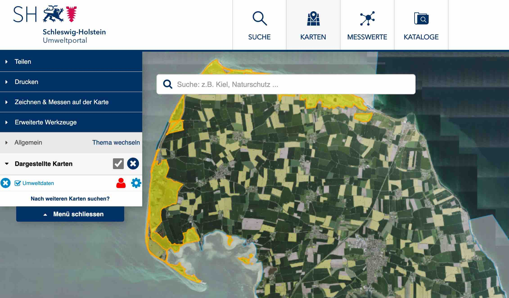
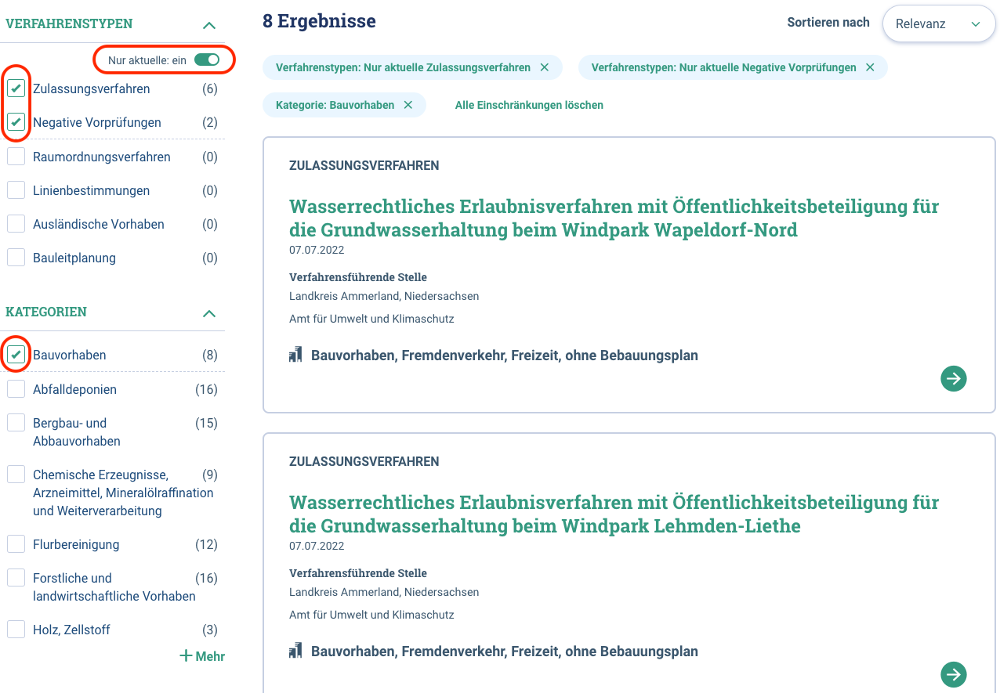
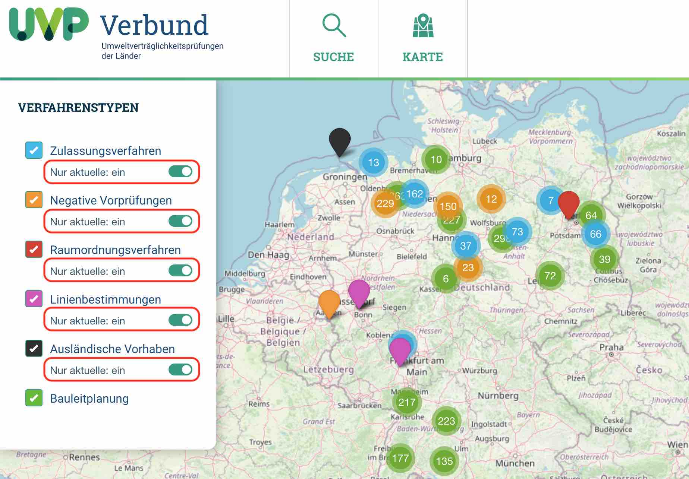
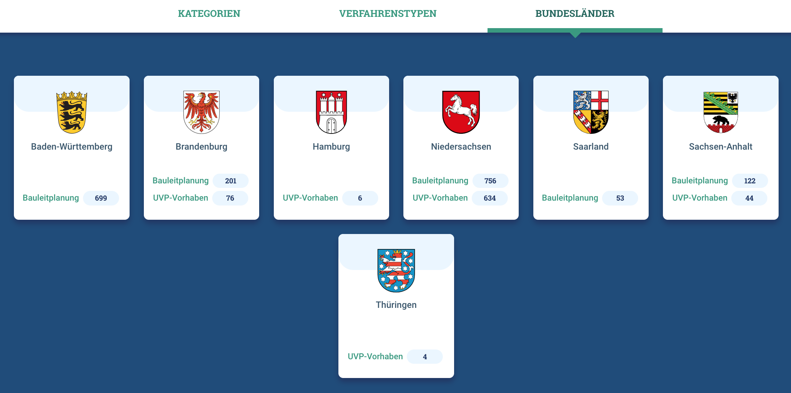

Diese Release Notes betreffen ausschließlich die Versionen 5.14.x. Release Notes älterer Versionen können hier eingesehen werden:
[5.13.x](/5.13.0/about/history.html), [5.12.x](/5.12.0/about/history.html), [5.11.x](/5.11.0/about/history.html), [5.10.x](/5.10.0/about/history.html), [5.9.x](/5.9.0/about/history.html), [5.8.x](/5.8.0/about/history.html), [5.7.x](/5.7.0/about/history.html), [5.6.x](/5.6.0/about/history.html), [5.5.x](/5.5.0/about/history.html), [5.4.x](/5.4.0/about/history.html), [5.3.x](/5.3.0/about/history.html), [5.2.x](/5.2.0/about/history.html), [5.1.x](/5.1.0/about/history.html), [5.0.x](/5.0.0/about/history.html)

## Version 5.14.0

Release 04.10.2022

### Wichtige Änderungen

#### Kartenclient: WFS Feature über individuelle Attribute hervorheben

Über individuelle Attribute können Features auf der Karte hervorgehoben und gezoomt werden ([REDMINE-4259](https://redmine.informationgrid.eu/issues/4259)).

<figcaption class="figcaption">Kartenclient: WFS Feature über individuelle Attribute hervorheben</figcaption>

#### UVP: Mehrfachauswahl bei der Suche und Anzeige der im letzten Jahr bearbeiteten Verfahren

Bei der Suche können jetzt mehrere Facetten gleichzeitig ausgewählt werden. Mit dem Umschalter "Nur aktuelle" können nur die im letzten Jahr bearbeiteten Verfahren angezeigt werden. ([REDMINE-3598](https://redmine.informationgrid.eu/issues/3598))

<figcaption class="figcaption">UVP: Mehrfachauswahl bei der Suche und Anzeige der im letzten Jahr bearbeiteten Verfahren</figcaption>

<figcaption class="figcaption">UVP: Anzeige der im letzten Jahr bearbeiteten Verfahren</figcaption>

#### UVP: Bundesländer auf der Startseite anzeigen

Auf der Startseite des UVP-Portals werden unter dem neuen Bereich "Bundesländer" die Wappen aller Bundesländer dargestellt. Dort werden pro Bundesland die Anzahl und Verlinkung auf alle im letzten Jahr bearbeiten Verfahren sowie den Verfahrenstyp "Bauleitplanung" angezeigt ([REDMINE-2515](https://redmine.informationgrid.eu/issues/2515)).

<figcaption class="figcaption">Wappen der Bundesländer auf der Startseite</figcaption>

### Liste der Änderungen

- [Feature] [CODELIST REPOSITORY] Codelist 520 um Eintrag "HDD" erweitern ([REDMINE-4115](https://redmine.informationgrid.eu/issues/4115))
- [Feature] [IGE] KVP- und RESTful-Capabilities-URL unterscheiden ([REDMINE-3369](https://redmine.informationgrid.eu/issues/3369))
- [Feature] [IPLUG_IGE] Checkbox "Open Data" für HMDK überarbeiten ([REDMINE-3413](https://redmine.informationgrid.eu/issues/3413))
- [Feature] [MAPCLIENT] Verbesserung der Absicherung der Formular-Aktionen im MapClient ([REDMINE-4270](https://redmine.informationgrid.eu/issues/4270))
- [Feature] [PORTAL] Geforderte Passwortkomplexität soll per Default erhöht werden ([REDMINE-1314](https://redmine.informationgrid.eu/issues/1314))
- [Bug] [IBUS] iBus-Suche: Details von SE-Treffer nicht aufrufbar ([REDMINE-3129](https://redmine.informationgrid.eu/issues/3129))
- [Bug] [IGE] Feld "Durch die Ressource abgedeckte Zeitspanne" zeigt Fehlermeldung ([REDMINE-3962](https://redmine.informationgrid.eu/issues/3962))
- [Bug] [IPLUG-SE] Crawl Bug bei Redirects / Excludes ([REDMINE-4262](https://redmine.informationgrid.eu/issues/4262))
- [Bug] [IPLUG-SE] IPlugSEPostCrawlProcessor schlägt fehl, wenn iPlug über iBus an Elasticsearch index angeschlossen ist ([REDMINE-1749](https://redmine.informationgrid.eu/issues/1749))
- [Bug] [MAPCLIENT] Fehler bei kombiniertem WMS-Layer ([REDMINE-4258](https://redmine.informationgrid.eu/issues/4258))
- [Bug] [PORTAL] Falsche Darstellung von geharvesteten Metadaten (Codelistübernahme) ([REDMINE-4176](https://redmine.informationgrid.eu/issues/4176))
- [Bug] [PORTAL] Reduzierung Link Länge bei CSW GEtRecords Requests ([REDMINE-4113](https://redmine.informationgrid.eu/issues/4113))

Profil BAW Datenrepository

- [Feature] [IGE] Literatur Objektklasse nochmal aktivieren ([REDMINE-2326](https://redmine.informationgrid.eu/issues/2326))

Profil BAW MIS

- [Feature] [IGE] UUID für neue Kontakte selbst festlegen ([REDMINE-3725](https://redmine.informationgrid.eu/issues/3725))
- [Feature] [IGE] DOI-Felder sollen nicht alle Nutzer bearbeiten können ([REDMINE-3599](https://redmine.informationgrid.eu/issues/3599))
- [Bug] [PORTAL] Wenn ein Objekt eine DOI hat, wird im Teaser in der Detailansicht statt Auftragsnummer die DOI angezeigt ([REDMINE-4266](https://redmine.informationgrid.eu/issues/4266))

Profil BKG

- [Feature] [IGE] WMTS - getCapabilities-Assistent und ISO-Abbildung ([REDMINE-3651](https://redmine.informationgrid.eu/issues/3651))

Profil NUMIS

- [Bug] [IPLUG-BLP] Nds. UVP-Portal: Anzeige BLP-Details "Mitgliedsgemeinden:" ([REDMINE-4070](https://redmine.informationgrid.eu/issues/4070))

Profil Umweltportal Schleswig-Holstein

- [Feature] [MAPCLIENT] WFS Feature über individuelle Attribute highlighten ([REDMINE-4259](https://redmine.informationgrid.eu/issues/4259))
- [Feature] [MAPCLIENT] Direkte Auswahl ("Highlighten") der Geometrie ([REDMINE-4114](https://redmine.informationgrid.eu/issues/4114))

Profil UVP

- [Feature] [PORTAL] Mehrfachauswahl (#3317) in UVP-Verbundportal umsetzen ([REDMINE-3598](https://redmine.informationgrid.eu/issues/3598))
- [Feature] [PORTAL] Bundesländer auf der Startseite anzeigen ([REDMINE-2515](https://redmine.informationgrid.eu/issues/2515))

### Komponenten

- CODELIST-REPOSITORY ([download](https://distributions.informationgrid.eu/ingrid-codelist-repository/5.14.0/))
- IBUS ([download](https://distributions.informationgrid.eu/ingrid-ibus/5.14.0/))
- INTERFACE-CSW ([download](https://distributions.informationgrid.eu/ingrid-interface-csw/5.14.0/))
- INTERFACE-SEARCH ([download](https://distributions.informationgrid.eu/ingrid-interface-search/5.14.0/))
- IPLUG-BLP ([download](https://distributions.informationgrid.eu/ingrid-iplug-blp/5.14.0/))
- IPLUG-CSW-DSC ([download](https://distributions.informationgrid.eu/ingrid-iplug-csw-dsc/5.14.0/))
- IPLUG-DSC ([download](https://distributions.informationgrid.eu/ingrid-iplug-dsc/5.14.0/))
- IPLUG-EXCEL ([download](https://distributions.informationgrid.eu/ingrid-iplug-excel/5.14.0/))
- IPLUG-IGE ([download](https://distributions.informationgrid.eu/ingrid-iplug-ige/5.14.0/))
- IPLUG-OPENSEARCH ([download](https://distributions.informationgrid.eu/ingrid-iplug-opensearch/5.14.0/))
- IPLUG-SE ([download](https://distributions.informationgrid.eu/ingrid-iplug-se/5.14.0/))
- IPLUG-SNS ([download](https://distributions.informationgrid.eu/ingrid-iplug-sns/5.14.0/))
- IPLUG-WFS-DSC ([download](https://distributions.informationgrid.eu/ingrid-iplug-wfs-dsc/5.14.0/))
- IPLUG-XML ([download](https://distributions.informationgrid.eu/ingrid-iplug-xml/5.14.0/))
- PORTAL ([download](https://distributions.informationgrid.eu/ingrid-portal/5.14.0/))
