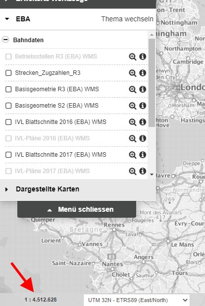
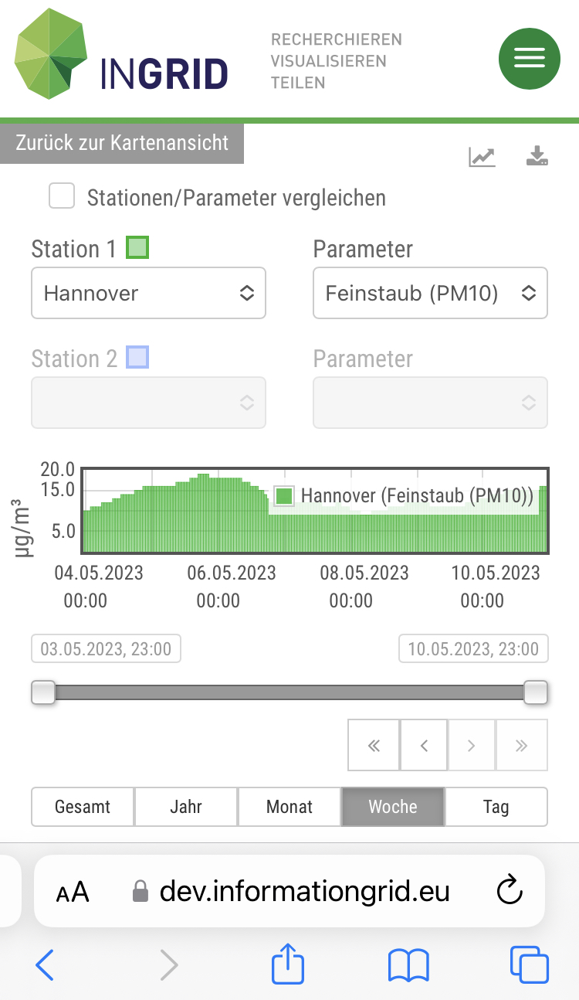
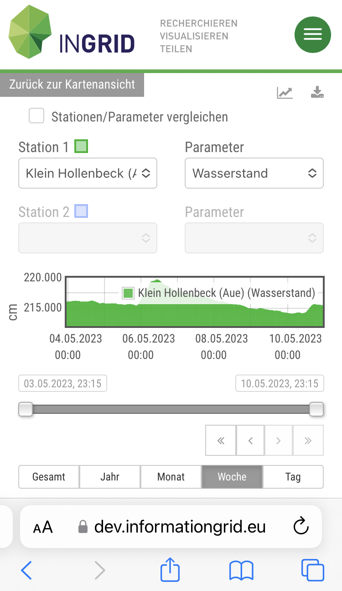
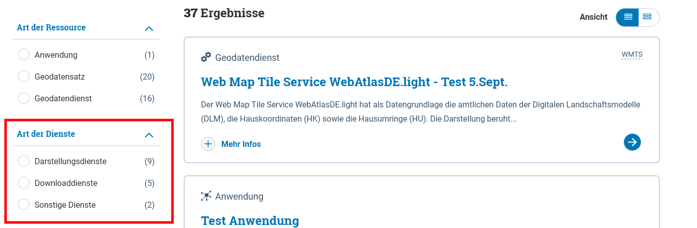
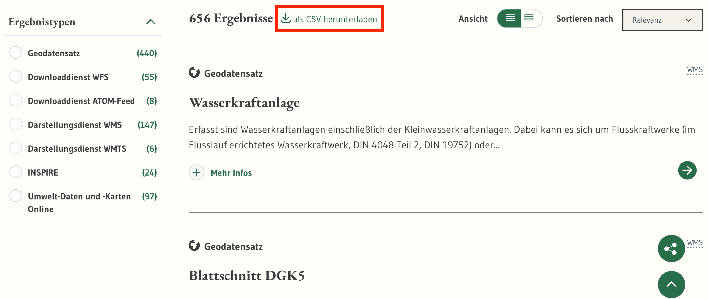
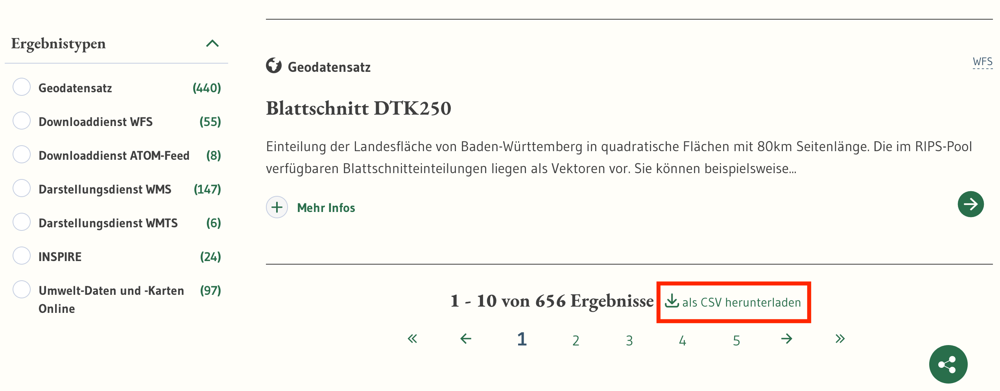

Diese Release Notes betreffen ausschließlich die Versionen 6.1.0. Release Notes älterer Versionen können hier eingesehen werden:
[6.0.x](/6.0.0/about/history.html), [5.14.x](/5.14.0/about/history.html), [5.13.x](/5.13.0/about/history.html), [5.12.x](/5.12.0/about/history.html), [5.11.x](/5.11.0/about/history.html), [5.10.x](/5.10.0/about/history.html), [5.9.x](/5.9.0/about/history.html), [5.8.x](/5.8.0/about/history.html), [5.7.x](/5.7.0/about/history.html), [5.6.x](/5.6.0/about/history.html), [5.5.x](/5.5.0/about/history.html), [5.4.x](/5.4.0/about/history.html), [5.3.x](/5.3.0/about/history.html), [5.2.x](/5.2.0/about/history.html), [5.1.x](/5.1.0/about/history.html), [5.0.x](/5.0.0/about/history.html)

## Version 6.1.1

Release 10.05.2023

### Wichtige Änderungen

#### Karten: Statt der Maßstabslinie mit der Längen-Angabe kann jetzt auch die Maßstabszahl angezeigt werden

In der Admin-Oberfläche des Mapclients gibt es folgende neue Einstellung:  
Einstellungen -> Karte -> Zeige die Maßstabszahl der Karte an  
Ist die Einstellung aktiv, so wird die Maßstabszahl angezeigt, ansonsten die Maßstabslinie. Per default ist die Einstellung deaktiviert.

<figcaption class="figcaption">Karten: Maßstabszahl statt Maßstabslinie - Admin-Oberfläche Mapclient</figcaption>

<figcaption class="figcaption">Karten: Maßstabszahl statt Maßstabslinie - Ansicht Enduser</figcaption>

### Liste der Änderungen

- [Feature] MAPCLIENT: KM-Angabe durch Maßstab ersetzen ([REDMINE-5083](https://redmine.informationgrid.eu/issues/5083))
- [Bug] Fehler beim Indizieren von Adressen bei eingeschränkten Diensten ([REDMINE-5089](https://redmine.informationgrid.eu/issues/5089))

Profil HMDK

- [Feature] Aktivierung des API Menübereichs im HMDK-Profil ([REDMINE-5056](https://redmine.informationgrid.eu/issues/5056))
- [Feature] Linkanpassung bei "Kartenansicht öffnen" ([REDMINE-4680](https://redmine.informationgrid.eu/issues/4680))
- [Bug] Korrektur der ISO für Linkanpassung bei "Kartenansicht öffnen" ([REDMINE-5088](https://redmine.informationgrid.eu/issues/5088))

Profil LUBW

- [Feature] PORTAL: Hilfeseite überarbeiten ([REDMINE-5005](https://redmine.informationgrid.eu/issues/5005))
- [Bug] PORTAL: Kartenansicht bei WFS-Diensten entfernen ([REDMINE-5051](https://redmine.informationgrid.eu/issues/5051))
- [Bug] Dienste-URLs werden nicht korrekt in die Kartenansicht importiert ([REDMINE-5042](https://redmine.informationgrid.eu/issues/5042))

### Komponenten

- INTERFACE-CSW ([download](https://distributions.informationgrid.eu/ingrid-interface-csw/6.1.1/))
- IPLUG-IGE ([download](https://distributions.informationgrid.eu/ingrid-iplug-ige/6.1.1/))
- PORTAL ([download](https://distributions.informationgrid.eu/ingrid-portal/6.1.1/))

## Version 6.1.0.2

Release 03.05.2023

### Liste der Änderungen

Profil LUBW

- [Bug] PORTAL: Kartenansicht bei WFS-Diensten entfernen ([REDMINE-5051](https://redmine.informationgrid.eu/issues/5051))

### Komponenten

- PORTAL ([download](https://distributions.informationgrid.eu/ingrid-portal/6.1.0.2/))

## Version 6.1.0.1

Release 28.04.2023

### Liste der Änderungen

Profil LUBW

- [Feature] PORTAL: Hilfeseite überarbeiten ([REDMINE-5005](https://redmine.informationgrid.eu/issues/5005))
- [Bug] Dienste-URLs werden nicht korrekt in die Kartenansicht importiert ([REDMINE-5042](https://redmine.informationgrid.eu/issues/5042))

### Komponenten

- PORTAL ([download](https://distributions.informationgrid.eu/ingrid-portal/6.1.0.1/))

## Version 6.1.0

Release 19.04.2023

### Wichtige Änderungen

#### Portal: Neuer Bereich "API"

Für das Profil NUMIS wurde ein neuer Bereich "API" erstellt. Dort sollen die [Programmierschnittstellen](https://de.wikipedia.org/wiki/Programmierschnittstelle) des niedersächsischen Umweltportals dokumentiert werden.
Vorlage ist [bund.dev](https://bund.dev) ([REDMINE-4374](https://redmine.informationgrid.eu/issues/4374)).

<figcaption class="figcaption">Portal: Neuer Bereich "API" im Profil NUMIS - Ansicht Portal Enduser</figcaption>

<figcaption class="figcaption">Portal: Neuer Bereich "API" im Profil NUMIS - Ansicht Portal Inhalte administrieren</figcaption>

Auch für das allgemeine Profil wurde der neue Bereich "API" integriert ([REDMINE-4677](https://redmine.informationgrid.eu/issues/4677)).

#### Messdatenclient: Responsivität verbessert

Für den Messdatenclient wurde die Responsivität überarbeitet und verbessert. Dadurch wird die mobile Ansicht optimiert ([REDMINE-4109](https://redmine.informationgrid.eu/issues/4109)).

<figcaption class="figcaption">Messdatenclient: Responsivität verbessert - Feinstaub</figcaption>

<figcaption class="figcaption">Messdatenclient: Responsivität verbessert - Wasserstand</figcaption>

#### Portal: Neue Facette "Zeitbezug" in der Suche

Für das Profil BAW MIS wurde in der Suche eine neue Facette für die Filterung nach Zeitbezug der Daten/Ressource hinzugefügt ([REDMINE-4185](https://redmine.informationgrid.eu/issues/4185)).

<figcaption class="figcaption">Portal: Neue Facette Zeitbezug in der Suche</figcaption>

#### Portal: Neue Facette "Art der Dienste" in der Suche

Für die Profile BKG-MIS und AdV-MIS wurde in der Suche eine neue Facette für eine Differenzierung der Dienste hinzugefügt ([REDMINE-3278](https://redmine.informationgrid.eu/issues/3278)).

<figcaption class="figcaption">Portal: Neue Facette Art der Dienste in der Suche bei BKG-MIS</figcaption>

#### Portal: Neue Option für den Download aller Suchergebnisse als CSV-Datei

Für das Profil LUBW wurde eine neue Downloadoption hinzugefügt, mit der man die Ergebnisliste der Suche als CSV-Datei herunterladen kann ([REDMINE-4377](https://redmine.informationgrid.eu/issues/4377)).

<figcaption class="figcaption">Portal: Neue Option für den Download aller Suchergebnisse als CSV-Datei - oben</figcaption>

<figcaption class="figcaption">Portal: Neue Option für den Download aller Suchergebnisse als CSV-Datei - unten</figcaption>

#### Kartenclient: Wenn nur ein Layer im WMS existiert, dann wird dieser direkt angezeigt

Für das Profil LUBW wurde der Kartenclient so angepasst, dass alle WMS, die nur einen Layer beinhalten, per default direkt importiert und angezeigt werden.
Dafür gibt es eine neue Einstellung in der Admin-Oberfläche des Kartenclients.

<figcaption class="figcaption">Kartenclient: Wenn nur ein Layer im WMS existiert, dann wird dieser direkt angezeigt</figcaption>

### Liste der Änderungen

- [Feature] DCAT-AP Schnittstelle Fehlermeldung beim Check durch GODATA ([REDMINE-5017](https://redmine.informationgrid.eu/issues/5017))
- [Feature] Erweiterung des RDF Exports der Komponente interface-search  ([REDMINE-4960](https://redmine.informationgrid.eu/issues/4960))
- [Feature] Aktualisierung des Regionalsschlüssels im SNS iPlug ([REDMINE-4864](https://redmine.informationgrid.eu/issues/4864))
- [Feature] CORS und CSRF im iBus konfigurierbar machen ([REDMINE-4714](https://redmine.informationgrid.eu/issues/4714))
- [Feature] Zentrale Codelist anpassen ([REDMINE-4699](https://redmine.informationgrid.eu/issues/4699))
- [Feature] IGE: Korrektur Regionalschlüssel erfassen - Minimallösung ([REDMINE-4597](https://redmine.informationgrid.eu/issues/4597))
- [Feature] Portal: Änderung der Anzeige der Operationen in Dienst-MD - Minimallösung ([REDMINE-4570](https://redmine.informationgrid.eu/issues/4570))
- [Feature] Portal: Detailanzeige - Verhalten bei großer Anzahl von Schlagworten ([REDMINE-4503](https://redmine.informationgrid.eu/issues/4503))
- [Feature] Portal AdV- und BKG-MIS: Anordnung der Zeitangaben ändern ([REDMINE-4483](https://redmine.informationgrid.eu/issues/4483))
- [Feature] AdV-MIS: Kontakt des Vertriebs aus distributionInfo als "Vertrieb" ausgeben ([REDMINE-4449](https://redmine.informationgrid.eu/issues/4449))
- [Feature] Erstellung neuer Bereich "APIs" ([REDMINE-4374](https://redmine.informationgrid.eu/issues/4374))
- [Feature] Portal: Querverweise - Einschränkung auf WMS aufheben ([REDMINE-4334](https://redmine.informationgrid.eu/issues/4334))
- [Feature] Responsivität Messdaten Client ([REDMINE-4109](https://redmine.informationgrid.eu/issues/4109))
- [Bug] Kritische Sicherheitslücke: snakeyaml + weitere ([REDMINE-4972](https://redmine.informationgrid.eu/issues/4972))
- [Bug] Portal: Fehler bei der Anzeige von mehrsprachigen Feldern ([REDMINE-4958](https://redmine.informationgrid.eu/issues/4958))
- [Bug] Override-Konfiguration wird nicht eingelesen ([REDMINE-4939](https://redmine.informationgrid.eu/issues/4939))
- [Bug] IGE: GetCapabilites-Assistent - vollständig eingegebene URL's werden gekürzt ([REDMINE-4912](https://redmine.informationgrid.eu/issues/4912))
- [Bug] MAPCLIENT: Legenden-URL werden nicht mehr durch den Job aktualisiert ([REDMINE-4911](https://redmine.informationgrid.eu/issues/4911))
- [Bug] Nach Update Elasticsearch wird die Anzahl der Suchergebnisse beschränkt ([REDMINE-4744](https://redmine.informationgrid.eu/issues/4744))
- [Bug] Portal: XSS Schwachstelle im InGrid Portal ([REDMINE-4723](https://redmine.informationgrid.eu/issues/4723))
- [Bug] Titel des Downloads wird nicht verständlich produziert ([REDMINE-4719](https://redmine.informationgrid.eu/issues/4719))
- [Bug] Verwendung von Filtern führen zu Fehler bei Indizierung ([REDMINE-4705](https://redmine.informationgrid.eu/issues/4705))
- [Bug] Email versenden führt zu einem Fehler ([REDMINE-4704](https://redmine.informationgrid.eu/issues/4704))
- [Bug] Atom-Feed Client: Darstellung der mehrfachen Referenzsysteme bei Downloads ([REDMINE-4702](https://redmine.informationgrid.eu/issues/4702))
- [Bug] Atom-Feed Client Sachsen-Anhalt (#2400) ([REDMINE-4672](https://redmine.informationgrid.eu/issues/4672))
- [Bug] IGE: anderssprachige Eingaben - fehlerhafte Ausgabe im ISO-XML ([REDMINE-4670](https://redmine.informationgrid.eu/issues/4670))
- [Bug] MapClient: Ersetzen von atlas.wsv.bund.de ([REDMINE-4664](https://redmine.informationgrid.eu/issues/4664))
- [Bug] CodelistRepo - Nach Umbenennen List-ID bleibt die alte Liste erhalten. ([REDMINE-4631](https://redmine.informationgrid.eu/issues/4631))
- [Bug] Portal: Hyperlink des GetCapabilities-Aufruf nicht korrekt ([REDMINE-4346](https://redmine.informationgrid.eu/issues/4346))

Profil BAW Datenrepository

- [Bug] Fix für XSS-Schwachstelle kann nicht deployed werden ([REDMINE-4734](https://redmine.informationgrid.eu/issues/4734))

Profil BAW MIS

- [Feature] IGE: Sichtbarkeit von Feldern anpasen ([REDMINE-4537](https://redmine.informationgrid.eu/issues/4537))
- [Feature] Portal: Facette für den Zeitbezug für die Ressource implmentieren ([REDMINE-4185](https://redmine.informationgrid.eu/issues/4185))
- [Bug] CSW-Schnittstelle: CSW-T Transaktionen funktionen nicht richtig ([REDMINE-4917](https://redmine.informationgrid.eu/issues/4917))
- [Bug] IGE iPlug: Implementierung vom Ticket #4026 nicht im 6.0.1-Release vorhanden ([REDMINE-4891](https://redmine.informationgrid.eu/issues/4891))
- [Bug] Portal: Kartenansicht vom Raumbezug wird nicht angezeigt ([REDMINE-4738](https://redmine.informationgrid.eu/issues/4738))

Profil BKG

- [Feature] Portal: im AdV-MIS Label "Fachliche Grundlage" umbenennen ([REDMINE-4237](https://redmine.informationgrid.eu/issues/4237))
- [Feature] Codelist-Repo: Codeliste 10003 und 10004 editieren ([REDMINE-4201](https://redmine.informationgrid.eu/issues/4201))
- [Feature] Portal: Facette "Diensttyp" im BKG- und AdV-MIS hinzufügen ([REDMINE-3278](https://redmine.informationgrid.eu/issues/3278))

Profil HMDK

- [Feature] Aktivierung des API Menübereiches im allgemeinen Profil ([REDMINE-4677](https://redmine.informationgrid.eu/issues/4677))

Profil LUBW

- [Feature] PORTAL: "Informationsanbieter" entfernen/deaktivieren ([REDMINE-4962](https://redmine.informationgrid.eu/issues/4962))
- [Feature] PORTAL: Zeilenumbruch bei Adressen in der "Themenübersicht" ([REDMINE-4961](https://redmine.informationgrid.eu/issues/4961))
- [Feature] Statistik über Seitenaufrufe ([REDMINE-4706](https://redmine.informationgrid.eu/issues/4706))
- [Feature] Portal - Sortierung nach Relevanz/Aktualität ([REDMINE-4581](https://redmine.informationgrid.eu/issues/4581))
- [Feature] "Portfolio" - Rechercheliste abspeichern / exportieren können ([REDMINE-4377](https://redmine.informationgrid.eu/issues/4377))
- [Feature] Direkte Anzeige, wenn nur ein Layer im WMS existiert ([REDMINE-4376](https://redmine.informationgrid.eu/issues/4376))
- [Bug] Fehlerhafte Mailadresse / Änderung beim Nutzer anlegen ([REDMINE-4688](https://redmine.informationgrid.eu/issues/4688))
- [Bug] Text-, Design- und Layout-Korrekturen am Portal ([REDMINE-4604](https://redmine.informationgrid.eu/issues/4604))

Profil MetaVer

- [Bug] Fehler "Freie Adressen" unter METAVER / Kataloge ([REDMINE-4674](https://redmine.informationgrid.eu/issues/4674))

Profil NUMIS

- [Feature] Zeitbezug der Metadaten ([REDMINE-4902](https://redmine.informationgrid.eu/issues/4902))
- [Bug] Kartenanwendung lädt nicht im NUMIS-Testsystem ([REDMINE-4869](https://redmine.informationgrid.eu/issues/4869))

Profil UPSH

- [Feature] Luftmesswerte in Karte darstellen ([REDMINE-4678](https://redmine.informationgrid.eu/issues/4678))
- [Feature] Workaround für parentIdentifier mit problematischem Format ([REDMINE-3786](https://redmine.informationgrid.eu/issues/3786))
- [Bug] MAPCLIENT: "Problem melden" in der Karte -> E-Mail-Adresse wird nicht weitergegeben ([REDMINE-4796](https://redmine.informationgrid.eu/issues/4796))

Profil UVP

- [Bug] Fehlerhafter Raumbezug in Verfahren ([REDMINE-4965](https://redmine.informationgrid.eu/issues/4965))
- [Bug] Verlinkung von Menü -> UVP Katalog ist veraltet nach Migration auf IGE-NG ([REDMINE-4747](https://redmine.informationgrid.eu/issues/4747))

### Komponenten

- CODELIST-REPOSITORY ([download](https://distributions.informationgrid.eu/ingrid-codelist-repository/6.1.0/))
- IBUS ([download](https://distributions.informationgrid.eu/ingrid-ibus/6.1.0/))
- INTERFACE-CSW ([download](https://distributions.informationgrid.eu/ingrid-interface-csw/6.1.0/))
- INTERFACE-SEARCH ([download](https://distributions.informationgrid.eu/ingrid-interface-search/6.1.0/))
- IPLUG-BLP ([download](https://distributions.informationgrid.eu/ingrid-iplug-blp/6.1.0/))
- IPLUG-CSW-DSC ([download](https://distributions.informationgrid.eu/ingrid-iplug-csw-dsc/6.1.0/))
- IPLUG-DSC ([download](https://distributions.informationgrid.eu/ingrid-iplug-dsc/6.1.0/))
- IPLUG-EXCEL ([download](https://distributions.informationgrid.eu/ingrid-iplug-excel/6.1.0/))
- IPLUG-IGE ([download](https://distributions.informationgrid.eu/ingrid-iplug-ige/6.1.0/))
- IPLUG-OPENSEARCH ([download](https://distributions.informationgrid.eu/ingrid-iplug-opensearch/6.1.0/))
- IPLUG-SE ([download](https://distributions.informationgrid.eu/ingrid-iplug-se/6.1.0/))
- IPLUG-SNS ([download](https://distributions.informationgrid.eu/ingrid-iplug-sns/6.1.0/))
- IPLUG-WFS-DSC ([download](https://distributions.informationgrid.eu/ingrid-iplug-wfs-dsc/6.1.0/))
- IPLUG-XML ([download](https://distributions.informationgrid.eu/ingrid-iplug-xml/6.1.0/))
- PORTAL ([download](https://distributions.informationgrid.eu/ingrid-portal/6.1.0/))
