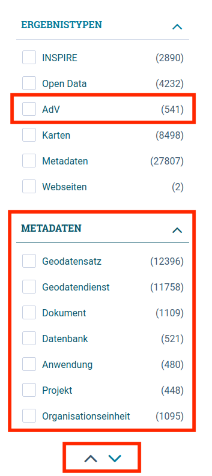

Diese Release Notes betreffen ausschließlich die Versionen 6.2.0. Release Notes älterer Versionen können hier eingesehen werden:
[6.1.x](/6.1.0/about/history.html), [6.0.x](/6.0.0/about/history.html), [5.14.x](/5.14.0/about/history.html), [5.13.x](/5.13.0/about/history.html), [5.12.x](/5.12.0/about/history.html), [5.11.x](/5.11.0/about/history.html), [5.10.x](/5.10.0/about/history.html), [5.9.x](/5.9.0/about/history.html), [5.8.x](/5.8.0/about/history.html), [5.7.x](/5.7.0/about/history.html), [5.6.x](/5.6.0/about/history.html), [5.5.x](/5.5.0/about/history.html), [5.4.x](/5.4.0/about/history.html), [5.3.x](/5.3.0/about/history.html), [5.2.x](/5.2.0/about/history.html), [5.1.x](/5.1.0/about/history.html), [5.0.x](/5.0.0/about/history.html)

## Version 6.2.0

Release 11.07.2023

### Wichtige Änderungen

#### Portal: Neue Facetten wurden hinzugefügt im Profil MetaVer, jetzt Mehrfachauswahl möglich

Die Facetten wurden umstrukturiert. Als Facette auf der obersten Ebene wurde "Metadaten" eingeführt. Unterhalb der Facette "Metadaten" werden die einzelnen Objektklassen gelistet.
Unterhalb der bestehenden Facette "Ergebnistypen" wurde eine neue Facette "AdV" eingefügt.
Jetzt ist auch eine Mehrfachauswahl möglich.
([REDMINE-5043](https://redmine.informationgrid.eu/issues/5043))

<figcaption class="figcaption">Portal: Neue Facetten wurden hinzugefügt im Profil MetaVer</figcaption>

#### Portal: Neuer Bereich "API" im Profil HMDK

Für das Profil HMDK wurde ein neuer Bereich "API" erstellt. Dort sollen die [Programmierschnittstellen](https://de.wikipedia.org/wiki/Programmierschnittstelle) des Hamburger Metadatenkatalogs dokumentiert werden.
Vorlage ist [bund.dev](https://bund.dev) ([REDMINE-5056](https://redmine.informationgrid.eu/issues/5056)).

<figcaption class="figcaption">Portal: Neuer Bereich "API" im Profil HMDK - Ansicht Portal Enduser</figcaption>

<figcaption class="figcaption">Portal: Neuer Bereich "API" im Profil HMDK - Ansicht Portal Inhalte administrieren</figcaption>

#### Portal: Neues Inhaltselement für zweiten Hinweistext eingefügt im Profil LUBW

Im Portal wurde ein neues Inhaltselement `ingrid.teaser.inform.2` eingefügt. Dadurch kann ein zweiter Hinweistext erstellt werden, der direkt unterhalb der Kategorien angezeigt wird.
([REDMINE-5142](https://redmine.informationgrid.eu/issues/5142))

<figcaption class="figcaption">Portal: Neues Inhaltselement für zweiten Hinweistext im Profil LUBW - Id</figcaption>

<figcaption class="figcaption">Portal: Neues Inhaltselement für zweiten Hinweistext im Profil LUBW - Feld</figcaption>

<figcaption class="figcaption">Portal: Neues Inhaltselement für zweiten Hinweistext im Profil LUBW - Auswahl</figcaption>

<figcaption class="figcaption">Portal: Neues Inhaltselement für zweiten Hinweistext im Profil LUBW - Startseite</figcaption>

#### Suche: Schalter "Nur aktuelle" für Facette "Verfahrenstypen" angepasst

Für die Facette "Verfahrenstypen" wurde der Schalter "Nur aktuelle" verbessert.
Bei aktivem Schalter werden jetzt bei allen Verfahrensarten auch die laufenden Verfahren angezeigt und nicht nur die Verfahren mit "Datum der Entscheidung jünger als 1 Jahr".
([REDMINE-5190](https://redmine.informationgrid.eu/issues/5190))

<figcaption class="figcaption">Suche: Schalter "Nur aktuelle" für Facette "Verfahrenstypen" angepasst</figcaption>

#### Portal: "Kartenansicht öffnen" verweist jetzt auf das Geoportal Hamburg

Für Geodatensätze und Geodatendienste wird bei Klick auf "Kartenansicht öffnen" nicht mehr die interne Kartenkomponente geöffnet, sondern in einem neuen Fenster die externe URL geoportal-hamburg.de mit der UUID des Datensatzes.
Beispiel nach Klick auf "Kartenansicht öffnen" für ["Schulstammdaten und Schülerzahlen der Hamburger Schulen"](https://geoportal-hamburg.de/geo-online/?mdid=D3DDBBA3-7329-475C-BB07-14D539ED6B1E)
([REDMINE-4680](https://redmine.informationgrid.eu/issues/4680))

<figcaption class="figcaption">Portal: "Kartenansicht öffnen" verweist jetzt auf das Geoportal Hamburg</figcaption>

#### Karten: Statt der Maßstabslinie mit der Längen-Angabe kann jetzt auch die Maßstabszahl angezeigt werden

In der Admin-Oberfläche des Mapclients gibt es folgende neue Einstellung:  
Einstellungen -> Karte -> Zeige die Maßstabszahl der Karte an  
Ist die Einstellung aktiv, so wird die Maßstabszahl angezeigt, ansonsten die Maßstabslinie. Per default ist die Einstellung deaktiviert.
([REDMINE-5083](https://redmine.informationgrid.eu/issues/5083))

<figcaption class="figcaption">Karten: Maßstabszahl statt Maßstabslinie - Admin-Oberfläche Mapclient</figcaption>

<figcaption class="figcaption">Karten: Maßstabszahl statt Maßstabslinie - Ansicht Enduser</figcaption>

#### Portal: Neuer Verweis auf ARS-Tool in Hilfetext im Profil MetaVer

Eine interaktive Suche nach amtlichen Regionalschlüsseln ermöglicht das [ARS-Tool](
https://opengovtech.de/ars).
Der Link wurde in den betreffenen Hilfetext eingefügt.
([REDMINE-5045](https://redmine.informationgrid.eu/issues/5045))

<figcaption class="figcaption">Portal: Neuer Verweis auf ARS-Tool in Hilfetext im Profil MetaVer</figcaption>

#### System: Speichernutzung für die InGrid-Komponenten wurde verbessert

Die Speichernutzung für die InGrid-Komponenten wurde optimiert. Dafür wurden Konfigurationsparameter der Java Virtual Machine angepasst.
([REDMINE-5117](https://redmine.informationgrid.eu/issues/5117))

### Liste der Änderungen

- [Feature] Reduzierung Memory Verbrauch (Anpassung der Garbage Collection Settings in JAVA) ([REDMINE-5117](https://redmine.informationgrid.eu/issues/5117))
- [Feature] MAPCLIENT: KM-Angabe durch Maßstab ersetzen ([REDMINE-5083](https://redmine.informationgrid.eu/issues/5083))
- [Feature] Portal: Reihung der Angaben ändern ([REDMINE-4533](https://redmine.informationgrid.eu/issues/4533))
- [Bug] Datenbezüge Adresse: Diskrepanz Anzahl in IGE und Portal ([REDMINE-5305](https://redmine.informationgrid.eu/issues/5305))
- [Bug] MAPCLIENT: Probleme BWaStrLocator Anfrage im GeoViewer ([REDMINE-5255](https://redmine.informationgrid.eu/issues/5255))
- [Bug] Korrektur der GetCapabilities-URL ([REDMINE-5204](https://redmine.informationgrid.eu/issues/5204))
- [Bug] Doppelung von Adresse in Portal und ISO ([REDMINE-5121](https://redmine.informationgrid.eu/issues/5121))
- [Bug] Fehler beim Indizieren von Adressen bei eingeschränkten Diensten ([REDMINE-5089](https://redmine.informationgrid.eu/issues/5089))
- [Bug] IGE: Hilfetext für Erstellung von WKTs korrigieren  ([REDMINE-4899](https://redmine.informationgrid.eu/issues/4899))
- [Bug] URL Überprüfung schlägt bei Vorschaugrafiken fehl ([REDMINE-4807](https://redmine.informationgrid.eu/issues/4807))
- [Bug] Die Passwortstärke lässt sich nicht (wie dokumentiert) verstellen ([REDMINE-4690](https://redmine.informationgrid.eu/issues/4690))
- [Bug] Portal Detaildarstellung, Umbenennung "Zeitbezug der Metadaten" ([REDMINE-4355](https://redmine.informationgrid.eu/issues/4355))

Profil BAW MIS

- [Feature]  Anpassung des Importverlaufs für Adressen ([REDMINE-5092](https://redmine.informationgrid.eu/issues/5092))
- [Feature] IGE: UUID für neue Kontakte selbst festlegen ([REDMINE-3725](https://redmine.informationgrid.eu/issues/3725))
- [Bug] ISO-XML Ausgabe im Datenfinder und Datenrepository nicht valide ([REDMINE-5177](https://redmine.informationgrid.eu/issues/5177))
- [Bug] Portal: LFS-Links werden nicht richtig angezeigt ([REDMINE-4263](https://redmine.informationgrid.eu/issues/4263))

Profil BKG

- [Feature] Portal: Anzeige der räumlichen Ausdehnung ändern ([REDMINE-4985](https://redmine.informationgrid.eu/issues/4985))
- [Bug] Feststellungen im Update AdV-MIS auf 6.1.1, Portal: fehlende Ausgabe "Zeitbezug der Daten" ([REDMINE-5320](https://redmine.informationgrid.eu/issues/5320))
- [Bug] Feststellungen im Update BKG-MIS auf 6.1.1, speziell fehlende MD ([REDMINE-5222](https://redmine.informationgrid.eu/issues/5222))

Profil HMDK

- [Feature] Aktivierung des API Menübereichs im HMDK-Profil ([REDMINE-5056](https://redmine.informationgrid.eu/issues/5056))
- [Feature] HMDK Profil: Linkanpassung bei "Kartenansicht öffnen" ([REDMINE-4680](https://redmine.informationgrid.eu/issues/4680))
- [Bug] Fehler beim CSW-Import ([REDMINE-5314](https://redmine.informationgrid.eu/issues/5314))
- [Bug] HMDK Profil: Korrektur der ISO für Linkanpassung bei "Kartenansicht öffnen" ([REDMINE-5088](https://redmine.informationgrid.eu/issues/5088))

Profil KRZN

- [Feature] Einbinden der WKT-Darstellung ([REDMINE-5131](https://redmine.informationgrid.eu/issues/5131))

Profil LUBW

- [Feature] PORTAL: Zweiter editierbarer "Textbaustein" oder feste Ergänzung eines Textes ([REDMINE-5142](https://redmine.informationgrid.eu/issues/5142))
- [Feature] PORTAL: Hilfeseite überarbeiten ([REDMINE-5005](https://redmine.informationgrid.eu/issues/5005))
- [Feature] Weiterentwicklung Portfolio ([REDMINE-4997](https://redmine.informationgrid.eu/issues/4997))
- [Bug] environmentDescription fehlt im ISO ([REDMINE-5188](https://redmine.informationgrid.eu/issues/5188))
- [Bug] Mouseover beim Vorschaubild umbenennen ([REDMINE-5090](https://redmine.informationgrid.eu/issues/5090))
- [Bug] PORTAL: Kartenansicht bei WFS-Diensten entfernen ([REDMINE-5051](https://redmine.informationgrid.eu/issues/5051))
- [Bug] Dienste-URLs werden nicht korrekt in die Kartenansicht importiert ([REDMINE-5042](https://redmine.informationgrid.eu/issues/5042))

Profil UPSH

- [Feature] Neue Verlinkung im Menü auf TEST ([REDMINE-5262](https://redmine.informationgrid.eu/issues/5262))
- [Bug] MAPCLIENT: Luftbilder werden nicht angezeigt ([REDMINE-5216](https://redmine.informationgrid.eu/issues/5216))

Profil MetaVer

- [Feature] ARS-Tool in die Hilfe als Link einfügen ([REDMINE-5045](https://redmine.informationgrid.eu/issues/5045))
- [Feature] Facettierung verbessern, Mehrfachauswahl ermöglichen ([REDMINE-5043](https://redmine.informationgrid.eu/issues/5043))

Profil NUMIS

- [Feature] NUMIS-/UVP-Portal: Erkennung von Brute-Force-Attacken im Anmeldeprozess ([REDMINE-1343](https://redmine.informationgrid.eu/issues/1343))

Profil UVP

- [Feature] Umstellung für Ansicht "nur aktuelle" ([REDMINE-5190](https://redmine.informationgrid.eu/issues/5190))
- [Bug] Suchergebnisseite fügt KartenClientparameter hinzu. History wird verfälscht ([REDMINE-5062](https://redmine.informationgrid.eu/issues/5062))
- [Bug] URL aus Adresse im IGE-NG leitet im Portal nicht korrekt weiter ([REDMINE-4782](https://redmine.informationgrid.eu/issues/4782))

### Komponenten

- CODELIST-REPOSITORY ([download](https://distributions.informationgrid.eu/ingrid-codelist-repository/6.2.0/))
- IBUS ([download](https://distributions.informationgrid.eu/ingrid-ibus/6.2.0/))
- INTERFACE-CSW ([download](https://distributions.informationgrid.eu/ingrid-interface-csw/6.2.0/))
- INTERFACE-SEARCH ([download](https://distributions.informationgrid.eu/ingrid-interface-search/6.2.0/))
- IPLUG-BLP ([download](https://distributions.informationgrid.eu/ingrid-iplug-blp/6.2.0/))
- IPLUG-CSW-DSC ([download](https://distributions.informationgrid.eu/ingrid-iplug-csw-dsc/6.2.0/))
- IPLUG-DSC ([download](https://distributions.informationgrid.eu/ingrid-iplug-dsc/6.2.0/))
- IPLUG-EXCEL ([download](https://distributions.informationgrid.eu/ingrid-iplug-excel/6.2.0/))
- IPLUG-IGE ([download](https://distributions.informationgrid.eu/ingrid-iplug-ige/6.2.0/))
- IPLUG-OPENSEARCH ([download](https://distributions.informationgrid.eu/ingrid-iplug-opensearch/6.2.0/))
- IPLUG-SE ([download](https://distributions.informationgrid.eu/ingrid-iplug-se/6.2.0/))
- IPLUG-SNS ([download](https://distributions.informationgrid.eu/ingrid-iplug-sns/6.2.0/))
- IPLUG-WFS-DSC ([download](https://distributions.informationgrid.eu/ingrid-iplug-wfs-dsc/6.2.0/))
- IPLUG-XML ([download](https://distributions.informationgrid.eu/ingrid-iplug-xml/6.2.0/))
- PORTAL ([download](https://distributions.informationgrid.eu/ingrid-portal/6.2.0/))
