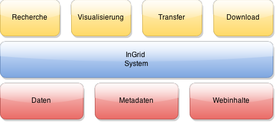

## InGrid

InGrid ist eine modular aufgebaute Software, die vielseitig eingesetzt werden kann: Kernkomponenten sind ein Web-Portal, eine Suchmaschine, ein Metadatenkatalog mit Profilen für die Erfassung INSPRE-konformer Metadaten, offener Daten und UVP-Vorhaben, eine Visualisierungskomponente für OGC Web Map Services, ein Client zur Visualisierung von Zeitreihen sowie diverse An- und Abfrageschnittstellen, die für die Recherche der angeschlossenen Komponenten, aber auch für die Weiterleitung der Ergebnisse an externe Systeme zuständig sind.

InGrid wurde u.a. entlang der Vorgaben und Empfehlungen der [Geodateninfrastruktur Deutschland](http://www.geoportal.de/) (GDI-DE) entwickelt und eignet sich daher auch zum Aufbau INSPIRE- und GDI-DE-konformer Geodateninfrastrukturen.

<figcaption class="figcaption">Schematische Darstellung eines InGrid-Systems</figcaption>

 

Der Name "InGrid" entstand aus dem englischen "information grid" und trägt dem modularen und verteilten Ansatz der Software Rechnung: Die Komponenten bilden eine Art "Informationsnetz" in dem verschiedene Datenquellen über Schnittstellen angebunden werden. Die Datenquellen werden über einen verteilten Index integriert, der sowohl über das Portal, als auch über verschiedene Schnittstellen verarbeitet werden kann. Die einzelnen Bausteine können physikalisch über beliebig viele Standorte verteilt werden.

Die wichtigsten Komponenten von InGrid sind:

- eine nutzerfreundliche, personalisierbare und flexibel konfigurierbare Portaloberfläche,
- der ISO19115/19119-, INSPIRE- (Richtlinie 2007/2/EG) und GDI-DE-konforme, web-basierte Datenkatalog "InGridEditor",
- Ein Katalogsystem zur zentralen Dokumentation von Umweltverträglichkeitsprüfungen gemäß der Anforderungen der UVP-Änderungsrichtlinie 2014/52/EU vom 16.04.2014
- eine auf [OpenLayers](http://openlayers.org/) basierende Visualisierungskomponente für OGC-konforme Kartendienste ([OGC WMS](http://www.opengeospatial.org/standards/wms)),
- Diverse An- und Abfrageschnittstellen zur Recherche in angeschlossenen Systemen bzw. für den Transfer von Informationen, z.B. eine OGC-, INSPIRE- und GDI-DE-konforme Katalogschnittstelle ([OGC CSW](http://www.opengeospatial.org/standards/cat)), eine OGC konforme [OGC-API Records](https://ogcapi.ogc.org/records/) Schnittstelle sowie eine [OpenSearch](http://www.opensearch.org/Home)-Schnittstelle. Die CSW-Schnittstellen erlaubt es zum Beispiel, Metadaten aus einem InGridCatalog an Portale wie das [Geoportal Deutschland](http://www.geoportal.de/DE/Geoportal), das [GovData-Datenportal für Deutschland](https://www.govdata.de/) oder das [INSPIRE-Geoportal](http://inspire-geoportal.ec.europa.eu/) abzugeben.

Der Sourcecode wird über [GITHUB](https://github.com/informationgrid) verwaltet.

## Das Projekt

Die InGrid-Softwarekomponenten werden im Rahmen des Projekts "InGrid - Pflege und Weiterentwicklung der InGrid-Softwarekomponenten zum Betrieb von Internetportalen und Metadatenkatalogen" (VKoopUIS-Projekt Nr. 50) unter dem Dach der "Vereinbarung über die Kooperation bei Konzeptionen und Entwicklungen von Software für Umweltinformationssysteme" (VKoopUIS) gepflegt und weiter entwickelt.

Aus der öffentlichen Verwaltung sind folgende Partner beteiligt:

- Niedersachsen: Niedersächsisches Ministerium für Umwelt, Energie und Klimaschutz (Federführung)
- Bund: Bundesanstalt für Wasserbau (BAW)
- Bund: Informationstechnikzentrum Bund (ITZBund) im Auftrag der Wasser- und
Schifffahrtsverwaltung des Bundes (WSV) im Geschäftsbereich des
Bundesministeriums für Verkehr und digitale Infrastruktur (BMDV)
- Baden-Württemberg: Ministerium für Umwelt, Klima und Energiewirtschaft Baden-Württemberg
- Bayern: Bayerisches Staatsministerium für Umwelt und Verbraucherschutz
- Berlin: Berliner Senatsverwaltung für Mobilität, Verkehr, Klimaschutz und Umwelt
- Brandenburg: Ministerium für Landwirtschaft, Umwelt und Klimaschutz (MLUK) des Landes Brandenburg
- Bremen: Landesamt GeoInformation Bremen
- Hamburg: Behörde für Umwelt, Klima, Energie und Agrarwirtschaft (BUKEA)
- Hessen: Hessisches Ministerium für Landwirtschaft und Umwelt, Weinbau, Forsten, Jagd und Heimat
- Mecklenburg-Vorpommern: Landesamt für Umwelt, Naturschutz und Geologie Mecklenburg-Vorpommern (LUNG)
- Nordrhein-Westfalen: Ministerium für Umwelt, Naturschutz und Verkehr des Landes Nordrhein-Westfalen
- Rheinland-Pfalz: Ministerium für Klimaschutz, Umwelt, Energie und Mobilität des Landes Rheinland-Pfalz
- Saarland: Ministerium für Umwelt, Klima, Mobilität, Agrar und Verbraucherschutz
- Sachsen: Sächsisches Landesamt für Umwelt, Landwirtschaft und Geologie
- Sachsen-Anhalt: Ministerium für Wissenschaft, Energie, Klimaschutz und Umwelt des Landes Sachsen-Anhalt
- Schleswig-Holstein: Ministerium für Energiewende, Klimaschutz, Umwelt und Natur des Landes Schleswig-Holstein
- Thüringen: Thüringer Ministerium für Umwelt, Energie und Naturschutz (TMUEN)
- Bund: Bundesamt für Kartographie und Geodäsie (BKG) (Assoziiert)
- Bund: Bundesanstalt für Straßenwesen (BASt) (Assoziiert)

Die Firmen [wemove digital solutions GmbH](https://www.wemove.com/) und [IT-Service Torsten Wolff ](https://it-service-magdeburg.de/) betreuen als Partner aus der Wirtschaft die technische Projekt-Infrastruktur.

Im Rahmen des Projektes wird die Software InGrid gepflegt und weiter entwickelt.

InGrid wurde zwischen 2005 und 2014 im Rahmen der Bund/Länder-Verwaltungsvereinbarung UDK/GEIN ("PortalU") entwickelt um die Verpflichtungen, die sich für die öffentliche Verwaltung aus den relevanten europäischen und nationalen Gesetzgebungen (z.B. [Umweltinformtionsrichtlinie](http://www.bmub.bund.de/service/publikationen/downloads/details/artikel/umweltinformationsrichtlinie-des-europaeischen-parlaments-und-des-rates-vom-28012003-richtlinie-20034eg/)/[Umweltinformationsgesetze](http://de.wikipedia.org/wiki/Umweltinformationsgesetz), [INSPIRE-Richtlinie](http://inspire.ec.europa.eu/)/[Geodatenzugangsgesetze](http://de.wikipedia.org/wiki/Geodatenzugangsgesetz)) ergeben, zu erfüllen. Die Software wurde u.a. für den Betrieb des deutschen Umweltinformationsportals [PortalU](http://de.wikipedia.org/wiki/PortalU) (2006-2014) eingesetzt. Aktuell werden verschiedene Bundes- und Länderportale sowie zahlreiche Länder-Metadatenkataloge mit InGrid-Softwarekomponenten betrieben und vernetzt.

Die Bund/Länder-Verwaltungsvereinbarung UDK/GEIN ("PortalU") endete am 31.12.2014. Seit dem 01.01.2015 werden die InGrid-Software-Komponenten im Rahmen des oben genannten VKoopUIS-Projekts als Free/Open Source Software (F/OSS) unter der [European Union Public License](https://joinup.ec.europa.eu/software/page/eupl) (EUPL) weiter entwickelt.

Sollten Sie Fragen zum Projekt, Interesse an der Nutzung bestimmter InGrid-Komponenten oder an einer Projektmitarbeit haben, wenden Sie sich bitte per E-Mail an <vkoopuis@informationgrid.eu>.

