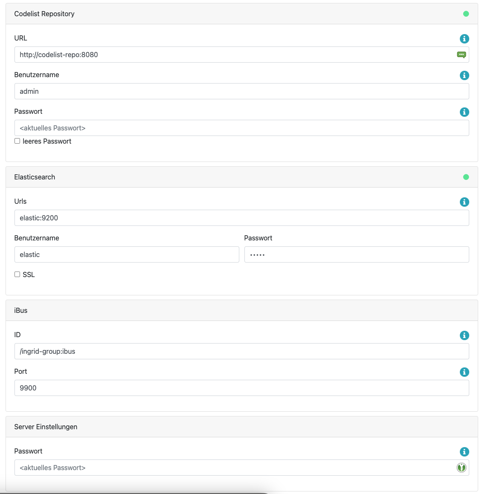

## Allgemeines

Der iBus (information bus) bildet in einem InGrid-System das zentrale Element. Er fungiert als Verteilungsstation zwischen Datenquellen und Suchanfragen. So nimmt der iBus eine Suchanfrage von der Portaloberfläche oder einer anderen übergeordneten Schnittstelle entgegen, bereitet die Anfrage auf und gibt an die angeschlossenen iPlugs weiter. Die Anfrageergebnisse der einzelnen iPlugs (Datenquellen) werden vom iBus eingesammelt und als Ergebnislisten an das anfragende System zurückgegeben.

Seit Version 4.4.0 wird zudem ein zentraler Index unterstützt. Hierbei sollen die iPlugs ihre Daten in einem Index hinterlegen, der vom iBus aus zugegriffen werden kann. Dies bringt viele Vorteile mit sich. So werden die Ergebnisse schneller zum Portal geschickt, die Suchergebnisse sind besser sortiert und Features wie Autocomplete sind damit möglich.


<figcaption class="figcaption">InGrid Komponente iBus</figcaption>


## Systemvoraussetzungen

* 128 MB RAM
* 80 MB Harddrive

* JAVA 1.8
* Cygwin (unter Windows)


## Installation

Download: [https://distributions.informationgrid.eu/ingrid-ibus/](https://distributions.informationgrid.eu/ingrid-ibus/)

Um die Installationsroutine zu starten, doppel-klicken Sie auf das Installationsprogramm oder geben Sie folgenden Befehl auf der Kommandozeile ein:

```sh
java -jar ingrid-ibus-VERSION-installer.jar
```

Der Installer ist sowohl per graphischer Oberfläche als auch Kommandozeileneingabe ausführbar. Bitte folgen Sie den Anweisungen des Installationsprogrammes. Das Installationsprogramm installiert den iBus im gewünschten Verzeichnis (default: `/opt/ingrid/ingrid-ibus`) und passt die Konfigurationsdatei `conf/application-default.properties` an.

Sie können nun den iBus mit

```sh
sh start.sh start
```

starten.

Der iBus besitzt eine Administrationsoberfläche über die die angeschlossenen iPlugs eingesehen und verwaltet werden können.


http://localhost:PORT


Anstelle von `localhost` können Sie auch die IP-Adresse des Computers eingeben. Nach einer neuen Installation wird man automatisch auf die Konfigurationsseite geleitet, wo man das Administrationspasswort eingeben muss. Nachdem dieses eingegeben worden ist, muss man sich erneut einloggen, um die volle Funktionalität zu nutzen.

## Aktualisierung

Hinweis: Auf die Version 4.4.0 kann nicht aktualisiert werden, da die Änderungen zu groß sind. Alle weiteren Versionen sind wiederum aktualisierbar.

Neues Release von [https://distributions.informationgrid.eu/ingrid-ibus/](https://distributions.informationgrid.eu/ingrid-ibus/) herunterladen.

iBus stoppen.

```sh
sh start.sh stop
```

Aktuelles Installationsverzeichnis sichern:

```sh
cp -r /opt/ingrid/ingrid-ibus <BACKUP-DIRECTORY>
```


Die Aktualisierung erfolgt über den Installer.

```sh
java -jar ingrid-ibus-NEW-VERSION-installer.jar
```

Während der Installation bitte "Update" auswählen und das vorhandene Installationsverzeichnis angeben.

iBus starten.

```sh
sh start.sh start
```

## Betrieb

```sh
start.sh [start|stop|restart|status]
```

Die LOG Ausgaben finden sich in der Datei `log.log`.


## Konfiguration

Die Systemkonfiguration befindet sich in der application.properties Datei im conf-Verzeichnis. Änderungen an der Konfiguration müssen in der Datei application-default.properties geschrieben werden. Die wichtigsten Einstellungen können über die Admin-Gui getätigt werden.

Die Parameter haben folgende Bedeutung:

| Parameter                           | Beschreibung |
|--------------------------------|---------------------------------------------------------|
| server.port                    | Der Port für die Adminoberfläche  |
| ibus.url                       | Eindeutige ID des InGrid iBus  |
| ibus.port                      | Port unter dem der iBus zu erreichen ist (Verbindungsaufnahme) |
| ibus.timeout                   | Timeout der Socketverbindungen in sec |
| ibus.maximumSize               | max. zulässige Größe einer Message in Bytes, die über den iBus versendet werden kann |
| ibus.threadCount               | Anzahl der Verbindungen (Threads), die der iBus gleichzeitig aufrecht erhalten kann |
| ibus.handleTimeout             | Timeout einer Message in sec (Wie lange wartet der iBus auf die Beantwortung einer Message.) |
| ibus.queueSize                 | Message Queue (Wie viele Nachrichten können in der Warteschlange des iBus enthalten sein.) |
| codelistrepo.url               | Die URL zum Codelist-Repository |
| codelistrepo.username          | Der Benutzername für das Codelist-Repository |
| codelistrepo.password          | Das Passwort für das Codelist-Repository |
| elastic.remoteHosts            | Die TCP-Adresse des Elasticsearch-Clusters (`localhost:9300`) |
| spring.security.user.name      | Der Login für die Administrationsoberfläche |
| spring.security.user.password  | Das Passwort für die Administrationsoberfläche |

### Angeschlossene iPlugs

Diese Seite listet alle mit diesem iBus verbundene iPlugs auf. Diese werden zusätzlich unterteilt in iPlugs, die den zentralen Index verwenden und solche, die keinen oder noch ihren eigenen Index verwaltet. Letzteres gilt für iPlugs < v5.0.0.


Die iPlugs SNS und Opensearch verwenden keinen Index und werden hier mit einem An-/Aus-Schalter angezeigt. Alle anderen iPlugs werden hier nur aufgelistet und es kann über das  Symbol direkt zur Administrations-GUI gesprungen werden.

### Index-Verwaltung

Hier werden die Indizes angezeigt, die von den iPlugs angelegt wurden. Jeder Index kann hier über  an- und abgeschaltet werden. 


Über das  Symbol kann man anhand der Farbe erkennen, ob das zum Index dazugehörige iPlug gerade angeschlossen ist. Ist ein iPlug verbunden, so lässt sich die Indexierung hier über das Menü anstoßen oder auch den Index zu löschen.

Weitere Informationen über einen Index erhält man indem man auf den Indextyp im unteren Bereich klickt. Dort kann man unter anderem sehen, wieviele Dokumente der Index beinhaltet, wann zuletzt aktualisiert wurde und wie das Mapping aussieht.

Unter der Sektion "Andere Indizes" kann man sich weitere Indizes auflisten lassen, die ebenfalls auf dem Elasticsearch Cluster angelegt worden sind. Der Index "ingrid_meta" ist hierbei ein besonderer Index, der für die Verwaltung der iPlug-Indizes verwendet wird.

### Such-Analyse

Hier werden alle aktivierten Indizes angefragt und deren Ergebnisse aufgelistet.


Klickt man auf einen Treffer, werden die wichtigsten Felder, wie auch das IDF, angezeigt. Außerdem wird das vollständig indexierte Dokument, wie es im Index abgelegt wurde angezeigt. Dies hilft bei der Fehlersuche.

Klickt man auf die `debug`-Checkbox, wird eine Zusammenfassung der Suche angezeigt. Diese beinhaltet, welche iPlugs direkt angefragt wurden, wieviele Ergebnisse gefunden wurden und wieviel Zeit dafür benötigt wurde.

### Einstellungen

In den Einstellungen können folgende Parameter konfiguriert werden:

* URL zum Codelist-Repository
  * ebenfalls der Benutzername und Passwort
* die URL zum Elasticsearch Cluster
* ID des iBusses
* Port des iBusses, auf dem sich die iPlugs verbinden können
* das Passwort für die Admin-GUI



Die Einstellungen für das Codelist-Repository und Elasticsearch haben außerdem eine Signalisierung, die anzeigt, ob eine Verbindung zu der externen Komponente besteht. Falls die Anzeige "Rot" ist, ist die Komponente entweder nicht gestartet oder der iBus hat eine falsche Konfiguration.

### Query Modifikation

Der iBus verfügt über eine Möglichkeit bestimmte Teile einer Anfrage zu ersetzen. Die Ersetzung erfolgt anhand eines Property Files unter `conf/querymodifier.properties`.


# add query modifiers here
# <term>|<field>=<ingrid query>
# spaces in key must be escaped by '\'
# this file will be checked for modification every 5 sec
#wasser\ kraft=wasser OR wasserkraft
wasser=wasser OR wasserkraft
title:erde=title:erde OR title:soil
Elbhochwasser=Elbhochwasser OR \"10 Jahre Elbehochwasser\" OR \"10 Jahre Elbe-Hochwasser\" OR \"Elbe-Hochwasser 2002\"


Das Property File wird alle 5 Sekunden auf Änderungen überprüft und ggf. neu geladen.

### Boosting pro iPlug

**Achtung**: Mit der Verwendung des zentralen Index hat diese Einstellung keinen Einfluss mehr.

Am iBus können über Einträge in der Datei `globalRanking.properties` spezielle Boost-Werte für einzelne iPlugs definiert werden. Diese werden auf **alle** Ergebnisse eines iPlugs angewendet. Damit ist es möglich, die Ergebnisse einzelner iPlugs zu betonen (Werte &gt; 1.0) oder zu dämpfen (Werte &lt; 1.0).

Bsp. `globalRanking.properties`:


# iPlug ID = value
# Push results ranking of iPlug up with values > 1.0
# Pull results ranking down with values 0.0 < value < 1.0
/ingrid-group\:iplug-se=0.9


Nach Änderungen muss der iBus neu gestartet werden.


## FAQ

### Wie kann ich ein Überschreiben der Datei `env.sh` bei einer Aktualisierung verhindern.

In der Datei env.sh können Systemvariablen komponenten-spezifisch angepasst werden (z.B. Proxy oder Heap Einstellungen). Um die Einstellungen nach einer Aktualisierung nicht zu verlieren, muss die Datei `env.sh` nach `user.env.sh` kopiert werden. Die Änderungen in `user.env.sh` werden nicht überschrieben.

### Der iBus soll auf einem Port unterhalb von 1024 betrieben werden.

Der iBus muss als user root gestartet werden. Dazu muss die Variable `INGRID_USER=root` als Umgebungsvariable gesetzt, oder der entsprechende Eintrag in der Datei `start.sh` angepasst werden.
