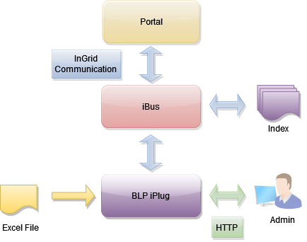
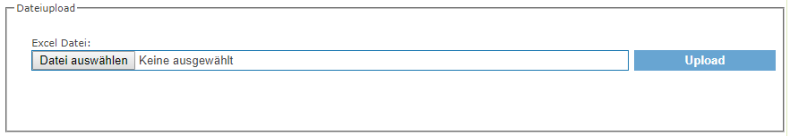

## Allgemeines

Das iPlug dient dem Indexieren von Bauleitplanungsdaten aus einer Excel-Datei.



<figcaption class="figcaption">InGrid Komponente iPlug BLP</figcaption>


## Systemvoraussetzungen

* 256 MB RAM
* 500 MB Harddrive

* JAVA 8
* Cygwin (unter Windows)


## Installation

Download: [https://distributions.informationgrid.eu/ingrid-iplug-blp/](https://distributions.informationgrid.eu/ingrid-iplug-blp/)

Um die Installationsroutine zu starten, doppel-klicken Sie auf das Installationsprogramm oder geben Sie folgenden Befehl auf der Kommandozeile ein:

```sh
java -jar ingrid-iplug-blp-VERSION-installer.jar
```

Der Installer ist sowohl per graphischer Oberfläche als auch Kommandozeileneingabe ausführbar. Bitte folgen Sie den Anweisungen des Installationsprogrammes. Das Installationsprogramm installiert die Komponente im gewünschten Verzeichnis und passt die Konfigurationsdateien an.

Sie können nun das iPlug mit

```sh
sh start.sh start
```

starten.

Das iPlug besitzt eine Administrationsoberfläche über die die angeschlossenen iPlugs eingesehen und verwaltet werden können.


http://localhost:PORT


Anstelle von `localhost` können Sie auch die IP-Adresse des Computers eingeben. Authentifizieren Sie sich als 'admin' mit dem von Ihnen vergebenen Passwort.


Nach der ersten Installation wird die Administrations-GUI unter


http://localhost:8082


aufgerufen und die Konfiguration vervollständigt.


## Aktualisierung

Neues Release von [https://distributions.informationgrid.eu/ingrid-iplug-blp/](https://distributions.informationgrid.eu/ingrid-iplug-blp/) herunterladen.

iPlug stoppen.

```sh
sh start.sh stop
```

Aktuelles Installationsverzeichnis sichern:

```sh
cp -r /opt/ingrid/ingrid-iplug-blp BACKUP_DIRECTORY
```


Die Aktualisierung erfolgt über den Installer.

```sh
java -jar ingrid-iplug-blp-NEW-VERSION-installer.jar
```

Während der Installation bitte "Upgrade" auswählen und das Installationsverzeichnis Verzeichnis angeben.

iPlug starten.

```sh
sh start.sh start
```

## Betrieb

```sh
start.sh [start|stop|restart|status]
```

Die LOG Ausgaben finden sich in der Datei `log.log` und `console.log`.


## Konfiguration

### Basiskonfiguration

Die Basiskonfiguration für iPlugs kann [hier](iplug_admin_gui.html) eingesehen werden.

### Indexierung von BLP Excel Dateien

#### Excelformat

Als Datenbasis dient eine Exceldaten mit folgenden möglichen Spalten:

| Spaltenname                           | Beschreibung                                             |
|---------------------------------------|----------------------------------------------------------|
| NAME (oder: STADT/GEMEINDE)           | Name des Markers in der Karte, Titel des Treffers (Bauleitplanung: <NAME>) |
| LAT           | Latitude des Markers (sollte ein Wert zwischen 47 und 54 sein) |
| LON           | Longitude des Markers (sollte ein Wert zwischen 5.9 und 15 sein) |
| URL_VERFAHREN_OFFEN           | URL zu Bauleitplänen (in Bearbeitung)  |
| URL_VERFAHREN_ABGESCHLOSSEN           | URL zu Bauleitplänen (abgeschlossen)  |
| URL_VERFAHREN_FNP_LAUFEND           | URL zu Flächennutzungsplänen (in Bearbeitung)  |
| URL_VERFAHREN_FNP_ABGESCHLOSSEN           | URL zu Flächennutzungsplänen (abgeschlossen)  |
| URL_VERFAHREN_BEBAUUNGSPLAN_LAUFEND           | URL zu Bebauungsplänen (in Bearbeitung)  |
| URL_VERFAHREN_BEBAUUNGSPLAN_ABGESCHLOSSEN           | URL zu Bebauungsplänen (abgeschlossen)  |
| MITGLIEDSGEMEINDEN           | Beschreibung auf Marker in Karte und Treffer, wird dafür genutzt um Gemeindeverbünde zu benennen, z.B. "Britz, Chorin, Hohenfinow, Liepe, Lunow-Stolzenhagen, Niederfinow, Stadt Oderberg, Parsteinsee"  |

Weitere Spalten sind im Excelfile möglich, werden aber beim Import ignoriert.


#### Datei auswählen

Im Bereich `Excel-Dateiupload` kann die zu indexierende Excel Datei hochgeladen werden.

Wählen Sie dazu eine Datei aus und bestätigen Sie mit `Upload`.



Nach dem Upload erscheint eine Zusammenfassung der Analyse der Exceldatei. Hier wird die Anzahl der analysierten Einträge sowie ein Auflistung fehlerhafter und unvollständiger Einträge dargestellt.
Nach dem erfolgreichem Upload kann indiziert werden.


### InGrid Communication


Die Datei `conf/communication.xml` enthält die Konfigurationen der InGrid Kommunikationsschicht.

```xml
<?xml version="1.0" encoding="UTF-8"?>
<communication xmlns:xsi="http://www.w3.org/2001/XMLSchema-instance"
    xsi:noNamespaceSchemaLocation="communication.xsd">
    <client name="/ingrid-group:iplug-management-'Ihr-Name'">
        <connections>
            <server name="/ingrid-group:ibus-'Ihr-Name'">
                <socket port="9900" timeout="10" ip="127.0.0.1" />
                <messages maximumSize="1048576" threadCount="100" />
            </server>
        </connections>
    </client>
    <messages queueSize="2000" handleTimeout="10"/>
</communication>
```

Die einzelnen Parameter haben folgende Bedeutung:

| Parameter                           | Beschreibung                                             |
|-------------------------------------|----------------------------------------------------------|
| client/@name                        | Eindeutige ID des iPLugs  |
| server/@name                        | Eindeutige ID des InGrid iBus  |
| socket/@port                        | Port unter dem die Administrations GUI zu erreichen ist |
| socket/@timeout               | Timeout der Socketverbindungen in sec |
| message/@maximumSize                | max. zulässige Größe einer Message in Bytes, die über den iBus versendet werden kann |
| message/@threadCount                | Anzahl der Verbindungen (Threads), die der iBus gleichzeitig aufrecht erhalten kann |
| message/@handleTimeout              | Timeout einer Message in sec (Wie lange wartet der iBus auf die Beantwortung einer Message.) |
| message/@queueSize                  | Message Queue (Wie viele Nachrichten können in der Warteschlange des iBus enthalten sein.) |


## FAQ

### Wie kann ich die Trefferanzeige anpassen?

Im Installationsverzeichnis befindet sich im `conf` Ordner die Datei `additional_html.ftl`. Aus diesem Template wird die Trefferdarstellung erzeugt.
Nach einer Anpassung muss das iPlug neu gestartet und neu indiziert werden.

### Wie kann ich ein Überschreiben der Datei `env.sh` bei einer Aktualisierung verhindern.

In der Datei env.sh können Systemvariablen komponenten-spezifisch angepasst werden (z.B. Proxy oder Heap Einstellungen). Um die Einstellungen nach einer Aktualisierung nicht zu verlieren, muss die Datei `env.sh` nach `user.env.sh` kopiert werden. Die Änderungen in `user.env.sh` werden nicht überschrieben.


### Die iPlug Administration funktioniert nicht, es können keine Partner/Anbieter ausgewählt werden.


Mögliche Ursachen:

* Falsche Datenbank Verbindungsparameter
* Keine Verbindung zum iBus
* iPlug Management funktioniert nicht

Bitte analysieren Sie das log file des iPlugs.
Löschen Sie gegebenenfalls den Cache Ihres Browsers und starten sowohl das Portal als auch das iPlug neu.

Sie müssen nach einer Änderung der Konfiguration das iPlug immer neu starten
