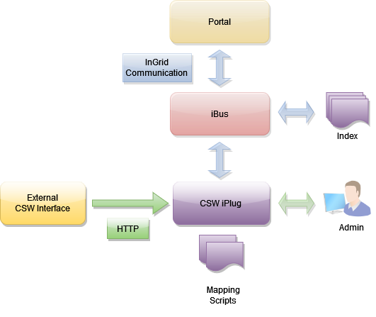

## Allgemeines

Das CSW-iPlug bietet eine Schnittstelle zu CSW (Catalog Service Web)-Datenquellen. Die CSW-Datenquelle muss [OGC CSW 2.0.2 AP ISO 1.0](http://www.opengeospatial.org/standards/cat) konform sein. Die Daten der Datenquelle werden komplett heruntergeladen und indexiert. Die Originaldaten der Datenquelle bleiben erhalten und dienen als Datenbasis für die Lieferung von Detaildaten (z.B. für die CSW Schnittstelle).

Eine Anfrage an das iPlug generiert also KEINE Anfrage an die zugrundeliegende CSW Schnittstelle. Diese Vorgehensweise wurde insbesondere im Hinblick auf eine performante Abfrage des iPlugs gewählt.

Das iPlug fragt die CSW Schnittstelle regelmäßig (z.B. einmal täglich) ab. Die Abfrage-Frequenz kann über die Admin-Oberfläche gesteuert werden.



<figcaption class="figcaption">InGrid Komponente iPlug CSW</figcaption>


## Systemvoraussetzungen

* 256 MB RAM
* 500 MB Harddrive

* JAVA 17
* Cygwin (unter Windows)


## Installation

Download: [https://distributions.informationgrid.eu/ingrid-iplug-csw-dsc/](https://distributions.informationgrid.eu/ingrid-iplug-csw-dsc/)

Um die Installationsroutine zu starten, doppel-klicken Sie auf das Installationsprogramm oder geben Sie folgenden Befehl auf der Kommandozeile ein:

```sh
java -jar ingrid-iplug-dsc-csw-VERSION-installer.jar
```

Der Installer ist sowohl per graphischer Oberfläche als auch Kommandozeileneingabe ausführbar. Bitte folgen Sie den Anweisungen des Installationsprogrammes. Das Installationsprogramm installiert die Komponente im gewünschten Verzeichnis und passt die Konfigurationsdateien an.

Sie können nun das iPlug mit

```sh
sh start.sh start
```

starten.

Das iPlug besitzt eine Administrationsoberfläche über die die angeschlossenen iPlugs eingesehen und verwaltet werden können.


http://localhost:PORT


Anstelle von `localhost` können Sie auch die IP-Adresse des Computers eingeben. Authentifizieren Sie sich als 'admin' mit dem von Ihnen vergebenen Passwort.


Nach der ersten Installation wird die Administrations-GUI unter


http://localhost:8082


aufgerufen und die Konfiguration vervollständigt.


## Aktualisierung

Neues Release von [https://distributions.informationgrid.eu/ingrid-iplug-dsc-csw/](https://distributions.informationgrid.eu/ingrid-iplug-dsc-csw/) herunterladen.

iPlug stoppen.

```sh
sh start.sh stop
```

Aktuelles Installationsverzeichnis sichern:

```sh
cp -r /opt/ingrid/ingrid-iplug-dsc-csw BACKUP_DIRECTORY
```


Die Aktualisierung erfolgt über den Installer.

```sh
java -jar ingrid-iplug-dsc-csw-NEW-VERSION-installer.jar
```

Während der Installation bitte "Upgrade" auswählen und das Installationsverzeichnis Verzeichnis angeben.

iPlug starten.

```sh
sh start.sh start
```

## Betrieb

```sh
start.sh [start|stop|restart|status]
```

Die LOG Ausgaben finden sich in der Datei `log.log` und `console.log`.


## Konfiguration

### Basiskonfiguration

Die Basiskonfiguration für iPlugs kann [hier](iplug_admin_gui.html) eingesehen werden.

### iPlug spezifische Parameter

Die Konfiguration des iPlugs wird enthält einige CSW-DSC spezifische Parameter, die hier beschrieben werden:

**Service URL**

In der Administrationsoberfläche kann mit der Eigenschaft `ServiceUrl` die Service URL eines abzufragenden WFS Dienstes eingetragen werden.

Es handelt sich per Default hierbei um die URL zum SOAP Interface der Schnittstelle, da die Capabilities über SOAP abgefragt werden.


### Einschränkung der Ergebnisse

Im iPlug kann die Art der Abfragen definiert werden, die verwendet werden, um alle Daten der CSW Schnittstelle zu laden. Per Default wird keine spezifische Abfrage verwendet, so dass die CSW Schnittstelle ohne Constraint in der CSW Anfrage angefragt wird. Es ist aber möglich beliebige Filter für die Anfrage zu definieren, so dass hier der Umfang der CSW Daten gesteuert werden kann oder die Belastung der CSW Schnittstelle eingeschränkt werden kann.

Die allgemeine Konfiguration wird in der Datei webapp/WEB-INF/spring.xml gehalten. Der folgende Ausschnitt zeigt, wie die Konfiguration festgelegt wird:

```xml
<!--
  Define the CSW filter queries to query the CSW data source. Duplicates resulting from
  the queries will be detected based on the Identifier and be removed.

  To produce one CSW Query without a Constraint element, please remove any <value> elements.
  Many systems support this to get all results from the CSW data source.
 -->
<bean id="cswHarvestFilter" class="org.springframework.beans.factory.config.SetFactoryBean">
  <property name="sourceSet">
    <set>
      <!--
      <value>
        <![CDATA[<ogc:Filter xmlns:ogc="http://www.opengis.net/ogc">
        <ogc:PropertyIsLike escapeChar="\\" singleChar="?" wildCard="*">
        <ogc:PropertyName>Identifier</ogc:PropertyName>
        <ogc:Literal>00*</ogc:Literal>
        </ogc:PropertyIsLike>
        </ogc:Filter>]]>
      </value>
      -->
    </set>
  </property>
</bean>
```

Diese Konfiguration kann überschrieben werden. Damit dies bei einem Update der Installation erhalten bleibt, sollte die Änderung im Unterverzeichnis **_override_** geschehen.
Hier können beliebige .xml Dateien angelegt werden, die das default Verhalten "überschreiben".

Zum Hinzufügen eines Filters zu allen POST Anfragen kann z.B. eine Datei "spring_filter.xml" im Verzeichnis *webapp/WEB-INF/override* angelegt werden.
Mit folgendem Inhalt werden dann z.B. nur Sätze eines spezifischen iPlugs aus der angebundenen CSW Schnittstelle gelesen:

```xml
<beans xmlns="http://www.springframework.org/schema/beans"
    xmlns:xsi="http://www.w3.org/2001/XMLSchema-instance"
    xsi:schemaLocation="http://www.springframework.org/schema/beans http://www.springframework.org/schema/beans/spring-beans-4.0.xsd">

    <bean id="cswHarvestFilter" class="org.springframework.beans.factory.config.SetFactoryBean">
        <property name="sourceSet">
            <set>
                <value>
                    <![CDATA[<ogc:Filter xmlns:ogc="http://www.opengis.net/ogc">
                    <ogc:PropertyIsEqualTo>
                    <ogc:PropertyName>iplug</ogc:PropertyName>
                    <ogc:Literal>/ingrid-group:iplug-csw-dsc-ID</ogc:Literal>
                    </ogc:PropertyIsEqualTo>
                    </ogc:Filter>]]>
                </value>
            </set>
        </property>
    </bean>
</beans>
```

Unter *webapp/WEB-INF/spring.xml* wird auch definiert, wie die Requests ausgeführt werden, also GET (*kvpGetRequest*), POST XML (*xmlPostRequest*) oder POST SOAP (*soapRequest*).
Hier z.B. eine Konfiguration, die die GetCapabilities per GET holt und den Rest per POST SOAP.
Auch diese Einstellungen können im Verzeichnis **_override_** überschrieben werden, s.o.

```xml
    <bean id="cswRequestImpl" class="org.springframework.beans.factory.config.MapFactoryBean">
      <property name="sourceMap">
          <map>
            <entry key="GetCapabilities" value-ref="kvpGetRequest"/>
            <entry key="DescribeRecord" value-ref="soapRequest"/>
            <entry key="GetDomain" value-ref="soapRequest"/>
            <entry key="GetRecords" value-ref="soapRequest"/>
            <entry key="GetRecordById" value-ref="soapRequest"/>
          </map>
      </property>
    </bean>
```

### SOAP Header festlegen

In manchen Fällen muss mit den SOAP Anfragen ein SOAP Header mitgeliefert werden, z.B. um Authentifizierungs-Informationen an den abzufragenden Webservice abzugeben.

Dafür muss in der SOAP Request Implementierung eine Pre-Processor Implementierung konfiguriert werden (spring.xml):

```xml
<bean id="soapRequest" class="de.ingrid.iplug.csw.dsc.cswclient.impl.SoapRequest">
<!--
  GeoPortal.WSV specific! This pre processor retrieves a SAML Ticket and adds a SOAP header.  

  <property name="preProcessor" ref="samlTicketSoapRequestPreprocessor" />
-->
</bean>
```

Mit der zugehörigen Implementierung ist es nun möglich einen entsprechenden SOAP Header als Template anzugeben. Die momentan realisierte Implementierung ermöglicht die Definition eines SOAP Header Templates und eines SAML Ticket Providers, der ein entsprechendes Ticket von einem per URL erreichbaren Authentifizierungsdienstes bezieht. Innerhalb des Templates wird der String `${SAML_TICKET}` durch das bezogenen Ticket ersetzt.

Das SAML Ticket wird für eine bestimmte Dauer gecached, damit ein Verfall des Tickets während des Harvesting verhindert wird. Außerdem wird der Authentifizierungsdienst dadurch entlastet.

```xml
<!--
  This pre-processor retrieves a SAML ticket via a provider and adds a SOAP header to every Axis service client.

  It is used for the Geoportal.WSV Installation but could be used elsewhere.
-->
<bean id="samlTicketSoapRequestPreprocessor" class="de.ingrid.iplug.csw.dsc.cswclient.impl.SamlTicketSoapRequestPreprocessor">
  <property name="soapHeaderTemplate">
    <value><![CDATA[
	  <tcExt:tcSecurity soapenv:role="http://www.conterra.de/service.csw#component::terraCatalog#catalog" soapenv:mustUnderstand="false" xmlns:tcExt="http://www.conterra.de/catalog/ext" xmlns:soapenv="http://www.w3.org/2003/05/soap-envelope">
        <tcExt:tcSecuredAction>
          <tcExt:action>service.csw::discovery.read</tcExt:action>
        </tcExt:tcSecuredAction>
        <tcExt:samlTicket>${SAML_TICKET}</tcExt:samlTicket>
      </tcExt:tcSecurity>]]>
	</value>
  </property>
  <property name="samlTicketProvider" ref="samlTicketProvider" />
</bean>

<!--
  This is a SAML Ticket provider that queries an URL for a SAML Ticket.

  The configuration is Geoportal.WSV specific!!!
 -->
<bean id="samlTicketProvider" class="de.ingrid.iplug.csw.dsc.cswclient.impl.SamlTicketProvider">
  <property name="samlTicketRequestUrl" value="http://geokat.wsv.bvbs.bund.de/administration/WAS?VERSION=1.1&amp;REQUEST=GetSAMLResponse&amp;CREDENTIALS=ADD_CRDENTIALS_HERE&amp;METHOD=urn:opengeospatial:authNMethod:OWS:1.0:password" />
  <property name="cacheForSeconds" value="30" />
</bean>
```


### Erhöhung der Fehlerresilienz

Beim Harvesting kann es bei der Kommunikation zur CSW Schnittstelle zu Fehlern kommen. Die folgenden Parameter können in der Daten `confg.override.properties` angepasst werden, um die Kommunikation robuster zu gestalten:

```
# Fetching: The number of retries of a specific GetRecords request on failure (requesting a specific chunk of records)
numRetriesPerRequest=3

# Fetching: The time to wait between retry of a specific GetRecords request in MILLISECONDS.
# NOTICE: Is multiplied with the number of retries. So last retry starts after numRetriesPerRequest * timeBetweenRetries
# 0 causes immediate retries !
timeBetweenRetries=1000

# Fetching: How many failed requests (leading to a loss of records) should we tolerate ?
# 0 causes abort of fetching as soon as a chunk of records is lost !
# -1 means we tolerate all failed requests, this only makes sense if we have successful requests in between !
# Or just enter an arbitrary number. If that number of failed requests (lost chunks of records) is reached the fetching process is ended.
maxNumSkippedRequests=0
```

### InGrid Communication


Die Datei `conf/communication.xml` enthält die Konfigurationen der InGrid Kommunikationsschicht.

```xml
<?xml version="1.0" encoding="UTF-8"?>
<communication xmlns:xsi="http://www.w3.org/2001/XMLSchema-instance"
    xsi:noNamespaceSchemaLocation="communication.xsd">
    <client name="/ingrid-group:iplug-management-'Ihr-Name'">
        <connections>
            <server name="/ingrid-group:ibus-'Ihr-Name'">
                <socket port="9900" timeout="10" ip="127.0.0.1" />
                <messages maximumSize="1048576" threadCount="100" />
            </server>
        </connections>
    </client>
    <messages queueSize="2000" handleTimeout="10"/>
</communication>
```

Die einzelnen Parameter haben folgende Bedeutung:

| Parameter                           | Beschreibung                                             |
|-------------------------------------|----------------------------------------------------------|
| client/@name                        | Eindeutige ID des iPLugs  |
| server/@name                        | Eindeutige ID des InGrid iBus  |
| socket/@port                        | Port unter dem die Administrations GUI zu erreichen ist |
| socket/@timeout               | Timeout der Socketverbindungen in sec |
| message/@maximumSize                | max. zulässige Größe einer Message in Bytes, die über den iBus versendet werden kann |
| message/@threadCount                | Anzahl der Verbindungen (Threads), die der iBus gleichzeitig aufrecht erhalten kann |
| message/@handleTimeout              | Timeout einer Message in sec (Wie lange wartet der iBus auf die Beantwortung einer Message.) |
| message/@queueSize                  | Message Queue (Wie viele Nachrichten können in der Warteschlange des iBus enthalten sein.) |


## FAQ

### Wie kann ich ein Überschreiben der Datei `env.sh` bei einer Aktualisierung verhindern.

In der Datei env.sh können Systemvariablen komponenten-spezifisch angepasst werden (z.B. Proxy oder Heap Einstellungen). Um die Einstellungen nach einer Aktualisierung nicht zu verlieren, muss die Datei `env.sh` nach `user.env.sh` kopiert werden. Die Änderungen in `user.env.sh` werden nicht überschrieben.

### Mein System verwendet einen Proxy für HTTP(S) Zugriffe. Wie kann ich die Proxy-Konfiguration einstellen?

Bitte in der Datei env.user.sh folgendes zusätzlich eintragen:


-Dhttp.proxyHost=yourProxyURL -Dhttp.proxyPort=proxyPortNumber -Dhttp.proxyUser=someUserName -Dhttp.proxyPassword=somePassword -Dhttps.proxyHost=yourProxyURL -Dhttps.proxyPort=proxyPortNumber -Dhttps.proxyUser=someUserName -Dhttps.proxyPassword=somePassword -http.nonProxyHosts=localhost|127.*|[::1]


User und Passwort müssen nicht unbedingt angegeben werden.

Achtung: Die Trennung mit dem pipe Symbol muss unter Windows/cygwin escaped werden: 

-http.nonProxyHosts=localhost^|127.*^|[::1]

### Die iPlug Administration funktioniert nicht, es können keine Partner/Anbieter ausgewählt werden.


Mögliche Ursachen:

* Falsche Datenbank Verbindungsparameter
* Keine Verbindung zum iBus
* iPlug Management funktioniert nicht

Bitte analysieren Sie das log file des iPlugs.
Löschen Sie gegebenenfalls den Cache Ihres Browsers und starten sowohl das Portal als auch das iPlug neu.

Sie müssen nach einer Änderung der Konfiguration das iPlug immer neu starten
