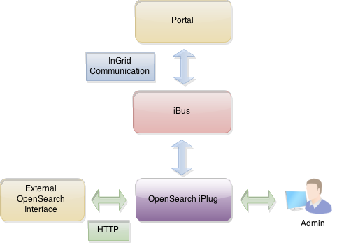
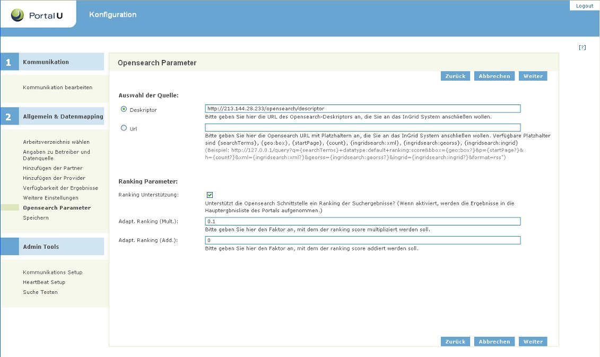

## Allgemeines

Das iPlug Opensearch dient der Einbindung von openSearch Schnittstellen in die InGrid-Recherche. InGrid Anfragen werden über das iPlug an die Opensearch Schnittstelle weitergeleitet, die Ergebnisse werden in das InGrid System zurückgespielt.



<figcaption class="figcaption">InGrid Komponente iPlug Opensearch</figcaption>


## Systemvoraussetzungen

* 64 MB RAM
* 50 MB Harddrive

* JAVA 1.7
* Cygwin (unter Windows)


## Installation

Download: [https://distributions.informationgrid.eu/ingrid-iplug-opensearch/](https://distributions.informationgrid.eu/ingrid-iplug-opensearch/)

Um die Installationsroutine zu starten, doppel-klicken Sie auf das Installationsprogramm oder geben Sie folgenden Befehl auf der Kommandozeile ein:

```bash
java -jar ingrid-iplug-opensearch-VERSION-installer.jar
```

Der Installer ist sowohl per graphischer Oberfläche als auch Kommandozeileneingabe ausführbar. Bitte folgen Sie den Anweisungen des Installationsprogrammes. Das Installationsprogramm installiert die Komponente im gewünschten Verzeichnis und passt die Konfigurationsdateien an.

Sie können nun das iPlug mit

```bash
sh start.sh start
```

starten.

Das iPlug besitzt eine Administrationsoberfläche über die die angeschlossenen iPlugs eingesehen und verwaltet werden können.


http://localhost:PORT


Anstelle von `localhost` können Sie auch die IP-Adresse des Computers eingeben. Authentifizieren Sie sich als 'admin' mit dem von Ihnen vergebenen Passwort.


Nach der ersten Installation wird die Administrations-GUI unter


http://localhost:8082


aufgerufen und die Konfiguration vervollständigt.


## Aktualisierung

Neues Release von [https://distributions.informationgrid.eu/ingrid-iplug-opensearch/](https://distributions.informationgrid.eu/ingrid-iplug-opensearch/) herunterladen.

iPlug stoppen.

```bash
sh start.sh stop
```

Aktuelles Installationsverzeichnis sichern:

```bash
cp -r /opt/ingrid/ingrid-iplug-opensearch BACKUP_DIRECTORY
```


Die Aktualisierung erfolgt über den Installer.

```bash
java -jar ingrid-iplug-opensearch-NEW-VERSION-installer.jar
```

Während der Installation bitte "Upgrade" auswählen und das Installationsverzeichnis Verzeichnis angeben.

iPlug starten.

```bash
sh start.sh start
```

## Betrieb

```bash
start.sh [start|stop|restart|status]
```

Die LOG Ausgaben finden sich in der Datei `log.log` und `console.log`.


## Konfiguration

### Basiskonfiguration

Die Basiskonfiguration für iPlugs kann [hier](iplug_admin_gui.html) eingesehen werden.

### Einbindung einer OpenSearch Datenquelle (Opensearch Parameter )

Bei der `Auswahl der Quelle` wird die anzuschließende Opensearch-Schnittstelle eingetragen.

Dabei kann entweder einen Deskriptor angeben, welcher die eigentliche Anfrage beschreibt, oder eine Url mit Platzhaltern angegeben werden. Die Platzhalter werden benötigt, um bspw. die Suchbegriffe und die Anzahl der abzufragenden Ergebnisse korrekt in die Url einzufügen, mit der dann die eigentliche Abfrage getätigt werden kann. Um erfolgreich eingebunden zu werden, muss das Ergebnis der Abfragen von der OpenSearch Datenquelle im RSS Format zurückgegeben werden.

Parameter die ein "?" enthalten sind optional und müssen nicht ausgefüllt werden. Das Opensearch-iPlug versucht alle Opensearch-spezifischen Parameter mit Werten zu füllen, welche in der InGrid Anfrage enthalten sind.
Weitere Informationen über den Deskriptor und die Beschreibung der Parameter kann man hier ()[http://www.opensearch.org/Specifications/OpenSearch](http://www.opensearch.org/Specifications/OpenSearch)) finden.

Über die InGrid Query werden die `searchTerms`  (Query), `count` (Anzahl der Ergebnisse pro Seite = 10) und `startIndex` ( (Seitenzahl-1) x count ) übergeben. Dies wird im iPlug verarbeitet, um eine gültige Opensearch-Query zu erstellen.

Unterstützt die anzuschließende Opensearch-Schnittstelle ein Ranking muss ggf. eine Anpassung des Ranking-Wertebereiches an den InGrid Wertebereich (0..1.0) erfolgen. Dafür gibt es die Modifikatoren für die Multiplikation und Addition, die auf das Ranking angewendet werden.

Bsp: Besitzt die anzuschließende OpenSearch Schnittstelle ein Ranking von `0..10`, muss ein Multiplikator von `0.1` eingegeben werden.




### Weitere Manipulationsmöglichkeiten des Ranking


Die Manipulation des eingehenden Ranking wird über eine Folge von konfigurierbaren RankingModifier bestimmt. Per default ist hier der RankingModifier für die Modifikation via Multiplikation und Addition aktiviert, der seine Werte aus der PlugDescription liest, die über die Adminoberfläche eingegeben werden können (s.o.). Dies kann jedoch manuell in der Datei


./webapp/WEB-INF/spring.xml


geändert werden.

```xml
<!-- RANKING MODIFICATION: Multiple ranking modifiers possible. Manipulated score will be passed to next modifier ! -->

<!-- DEFAULT RANKING MODIFIER: manipulates ranking score via multiplication and addition set in admin gui -->
<ref bean="rankingModifierPD" />

<!-- RANKING MODIFIER for linear modification of ranking score. Configuration see "rankingModifierLinear" below. -->
<!-- SWITCH ON IF NEEDED (BW), NOTICE: OLD MODIFICATION STILL ACTIVATED, SWITCH OFF rankingModifierPD ? -->
<!--
<ref bean="rankingModifierLinear" />
-->
```

Folgende Änderung deaktiviert die Manipulation via Multiplikation und Addition und aktiviert stattdessen eine lineare Modifikation:

```xml
<!-- RANKING MODIFICATION: Multiple ranking modifiers possible. Manipulated score will be passed to next modifier ! -->

<!-- DEFAULT RANKING MODIFIER: manipulates ranking score via multiplication and addition set in admin gui -->
<!--
<ref bean="rankingModifierPD" />
-->

<!-- RANKING MODIFIER for linear modification of ranking score. Configuration see "rankingModifierLinear" below. -->
<!-- SWITCH ON IF NEEDED (BW), NOTICE: OLD MODIFICATION STILL ACTIVATED, SWITCH OFF rankingModifierPD ? -->
<ref bean="rankingModifierLinear" />
```

Der rankingModifierLinear wird am Ende der Datei definiert und konfiguriert:

```xml
<!-- RANKING MODIFIER for linear modification of ranking score. Pass config values below. -->
<bean id="rankingModifierLinear">
  <property name="configMap">
    <map key-type="java.lang.Float">
      <!-- Eingehender Score -->
      <entry key="10">
        <list value-type="java.lang.Float">
          <!-- Median (Max) -->
          <value>1</value>
          <!-- Minimum -->
          <value>0</value>
        </list>
      </entry>
      <entry key="9">
        <list value-type="java.lang.Float">
          <value>1</value>
          <value>0</value>
        </list>
      </entry>
      ...
      <entry key="0">
        <list value-type="java.lang.Float">
          <value>1</value>
          <value>0</value>
        </list>
      </entry>
    </map>
  </property>
</bean>
```

Alle Ergebnisse mit dem selben eingehenden Score bekommen einen linear-verteilten InGrid-Score. Diese Verteilung bewegt sich zwischen dem Minimum und dem Median des jeweiligen Scores.

Formel:


G = Eingehender Score (z.B. GSA-Score)
I = InGrid-Score
p = Position des Scores innerhalb der Scores mit der selben Höhe. Wert: 0 ... (n-1)
n = Anzahl der Scores mit der selben Höhe.

I = Minimum(G) + [ { (Median(G) - Minimum(G) ) / n } * (n - p) ]


Beispiel mit 3 Treffern jeweils Score=9 und o.g. Konfiguration (für Score 9 Median=1, Minimum=0)

| p (Position) | I (InGrid-Score) | Berechnung |
| === | === | === |
| 2| 0.33 | I = 0 + [{(1 - 0) / 3 } * (3 - 2)] |
| 0| 1 | I = 0 + [{(1 - 0) / 3 } * (3 - 0)] |
| 1| 0.67 | I = 0 + [{(1 - 0) / 3 } * (3 - 1)] |

Die konfigurierten minimalen und maximalen Scores geben den Score Range vor, d.h. für eingehende Scores über dem maximalen Wert wird der maximale konfigurierte Score Wert genommen (im Bsp. 10). Für eingehende Scores unter dem minimalen Wert wird der minimale konfigurierte Score Wert genommen (im Bsp. 0).

> Nach der Änderung muss das iPlug neu gestartet werden.


### Opensearch Mapping

Hier besteht die Möglichkeit, die Abfrage der angeschlossenen Opensearch-Schnittstelle zu erweitern. Es möglich Einstellungen vorzunehmen, um nach einer Domäne, einem Partner und/oder einem Anbieter zu filtern. Dies muss allerdings von der Opensearch-Schnittstelle unterstützt werden!

Da die Parameter für die Filterung von Schnittstelle zu Schnittstelle unterschiedlich ausfallen kann, muss hier ein Mapping vorgenommen werden. Aktiviert man das Mapping bspw. für Domain, so muss der Wert von der InGrid Query korrekt auf die Opensearch-Schnittstelle abgebildet werden. Dazu schreibt man den Opensearch-Parameter in das Feld *zu mappen auf:*. Nun gibt es die Möglichkeit, dass der Parameter innerhalb der Suchbegriffe auftaucht, oder als URL-Request Parameter an die Anfrage angehängt wird. Situationsbedingt wählt man dann die Checkbox *als Parameter hinzufügen*.


Im Bild wurde zum Beispiel `site` als zu mappender Parameter gewählt, welcher standardmäßig von Google Search Appliance (GSA) innerhalb der Suchanfrage verwendet wird. Mit GSA ist es aber auch möglich auf `as_sitesearch` zu mappen, wobei jedoch die Option *als Parameter hinzufügen* ausgewählt sein muss.

Im ersten Fall würde folgende URL für die Opensearch-Schnittstelle generiert werden:


http://...q=Wasser+site:www.portalu.de&amp;num=10&amp;...


wobei im zweiten Fall diese generiert werden würde:


http://...q=Wasser&amp;num=10&amp;as_sitesearch=www.portalu.de&amp;...


Damit die Domain-Abfrage auch bei OpenSearch iPlugs funktioniert, muss die OpenSearch Schnittstelle den entsprechenden Parameter unterstützen (`site`) und das OpenSearch iPlug muss entsprechend konfiguriert sein.

Wird das Opensearch-iPlug mit Parametern angefragt, welches es nicht unterstützt, so wird eine leere Trefferliste zurückgegeben!


### Facettierung

Über eine manuelle Konfiguration ist es möglich alle Ergebnisse des iPlugs einer bestimmten Facette zuzuordnen. Die Konfiguration befindet sich im File


webapp/WEB-INF/springapp-servlet.xml


Hier kann im folgenden Bereich die Facette konfiguriert werden.

```xml
<bean id="plugDescriptionFacetCounter"
   class="de.ingrid.search.utils.facet.counter.DscPlugdescriptionFacetCounter">
   <property name="plugDescriptionWrapper">
      <ref bean="plugDescriptionWrapper" />
   </property>
   <property name="facetClassDefinitions">
      <list>
      <!--
         Add facets for this iplug.
         If facet fits, all results will be added to the facet

         <value>type:www</value>  
      -->
      </list>
   </property>
</bean>
```

Die Änderungen werden nach Neustart der Komponente übernommen.

### InGrid Communication


Die Datei `conf/communication.xml` enthält die Konfigurationen der InGrid Kommunikationsschicht.

```xml
<?xml version="1.0" encoding="UTF-8"?>
<communication xmlns:xsi="http://www.w3.org/2001/XMLSchema-instance"
    xsi:noNamespaceSchemaLocation="communication.xsd">
    <client name="/ingrid-group:iplug-management-'Ihr-Name'">
        <connections>
            <server name="/ingrid-group:ibus-'Ihr-Name'">
                <socket port="9900" timeout="10" ip="127.0.0.1" />
                <messages maximumSize="1048576" threadCount="100" />
            </server>
        </connections>
    </client>
    <messages queueSize="2000" handleTimeout="10"/>
</communication>
```

Die einzelnen Parameter haben folgende Bedeutung:

| Parameter                           | Beschreibung                                             |
|-------------------------------------|----------------------------------------------------------|
| client/@name                        | Eindeutige ID des iPLugs  |
| server/@name                        | Eindeutige ID des InGrid iBus  |
| socket/@port                        | Port unter dem die Administrations GUI zu erreichen ist |
| socket/@timeout               | Timeout der Socketverbindungen in sec |
| message/@maximumSize                | max. zulässige Größe einer Message in Bytes, die über den iBus versendet werden kann |
| message/@threadCount                | Anzahl der Verbindungen (Threads), die der iBus gleichzeitig aufrecht erhalten kann |
| message/@handleTimeout              | Timeout einer Message in sec (Wie lange wartet der iBus auf die Beantwortung einer Message.) |
| message/@queueSize                  | Message Queue (Wie viele Nachrichten können in der Warteschlange des iBus enthalten sein.) |


## FAQ

### Wie kann ich ein Überschreiben der Datei `env.sh` bei einer Aktualisierung verhindern.

In der Datei env.sh können Systemvariablen komponenten-spezifisch angepasst werden (z.B. Proxy oder Heap Einstellungen). Um die Einstellungen nach einer Aktualisierung nicht zu verlieren, muss die Datei `env.sh` nach `user.env.sh` kopiert werden. Die Änderungen in `user.env.sh` werden nicht überschrieben.

### Mein System verwendet einen Proxy für HTTP(S) Zugriffe. Wie kann ich die Proxy-Konfiguration einstellen?

Bitte in der Datei env.user.sh folgendes zusätzlich eintragen:


-Dhttp.proxyHost=yourProxyURL -Dhttp.proxyPort=proxyPortNumber -Dhttp.proxyUser=someUserName -Dhttp.proxyPassword=somePassword -Dhttps.proxyHost=yourProxyURL -Dhttps.proxyPort=proxyPortNumber -Dhttps.proxyUser=someUserName -Dhttps.proxyPassword=somePassword -http.nonProxyHosts=localhost|127.*|[::1]


User und Passwort müssen nicht unbedingt angegeben werden.

Achtung: Die Trennung mit dem pipe Symbol muss unter Windows/cygwin escaped werden: 

-http.nonProxyHosts=localhost^|127.*^|[::1]


### Die iPlug Administration funktioniert nicht, es können keine Partner/Anbieter ausgewählt werden.


Mögliche Ursachen:

* Falsche Datenbank Verbindungsparameter
* Keine Verbindung zum iBus
* iPlug Management funktioniert nicht

Bitte analysieren Sie das log file des iPlugs.
Löschen Sie gegebenenfalls den Cache Ihres Browsers und starten sowohl das Portal als auch das iPlug neu.

Sie müssen nach einer Änderung der Konfiguration das iPlug immer neu starten
