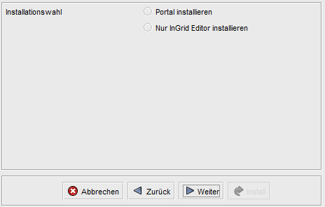
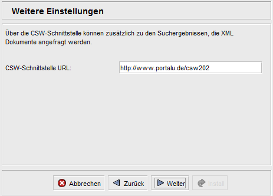
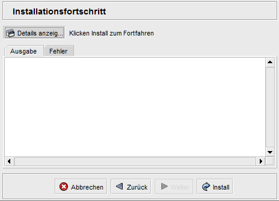

## Allgemeines

### Was ist das Portal?

Das Portal bietet den Benutzern ein komfortables Interface zur Suche über den InGrid Datenraum und zu weiteren Diensten, wie dem Browsen in Datenkatalogen, dem Karten Client oder dem gezielten Zugriff auf Service-Informationen, Messwerte, Umweltthemen oder Umweltereignisse.

Mittels Anmeldung (Authentifizierung) können Benutzer Ihre Suche dauerhaft personalisieren oder die Ansicht der Startseite verändern.

Das Portal enthält den InGrid-Editor (IGE), eine Oberfläche zum Erfassen und Pflegen von INSPIRE kompatiblen Metadaten. Der IGE kann optional ohne Portal installiert werden.

Funktionsumfang

- Freie Suche in allen angeschlossenen Datenquellen
- Facettierung der Suche, Einschränkung der Suchergebnisse über Kategorien

- News-Feed-Concentrator (Zusammenfassen verschiedener News-Feeds) für den Umweltbereich

- Administrationsfunktionalitäten

- Erfassung/Pflege von Metadaten in Datenkatalogen (IGC - InGrid Catalog) mittels InGrid Editor (IGE) für ausgewählte Benutzer

Die Inhalte der Startseite können angepasst werden. Es existiert die Möglichkeit, verschiedene Default-Einstellungen für die Suche festzulegen:

- Auswahl von einem oder mehreren Informationsanbietern (Bund/Länder, Anbieter)
- Auswahl einer oder mehrerer Datenquellen (Metadaten, Webseiten, Fachdatenbank)

Das Portal kann über einen Profil-Mechanismus an verschiedene Anforderungen angepasst werden. So kann das Layout kann je nach Anforderung beliebig angepasst werden. Auch die Funktionalität lässt sich weitgehend erweitern und anpassen, so dass flexibel auf kundespezifische Anforderungen eingegangen werden kann.
Beispielsweise wurde für das UVP Portal https://uvp-verbund.de/ Sowohl das Layout verändert und die Funktionaltät angepasst (z.B. Kartendarstellung, Detaildarstellung, Startseite, Suche, etc.)

Das Portal basiert auf dem Jetspeed Portal Framework [https://portals.apache.org/jetspeed-2/](https://portals.apache.org/jetspeed-2/)

### Was sind Portal Profile?

Portal Profile werden eingesetzt, um die Oberfläche und Funktionalität des Portals an die Anforderungen der unterschiedlichen Anwender anzupassen. Ziel ist es durch die Profile die technische Entwicklung des Portals durch die unterschiedlichen Anforderungen der Anwender nicht auseinanderdriften zu lassen.

Profile bestehen aus einer Sammlung von Dateien (Stylesheets, Templates, Bilder) und Datenbankanweisungen, die die Anpassungen für einen bestimmten Anwender kapseln. Die Profile können in der Administrationsumgebung des Portals umgeschaltet werden.

> Das Umschalten eines Profils macht den Neustart des Portals erforderlich!


## Systemvoraussetzungen

- 768 MB RAM
- 1 GB Harddrive

- JAVA 17
- Cygwin (unter Windows)
- MySQL, ORACLE oder PostgreSQL (ab InGrid 4.0.2)

### Anmerkungen zu MySQL-Datenbanken

Bei der Verwendung einer MySQL-Datenbank unter Unix wird normalerweise nach Groß/Klein-Schreibung unterschieden (casesensitiv). Da die Portal-Applikation Groß- und Klein-Schreibung nicht berücksichtigt, muss dies in der MySQL DB ausgeschaltet werden.

Dazu bitte die Datei /etc/mysql/conf.d/ingrid.cnf

mit dem Inhalt

```sh
[mysqld]
lower_case_table_names=1
```

anlegen und den mysql service neu starten.


## Installation

Das Portal wird mit einem Installer ausgeliefert, der die Installation schrittweise durchführt und die nötigen Informationen vom Benutzer erfragt. Der Installer installiert einen vorkonfigurierten Tomcat, der die entsprechend konfigurierten Portal-Applikationen beinhaltet.

Die Integration des Portals in einen bereits bestehenden Tomcat ist sehr stark von der Version und Systemumgebung abhängig und wird hier nicht weiter beschrieben.

Bei der Verwendung von ORACLE ist folgendes zu beachten:

* Die Datenbanken ingrid-portal und mdek müssen vorhanden sein
* Die Datenbank ingrid-portal muss vor der Installation mit dem dump aus dem Installer unter `distribution/sql/ingrid-portal-oracle_10_2_user_ingrid.dmp` initialisiert werden (Oracle 10.2. Dump).

ACHTUNG: ingrid-portal-oracle_10_2_user_ingrid.dmp ist mit altem exp tool exportiert, deshalb mit imp importieren, s. [http://www.orafaq.com/wiki/Import_Export_FAQ](http://www.orafaq.com/wiki/Import_Export_FAQ)


### Installer Schritt für Schritt

#### 1.) Stoppen Sie das Portal

```sh
INSTALL_DIR/apache-tomcat-xx/bin/shutdown.sh
```

#### 2.) Erstellen Sie ein Backup

Vor jeder Aktualisierung sollte ein Backup erstellt werden.

* Datenbanken ingrid-portal, mdek
* Installationsverzeichnis (Default: /opt/ingrid/ingrid-portal)

#### 3.) Stellen Sie ggf. das Profil zurück auf das PortalU Profil

Hintergrund : Das Standard Profil in dem das Portal ausgeliefert wird ist "PortalU". Deshalb vor der Installation das bestehende Portal auf "PortalU" umschalten, damit die Datenbank zum "neuen" Portal passt. Nach der Installation kann dann wieder umgeschaltet werden. Falls Sie spezielle Einstellungen in den Konfigurations-Dateien gemacht haben (emails etc.), müssen diese dann manuell wieder nachgezogen werden.


#### 4.) Download

[https://distributions.informationgrid.eu/ingrid-portal/](https://distributions.informationgrid.eu/ingrid-portal/)

#### 5.) Installation starten

Um die Installationsroutine zu starten, doppel-klicken Sie auf das Installationsprogramm oder geben Sie folgenden Befehl auf der Kommandozeile ein:

```sh
java -jar ingrid-portal-VERSION-installer.jar
```


> Hinweis: Bei Aktualisierungen des Portals, wird empfohlen, den Installer immer im gleichen Verzeichnis auszuführen. Die bei der letzten Installation verwendeten Einstellungen wurden in einer Datei "ant.install.properties" gespeichert und können bei einem Update wiederverwendet werden. Dazu muss sich diese Datei im selben Verzeichnis befinden, wie der Installer!

Der Installer ist sowohl per graphischer Oberfläche als auch Kommandozeileneingabe ausführbar. Im folgenden wird die Eingabe per graphischer Oberfläche beschrieben.

#### 6.) Auswahl Neu-Installation/Update

Art der Installation auswählen.


Bei der Auswahl "Update" bleiben konfigurierte Einstellungen Ihres aktuellen Portals bei, ggf. ist es notwendig neue Konfigurationsmöglichkeiten festzulegen/einzustellen. Die Aktualisierung führen Sie auf Ihrer aktuellen Portal-Installation durch und wird mit einem Neustart des Portals abgeschlossen.

Bei einer Neuinstallation müssen weitere Angaben gemacht werden.

#### 7.) Auswahl IGE Installation ohne Portal

Soll nur der IGE installiert werden?



Hier wird nur auf die komplette Portal Installation eingegangen.

#### 8.) Auswahl Datenbank, IGE Installation

Welche Datenbank soll verwendet werden (ab InGrid 4.0.2 auch PostgreSQL)? Soll der IGE mit installiert werden?


Bei der Verwendung von Oracle müssen die Datenbanken vorhanden und der initiale Dump für die ingrid-portal Datenbank eingespielt sein.

In den nachfolgenden Seiten werden die Zugangsdaten für die Datenbanken abgefragt. Bitte achten Sie darauf, dass die angegebenen Benutzer mit entsprechenden Rechten (Erstellen von Tabellen, Index) ausgestattet sind.


#### 9.) Einstellungen für den InGrid Editor

Diese Einstellungen sind nur bei Installation des IGE notwendig.


| Parameter | Beschreibung |
|-----------|--------------|
| IngridEditor Port | Der Port, mit dem die IGE iPlugs Kontakt mit dem Editor aufnehmen. Ein Editor kann mehrere Kataloge (IGE iPlugs) verwalten.|
| IngridEditor DB-Url | JDBC Url für den Zugriff auf die mdek Datenbank. Login und Passwort für den Zugriff werden aus der Datenbankkonfiguration entnommen|
| SMTP-Server | Der SMTP Server, der zum Versenden von Emails aus dem IGe verwendet werden soll. |
| Sender Email Adresse | Die Email Adresse, die als Absender der Emails verwendet werden soll. |
| Domäne | Domäne, über den der IGE erreichbar ist. Diese wird benötigt, um in den Emails Links zum IGE zu hinterlegen. |


#### 10.) Einstellungen für den iBus

Diese Einstellungen werden für die Verbindung mit dem iBus der InGrid Installation benötigt.


| Parameter | Beschreibung |
|-----------|--------------|
| Client Name | Eindeutige ID des Portals. Folgt der Konvention: /<InGrid Installations ID>:<Komponenten ID> |
| Server Name | Eindeutige ID des iBus, mit dem sich das Portal verbinden soll |
| Server IP | IP Adresse des iBus |
| Server Port | TCP Port des iBus |

#### 11.) Einstellungen für den Karten Client

Diese Einstellungen werden für den integrierten Karten Client benötigt.


| Parameter | Beschreibung |
|-----------|--------------|
| WebmapClient-Datenverzeichnis | Datenverzeichnis des Karten Clients. Das Verzeichnis sollte nicht im Installationsverzeichnis des Karten Clients liegen, damit die Konfigurationen nicht bei einem Update überschrieben werden. (z.B.: /home/ingrid/webmapdata) |
| SMTP-Server (Host) | Host des SMTP-Servers. Per default 'localhost'. |
| SMTP-Port | Port des SMTP-Servers. |
| SMTP-Benutzer | Benutzername für den SMTP-Server. |
| SMTP-Passwort | Benutzerpasswort des angegebenen Benutzername für den SMTP-Server. |
| Sender E-Mail-Adresse | Absender der E-Mails. |

#### 12.) Einstellungen für das Codelist Repository

Das InGrid System besitzt ein Codelist Repository in dem Parameterlisten, die von mehreren Komponenten benutzt werden, abgelegt sind. Das Portal nutzt dieses vor allem um die Detailansicht von INSPIRE kompatiblen Metadaten korrekt anzuzeigen.

Falls das Codelist Repository nicht existiert, greift das InGrid System auf Standardwerte zurück. Das Codelist Repository wird also nur benötigt, falls Änderungen oder Ergänzungen an den Standard-Listen vorgenommen werden müssen.


| Parameter | Beschreibung |
|-----------|--------------|
| Codelist Repository URL | Zugriffs-URL auf den REST Service |
| Repository Benutzername | Login für den REST Service, optional |
| Repository Passwort | Passwort für den REST Service, optional |


#### 13.) Weitere Einstellungen

Für Suchergebnisse aus dem InGrid Metadatenbestand (z.B. aus dem IGE oder aus angeschlossenen CSW Datenquellen), wird ein direkter Link auf die XML Metadaten angeboten. Der Zugriff erfolgt über die CSW Schnittstelle desn InGrid Systemes.



| Parameter | Beschreibung |
|-----------|--------------|
| CSW Schnittstelle URL | Zugriffs-URL auf die CSW Schnittstelle des InGrid Systemes |


#### 14.) Installationsverzeichnis


| Parameter | Beschreibung |
|-----------|--------------|
| Installationsverzeichnis | Das Installationsverzeichnmis für das Portal. (z.B. /opt/ingrid/ingrid-portal) |


#### 15.) Installation

Der Installationsfortschritt kann während der Installation angezeigt werden. Die Anzeige enthält nützliche Informationen die auch weitere Anweisungen enthält, die nach der Installation zu beachten sind.




## Aktualisierung

Neues Release von [https://distributions.informationgrid.eu/ingrid-portal/](https://distributions.informationgrid.eu/ingrid-portal/) herunterladen.

Portal stoppen.

```sh
sh INSTALL_DIR/apache-tomcat-xx/bin/shutdown.sh
```

Aktuelles Installationsverzeichnis sichern:

```sh
cp -r /opt/ingrid/ingrid-portal <BACKUP-DIRECTORY>
```


Die Aktualisierung erfolgt über den Installer.

```sh
java -jar ingrid-portal-NEW-VERSION-installer.jar
```

Während der Installation bitte "Update" auswählen.


Liegt bei Ihrer aktuellen Portal-Installationen ein Version kleiner gleich 4.0.2 vor, so müssen Sie die Einstellungen des Webmap Client's aktualisieren bzw. erweitern. Durch diese Aktualisierung werden auch alte Konfigurationsdaten des alten Webmap Client's bereinigt.


Geben Sie anschließend die neuen Webmap Client Einstellungen ein. Für die Einstellung "WebmapClient-Datenverzeichnis" geben Sie den Eltern-Pfad Ihres "WebmapClientData"-Verzeichnis (per Default: "/opt/ingrid/") an.


Beispiel:
Ihr "WebmapClientData"-Verzeichnispfad lautet "/opt/ingrid/WebmapClientData", so geben Sie "/opt/ingrid/" an.


Die weiteren Einstellungsmöglichkeiten dienen dem Webmap Client für das Versenden von E-Mails.

| Parameter | Beschreibung |
|-----------|--------------|
| WebmapClient-Datenverzeichnis | Datenverzeichnis des Karten Clients. Das Verzeichnis sollte nicht im Installationsverzeichnis des Karten Clients liegen, damit die Konfigurationen nicht bei einem Update überschrieben werden. (z.B.: /home/ingrid/webmapdata) |
| SMTP-Server (Host) | Host des SMTP-Servers. Per default 'localhost'. |
| SMTP-Port | Port des SMTP-Servers. |
| SMTP-Benutzer | Benutzername für den SMTP-Server. |
| SMTP-Passwort | Benutzerpasswort des angegebenen Benutzername für den SMTP-Server. |
| Sender E-Mail-Adresse | Absender der E-Mails. |


Zu guter Letzt geben Sie das Installationsverzeichnis Ihres aktuellen Portals an.


Wurde die Aktualisierung fehlerfrei durchlaufen, so starten Sie Ihr aktualisiertes Portal neu.

```sh
sh INSTALL_DIR/apache-tomcat-xx/bin/startup.sh
```


### Migration nach PostgreSQL

Die Migration der Portal- bzw. Mdek-Datenbank nach PostgreSQL wurde für das Portal in der Version 4.0.2 final getestet und beschrieben.
Der vorgeschlagene Weg zur Migration ist also:
* das Portal auf die Version 4.0.2 aktualisieren (auf der Quelldatenbank, also MySQL oder Oracle).
* danach die Migration der Datenbanken nach PostgreSQL vornehmen, dies ist detailliert beschrieben im installierten Portal unter

sql/migration2postgres

* die Migration wird mit dem Tool EDB Postgres Migration Toolkit per Kommandozeile ausgeführt. Dieses Tool kann von einer normalen Postgres Installation via "StackBuilder" nachinstalliert werden und funktioniert auf Windows und Linux, s. auch [EDB Postgres Migration Toolkit](https://www.enterprisedb.com/products-services-training/products-overview/postgres-plus-solution-pack/migration-toolkit) bzw. [Using Stack Builder to Install Migration Toolkit](https://www.enterprisedb.com/docs/en/9.5/migrate/EDB_Postgres_Migration_Guide.1.12.html).
Eine Überblick inkl. Installer für PostgreSQL 9.5 findet sich im InGrid Wiki unter [Unterstützung der PostgreSQL Datenbank](https://dev.informationgrid.eu/redmine/projects/ingrid/wiki/Unterstuetzung_der_PostgreSQL_Datenbank).

Nach der Migration kann das Portal, das dann auf PostgreSQL läuft, auf die aktuellste Version aktualisiert werden.

Liegt das Portal schon in einer höheren Version als 4.0.2 vor, so kann die Migration ebenfalls gemäß obiger Beschreibung ausgeführt werden, allerdings müssen dann eventuell noch Nacharbeiten ausgeführt werden, um z.B. Indexe zu migrieren.

**Hintergrund:**
Die Skripte zur Migration beziehen sich auf den Zustand des Portals in der Version 4.0.2.
Alle nachfolgenden Versionen des Portals aktualisieren dann die PostgreSQL Datenbank direkt beim Update des Portals (über den Installer).
So werden z.B. beim Update auf 4.0.2.1 unter Postgres noch Fixes auf der Datenbank ausgeführt.
Diese Fixes sind in den Migrations-Skripten nicht vorhanden und müssen nach der Migration dann per SQL manuell auf der migrierten Datenbank ausgeführt werden (nur wenn migrierte Datenbank > 4.0.2 ist).

Alle Einstellungen im Portal für PostgreSQL sind auch beschrieben unter [PostgreSQL Datenbank](#postgresql-datenbank).

## Betrieb

Start:

```sh
sh INSTALL_DIR/apache-tomcat-xx/bin/startup.sh
```

Stop:

```sh
sh INSTALL_DIR/apache-tomcat-xx/bin/shutdown.sh
```


Die LOG Ausgaben finden sich in dem Verzeichnis`INSTALL_DIR/apache-tomcat-xx/logs/`.

## Konfiguration

### Allgemeines

Der Installer liefert eine bereits vorkonfigurierte Portal-Applikation innerhalb des Tomcats.

Eine manuelle Nachkonfiguration, z.B. aufgrund eines geänderten Datenbanknamens oder IP-Adresse, ist in folgenden Konfigurationsfiles möglich. Alle Angaben gehen vom Installationsverzeichnis des integrierten Tomcat  (INSTALL_DIR/apache-tomcat-xx/) aus.

Nach Änderungen sollte der Tomcat neu gestartet werden.

| Datei | Funktion |
|-------|----------|
| webapps/ingrid-portal-apps/WEB-INF/classes/<br>ingrid-portal-apps.properties | Allgemeine Standard Einstellungen für das Portal.<br>**ACHTUNG**: Diese Datei wird bei einem Update des Portals vom Installer überschrieben und sollte nicht editiert werden.|
| webapps/ingrid-portal-apps/WEB-INF/classes/<br>**ingrid-portal-apps.profile.properties** | **Profilspezifische** Einstellungen für das Portal (z.B. NUMIS Portal). Diese Einstellungen überschreiben die Standard-Einstellungen aus _ingrid-portal-apps.properties_ <br>**ACHTUNG**: Diese Datei wird bei einem Update des Portals vom Installer überschrieben, Änderungen in dieser Datei bitte wemove mitteilen, damit diese ins Profil übernommen werden können.|
| webapps/ingrid-portal-apps/WEB-INF/classes/<br>**ingrid-portal-apps.override.properties** | **Installationsspezifische** Einstellungen für das Portal, die bei einem Update NICHT überschrieben werden. Bitte Einstellungen aus *ingrid-portal-apps.properties* hierher übernehmen und anpassen. Sollten sich Namen oder Werte von Einstellungen mit einem Update ändern, so müssen diese hier manuell angepasst werden.<br>Einstellungen in dieser Datei haben die **höchste Priorität** und überschreiben die Standard- bzw Profilspezifischen-Einstellungen.|
| webapps/ingrid-portal-apps/WEB-INF/classes/communication.xml | InGrid Communication Parameter zum iBus. |
| webapps/ingrid-portal-apps/WEB-INF/classes/sns.properties | IGE-Einstellungen für Zugriff auf den SNS (Semantic Network Service, liefert Thesaurus, Gazeteer und Umweltchronik) |
| conf/Catalina/localhost/ingrid-portal.xml | Portal Datenbank Einstellungen |
| conf/Catalina/localhost/ingrid-portal-apps.xml | InGrid Portal Applikation Datenbank Einstellungen |
| conf/Catalina/localhost/ingrid-portal-mdek.xml | IGE Datenbank Einstellungen für Kopplung Portal mit IGE |
| webapps/ingrid-portal-mdek-application/WEB-INF/classes/mdek.properties | IGE Anwendungseinstellungen: Email (SMTP, Absender, ...), Direkter Link zu IGE etc. |
| webapps/ingrid-portal-mdek-application/WEB-INF/classes/default-datasource.properties | IGE-Datenbank Einstellungen (Zugriff von IGE Anwendung) |
| webapps/ingrid-portal-mdek-application/WEB-INF/classes/communication.xml | IGE-iBus Einstellungen für Anmeldung von IGE-iPlugs |

### Spezielle Einstellungen

**ACHTUNG**: Bei Änderungen müssen die Einstellungen in die Datei `ingrid-portal-apps.override.properties` übernommen werden, um bei einem Update nicht überschrieben zu werden, s.o.

| Datei | Schlüssel |  Erläuterung
|-------|----------|-----|
| ingrid-portal-apps.properties | portal.detail.view.limit.references | Reduzierung der Anzahl der Verweise in der Metadaten Detaildarstellung (default auf 100). Den Hinweistext kann man in der Resources-Datei "SearchDetailResources_de.properties" unter der Eigenschaft "info_limit_references" in HTML-Schreibweise (default `<p style="text-align: center;padding: 10px 0 0 0;"><b>Hinweis:</b> Es werden nur die ersten 100 Verweise angezeigt!</p>`)  definieren.|
| ingrid-portal-apps.properties | portal.enable.default.grouping.domain | `true`=Die Trefferliste wird nach Datenquellen gruppiert<br>`false`=Die Ergebnisse werden ungruppiert dargestellt<br><br>Die Gruppierung kann auch in jeder Suchanfrage manuell gesetzt werden mit `grouped:grouped_off` oder `grouped:grouped_by_datasource`.<br>Weitere Gruppierungswerte zum Testen (nicht mehr supported): *grouped_by_partner*, *grouped_by_organisation*, *grouped_by_plugId*<br><br>Nähere Erläuterung zur Gruppierung s. auch [FAQ](#GroupingReihenfolge)|
| ingrid-portal-apps.properties | portal.form.strength.check.password | Mindeststärke für neue Passwörter bei der Erstellung von Benutzern (Default: 3 = Gut). Bzgl. Definition der Passwortstärke siehe https://github.com/dropbox/zxcvbn (Ab Portal-Version 5.13.1 Default: 4 = Höchste Stufe) |


### Upgrade Client

Der Upgrade Client ist eine Überwachungskomponente, die alle angeschlossenen Komponenten einer InGrid Installation überwacht. Dabei werden am iBus angeschlossene Komponenten erkannt und mit den Informationen von einem InGrid Upgrade Server abgeglichen. Wird auf dem Server eine neuere Version einer Komponente festgestellt, so kann eine Email an eine oder mehrere angegebenen Adressen verschickt werden.

Der Upgrade Client ist in die Überwachungsstruktur des Portals integriert und kann über in der Portal Administration über `Administration / Jobs / Update von den angeschlossenen Komponenten` aufgerufen werden.

Die Adresse des Upgrade Servers kann in der Datei `ingrid-portal-apps.properties` im Portal konfiguriert werden.


upgrade.server.url=http://INGRID_PORTAL_DOMAIN/update



### PostgreSQL Datenbank

Die Einstellungen für die Postgres Datenbank erfolgen im Portal in folgenden Dateien:

**Verzeichnis _PORTAL_HOME/apache-tomcat/conf/Catalina/localhost_**

* *ingrid-portal-apps.xml*
* *ROOT.xml*:

     url="jdbc:postgresql://localhost:5432/ingrid_portal"
     driverClassName="org.postgresql.Driver"
     username="postgres" password="..."
     validationQuery="SELECT 1"


* *ingrid-portal-mdek.xml*:

     url="jdbc:postgresql://localhost:5432/mdek"
     ... (s.o.)


**Verzeichnis _PORTAL_HOME/apache-tomcat/webapps/ingrid-portal-apps/WEB-INF/classes_**

* *hibernate.cfg.xml*:

     <property name="dialect">org.hibernate.dialect.PostgreSQLDialect</property>


* *quartz.properties*:

     org.quartz.jobStore.driverDelegateClass = org.quartz.impl.jdbcjobstore.PostgreSQLDelegate


**Verzeichnis _PORTAL_HOME/apache-tomcat/webapps/ingrid-portal-mdek/WEB-INF/classes_**

* *hibernate.cfg.xml*:

     <property name="dialect">org.hibernate.dialect.PostgreSQLDialect</property>


**Verzeichnis _PORTAL_HOME/apache-tomcat/webapps/ingrid-portal-mdek-application/WEB-INF/classes_**

* *default-datasource.properties*:

     hibernate.driverClass=org.postgresql.Driver
     hibernate.user=postgres
     hibernate.password=...
     hibernate.dialect=org.hibernate.dialect.PostgreSQLDialect
     hibernate.jdbcUrl=jdbc:postgresql://localhost:5432/mdek


Die Dateien werden bei einer Neuinstallation des Portals automatisch mit den eingegebenen PostgreSQL Einstellungen versorgt.
Soll ein bestehendes Portal auf Postgres umgeschaltet werden (auf migrierte Datenbanken), so müssen die Dateien manuell angepasst werden.

Die Migration nach PostgreSQL ist beschrieben unter [Migration nach PostgreSQL](#migration-nach-postgresql).

### Lokalisierung

Um Texte im Portal zu ändern müssen Sie Dateien in der Portal-Installation geändert werden.

Die Lokalisierungsdateien finden Sie unter

* <PORTAL-INSTALLATION>/apache-tomcat/webapps/ingrid-portal-apps/WEB-INF/classes/de/ingrid/portal/resources
  Für Portale mit einem Profil existiert zusätzlich eine Datei **ProfileResources_de.properties** (ggf. auch mit _en). Kopieren Sie Schlüssel-Wert-Paare aus anderen Resource-Dateien in diese Datei und ändern Sie hier den Wert. Die hier definierten Schlüssel-Wert-Paare überschreiben die definierten Schlüssel-Wert-Paare der restlichen Dateien aus diesem Verzeichnis.
* <PORTAL-INSTALLATION>/apache-tomcat/webapps/ROOT/WEB-INF/classes/de/ingrid/portal/resources

In verschiedenen Dateien sind die verwendeten Texte aus dem Portal hinterlegt.

Die Änderungen werden erst nach einem Neustart des Portals sichtbar.

Weitere Texte können Sie über die Portal-Oberfläche anpassen. (siehe Adminstration - Inhalt](#inhalt))

## Benutzeroberfläche

### Administration

Der Portal Administrator kann nach Login im Menü *Administration* u.a. folgendes ändern:

#### Benutzer

Verwalten Sie hier die Portal Benutzer. Hier können Sie Benutzer hinzufügen, ändern oder auch löschen. 

#### Startseite

Hier kann die Startseite des Portals **für den anonymen Benutzer** konfiguriert werden. Einfach die zur Verfügung stehenden Portlets in gewünschter Reihenfolge angeben.
Nach "Speichern" stellt sich die Startseite des Portals entsprechend dar.

Der eingeloggte Administrator hat eine eigene Startseite, die nicht verändert werden kann.

#### RSS

Hier können die RSS Feeds eingepflegt werden, von denen dann regelmäßig Nachrichten eingelesen werden, zur Anzeige unter *Aktuelles* auf der Startseite.

Probleme mit Feeds werden in der Spalte *Letztes Update* bzw *Fehler* angezeigt.

#### iPlug / iBus

Hier gelangen Sie zu der Oberfläche des InGrid iBus bzw. zu den Oberflächen alle eingebunden iPlugs / Datenquellen.

#### Inhalt

Unter diesem Menüpunkt können Sie Inhalte für verschiedene Bereichen des Portals an Ihre eigene Bedürfnisse anpassen. 

In der Tabelle werden Ihnen verschiedene Bereiche aufgelistet. Jeder Bereich hat hierbei einen Schlüssel:

* **ingrid.teaser.inform**: InGrid INFORMIERT 
  Wird Ihnen auf der Startseite angezeigt.
* **ingrid.about**: Über InGrid
  Wird Ihnen auf der Seite Porträt angezeigt. (Hauptmenü: Über InGrid -> Porträt)
* **ingrid.disclaimer**: Impressum
  Wird Ihnen auf der Seite Impressum angezeigt. (Footer: Impressum)
* **ingrid.privacy**: Datenschutz
  Wird Ihnen auf der Seite Datenschutz angezeigt. (Footer: Datenschutz)
* **ingrid.contact.intro.postEmail**: Kontakt
  Wird Ihnen auf der Seite Kontakt angezeigt. (Footer: Kontakt)

Wählen Sie einen Eintrag den Sie ändern möchten per Klick aus und tragen Ihren Titel sowie Inhalt in HTML-Form ein. Wenn nötig und falls in Verwendung des Portal-Sprachumschalters auch in englischer Sprache. 
Diese Inhalte werde in der Portal-Datenbank gespeichert und sind nach einem Neuladen des Portals im Browser gleich sichtbar.

Andere (Text-) Änderungen erfolgen über die Portal-Installation und können nicht über die Portaloberfläche geändert werden. (siehe [Lokalisierung](#lokalisierung))

#### Statistiken

Rufen Sie die Statistiken auf. Falls ein Statistik-Tool (z.B. AWSTATS, PIWIK) verwenden, können Sie in der Konfigurationsdatei des Portals "ingrid-portal-apps(.profile).properties" den Link zum Tool unter der Eigenschaft "apache.statistics.url" hinterlegen. 
Dieser Link ist dann unter der Administrationseite "Statistiken" per Klick aufrufbar.

#### Partner / Anbieter (veraltet)

ACHTUNG: Ab der Version 4.4.0 werden die Partner und Anbieter im  [Codelist Repository](codelist_repository.html) gepflegt und wurden aus der Administration des Portals entfernt.

#### Portal Profile

Im Portal sind verschiedene Portal-Profile erstellt. Jedes Profil weist einen eigenen Web-Auftritt und für sich angepasste Funktionen auf. 

Hier können Sie ein Profil auswählen und nach einem Neustart des Portals wird Ihnen das Portal in einer anderen Darstellung präsentiert. 

#### Jobs

Im Bereich Jobs können Überwachungsjobs für die angeschlossenen InGrid Komponenten eingerichtet werden.

Mit *Import aller angeschlossenen iPlugs* können diese Jobs mit einer E-Mail Adresse eingerichtet werden, an die dann E-Mails bei Problemen verschickt werden.

Per Default sind folgende Jobs eingerichtet:

* **RSSFetcherJob**
Holt sich die Nachrichten über die eingepflegten RSS Feeds und legt diese in der Portal-Datenbank ab. Die Nachrichten werden auf der Startseite unter *Aktuelles* angezeigt.
Meldet einen Fehler, wenn es Probleme mit einem Feed gab. Die Nachrichten der funktionierenden Feeds werden allerdings korrekt eingelesen.

* **UpdateCodelistsJob**
Nimmt Kontakt mit dem Codelist Repository auf, um die Codelisten in regelmäßigen Abständen zu aktualisieren.
Meldet einen Fehler, wenn das Repository nicht installiert ist.

* **UpgradeClientJob**
Überwacht, ob es neue Versionen der angeschlossenen InGrid Komponenten gibt.
Meldet einen Fehler, wenn keine Verbindung zum Upgrade Server aufgenommen werden kann.

* **AnniversaryFetcherJob**
Holt sich vom SNS über das SNS iPlug historische Umweltereignisse, die in der Datenbank abgelegt werden und in der Chronik angezeigt und gesucht werden können.

#### Karte

Dieser Menüpunkt öffen die Administration des InGrid-WebmapClients. 

## FAQ

### Wie kann ich ein Überschreiben der Datei `TOMCAT/bin/env.sh` bei einer Aktualisierung verhindern?

In der Datei env.sh können Systemvariablen komponenten-spezifisch angepasst werden (z.B. Proxy oder Heap Einstellungen). Um die Einstellungen nach einer Aktualisierung nicht zu verlieren, muss die Datei `env.sh` nach `user.env.sh` kopiert werden. Die Änderungen in `user.env.sh` werden nicht überschrieben.


### Mein System verwendet einen Proxy für HTTP(S) Zugriffe. Wie kann ich die Proxy-Konfiguration einstellen?

Bitte in der Datei TOMCAT/bin/env.user.sh folgende Eigenschaften eintragen:


echo 'export INGRID_OPTS="$INGRID_OPTS -Dhttp.proxyHost=yourProxyURL -Dhttp.proxyPort=proxyPortNumber -Dhttp.proxyUser=someUserName -Dhttp.proxyPassword=somePassword -Dhttps.proxyHost=yourProxyURL -Dhttps.proxyPort=proxyPortNumber -Dhttps.proxyUser=someUserName -Dhttps.proxyPassword=somePassword -Dhttp.nonProxyHosts=localhost\|127.*\|[::1]"'


User und Passwort müssen nicht unbedingt angegeben werden.

Achtung: Die Trennung mit dem pipe Symbol muss unter Windows/cygwin anders escaped werden:

-Dhttp.nonProxyHosts=localhost^|127.*^|[::1]


### Sortierung der Suchergebnisse nach Aktualität, woher stammt die Aktualitätsinfo ?

Das Bezugsdatum bei der Sortierung nach Aktualität ist das Änderungsdatum der Seite (last-modified Info aus dem HTTP-Header). Ist dieses nicht vorhanden, wird das Datum des letzten Fetch der Seite angenommen.

<a name="GroupingReihenfolge"></a>

### Wie ist die Reihenfolge der gruppierten Ergebnisse definiert ?

Grundlage ist das Ranking. Sind die ersten 60 Ergebnisse der gerankten Suchanfrage von einem Partner/Anbieter werden diese gruppiert. Es kann also sein, dass auf einer gruppierten Seite der gleiche Partner/Anbieter mehrfach vorkommt.

Das Gruppieren dient dazu viele aufeinander folgende Ergebnisse eines Partners/Anbieters zusammenzufassen und damit Ergebnissen anderer Partner/Anbieter eine "Chance" zu geben.

Die Reihenfolge der Ergebnisse innerhalb einer Gruppe entspricht dem Ranking.

### Wie kann dem Tomcat ein Apache-Webserver vorgeschaltet werden?

Dies kann durch das Einrichten der Apache Erweiterung mod-proxy-ajp und mod-rewrite erfolgen. In der Apache Konfiguration muss dann folgendes eingetragen werden (Bsp:):

```apacheconf
ProxyPass /ingrid-portal ajp://127.0.0.1:8010
ProxyPass /ingrid-portal/(.*) ajp://127.0.0.1:8010/$1
ProxyPass /ingrid-portal-apps ajp://127.0.0.1:8010/ingrid-portal-apps
ProxyPass /ingrid-portal-apps/(.*) ajp://127.0.0.1:8010/ingrid-portal-apps/$1
ProxyPass /ingrid-portal-mdek-application ajp://127.0.0.1:8010/ingrid-portal-mdek-application
ProxyPass /ingrid-portal-mdek-application/(.&#42;) ajp://127.0.0.1:8010/ingrid-portal-mdek-application/$1

RewriteEngine on

RewriteRule ^/$ /ingrid-portal/startseite [PT,NC]
# backward compatibility (redirect old portal url to new one)
RewriteRule ^/ingrid-portal/(.&#42;) /$1 [R,NC]
# add here all patters of resources that should NOT be redirected
RewriteCond %{REQUEST_URI} !robots.txt
RewriteRule ^/(.\\&#42;) /ingrid-portal/$1 [PT,NC]
```

### Wie kann ich dem Tomcat mehr Speicher zuweisen?

Bitet ergänzen Sie in der `env.sh` bzw. `user.env.sh`:


-server Xmx20148m


Der Tomcat hat nun bis zu 2048 MB zur Verfügung. Bitte beachten Sie, dass ab Java 5 der max. verfügbare Speicher per Default bereits bei 1 GB liegt ([http://docs.oracle.com/javase/6/docs/technotes/guides/vm/gc-ergonomics.html](http://docs.oracle.com/javase/6/docs/technotes/guides/vm/gc-ergonomics.html)).

### Wie kann man das Session Timeout im Tomcat erhöhen?

Das Session timeout kann in der TOMCAT/conf/web.xml verändert werden. Der jetzige Wert Momentan steht bei 30 min.

```xml
<!-- ==================== Default Session Configuration ================= -->
<!-- You can set the default session timeout (in minutes) for all newly
  -->
<!-- created sessions by modifying the value below.
  -->
<session-config>
  <session-timeout>30</session-timeout>
</session-config>
```

### Wie kann die Anzahl von darzustellenden RSS-Feed-Einträgen beeinflusst werden?

Unter `ingrid-portal-apps.properties` kann die Eigenschaft `portal.rss.news.number` verwendet werden. Diese definiert die Anzahl der RSS Feeds auf der Startseite.

Ist diese Eigenschaft nicht gesetzt, so wird die definierte Anzahl (Preference `noOfEntriesDisplayed`) in der `portlet.xml` verwendet.

### Wie kann das Caching der Suchergebnisse beeinflusst werden?

Unter `ingrid-portal-apps.properties` kann die Eigenschaft `portal.enable.caching` verwendet werden. Diese definiert, ob der Cache verwendet (true) werden soll oder nicht (false). Das Abschalten des Caches kann zu Performanceeinbußen führen und wird nicht empfohlen.

Per default werden die Suchergebnisse für 5 min im Cache vorgehalten. Diese Zeit lässt sich durch die Änderung im File `ingrid-portal-apps\WEB-INF\classes\ehcache.xml` anpassen. So wird z.B. die Zeit für das Caching der Anfragen an den iBus auf 5 sec reduziert.

```xml
<cache name="ingrid-cache"
        maxElementsInMemory="5000"
        eternal="false"
        timeToIdleSeconds="3"
        timeToLiveSeconds="5"
        overflowToDisk="true"
        diskPersistent="false"
        diskExpiryThreadIntervalSeconds="300"
/>
```

### Wie oft werden RSS Feeds aktualisiert?

Die RSS Feeds werden per Default jede Stunde aktualisiert. Das Intervall des RSS Fetchers lässt sich in der Datei


ingrid-portal/apache-tomcat-x.x.xx/webapps/ingrid-portal-apps/WEB-INF/classes/quartz_jobs.xml


einstellen. Alle Zeitangaben erfolgen im Millisekunden.

```xml
<trigger>
  <simple>
    <name>RSSFetcherTrigger</name>
    <group>DEFAULT</group>
    <job-name>RSSFetcherJob</job-name>
    <job-group>DEFAULT</job-group>
    <repeat-count>-1</repeat-count>
    <repeat-interval>3600000</repeat-interval>
  </simple>
</trigger>
```

### Wie kann die Facettierung im Portal konfiguriert werden?

Links neben der Suchergebnisliste wird eine Liste von Kategorien angeboten, nach welcher die Suchergebnisse gefiltert werden können. In diese Kategorien sind auch die bisherigen Bereiche "Rechtsvorschriften ", "Forschungsprojekte" und "Adressen" mit eingeflossen.

Wurde eine oder mehrere Kategorien ausgewählt, so können diese Einschränkungen entweder alle zusammen durch den Link "Alle Einschränkungen löschen" oder einzeln über die Buttons rechts der ausgewählten Kategorie wieder gelöscht werden.

Wird ein Suchbegriff geändert, so wird die Suche mit diesem Begriff und allen vorher getätigten Einschränkungen ausgeführt. Damit kann eine Suche mit bestehenden Einschränkungen mit zusätzlichen Begriffen verfeinert werden.

Auch wenn in einen anderen Bereich des Portals gewechselt wird, so bleibt die letzte Suche erhalten und man kann damit, sobald man zur Suche zurückkehrt, an der gleichen Stelle im Suchergebnis weiter navigieren.

Die Facettierung ist konfigurierbar! Die Konfigurationsdatei für die Facettierung facets-config.xml liegt unter


ingrid-portal/apache-tomcat-x.x.xx/webapps/ingrid-portal-apps/WEB-INF/classes/facets-config.xml


> Achtung! Die Datei wird bei einer Aktualisierung überschrieben.

Beispiel für die Facetten "Opendata" und "INSPIRE" (aus Niedersachsen):

```xml
<facet>
  <name>INSPIRE</name>
  <query>t04_search.searchterm:inspireidentifiziert</query>
  <id>inspire</id>
</facet>
<facet>
  <name>Opendata</name>
  <query>t04_search.searchterm:opendataident</query>
  <id>opendata</id>
</facet>
```

Mit den Eigenschaften "info" und "infoResultSelect" können zur Facette auch Informationen platziert werden.

* info: Text in der Facettierung
* infoResultSelect: Text überhalb der Ergebnisliste, wenn Facette ausgewählt

Beispiel:

```xml
<!-- Aktualität -->
    <facet>
        <name>searchResult.facete.title.time</name>
        <id>modtime</id>
        <info>Bauleitpläne können im Filter "Aktualität" leider nicht berücksichtigt werden.</info>
        <infoResultSelect>Bauleitpläne können im Filter "Aktualität" leider nicht berücksichtigt werden.</infoResultSelect>
        <facets>
        ...
        </facets>
    <facet>
```

Es müssen nicht beide Eigenschaften ("info", "infoResultSelect") verwendet werden.

Um eine Facette über ein Indexfeld erzeugen zu lassen, gibt es folgende Möglichkeit:

Beispiel:

```xml
    <facet>
        <name>Datentypen</name>
        <id>datatype</id>
        <field>datatype</field>
    </facet>
```

Hierbei bestimmt "field" das Indexfeld und erzeugt im Portal unterhalb von "Datentypen" alle möglichen Facetten dieses Types. 

Um eine Facette über eine Liste aus dem Codelist-Repository erzeugen zu lassen, gibt es folgende Möglichkeit:

Beispiel:

```xml
    <facet>
        <name>INSPIRE-Themen</name>
        <id>inspire_topics</id>
        <field>t04_search.searchterm</field>
        <codelist>6100</codelist>
        <codelist-field>de</codelist-field>
    </facet>
```

In diesem Fall wird eine Facettierung "INSPIRE-THEMEN" aus der Codelist "6100" und dem Schlüssel aus dem Codelisten-Eintrag "de" erstellt. Hinzu kommt noch, das ein Indexfeld unter "field" (hier: "t04_search.searchterm") angegeben werden muss.

Weitere Informationen entnehmen Sie bitte aus der obengenannten Datei "facets-config.xml".

### Werden Anfragen, die keine Ergebnisse liefern protokolliert?

Ja, die Anfragen werden im Webserver Logfile protokolliert. Dazu wird vom Portal eine bestimmte URL gerufen:


/logger.html?code=NO_RESULTS_FOR_QUERY&q=%E2%80%A2wRqGzfLPRQ&qtypes=unranked


Die Basis URL kann in der Date `ingrid-portal-apps.properties` konfiguriert werden.


# logger resource
# some events are logged via the webserver log (i.e. zero result queries)
# due to possible firewall issues, the logger resource can be specified here
portal.logger.resource=http://localhost/logger.html


### Wie kann man die Leaflet Hintergrundkarte ändern?

In der Datei `ingrid-portal-apps.properties` wird die Hintergrundkarte für Leaflet festgelegt:


portal.mapclient.leaflet.bg.layer.wmts=https://{s}.tile.openstreetmap.org/{z}/{x}/{y}.png

(Diese Eigenschaft wirkt sich auf alle Leaflet-Karten im Portal aus.)



Um die Hintergrundkarte zu ändern, trägt man die WMTS-"templateUrl" des gewünschten Dienstes ein. 

Möchte man aber ein WMS als Hintergrundkarte verwenden, so trägt man die Dienst-URL und die gewünschten Layername kommagetrennt in die folgende Eigenschaft ein:


portal.mapclient.leaflet.bg.layer.wms=

(Diese Eigenschaft wirkt sich **nicht** auf alle Leaflet-Karten im Portal aus. Auf der Messwerteseite, falls aktiv, kann z.Zt. die Hintergrundkarte nur mit WMTS-Karten ausgetauscht werden.)


Wird eine WMS-Karte eingetragen, so wird die WMTS-Karte ignoriert und die WMS-Karte wird als Hintergrundkarte dargestellt.

Für den Copyright auf einer Leaflet-Karte bzw. für die Hintergrundkarte ist folgende Eigenschaft zuständig:


portal.mapclient.leaflet.bg.layer.attribution=© <a href="https://openstreetmap.org">OpenStreetMap</a> contributors

(Diese Eigenschaft wirkt sich auf alle Leaflet-Karten im Portal aus.)


Tragen Sie Ihren gewünschten Text in HTML-Sprache ein. 

Um die Eigenschaften nicht nach einem Portal-Update zu verlieren, übertragen Sie die geänderten Eigenschaften in die Datei `ingrid-portal-apps.override.properties` im gleichem Verzeichnis wie die Datei `ingrid-portal-apps.properties`.

### UVP: Wie kann die Anzeig der Teaser auf der Startseite beeinflusst werden?

In der Datei `apache-tomcat/webapps/ingrid-portal-apps/WEB-INF/classes/ingrid-portal-apps.override.properties` kann über die Eigenschaft `hit.teaser.search.query` festgelegt werden, welche Datensatzarten berücksichtigt werden.
         
Alle Datensatzarten:

`hit.teaser.search.query=ranking:date datatype:metadata`
         
Nur Zulassungsverfahren und Ausländische Verfahren:

`hit.teaser.search.query=(t01_object.obj_class:10 OR t01_object.obj_class:11) ranking:date`         


### UVP: Wie kann man den Kartenzustand per URL festlegen?

Für das UVP-Portal, welches Leaflet als Kartenkomponente verwendet, kann der Zustand der Karte per URL-Parameter definiert werden. 

#### Kartenausschnitt

Mit den Parametern "N" (North), "E" (East) und "zoom" (Zoomstufe) kann der Kartenausschnitt festgelegt werden. Die Parametern "N" und "E" müssen hierbei WGS84-Koordinaten und der Parameter "zoom" eine Zahl von 1 bis 18.
Alle drei Parameter sind notwendig um den Kartenausschnitt per URL festzulegen.

Beispiel:

?N=51.0&E=11.0&zoom=10


Eine andere Möglichkeit:

Mit dem Parameter "extent" kann der Kartenausschnitt festgelegt werden. Hierbei werden 4 WGS84-Koordinaten im Format "y1,x1,y2,x2" benötigt. 

Beispiel:

&extent=51.35283,11.10786,54.26386,5.01329


#### Verfahrenstypen

Mit dem Parameter "layer" können die Verfahrenstypen per Kürzel aktiviert werden. 

Folgende Kürzel existieren:

* blp = Bauleitplanung
* zv = Zulassungsverfahren
* av = Ausländische Vorhaben
* vv = Vorgelagerte Verfahren
* nv = Negative Vorprüfungen

Beispiel:

&layer=blp


Mehrere Verfahrenstypen werden durch eine kommagetrennte Auflistung aktiviert:

&layer=vv,av,nv


### Wie kann man einen Hinweis auf der Startseite hinzufügen?

Wenn man sich als Administrator im Portal anmeldet, kann man über das Menü den Punkt "Inhalte" auswählen. Dort kann in der Datei
`1 ingrid.teaser.inform` in beide Formularfelder "Inhalt (Deutsch)* " und "Inhalt (Englisch)*" am Ende folgender Text ergänzt (und ggf. wieder entfernt) werden:

```
<script>
var newElement = document.createElement("div");
newElement.innerHTML = "<div class=\"row\"><div class=\"columns\"><div class=\"teaser-data\" style=\"min-height: 0;margin-top: 58px; font-size:24px; border-color:red\"><div class=\"text-wrapper\">
<p style=\"line-height: 38px;\"><strong>Hier den Text ergänzen</strong></p></div></div></div></div>";
var elements = document.getElementsByClassName("banner");
elements[0].parentNode.insertBefore(newElement, elements[0].nextSibling);
</script>
```

### Wird die fehlerhafte Anmeldung eines existierenden Benutzers nach einer festzulegenden Anzahl für eine festzulegende Zeit gesperrt?

Ja, die fehlerhaften Anmeldeversuche eines Benutzers werden im Portal erkannt und nach eine festgelegten Anzahl an Versuchen für eine festgelegte Zeit gesperrt. 

Per Default sind folgende Einstellungen aktiv:

```
portal.login.auth.failures.limit=3
portal.login.auth.failures.time=5
```

D.h. nach drei fehlerhaften Anmeldeversuche wird das Anmelden für den Benutzer für fünf Minuten gesperrt.
Werden die Login-Daten vor dem dritten Versuch schon korrekt eingegeben, so werden die fehlerhaften Versuche annulliert. 