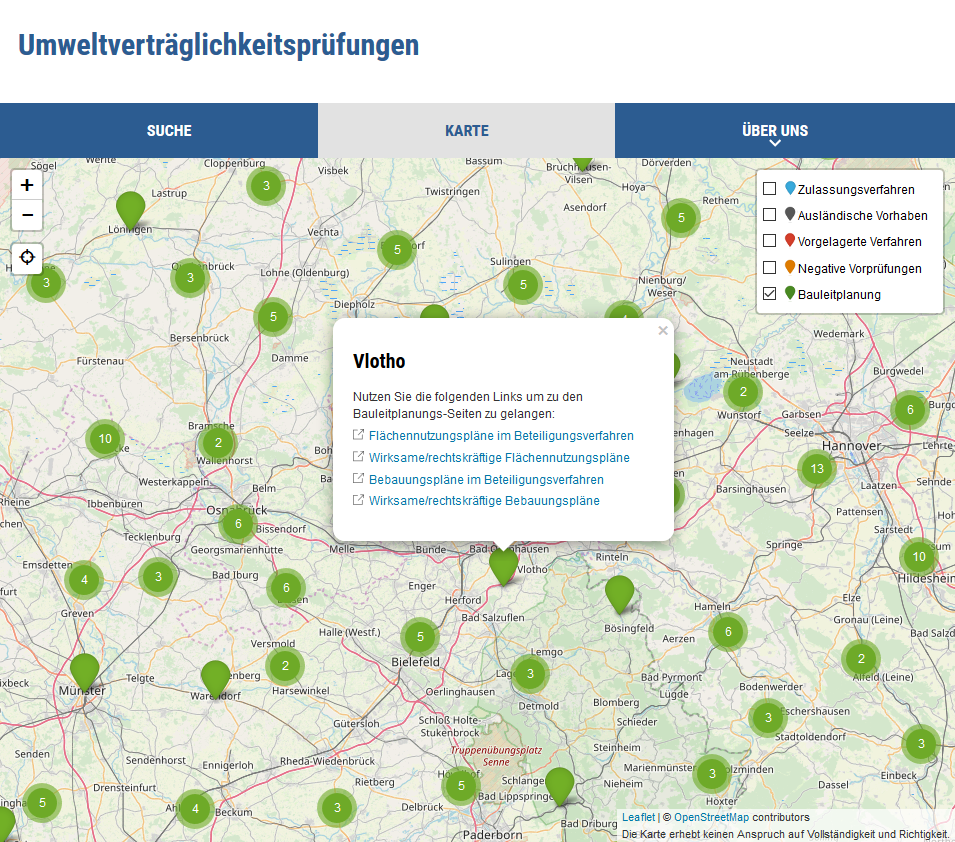

## Allgemeines

Das InGrid System wurde mit einem Profil ausgestattet, dass die Erfassung und Publizierung von Umweltverträglichkeitsprüfungen nach [EU UVP-Änderungsrichtlinie 2014/52/EU vom 16. April 2014](http://eur-lex.europa.eu/legal-content/DE/TXT/PDF/?uri=OJ:JOL_2014_124_R_0001&from=DE) ermöglicht.

Dadurch ist es möglich verschiedene Datensatztypen aus dem Umfeld der Umweltverträglichkeitsprüfungen zu erfassen:

* Verfahren (zu veröffentlichende Umweltverträglichkeitsprüfungen)
* negativ beschiedene Verfahren
* Vorgelagerte Verfahren
** Linienbestimmungen nach § 16 Bundesfernstraßengesetz oder Landesstraßenrecht
** Raumordnungsverfahren nach ROG mit UVP
* Ausländische Verfahren

Grundsätzliche Bestandteile des Editors wie z.B. die Nutzerverwaltung, der Veröffentlichungsworkflow bleiben erhalten.

Das Portal wurde angepasst, so dass die veröffentlichten Datensätze komfortabel recherchiert und in einer Karte dargestellt werden.

## Integration von Bauleitplanungsdaten

Das InGrid UVP-Portal ist in der Lage, Bauleitplanungsdaten zu integrieren. Dabei werden die Daten sowohl für die Suche indexiert als auch in der Karte dargestellt.

## Systemvoraussetzungen

* 1 GB RAM
* 20 GB Harddrive (Bei Upload von Dokumenten entsprechend mehr.)

* JAVA 8
* Cygwin (unter Windows)

## Bedienungsanleitung UVP Editor (uvp-verbund.de)

Eine Bedienungsanleitung steht unter [Downloadbereich InGrid](https://www.ingrid-oss.eu/latest/downloads.html) zur Verfügung. Dort finden Sie weitere Informationen und eine genaue Benuteranleitung.

