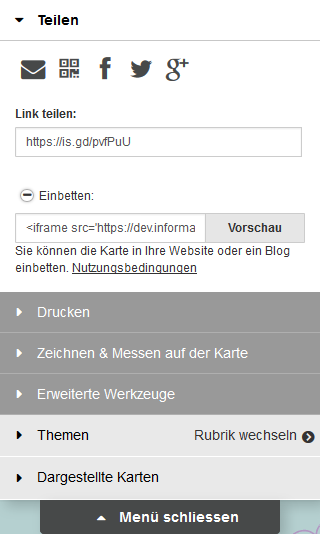
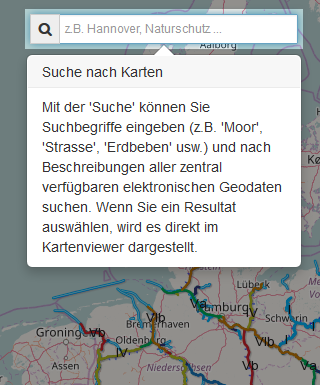

## Allgemeines

Der Webmap Client basiert auf den Schweizer-Client "geo.admin.ch" ([https://map.geo.admin.ch/](https://map.geo.admin.ch/)) und dient zur Darstellung von Kartenmaterial (z.B. WMS, KML, etc.) im Portal. Neben der Darstellung auf dem Desktop ist der Webmap Client, wie das Portal, auch für mobile Geräte geeignet.

Der Client wird über das Portal mit installiert und ist im Portal unter dem Menü-Eintrag "Karte" integriert. Der Webmap Client kann aber auch ohne das Portal aufgerufen werden:

- http://HOSTNAME/ingrid-webmap-client/frontend/prd/ (komprimierte Version)
- http://HOSTNAME/ingrid-webmap-client/frontend/src/ (unkomprimierte Version)

Im Webmap Client sind mehrere Frameworks/Technologien in einem vereint. So wird OpenLayers 3 verwendet um Interaktionen mit dem Kartenmaterial, wie z.B. diverse WMS oder KML Layer anzuzeigen, zu ermöglichen. Das User-Interface besteht aus den Java-Script Frameworks AngularJS und jQuery, aus den CSS-Tools Font-Awesome und Bootstrap und vieles mehr.

Zu den möglichen Interaktionen oder auch Funktionen des Webmap Clients können Sie in den nächsten Abschnitten mehr erfahren.  

## Frontend

Der Webmap Client hat zahlreiche Funktionen mit dem Umgang von Geodaten, von Darstellung von WMS Layern und KML bis zum Drucken und Zeichnen von Kartenmaterial. Die einzelnen Funktionen werden nun hier aufgelistet:

<a name="teilen"></a>
### Teilen

Über das Menü des WebMap Clients besteht die Möglichkeit Ihren Kartenzustand zu verbreiten:

 - E-Mail 
 - QR-Code
 - Soziales Netzwerk
 - Link
 - Integration per iFrame-Template

Ihr Kartenzustand bedeutet hierbei auch die von Ihnen hinzugefügten Layern (z.B. WMS, KML) oder auch Ihre Zeichnungen auf der Karte.



**E-Mail**

Um Ihren Kartenzustand per E-Mail zu teilen, können Sie den E-Mail-Button verwenden. 
Bei Betätigung des Buttons öffnet sich Ihr E-Mail-Programm oder Sie werden nach Ihrem E-Mail-Programm gefragt. Es wird Ihnen eine E-Mail mit dem Link des Kartenzustandes im Nachrichtenbereich breit gestellt. Geben Sie Empfänger und Betreff an und schon kann die E-Mail versendet werden.

**QR-Code**

In der heutigen Zeit ist auch der QR-Code gang und gäbe um Informationen zu verbreiten, vor allem durch die Zunahme von Smartphones und Tablets. Um z.B. Ihren Kartenzustand auf Ihr mobiles Gerät zu übertragen, erstellen Sie über den QR-Code-Button ein QR-Code und lesen Sie den QR-Code mit Ihrem Gerät/App aus.

**Soziale Netzwerke**

Gang und gäbe ist auch die Verbreitung von Informationen über das Soziale Netzwerk. Im Mapclient besteht die Möglichkeiten drei soziale Kanäle zu bedienen:

- Facebook
- Twitter
- Google+
- WhatsApp (nur unter Android und iOS)

Bei allen drei Netzwerken wird hierbei ein Link der Karte geteilt.

**Link**

Natürlich können Sie auch Ihre Karte per Copy-Paste kopieren. Hierfür existiert ein Bereich **Link Teilen** mit einem Textfeld in dem die URL der aktuellen Karte hinterlegt ist. 

**Einbetten**

Haben Sie eine eigene Webseite und möchten Sie Ihre Karte dort integrieren? So verwenden Sie den aufklappbaren Bereich 'Einbetten'. Auch hier wird Ihnen ein Textfeld angeboten mit einem iFrame-Template, welchen Sie kopieren können und in dem Source-Code Ihrer eigene Webseite hinzufügen können. Der Webmap Client bietet Ihnen auch an das generierte Template per Vorschau anzeigen zu lassen. Klicken Sie hierfür einfach den Button 'Vorschau' im Bereich 'Einbetten' und führen weitere Änderungen (z.B. Größe des iFrames) durch.


Die URL Ihres Kartenzustandes wird dabei immer durch ein URL-Shortener verkürzt. Mehr Informationen finden Sie [hier](#url-shortener).

<a name="drucken"></a>
### Drucken

Sie wollen Ihre Karte auf Papier bringen? Öffnen Sie hierfür im Menü den Bereich 'Drucken'. Hier können Sie ein PDF generieren lassen, welches dann ausgedruckt werden kann.

Wird das Drucken aktiviert, so wird in der Karte ein Ausschnitt hervorgehoben, der z.Zt. auf ein PDF hinterlegt werden würde. Diesen Ausschnitt können Sie anpassen, indem Sie z.B. die Karte verschieben, hinein- oder hinauszoomen oder auch im Druck-Menü den 'Massstab' anpassen.

Zusätzlich können Sie dem PDF neben dem Kartenausschnitt einen Titel, eine Beschreibung/Kommentar, die Legende der Layer oder auch ein Koordinatennetz hinzufügen und die Orientierung (Hoch-/Querformat) in den DIN A3 bzw. DIN A4 Größe ändern.


In dem generierten PDF wird neben Ihrem Kartenausschnitt anhand eines [URL-Shorteners](#url-shortener) die URL Ihres Kartenzustandes sowie ein [QR-Code](#qr-code) hinterlegt.

### Zeichnen & Messen

Unter dem Menüpunkt **Zeichnen & Messen** können Sie Ihre Kreativität freien laufen lassen, Anmerkungen setzen oder auch Strecken zu Ihrer Karte messen. Ihre Zeichnung können Sie anschließend auch als KML-Datei herunterladen, per Funktion Teilen verbreiten oder auch ausdrucken.


**Symbol**

Sie möchten (vordefinierte) Symbole auf die Karte legen, so wählen Sie die Funktion **Symbol** und markieren auf der Karte die Stelle, wo Ihr Symbol platziert werden soll. 

Anschließend erscheint das folgende Pop-Up:


Hier können Sie die Größe des Symbols, sowie das Symbol selbst ändern und auch dem Symbol eine Beschreibung vergeben.

**Text**

Sie möchten Ihre Karte mit Texten belegen, so wählen Sie die Funktion **Text** und markieren auf der Karte die Stelle, wo Ihr Text platziert werden soll. 

Anschließend erscheint das folgende Pop-Up:


Hier können Sie Ihren Text eingeben, aber auch die Textfarbe anpassen.

**Linie**

Sie möchten eine Linie oder eine Fläche auf Ihre Karte zeichnen, so wählen Sie die Funktion **Linie**. 

- Um eine Linie zu zeichnen, klicken Sie auf der Karte per Einfach-Mausklick an den Stellen, wie Ihre Linie verlaufen soll und beenden Ihre Linie mit Doppel-Mausklick.
- Um eine Fläche zu zeichnen, gehen Sie wie bei der Linie per Einfach-Mausklick vor und beenden Ihre Fläche, indem Sie Ihre Linien mit dem Startpunkt verbinden.

Anschließend erscheint das folgende Pop-Up:


Im Tab **Linie / Fläche** können Sie eine Beschreibung zu Ihrer Linie bzw. Fläche hinterlegen, aber auch die Farbe ändern. Im anderen Tab **Distanz / Fläche** sehen zu Informationen zu Ihrer gezeichneten Linie bzw. Fläche.

**Messen**

Sie möchten eine Strecke oder eine Fläche auf Ihre Karte messen, so wählen Sie die Funktion **Messen**. Sie können hier wie bei der Funktion Linie vorgehen um eine Strecke oder eine Fläche zu messen.

Anschließend erscheint das folgende Pop-Up:


Hier werden Ihnen Informationen zu Ihrer gezeichneten Strecke oder Fläche dargestellt. 

### Erweiterte Werkzeuge

Das Menü 'Erweitere Werkzeuge' beinhaltet Funktionen mit (externen) Layern. 

Hier können WMS- oder KML-Layer hinzugefügt werden oder auch der Karte hinzugefügten Layer verglichen werden. 


**Importieren**

Wird die Funktion 'Importieren' aktiviert, so erscheint ein Dialog in dem Sie (vordefinierte) Dienste (WMS/WMTS), KML, URL oder auch lokale Dateien laden können. 


Tragen Sie unter 'URL' eine URL zum WMS-Dienst ein (z.B. [http://atlas.wsv.bund.de/bwastr/wms](http://atlas.wsv.bund.de/bwastr/wms) ) ein oder wählen Sie einen vordefinierten Dienst über die Drop-Down-Liste aus und bestätitgen Ihren Eintrag bzw. Auswahl mit dem Button 'Verbinden'.

> Hinweis:
> Hat die URL keine Parameter 'REQUEST', 'SERVICE' oder 'VERSION, so werden Defaultwerte verwendet:
> - REQUEST = GetCapabilities
> - SERVICE = WMS
> - VERSION = 1.3.0

Wird der Dienst erfolgreich geladen, so erscheinen alle Layer des Dienstes in einer Tabelle. Hier stehen verschiedene Funktionen auf einem Layer zur Verfügung:

- Mit einer Auswahl eines Layers per Mausklick wird die Beschreibung (wenn vorhanden) des ausgewählten Layer im Bereich 'Beschreibung' angezeigt.
- Fährt man mit der Maus (Mouse-Over) über ein Layer aus der Liste, so wird der Layer geladen und auf der Karte dargestellt und verschwindet wieder, wenn der Mauszeiger nicht mehr über dem Layer liegt.
- Verwenden Sie die Lupe vor dem Layer-Titel um zum Layer-Bereich (Extent) zu springen.

Um einen Layer der Karte hinzuzufügen wählen Sie einen Layer per Mausklick aus und verwenden den Button 'Layer hinzufügen'. Anschließend werden Sie informiert, ob der ausgewählte Layer hinzugefügt wurde, in der Karte dargestellt und auch im Menü in der Liste unter dem Akkordeon 'Dargestellte Karten' hinzugefügt.

**Vergleichen**

Eine weitere Funktion unter dem Menü 'Erweiterte Werkzeuge' ist die Funktion 'Vergleichen'. Durch die Funktion lassen sich Layer, die unter Akkordeon 'Dargestellte Karten' aufgelistet werden, grafisch vergleichen.

Wird unter 'Dargestellte Karten' ein Layer aufgelistet und diese Funktion aktiviert, so erscheint auf der Karte eine rote Linie. 


Dabei wird der erste aktive Layer unter 'Dargestellte Karten' im linken Bereich angezeigt und im rechten Bereich ab der roten Linie "abgeschnitten". Dieses Verhalten bleibt auch bei, wenn Sie die Karte verschieben oder die rote Linie per gedrückt gehaltenem Mausklick verschieben.

Um die Funktion wieder zu deaktivieren, drücken Sie wieder auf die Funktion 'Vergleichen' und die rote Linie verschwindet wieder.

### Rubriken

In diesem Bereich werden Ihnen vordefinierte Rubriken in einer Baumstruktur angezeigt. Alle Einträge mit einer Checkbox sind hierbei Layer, die auf der Karte dargestellt werden können. 


Folgende Funktionen sind auf darstellbare Layer vorzufinden:

- Darstellung und Hinzufügen des Layers zur Karte über die Checkbox.
- Zoom auf Layer-Bereich (Extent) über die Lupe.
- Darstellung von Informationen (z.B. Legende) über den Info-Button.
- Vorschau des Layers auf der Karte über Mouse-Over.

Wird ein Layer der Karte hinzugefügt, so wird der Layer in der Baumstruktur rot markiert und unter 'Dargestellte Karten' aufgelistet.

Eine Anleitung zur Definition von Rubriken finden Sie unter [Definition von Rubriken](#definition-von-rubriken).

### Dargestellte Karten

Alle Layer, die Sie der Karte hinzugefügt haben, werden unter 'Dargestellte Karten' aufgelistet.


Auch hier hat jeder Layer mehrere Funktionen die ausgeführt werden können:

- Vorschau per Mouse-Over in der Karte
- Löschen des Layers aus der Karte über das 'x'.
- Ausblenden des Layers in der Karte per Checkbox.
- Sowie erweitere Funktionen über das Zahnrad:
    - Einstellbarkeit der Transparenz eines Layers
    - Zoom auf den Layer-Bereich (Extent)
    - Darstellung von Informationen (z.B. Legende) über den Info-Button.
    - Anordungen des Layers in der Kartenhierachie.
- Optional: Zeitabhängige Darstellung der Karte
- Optional: Karte kopieren bei zeitabhängige Karten
Sind mehrere Layer in der Liste der 'Dargestellten Karten', so ist der oberste Layer in der Liste auch der oberste Layer auf der Karte.

### Objekt-Informationen

Sie haben einen Layer aus den 'Dargestellten Karten' aktiviert und dieser wird in der Karte anzeigt. Nun möchten Sie die Objekt-Informationen angezeigt bekommen. So verwenden Sie die linke Maustaste um eine GetFeatureInfo-Abfrage auszulösen und bei erfolgreicher Anfrage wird Ihnen ein Dialog mit der Antwort der Abfrage angezeigt.


### Suchen

Auch eine Suche steht Ihnen im Webmap Client zur Verfügung. Dies Suche dient hilft Ihnen dabei Orte, Layer, Dienste und Bundeswasserstraßen zu finden und auf der Karte darzustellen. 



Unter der Suche werden verschiedene Dienste angefragt:

**Gehe nach**

Hier wird eine Ortssuche auf dem Dienst 'Nominatim' durchgeführt und alle Orte in Abhängigkeit mit Ihrem Suchbegriff aufgelistet. 

Per Mouse-Over über die Ergebnisliste werden Ihnen die Orte in der Karte markiert und bei Auswahl gelangen Sie zum Ort hin.

**Karte hinzufügen** 

Im Webmap Client definierte Layer (z.B. für die Rubriken) werden hier gefunden. Auch hier in der Ergebnisliste stehen Ihnen die gleichen Funktionen wie bei allen Layer zur Verfügung:

- Vorschau bei Mouse-Over
- Zoom zum Layer-Bereich (Extent)
- Informationen eines Layers

Wählen Sie einen Layer aus, so wird dieser in der Karte dargestellt und unter 'Dargestellte Karten' aufgelistet.

**Dienste hinzufügen** 

Treffer aus dieser Kategorie kommen aus der Opensearch-Schnittstelle. Hier werden Ihnen WMS Dienste zum Suchbegriff angezeigt. 

Wählen Sie hier einen Treffer aus, so werden alle Layer des Dienstes auf die Karte gelegt und können über 'Dargestellte Karten' angezeigt werden. 

**BWaStr Locator** 

Falls Sie nach Bundeswasserstraßen, wie z.B. Elbe, suchen, werden Sie hier fündig. Hier wird ein Dienst des ITZBund angefragt.

Wählen aus dieser Liste eine Bundeswasserstraße aus, so wird die gesamte Strecke der ausgewählten Wasserstraße in der Karte (rot) dargestellt. Sie können auch nur eine Teilstrecke anzeigen lassen. Tragen Sie hierbei unter 'Von' und 'Bis' gültige Werte eine, bestätigen Sie Ihre Angabe mit dem ">" und die Strecke wird in der Karte (blau) dargestellt.

Klicken Sie mit der Maus auf die markierte Strecke, so werden Ihnen weitere Informationen zu Bundeswasserstraße per Dialog angezeigt. Neben den Informationen besteht für Sie auch die Möglichkeit die angeklickte Strecke als CSV zu exportieren. 


### Karteninteraktionen

Natürlich finden Sie auch Funktionen mit dem man Interaktionen mit der Karte ausführen kann:

**Standortbestimmung**

Wählen Sie die Button mit dem schwarzen Punkt und eine Abfrage Ihres Standortes wird durchgeführt. Falls Sie die Standortfreigabe bestätigen, wird Ihr Standort in der Karte angezeigt.

**Hineinzoomen**

Nicht nur über das Zahnrad der Maus können Sie hineinzoomen, sondern auch über den Button '+' ist das Hineinzoomen möglich.

**Hinauszoomen**

Das gleich wie beim Hineinzoomen gilt auch für das Hinauszoomen.

**Zoom auf Ausgangsposition**

Falls Sie sich mal in der Karte verirrt haben, können Sie über den untersten Button (mit den gekreuzten Pfeilen) zur Ausgangsposition der Karte zurück wechseln und von vorne starten.

**Zeitregler**

Mit diesem Button kann der Zeitregler aktiviert werden. Dieser Button erscheint nur, wenn eine Karte unter "Dargestellte Karten" dies ermöglicht.

Mit dem Zeitregler können die Zeitstemplen der zeitabhängigen Karten verändert oder über einen "Play"-Button durchlaufen werden.


### Hintergrundkarten

Der Webmap Client stellt verschiedene Hintergrundkarten zur Verfügung.


Folgende Hintergrundkarten stehen Ihnen zur Auswahl:

- Kein Hintergrund
- Openstreetmap (OSM)
- BKG
- BKG Grau

Über diese Auswahlbox kann zwischen verschiedenen Hintergrundkarten gewechselt bzw. auch gar keine Hintergrundkarte angezeigt werden.

<a name="koordinatenanzeige"></a>
### Koordinatenanzeige

Darstellung der Koordinaten zur Mausposition.

**Drop-Down-Liste**


Fähren Sie mit der Maus über die Karte, so werden Ihnen im dargestellten Bereich, neben der Drop-Down-Liste der Projektionen, die zur Mausposition gehörenden Koordinaten in der Projektion Mercator angezeigt. 

Falls Sie die Koordinaten in einer anderen Projektion angezeigt bekommen haben möchten, so wählen Sie aus der Drop-Downliste die gewünschte Projektion aus und Ihre Koordinaten werden nun in dieser Projektion angezeigt.

**Dialog**

Um Ihnen Koordinaten einer bestimmten Mausposition in allen Projektionen der Drop-Down-Liste (siehe oben) darstellen zu lassen, verwenden Sie die rechte Maustaste und Ihnen werden im Tab **Koordinaten** alle Koordinaten in verschiedenen Projektionen dargestellt.

Im anderen Tab **BwaStr Locator** finden Sie ggfs. eine Station einer Bundeswasserstraße.


Zusätzlich erhalten Sie einen QR-Code mit dem Sie den Webmap Client mit den ausgewählten Koordinaten auf mobilen Geräte laden können.

### Weitere Funktion


**Vollbild**

Sie möchten den Webmap Client in Vollbild-Modus sehen, dann können Sie dies über die Funktion 'Vollbild' aktivieren. 

Um den Vollbild-Modus zu beenden, betätigen Sie die 'ESC'-Taste auf der Tastatur.

**Problem melden**

Sie haben Probleme mit dem Webmap Client. Informieren Sie uns über die Funktion 'Problem melden'. Wird diese Funktion betätigt, so erscheint ein Dialog, indem Sie folgendes Eintragen können:

- Ihre E-Mailadresse (freiwillig), z.B. für Rückfragen an Sie.
- Ihr Kommentar zum Problem.
- Dateien zum Problem hinzufügen, wie z.B. KML.

Falls Sie ein Problem senden, wird der Webmap Client-Verantwortlich per E-Mail informiert. 

**Hilfe**

Detailierte Hilfe zum Webmap Client.

**Mobile Version (nicht im Portal vorhanden)**

Um den Webmap Client in der mobilen Version anzeigen zu lassen, verwenden Sie die Funktion 'Mobile Version'. Das Layout des Webmap Clients ändert sich anschließend zur mobilen Version und die Darstellung von z.b. Menü und Hintergrundkarte ändert sich zur Desktop Version. 

**Sprachumschalter (nicht im Portal vorhanden)**

Sie wollen den Webmap Client z.B. in Englischer-Version sehen. Verwenden Sie einfach den Sprachumschalter und die Sprache des Webmap Clients wird geändert.

<a name="admin"></a>
## Admin-GUI

Die Admin-GUI verwaltet die Karten, Kategorien, Einstellungen, Hilfe und den Styles des Webmap Clients.

Aufgerufen wird die Admin-GUI mit der URL:

http://HOSTNAME/ingrid-webmap-client/admin/

### Karten

Unter dem Akkordeon "Karten" werden alle eingepflegten und darzustellenden Karten (WMS, WMTS) aufgelistet.

Aus WMS- oder WMTS-Diensten können Karten dem Webmap Client hinzugefügt, zu Kategorien zugeordnet, aus verschiedenen Karten eines WMS-Dienstes eine kombinierte Karte erstellt und einzelne Karten zu Ihren Bedürfnisse angepasst werden. 

Prüfen Sie auch die Liste der eingepflegten Karten nach fehlerhaften Karten (z.B. Dienst oder Karte nicht mehr erreichbar). So wird Ihnen in der Liste der Karten eine "i"-Symbol angezeigt, wenn ein Dienst oder eine Karte nicht mehr erreichbar ist.

- **Karten hinzufügen**

  - Verwenden Sie um neue Karten hinzuzufügen den Button "Dienst laden". 

  - Nach Verwendung des Buttons erscheint ein Pop-Up und in diesem Pop-Up können Sie nun einen WMS- oder WMTS-Dienst anhand seiner GetCapabilities-URL laden. Bei erfolgreichem Laden werden nun die einzelnen Karten eines Dienstes in einer  Baumstruktur (WMS) oder als Liste (WMTS) dargestellt.

    > Hinweis: Bei WMS werden automatisch die URL-Parameter "SERVICE=WMS", "VERSION=1.3.0" und/oder "REQUEST=GetCapabilities" der Dienst-URL hinzugefügt, falls diese Parameter nicht vorhanden sind. 

  - Handelt es sich bei Ihrem geladenen Dienst um einen passwortgeschützten Dienst, so wählen Sie die Checkbox "Login verwenden" aus und tragen hier Benutzername und Passwort ein. (siehe [Passwortgeschützte Karten](#können-passwortgeschützte-kartendienste-verwenden-werden))

    - Mit der Checkbox "Login ersetzen" können Sie bereits eingetragene Login-Daten für einen Dienst ersetzen.

    > Hinweis: Benutzername und Passwort werden für jeden Dienst in einer seperaten JSON-Datei auf den Server abgespeichert. Dies ist notwendig, damit im Webmap Client eine GetCapabilities-, GetMap-, GetLegend,- oder GetFeatureInfo-Anfrage über den eigene Server mit einer Authentifizierung durchgeführt werden kann. 

  - Nun können Sie einzelne Karten über die Checkbox auswählen und hinzufügen (Button "Hinzufügen") oder als kombinierte Karte (Button "Kombinieren und Hinzufügen") dem Webmap Client zur Verfügung stellen. Nach Betätigung eines dieser Button werden die neuen Karten am Anfang der Kartenliste hinzugefügt, sind aber keine Kategorie zugeordnet.

  - Möchten Sie Ihre Karten schon vorhandenen Kategorien zuorden, so wählen Sie aus der Auswahliste "Kategorie auswählen" eine Kategorie aus.

    - Öffnen Sie die Kategorie mit dem "+"-Button.

    -  Es erscheint nun die Kategorie in einer Baumstruktur. 
    
        > Hinweis: Da hier keine Unterkategorien angelegt werden können, müssen diese Unterkategorien schon vorher angelegt sein. 
       
    - Sind Unterkategorien vorhanden, so wählen Sie diese Unterkategorie aus und bestätigen Ihre Auswahl mit dem Button "Hinzufügen". Es können weitere Unterkategorien ausgewählt werden. 

    - Fügen Sie nun die Karten hinzu (Button "Hinzufügen" oder Button "Kombinieren und Hinzufügen") so werden die Karten auch automatisch den ausgewählten (Unter-)Kategorien zugeordnet.

  > Hinweis: Werden Karten hinzugefügt, erhalten die Karten eine eindeutige ID, d.h. möchte man die Karten mit der gleichen ID zu verschiedenen Kategorien hinzufügen, dann müssen die Kategorien alle in einen Schub ausgewählt werden und anschließend den Button "Hinzufügen" oder Button "Kombinieren und Hinzufügen" betätigen. Ansonsten besteht die Möglichkeit die Karten manuell über das Akkordeon "Kategorien" den jeweiligen (Unter-) Kategorien zuzuordnen.

  - Die Checkbox "Gruppenlayer als Ordner laden" (über Auswahl "Kategorie auswählen") ermöglich es Ihnen die Gruppenlayer zu ignorieren, Gruppenlayer werden weder als einzelne Layer noch bei kombinierten Layer verwendet, und bei einem Zuordnen zu einer Kategorie zu einem Ordner geändert und in der Kategorie hinterlegt.

  

- **Karten löschen**

  Für das Löschen von eingepflegten Karten gibt es drei Möglichkeiten: 

  - **Karte einzeln löschen**

    Klicken Sie auf das Akkordeon einer Karte. Nach dem Öffnen des Akkordeons erscheint nun ein Button "Löschen". Mit diesem Button wird eine einzelne Karte entfernt. Mit Bestätigung des Löschvorgangs wird die Karte entfernt.

    > Hinweis: Werden Karten entfernt, so wird geprüft, ob die Karte einer Kategorie zugeordnet wurde und auch dort entfernt.

    

  - **Ausgewählte Karten löschen**

    Wählen Sie Karten aus den Listen über die Checkbox aus und betätigen Sie den Button "Auswahl löschen". Mit Bestätigung des Löschvorgangs werden die Karten entfernt.

    > Hinweis: Werden Karten entfernt, so wird geprüft, ob die Karte einer Kategorie zugeordnet wurde und auch dort entfernt.

    

  - **Alle Karten löschen**

    Mit Hilfe des Buttons "Alles löschen" werden alle Karten entfernt.

    > Hinweis: Werden Karten entfernt, so wird geprüft, ob die Karte einer Kategorie zugeordnet wurde und auch dort entfernt.

    

- **Karten suchen**

  Die Liste der Karten kann auf Dauer sehr lang und unübersichtlich werden.

  Eine Abhilfe kann hier das Suchfeld schaffen. Nach Eingabe eines Suchbegriffs wird die Liste nach Titel/Label einer Karte gefiltert.

  

- **Filtern nach ...**

  Weitere Filtermöglichkeiten der Liste finden Sie beim betätigen des Button rechts neben dem Suchfeld. Hierbei öffnet sich ein weiterer Bereich mit verschiedenen Auswahlmöglichkeiten, die die Liste der eingepflegten Karten begrenzt.

  * Filtern nach Kategorien
  
    Hier werden die Karten angezeigt die auch in der ausgewählten Kategorie eingebunden sind.

  * Filtern nach Karten-Typ

    Begrenzen können Sie auch die Liste nach dem Karten-Typ, also WMS oder WMTS.

  * Filtern nach fehlerhaften Karten

    Die Liste wird nach fehlerhaften Karten gefiltert, also Karten deren Dienst nicht mehr erreichbar ist oder in der GetCapabilities des Dienstes nicht mehr als Layer aufgelistet werden. 
    
    Ist eine Karte fehlerhaft so wird dies in der Liste der eingepflegten Karte anhand eines "i"-Symbol angemerkt. 
    
    (siehe [Fehlerhafte Karten](#fehlerhafte-karten) )

- **Karten bearbeiten**

  Eingepflegte Karten können auch bearbeitet werden und dabei die Default-Werte aus der GetCapabilities des zugehörigen Dienstes manipulieren.

  In der Bearbeitungsansicht der Karten existiert zu jeder Eigenschaft eine kurze Info über den "i"-Button.

  Es gibt zwei Typen von Karten die bearbeitet werden können:

  * WMS
  * WMTS

  | Typ | Eigenschaft | Info | Default |
  |-------------|--------------|----------|----------|
  | **Gemeinsam** |
  || Typ | Hier wird Ihnen der Typ Ihrer Karte angezeigt. Dieser Wert ist nicht veränderbar.| Wert aus der GetCapabilities des zugehörigen Dienstes.|
  || ID | Hier haben Sie die Möglichkeit die eindeutige ID der Karte individuell anzupassen. <br><br> Diese ID wird beim Aufruf der Karte im Webmap Client im Parameter "layers" referenziert und wird auch benötigt um eine Karte zu einer Kategorie (siehe [Kategorien]("#kategorien")) zuzuweisen. | Die eindeutige ID zu einer Karte wird beim Importieren einer Karte aus seinem Dienst automatisch genieriert.
  || Version | Bestimmen Sie hier die Version Ihrer Karte. Eine Auswahl der Werte "1.1.1" und "1.3.0" steht zu Auswahl. | Wert aus der GetCapabilities des zugehörigen Dienstes.
  ||Label|Bearbeiten Sie hier den Titel Ihrer Karte. <br><br> Hinweis: Der Titel wird z.B. in der Ergebnisliste bei Suche im Webmap Client angezeigt.| Wert aus der GetCapabilities des zugehörigen Dienstes.
  ||Extent|Passen Sie hier das Extent Ihrer Karte an.  <br><br>  Hinweis: Die eingetragenen Koordinaten müssen in der Projektion "EPSG:4326/WGS-84" eingetragen werden. | Wert aus der GetCapabilities des zugehörigen Dienstes.
  ||Kachel-Größe| Geben Sie hier die gewünschte Kachel-Größe Ihrer Karten ein. | 256
  ||Hintergrundkarte| Bestimmen Sie hier, ob Ihre Karte als Hintergrundkarte verwendet werden kann. <br><br> Hinweis: In den Kategorien werden die Hintergrundkarten zugewiesen. (siehe [Kategorien]("#kategorien"))| false
  ||Hintergrundkartenbild| Wählen Sie ein Hintergrundbild für Ihre Hintergrundkarte aus, welches beim Hintergrundkarten-Umschalter im Frontend angezeigt werden soll und laden Sie dieses Bild hoch. Die optimale Größe des Bildes ist 90 x 58 Pixel. Nach dem Speichern werden automatisch die CSS-Styles für das Frontend angepasst. Beim Aktualisieren des Hintergrundbildes einer Karte wird das alte Bild ersetzt. | 
  ||Format| Definieren Sie das Bild-Format der GetMap-Anfrage. (png, jpeg, etc.) | Wert aus der GetCapabilities des zugehörigen Dienstes.
  ||Suchbarkeit| Lassen Sie die Karte über die Suche im Webmap Client auffinderbar machen. | true
  ||Cross Origin | Liefert Ihre Karte bei einer GetMap-Anfrage im Response-Header "Access-Control-Allow-Origin: *" oder "Access-Control-Allow-Origin: <IHRE-DOMÄIN>", so können Sie hier den Wert auf "true" setzten und im Webmap Client werden vorhandenen GetFeatureInfos beim überfahren der Maus auf Ihrer Karte als Handsymbol angezeigt und sind auf der Karte somit einfacher auffindbar.| false
  ||Highlightable|Aktivieren Sie die Eigenschaft 'highlightable'.| false
  ||Zeitabhängige Darstellung aktivieren|Aktivieren Sie die zeitabhängige Darstellung der Karte. Umd diese Funktion verwenden zu können, muss in der GetCapabilities des Dienstes die Karte einen Eintrag 'dimension name="time"' enthalten. <br><br>Hinweis: Im Webmap Client wird ihnen dann rechts in der Karte eine neues Control für die Darstellung von Zeitständen angezeigt.| 
  ||Zeitstempeln definieren|Tragen Sie die Zeitstempeln der Karte ein. Zurzeit können nur jährliche Zeitreihenfolgen angegeben werden. <br><br> Hinweis: Achten Sie auf das Format des Zeitstempels.|
  ||Default Zeitstempel| Legen Sie den Zeitstempel fest, welcher per Default angezeigt wird. Neben den Zeitstempel kann auch "last" für die Darstellung des ersten Eintrages der Zeitstempelliste und "all" für alle Einträge der Zeitstempelliste.| last
  ||Legende aktivieren|Aktivieren Sie die Einstellung, wenn die Karte eine Legende hat oder eine Legende per GetLegend-Anfrage aufgerufen werden soll.|true
  ||Legenden-URL|Definieren Sie die URL der Karten-Legende, ansonsten wird ein GetLegenden-Request ausgeführt.|Wert aus der GetCapabilities des zugehörigen Dienstes.
  ||Attribution|Tragen Sie den Titel für die URL unter 'attributionUrl'ein. Wird diese Karte im Webmap Client aktiviert, so wird in der Karte unten rechts ein Link dargstellt.<br><br>Hinweis: Wird im Webmap Client unten rechts angezeigt, wenn die Karte aktiv ist.| Wert aus der GetCapabilities des zugehörigen Dienstes. <br>WMS:<br>...<br>```<Service>```<br>...<br>``` <ContactInformation>```<br>```<ContactOrganization>Attribution</ContactOrganization>```<br>....<br><hr/>WMTS:<br>...<br>```<ServiceProvider>```<br>...<br>```<ProviderName>Attribution</ProviderName>```<br>...<br>Hinweis: Dieser Wert wird bei jedem Update-Job aktualisiert.
  ||Attribution-URL|Tragen Sie hier die URL für weitere Infos zur aktivierten Karte ein. <br><br>Hinweis: Wird im Webmap Client unten rechts angezeigt, wenn die Karte aktiv ist. |  Wert aus der GetCapabilities des zugehörigen Dienstes. <br>WMS:<br>...<br>```<Service>```<br>```<OnlineResource xlink:href="Attribution-URL"/>```<br>...<br><hr/>WMTS:<br>...<br>```<ServiceProvider>```<br>```<ProviderSite xlink:href="Attribution-URL"/>```<br>...<br>Hinweis: Dieser Wert wird bei jedem Update-Job aktualisiert.
  ||Tooltip| Aktivieren Sie die GetFeature-Info-Abfrage, falls es die Karte erlaubt. | Wert aus der GetCapabilities des zugehörigen Dienstes.
  ||Transparenz|Definieren Sie die per default dargestellte Transparenz der Karte.| 1
  ||Login|Haben Sie die Karte über einen passwortgeschützten Dienst geladen, so wird unter Login der Benutzername des Dienstes angezeigt. <br><br> Anhand dem Login und der Dienst-URL wird das gespeicherte Passwort ermittelt und die Karte wird über den eigenen Server mit Authentifizierung geladen.|
  ||Query-Layers|Layers die bei einer GetFeatureInfo-Anfrage abgefragt werden sollen. Nur bei aktiver Checkbox "Tooltip" sichtbar. Mehrere Layer werden kommagetrennt aufgelistet. | Layers für die GetMap-Anfrage.
  ||Feature-Count|Anzahl an Features die bei einer GetFeatureInfo-Anfrage für die Karte(n) abgefragt werden sollen. Nur bei aktiver Checkbox "Tooltip" sichtbar. Wert sollte größer als 0 sein. | 10
  | **WMS** |
  ||WMS-URL|Tragen Sie hier die Dienst-URL Ihrer Karte ein. Anhand dieser URL werden diverse Anfrage, wie z.B. GetCapabilities, GetMap, GetFeatureInfo, etc. durchgeführt.| Wert aus der GetCapabilities des zugehörigen Dienstes.
  ||WMS-Layers| Tragen Sie hier den 'NAME' der dazustellenden Karte ein. Mehrere Karten werden kommagetrennte aufgelistet. <br><br>Hinweis: Zusammengesetzte Karten per kommagetrennt können im Webmap Client nur zusammen dargestellt werden.| Wert aus der GetCapabilities des zugehörigen Dienstes.
  ||Gutter|Definieren Sie den ignorierten Rand (in Pixel) um die Karten-Tiles. | 0
  ||Single Tile| (De-)aktivieren Sie hier den Aufruf Ihrer Karte in Kacheln. | false
  ||Min-Scale|Definieren Sie einen Min-Scale der Karte.|Wert aus der GetCapabilities des zugehörigen Dienstes.
  ||Max-Scale|Definieren Sie einen Max-Scale der Karte.|Wert aus der GetCapabilities des zugehörigen Dienstes.
  ||Style|Legen Sie ein 'styles'-Parameter für die GetMap-Abfrage fest, falls notwendig.|
  | **WMTS** |
  ||Service-URL| Tragen Sie hier die WMTS-ServiceMetadataURL ein.| Wert aus der GetCapabilities des zugehörigen Dienstes.
  ||Template|Tragen Sie hier die WMTS-ResourceURL ein.| Wert aus der GetCapabilities des zugehörigen Dienstes.
  ||MatrixSet|Definieren Sie den TileMatrixSet Identifier der Karte.|Wert aus der GetCapabilities des zugehörigen Dienstes.
  ||Layername|Tragen Sie hier den Layer-Name für Ihre Karte ein.| Wert aus der GetCapabilities des zugehörigen Dienstes.
  ||RequestEncoding|Tragen Sie den Request-Encoding der Karte für GetTile fest, z.B. 'REST' oder 'KVP'.|Wert aus der GetCapabilities des zugehörigen Dienstes.
  ||Style|Legen Sie ein 'style'-Parameter für die GetMap-Abfrage fest, falls notwendig.|Wert aus der GetCapabilities des zugehörigen Dienstes.
  ||Origin|Tragen Sie aus dem TileMatrixSet den TopLeftCorner der Karte ein.|Wert aus der GetCapabilities des zugehörigen Dienstes.
  ||Scales|Tragen Sie aus dem TileMatrixSet den TileMatrix-ScaleDenominator der Karte ein.|Wert aus der GetCapabilities des zugehörigen Dienstes.
  ||FeatureInfoTpl|Tragen Sie hier das Template für die GetFeatureInfo ein. | Wert aus der GetCapabilities des zugehörigen Dienstes.

  

> Falls Sie das Konfigurationsverzeichnis des Webmap Clients außerhalb des Portal-Verzeichnisses, also nicht als ein Unterordner des Portal-Verzeichnisses, festgelegt haben, so bleiben die eingepflegten Karten auch für zukünftige Portal-Updates erhalten.

### Kategorien

- **Kategorien hinzufügen**

  - Verwenden Sie um eine neue Kategorie hinzufügen den Button "Neue Kategorie". 

  - Nach Verwendung des Buttons erscheint ein Pop-Up und in diesem Pop-Up können Sie nun eine neue Kategorie anlegen.
  
    - ID: Eindeutige ID der Kategorie
  
    - Label: Titel der Kategorie
  
    - Tooltip: Tooltip der Kategorie im Webmap Client

    - Kategorienbild:  Wählen Sie ein Kategorienbild für Ihre Kategorie aus, welches beim Kategorien-Umschalter im Frontend angezeigt werden soll. 
      > Hinweis: Die optimale Größe des Bildes ist 140 x 60 Pixel. Nach dem Speichern werden automatisch die CSS-Styles für das Frontend angepasstf. Beim Aktualisieren des Kategorien-Bildes einer Kategorie wird das alte Bild ersetzt. 

  - Mit dem "Speichern"-Button wird die Kategorie hinzugefügt. 

- **Kategorien löschen**

  Analog zu den "Karten" können die Kategorien gelöscht werden:

    - Einzeln löschen bei Öffnen einer Kategorie.

    - Ausgewählte Kategorien über die Checkbox löschen

    - Alle Kategorien löschen

- **Kategorien suchen**

  Mit dem Suchfeld in der Navigationsleiste des Akkordeon "Kategorien" können Sie nach Kategorien per ID suchen.

<a name="kategorie"></a>
**Kategorie**

- **Kategorien bearbeiten**

  Haben Sie eine Kategorie in der Liste ausgewählt, so können Sie über den Button-"Bearbeiten" diese Kategorie bearbeiten:

  - Die "ID" kann nicht angepasst.

    > Hinweis:
    > Im Akkordion [Style](#style) müssen ggf. weitere Anpassungen durchgeführt
    > - wenn man der Kategorie im Webmap Client in der Auswahl "Thema wechseln" ein anderes Bild vergeben möchte. [siehe auch](#kann-man-die-themen-bilder-unter-thema-wechseln-anpassen)

  - Ändern Sie Ihren Titel über den Eintrag "Label".

  - Ändern Sie Ihren Tooltip über den Eintrag "Tooltip".

    > Hinweis:
    > Dieser Tooltip wird im Webmap Client in der Auswahl "Thema wechseln" benötigt und dargestellt. (Mouse-Over über eine Kategorie)

  - Ändern Sie das Kategorienbild für Ihre Kategorie
  
    > Hinweis: Die optimale Größe des Bildes ist 140 x 60 Pixel. Nach dem Speichern werden automatisch die CSS-Styles für das Frontend angepasstf. Beim Aktualisieren des Kategorien-Bildes einer Kategorie wird das alte Bild ersetzt. 

  - Passen Sie die Auswahl an Hintergrundkarten an, indem Sie über die Liste Karten hinzufügen, entfernen oder sortieren. Die Reihenfolge in der Liste entspricht im Webmap Client die Reihenfolge der Auswahlmöglichkeiten von Rechts nach Links.

    > Hinweise:
    > - In der Liste der Karte, werden nur Karten mit der Eigenschaft "Hintergrundkarte" aufgelistet.
    > - "osmLayer" ist ein OpenLayers-Layer und funktioniert nur in der Projektion "EPSG:3857" einwandfrei.
    > - "kein Hintergrund" wird immer im Webmap Client als Hintergrund-Auswahl hinzugefügt
    > - Im Akkordion [Style](#style) müssen ggf. weitere Anpassungen durchgeführt werden, wenn man der Hintergrundkarte eine [Reihenfolge](#kann-man-die-reihenfolge-der-hintergrundkarten-auswahl-anpassen) oder ein anderes [Bild](#kann-man-die-bilder-für-die-hintergrundkarten-auswahl-anpassen) vergeben möchte.

  - Setzen Sie hier aus der Liste "Hintergrundkarte" Ihre Default-Hintergrundkarte fest.

  - Unter "Selektierte Karten" können Sie Karten hinzufügen die im Webmap Client per Default im Akkordeon "Dargestellte Karten" hinzugefügt sind. 

  - Unter "Aktivierte Karten" können Sie Karten hinzufügen die im Webmap Client per Default im Akkordeon "Dargestellte Karten" hinzugefügt, ausgewählt und in der Karte dargestellt werden. 

  Zudem können Sie nun der Kategorien Unterkategorien hinzufügen:

  -  Über den "+"-Button werden erscheint ein Pop-Up. 

  - Hier können Sie nun einen Titel für die Unterkategorie festlegen. 

  - Optional: Können Sie der Unterkategorie eine Karte zuweisen. 

  - Bei Auswahl der neu erstellten Unterkategorie bearbeitet, gelöscht oder weitere Unterkategorien/-Karten hinzugefügt werden.

  (Unter-)kategorien verschieben:

  Verwenden Sie die Drag & Drop-Funktion um (Unter-)kategorien zu verschieben. Hierzu wählen Sie eine (Unter-)kategorien aus, halten gedrückt die linke Maustaste, Verschieben die Maus zur gewünschten (Unter-)kategorien und lassen die Maustaste wieder los.

- **Kategorien kopieren**

  Über den "Kopieren"-Button können Sie die aktuelle geöffnete Kategorie duplizieren. Bei Verwendung des Buttons erscheint ein Popup-Fenster mit den Einstellungen der zu kopierenden Kategorie.

  Tragen Sie nun eine eindeutige und noch nicht existierenden ID ein. Sie werden darauf hingewiesen, falls Sie eine existierende Kategorien-ID eingetragen haben.
  
  Passen Sie auch den Label/Titel der neuen Kategorie an. Dieser Label sollte ebenfalls auch eindeutig und noch nicht existieren. (Kann zu Probleme im Frontend führen.)

  Ansonsten stehen Ihnen weitere Einstellungen, wie z.B. Hintergrundkarten, per Default selektierte Karten, etc., zur Verfügung die Sie individuell anpassen können.

- **Kategorien aktualisieren**

  Mit dem "Aktualisieren"-Button können Sie den aktuell sichtbaren Kategorien-Baum.

> Falls Sie das Konfigurationsverzeichnis des Webmap Clients außerhalb des Portal-Verzeichnisses, also nicht als ein Unterordner des Portal-Verzeichnisses, festgelegt haben, so bleiben die eingepflegten Kategorien auch für zukünftige Portal-Updates erhalten.

<a name="kategoriebaum"></a>
**Kategorie-Baum**

- **Hinzufügen**

  Fügen Sie der Kategorie einen Ordner hinzu. Geben Sie dem Ordner einen Titel und wählen Sie ggfs. dem Ordner eine Karte aus. Diese Einstellungen können Sie auch später wieder bearbeiten.

- **Karten-Zuordnung entfernen**

  Haben Sie über die Checkboxen vor den Karten bzw. Ordnern eine Auswahl getroffen, so können Sie mit diesem Button die zugeordnete Karte zu jeder Auswahl entfernen. 

- **Auswahl löschen**

  Haben Sie über die Checkboxen vor den Karten bzw. Ordnern eine Auswahl getroffen, so können Sie mit diesem Button Ihre Auswahl aus der Kategorie löschen.

### Einstellungen

Unter Einstellungen können Sie Ihren Webmap Client individuell nach Ihren Anforderungen anpassen.

Zu jeder einzelnen Einstellung existiert ein Button "i" um detailierte Informationen zu einer Hilfe vorzuweisen.

Folgende Einstellungen sind möglich:

|Einstellung|Info|Default|
|-------------|--------------|----------|
|**Default Kategorie**|Wählen Sie eine Kategorie aus, welches per Default (sofern in der URL des Webmap Clients mit dem Parameter "topic" nichts anderes festgelegt wurde) im Menü des Webmap Clients ausgewählt und angezeigt wird.<br><br>Hinweis: Eine Auswahl an Kategorien ist nur dann möglich, wenn unter dem Akkordeon "Kategorien" auch Kategorien angelegt wurden.| themen |
|**EPSG / Projektion**| Legen Sie hier die Projektion der Kartendarstellung im Webmap Client fest. <br><br> Nicht alle Projektion werden unterstützt, da der Webmap Client nicht alle Projektionen supported und ggf. erweitert werden muss. Unterstützte Projektionen sind: <br><br> - EPSG:3857<br> - EPSG:4326<br> - EPSG:31466<br> - EPSG:31467<br> - EPSG:31468<br> - EPSG:31469<br> - EPSG:25832<br> - EPSG:25833<br><br> Hinweis: Achten Sie darauf, das Ihre verwendeten WMS- und WMTS-Dienste die Projektion unterstützten.| EPSG:3857
|**Initiale Ausdehnung (WGS84)**|Legen Sie den Kartenausschnitt fest, welchen Bereich der Karte per Default (sofern in der URL des Webmap Clients mit dem Parameter "E", "N" und "zoom" nichts anderes festgelegt wurde) im Webmap Client dargestellen werden soll. <br><br>Die Koordinaten des Bereiches müssen in der Projektion EPSG:4326/WGS-84 festgelegt werden. <br><br>Hinweis: Die Koordinaten des definierten Bereiches werden im Webmap Client auch bei dem Button "Auf initiale Kartenausdehnung" (rechts unter den Zoom-Buttons) verwendet.| [0.42587260523, 46.9672880527, 15.7908768234, 55.1764096793]|
|**Maximale Ausdehnung (WGS84)**| Der Webmap Client unterstützt nicht alle Projektionen und zu manchen Projektion kennt der Webmap Client auch nicht das Extent einer Projektion, z.B. bei "EPSG:25832".<br><br>Kennt der Webmap Client nicht das Extent der Default-Projektion  (siehe oben), so kann man mit dieser Einstellung den Extent in EPSG:4326/WGS-84 festlegen bzw. redefinieren. So ist es auch möglich die Darstellung der Karte im Webmap Client auf einen bestimmten Bereich einzugrenzen.| [0.42587260523, 46.9672880527, 15.7908768234, 55.1764096793]|
|**Sprache**| Legen Sie hier die unterstützten Sprachen des Webmap Clients fest. Tragen Sie hierfür das Länderkürzel ein und fügen Sie es der Liste der Sprache hinzu oder entfernen Sie Sprachen.<br><br>Existierte eine Sprache die der Webmap Client noch nicht unterstützt, so wird die deutschsprachige Lokalisierung und Hilfe kopiert und verwendet.<br><br>Hinweis: Eine Anpassung der Lokalisierung in der Admin-GUI existiert noch nicht.| [“de”, “en”]|
|**Dienst für den URL-Shortener**|Legen Sie den Dienst um die URL Ihres Webmap Clients zu verkürzen. Die URL des Webmap Clients spiegelt den aktuellen Zustand Ihres Webmap Clients wieder. Dieser Dienst wird z.B. beim Druck oder unter dem Akkordeon "Teilen" im Webmap Client verwendet. <br><br>Ihr Dienst muss ein JSON zurückliefern.<br><br> Hinweis: Entfernen Sie den Eintrag, so wird keine URL verkürzt und in den verwendeten Funktionen wird die komplette URL Ihres Webmap Clients angezeigt.| https://is.gd/create.php?format=json|
|**Dienstsuche (Opensearch)**|Verwenden Sie die InGrid-Opensearch-Schnittstelle um nach WMS-Diensten zu suchen und im  Webmap Client zu visualisieren.<br><br>Hinweis: Entfernen Sie den Eintrag und für die Suche wird der Dienst ignoriert.| 
|**Zoomstufe für Locationsuche**|Legen Sie Ihre die Zoomstufe für die Ortsuche fest. Wird nach der Suche eine Ort ausgewählt, dann springt der Webmap Client zu diesem Ort mit der definierten Zoomstufe.<br><br> Hinweis: Für die Ortsuche wird Nominatim (nächster Eintrag) verwendet.| 10
|**Dienst-URL Nominatim**|Tragen Sie hier die URL für die Ortsuche ein. <br><br>Ihr Dienst muss ein JSON zurückliefern. <br><br> Hinweis: Entfernen Sie den Eintrag und für die Suche wird der Dienst ignoriert.| https://nominatim.openstreetmap.org/search?format=json%26countrycodes=de|
|**Dienst-URL BWaStr-Locator**|Möchten Sie den BWaStr-Locator in der Suche, um nach Bundeswasserstraßen zu suchen, verwenden, so tragen Sie hier die zugehörige Dienst-URL ein. <br><br> Hinweis: Entfernen Sie den Eintrag und für die Suche wird der Dienst ignoriert. | https://atlas.wsv.bund.de/bwastr-locator/rest/bwastrinfo/query?limit=200%26searchfield=all|
|**Dienst-URL BwaStr-Locator (Geo)**|Zugehörig zu der Funktion "Dienst-URL BWaStr-Locator" können Sie hier die Dienst-URL für die Geokodierung von Bundeswasserstraßen eintragen.<br><br>Hinweis: Entfernen Sie den Eintrag und der Dienst ignoriert. | https://atlas.wsv.bund.de/bwastr-locator/rest/geokodierung/query|
|**Dienst-URL BwaStr-Locator (Station)**|Zugehörig zu der Funktion "Dienst-URL BWaStr-Locator" können Sie hier die Dienst-URL für die Stationierung von Bundeswasserstraßen eintragen.<br><br>Hinweis: Entfernen Sie den Eintrag und der Dienst ignoriert.| https://atlas.wsv.bund.de/bwastr-locator/rest/stationierung/query|
|**URL zum Problem melden** (ab Version 5.5.1) |Tragen Sie hier die URL zu Ihrer "Problem melden"-Seite ein. Im Webmap Client wird der Link oben rechts dargestellt.| Integrierte Funktion wird verwendet|
|**URL zur Hilfe** (ab Version 5.5.1) |Tragen Sie hier die URL zu Ihrer Hilfe-Seite ein. Im Webmap Client wird der Link oben rechts dargestellt.| /hilfe?hkey=maps-1|
|**Copyright URL**|Tragen Sie hier die URL zu Ihrer Copyright-Seite ein. Im Webmap Client wird der Link unter rechts dargestellt.| /impressum|
|**Sitemap URL**|Tragen Sie hier die URL zu Ihrer Sitemap-Seite ein. Im Webmap Client wird der Link unter rechts dargestellt.|/inhaltsverzeichnis|
|**Verwendung von Geodesic**|(De-)aktivieren Sie hier die Verwendung von Geodesic zum Messen in Ihrem Webmap Client ein.| true|
|**Default Mauszeiger-Projektion**| Passen Sie die Liste der Projektionen an, die im Webmap Client zur Auswahl der Maus-Zeiger-Koordinaten und im Positions-Popup (Rechtsklick auf Karte) zur Verfügung stehen, indem Sie die Reihenfolge ändern, Einträge entfernen und/oder hinzufügen. <br><br> Hinweis: Wie auch unter Punkt "EPSG / Projektion" schon hingewiesen, werden nicht alle Projektionen unterstützt und es muss ggfs. im Webmap Client Anpassungen durchgeführt werden.|['EPSG:3857', 'EPSG:4326', 'EPSG:31466', 'EPSG:31467', 'EPSG:31468', 'EPSG:31469', 'EPSG:25832', 'EPSG:25833']|
|**Default Dienstauswahlliste beim Import**|Passen Sie die Liste der Dienste an, die im Webmap Client zur Vorauswahl beim Importieren von Kartendienste (WMS, WMTS, KML) zur Verfügung stehen, indem Sie die Reihenfolge ändern, Einträge entfernen und/oder hinzufügen.| ["http://atlas.wsv.bund.de/bwastr/wms?VERSION=1.1.1", "http://atlas.wsv.bund.de/ienc/wms?",   "http://atlas.wsv.bund.de/wadaba/wms?", "http://atlas.wsv.bund.de/bwastr/wmts/1.0.0/WMTSCapabilities.xml", "http://atlas.wsv.bund.de/ienc/wmts/1.0.0/WMTSCapabilities.xml"]|
|**Teile per Facebook**| (De-)aktivieren Sie das Teilen Ihres Webmap Client-Zustand per Facebook. Die Funktion steht Ihnen im Webmap Client-Menü unter dem Akkordeon "Teilen" zur Verfügung. Hierbei wird die URL des Webmap Client versendet. Falls ein URL-Shortener verwendet wird, dann die Short-URL. | true|
|**Teile per E-Mail**| (De-)aktivieren Sie das Teilen Ihres Webmap Client-Zustand per E-Mail. Die Funktion steht Ihnen im Webmap Client-Menü unter dem Akkordeon "Teilen" zur Verfügung. Hierbei wird die URL des Webmap Client versendet. Falls ein URL-Shortener verwendet wird, dann die Short-URL. | true|
|**Teile per Google+**| (De-)aktivieren Sie das Teilen Ihres Webmap Client-Zustand per Google+. Die Funktion steht Ihnen im Webmap Client-Menü unter dem Akkordeon "Teilen" zur Verfügung. Hierbei wird die URL des Webmap Client versendet. Falls ein URL-Shortener verwendet wird, dann die Short-URL. | true|
|**Teile per Twitter**| (De-)aktivieren Sie das Teilen Ihres Webmap Client-Zustand per Twitter. Die Funktion steht Ihnen im Webmap Client-Menü unter dem Akkordeon "Teilen" zur Verfügung. Hierbei wird die URL des Webmap Client versendet. Falls ein URL-Shortener verwendet wird, dann die Short-URL.| true|
|**Teile per iFrame**| (De-)aktivieren Sie das Teilen Ihres Webmap Client-Zustand per Twitter. Die Funktion steht Ihnen im Webmap Client-Menü unter dem Akkordeon "Teilen" zur Verfügung. Hierbei wird ein HTML-iFrame Schnipsel mit dem aktuellen Zustand des Webmap Client erzeugt, welches kopiert und in HTML-Seiten integriert werden kann.| true|
|**Teile per Link**| (De-)aktivieren Sie das Teilen Ihres Webmap Client-Zustand per Link. Die Funktion steht Ihnen im Webmap Client-Menü unter dem Akkordeon "Teilen" zur Verfügung. Hierbei wird die URL des Webmap Client versendet. Falls ein URL-Shortener verwendet wird, dann die Short-URL. | true|
|**Teile per QR**-Code| (De-)aktivieren Sie das Teilen Ihres Webmap Client-Zustand per QR-Code. Die Funktion steht Ihnen im Webmap Client-Menü unter dem Akkordeon "Teilen" zur Verfügung. Hierbei wird die URL des Webmap Client versendet. Falls ein URL-Shortener verwendet wird, dann die Short-URL.| true|
|**Teile per Whatsapp**| (De-)aktivieren Sie das Teilen Ihres Webmap Client-Zustand per Whatsapp. Die Funktion steht Ihnen im Webmap Client-Menü unter dem Akkordeon "Teilen" nur für die Betriebssysteme Android oder iOS zur Verfügung. Hierbei wird die URL des Webmap Client versendet. Falls ein URL-Shortener verwendet wird, dann die Short-URL.| true|
|**URL zum Print-Logo**| Tragen Sie hier die URL zu Ihrem Logo ein, welches beim Druck verwendet werden soll.| {location.protocol}//{location.host}/ingrid-webmap-client/frontend/prd/img/print_logo.png|
|**URL zum Nordzeiger-Logo**| Tragen Sie hier die URL zu Ihrem Nordzeiger-Logo ein, welches beim Druck verwendet werden soll.| {location.protocol}//{location.host}/ingrid-webmap-client/frontend/prd/img/north_arrow.png|
|**Koordinatennetz-Layer(s)**| Legen Sie hier die URL und deren Layer für das Koordinatennetz beim Druck fest. Hierbei ist ein JSON-Format mit 'url' (URL zum Dienst) und 'layers' (Liste von Layer-Name) notwendig. <br><br> Hinweis: Tragen Sie ein leeres JSON-Objekt ("{}") ein, um die Funktion "Koordinatennetz" zu deaktivieren. | { "url": "http://atlas.wsv.bund.de/netze/wms?", "layers": ["GN","GNB"] }|
|**Dateiname des Drucks**| Tragen Sie hier den Dateiname für den Druck ein.| Print.InGrid|
|**Druck abhängig von Mauszeiger-Projektion**| Hier können Sie den Druck der Karte abhängig von der ausgewählten Mauszeiger-Projektion aktivieren. Die dargestellten Karten müssen aber die Projektion unterstützen.<br><br> Hinweis: Diese Funktion ist experimentell.|false|
|**KML-Dateiname bei Export**| Definieren Sie den Prefix für die Datei beim KML-Download.|INGRID|
|**Kataloge Akkordeon verstecken**| Verstecken Sie im Menü des Webmap Clients das Kategorien-Akkordeon.|false|
|**W3W-Dienst**| (De-)aktvieren Sie im Popup 'Positionen' die Darstellung von What3Words.|true|
|**W3W Dienst-URL**| Tragen Sie hier die Dienst-URL für W3W ein.| https://api.what3words.com**|
|**W3W Api-Schlüssel**| Tragen Sie hier den Api-Schlüssel für W3W ein.|OM48J50Y|
|**Darstellung vom Service-Baum**| Stellen Sie in der Infobox einer Karte ('i'-Button) die Zugehörigkeit einer Karte zu seinem Dienst in einem weiterem Tab dar.| true|
|**Darstellung von Layer-Bezeichnung**| Listen Sie in der Infobox einer Karte ('i'-Button), zusätzlich zu dem Titel und der Zusammenfassung, die Layer-Bezeichnung(en) auf.| true|
|**Karten-Scale prüfen**| Definieren Sie hier, ob die Karten im Menü nach Ihrer Sichtbarkeit/Scale geprüft werden soll. Hierbei werden die Karten in den Akkordeon ausgegraut dargestellt, sobald eine Karte nicht im Sichbarkeitsbereich des aktuellen Kartenausschnitts ist. <br><br> Hinweis: Die Scale-Prüfung erfolgt über die eingetragenen Werte der Karten/Layern in der GetCapabilities und können ggf. nicht korrekt sein. | true|
|**Darstellung ISO-XML-Link**| Hier können Sie die Darstellung des CSW-Links in Infobox bei der Dienstsuche aktivieren.| true|
|**Koordinaten-Achsen XY**| Definieren Sie den Koordinaten-Tausch bei der Suche für Ihre Default-Projektion.| false|
|**Koordinatensuche-Zoomstufe**| Legen Sie, analog zur Ortsuche, die Zoomstufe für die Koordinaten-Suche fest.| 16|
|**3D-Funktion**| Hier können Sie die 3D-Funktion für die Karte aktivieren. <br><br>Hinweis: Diese Funktion ist experimentell. | false|
|**Terrain-URL (3D)**| Definieren Sie einen Terrain (URL) für die 3D Funktion. <br><br> Hinweis: Diese Funktion ist experimentell.| //assets.agi.com/stk-terrain/world|


Habe Sie Änderungen an den Einstellungen vorgenommen, so schließen Sie Ihre Anpassungen mit dem Button "Speichern" ab.

Um Ihre Einstellungen auf Werkseinstellung wieder zurückzusetzen, verwenden Sie hierfür den Button "Zurücksetzen".

> Falls Sie das Konfigurationsverzeichnis des Webmap Clients außerhalb des Portal-Verzeichnisses, also nicht als ein Unterordner des Portal-Verzeichnisses, festgelegt haben, so bleib die definierten Einstellungen auch für zukünftige Portal-Updates erhalten.

### Hilfe

Passen Sie Ihre Hilfe in den unterstützten Sprachen (kann unter Konfiguration festgelegt werden) des MapClient-Frontends an.

* Für jede Sprache existiert ein Tab in dem die einzelnen Hilfen in Akkordions aufgelistet und nach der Hilfe-ID sortiert werden. Um einen besseren Überblick zu haben, werden neben der ID auch der Titel einer bestimmten Hilfe angezeigt.

* Öffnen Sie nun eine Hilfe, so wird zu einer Hilfe-ID ein Formular sichtbar. Hier besteht die Möglichkeit zu einer ID den Hilfe-Titel, den Hilfe-Text und/oder die Bild-URL zu der zugehörigen Hilfe anzupassen. 

* Mit dem "Speichern"-Button werden Ihre Änderungen übernommen. Um eine Hilfe-ID wieder auf Ihren Default zu setzen, verwenden Sie den Button "Zurücksetzen".


* Möchten Sie Ihre Hilfe für weitere Sprachen erweitern, so fügen Sie zunächst unter dem Akkordeon "Einstellungen" weitere Sprachen hinzu. Nach dem erfolgreichem Speichern der neuen Sprache wird Ihnen im Akkordeon "Hilfe" die neue Sprache in einem neuem Tab in deutscher Sprache angezeigt. Dieses Hilfe können Sie dann editieren/übersetzen und wird Ihnen beim Aufruf des Webmap Clients mit der neuen Sprache angezeigt.

> Falls Sie das Konfigurationsverzeichnis des Webmap Clients außerhalb des Portal-Verzeichnisses, also nicht als ein Unterordner des Portal-Verzeichnisses, festgelegt haben, so bleiben die geänderten Hilfe-Texte auch für zukünftige Portal-Updates erhalten.

### Style

Ändern Sie den Frontend-Look Ihres Webmap Clients indem Sie CSS-Klassen hinzufügen, bearbeiten oder entfernen.

Achten Sie darauf, das der Inhalt des Textfeldes der CSS-Syntax entsprechen muss, denn der komplette Textfeldinhalt wird in eine CSS-Datei gespeichert.


> Falls Sie das Konfigurationsverzeichnis des Webmap Clients außerhalb des Portal-Verzeichnisses, also nicht als ein Unterordner des Portal-Verzeichnisses, festgelegt haben, so bleibt die angepassten CSS-Anpassungen auch für zukünftige Portal-Updates erhalten.

### Lokalisierung

Unter diesem Akkordeon werden Ihnen für die verwendeten Sprachen eine Liste aller lokalisierten Texte mit ihrem Schlüssel aufgelistet. 

Änderen Sie einfach den Inhalt in dem Textfeld und Ihre Anpassung wird automatisch gespeichert. 

<a name="konfiguration"></a>
## Konfiguration

### Einstellung für den Webmap Client

Ein paar wenige zentrale Einstellungen werden im [Backend](#konfiguration-backend) ausgeführt.

<a name="konfiguration-backend"></a>
#### Einstellungen im Backend

Einige wenige zentrale Einstellungen werden innerhalb der Portal Installation selbst definiert, im Verzeichnis


/PORTAL-INSTALLATIONS-PFAD/apache-tomcat/webapps/ingrid-webmap-client/WEB-INF/classes


in den Dateien

* *application.properties*:
Alle vorhandenen Einstellungen mit Ihren default Werten.
**Achtung: Diese Datei nicht verändern.**
* *application.override.properties*:
Alle geänderten Einstellungen !
Alle Änderungen in dieser Datei vornehmen, default aus application.properties übernehmen und hier ändern.
Damit bleiben die veränderten Einstellungen auch nach einem Update des Portals erhalten !

| Einstellung                       | Beschreibung                                                              | Wert-Typ       | Defaul-Wert                          |
|-----------------------------------|---------------------------------------------------------------------------|----------------|--------------------------------------|
| config.dir                        | Verzeichnis zum Laden der JS Konfiguration für's [Frontend](#konfiguration-frontend) | String         | *./webapps/ingrid-webmap-client/frontend/* |
| **Feedback aus dem Map Client (mail server settings):** | | |
| feedback.from                     | Absender E-Mail                                                           | String         |  |
| feedback.to                       | Empfänger E-Mail                                                          | String         |  |
| feedback.host                     | Mailserver Host                                                           | String         | |
| feedback.port                     | Mailserver Port                                                           | Integer         | |
| feedback.user                     | Mailserver User                                                           | String         | |
| feedback.password                 | Mailserver Passwort                                                       | String         | |
| feedback.protocol                 | Mailserver Protokoll                                                      | String         | |
| feedback.ssl                      | E-Mail verschlüsselt ?                                                    | Boolean        | false |
| **KML-Dateien (Redlining etc.):** | Die erstellten Dateien werden in einem Verzeichnis auf dem Server abgelegt.<br>Ein Cleanup Job entfernt Dateien, wenn eine Gesamtanzahl von Dateien überschritten ist und die Datei älter als eine zu konfigurierende Anzahl von Tagen ist. Wird im Kartenclient eine Datei erneut aufgerufen, so wird das Datum der Datei aktualisiert. So bleiben ständig aufgerufene Dateien länger erhalten.<br>Nachfolgend die Konfigurationsparameter, Startzeit des Cleanup Jobs s.u. | |
| kml.directory                     | Verzeichnis in dem die KML Daten abgelegt werden                          | String         | *./webapps/ingrid-webmap-client/frontend/kml/* |
| kml.days_of_exist                 | Wie lange sollen KML Dateien vorgehalten werden (in Tagen), wenn die Maximalanzahl der Dateien im Verzeichnis überschritten ist ?                 | Integer        | 365 |
| kml.max_directory_files           | Maximalanzahl der Dateien im Verzeichnis. Wenn diese Anzahl überschritten ist, dann wird geprüft, ob Dateien gelöscht werden können.<br><br>Bsp. mit den Default Werten:<br>Sind im KML Verzeichnis mehr als 1000 Dateien, so werden alle Dateien gelöscht, deren letzte Änderung mehr als 365 Tage zurück liegt. Es können also mehr als 1000 Dateien vorhanden sein. | Integer        | 1000 |
| **Dateien von komprimierten Parametern (z.B. layers) :** | Die erstellten Dateien werden im Konfigurationsverzeichnis des Mapclients im Verzeichnis _shorten_ hinterlegt.<br>Verhalten wie bei **KML-Dateien** s.o. | |
| shorten.days_of_exist             | Wie lange sollen Dateien vorgehalten werden (in Tagen), wenn die Maximalanzahl der Dateien im Verzeichnis überschritten ist ?                 | Integer        | 365 |
| shorten.max_directory_files       | Maximalanzahl der Dateien im Verzeichnis. Wenn diese Anzahl überschritten ist, dann wird geprüft, ob Dateien gelöscht werden können.<br><br>Bsp. mit den Default Werten:<br>Sind im _shorten/layers_ Verzeichnis mehr als 1000 Dateien, so werden alle Dateien gelöscht, deren letzte Änderung mehr als 365 Tage zurück liegt. Es können also mehr als 1000 Dateien vorhanden sein. | Integer        | 1000 |
| **Update Job Settings (Job zur Aktualisierung der Layer Daten aus den GetCapabilities):** | | |
| scheduler.layer.update            | Wann soll der Job ausgeführt werden ?                                     | String | "0 3 * * *" (jede Nacht 3 Uhr) |
| scheduler.layer.update.mail       | Soll bei der Aktualisierung eine Mail verschickt werden ?                 | Boolean        | false |
| **Cleanup Job Settings (Job zur Löschung von veralteten Dateien im Konfigurationsverzeichnis):** | | |
| scheduler.cleanup.data            | Wann soll der Job ausgeführt werden ?                                     | String         | 0 4 * * * |

Beispiel:
Mit Hinzufügen der nachfolgenden Einstellungen in die Datei *application.override.properties* werden die JS Konfigurationsdateien für's Frontend und die KML Dateien für's Zeichnen aus dem zentralen *WebmapClientData* Verzeichnis geladen/abgelegt.


...
config.dir=/opt/ingrid/WebmapClientData/
kml.directory=/opt/ingrid/WebmapClientData/kml
...


## Schnittstellen

<a name="url-shortener"></a>
### URL-Shortener

Da der Zustand der Karte in der URL abgebildet wird, kann die URL sehr lang werden. Der URL-Shortener verkürzt hierfür die URL der Karte und wird bei den Funktionen [Teilen](#teilen) und [Drucken](#drucken) verwendet. 

Per Default wird im Mapclient der öffentlich Dienst [https://is.gd/](https://is.gd/) verwendet. Über diesen Dienst kann eine URL folgendermaßen verkürzt werden:
 

https://is.gd/create.php?format=json&url=<URL>


Als Antwort des Dienstes wird ein JSON-Objekt mit einem Schlüssel 'shorturl' geliefert, z.B.: 

```json
{ "shorturl": "https://is.gd/pvfPuU" }
```

Den per Default eingestellten URL-Shortener kann man im Webmap Client austauschen. (siehe [Konfiguration](#konfiguration)).
Hierbei ist es notwendig, dass der ausgetauschte URL-Shortener die gleiche JSON-Anwort, auch von der Struktur mit dem gleichen Schlüssel, liefert.

Eine alternative hierbei ist [YOURLS](https://yourls.org/).

Es gibt zwei Möglichkeiten YOURLS zu installieren.

- **YOURLS-Installationspaket**: Hierbei laden Sie das YOURLS-Installationspaket herunter, entzippen es in Ihr gewünschtes Verzeichnis und folgenden den Anweisungen unter [https://yourls.org/#Install](https://yourls.org/#Install).
- **YOURLS-GitHub-Repository**: Klonen Sie sich das YOURLS-Github-Repository unter https://yourls.org/#Install [https://github.com/YOURLS/YOURLS](https://github.com/YOURLS/YOURLS) in Ihr gewünschtes Verzeichnis. Dafür benötigen Sie natürlich die Git-Software auf Ihrer Systemumgebung.

Passen Sie bei beiden Möglichkeiten die Datei **config.php** im Verzeichnis **/YOURLS/user** an. Falls diese Datei **config.php** nicht existiert, so machen Sie eine Kopie der Datei **config-sample.php** und nennen Ihre Kopie in **config.php** um.

Tragen Sie folgende Eigenschaften-Werte ein:


**Datenbank**
- MySQL Datenbank Benutzer: define( 'YOURLS_DB_USER', 'DB_BENUTZERNAME' );
- MySQL Datenbank Passwort: define( 'YOURLS_DB_PASS', 'DB_BENUTZERNAME-PASSWORT' );
- MySQL Datenbank Name: define( 'YOURLS_DB_NAME', 'yourls' );
- MySQL Host: define( 'YOURLS_DB_HOST', 'localhost' );
- MySQL Tabellen Prefix: define( 'YOURLS_DB_PREFIX', 'yourls_' );

**YOURLS URL**
- YOURLS URL: define( 'YOURLS_SITE', 'YOURL-URL' );

**BENUTZER**
- YOURLS Benutzer-Login: $yourls_user_passwords = array('BENUTZERNAME' => 'BENUTZER-PASSWORT');


Weitere Einstellungsmöglichkeiten von YOURLS finden Sie [hier](https://yourls.org/#Config).

Rufen Sie anschließend die YOURLS-Adminoberfläche mit **YOURL-URL/admin/** auf und loggen sich mit **BENUTZERNAME** und **BENUTZER-PASSWORT** ein.

<a name="qr-code"></a>
### QR-Code

Für die Funktionen [Teilen](#teilen), [Koordinatenanzeige](#koordinatenanzeige) (Maus-Rechts-Klick auf der Karte) und [Drucken](#drucken) wird ein QR-Code dargestellt. 
Für die Generierung des QR-Codes bietet der Webmap Client eine eigene Rest-Schnittstelle:


http://<HOSTNAME>/ingrid-webmap-client/rest/data/qrcodegenerator?url=<URL>


Über diese Schnittstelle wird für eine beliebige URL eine QR-Code generiert.

Für die QR-Code Generierung wird die JAVA-Bibliothek com.google.zxing.core in der Version 3.2.1 verwendet.

### Mapfish

Für die Funktion [Drucken](#drucken) wird im Webmap Client die JAVA-Bibliothek org.mapfish.print.print-lib in der Version 2.1.2 verwendet.

## FAQ

#### Kann man die Projektion des Webmap Clients anpassen?

Die Projektion und weitere Einstellungen können über die Admin-GUI unter Akkordeon [Einstellungen](#einstellungen) auf Ihre Bedürfnisse angepasst werden. 

> Hinweis: Möglicherweise funktioniert das Drucken des Hintergrund-Layers OSM (OpenStreetMap) nicht korrekt bzw. es wird eine Karte an falscher Position ausgedruckt, da der OSM-Layer die Projektion nicht korrekt unterstützt. 

#### Kann man die Themen-Bilder unter "Thema wechseln" anpassen?

Ja, die Bilder sind als CSS definiert und liegen als PNG Dateien in den Maßen 140 x 60 vor.

Fügen Sie in der Admin-GUI hierzu unter Akkordeon [Style](#style) ein CSS-Eintrag mit folgender Syntax:


[ga-topic] .ga-topics-sprite-<KATEGORIE-ID> {
  background: url("<URL-KATEGORIE-IMAGE>");
  width: 140px;
}


> Hinweis:
> Per Default ist in der Admin-GUI unter Akkordeon [Style](#style) ein Beispiel mit der Kategorie "Themen" vorhanden.

#### Kann man die Reihenfolge der Hintergrundkarten-Auswahl anpassen?

Ja, die Reihenfolge der Hintergrundkarte kann man auch per CSS beeinflussen. 

> Hinweis:
> - Per Default wird die Reihenfolge von der Kategorie vorgegeben, d.h. die festgelegte Reihenfolge in der Kategorie wird im Webmap Client von Rechts nach Links bzw. in der mobilen Ansicht von Unten nach Oben dargestellt.
> - Die ersten sechs Hintergrundkarten werden in der Auswahlbox vom Webmap Client in der Reihenfolge korrekt dargestellt. Bei jedem weiterem muss unter Akkordeon [Style](#style) jeweils CSS-Einträge ( für Desktop und Mobil) hinzugefügen werden. 

Fügen Sie in der Admin-GUI hierzu unter Akkordeon [Style](#style) CSS-Eintäge mit folgender Syntax:


...
@media (max-width: 768px) {
...
  [ga-background-selector].ga-open .ga-<KARTEN-ID> {
    -webkit-transform: translate3d(0, <KARTEN-POSITION>, 0);
            transform: translate3d(0, <KARTEN-POSITION>, 0);
    -ms-transform: translateY(<KARTEN-POSITION>);
  }
}
...
@media (min-width: 769px) {
...
  [ga-background-selector].ga-open .ga-<KARTEN-ID> {
    -webkit-transform: translate3d(<KARTEN-POSITION>, 0, 0);
            transform: translate3d(<KARTEN-POSITION>, 0, 0);
    -ms-transform: translateX(<KARTEN-POSITION>);
  }
}
...


> Hinweis:
> Per Default ist in der Admin-GUI unter Akkordeon [Style](#style) ein Beispiel mit der Kategorie "Themen" vorhanden.

#### Kann man die Bilder für die Hintergrundkarten-Auswahl anpassen?

Ja, die Bilder für die Hintergrundkarten werden per CSS definiert. 

Die Bilder sollten folgende Formate haben:
- Mobile in 38px x 38px
- Desktop in 90px x 58px 

Fügen Sie in der Admin-GUI hierzu unter Akkordeon [Style](#style) CSS-Eintäge mit folgender Syntax:


...
@media (max-width: 768px) {
  ...
  [ga-background-selector] .ga-<KARTEN-ID> {
    background-image: url("<URL-KARTEN-IMAGE>");
    background-size: 38px 38px;
  }
  ...
}
...
@media (min-width: 769px) {
  ...
  [ga-background-selector] .ga-<KARTEN-ID> {
    background-image: url("<URL-KARTEN-IMAGE>");
    background-size: 90px 58px;
  }
  ...
}
...


#### URL-Shortener funktioniert nicht korrekt?

Der per Default eingestellte URL-Shortner (https://is.gd/create.php?format=json) verkürzt nur URL's mit einer Domain und keine mit einer IP-Adresse. Hier liefert der URL-Shortener einen Fehler und vom Webmap Client wird die ungekürzte URL zurückgeliefert. 

> Hinweis: Der URL-Shortener **YOURLS** verkürzt auch URL's mit IP-Adressen. Mehr Informationen zu YOURLS finden Sie unter [URL-Shortener](#url-shortener).

#### Können passwortgeschützte Karten/Dienste verwenden werden?

Über die Admin-GUI können auch Karten von passwortgeschützten Diensten eingepflegt werden. 

Laden Sie hierbei über den Reiter "Karten" und den Button "Dienst laden" die Dienst-URL indem Sie zusätzlich über die Checkbox "Login verwenden" den Benutzername und das Passwort angeben. 

Wurde der Dienst erfolgreich geladen, so wird Ihnen der passwortgeschützte Dienst wie gewohnt in einer Baumstruktur dargestellt. Sobald Sie nun eine odere mehrere Karten/Layern zu Ihrem MapClient hinzufügen, wird das Login (Benutzername, Passwort) zu dem Hostname Ihres Dienstes zugeordnet und intern in einer JSON-Datei gespeichert.

Warum das Login gespeichert werden muss? Für die Kartendarstellung werden die Kacheln/Tiles (GetMap-Anfrage) Ihrer passwortgeschützten Karten nun nicht mehr direkt aufgerufen, sondern über den Server, wo der Webmap Client installiert ist, mit Authentifizierung (anhand der internen JSON-Datei) geladen.

Neben der GetMap-Anfrage wird die interne JSON-Datei auch für den Druck, GetCapabilities- und GetFeatureInfo-Abfrage verwendet. 

Passwortgeschützte Dienste/Karten können nur über die Pflege per Admin-GUI verwendet werden. Ein Laden/Importieren direkt über den Webmap Client ist nicht möglich.

<a name="fehlerhafte-karten"></a>
#### Fehlerhafte Karten

Je nach Einstellung läuft (per Default: täglich um 3:00 Uhr) ein Job, welches diverse Einstellungen (Extent, Legend-URL, Scales, etc.) zur Ihren eingepflegten Karten (nicht bei kombinierten Karten) automatisch aktualisiert.

Hierbei wird auch geprüft, ob der Dienst noch erreichbar und die Karte in der GetCapabilities des Dienstes noch vorhanden ist. Ist der Dienst nicht mehr erreichbar, z.B. durch https-Umstellung, wird der eingepflegten Karten ein Status "Dienst existiert nicht mehr" und bei nicht vorhandsein der Karte in der GetCapabilities der Status "Karte existiert nicht mehr" hinzugefügt.

In der Liste der eingepflegten Karten unter dem Akkordeon "Karten" der Admin-GUI kann über die Checkbox "Nur fehlerhafte Karten" nach allen fehlerhaften Karten gefiltert werden. 

Um den Fehler bei den fehlerhaften Karten zu beheben, muss manuell in der Admin-GUI, je nach dem was der Status ist, entweder die Dienst-URL oder der Layer-Name geändert werden.

Ist bei einer fehlerhaften Karte der Dienst noch erreichbar, aber die Karte (Layer-Name) existiert nicht mehr, so werden unterhalb des existierenden Layer-Name einer Karte eine Liste (in rot markiert) zur Verfügung gestellt, welches alle Layer-Namen eines Dienstes auflistet. Meistens ändert sich nur der Layer-Name für eine Karte und somit kann einfach der Layer-Name aktualisiert werden. Wählen Sie den passend Layer-Name aus der Liste aus und bestätigen Sie Ihre Änderung mit dem "Speichern"-Button.

Möchten Sie eine E-Mail-Benachrichtigung, falls eingepflegte Karten nicht mehr erreichbar sind und einen Fehler aufweisen, so setzen Sie die Einstellung "scheduler.layer.update.mail" auf true. Gehen Sie hier wie unter [Einstellungen im Backend](#einstellungen-im-backend) beschrieben vor. Bei Änderung muss das Portal neugestartet werden.
Ein SMTP-Server (Einstellung "feedback.host") muss eingestellt sein und die E-Mail geht an die Adresse unter Einstellung "feedback.to".


#### Welche Art von Dimension-Time-Karten können eingepflegt werden?

Der MapClient ist für Dimension-Time-Karten mit einer jährlichen Zeitperiode abgestimmt, d.h Karten mit einer Zeitperiode von z.b. 2010, 2011, 2013, etc..

Theoretisch können auch andere Zeitperioden eingepflegt werden, aber die Funktionen im Mapclient werden nicht korrekt dargestellt oder funktionieren nicht richtig, z.B. bei einer monatlichen Zeitperiode eines Jahres:

* [Zeitregler](#karteninteraktionen): Der Regler bleibt immer auf dem Jahr und lässt sich nicht verschieben. Ein Abspielen der Zeitperioden ist nicht möglich.
* [Zeitabhängige Darstellung der Karte](#dargestellte-karten): Bei Klick auf die Jahreszahl würden alle Zeitperioden nur mit dem Jahr angezeigt werden. Hier kann man zwar die einzelnen Zeitstempeln auswählen und die Karte ändert sich auch, aber man weiß nicht wirklich, welcher Zeitstempel z.Zt. aktiv ist.

> Hinweis: Die Zeitstempeln der eingepflegten Karten werden nicht automatisch aktualisiert.

#### Warum ist der Wert des "layers"-Parameters in der URL so kryptisch?

Im Mapclient wird der "layers"-Parameter in der URL komprimiert dargestellt. Hierbei werden die hinzugefügten Layern in der Karte nicht mehr per Komma getrennt in der URL aufgelistet, sondern die Liste der Layern werden in eine Datei geschrieben und im "layers"-Parameter wird der Dateiname referenziert.

Dadurch wird vermieden, dass die URL des Mapclients zu lange wird und im Browser Probleme verursacht. 
